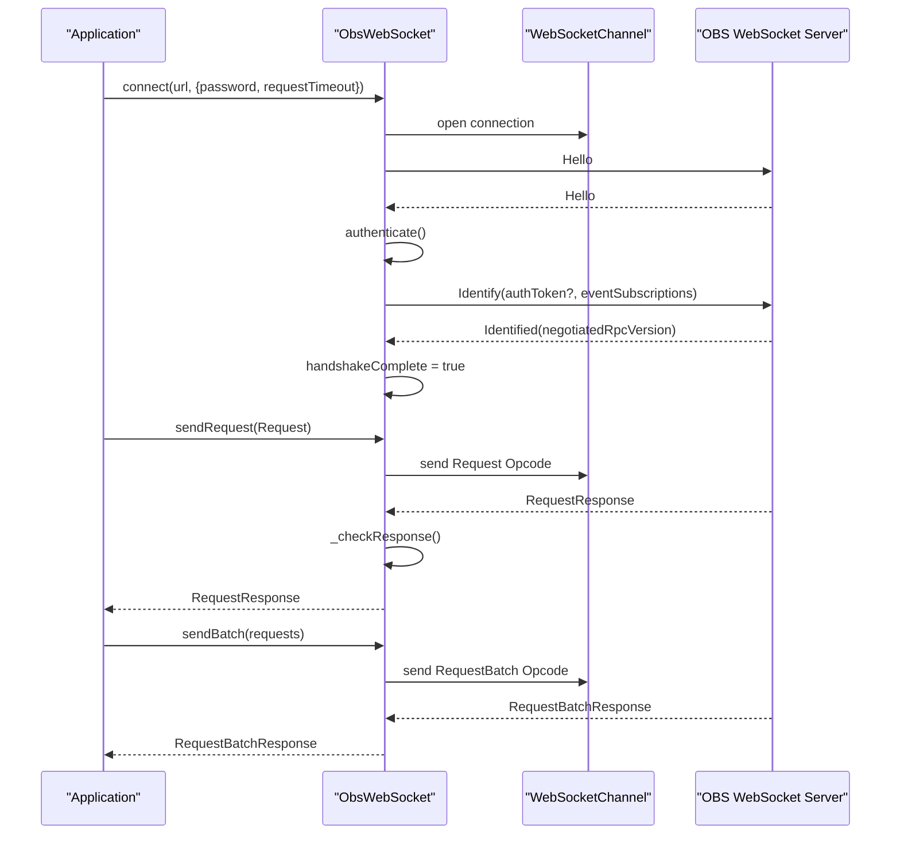
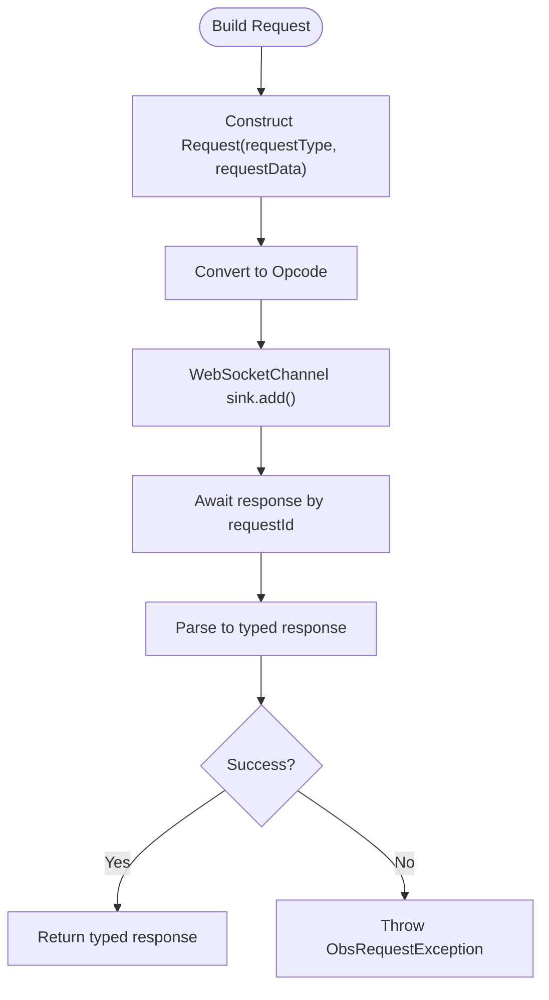
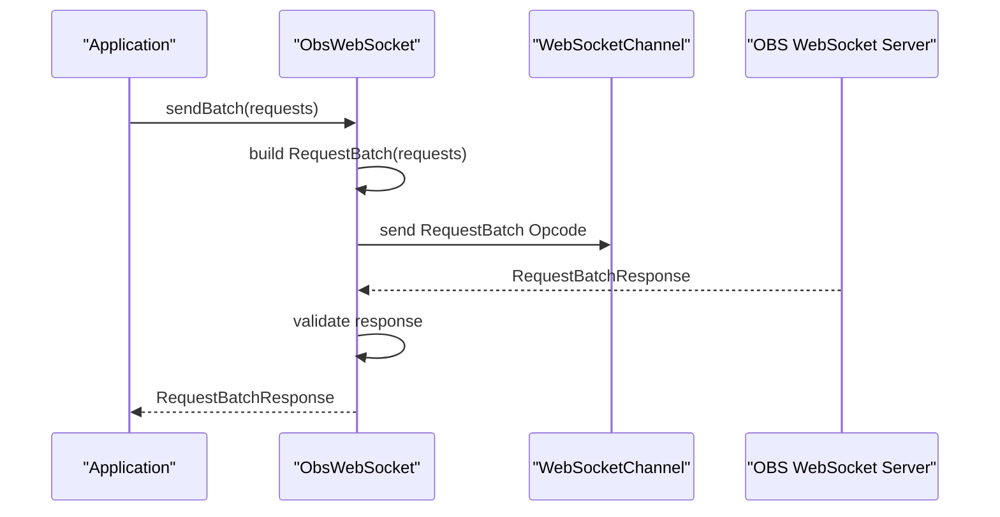
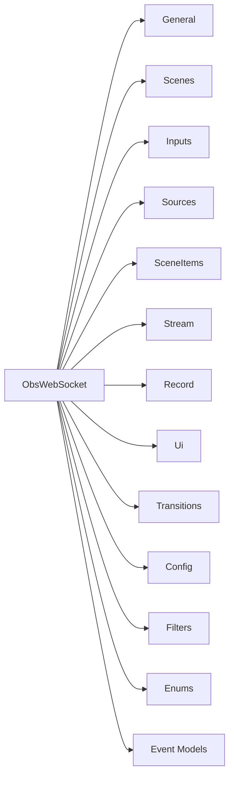

# API Reference

<cite>
**Referenced Files in This Document**
- [lib/obs_websocket.dart](file://lib/obs_websocket.dart)
- [lib/command.dart](file://lib/command.dart)
- [lib/request.dart](file://lib/request.dart)
- [lib/event.dart](file://lib/event.dart)
- [lib/src/obs_websocket_base.dart](file://lib/src/obs_websocket_base.dart)
- [lib/src/cmd/obs_general_command.dart](file://lib/src/cmd/obs_general_command.dart)
- [lib/src/request/general.dart](file://lib/src/request/general.dart)
- [lib/src/enum/obs_media_input_action.dart](file://lib/src/enum/obs_media_input_action.dart)
- [lib/src/enum/obs_media_state.dart](file://lib/src/enum/obs_media_state.dart)
- [lib/src/enum/obs_monitoring_type.dart](file://lib/src/enum/obs_monitoring_type.dart)
- [example/general.dart](file://example/general.dart)
- [example/batch.dart](file://example/batch.dart)
- [example/event.dart](file://example/event.dart)
- [example/show_scene_item.dart](file://example/show_scene_item.dart)
- [example/volume.dart](file://example/volume.dart)
</cite>

## Table of Contents
1. [Introduction](#introduction)
2. [Project Structure](#project-structure)
3. [Core Components](#core-components)
4. [Architecture Overview](#architecture-overview)
5. [Detailed Component Analysis](#detailed-component-analysis)
6. [Dependency Analysis](#dependency-analysis)
7. [Performance Considerations](#performance-considerations)
8. [Troubleshooting Guide](#troubleshooting-guide)
9. [Conclusion](#conclusion)
10. [Appendices](#appendices)

## Introduction
This document is a comprehensive API reference for the obs-websocket-dart library. It covers the main ObsWebSocket class, public methods, properties, configuration options, request/response models, event types, enums, and shared utilities. It also documents the request building system, batch request processing, and response parsing mechanisms. Guidance on parameter validation, exceptions, backward compatibility, and migration is included.

## Project Structure
The library exposes a clean surface API via top-level exports and organizes functionality by functional domains:
- Core client: ObsWebSocket class and handshake/authentication logic
- Functional request groups: config, filters, general, inputs, media inputs, outputs, scenes, scene items, record, sources, stream, transitions, ui
- Event types: categorized by domain (config, general, inputs, outputs, scenes, scene items, ui)
- Enums: media input action, media state, monitoring type
- CLI helpers: command-line helpers for general requests

```mermaid
graph TB
subgraph "Public Exports"
A["lib/obs_websocket.dart"]
B["lib/request.dart"]
C["lib/event.dart"]
D["lib/command.dart"]
end
subgraph "Core"
E["lib/src/obs_websocket_base.dart"]
end
subgraph "Request Groups"
F["lib/src/request/general.dart"]
G["lib/src/request/scenes.dart"]
H["lib/src/request/inputs.dart"]
I["lib/src/request/sources.dart"]
J["lib/src/request/scene_items.dart"]
K["lib/src/request/stream.dart"]
L["lib/src/request/record.dart"]
M["lib/src/request/ui.dart"]
N["lib/src/request/transitions.dart"]
O["lib/src/request/config.dart"]
P["lib/src/request/filters.dart"]
end
subgraph "Events"
Q["lib/event.dart"]
end
subgraph "Enums"
R["lib/src/enum/obs_media_input_action.dart"]
S["lib/src/enum/obs_media_state.dart"]
T["lib/src/enum/obs_monitoring_type.dart"]
end
A --> E
B --> F
B --> G
B --> H
B --> I
B --> J
B --> K
B --> L
B --> M
B --> N
B --> O
B --> P
C --> Q
D --> F
R --> E
S --> E
T --> E
```



**Diagram sources**
- [lib/obs_websocket.dart:1-69](file://lib/obs_websocket.dart#L1-L69)
- [lib/request.dart:1-19](file://lib/request.dart#L1-L19)
- [lib/event.dart:1-50](file://lib/event.dart#L1-L50)
- [lib/src/obs_websocket_base.dart:1-515](file://lib/src/obs_websocket_base.dart#L1-L515)
- [lib/src/request/general.dart:1-143](file://lib/src/request/general.dart#L1-L143)
- [lib/src/enum/obs_media_input_action.dart:1-14](file://lib/src/enum/obs_media_input_action.dart#L1-L14)
- [lib/src/enum/obs_media_state.dart:1-28](file://lib/src/enum/obs_media_state.dart#L1-L28)
- [lib/src/enum/obs_monitoring_type.dart:1-10](file://lib/src/enum/obs_monitoring_type.dart#L1-L10)

**Section sources**
- [lib/obs_websocket.dart:1-69](file://lib/obs_websocket.dart#L1-L69)
- [lib/request.dart:1-19](file://lib/request.dart#L1-L19)
- [lib/event.dart:1-50](file://lib/event.dart#L1-L50)
- [lib/command.dart:1-20](file://lib/command.dart#L1-L20)

## Core Components
This section documents the main ObsWebSocket class and its public interface.

- Class: ObsWebSocket
  - Purpose: Provides typed access to OBS WebSocket API, manages handshake, authentication, event subscriptions, request/response lifecycle, and batch requests.
  - Key properties:
    - negotiatedRpcVersion: Returns negotiated RPC version after handshake; throws if authentication is not completed.
    - config, filters, general, inputs, mediaInputs, outputs, record, scenes, sceneItems, sources, stream, streaming, transitions, ui: Functional request group getters.
    - requestTimeout: Default timeout for outbound requests and handshake steps.
    - password: Optional authentication password used during handshake.
    - broadcastStream: Raw WebSocket frame stream (retained for backward compatibility).
  - Key methods:
    - ObsWebSocket.connect(connectUrl, {password, timeout, requestTimeout, onDone, fallbackEventHandler, logOptions, loggyPrinter}): Static factory to establish connection and initialize handshake.
    - init(): Internal initialization that subscribes to the WebSocket stream and starts authentication.
    - authenticate(): Performs Hello/Identify handshake and sets negotiated RPC version.
    - listenForMask(eventSubscriptions): Re-identify with a specific event subscription mask.
    - subscribe(eventSubscription): Subscribe to events via EventSubscription enum(s), iterable, or raw int mask.
    - addHandler<T>(), removeHandler<T>(), addFallbackListener(), removeFallbackListener(): Event handler registration and removal.
    - send(command, [args]): Convenience to send a named request with optional arguments.
    - sendRequest(request): Sends a Request and returns a parsed RequestResponse; validates success and throws on failure.
    - sendBatch(requests): Sends a batch of requests and returns RequestBatchResponse; validates success and throws on failure.
    - close(): Gracefully closes the WebSocket and invokes onDone hook.
  - Exceptions:
    - ObsTimeoutException: Thrown when handshake or request waits exceed requestTimeout.
    - ObsRequestException: Thrown when a request response indicates failure.
    - ObsAuthException: Thrown when accessing negotiatedRpcVersion before authentication completes.
  - Backward Compatibility Notes:
    - listen(eventSubscription) is deprecated; use subscribe() instead.

```mermaid
classDiagram
class ObsWebSocket {
+Duration defaultRequestTimeout
+WebSocketChannel websocketChannel
+Stream<dynamic> broadcastStream
+String? password
+Duration requestTimeout
+bool handshakeComplete
+int? negotiatedRpcVersion
+config Config
+filters Filters
+general General
+inputs Inputs
+mediaInputs MediaInputs
+outputs Outputs
+record Record
+scenes Scenes
+sceneItems SceneItems
+sources Sources
+stream Stream
+streaming Stream
+transitions Transitions
+ui Ui
+ObsWebSocket.connect(connectUrl, {...})
+init()
+authenticate()
+listenForMask(eventSubscriptions)
+subscribe(eventSubscription)
+addHandler<T>(listener)
+removeHandler<T>([listener])
+addFallbackListener(listener)
+removeFallbackListener(listener)
+send(command, [args])
+sendRequest(request)
+sendBatch(requests)
+close()
}
```

**Diagram sources**
- [lib/src/obs_websocket_base.dart:21-515](file://lib/src/obs_websocket_base.dart#L21-L515)

**Section sources**
- [lib/src/obs_websocket_base.dart:21-515](file://lib/src/obs_websocket_base.dart#L21-L515)

## Architecture Overview
The client follows a typed request/response model over WebSocket:
- Outgoing: Application constructs a Request, which is serialized to an Opcode and sent.
- Incoming: Server replies with Opcode(s) for events, request responses, or batch responses.
- Parsing: Responses are deserialized into typed models (e.g., VersionResponse, StatsResponse).
- Events: Event OpCodes are decoded into typed event classes and dispatched to registered handlers.



**Diagram sources**
- [lib/src/obs_websocket_base.dart:130-318](file://lib/src/obs_websocket_base.dart#L130-L318)
- [lib/src/obs_websocket_base.dart:448-503](file://lib/src/obs_websocket_base.dart#L448-L503)

## Detailed Component Analysis

### ObsWebSocket Class
- Constructor and connection:
  - ObsWebSocket(websocketChannel, {password, onDone, fallbackEventHandler, requestTimeout})
  - Static factory ObsWebSocket.connect(connectUrl, {...}) handles URL normalization, connection, logging initialization, and handshake.
- Authentication:
  - authenticate(): Waits for Hello, computes challenge-response hash if required, sends Identify, and records negotiated RPC version.
- Event subscription:
  - subscribe(): Accepts EventSubscription, iterable of EventSubscription, or int mask; re-identifies with the computed mask.
- Request lifecycle:
  - sendRequest(): Tracks pending requests by requestId, serializes Request to Opcode, awaits response, validates status, and returns typed response.
  - sendBatch(): Builds RequestBatch, tracks by requestId, sends, awaits, validates, and returns results.
- Error handling:
  - _handleStreamError(): Completes all pending requests/batches and handshake with errors to prevent hangs.
  - _checkResponse(): Throws ObsRequestException when request status indicates failure.
  - ObsTimeoutException thrown on timeouts for handshake opcodes and requests.

**Section sources**
- [lib/src/obs_websocket_base.dart:118-168](file://lib/src/obs_websocket_base.dart#L118-L168)
- [lib/src/obs_websocket_base.dart:260-318](file://lib/src/obs_websocket_base.dart#L260-L318)
- [lib/src/obs_websocket_base.dart:354-372](file://lib/src/obs_websocket_base.dart#L354-L372)
- [lib/src/obs_websocket_base.dart:448-503](file://lib/src/obs_websocket_base.dart#L448-L503)
- [lib/src/obs_websocket_base.dart:453-475](file://lib/src/obs_websocket_base.dart#L453-L475)
- [lib/src/obs_websocket_base.dart:238-258](file://lib/src/obs_websocket_base.dart#L238-L258)

### Request Building System
- Request class: Encapsulates requestType and requestData; converted to Opcode for transport.
- Functional request groups: Each group (e.g., General, Scenes, Inputs) exposes methods that construct and send Requests, returning typed responses.
- Example: General.getVersion() sends "GetVersion" and parses VersionResponse.



**Diagram sources**
- [lib/src/obs_websocket_base.dart:477-503](file://lib/src/obs_websocket_base.dart#L477-L503)

**Section sources**
- [lib/src/request/general.dart:21-25](file://lib/src/request/general.dart#L21-L25)
- [lib/src/request/general.dart:39-43](file://lib/src/request/general.dart#L39-L43)

### Batch Request Processing
- RequestBatch: Aggregates multiple Request objects into a single Opcode.
- sendBatch(requests):
  - Creates RequestBatch, registers a Completer keyed by requestId, sends, awaits, validates, and returns RequestBatchResponse.
- Validation: On timeout, throws ObsTimeoutException; on unknown requestId, logs warning and ignores out-of-band responses.



**Diagram sources**
- [lib/src/obs_websocket_base.dart:453-475](file://lib/src/obs_websocket_base.dart#L453-L475)

**Section sources**
- [lib/src/obs_websocket_base.dart:453-475](file://lib/src/obs_websocket_base.dart#L453-L475)

### Response Parsing Mechanisms
- RequestResponse: Base response container with requestType, requestId, and requestStatus.
- RequestBatchResponse: Container for batch results.
- Typed responses: VersionResponse, StatsResponse, StringListResponse, etc., are parsed from responseData.
- Event decoding: Event OpCodes are decoded into typed event classes via a factory registry.

**Section sources**
- [lib/src/obs_websocket_base.dart:202-227](file://lib/src/obs_websocket_base.dart#L202-L227)
- [lib/src/obs_websocket_base.dart:374-395](file://lib/src/obs_websocket_base.dart#L374-L395)

### Enumerations and Constants
- ObsMediaInputAction: Defines media actions (none, play, pause, stop, restart, next, previous) with associated string codes.
- ObsMediaState: Defines media playback states (none, playing, opening, buffering, paused, stopped, ended, error) with JSON conversion helpers.
- ObsMonitoringType: Defines monitoring modes (none, monitorOnly, monitorAndOutput) with associated string codes.

**Section sources**
- [lib/src/enum/obs_media_input_action.dart:1-14](file://lib/src/enum/obs_media_input_action.dart#L1-L14)
- [lib/src/enum/obs_media_state.dart:1-28](file://lib/src/enum/obs_media_state.dart#L1-L28)
- [lib/src/enum/obs_monitoring_type.dart:1-10](file://lib/src/enum/obs_monitoring_type.dart#L1-L10)

### Event Types
- Event categories:
  - Config: Current profile changed, scene collection changed, lists changed.
  - General: Custom events, exit started, vendor events.
  - Inputs: Active state, mute state, volume, settings, creation/removal, etc.
  - Outputs: Stream, record, replay buffer, virtual camera states.
  - Scenes: Current program/preview scene changes, scene list changes, scene name changes, creation/removal.
  - Scene Items: Creation, selection, enable state changes, removal.
  - UI: Screenshot saved, studio mode state changed.
- Event dispatch:
  - ObsWebSocket routes incoming Event OpCodes to typed handlers by eventType; falls back to a generic handler if no typed decoder exists.

**Section sources**
- [lib/event.dart:1-50](file://lib/event.dart#L1-L50)
- [lib/src/obs_websocket_base.dart:374-395](file://lib/src/obs_websocket_base.dart#L374-L395)

### Shared Utility Classes
- KeyModifiers: Used for hotkey sequences.
- SourceScreenshot: Used for screenshot capture requests.
- VideoSettings: Used for video configuration requests.
- These are exported for use in request data.

**Section sources**
- [lib/obs_websocket.dart:53-55](file://lib/obs_websocket.dart#L53-L55)

### CLI Helpers (General Requests)
- ObsGeneralCommand: Top-level command grouping for general requests.
- Subcommands include:
  - get-version: Calls General.getVersion().
  - get-stats: Calls General.getStats().
  - broadcast-custom-event: Calls General.broadcastCustomEvent().
  - call-vendor-request: Calls General.callVendorRequest().
  - obs-browser-event: Calls General.obsBrowserEvent().
  - get-hotkey-list: Calls General.getHotkeyList().
  - trigger-hotkey-by-name: Calls General.triggerHotkeyByName().
  - trigger-hotkey-by-key-sequence: Calls General.triggerHotkeyByKeySequence().
  - sleep: Calls General.sleep().

**Section sources**
- [lib/src/cmd/obs_general_command.dart:8-306](file://lib/src/cmd/obs_general_command.dart#L8-L306)

## Dependency Analysis
ObsWebSocket composes functional request groups and delegates to shared models and utilities.



**Diagram sources**
- [lib/src/obs_websocket_base.dart:56-105](file://lib/src/obs_websocket_base.dart#L56-L105)
- [lib/src/enum/obs_media_input_action.dart:1-14](file://lib/src/enum/obs_media_input_action.dart#L1-L14)
- [lib/src/enum/obs_media_state.dart:1-28](file://lib/src/enum/obs_media_state.dart#L1-L28)
- [lib/src/enum/obs_monitoring_type.dart:1-10](file://lib/src/enum/obs_monitoring_type.dart#L1-L10)

**Section sources**
- [lib/src/obs_websocket_base.dart:56-105](file://lib/src/obs_websocket_base.dart#L56-L105)

## Performance Considerations
- Use sendBatch() to reduce round-trips when issuing multiple independent requests.
- Prefer subscribe() with specific EventSubscription masks to minimize event traffic.
- Tune requestTimeout appropriately for network conditions and expected operation latency.
- Avoid excessive event handler registrations; use targeted handlers to reduce overhead.

## Troubleshooting Guide
- Authentication failures:
  - Ensure password matches OBS websocket authentication settings when server requires authentication.
  - Verify the server supports the negotiated RPC version.
- Timeouts:
  - Increase requestTimeout for slow networks or heavy workloads.
  - Check for server-side delays or high load.
- Unknown request IDs:
  - Occasional mismatch can occur; inspect logs and retry.
- Event handling:
  - Register typed handlers for known event types; use addFallbackListener() to capture unhandled events.

**Section sources**
- [lib/src/obs_websocket_base.dart:238-258](file://lib/src/obs_websocket_base.dart#L238-L258)
- [lib/src/obs_websocket_base.dart:202-227](file://lib/src/obs_websocket_base.dart#L202-L227)

## Conclusion
The obs-websocket-dart library provides a robust, typed interface to the OBS WebSocket API. ObsWebSocket centralizes connection, authentication, event routing, and request/response handling. Functional request groups encapsulate domain-specific operations, while enums and shared models define consistent data contracts. Use batch requests for performance, subscribe to specific events for efficiency, and leverage typed responses and events for reliable integrations.

## Appendices

### API Endpoints and Method Signatures (Selected)
Note: The following entries describe method roles and return types. Refer to the source files for precise signatures and line ranges.

- ObsWebSocket.connect(connectUrl, {password, timeout, requestTimeout, onDone, fallbackEventHandler, logOptions, loggyPrinter})
  - Description: Establishes WebSocket connection and initializes handshake.
  - Returns: Future<ObsWebSocket>
  - Exceptions: Throws on connection or handshake timeout.
  - Section sources
    - [lib/src/obs_websocket_base.dart:130-168](file://lib/src/obs_websocket_base.dart#L130-L168)

- ObsWebSocket.authenticate()
  - Description: Performs Hello/Identify handshake and sets negotiatedRpcVersion.
  - Returns: Future<void>
  - Exceptions: ObsTimeoutException on timeout.
  - Section sources
    - [lib/src/obs_websocket_base.dart:260-318](file://lib/src/obs_websocket_base.dart#L260-L318)

- ObsWebSocket.subscribe(eventSubscription)
  - Description: Subscribes to events via EventSubscription, iterable, or int mask.
  - Returns: Future<void>
  - Exceptions: ArgumentError for invalid input type.
  - Section sources
    - [lib/src/obs_websocket_base.dart:354-372](file://lib/src/obs_websocket_base.dart#L354-L372)

- ObsWebSocket.sendRequest(request)
  - Description: Sends a Request and returns a typed RequestResponse.
  - Returns: Future<RequestResponse?>
  - Exceptions: ObsRequestException on failure; ObsTimeoutException on timeout.
  - Section sources
    - [lib/src/obs_websocket_base.dart:477-503](file://lib/src/obs_websocket_base.dart#L477-L503)

- ObsWebSocket.sendBatch(requests)
  - Description: Sends a batch of requests and returns RequestBatchResponse.
  - Returns: Future<RequestBatchResponse>
  - Exceptions: ObsTimeoutException on timeout.
  - Section sources
    - [lib/src/obs_websocket_base.dart:453-475](file://lib/src/obs_websocket_base.dart#L453-L475)

- General.getVersion()
  - Description: Retrieves plugin and RPC version information.
  - Returns: Future<VersionResponse>
  - Exceptions: ObsRequestException on failure.
  - Section sources
    - [lib/src/request/general.dart:21-25](file://lib/src/request/general.dart#L21-L25)

- General.getStats()
  - Description: Retrieves OBS, plugin, and session statistics.
  - Returns: Future<StatsResponse>
  - Exceptions: ObsRequestException on failure.
  - Section sources
    - [lib/src/request/general.dart:39-43](file://lib/src/request/general.dart#L39-L43)

- General.broadcastCustomEvent(args)
  - Description: Broadcasts a custom event payload to subscribers.
  - Returns: Future<void>
  - Exceptions: ObsRequestException on failure.
  - Section sources
    - [lib/src/request/general.dart:50-53](file://lib/src/request/general.dart#L50-L53)

- General.callVendorRequest(vendorName, requestType, requestData)
  - Description: Calls a vendor-defined request.
  - Returns: Future<CallVendorRequestResponse>
  - Exceptions: ObsRequestException on failure.
  - Section sources
    - [lib/src/request/general.dart:62-79](file://lib/src/request/general.dart#L62-L79)

- General.obsBrowserEvent(eventName, eventData)
  - Description: Helper to emit an event to the obs-browser vendor.
  - Returns: Future<CallVendorRequestResponse>
  - Exceptions: ObsRequestException on failure.
  - Section sources
    - [lib/src/request/general.dart:82-89](file://lib/src/request/general.dart#L82-L89)

- General.getHotkeyList()
  - Description: Lists all hotkey names in OBS.
  - Returns: Future<List<String>>
  - Exceptions: ObsRequestException on failure.
  - Section sources
    - [lib/src/request/general.dart:103-107](file://lib/src/request/general.dart#L103-L107)

- General.triggerHotkeyByName(hotkeyName)
  - Description: Triggers a hotkey by name.
  - Returns: Future<void>
  - Exceptions: ObsRequestException on failure.
  - Section sources
    - [lib/src/request/general.dart:109-113](file://lib/src/request/general.dart#L109-L113)

- General.triggerHotkeyByKeySequence(keyId, keyModifiers)
  - Description: Triggers a hotkey by key sequence with modifiers.
  - Returns: Future<void>
  - Exceptions: ObsRequestException on failure.
  - Section sources
    - [lib/src/request/general.dart:120-128](file://lib/src/request/general.dart#L120-L128)

- General.sleep(sleepMillis, sleepFrames)
  - Description: Sleeps for milliseconds or frames (only in batch modes).
  - Returns: Future<void>
  - Exceptions: ObsRequestException on failure.
  - Section sources
    - [lib/src/request/general.dart:135-141](file://lib/src/request/general.dart#L135-L141)

### Parameter Validation Rules and Constraints
- subscribe(eventSubscription):
  - Must be EventSubscription, Iterable<EventSubscription>, or int mask; otherwise throws ArgumentError.
- ObsWebSocket.connect():
  - connectUrl is normalized to ws:// or wss:// if missing; otherwise used as-is.
- sendRequest()/sendBatch():
  - requestTimeout applies; timeouts raise ObsTimeoutException.
- Event handlers:
  - addHandler<T>() stores handlers by type string; removeHandler<T>() clears all handlers for type.

**Section sources**
- [lib/src/obs_websocket_base.dart:354-372](file://lib/src/obs_websocket_base.dart#L354-L372)
- [lib/src/obs_websocket_base.dart:145-147](file://lib/src/obs_websocket_base.dart#L145-L147)
- [lib/src/obs_websocket_base.dart:477-503](file://lib/src/obs_websocket_base.dart#L477-L503)
- [lib/src/obs_websocket_base.dart:453-475](file://lib/src/obs_websocket_base.dart#L453-L475)

### Backward Compatibility and Deprecation
- ObsWebSocket.listen(eventSubscription) is deprecated; use subscribe(eventSubscription) instead.
- Event subscription masks:
  - listenForMask(eventSubscriptions) remains for internal use; prefer subscribe() with EventSubscription or int masks.

**Section sources**
- [lib/src/obs_websocket_base.dart:349-350](file://lib/src/obs_websocket_base.dart#L349-L350)
- [lib/src/obs_websocket_base.dart:338-346](file://lib/src/obs_websocket_base.dart#L338-L346)

### Migration Guidance
- Replace direct usage of listen() with subscribe().
- Prefer strongly-typed EventSubscription masks or int masks via subscribe() for clarity and safety.
- When upgrading, verify negotiatedRpcVersion availability and adjust expectations accordingly.

### Code Examples (by functional area)
- General requests:
  - Example: [example/general.dart](file://example/general.dart)
- Batch requests:
  - Example: [example/batch.dart](file://example/batch.dart)
- Event handling:
  - Example: [example/event.dart](file://example/event.dart)
- Scene item operations:
  - Example: [example/show_scene_item.dart](file://example/show_scene_item.dart)
- Volume control:
  - Example: [example/volume.dart](file://example/volume.dart)