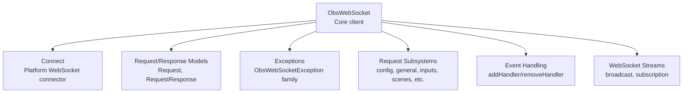
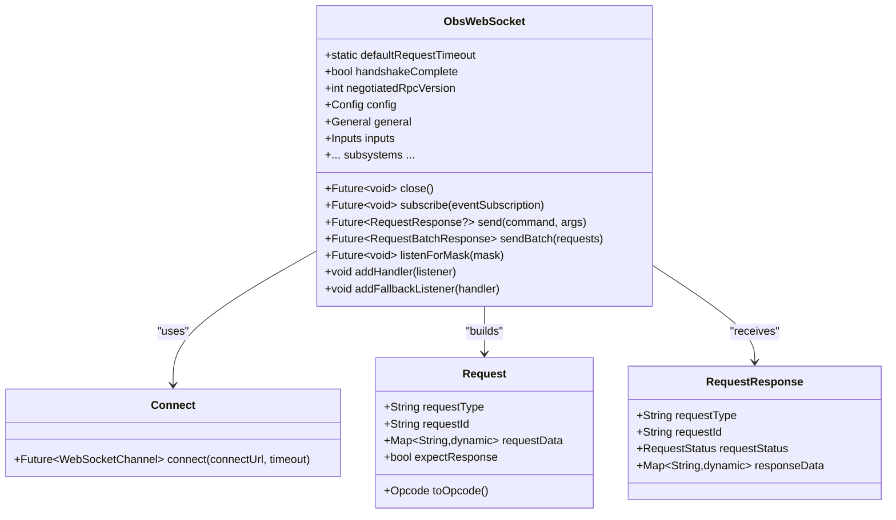
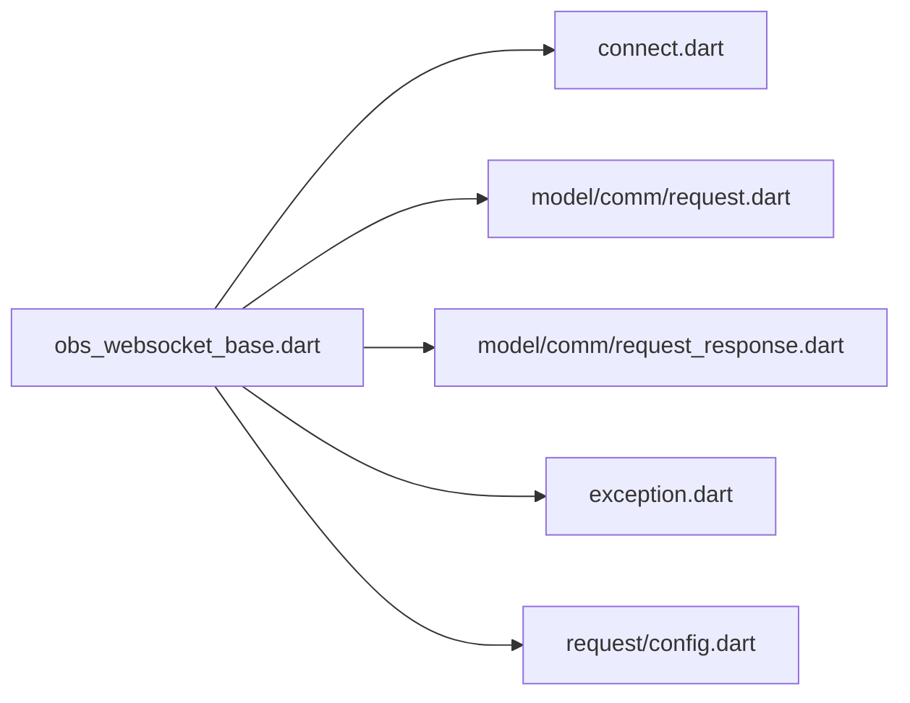

# Core Client API

<cite>
**Referenced Files in This Document**
- [obs_websocket_base.dart](file://lib/src/obs_websocket_base.dart)
- [exception.dart](file://lib/src/exception.dart)
- [connect.dart](file://lib/src/connect.dart)
- [request.dart](file://lib/request.dart)
- [config.dart](file://lib/src/request/config.dart)
- [request.dart](file://lib/src/model/comm/request.dart)
- [request_response.dart](file://lib/src/model/comm/request_response.dart)
- [README.md](file://README.md)
- [general.dart](file://example/general.dart)
- [event.dart](file://example/event.dart)
</cite>

## Table of Contents
1. [Introduction](#introduction)
2. [Project Structure](#project-structure)
3. [Core Components](#core-components)
4. [Architecture Overview](#architecture-overview)
5. [Detailed Component Analysis](#detailed-component-analysis)
6. [Dependency Analysis](#dependency-analysis)
7. [Performance Considerations](#performance-considerations)
8. [Troubleshooting Guide](#troubleshooting-guide)
9. [Conclusion](#conclusion)

## Introduction
This document provides comprehensive API documentation for the core ObsWebSocket client class and its fundamental methods. It covers the main constructor parameters, connection management, authentication handling, configuration options, public properties, error handling patterns, timeouts, and lifecycle operations. It also includes practical usage guidance and diagrams to illustrate key flows.

## Project Structure
The ObsWebSocket Dart client exposes a high-level API centered around a single client class that manages WebSocket connectivity, request/response orchestration, event subscriptions, and typed event handling. Supporting modules include:
- Core client class and lifecycle management
- Exception hierarchy for robust error handling
- Connection abstraction for platform-specific WebSocket creation
- Request/response models and typed request helpers
- Examples demonstrating typical usage patterns

**Diagram sources**
- [obs_websocket_base.dart:21-128](file://lib/src/obs_websocket_base.dart#L21-L128)
- [connect.dart:7-14](file://lib/src/connect.dart#L7-L14)
- [request.dart:10-37](file://lib/src/model/comm/request.dart#L10-L37)
- [request_response.dart:9-30](file://lib/src/model/comm/request_response.dart#L9-L30)

**Section sources**
- [obs_websocket_base.dart:1-515](file://lib/src/obs_websocket_base.dart#L1-L515)
- [README.md:1-566](file://README.md#L1-L566)

## Core Components
This section documents the primary client class, its constructor, public properties, and essential methods for connection management, authentication, request/response handling, and event subscription.

- Constructor and initialization
  - Factory constructor: ObsWebSocket.connect(...)
  - Direct constructor: ObsWebSocket(websocketChannel, ...)
  - Initialization: internal init() sets up stream subscription and authentication

- Public properties
  - Connection state indicators and metadata exposed via getters
  - Subsystem accessors for request categories (config, general, inputs, scenes, etc.)

- Connection management
  - connect(...) establishes WebSocket and performs handshake
  - close() gracefully closes the connection and cancels subscriptions
  - listenForMask(...)/subscribe(...) control event subscriptions

- Authentication
  - authenticate() handles Hello/Identify handshake and optional password-based challenge-response
  - Negotiated RPC version is captured upon successful authentication

- Request/response pipeline
  - send(...) and sendRequest(...) for individual requests
  - sendBatch(...) for batched requests
  - Timeout handling via requestTimeout
  - Response validation and structured error propagation

- Event handling
  - addHandler<T>(...) registers typed event handlers
  - addFallbackListener(...) captures untyped or unsupported events
  - _handleEvent(...) routes incoming events to handlers

- Logging and hooks
  - Loggy-based logging with configurable LogOptions and printer
  - onDone callback invoked during close()

**Section sources**
- [obs_websocket_base.dart:118-168](file://lib/src/obs_websocket_base.dart#L118-L168)
- [obs_websocket_base.dart:171-178](file://lib/src/obs_websocket_base.dart#L171-L178)
- [obs_websocket_base.dart:260-318](file://lib/src/obs_websocket_base.dart#L260-L318)
- [obs_websocket_base.dart:337-372](file://lib/src/obs_websocket_base.dart#L337-L372)
- [obs_websocket_base.dart:448-503](file://lib/src/obs_websocket_base.dart#L448-L503)
- [obs_websocket_base.dart:410-446](file://lib/src/obs_websocket_base.dart#L410-L446)
- [obs_websocket_base.dart:398-408](file://lib/src/obs_websocket_base.dart#L398-L408)

## Architecture Overview
The client architecture centers on a single ObsWebSocket instance that encapsulates:
- WebSocket transport via a platform abstraction
- Protocol-level handshake and authentication
- Request/response orchestration with timeouts
- Event routing and typed handler dispatch
- Subsystem helpers for common request categories

**Diagram sources**
- [obs_websocket_base.dart:21-128](file://lib/src/obs_websocket_base.dart#L21-L128)
- [connect.dart:7-14](file://lib/src/connect.dart#L7-L14)
- [request.dart:10-37](file://lib/src/model/comm/request.dart#L10-L37)
- [request_response.dart:9-30](file://lib/src/model/comm/request_response.dart#L9-L30)

## Detailed Component Analysis

### ObsWebSocket.connect(...)
Establishes a WebSocket connection and initializes the client.

- Purpose
  - Create and open a WebSocket channel
  - Initialize logging
  - Construct ObsWebSocket instance
  - Perform handshake and authentication

- Parameters
  - connectUrl: Target WebSocket endpoint (auto-prefixed with ws:// if missing)
  - password: Optional obs-websocket password for authentication
  - timeout: Connection establishment timeout
  - requestTimeout: Default timeout for requests and handshake steps
  - onDone: Callback invoked on close()
  - fallbackEventHandler: Handler for untyped/unrecognized events
  - logOptions: Loggy configuration
  - printer: Loggy printer customization

- Behavior
  - Validates and normalizes connectUrl
  - Uses Connect abstraction to establish channel
  - Constructs ObsWebSocket and calls init()
  - Calls authenticate() and awaits handshake completion

- Returns
  - Future<ObsWebSocket> representing the initialized client

- Exceptions
  - Propagates underlying connection and handshake errors
  - Throws ObsTimeoutException if handshake steps exceed requestTimeout

- Example usage
  - See [general.dart:10-17](file://example/general.dart#L10-L17) and [event.dart:10-17](file://example/event.dart#L10-L17)

**Section sources**
- [obs_websocket_base.dart:130-168](file://lib/src/obs_websocket_base.dart#L130-L168)
- [connect.dart:7-14](file://lib/src/connect.dart#L7-L14)
- [README.md:72-86](file://README.md#L72-L86)

### ObsWebSocket Constructor (Direct)
Creates a client bound to an existing WebSocketChannel.

- Parameters
  - websocketChannel: Existing WebSocketChannel
  - password: Optional authentication password
  - onDone: Optional callback invoked on close()
  - fallbackEventHandler: Optional fallback event handler
  - requestTimeout: Default timeout for requests

- Behavior
  - Wraps the channel with a broadcast stream
  - Optionally registers a fallback event handler
  - Initializes subsystem accessors lazily

- Notes
  - Requires external WebSocket establishment

**Section sources**
- [obs_websocket_base.dart:118-128](file://lib/src/obs_websocket_base.dart#L118-L128)

### ObsWebSocket.init()
Initializes the client after construction.

- Behavior
  - Subscribes to the broadcast stream
  - Registers error and message handlers
  - Calls authenticate()

**Section sources**
- [obs_websocket_base.dart:171-178](file://lib/src/obs_websocket_base.dart#L171-L178)

### ObsWebSocket.authenticate()
Performs the obs-websocket handshake and optional authentication.

- Steps
  - Waits for Hello opcode
  - Parses Hello for authentication requirements
  - Computes challenge-response hash if password is provided
  - Sends Identify with event subscriptions
  - Awaits Identified opcode
  - Captures negotiated RPC version

- Error handling
  - Throws ObsTimeoutException if handshake exceeds requestTimeout
  - Throws ObsAuthException if authentication fails

- Thread safety
  - Single outstanding handshake at a time via internal completer

**Section sources**
- [obs_websocket_base.dart:260-318](file://lib/src/obs_websocket_base.dart#L260-L318)

### ObsWebSocket.close()
Gracefully closes the connection and cleans up resources.

- Behavior
  - Invokes onDone hook if provided
  - Cancels stream subscription
  - Closes WebSocket sink with normal closure status

- Idempotence
  - Safe to call multiple times

**Section sources**
- [obs_websocket_base.dart:398-408](file://lib/src/obs_websocket_base.dart#L398-L408)

### ObsWebSocket.subscribe(...)
Configures event subscriptions.

- Overloads
  - subscribe(EventSubscription) or subscribe(int mask)
  - subscribe(Iterable<EventSubscription>)
  - Deprecated alias: listen(Object)

- Behavior
  - Converts inputs to a bitmask
  - Sends ReIdentify opcode to update subscriptions
  - Validates argument types

- Error handling
  - Throws ArgumentError for invalid eventSubscription types

**Section sources**
- [obs_websocket_base.dart:352-372](file://lib/src/obs_websocket_base.dart#L352-L372)

### ObsWebSocket.send(...) and sendRequest(...)
Sends a single request and returns a typed response.

- send(...)
  - Convenience wrapper around sendRequest(Request(...))
  - Accepts command string and optional args map

- sendRequest(Request)
  - Assigns a unique requestId
  - Registers a Completer for response correlation
  - Sends Request opcode
  - Awaits response with timeout
  - Validates response status and throws ObsRequestException on failure

- Error handling
  - ObsTimeoutException on timeout
  - ObsRequestException on non-success status
  - ObsProtocolException for malformed data (via internal checks)

- Thread safety
  - Pending requests tracked per requestId
  - Race-free response delivery guarded by completer map

**Section sources**
- [obs_websocket_base.dart:448-503](file://lib/src/obs_websocket_base.dart#L448-L503)
- [request.dart:10-37](file://lib/src/model/comm/request.dart#L10-L37)
- [request_response.dart:9-30](file://lib/src/model/comm/request_response.dart#L9-L30)

### ObsWebSocket.sendBatch(...)
Sends a batch of requests atomically.

- Behavior
  - Builds RequestBatch with provided requests
  - Registers a Completer keyed by batch requestId
  - Sends RequestBatch opcode
  - Awaits batch response with timeout
  - Returns RequestBatchResponse

- Error handling
  - ObsTimeoutException on timeout

**Section sources**
- [obs_websocket_base.dart:453-475](file://lib/src/obs_websocket_base.dart#L453-L475)

### ObsWebSocket Event Handling
- addHandler<T>(listener)
  - Registers a typed event handler for type T
  - Handlers receive decoded event instances

- addFallbackListener(handler)
  - Registers a fallback handler for unrecognized or untyped events

- _handleEvent(event)
  - Routes events to registered handlers
  - Falls back to fallback handlers if none match

**Section sources**
- [obs_websocket_base.dart:410-446](file://lib/src/obs_websocket_base.dart#L410-L446)

### Public Properties
- handshakeComplete: Boolean indicating successful handshake
- negotiatedRpcVersion: RPC version negotiated during authentication (throws if accessed before authentication)
- Subsystem accessors: config, general, inputs, mediaInputs, outputs, scenes, sceneItems, record, sources, stream, transitions, ui, streaming (alias for stream)

- Notes
  - Accessing negotiatedRpcVersion before authentication raises ObsAuthException

**Section sources**
- [obs_websocket_base.dart:70-105](file://lib/src/obs_websocket_base.dart#L70-L105)
- [obs_websocket_base.dart:74-76](file://lib/src/obs_websocket_base.dart#L74-L76)

### Configuration Options
- requestTimeout: Default timeout for requests and handshake steps
- password: Optional authentication password
- onDone: Optional callback invoked on close()
- LogOptions and printer: Configure logging verbosity and output

**Section sources**
- [obs_websocket_base.dart:118-128](file://lib/src/obs_websocket_base.dart#L118-L128)
- [obs_websocket_base.dart:130-168](file://lib/src/obs_websocket_base.dart#L130-L168)

### Parameter Validation Rules
- connectUrl: Must be a valid ws/wss URL; missing scheme is auto-corrected
- subscribe(eventSubscription): Must be EventSubscription, Iterable<EventSubscription>, or int
- Request.requestType: Required; Request.requestId: auto-generated
- Request.expectResponse: Defaults based on requestType prefix

**Section sources**
- [obs_websocket_base.dart:145-147](file://lib/src/obs_websocket_base.dart#L145-L147)
- [obs_websocket_base.dart:364-368](file://lib/src/obs_websocket_base.dart#L364-L368)
- [request.dart:19-22](file://lib/src/model/comm/request.dart#L19-L22)

### Timeout Configurations
- defaultRequestTimeout: Static constant applied when caller does not specify a timeout
- requestTimeout: Per-client default used for handshake and request waits
- Individual timeouts: Each request and batch operation respects its own timeout

**Section sources**
- [obs_websocket_base.dart:22-24](file://lib/src/obs_websocket_base.dart#L22-L24)
- [obs_websocket_base.dart](file://lib/src/obs_websocket_base.dart#L134)
- [obs_websocket_base.dart](file://lib/src/obs_websocket_base.dart#L299)
- [obs_websocket_base.dart](file://lib/src/obs_websocket_base.dart#L326)
- [obs_websocket_base.dart](file://lib/src/obs_websocket_base.dart#L465)

### Connection Pooling Options
- The client maintains a single WebSocketChannel per instance
- No built-in connection pooling; manage multiple clients independently if needed

**Section sources**
- [obs_websocket_base.dart:26-30](file://lib/src/obs_websocket_base.dart#L26-L30)

### Thread Safety Considerations
- Internal maps for pending requests and batches are guarded by per-request keys
- Stream subscription is managed by a single subscription reference
- Event dispatch occurs synchronously within the message handler
- Concurrency patterns
  - Multiple concurrent requests are supported via separate requestIds
  - Event handlers execute sequentially per event type bucket
  - No explicit synchronization primitives are used; rely on single-threaded event loop semantics

**Section sources**
- [obs_websocket_base.dart:45-47](file://lib/src/obs_websocket_base.dart#L45-L47)
- [obs_websocket_base.dart:171-178](file://lib/src/obs_websocket_base.dart#L171-L178)
- [obs_websocket_base.dart:374-395](file://lib/src/obs_websocket_base.dart#L374-L395)

### Retry Mechanisms
- Built-in retry: None
- Recommended pattern: Wrap send/sendRequest in application-level retry logic with exponential backoff when encountering transient ObsTimeoutException or network errors

**Section sources**
- [obs_websocket_base.dart:488-494](file://lib/src/obs_websocket_base.dart#L488-L494)

## Dependency Analysis
ObsWebSocket depends on:
- Platform WebSocket abstraction via Connect
- Request/response models for protocol serialization
- Logging via Loggy
- Event subsystems for categorized request helpers

**Diagram sources**
- [obs_websocket_base.dart:1-10](file://lib/src/obs_websocket_base.dart#L1-L10)
- [connect.dart:1-14](file://lib/src/connect.dart#L1-L14)
- [request.dart:1-37](file://lib/src/model/comm/request.dart#L1-L37)
- [request_response.dart:1-30](file://lib/src/model/comm/request_response.dart#L1-L30)
- [exception.dart:1-77](file://lib/src/exception.dart#L1-L77)
- [config.dart:1-268](file://lib/src/request/config.dart#L1-L268)

**Section sources**
- [obs_websocket_base.dart:1-10](file://lib/src/obs_websocket_base.dart#L1-L10)
- [config.dart:1-268](file://lib/src/request/config.dart#L1-L268)

## Performance Considerations
- Prefer batching requests with sendBatch(...) to reduce round-trips when performing multiple related operations
- Use targeted event subscriptions via subscribe(...) to minimize event processing overhead
- Tune requestTimeout to balance responsiveness and reliability for your environment
- Avoid excessive concurrent requests to prevent overwhelming the server

[No sources needed since this section provides general guidance]

## Troubleshooting Guide
Common issues and resolutions:

- Authentication failures
  - Symptom: ObsAuthException during authenticate()
  - Causes: Incorrect password, authentication disabled in OBS, mismatched RPC version
  - Resolution: Verify OBS password and settings; confirm negotiatedRpcVersion after handshake

- Timeouts
  - Symptom: ObsTimeoutException for handshake or request
  - Causes: Slow network, overloaded OBS instance, insufficient requestTimeout
  - Resolution: Increase requestTimeout; retry with backoff; check OBS logs

- Malformed responses
  - Symptom: ObsProtocolException or request validation failures
  - Causes: Unexpected protocol changes or corrupted frames
  - Resolution: Upgrade client; inspect logs; validate request payloads

- Event handling gaps
  - Symptom: Missing typed events
  - Resolution: Register fallback handlers; use addFallbackListener(...) to capture untyped events

- Connection leaks
  - Symptom: Resource warnings or hanging sockets
  - Resolution: Always call close(); ensure onDone hook is used for cleanup

**Section sources**
- [exception.dart:29-76](file://lib/src/exception.dart#L29-L76)
- [obs_websocket_base.dart:252-258](file://lib/src/obs_websocket_base.dart#L252-L258)
- [obs_websocket_base.dart:505-513](file://lib/src/obs_websocket_base.dart#L505-L513)

## Conclusion
The ObsWebSocket client provides a robust, typed interface for interacting with obs-websocket protocol v5.x. Its design emphasizes clear separation of concerns, strong typing for requests/responses, and flexible event handling. By leveraging the documented APIs, timeouts, and error handling patterns, developers can build reliable integrations with OBS while maintaining clean resource management and predictable behavior.