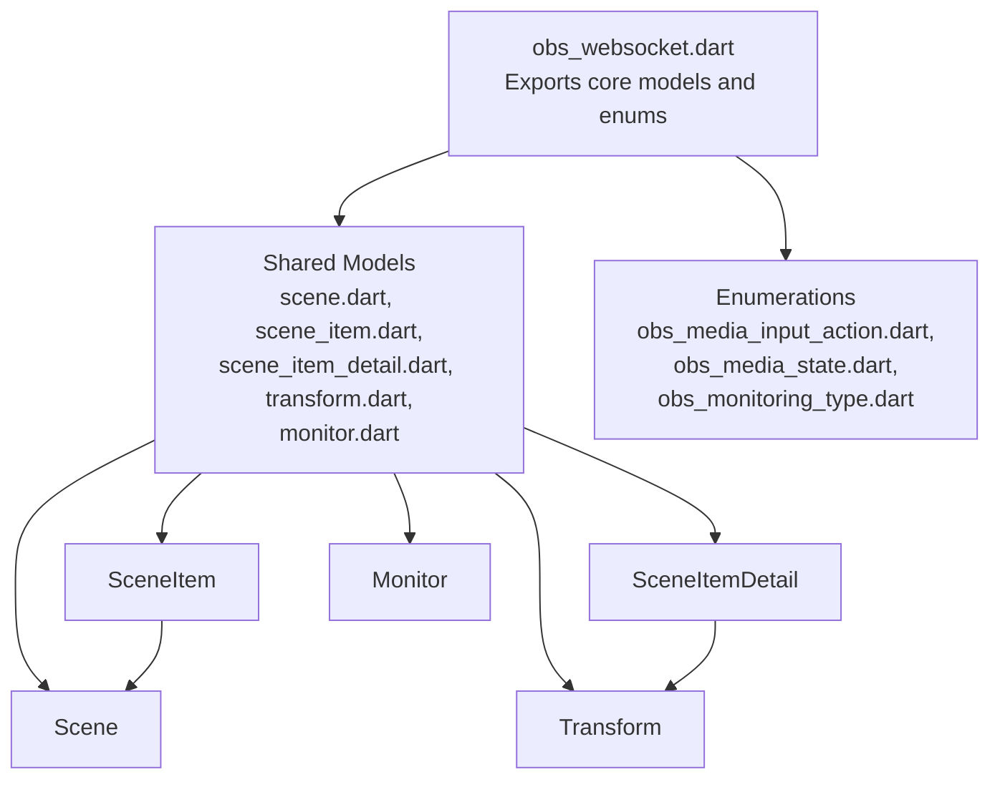
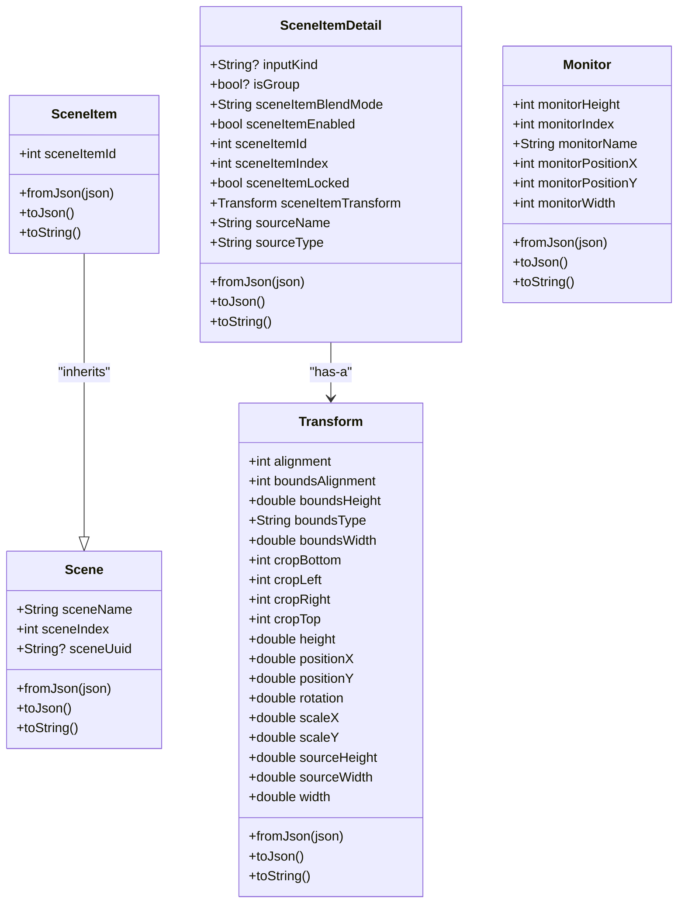
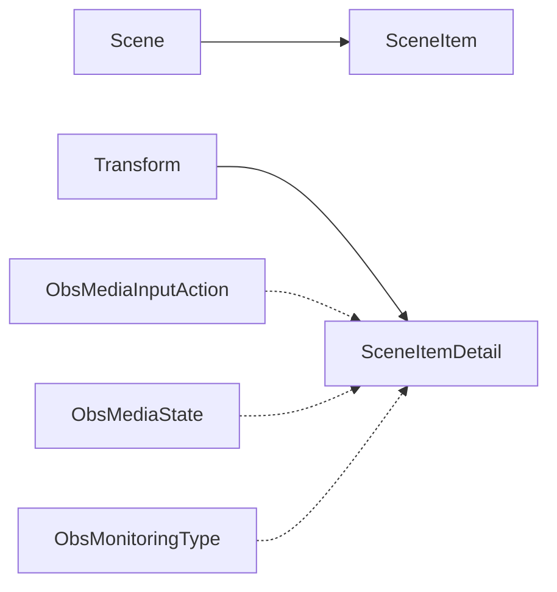

# Data Models and Types

<cite>
**Referenced Files in This Document**
- [obs_websocket.dart](file://lib/obs_websocket.dart)
- [scene.dart](file://lib/src/model/shared/scene.dart)
- [scene_item.dart](file://lib/src/model/shared/scene_item.dart)
- [scene_item_detail.dart](file://lib/src/model/shared/scene_item_detail.dart)
- [transform.dart](file://lib/src/model/shared/transform.dart)
- [monitor.dart](file://lib/src/model/shared/monitor.dart)
- [obs_media_input_action.dart](file://lib/src/enum/obs_media_input_action.dart)
- [obs_media_state.dart](file://lib/src/enum/obs_media_state.dart)
- [obs_monitoring_type.dart](file://lib/src/enum/obs_monitoring_type.dart)
</cite>

## Table of Contents
1. [Introduction](#introduction)
2. [Project Structure](#project-structure)
3. [Core Components](#core-components)
4. [Architecture Overview](#architecture-overview)
5. [Detailed Component Analysis](#detailed-component-analysis)
6. [Dependency Analysis](#dependency-analysis)
7. [Performance Considerations](#performance-considerations)
8. [Troubleshooting Guide](#troubleshooting-guide)
9. [Conclusion](#conclusion)

## Introduction
This document describes the shared data models, response types, and enumerations used by the OBS WebSocket Dart client. It focuses on core entities such as Scene, SceneItem, SceneItemDetail, Transform, and Monitor, along with related response and request types. It also documents enumerations for media actions, media states, and monitoring types, including their string codes and conversion helpers. The goal is to provide clear field definitions, data types, validation rules, and serialization patterns for both internal use and API interoperability.

## Project Structure
The library exposes a curated set of models and enumerations via a central export file. The shared models reside under the shared directory, while response and request models are organized under dedicated subdirectories. Enumerations are grouped separately.

**Diagram sources**
- [obs_websocket.dart:57-61](file://lib/obs_websocket.dart#L57-L61)
- [scene.dart:7-25](file://lib/src/model/shared/scene.dart#L7-L25)
- [scene_item.dart:8-24](file://lib/src/model/shared/scene_item.dart#L8-L24)
- [scene_item_detail.dart:8-41](file://lib/src/model/shared/scene_item_detail.dart#L8-L41)
- [transform.dart:7-56](file://lib/src/model/shared/transform.dart#L7-L56)
- [monitor.dart:7-32](file://lib/src/model/shared/monitor.dart#L7-L32)

**Section sources**
- [obs_websocket.dart:57-61](file://lib/obs_websocket.dart#L57-L61)

## Core Components
This section summarizes the primary shared models and their roles.

- Scene: Represents a named scene with an index and optional UUID.
- SceneItem: Extends Scene and adds a numeric scene item identifier.
- SceneItemDetail: Provides detailed properties for a scene item, including blend mode, enabled state, locked flag, index, transform, and source metadata.
- Transform: Encapsulates positioning, scaling, rotation, cropping, and bounds for a source.
- Monitor: Describes a monitor device with dimensions and position.

Key characteristics:
- All models are annotated for JSON serialization and include fromJson/factory constructors and toJson methods.
- Optional fields are nullable; otherwise, fields are required.
- Serialization uses a standard pattern with json.encode for string representation.

**Section sources**
- [scene.dart:7-25](file://lib/src/model/shared/scene.dart#L7-L25)
- [scene_item.dart:8-24](file://lib/src/model/shared/scene_item.dart#L8-L24)
- [scene_item_detail.dart:8-41](file://lib/src/model/shared/scene_item_detail.dart#L8-L41)
- [transform.dart:7-56](file://lib/src/model/shared/transform.dart#L7-L56)
- [monitor.dart:7-32](file://lib/src/model/shared/monitor.dart#L7-L32)

## Architecture Overview
The shared models form a small but cohesive domain model centered around scenes, items, transforms, and monitors. SceneItem inherits from Scene, and SceneItemDetail composes a Transform. This composition and inheritance enable clean separation of concerns and reuse across higher-level response types.

**Diagram sources**
- [scene.dart:7-25](file://lib/src/model/shared/scene.dart#L7-L25)
- [scene_item.dart:8-24](file://lib/src/model/shared/scene_item.dart#L8-L24)
- [scene_item_detail.dart:8-41](file://lib/src/model/shared/scene_item_detail.dart#L8-L41)
- [transform.dart:7-56](file://lib/src/model/shared/transform.dart#L7-L56)
- [monitor.dart:7-32](file://lib/src/model/shared/monitor.dart#L7-L32)

## Detailed Component Analysis

### Scene Model
- Purpose: Identifies a scene by name and ordering index, with an optional UUID.
- Fields:
  - sceneName: String (required)
  - sceneIndex: int (required)
  - sceneUuid: String? (optional)
- Validation:
  - Required fields must be present when constructing from API payloads.
  - Optional UUID may be null if not provided by the server.
- Serialization:
  - Uses generated fromJson and toJson via json serialization.
  - toString encodes the model to JSON for logging.

Example payload shape (conceptual):
{
  "sceneName": "string",
  "sceneIndex": 0,
  "sceneUuid": "string?"
}

**Section sources**
- [scene.dart:7-25](file://lib/src/model/shared/scene.dart#L7-L25)

### SceneItem Model
- Purpose: Represents a specific instance of a scene item with a numeric identifier.
- Inheritance: Extends Scene.
- Fields:
  - sceneItemId: int (required)
  - Inherits sceneName, sceneIndex from Scene.
- Notes:
  - sceneIndex is initialized from sceneItemId in the constructor, aligning indices with item identifiers conceptually.
- Serialization:
  - Generated fromJson/toJson and toString behavior inherited from Scene.

Example payload shape (conceptual):
{
  "sceneName": "string",
  "sceneIndex": 0,
  "sceneItemId": 0
}

**Section sources**
- [scene_item.dart:8-24](file://lib/src/model/shared/scene_item.dart#L8-L24)

### SceneItemDetail Model
- Purpose: Provides comprehensive details for a scene item.
- Fields:
  - inputKind: String? (optional)
  - isGroup: bool? (optional)
  - sceneItemBlendMode: String (required)
  - sceneItemEnabled: bool (required)
  - sceneItemId: int (required)
  - sceneItemIndex: int (required)
  - sceneItemLocked: bool (required)
  - sceneItemTransform: Transform (required, composed)
  - sourceName: String (required)
  - sourceType: String (required)
- Validation:
  - Required fields must be present; optional fields may be null.
  - Transform must be deserializable independently.
- Serialization:
  - Composed via generated fromJson/toJson.
  - toString encodes the model to JSON.

Example payload shape (conceptual):
{
  "inputKind": "string?",
  "isGroup": true?,
  "sceneItemBlendMode": "string",
  "sceneItemEnabled": true,
  "sceneItemId": 0,
  "sceneItemIndex": 0,
  "sceneItemLocked": true,
  "sceneItemTransform": { /* Transform */ },
  "sourceName": "string",
  "sourceType": "string"
}

**Section sources**
- [scene_item_detail.dart:8-41](file://lib/src/model/shared/scene_item_detail.dart#L8-L41)

### Transform Model
- Purpose: Encapsulates spatial and cropping properties for a source.
- Fields:
  - alignment: int (required)
  - boundsAlignment: int (required)
  - boundsHeight: double (required)
  - boundsType: String (required)
  - boundsWidth: double (required)
  - cropBottom: int (required)
  - cropLeft: int (required)
  - cropRight: int (required)
  - cropTop: int (required)
  - height: double (required)
  - positionX: double (required)
  - positionY: double (required)
  - rotation: double (required)
  - scaleX: double (required)
  - scaleY: double (required)
  - sourceHeight: double (required)
  - sourceWidth: double (required)
  - width: double (required)
- Validation:
  - All numeric fields are required; no defaults are provided.
  - Bounds and cropping imply non-negative constraints in typical usage.
- Serialization:
  - Generated fromJson/toJson and toString behavior.

Example payload shape (conceptual):
{
  "alignment": 0,
  "boundsAlignment": 0,
  "boundsHeight": 0.0,
  "boundsType": "string",
  "boundsWidth": 0.0,
  "cropBottom": 0,
  "cropLeft": 0,
  "cropRight": 0,
  "cropTop": 0,
  "height": 0.0,
  "positionX": 0.0,
  "positionY": 0.0,
  "rotation": 0.0,
  "scaleX": 0.0,
  "scaleY": 0.0,
  "sourceHeight": 0.0,
  "sourceWidth": 0.0,
  "width": 0.0
}

**Section sources**
- [transform.dart:7-56](file://lib/src/model/shared/transform.dart#L7-L56)

### Monitor Model
- Purpose: Describes a monitor device with positional and dimensional attributes.
- Fields:
  - monitorHeight: int (required)
  - monitorIndex: int (required)
  - monitorName: String (required)
  - monitorPositionX: int (required)
  - monitorPositionY: int (required)
  - monitorWidth: int (required)
- Validation:
  - All numeric fields are required; no defaults are provided.
- Serialization:
  - Generated fromJson/toJson and toString behavior.

Example payload shape (conceptual):
{
  "monitorHeight": 0,
  "monitorIndex": 0,
  "monitorName": "string",
  "monitorPositionX": 0,
  "monitorPositionY": 0,
  "monitorWidth": 0
}

**Section sources**
- [monitor.dart:7-32](file://lib/src/model/shared/monitor.dart#L7-L32)

### Enumerations and Constants

#### ObsMediaInputAction
- Values and codes:
  - none: OBS_WEBSOCKET_MEDIA_INPUT_ACTION_NONE
  - play: OBS_WEBSOCKET_MEDIA_INPUT_ACTION_PLAY
  - pause: OBS_WEBSOCKET_MEDIA_INPUT_ACTION_PAUSE
  - stop: OBS_WEBSOCKET_MEDIA_INPUT_ACTION_STOP
  - restart: OBS_WEBSOCKET_MEDIA_INPUT_ACTION_RESTART
  - next: OBS_WEBSOCKET_MEDIA_INPUT_ACTION_NEXT
  - previous: OBS_WEBSOCKET_MEDIA_INPUT_ACTION_PREVIOUS
- Usage:
  - Use the code property for wire-level communication.
  - Suitable for request parameters and event payloads.

**Section sources**
- [obs_media_input_action.dart:1-13](file://lib/src/enum/obs_media_input_action.dart#L1-L13)

#### ObsMediaState
- Values and codes:
  - none: OBS_MEDIA_STATE_NONE
  - playing: OBS_MEDIA_STATE_PLAYING
  - opening: OBS_MEDIA_STATE_OPENING
  - buffering: OBS_MEDIA_STATE_BUFFERING
  - paused: OBS_MEDIA_STATE_PAUSED
  - stopped: OBS_MEDIA_STATE_STOPPED
  - ended: OBS_MEDIA_STATE_ENDED
  - error: OBS_MEDIA_STATE_ERROR
- Helpers:
  - valuesByMessage(code): Converts a server message string to the enum value.
  - toMessage(state): Converts an enum value to a message string.
- Usage:
  - Use toMessage for outbound messages.
  - Use valuesByMessage to parse inbound state updates.

**Section sources**
- [obs_media_state.dart:1-27](file://lib/src/enum/obs_media_state.dart#L1-L27)

#### ObsMonitoringType
- Values and codes:
  - none: OBS_MONITORING_TYPE_NONE
  - play: OBS_MONITORING_TYPE_MONITOR_ONLY
  - pause: OBS_MONITORING_TYPE_MONITOR_AND_OUTPUT
- Usage:
  - Use the code property for wire-level communication.
  - Suitable for configuration and status payloads.

**Section sources**
- [obs_monitoring_type.dart:1-9](file://lib/src/enum/obs_monitoring_type.dart#L1-L9)

## Dependency Analysis
The shared models have clear dependency relationships:
- SceneItem depends on Scene (inheritance).
- SceneItemDetail depends on Transform (composition).
- Enumerations are standalone and referenced by higher-level models and responses.

**Diagram sources**
- [scene_item.dart:8-24](file://lib/src/model/shared/scene_item.dart#L8-L24)
- [scene_item_detail.dart:8-41](file://lib/src/model/shared/scene_item_detail.dart#L8-L41)
- [obs_media_input_action.dart:1-13](file://lib/src/enum/obs_media_input_action.dart#L1-L13)
- [obs_media_state.dart:1-27](file://lib/src/enum/obs_media_state.dart#L1-L27)
- [obs_monitoring_type.dart:1-9](file://lib/src/enum/obs_monitoring_type.dart#L1-L9)

## Performance Considerations
- Prefer using generated fromJson/toJson methods for efficient serialization/deserialization.
- Keep payloads minimal by avoiding unnecessary optional fields when not required.
- Reuse Transform instances when updating multiple scene items to reduce object allocation overhead.

## Troubleshooting Guide
- Missing required fields: Ensure all required fields are present when constructing models from API responses. Optional fields may be null.
- Enum parsing: When receiving state updates, use valuesByMessage to safely convert string codes to enum values.
- Serialization errors: Verify that nested models (e.g., Transform inside SceneItemDetail) are properly serializable.

## Conclusion
The shared models provide a concise and robust foundation for working with OBS scenes, items, transforms, and monitors. The enumerations offer standardized string codes and helper conversions for media actions, states, and monitoring types. By adhering to the documented field requirements and using the provided serialization patterns, clients can reliably exchange data with the OBS WebSocket server.