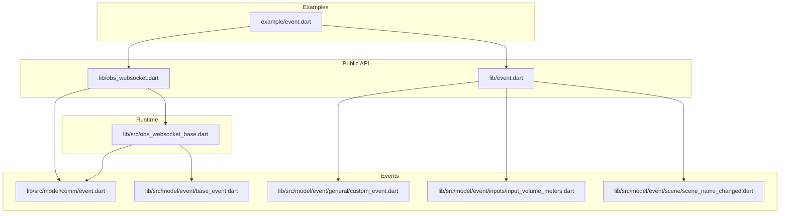
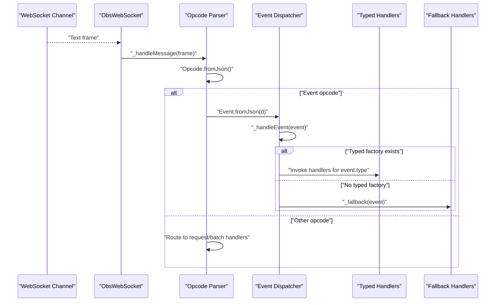
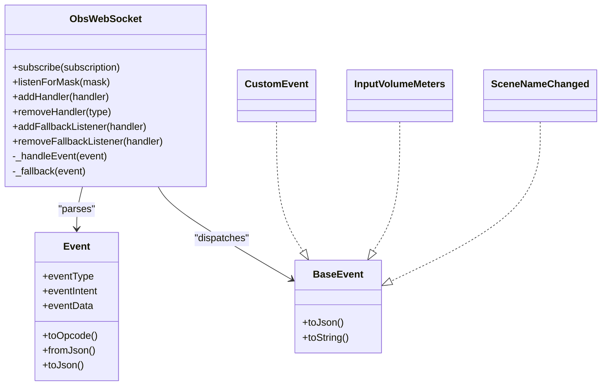

# Event System API

<cite>
**Referenced Files in This Document**
- [obs_websocket.dart](file://lib/obs_websocket.dart)
- [obs_websocket_base.dart](file://lib/src/obs_websocket_base.dart)
- [event.dart](file://lib/event.dart)
- [event.dart](file://lib/src/model/comm/event.dart)
- [base_event.dart](file://lib/src/model/event/base_event.dart)
- [custom_event.dart](file://lib/src/model/event/general/custom_event.dart)
- [input_volume_meters.dart](file://lib/src/model/event/inputs/input_volume_meters.dart)
- [scene_name_changed.dart](file://lib/src/model/event/scene/scene_name_changed.dart)
- [event.dart](file://example/event.dart)
</cite>

## Table of Contents
1. [Introduction](#introduction)
2. [Project Structure](#project-structure)
3. [Core Components](#core-components)
4. [Architecture Overview](#architecture-overview)
5. [Detailed Component Analysis](#detailed-component-analysis)
6. [Dependency Analysis](#dependency-analysis)
7. [Performance Considerations](#performance-considerations)
8. [Troubleshooting Guide](#troubleshooting-guide)
9. [Conclusion](#conclusion)
10. [Appendices](#appendices)

## Introduction
This document describes the event subscription and handling system for the OBS WebSocket client library. It covers the Event class structure, event type enumeration, subscription mechanisms, handler registration, callback signatures, event data payload structures, filtering via subscription masks, selective event listening, event timing and delivery guarantees, error handling, batching, performance considerations, memory management for long-running subscriptions, fallback event handling patterns, and debugging techniques.

## Project Structure
The event system spans several modules:
- Public exports for event types are centralized under a single module entry.
- The runtime event handling and subscription logic resides in the base client class.
- Event payload models implement a shared base interface and are annotated for JSON serialization.
- Example usage demonstrates subscription and handler registration patterns.

**Diagram sources**
- [event.dart:1-50](file://lib/event.dart#L1-L50)
- [obs_websocket.dart:1-69](file://lib/obs_websocket.dart#L1-L69)
- [obs_websocket_base.dart:1-513](file://lib/src/obs_websocket_base.dart#L1-L513)
- [event.dart:1-31](file://lib/src/model/comm/event.dart#L1-L31)
- [base_event.dart:1-7](file://lib/src/model/event/base_event.dart#L1-L7)
- [custom_event.dart:1-26](file://lib/src/model/event/general/custom_event.dart#L1-L26)
- [input_volume_meters.dart:1-31](file://lib/src/model/event/inputs/input_volume_meters.dart#L1-L31)
- [scene_name_changed.dart:1-30](file://lib/src/model/event/scene/scene_name_changed.dart#L1-L30)
- [event.dart:1-46](file://example/event.dart#L1-L46)

**Section sources**
- [event.dart:1-50](file://lib/event.dart#L1-L50)
- [obs_websocket.dart:1-69](file://lib/obs_websocket.dart#L1-L69)

## Core Components
- Event: The wire-level representation of an incoming event, including event type, intent, and payload.
- ObsWebSocket: The client that manages WebSocket connectivity, authentication, subscription masks, and dispatches typed events to handlers.
- BaseEvent: The base interface for all typed event models.
- Typed Event Models: Specific event payload classes (e.g., custom events, input volume meters, scene name changes).
- Handler Types: Typed and fallback event handler callbacks.

Key responsibilities:
- Event parsing and routing from the WebSocket stream.
- Subscription mask management and re-identification with OBS.
- Typed decoding and dispatch to registered handlers.
- Fallback handling for unknown or undecodable events.
- Batch request support and timeouts.

**Section sources**
- [obs_websocket_base.dart:11-20](file://lib/src/obs_websocket_base.dart#L11-L20)
- [obs_websocket_base.dart:337-372](file://lib/src/obs_websocket_base.dart#L337-L372)
- [obs_websocket_base.dart:374-395](file://lib/src/obs_websocket_base.dart#L374-L395)
- [obs_websocket_base.dart:410-446](file://lib/src/obs_websocket_base.dart#L410-L446)
- [event.dart:10-30](file://lib/src/model/comm/event.dart#L10-L30)
- [base_event.dart:1-7](file://lib/src/model/event/base_event.dart#L1-L7)

## Architecture Overview
The event pipeline receives WebSocket frames, decodes them into opcodes, recognizes event opcodes, parses the Event payload, and dispatches to typed handlers or fallback handlers. Subscriptions are controlled via masks sent during identification and re-identification.

**Diagram sources**
- [obs_websocket_base.dart:181-236](file://lib/src/obs_websocket_base.dart#L181-L236)
- [obs_websocket_base.dart:374-395](file://lib/src/obs_websocket_base.dart#L374-L395)
- [event.dart:22-26](file://lib/src/model/comm/event.dart#L22-L26)

## Detailed Component Analysis

### Event Class Structure
- Fields:
  - eventType: String discriminator for the event type.
  - eventIntent: Integer bitmask indicating delivery intent.
  - eventData: Optional map containing the event payload.
- Methods:
  - toOpcode(): Converts the Event into an opcode-compatible form.
  - fromJson()/toJson(): Serialization helpers for JSON transport.
  - toString(): Encodes the event as JSON for logging.

Usage notes:
- eventIntent can be used to infer delivery guarantees (e.g., whether the event is guaranteed vs. best-effort).
- eventData is passed to typed factories for decoding.

**Section sources**
- [event.dart:10-30](file://lib/src/model/comm/event.dart#L10-L30)

### Event Type Enumeration and Payload Models
- BaseEvent: Defines the contract for all typed event models (toJson and toString).
- CustomEvent: A generic payload container for custom events.
- InputVolumeMeters: High-frequency metering data for active inputs.
- SceneNameChanged: A scene rename event carrying old and new names.

These models are annotated for JSON serialization and implement the BaseEvent interface.

**Section sources**
- [base_event.dart:1-7](file://lib/src/model/event/base_event.dart#L1-L7)
- [custom_event.dart:9-25](file://lib/src/model/event/general/custom_event.dart#L9-L25)
- [input_volume_meters.dart:15-30](file://lib/src/model/event/inputs/input_volume_meters.dart#L15-L30)
- [scene_name_changed.dart:10-29](file://lib/src/model/event/scene/scene_name_changed.dart#L10-L29)

### Subscription Mechanisms and Masks
- subscribe(): Accepts a single EventSubscription, an iterable of EventSubscription, or a raw integer mask. It computes a combined mask and triggers a re-identification with the server.
- listenForMask(): Sends a re-identify opcode with the requested mask.
- EventSubscription.none: A sentinel mask to disable all event subscriptions.

Behavior:
- Subscriptions are applied by sending a re-identify opcode after initial authentication.
- Combining multiple EventSubscription values uses bitwise OR to produce the final mask.

**Section sources**
- [obs_websocket_base.dart:337-372](file://lib/src/obs_websocket_base.dart#L337-L372)
- [obs_websocket_base.dart:348-350](file://lib/src/obs_websocket_base.dart#L348-L350)
- [obs_websocket_base.dart:342-345](file://lib/src/obs_websocket_base.dart#L342-L345)

### Handler Registration and Callback Signatures
- addHandler<T>(): Registers a typed handler for a specific event type T. The handler signature is ObsTypedEventHandler<T>.
- removeHandler<T>(): Removes all handlers for type T. Passing a listener argument attempts best-effort removal.
- addFallbackListener(): Registers a fallback handler invoked when no typed handler matches.
- removeFallbackListener(): Removes a fallback handler.
- ObsTypedEventHandler<T>: void Function(T event).
- ObsFallbackEventHandler: void Function(Event event).

Dispatch:
- Events are dispatched to all registered handlers for the event’s type.
- If no typed handlers exist, the fallback chain is executed.

**Section sources**
- [obs_websocket_base.dart:18-19](file://lib/src/obs_websocket_base.dart#L18-L19)
- [obs_websocket_base.dart:410-429](file://lib/src/obs_websocket_base.dart#L410-L429)
- [obs_websocket_base.dart:431-446](file://lib/src/obs_websocket_base.dart#L431-L446)
- [obs_websocket_base.dart:374-395](file://lib/src/obs_websocket_base.dart#L374-L395)

### Event Data Payload Structures
- Event.eventData: A map passed to typed factories for decoding.
- Typed models define strongly-typed fields (e.g., lists, strings, nested maps).
- BaseEvent.toJson(): Returns the serialized form of the typed model.

Decoding:
- The runtime uses a factory map keyed by event type to decode eventData into the appropriate typed model.

**Section sources**
- [event.dart:12-14](file://lib/src/model/comm/event.dart#L12-L14)
- [custom_event.dart:11-15](file://lib/src/model/event/general/custom_event.dart#L11-L15)
- [input_volume_meters.dart:16-18](file://lib/src/model/event/inputs/input_volume_meters.dart#L16-L18)
- [scene_name_changed.dart:11-19](file://lib/src/model/event/scene/scene_name_changed.dart#L11-L19)
- [obs_websocket_base.dart:383-390](file://lib/src/obs_websocket_base.dart#L383-L390)

### Selective Event Listening and Filtering
- Masks control which events are delivered. Combine multiple EventSubscription values to filter selectively.
- Example usage subscribes to a combination of categories and a specific high-frequency event.

Practical guidance:
- Prefer combining EventSubscription values rather than raw integers for readability.
- Use masks to reduce bandwidth and CPU overhead from high-frequency events.

**Section sources**
- [obs_websocket_base.dart:352-372](file://lib/src/obs_websocket_base.dart#L352-L372)
- [event.dart:21-22](file://example/event.dart#L21-L22)
- [event.dart:35-36](file://example/event.dart#L35-L36)

### Event Timing and Delivery Guarantees
- eventIntent indicates the delivery intent of the event. While the exact semantics depend on the server implementation, typical values distinguish between guaranteed and best-effort deliveries.
- The client logs received opcodes and events for debugging.

Operational notes:
- High-frequency events (e.g., input volume meters) should be subscribed to carefully due to throughput implications.

**Section sources**
- [event.dart:13-13](file://lib/src/model/comm/event.dart#L13-L13)
- [obs_websocket_base.dart:195-199](file://lib/src/obs_websocket_base.dart#L195-L199)
- [input_volume_meters.dart:9-13](file://lib/src/model/event/inputs/input_volume_meters.dart#L9-L13)

### Error Handling in Event Callbacks
- The client catches malformed frames and logs errors; unknown request IDs are handled gracefully by failing pending requests.
- Fallback handlers receive undecodable or unknown events to prevent silent drops.
- Handlers themselves are invoked synchronously; asynchronous work should be performed inside handlers without blocking the event loop.

Recommendations:
- Wrap handler logic in try/catch blocks if external operations might fail.
- Avoid heavy synchronous work in handlers to maintain responsiveness.

**Section sources**
- [obs_websocket_base.dart:188-191](file://lib/src/obs_websocket_base.dart#L188-L191)
- [obs_websocket_base.dart:238-258](file://lib/src/obs_websocket_base.dart#L238-L258)
- [obs_websocket_base.dart:382-388](file://lib/src/obs_websocket_base.dart#L382-L388)
- [obs_websocket_base.dart:442-446](file://lib/src/obs_websocket_base.dart#L442-L446)

### Event Batching and Performance Considerations
- sendBatch(): Sends multiple requests in a single operation and awaits a batch response.
- sendRequest(): Sends a single request and awaits a response.
- Timeouts: Both operations enforce a configurable request timeout and raise a timeout exception if exceeded.
- Pending requests and batches are tracked to avoid leaks; errors propagate to pending completers.

Performance tips:
- Use batch operations to reduce round-trips.
- Tune requestTimeout for your network conditions.
- Limit high-frequency event subscriptions to reduce CPU and memory usage.

**Section sources**
- [obs_websocket_base.dart:451-473](file://lib/src/obs_websocket_base.dart#L451-L473)
- [obs_websocket_base.dart:475-501](file://lib/src/obs_websocket_base.dart#L475-L501)
- [obs_websocket_base.dart:242-257](file://lib/src/obs_websocket_base.dart#L242-L257)

### Memory Management for Long-Running Subscriptions
- Handlers are stored in lists keyed by type; removing handlers clears references and allows garbage collection.
- removeHandler<T>() removes all handlers for a type; passing a listener attempts removal.
- Fallback handlers are stored separately and should be removed when no longer needed.

Guidelines:
- Periodically review and prune unused handlers.
- Avoid retaining closures that capture large objects in handlers.

**Section sources**
- [obs_websocket_base.dart:410-429](file://lib/src/obs_websocket_base.dart#L410-L429)
- [obs_websocket_base.dart:431-439](file://lib/src/obs_websocket_base.dart#L431-L439)

### Fallback Event Handling Patterns
- addFallbackListener(): Register a handler to receive all events that do not have a typed decoder.
- _fallback(): Iterates through fallback handlers when no typed handlers are present or when decoding fails.

Patterns:
- Use fallback handlers for logging unknown events or implementing generic processing.
- Combine fallback with typed handlers to ensure no event is dropped silently.

**Section sources**
- [obs_websocket_base.dart:15-16](file://lib/src/obs_websocket_base.dart#L15-L16)
- [obs_websocket_base.dart:431-446](file://lib/src/obs_websocket_base.dart#L431-L446)
- [obs_websocket_base.dart:382-388](file://lib/src/obs_websocket_base.dart#L382-L388)

### Debugging Techniques
- Enable debug logging to observe opcode reception and event dispatch.
- Inspect raw Event frames and fallback handler invocations.
- Use fallback handlers to log unknown event types and payloads.

Example usage demonstrates connecting, subscribing, registering handlers, and closing on a specific event.

**Section sources**
- [obs_websocket_base.dart:193-193](file://lib/src/obs_websocket_base.dart#L193-L193)
- [obs_websocket_base.dart:397-408](file://lib/src/obs_websocket_base.dart#L397-L408)
- [event.dart:9-45](file://example/event.dart#L9-L45)

## Dependency Analysis
The event system depends on:
- WebSocket channel for transport.
- Opcode parsing for routing.
- Typed factories for decoding event payloads.
- Handler registries for dispatch.

**Diagram sources**
- [obs_websocket_base.dart:337-395](file://lib/src/obs_websocket_base.dart#L337-L395)
- [event.dart:10-30](file://lib/src/model/comm/event.dart#L10-L30)
- [base_event.dart:1-7](file://lib/src/model/event/base_event.dart#L1-L7)
- [custom_event.dart:9-25](file://lib/src/model/event/general/custom_event.dart#L9-L25)
- [input_volume_meters.dart:15-30](file://lib/src/model/event/inputs/input_volume_meters.dart#L15-L30)
- [scene_name_changed.dart:10-29](file://lib/src/model/event/scene/scene_name_changed.dart#L10-L29)

**Section sources**
- [obs_websocket_base.dart:337-395](file://lib/src/obs_websocket_base.dart#L337-L395)
- [event.dart:10-30](file://lib/src/model/comm/event.dart#L10-L30)
- [base_event.dart:1-7](file://lib/src/model/event/base_event.dart#L1-L7)

## Performance Considerations
- High-frequency events: InputVolumeMeters is marked as high-volume; subscribe sparingly to avoid CPU and memory spikes.
- Mask selection: Narrow subscriptions to reduce traffic.
- Batch operations: Use sendBatch() to minimize latency and overhead.
- Logging: Debug logging increases overhead; disable in production.

[No sources needed since this section provides general guidance]

## Troubleshooting Guide
Common issues and resolutions:
- Malformed frames: The client logs and ignores malformed opcode frames.
- Unknown request IDs: Pending requests are failed to prevent hangs.
- No handlers: Fallback handlers receive undecodable or unknown events.
- Timeouts: Increase requestTimeout if network latency is high; otherwise investigate connectivity.

**Section sources**
- [obs_websocket_base.dart:188-191](file://lib/src/obs_websocket_base.dart#L188-L191)
- [obs_websocket_base.dart:204-211](file://lib/src/obs_websocket_base.dart#L204-L211)
- [obs_websocket_base.dart:221-225](file://lib/src/obs_websocket_base.dart#L221-L225)
- [obs_websocket_base.dart:238-258](file://lib/src/obs_websocket_base.dart#L238-L258)
- [obs_websocket_base.dart:382-388](file://lib/src/obs_websocket_base.dart#L382-L388)

## Conclusion
The event system provides a robust, typed, and extensible mechanism for subscribing to and handling OBS WebSocket events. By combining subscription masks, typed handlers, and fallback processing, applications can efficiently manage diverse event streams while maintaining resilience and observability.

[No sources needed since this section summarizes without analyzing specific files]

## Appendices

### API Reference Summary

- Event
  - Fields: eventType, eventIntent, eventData
  - Methods: toOpcode(), fromJson(), toJson(), toString()

- ObsWebSocket
  - Methods: subscribe(), listenForMask(), addHandler(), removeHandler(), addFallbackListener(), removeFallbackListener(), sendBatch(), sendRequest(), close()
  - Callbacks: ObsTypedEventHandler<T>, ObsFallbackEventHandler

- Event Payload Models
  - BaseEvent: toJson(), toString()
  - CustomEvent: eventData
  - InputVolumeMeters: inputs
  - SceneNameChanged: sceneName, oldSceneName, sceneUuid

- Example Usage
  - Demonstrates connecting, subscribing to combined masks, registering typed handlers, and graceful shutdown.

**Section sources**
- [event.dart:10-30](file://lib/src/model/comm/event.dart#L10-L30)
- [obs_websocket_base.dart:337-446](file://lib/src/obs_websocket_base.dart#L337-L446)
- [base_event.dart:1-7](file://lib/src/model/event/base_event.dart#L1-L7)
- [custom_event.dart:11-15](file://lib/src/model/event/general/custom_event.dart#L11-L15)
- [input_volume_meters.dart:16-18](file://lib/src/model/event/inputs/input_volume_meters.dart#L16-L18)
- [scene_name_changed.dart:11-19](file://lib/src/model/event/scene/scene_name_changed.dart#L11-L19)
- [event.dart:21-44](file://example/event.dart#L21-L44)