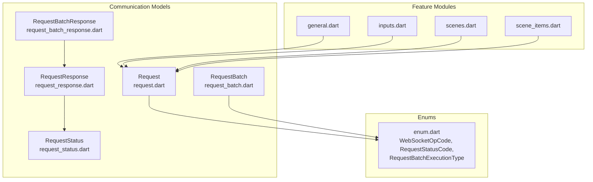
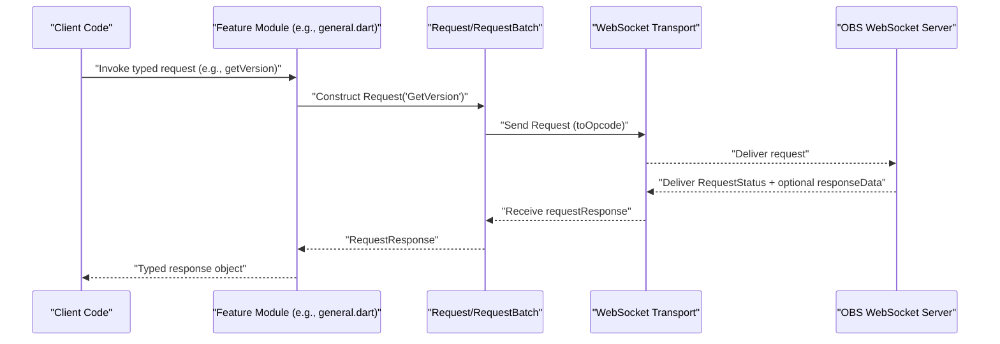
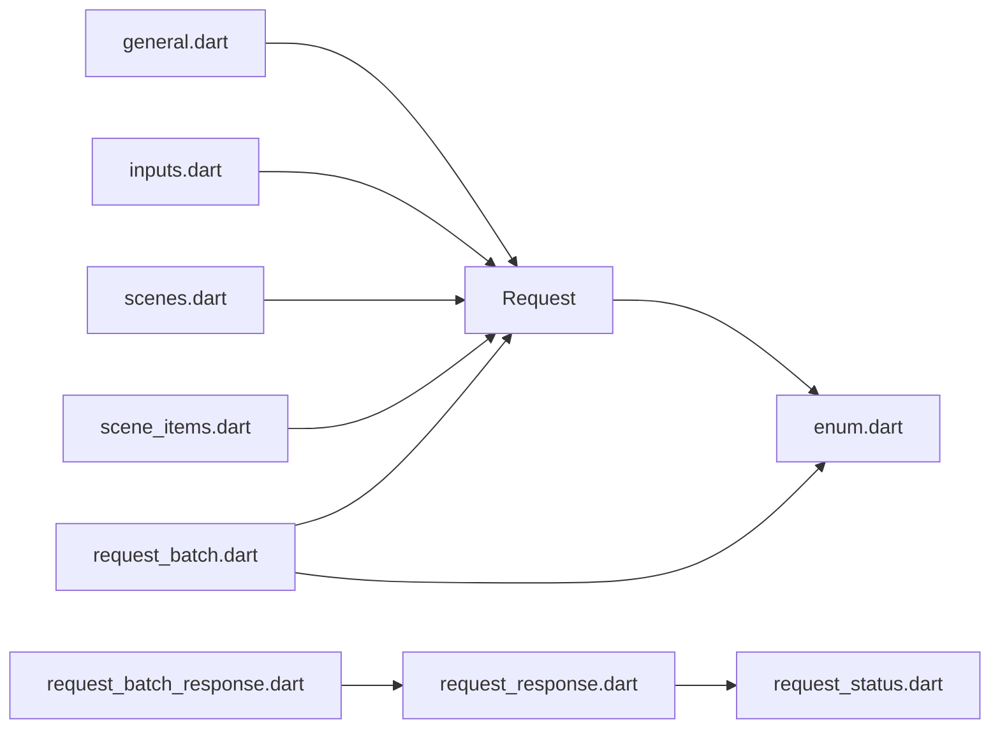

# Request and Response Models

<cite>
**Referenced Files in This Document**
- [lib/request.dart](file://lib/request.dart)
- [lib/command.dart](file://lib/command.dart)
- [lib/src/model/comm/request.dart](file://lib/src/model/comm/request.dart)
- [lib/src/model/comm/request.g.dart](file://lib/src/model/comm/request.g.dart)
- [lib/src/model/comm/request_batch.dart](file://lib/src/model/comm/request_batch.dart)
- [lib/src/model/comm/request_batch.g.dart](file://lib/src/model/comm/request_batch.g.dart)
- [lib/src/model/comm/request_response.dart](file://lib/src/model/comm/request_response.dart)
- [lib/src/model/comm/request_response.g.dart](file://lib/src/model/comm/request_response.g.dart)
- [lib/src/model/comm/request_batch_response.dart](file://lib/src/model/comm/request_batch_response.dart)
- [lib/src/model/comm/request_batch_response.g.dart](file://lib/src/model/comm/request_batch_response.g.dart)
- [lib/src/model/comm/request_status.dart](file://lib/src/model/comm/request_status.dart)
- [lib/src/model/comm/request_status.g.dart](file://lib/src/model/comm/request_status.g.dart)
- [lib/src/util/enum.dart](file://lib/src/util/enum.dart)
- [lib/src/request/general.dart](file://lib/src/request/general.dart)
- [lib/src/request/inputs.dart](file://lib/src/request/inputs.dart)
- [lib/src/request/scenes.dart](file://lib/src/request/scenes.dart)
- [lib/src/request/scene_items.dart](file://lib/src/request/scene_items.dart)
- [example/batch.dart](file://example/batch.dart)
</cite>

## Table of Contents
1. [Introduction](#introduction)
2. [Project Structure](#project-structure)
3. [Core Components](#core-components)
4. [Architecture Overview](#architecture-overview)
5. [Detailed Component Analysis](#detailed-component-analysis)
6. [Dependency Analysis](#dependency-analysis)
7. [Performance Considerations](#performance-considerations)
8. [Troubleshooting Guide](#troubleshooting-guide)
9. [Conclusion](#conclusion)
10. [Appendices](#appendices)

## Introduction
This document describes the request and response model hierarchy used by the client library to communicate with the OBS WebSocket server. It covers the base Request class, the RequestBuilder-style request modules, the RequestBatch system for batching multiple requests, response parsing, RequestResponse wrappers, and batch response handling. It also documents parameter validation rules, required and optional fields per request type, and provides examples of building complex requests and handling responses.

## Project Structure
The request/response model hierarchy is organized around:
- Base communication models (Request, RequestBatch, RequestResponse, RequestBatchResponse, RequestStatus)
- Enumerations for opcodes and status codes
- Feature-specific request modules (general, inputs, scenes, scene_items, etc.)
- Example usage of batch requests

**Diagram sources**
- [lib/src/model/comm/request.dart:1-38](file://lib/src/model/comm/request.dart#L1-L38)
- [lib/src/model/comm/request_batch.dart:1-40](file://lib/src/model/comm/request_batch.dart#L1-L40)
- [lib/src/model/comm/request_response.dart:1-31](file://lib/src/model/comm/request_response.dart#L1-L31)
- [lib/src/model/comm/request_batch_response.dart:1-23](file://lib/src/model/comm/request_batch_response.dart#L1-L23)
- [lib/src/model/comm/request_status.dart:1-27](file://lib/src/model/comm/request_status.dart#L1-L27)
- [lib/src/util/enum.dart:1-88](file://lib/src/util/enum.dart#L1-L88)
- [lib/src/request/general.dart:1-143](file://lib/src/request/general.dart#L1-L143)
- [lib/src/request/inputs.dart:1-389](file://lib/src/request/inputs.dart#L1-L389)
- [lib/src/request/scenes.dart:1-232](file://lib/src/request/scenes.dart#L1-L232)
- [lib/src/request/scene_items.dart:1-324](file://lib/src/request/scene_items.dart#L1-L324)

**Section sources**
- [lib/request.dart:1-19](file://lib/request.dart#L1-L19)
- [lib/command.dart:1-20](file://lib/command.dart#L1-L20)

## Core Components
This section documents the foundational request/response types and their roles.

- Request
  - Purpose: Encapsulates a single request to the server with requestType, optional requestData, and optional expectResponse flag.
  - Behavior: Generates a unique requestId automatically; defaults expectResponse based on requestType (true for "Get*" types).
  - Serialization: Converts to JSON excluding null fields; exposes toOpcode conversion to RequestOpcode.

- RequestBatch
  - Purpose: Encapsulates a batch of Request objects with execution semantics.
  - Execution Types: serialRealtime, serialFrame, parallel; controlled via RequestBatchExecutionType.
  - Options: haltOnFailure controls whether the batch stops on first failure; requestId is generated.

- RequestResponse
  - Purpose: Wraps a single request’s response with requestType, requestId, RequestStatus, and optional responseData.

- RequestBatchResponse
  - Purpose: Wraps the aggregated results of a RequestBatch with requestId and results list of RequestResponse entries.

- RequestStatus
  - Purpose: Encodes the outcome of a request with result (boolean), code (integer), and optional comment.

- Enums
  - WebSocketOpCode: Maps to wire protocol opcodes including request, requestResponse, requestBatch, requestBatchResponse.
  - RequestStatusCode: Standardized numeric codes for success and various failure modes.
  - RequestBatchExecutionType: Controls batch execution order and timing.

**Section sources**
- [lib/src/model/comm/request.dart:1-38](file://lib/src/model/comm/request.dart#L1-L38)
- [lib/src/model/comm/request.g.dart:1-13](file://lib/src/model/comm/request.g.dart#L1-L13)
- [lib/src/model/comm/request_batch.dart:1-40](file://lib/src/model/comm/request_batch.dart#L1-L40)
- [lib/src/model/comm/request_response.dart:1-31](file://lib/src/model/comm/request_response.dart#L1-L31)
- [lib/src/model/comm/request_batch_response.dart:1-23](file://lib/src/model/comm/request_batch_response.dart#L1-L23)
- [lib/src/model/comm/request_status.dart:1-27](file://lib/src/model/comm/request_status.dart#L1-L27)
- [lib/src/util/enum.dart:1-88](file://lib/src/util/enum.dart#L1-L88)

## Architecture Overview
The request/response architecture follows a clear separation of concerns:
- Feature modules (general, inputs, scenes, scene_items) expose typed methods that construct Request objects and parse typed responses.
- Communication models handle serialization/deserialization and opcode conversion.
- Batch execution aggregates multiple requests and returns per-request results.

**Diagram sources**
- [lib/src/request/general.dart:21-25](file://lib/src/request/general.dart#L21-L25)
- [lib/src/model/comm/request.dart:19-33](file://lib/src/model/comm/request.dart#L19-L33)
- [lib/src/model/comm/request_response.dart:16-21](file://lib/src/model/comm/request_response.dart#L16-L21)

## Detailed Component Analysis

### Base Request and Builder Pattern
- Request class encapsulates:
  - requestType: string identifier of the command.
  - requestData: optional map of parameters.
  - expectResponse: optional; defaults to true for "Get*" requestType.
  - requestId: UUID generated automatically.
  - toOpcode(): converts to RequestOpcode for transport.
  - toJson(): serializes with null-scrubbed fields.
- Builder-style usage:
  - Feature modules (e.g., general.dart, inputs.dart, scenes.dart, scene_items.dart) construct Request instances and pass them to the transport layer.
  - Responses are parsed into typed response models (e.g., VersionResponse, StatsResponse, SceneListResponse).

Validation and defaults:
- expectResponse defaults to true for requestType starting with "Get".
- Null fields are excluded from JSON payload.

Examples of building requests:
- Simple GET request: Request('GetVersion')
- Parameterized request: Request('GetInputList', requestData: {...})
- Feature module helpers: general.getVersion(), inputs.createInput(...), scenes.list(), scene_items.list(...)

**Section sources**
- [lib/src/model/comm/request.dart:10-37](file://lib/src/model/comm/request.dart#L10-L37)
- [lib/src/request/general.dart:21-25](file://lib/src/request/general.dart#L21-L25)
- [lib/src/request/inputs.dart:93-107](file://lib/src/request/inputs.dart#L93-L107)
- [lib/src/request/scenes.dart:34-38](file://lib/src/request/scenes.dart#L34-L38)
- [lib/src/request/scene_items.dart:27-37](file://lib/src/request/scene_items.dart#L27-L37)

### RequestBatch System
- RequestBatch aggregates:
  - haltOnFailure: boolean controlling early termination on failure.
  - executionType: serialRealtime, serialFrame, parallel.
  - requests: list of Request objects.
  - requestId: UUID generated automatically.
- toJson() serializes batch with execution semantics and embedded request payloads.
- Execution semantics:
  - serialRealtime: requests executed with real-time timing constraints.
  - serialFrame: requests executed frame-by-frame.
  - parallel: requests executed concurrently.

Example usage:
- Build a list of Request objects.
- Wrap in RequestBatch and send via transport.
- Receive RequestBatchResponse with results per request.

**Section sources**
- [lib/src/model/comm/request_batch.dart:12-39](file://lib/src/model/comm/request_batch.dart#L12-L39)
- [lib/src/util/enum.dart:52-60](file://lib/src/util/enum.dart#L52-L60)
- [example/batch.dart:17-28](file://example/batch.dart#L17-L28)

### Response Parsing and Wrapper Classes
- RequestResponse:
  - Fields: requestType, requestId, requestStatus (RequestStatus), responseData (optional).
  - Provides typed accessors for downstream parsing.
- RequestStatus:
  - Fields: result (boolean), code (integer), comment (optional).
  - Used to interpret success or failure of individual requests.
- RequestBatchResponse:
  - Fields: requestId, results (list of RequestResponse).
  - Aggregates per-request outcomes.

Parsing flow:
- Transport receives a requestResponse opcode.
- Deserialize to RequestResponse.
- Parse responseData into appropriate typed response model (e.g., VersionResponse, SceneListResponse).

**Section sources**
- [lib/src/model/comm/request_response.dart:9-26](file://lib/src/model/comm/request_response.dart#L9-L26)
- [lib/src/model/comm/request_status.dart:7-22](file://lib/src/model/comm/request_status.dart#L7-L22)
- [lib/src/model/comm/request_batch_response.dart:8-18](file://lib/src/model/comm/request_batch_response.dart#L8-L18)

### Feature-Specific Request Modules
- General
  - Methods: getVersion, getStats, hotkey list, trigger hotkeys, sleep (only in batch).
  - Validation: Some methods require specific parameters (e.g., hotkey name).
- Inputs
  - Methods: list, createInput, removeInput, rename/setName, defaultSettings, settings (get/set), mute (get/set/toggle), volume.
  - Validation: Many methods require either inputName or inputUuid; errors thrown otherwise.
- Scenes
  - Methods: list, groupList, getCurrentProgram/Preview, setCurrentProgram/Preview, create/remove/rename, transition overrides.
  - Validation: Scene name required for create/remove/rename; scene name required for transition override queries.
- Scene Items
  - Methods: list, getId, get/setEnabled, get/setLocked, get/setIndex.
  - Validation: sceneName and sceneItemId required for most item operations.

Note: The modules construct Request objects and parse typed responses; they do not directly serialize/deserialize JSON.

**Section sources**
- [lib/src/request/general.dart:1-143](file://lib/src/request/general.dart#L1-L143)
- [lib/src/request/inputs.dart:127-138](file://lib/src/request/inputs.dart#L127-L138)
- [lib/src/request/inputs.dart:211-214](file://lib/src/request/inputs.dart#L211-L214)
- [lib/src/request/inputs.dart:311-313](file://lib/src/request/inputs.dart#L311-L313)
- [lib/src/request/inputs.dart:375-377](file://lib/src/request/inputs.dart#L375-L377)
- [lib/src/request/scenes.dart:74-80](file://lib/src/request/scenes.dart#L74-L80)
- [lib/src/request/scenes.dart:156-158](file://lib/src/request/scenes.dart#L156-L158)
- [lib/src/request/scene_items.dart:100-100](file://lib/src/request/scene_items.dart#L100-L100)
- [lib/src/request/scene_items.dart:138-143](file://lib/src/request/scene_items.dart#L138-L143)
- [lib/src/request/scene_items.dart:186-191](file://lib/src/request/scene_items.dart#L186-L191)
- [lib/src/request/scene_items.dart:261-267](file://lib/src/request/scene_items.dart#L261-L267)

### Request Ordering, Dependencies, and Transaction-like Operations
- Ordering:
  - Within a batch, executionType determines ordering:
    - serialRealtime: ordered with real-time constraints.
    - serialFrame: ordered per frame boundary.
    - parallel: concurrent execution.
- Dependencies:
  - There is no explicit dependency graph or automatic dependency resolution in the codebase.
  - Dependencies must be handled by the caller by sequencing requests appropriately (e.g., create resource before using it).
- Transaction-like behavior:
  - RequestBatch supports haltOnFailure to stop on first failure.
  - There is no atomic rollback; failures are reported individually via RequestStatus.

**Section sources**
- [lib/src/util/enum.dart:52-60](file://lib/src/util/enum.dart#L52-L60)
- [lib/src/model/comm/request_batch.dart:19-23](file://lib/src/model/comm/request_batch.dart#L19-L23)

## Dependency Analysis
The following diagram shows how feature modules depend on the base Request model and enums, and how responses are structured.

**Diagram sources**
- [lib/src/request/general.dart:1-143](file://lib/src/request/general.dart#L1-L143)
- [lib/src/request/inputs.dart:1-389](file://lib/src/request/inputs.dart#L1-L389)
- [lib/src/request/scenes.dart:1-232](file://lib/src/request/scenes.dart#L1-L232)
- [lib/src/request/scene_items.dart:1-324](file://lib/src/request/scene_items.dart#L1-L324)
- [lib/src/model/comm/request.dart:1-38](file://lib/src/model/comm/request.dart#L1-L38)
- [lib/src/model/comm/request_batch.dart:1-40](file://lib/src/model/comm/request_batch.dart#L1-L40)
- [lib/src/model/comm/request_response.dart:1-31](file://lib/src/model/comm/request_response.dart#L1-L31)
- [lib/src/model/comm/request_status.dart:1-27](file://lib/src/model/comm/request_status.dart#L1-L27)
- [lib/src/util/enum.dart:1-88](file://lib/src/util/enum.dart#L1-L88)

**Section sources**
- [lib/src/request/general.dart:1-143](file://lib/src/request/general.dart#L1-L143)
- [lib/src/request/inputs.dart:1-389](file://lib/src/request/inputs.dart#L1-L389)
- [lib/src/request/scenes.dart:1-232](file://lib/src/request/scenes.dart#L1-L232)
- [lib/src/request/scene_items.dart:1-324](file://lib/src/request/scene_items.dart#L1-L324)

## Performance Considerations
- Prefer RequestBatch for grouping related requests to reduce round-trips.
- Use parallel executionType when operations are independent and safe to run concurrently.
- Use serialRealtime or serialFrame when timing-sensitive sequences are required.
- Avoid sending unnecessary requestData to minimize payload sizes.

## Troubleshooting Guide
Common error scenarios and handling:
- Missing requestType: RequestStatusCode indicates missingRequestType; ensure requestType is provided.
- Unknown requestType: Indicates an unsupported command; verify the command spelling and availability.
- Missing request field(s): RequestStatusCode indicates missingRequestField; check required parameters for the specific request.
- Invalid field type or out-of-range values: RequestStatusCode indicates invalidRequestFieldType or requestFieldOutOfRange; validate types and ranges.
- Resource-related errors: Codes like resourceNotFound, resourceAlreadyExists, invalidResourceState indicate resource lifecycle issues; ensure resources exist and are in the correct state.
- Output-related errors: Codes like outputRunning, outputNotRunning, outputPaused, outputNotPaused indicate streaming/recording state mismatches; coordinate with output lifecycle.
- Batch execution errors: haltOnFailure determines whether subsequent requests are executed after a failure; inspect individual RequestStatus entries in RequestBatchResponse.

Validation and error interpretation:
- Inspect RequestStatus.code and comment to determine the cause of failure.
- For batch responses, iterate results to identify failing requests and their statuses.

**Section sources**
- [lib/src/model/comm/request_status.dart:16-50](file://lib/src/model/comm/request_status.dart#L16-L50)
- [lib/src/model/comm/request_response.dart:16-21](file://lib/src/model/comm/request_response.dart#L16-L21)
- [lib/src/model/comm/request_batch_response.dart:9-13](file://lib/src/model/comm/request_batch_response.dart#L9-L13)

## Conclusion
The request/response model hierarchy provides a clean, typed interface for interacting with the OBS WebSocket server. The base Request and RequestBatch models, combined with feature-specific modules, enable robust request construction and response parsing. Batch execution offers performance benefits and flexible ordering semantics. Proper validation and status interpretation are essential for reliable automation.

## Appendices

### Appendix A: Type Definitions and Validation Constraints

- Request
  - Fields:
    - requestType: string
    - requestData: map<string, dynamic> | null
    - expectResponse: boolean | null
  - Defaults:
    - expectResponse defaults to true when requestType starts with "Get".

- RequestBatch
  - Fields:
    - haltOnFailure: boolean
    - executionType: RequestBatchExecutionType
    - requests: list of Request
  - Constraints:
    - executionType must be one of serialRealtime, serialFrame, parallel.

- RequestResponse
  - Fields:
    - requestType: string
    - requestId: string
    - requestStatus: RequestStatus
    - responseData: map<string, dynamic> | null

- RequestStatus
  - Fields:
    - result: boolean
    - code: integer
    - comment: string | null

- Enums
  - RequestStatusCode: standardized numeric codes for success and failure categories.
  - RequestBatchExecutionType: serialRealtime, serialFrame, parallel.

**Section sources**
- [lib/src/model/comm/request.dart:10-22](file://lib/src/model/comm/request.dart#L10-L22)
- [lib/src/model/comm/request_batch.dart:12-23](file://lib/src/model/comm/request_batch.dart#L12-L23)
- [lib/src/model/comm/request_response.dart:9-21](file://lib/src/model/comm/request_response.dart#L9-L21)
- [lib/src/model/comm/request_status.dart:7-17](file://lib/src/model/comm/request_status.dart#L7-L17)
- [lib/src/util/enum.dart:16-60](file://lib/src/util/enum.dart#L16-L60)

### Appendix B: Examples and Usage Patterns

- Building a simple request:
  - Use Request('GetVersion') and pass to transport.
  - Parse response into typed model (e.g., VersionResponse).

- Building a batch:
  - Create a list of Request objects.
  - Construct RequestBatch with desired executionType and haltOnFailure.
  - Send via transport and process RequestBatchResponse.results.

- Handling responses:
  - For each RequestResponse, inspect requestStatus.code and comment.
  - Parse responseData into typed response models as needed.

- Example reference:
  - See example/batch.dart for a practical batch usage pattern.

**Section sources**
- [example/batch.dart:17-28](file://example/batch.dart#L17-L28)
- [lib/src/request/general.dart:21-25](file://lib/src/request/general.dart#L21-L25)