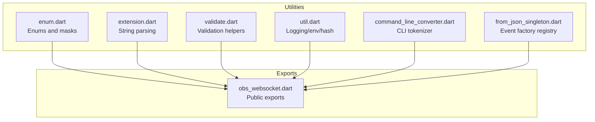
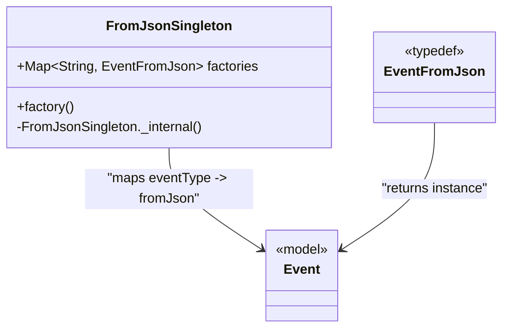
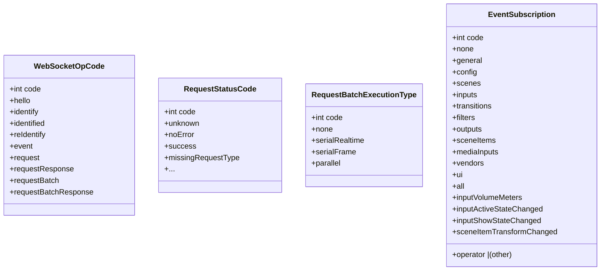
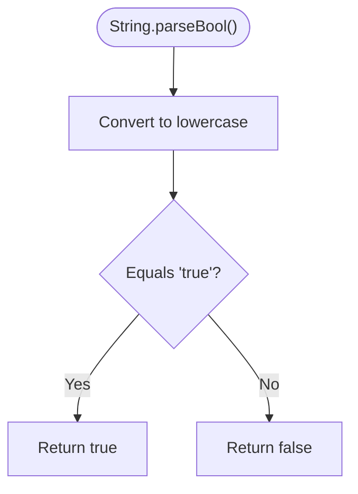
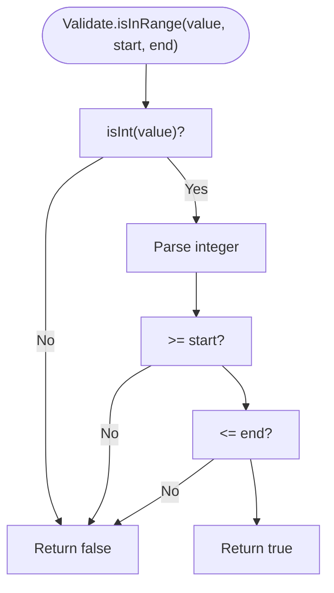
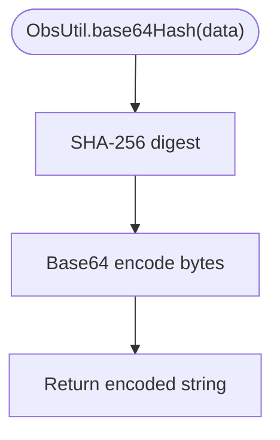
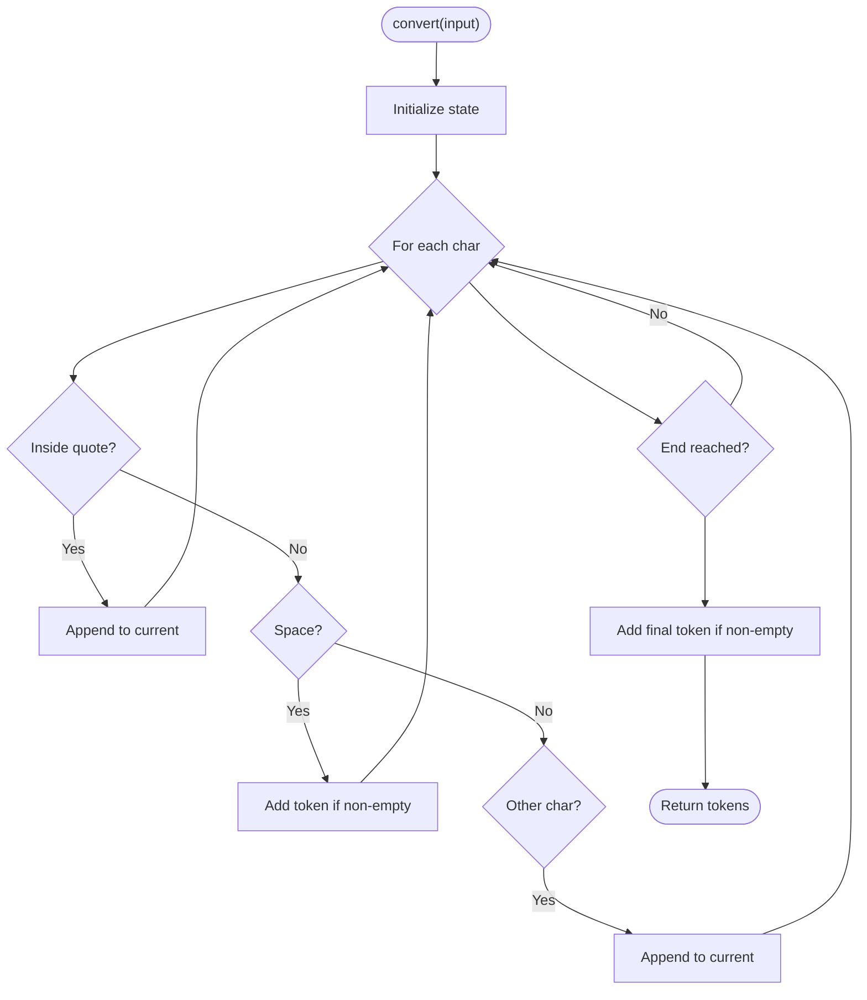
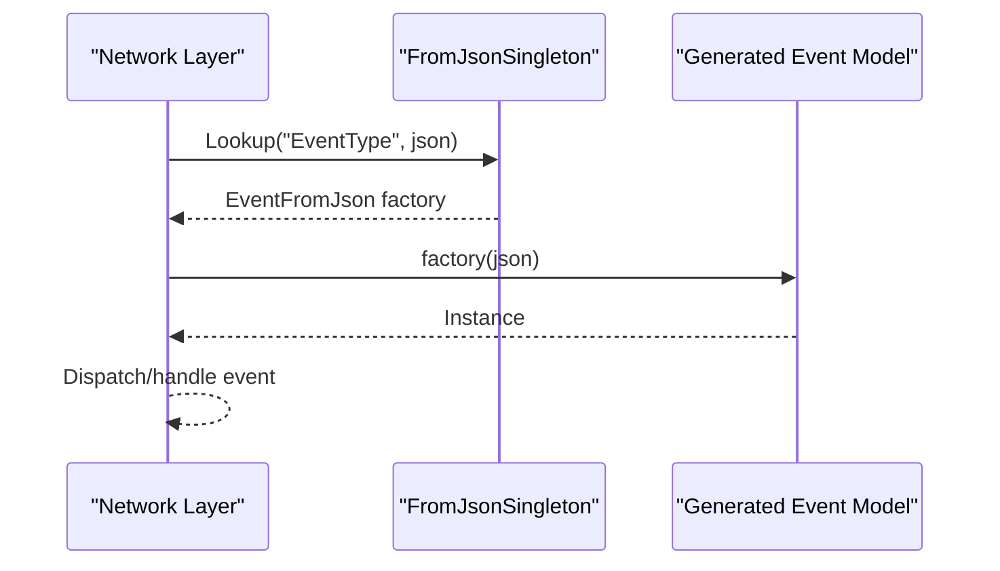
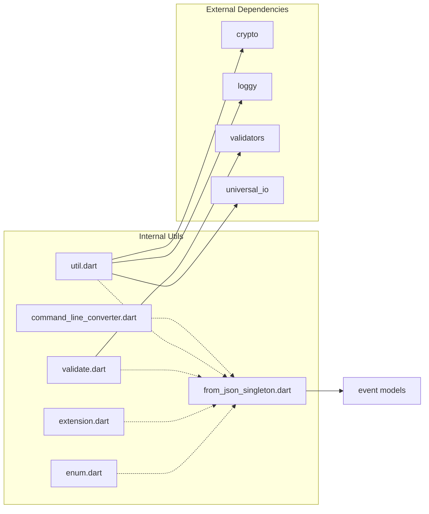

# Utility Functions and Helpers

<cite>
**Referenced Files in This Document**
- [README.md](file://README.md)
- [pubspec.yaml](file://pubspec.yaml)
- [lib/obs_websocket.dart](file://lib/obs_websocket.dart)
- [lib/src/util/enum.dart](file://lib/src/util/enum.dart)
- [lib/src/util/extension.dart](file://lib/src/util/extension.dart)
- [lib/src/util/util.dart](file://lib/src/util/util.dart)
- [lib/src/util/validate.dart](file://lib/src/util/validate.dart)
- [lib/src/util/command_line_converter.dart](file://lib/src/util/command_line_converter.dart)
- [lib/src/from_json_singleton.dart](file://lib/src/from_json_singleton.dart)
- [lib/src/model/comm/event.dart](file://lib/src/model/comm/event.dart)
- [lib/src/model/event/base_event.dart](file://lib/src/model/event/base_event.dart)
</cite>

## Table of Contents
1. [Introduction](#introduction)
2. [Project Structure](#project-structure)
3. [Core Components](#core-components)
4. [Architecture Overview](#architecture-overview)
5. [Detailed Component Analysis](#detailed-component-analysis)
6. [Dependency Analysis](#dependency-analysis)
7. [Performance Considerations](#performance-considerations)
8. [Troubleshooting Guide](#troubleshooting-guide)
9. [Conclusion](#conclusion)
10. [Appendices](#appendices)

## Introduction
This document focuses on the utility functions, helper classes, and convenience methods that support the obs-websocket Dart package. It covers:
- Enum utilities for protocol opcodes, request status codes, batch execution types, and event subscriptions
- String parsing extensions for common conversions
- Validation utilities for numeric bounds and null checks
- Logging and environment helpers
- Command-line argument parsing helpers
- JSON deserialization helpers powered by a singleton registry
- Thread-safety, caching, and resource management considerations
- Migration notes and compatibility guidance

The goal is to provide practical guidance for leveraging these utilities effectively while understanding their performance characteristics and best practices.

## Project Structure
The utility layer resides under lib/src/util and is exported via lib/obs_websocket.dart. The primary categories are:
- Enum utilities: WebSocket opcodes, request status codes, batch execution types, and event subscription masks
- Extensions: String parsing helpers
- Validation: Numeric range and null checks
- Utilities: Logging options conversion, environment access, hashing helpers
- Command-line parsing: Robust quoting-aware tokenizer
- JSON deserialization: Singleton registry mapping event types to generated fromJson factories

**Diagram sources**
- [lib/src/util/enum.dart:1-88](file://lib/src/util/enum.dart#L1-L88)
- [lib/src/util/extension.dart:1-6](file://lib/src/util/extension.dart#L1-L6)
- [lib/src/util/validate.dart:1-19](file://lib/src/util/validate.dart#L1-L19)
- [lib/src/util/util.dart:1-44](file://lib/src/util/util.dart#L1-L44)
- [lib/src/util/command_line_converter.dart:1-67](file://lib/src/util/command_line_converter.dart#L1-L67)
- [lib/src/from_json_singleton.dart:1-100](file://lib/src/from_json_singleton.dart#L1-L100)
- [lib/obs_websocket.dart:63-68](file://lib/obs_websocket.dart#L63-L68)

**Section sources**
- [lib/obs_websocket.dart:63-68](file://lib/obs_websocket.dart#L63-L68)
- [pubspec.yaml:13-23](file://pubspec.yaml#L13-L23)

## Core Components
This section summarizes the primary utility modules and their responsibilities.

- Enum utilities
  - WebSocketOpCode: Protocol opcode constants mapped to integer codes
  - RequestStatusCode: Request response codes aligned with obs-websocket protocol semantics
  - RequestBatchExecutionType: Batch execution modes for request batches
  - EventSubscription: Bitwise masks for event subscriptions with a union operator
- String parsing extension
  - BoolParsing: Case-insensitive string-to-bool conversion
- Validation utilities
  - Null checks and integer validation
  - Range checks with configurable bounds
- Logging and environment helpers
  - Convert log level strings to structured logging options
  - Access user home directory across platforms
  - SHA-256 base64 hash helper for authentication data
- Command-line argument parser
  - Tokenizes strings into lists respecting single and double quotes
- JSON deserialization helper
  - Singleton registry mapping event type strings to generated fromJson factories

**Section sources**
- [lib/src/util/enum.dart:1-88](file://lib/src/util/enum.dart#L1-L88)
- [lib/src/util/extension.dart:1-6](file://lib/src/util/extension.dart#L1-L6)
- [lib/src/util/validate.dart:1-19](file://lib/src/util/validate.dart#L1-L19)
- [lib/src/util/util.dart:1-44](file://lib/src/util/util.dart#L1-L44)
- [lib/src/util/command_line_converter.dart:1-67](file://lib/src/util/command_line_converter.dart#L1-L67)
- [lib/src/from_json_singleton.dart:1-100](file://lib/src/from_json_singleton.dart#L1-L100)

## Architecture Overview
The utility subsystem is intentionally decoupled and stateless, with the exception of the singleton registry for JSON deserialization. The FromJsonSingleton maintains a static map of event types to factory functions, enabling runtime polymorphic construction of event models.

**Diagram sources**
- [lib/src/from_json_singleton.dart:6-99](file://lib/src/from_json_singleton.dart#L6-L99)
- [lib/src/model/comm/event.dart](file://lib/src/model/comm/event.dart)

**Section sources**
- [lib/src/from_json_singleton.dart:1-100](file://lib/src/from_json_singleton.dart#L1-L100)

## Detailed Component Analysis

### Enum Utilities
The enum utilities define protocol-level constants and masks used throughout the library.

- WebSocketOpCode
  - Purpose: Encode protocol opcodes for message framing
  - Complexity: O(1) lookup
  - Notes: Immutable code mapping
- RequestStatusCode
  - Purpose: Standardized response codes for requests
  - Complexity: O(1) lookup
  - Notes: Covers protocol-defined categories (unknown, success, missing fields, resource errors, etc.)
- RequestBatchExecutionType
  - Purpose: Control batch execution semantics
  - Complexity: O(1) lookup
  - Notes: Supports serial-realtime, serial-frame, and parallel modes
- EventSubscription
  - Purpose: Bitwise masks for event subscriptions
  - Complexity: O(1) mask operations
  - Notes: Includes a union operator for combining subscriptions

**Diagram sources**
- [lib/src/util/enum.dart:1-88](file://lib/src/util/enum.dart#L1-L88)

**Section sources**
- [lib/src/util/enum.dart:1-88](file://lib/src/util/enum.dart#L1-L88)

### String Parsing Extension
The BoolParsing extension adds a case-insensitive boolean parsing method to String.

- Method: parseBool()
- Behavior: Converts "true" to true regardless of case
- Complexity: O(n) for string comparison where n is length of string
- Thread-safety: Safe; immutable string operations

**Diagram sources**
- [lib/src/util/extension.dart:1-6](file://lib/src/util/extension.dart#L1-L6)

**Section sources**
- [lib/src/util/extension.dart:1-6](file://lib/src/util/extension.dart#L1-L6)

### Validation Utilities
The Validate class provides lightweight validation helpers for string inputs.

- Methods:
  - isNull(value): Checks for null or empty
  - isNotNull(value): Negation of isNull
  - isInt(value): Validates integer strings
  - isGreaterOrEqual(value, lowerBound): Ensures numeric >= lowerBound
  - isLessOrEqual(value, upperBound): Ensures numeric <= upperBound
  - isInRange(value, start, end): Ensures start <= numeric <= end
- Complexity: O(1) per check; parsing cost O(d) where d is digit count
- Thread-safety: Safe; pure functions

**Diagram sources**
- [lib/src/util/validate.dart:1-19](file://lib/src/util/validate.dart#L1-L19)

**Section sources**
- [lib/src/util/validate.dart:1-19](file://lib/src/util/validate.dart#L1-L19)

### Logging and Environment Helpers
ObsUtil centralizes common platform and logging helpers.

- convertToLogOptions(logLevel): Maps string log levels to structured logging options
- get userHome: Returns HOME or USERPROFILE environment variable
- base64Hash(data): Computes SHA-256 and base64-encodes the digest
- Complexity: O(1) for options; O(n) for hashing where n is input length
- Thread-safety: Safe; pure functions except for environment reads

**Diagram sources**
- [lib/src/util/util.dart:39-43](file://lib/src/util/util.dart#L39-L43)

**Section sources**
- [lib/src/util/util.dart:1-44](file://lib/src/util/util.dart#L1-L44)

### Command-Line Argument Parser
CommandLineConverter converts a single string into a list of tokens, respecting quoted segments.

- Features:
  - Handles single and double quotes
  - Ignores whitespace outside quotes
  - Throws on unbalanced quotes
- Complexity: O(n) over input length
- Thread-safety: Safe; immutable string operations

**Diagram sources**
- [lib/src/util/command_line_converter.dart:1-67](file://lib/src/util/command_line_converter.dart#L1-L67)

**Section sources**
- [lib/src/util/command_line_converter.dart:1-67](file://lib/src/util/command_line_converter.dart#L1-L67)

### JSON Deserialization Helpers and FromJsonSingleton Pattern
The FromJsonSingleton maintains a static registry mapping event type strings to generated fromJson factories. This enables automatic deserialization of incoming events into strongly typed models.

- Registry composition:
  - Static map keyed by event type string
  - Values are factory functions returning model instances
- Thread-safety:
  - The singleton is initialized once and holds an immutable map
  - Access is safe; mutation is not supported
- Caching:
  - Map lookup is O(1) average-case
  - No additional caching layer is needed
- Resource management:
  - No external resources managed by the singleton
  - Memory footprint proportional to number of supported event types

**Diagram sources**
- [lib/src/from_json_singleton.dart:9-92](file://lib/src/from_json_singleton.dart#L9-L92)
- [lib/src/model/comm/event.dart](file://lib/src/model/comm/event.dart)

**Section sources**
- [lib/src/from_json_singleton.dart:1-100](file://lib/src/from_json_singleton.dart#L1-L100)

## Dependency Analysis
The utilities depend on standard libraries and small external packages. The following diagram shows key dependencies and their roles.

**Diagram sources**
- [lib/src/util/util.dart:1-6](file://lib/src/util/util.dart#L1-L6)
- [lib/src/util/validate.dart:1-2](file://lib/src/util/validate.dart#L1-L2)
- [lib/src/from_json_singleton.dart:1-1](file://lib/src/from_json_singleton.dart#L1-L1)
- [pubspec.yaml:13-23](file://pubspec.yaml#L13-L23)

**Section sources**
- [pubspec.yaml:13-23](file://pubspec.yaml#L13-L23)

## Performance Considerations
- Enum and mask operations are O(1)
- String parsing and validation are O(n) in input length
- Hashing is O(n) in input length; minimal overhead for typical authentication data
- CLI tokenizer is O(n) over input length
- FromJsonSingleton map lookups are O(1) average-case; no repeated allocations
- Logging option conversion is O(1)
- Environment access is O(1) but depends on OS environment variables

Best practices:
- Prefer enum comparisons over string comparisons for protocol opcodes and status codes
- Use Validate helpers to pre-validate inputs before expensive operations
- Reuse ObsUtil.hash and ObsUtil.convertToLogOptions to avoid repeated computations
- For high-frequency event processing, rely on the singleton registry for fast deserialization

[No sources needed since this section provides general guidance]

## Troubleshooting Guide
Common issues and resolutions:
- Unbalanced quotes in CLI input
  - Symptom: Exception thrown during tokenization
  - Resolution: Ensure all quotes are balanced in the input string
- Unexpected boolean parsing
  - Symptom: parseBool() returns false for "TRUE"
  - Resolution: The method is case-insensitive; confirm input is exactly "true"
- Validation failures
  - Symptom: isInRange returns false unexpectedly
  - Resolution: Verify the string represents a valid integer and falls within the specified bounds
- Logging level not applied
  - Symptom: Logs appear at default level
  - Resolution: Ensure the log level string matches supported values ("all", "debug", "info", "warning", "error")
- Event deserialization not working
  - Symptom: Unknown event type or failure to instantiate model
  - Resolution: Confirm the event type string exists in the FromJsonSingleton registry and the corresponding model has a generated fromJson factory

**Section sources**
- [lib/src/util/command_line_converter.dart:60-62](file://lib/src/util/command_line_converter.dart#L60-L62)
- [lib/src/util/extension.dart:1-6](file://lib/src/util/extension.dart#L1-L6)
- [lib/src/util/validate.dart:1-19](file://lib/src/util/validate.dart#L1-L19)
- [lib/src/util/util.dart:8-34](file://lib/src/util/util.dart#L8-L34)
- [lib/src/from_json_singleton.dart:9-92](file://lib/src/from_json_singleton.dart#L9-L92)

## Conclusion
The utility layer provides a focused set of helpers that improve developer ergonomics, reduce boilerplate, and ensure consistent behavior across the library. Enums and masks simplify protocol interactions; validation and parsing helpers prevent common pitfalls; and the singleton-based JSON deserialization enables efficient, extensible event handling. With careful attention to thread-safety and performance characteristics, these utilities offer a robust foundation for building applications around the obs-websocket protocol.

[No sources needed since this section summarizes without analyzing specific files]

## Appendices

### Practical Usage Examples
- Using BoolParsing extension
  - Path: [lib/src/util/extension.dart:1-6](file://lib/src/util/extension.dart#L1-L6)
  - Typical usage: Convert configuration flags or user input to booleans safely
- Applying validation helpers
  - Path: [lib/src/util/validate.dart:1-19](file://lib/src/util/validate.dart#L1-L19)
  - Typical usage: Validate numeric inputs for scene indices, volume levels, or frame counts
- Converting log levels
  - Path: [lib/src/util/util.dart:8-34](file://lib/src/util/util.dart#L8-L34)
  - Typical usage: Initialize logging based on environment or CLI flags
- Generating hashed credentials
  - Path: [lib/src/util/util.dart:39-43](file://lib/src/util/util.dart#L39-L43)
  - Typical usage: Prepare authentication hashes for secure connections
- Tokenizing CLI arguments
  - Path: [lib/src/util/command_line_converter.dart:1-67](file://lib/src/util/command_line_converter.dart#L1-L67)
  - Typical usage: Parse user-provided command strings into executable arguments
- Automatic event deserialization
  - Path: [lib/src/from_json_singleton.dart:9-92](file://lib/src/from_json_singleton.dart#L9-L92)
  - Typical usage: Register new event types by adding entries to the singleton map

**Section sources**
- [lib/src/util/extension.dart:1-6](file://lib/src/util/extension.dart#L1-L6)
- [lib/src/util/validate.dart:1-19](file://lib/src/util/validate.dart#L1-L19)
- [lib/src/util/util.dart:8-43](file://lib/src/util/util.dart#L8-L43)
- [lib/src/util/command_line_converter.dart:1-67](file://lib/src/util/command_line_converter.dart#L1-L67)
- [lib/src/from_json_singleton.dart:9-92](file://lib/src/from_json_singleton.dart#L9-L92)

### Thread Safety and Caching
- Thread safety
  - Enum utilities: Safe; constants
  - BoolParsing: Safe; immutable string operations
  - Validate: Safe; pure functions
  - ObsUtil: Safe; pure functions except environment reads
  - CommandLineConverter: Safe; immutable string operations
  - FromJsonSingleton: Safe; initialized once with immutable map
- Caching
  - No explicit caching layers; rely on constant-time lookups
  - Consider memoizing expensive conversions only if profiling indicates bottlenecks

**Section sources**
- [lib/src/util/enum.dart:1-88](file://lib/src/util/enum.dart#L1-L88)
- [lib/src/util/extension.dart:1-6](file://lib/src/util/extension.dart#L1-L6)
- [lib/src/util/validate.dart:1-19](file://lib/src/util/validate.dart#L1-L19)
- [lib/src/util/util.dart:1-44](file://lib/src/util/util.dart#L1-L44)
- [lib/src/util/command_line_converter.dart:1-67](file://lib/src/util/command_line_converter.dart#L1-L67)
- [lib/src/from_json_singleton.dart:6-99](file://lib/src/from_json_singleton.dart#L6-L99)

### Migration and Compatibility Notes
- Breaking changes overview
  - The project underwent significant protocol changes between versions; ensure compatibility with the target obs-websocket protocol version
  - Review README for breaking changes and upgrade guidance
- Utility changes
  - If extending FromJsonSingleton, maintain backward compatibility by keeping existing event type mappings
  - When introducing new enums or masks, add them alongside existing ones to avoid breaking changes
  - Keep validation helpers consistent in behavior to prevent regressions in input handling

**Section sources**
- [README.md:37-40](file://README.md#L37-L40)
- [lib/src/from_json_singleton.dart:9-92](file://lib/src/from_json_singleton.dart#L9-L92)