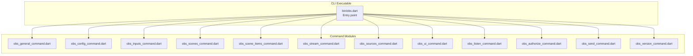
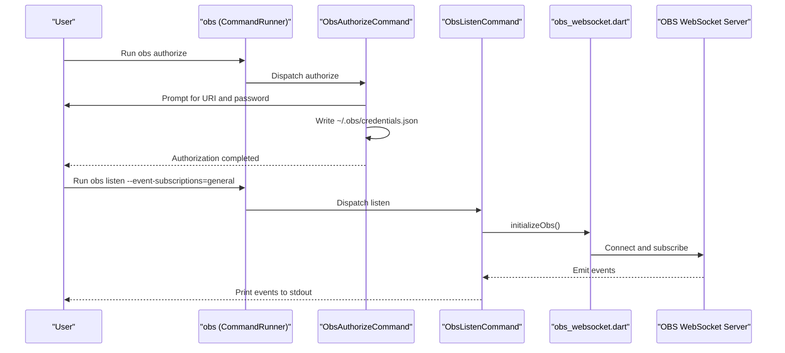
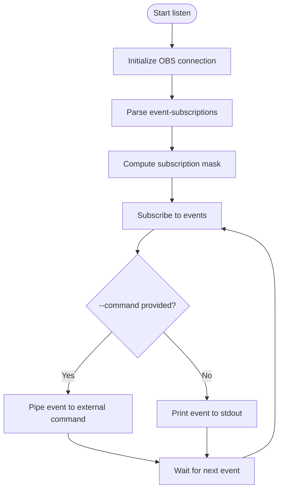
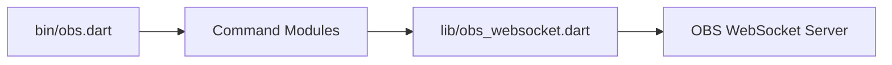

# CLI Interface

<cite>
**Referenced Files in This Document**
- [obs.dart](file://bin/obs.dart)
- [README.md](file://bin/README.md)
- [pubspec.yaml](file://pubspec.yaml)
- [obs_authorize_command.dart](file://lib/src/cmd/obs_authorize_command.dart)
- [obs_listen_command.dart](file://lib/src/cmd/obs_listen_command.dart)
- [obs_general_command.dart](file://lib/src/cmd/obs_general_command.dart)
- [obs_config_command.dart](file://lib/src/cmd/obs_config_command.dart)
- [obs_inputs_command.dart](file://lib/src/cmd/obs_inputs_command.dart)
- [obs_scene_items_command.dart](file://lib/src/cmd/obs_scene_items_command.dart)
- [obs_scenes_command.dart](file://lib/src/cmd/obs_scenes_command.dart)
- [obs_stream_command.dart](file://lib/src/cmd/obs_stream_command.dart)
- [obs_sources_command.dart](file://lib/src/cmd/obs_sources_command.dart)
- [obs_ui_command.dart](file://lib/src/cmd/obs_ui_command.dart)
- [obs_send_command.dart](file://lib/src/cmd/obs_send_command.dart)
- [obs_version_command.dart](file://lib/src/cmd/obs_version_command.dart)
- [obs_websocket.dart](file://lib/obs_websocket.dart)
</cite>

## Table of Contents
1. [Introduction](#introduction)
2. [Project Structure](#project-structure)
3. [Core Components](#core-components)
4. [Architecture Overview](#architecture-overview)
5. [Detailed Component Analysis](#detailed-component-analysis)
6. [Dependency Analysis](#dependency-analysis)
7. [Performance Considerations](#performance-considerations)
8. [Troubleshooting Guide](#troubleshooting-guide)
9. [Conclusion](#conclusion)
10. [Appendices](#appendices)

## Introduction
This document describes the command-line interface (CLI) for controlling OBS instances via the obs-websocket protocol. It covers installation, configuration, command syntax, parameters, and practical usage patterns. The CLI supports authentication file generation, event monitoring, and a broad set of commands grouped by functional categories: general, config, inputs, scenes, scene-items, stream, sources, and UI. It also includes advanced capabilities such as low-level request sending and event-driven automation.

## Project Structure
The CLI is implemented as a Dart executable named obs with subcommands for each functional area. The main entry point registers global options and adds all available commands. Documentation for commands and usage is maintained alongside the implementation.

**Diagram sources**
- [obs.dart](file://bin/obs.dart)
- [obs_general_command.dart](file://lib/src/cmd/obs_general_command.dart)
- [obs_config_command.dart](file://lib/src/cmd/obs_config_command.dart)
- [obs_inputs_command.dart](file://lib/src/cmd/obs_inputs_command.dart)
- [obs_scenes_command.dart](file://lib/src/cmd/obs_scenes_command.dart)
- [obs_scene_items_command.dart](file://lib/src/cmd/obs_scene_items_command.dart)
- [obs_stream_command.dart](file://lib/src/cmd/obs_stream_command.dart)
- [obs_sources_command.dart](file://lib/src/cmd/obs_sources_command.dart)
- [obs_ui_command.dart](file://lib/src/cmd/obs_ui_command.dart)
- [obs_listen_command.dart](file://lib/src/cmd/obs_listen_command.dart)
- [obs_authorize_command.dart](file://lib/src/cmd/obs_authorize_command.dart)
- [obs_send_command.dart](file://lib/src/cmd/obs_send_command.dart)
- [obs_version_command.dart](file://lib/src/cmd/obs_version_command.dart)

**Section sources**
- [obs.dart](file://bin/obs.dart)
- [pubspec.yaml](file://pubspec.yaml)

## Core Components
- Global options
  - --uri, -u: WebSocket endpoint for OBS (e.g., ws://localhost:4444)
  - --timeout, -t: Connection timeout in seconds
  - --log-level, -l: Logging level (all, debug, info, warning, error, off)
  - --passwd, -p: OBS websocket password (required if OBS requires authentication)
- Commands
  - authorize: Generates an authentication file for OBS connections
  - general: Version, stats, and hotkey-related commands
  - config: Video and stream service settings
  - inputs: Manage inputs (list, create, remove, mute, rename, settings)
  - scenes: Scene and group listings
  - scene-items: Scene item locking
  - stream: Stream status, start/stop/toggle, captions
  - sources: Source active state and screenshots
  - ui: Monitor list and studio mode
  - listen: Subscribe to OBS events and optionally run a command per event
  - send: Low-level request sending
  - version: Print package name and version

**Section sources**
- [obs.dart](file://bin/obs.dart)
- [README.md](file://bin/README.md)

## Architecture Overview
The CLI orchestrates user commands by parsing arguments, establishing a WebSocket connection to OBS, and invoking the appropriate request handlers. Events can be streamed to stdout or forwarded to external processes for automation.

**Diagram sources**
- [obs.dart](file://bin/obs.dart)
- [obs_authorize_command.dart](file://lib/src/cmd/obs_authorize_command.dart)
- [obs_listen_command.dart](file://lib/src/cmd/obs_listen_command.dart)
- [obs_websocket.dart](file://lib/obs_websocket.dart)

## Detailed Component Analysis

### Installation and Setup
- Install using Dart pub global activate
  - Activate the package globally so the obs executable is available
- Verify installation
  - Run obs --help to list available commands and global options
- Authentication file
  - Run obs authorize and follow prompts to create ~/.obs/credentials.json with uri and password

**Section sources**
- [README.md](file://bin/README.md)
- [pubspec.yaml](file://pubspec.yaml)

### Global Options and Connection Parameters
- --uri, -u: WebSocket URL (e.g., ws://localhost:4444)
- --timeout, -t: Connection timeout in seconds
- --log-level, -l: Logging verbosity level
- --passwd, -p: Password for OBS websocket authentication

These options are parsed by the main entry point and applied to the underlying connection.

**Section sources**
- [obs.dart](file://bin/obs.dart)

### authorize
- Purpose: Generate an authentication file for OBS connections
- Behavior
  - Prompts for URI and password
  - Writes a JSON file with uri and password fields
  - Overwrite prompt if credentials already exist
- Output
  - ~/.obs/credentials.json

**Section sources**
- [obs_authorize_command.dart](file://lib/src/cmd/obs_authorize_command.dart)

### listen
- Purpose: Subscribe to OBS events and print them to stdout
- Options
  - --event-subscriptions: Comma-separated list of subscriptions (e.g., general, scenes, inputs)
  - --command: Optional shell command to execute for each event
- Behavior
  - Initializes OBS connection
  - Subscribes to selected event categories
  - Prints events to stdout or pipes them to the specified command
- Usage patterns
  - Tail events: obs listen --event-subscriptions=general
  - Trigger actions: obs listen --event-subscriptions=general --command "your-script.sh"

**Diagram sources**
- [obs_listen_command.dart](file://lib/src/cmd/obs_listen_command.dart)

**Section sources**
- [obs_listen_command.dart](file://lib/src/cmd/obs_listen_command.dart)

### send (Low-level)
- Purpose: Send raw OBS requests via WebSocket
- Options
  - --command, -c: Request name (from OBS protocol)
  - --args, -a: JSON-encoded arguments for the request
- Notes
  - Useful for experimental or unsupported features
  - Responses are printed as JSON

**Section sources**
- [obs_send_command.dart](file://lib/src/cmd/obs_send_command.dart)

### version
- Purpose: Display package name and version
- Output: JSON with name and version fields

**Section sources**
- [obs_version_command.dart](file://lib/src/cmd/obs_version_command.dart)

### Functional Categories

#### General Commands
- Commands
  - get-version: Plugin and RPC version
  - get-stats: OBS, obs-websocket, and session statistics
  - broadcast-custom-event: Emit a custom event payload
  - call-vendor-request: Invoke a vendor-specific request
  - obs-browser-event: Send a browser plugin event
  - get-hotkey-list: List hotkey names
  - trigger-hotkey-by-name: Trigger a hotkey by name
  - trigger-hotkey-by-key-sequence: Trigger a hotkey by key sequence
  - sleep: Pause request batches (SERIAL_REALTIME or SERIAL_FRAME)
- Typical usage
  - Retrieve version and stats for diagnostics
  - Trigger hotkeys programmatically
  - Broadcast custom events to other clients

**Section sources**
- [obs_general_command.dart](file://lib/src/cmd/obs_general_command.dart)

#### Config Commands
- Commands
  - get-video-settings: Current video settings
  - set-video-settings: Set FPS numerator/denominator and resolutions
  - get-stream-service-settings: Current stream destination settings
  - set-stream-service-settings: Apply stream service type and settings
  - get-record-directory: Current recording directory
- Validation
  - set-video-settings enforces numeric ranges for width/height and FPS fractions
- Typical usage
  - Adjust output resolution and frame rate
  - Configure streaming destination and credentials

**Section sources**
- [obs_config_command.dart](file://lib/src/cmd/obs_config_command.dart)

#### Inputs Commands
- Commands
  - get-input-list: List inputs (optionally filtered by kind)
  - get-input-kind-list: List input kinds (with optional unversioned flag)
  - get-special-inputs: Names of special inputs
  - create-input: Add a new input to a scene
  - remove-input: Remove an input (by name or UUID)
  - set-input-name: Rename an input
  - get-input-mute: Query mute state
  - set-input-mute: Set mute state
  - get-input-default-settings: Defaults for an input kind
  - get-input-settings: Current settings for an input
  - set-input-settings: Apply settings (overlay or reset)
  - toggle-input-mute: Toggle mute state
- Validation and constraints
  - Some commands require either inputName or inputUuid
  - create-input accepts optional scene targeting and settings
- Typical usage
  - Manage audio/video sources and their settings
  - Mute/unmute inputs during live production

**Section sources**
- [obs_inputs_command.dart](file://lib/src/cmd/obs_inputs_command.dart)

#### Scenes Commands
- Commands
  - get-scenes-list: List all scenes
  - get-group-list: List all groups
  - get-current-program-scene: Current program scene
- Typical usage
  - Switch scenes programmatically via other integrations
  - Inspect scene composition

**Section sources**
- [obs_scenes_command.dart](file://lib/src/cmd/obs_scenes_command.dart)

#### Scene Items Commands
- Commands
  - get-scene-item-list: List items in a scene
  - get-scene-item-locked: Query lock state of a scene item
  - set-scene-item-locked: Lock or unlock a scene item
- Parameters
  - scene-name: Required
  - scene-item-id: Required numeric identifier
- Typical usage
  - Prevent accidental edits during live shows

**Section sources**
- [obs_scene_items_command.dart](file://lib/src/cmd/obs_scene_items_command.dart)

#### Stream Commands
- Commands
  - get-stream-status: Streaming status and metrics
  - toggle-stream: Toggle streaming on/off
  - start-streaming: Start streaming
  - stop-streaming: Stop streaming
  - send-stream-caption: Send CEA-608 caption text
- Typical usage
  - Control stream lifecycle
  - Provide closed captions for accessibility

**Section sources**
- [obs_stream_command.dart](file://lib/src/cmd/obs_stream_command.dart)

#### Sources Commands
- Commands
  - get-source-active: Active and show state of a source
  - get-source-screenshot: Base64-encoded screenshot
  - save-source-screenshot: Save screenshot to filesystem
- Parameters
  - source-name: Required
  - image-format: Required (query supported formats via get-version)
  - image-file-path: Required for save-source-screenshot
- Typical usage
  - Capture thumbnails for overlays or moderation
  - Automate screenshot-based workflows

**Section sources**
- [obs_sources_command.dart](file://lib/src/cmd/obs_sources_command.dart)

#### UI Commands
- Commands
  - get-monitor-list: Connected monitor information
  - get-studio-mode-enabled: Studio mode status
  - set-studio-mode-enabled: Enable/disable studio mode
- Typical usage
  - Integrate with external control surfaces or scripts

**Section sources**
- [obs_ui_command.dart](file://lib/src/cmd/obs_ui_command.dart)

### Command Chaining and Scripting Integration
- Shell piping
  - Use standard Unix pipes to chain CLI outputs with tools like jq for JSON processing
- Event-driven automation
  - Combine obs listen with --command to execute scripts on specific events
- Batch-like sequences
  - Use general/sleep to introduce timing between actions in scripts
- Example patterns
  - Start streaming, wait, then capture a screenshot
  - Toggle mute on a specific input, then broadcast a custom event

[No sources needed since this section provides general guidance]

## Dependency Analysis
The CLI depends on the obs_websocket library for WebSocket communication and request handling. The main entry point registers commands and parses global options. Each command module encapsulates its own argument parsing and invokes the underlying obs_websocket APIs.

**Diagram sources**
- [obs.dart](file://bin/obs.dart)
- [obs_websocket.dart](file://lib/obs_websocket.dart)

**Section sources**
- [obs.dart](file://bin/obs.dart)
- [obs_websocket.dart](file://lib/obs_websocket.dart)

## Performance Considerations
- Event volume
  - Some event categories (e.g., inputVolumeMeters, sceneItemTransformChanged) are high-volume; avoid subscribing to them unless necessary
- Connection timeouts
  - Increase --timeout for slow networks or busy systems
- Logging overhead
  - Reduce --log-level to minimize console output during automation runs

[No sources needed since this section provides general guidance]

## Troubleshooting Guide
- Authentication failures
  - Ensure ~/.obs/credentials.json exists and contains the correct uri and password
  - Re-run obs authorize to regenerate credentials
- Connection errors
  - Verify --uri points to the correct OBS WebSocket address
  - Confirm OBS has the obs-websocket plugin installed and configured
- Permission denied
  - If OBS requires a password, supply --passwd or configure credentials
- Timeout exceeded
  - Increase --timeout or reduce event subscriptions
- Argument validation errors
  - Many commands enforce parameter ranges (e.g., set-video-settings)
  - Review command-specific constraints and retry with valid values

**Section sources**
- [obs_authorize_command.dart](file://lib/src/cmd/obs_authorize_command.dart)
- [obs_config_command.dart](file://lib/src/cmd/obs_config_command.dart)
- [obs.dart](file://bin/obs.dart)

## Conclusion
The obs CLI provides a comprehensive, extensible interface for automating and integrating with OBS. By leveraging authentication files, event subscriptions, and low-level requests, users can build robust automation workflows and integrate OBS into broader production toolchains.

[No sources needed since this section summarizes without analyzing specific files]

## Appendices

### Quick Reference: Global Options
- --uri, -u: WebSocket endpoint
- --timeout, -t: Connection timeout (seconds)
- --log-level, -l: Logging level
- --passwd, -p: OBS websocket password

**Section sources**
- [obs.dart](file://bin/obs.dart)

### Quick Reference: Command Categories
- authorize: Generate credentials
- general: Version, stats, hotkeys
- config: Video/stream settings, record directory
- inputs: List/create/remove/mute/rename/settings
- scenes: Scene/group/current program
- scene-items: Item list/lock state
- stream: Status/start/stop/toggle/captions
- sources: Active state/screenshot/save screenshot
- ui: Monitor list/studio mode
- listen: Event subscription and forwarding
- send: Low-level request
- version: Package metadata

**Section sources**
- [README.md](file://bin/README.md)