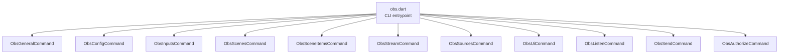
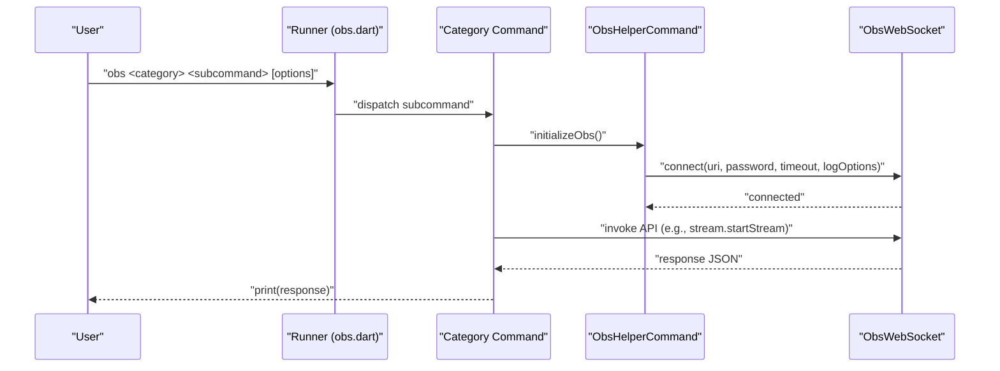
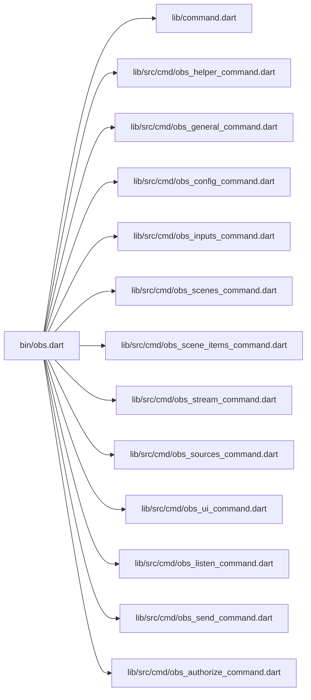

# Command Categories

<cite>
**Referenced Files in This Document**
- [obs.dart](file://bin/obs.dart)
- [README.md](file://bin/README.md)
- [command.dart](file://lib/command.dart)
- [obs_helper_command.dart](file://lib/src/cmd/obs_helper_command.dart)
- [obs_authorize_command.dart](file://lib/src/cmd/obs_authorize_command.dart)
- [obs_general_command.dart](file://lib/src/cmd/obs_general_command.dart)
- [obs_config_command.dart](file://lib/src/cmd/obs_config_command.dart)
- [obs_inputs_command.dart](file://lib/src/cmd/obs_inputs_command.dart)
- [obs_scenes_command.dart](file://lib/src/cmd/obs_scenes_command.dart)
- [obs_scene_items_command.dart](file://lib/src/cmd/obs_scene_items_command.dart)
- [obs_stream_command.dart](file://lib/src/cmd/obs_stream_command.dart)
- [obs_sources_command.dart](file://lib/src/cmd/obs_sources_command.dart)
- [obs_ui_command.dart](file://lib/src/cmd/obs_ui_command.dart)
- [obs_listen_command.dart](file://lib/src/cmd/obs_listen_command.dart)
- [obs_send_command.dart](file://lib/src/cmd/obs_send_command.dart)
</cite>

## Table of Contents
1. [Introduction](#introduction)
2. [Project Structure](#project-structure)
3. [Core Components](#core-components)
4. [Architecture Overview](#architecture-overview)
5. [Detailed Component Analysis](#detailed-component-analysis)
6. [Dependency Analysis](#dependency-analysis)
7. [Performance Considerations](#performance-considerations)
8. [Troubleshooting Guide](#troubleshooting-guide)
9. [Conclusion](#conclusion)

## Introduction
This document describes the CLI command categories provided by the OBS WebSocket CLI. It organizes commands by functional areas and explains syntax, parameters, and practical usage patterns. The CLI supports connecting to OBS via WebSocket, authenticating with stored credentials, and invoking requests categorized under general operations, configuration, inputs, scenes, scene items, outputs, streaming, media inputs, sources, and UI controls.

## Project Structure
The CLI entrypoint registers commands and wires them into the args command runner. Each functional area is implemented as a dedicated command class with subcommands. A shared helper command manages connection initialization and credential resolution.

**Diagram sources**
- [obs.dart:6-52](file://bin/obs.dart#L6-L52)

**Section sources**
- [obs.dart:6-52](file://bin/obs.dart#L6-L52)
- [command.dart:6-20](file://lib/command.dart#L6-L20)

## Core Components
- Global options: URI, timeout, log level, and password are parsed globally and passed to the connection initializer.
- Command registration: Each command category is added to the runner and exposes subcommands.
- Connection lifecycle: Commands inherit a helper that initializes an ObsWebSocket connection using either stored credentials or explicit CLI options.

Key behaviors:
- Authentication: Stored credentials are read from a user-specific file if not provided via CLI.
- Logging: Log level is converted to ObsWebSocket logging options.
- Timeout: Connection timeout is configurable.

**Section sources**
- [obs.dart:11-36](file://bin/obs.dart#L11-L36)
- [obs_helper_command.dart:13-42](file://lib/src/cmd/obs_helper_command.dart#L13-L42)

## Architecture Overview
The CLI composes a command tree rooted at the main runner. Each category command adds its own subcommands. Subcommands parse arguments, initialize a connection, call the underlying ObsWebSocket API, and print JSON responses.

**Diagram sources**
- [obs.dart:6-52](file://bin/obs.dart#L6-L52)
- [obs_helper_command.dart:13-42](file://lib/src/cmd/obs_helper_command.dart#L13-L42)
- [obs_stream_command.dart:60-75](file://lib/src/cmd/obs_stream_command.dart#L60-L75)

## Detailed Component Analysis

### General Commands
Purpose: Retrieve runtime stats and version information, broadcast custom events, call vendor requests, and trigger hotkeys.

- Category: general
- Subcommands:
  - get-version: Returns plugin and RPC version data.
  - get-stats: Returns OBS, obs-websocket, and session statistics.
  - broadcast-custom-event: Broadcasts a custom event payload to subscribers.
  - call-vendor-request: Invokes a vendor-defined request by vendor name and request type.
  - obs-browser-event: Sends a vendor event to the obs-browser plugin.
  - get-hotkey-list: Lists all hotkey names.
  - trigger-hotkey-by-name: Triggers a hotkey by name.
  - trigger-hotkey-by-key-sequence: Triggers a hotkey by key ID and modifiers.
  - sleep: Pauses request batching execution.

Parameters and examples:
- get-version: No parameters.
- get-stats: No parameters.
- broadcast-custom-event: --event-data (JSON).
- call-vendor-request: --vendor-name, --request-type, --request-data (JSON).
- obs-browser-event: --event-name, --event-data (JSON).
- get-hotkey-list: No parameters.
- trigger-hotkey-by-name: --hotkey-name.
- trigger-hotkey-by-key-sequence: --key-id, --key-modifiers (JSON).
- sleep: --sleep-millis or --sleep-frames.

Practical usage:
- Check version and stats for diagnostics.
- Trigger hotkeys programmatically for automation.
- Broadcast custom events to integrate with external systems.

**Section sources**
- [obs_general_command.dart:8-306](file://lib/src/cmd/obs_general_command.dart#L8-L306)

### Config Commands
Purpose: Manage OBS configuration including video settings, stream service settings, and record directory.

- Category: config
- Subcommands:
  - get-video-settings: Retrieves current video settings.
  - set-video-settings: Updates video settings with FPS numerator/denominator and base/output resolutions.
  - get-stream-service-settings: Retrieves current stream service settings.
  - set-stream-service-settings: Applies stream service type and settings (JSON).
  - get-record-directory: Retrieves the configured record output directory.

Parameters and examples:
- set-video-settings: --fps-numerator, --fps-denominator, --base-width, --base-height, --output-width, --output-height.
- set-stream-service-settings: --stream-service-type, --stream-service-settings (JSON).
- get-record-directory: No parameters.

Practical usage:
- Adjust frame rate and resolution for performance tuning.
- Configure streaming destinations and credentials.
- Query the recording folder for post-processing scripts.

**Section sources**
- [obs_config_command.dart:10-209](file://lib/src/cmd/obs_config_command.dart#L10-L209)

### Inputs Commands
Purpose: List, create, remove, and manage input devices and sources.

- Category: inputs
- Subcommands:
  - get-input-list: Lists inputs optionally filtered by kind.
  - get-input-kind-list: Lists available input kinds, with optional unversioned filter.
  - get-special-inputs: Lists special inputs (e.g., desktop/auxiliary).
  - create-input: Creates a new input and adds it as a scene item.
  - remove-input: Removes an input by name or UUID.
  - set-input-name: Renames an input.
  - get-input-mute: Checks mute status.
  - set-input-mute: Sets mute status.
  - toggle-input-mute: Toggles mute status.
  - get-input-default-settings: Retrieves default settings for an input kind.
  - get-input-settings: Reads current input settings.
  - set-input-settings: Applies settings with optional overlay behavior.

Parameters and examples:
- get-input-list: --inputKind.
- get-input-kind-list: --[no-]unversioned.
- create-input: --sceneName or --sceneUuid, --inputName, --inputKind, --inputSettings (JSON), --sceneItemEnabled.
- remove-input: --inputName or --inputUuid.
- set-input-name: --inputName or --inputUuid, --newInputName.
- get-input-mute: --inputName.
- set-input-mute: --inputName or --inputUuid, --mute.
- toggle-input-mute: --inputName or --inputUuid.
- get-input-default-settings: --inputKind.
- get-input-settings: --inputName or --inputUuid.
- set-input-settings: --inputName or --inputUuid, --inputSettings (JSON), --overlay.

Practical usage:
- Enumerate available input kinds to discover device capabilities.
- Mute/unmute microphone/camera during a stream.
- Rename inputs to match a standardized naming scheme.
- Apply per-input settings for effects or filters.

**Section sources**
- [obs_inputs_command.dart:8-492](file://lib/src/cmd/obs_inputs_command.dart#L8-L492)

### Scenes Commands
Purpose: Inspect and navigate scenes and groups.

- Category: scenes
- Subcommands:
  - get-scenes-list: Lists all scenes.
  - get-group-list: Lists all groups.
  - get-current-program-scene: Returns the currently active program scene.

Parameters and examples:
- get-scenes-list: No parameters.
- get-group-list: No parameters.
- get-current-program-scene: No parameters.

Practical usage:
- Build dynamic scene switching tools.
- Monitor which scene is live for automation triggers.

**Section sources**
- [obs_scenes_command.dart:5-75](file://lib/src/cmd/obs_scenes_command.dart#L5-L75)

### Scene Items Commands
Purpose: Query and modify properties of items within a scene.

- Category: scene-items
- Subcommands:
  - get-scene-item-list: Lists items in a named scene.
  - get-scene-item-locked: Checks the lock state of a scene item by ID.
  - set-scene-item-locked: Sets the lock state of a scene item.

Parameters and examples:
- get-scene-item-list: -n/--scene-name.
- get-scene-item-locked: -n/--scene-name, -i/--scene-item-id.
- set-scene-item-locked: -n/--scene-name, -i/--scene-item-id, -l/--[no-]scene-item-locked.

Practical usage:
- Lock/unlock scene items to prevent accidental edits during a live show.
- Enumerate scene contents for layout or automation tools.

**Section sources**
- [obs_scene_items_command.dart:5-136](file://lib/src/cmd/obs_scene_items_command.dart#L5-L136)

### Stream Commands
Purpose: Control the streaming output lifecycle and captions.

- Category: stream
- Subcommands:
  - get-stream-status: Reports streaming status and metrics.
  - toggle-stream: Switches streaming on/off.
  - start-streaming: Begins streaming.
  - stop-streaming: Stops streaming.
  - send-stream-caption: Sends CEA-608 caption text.

Parameters and examples:
- get-stream-status: No parameters.
- toggle-stream: No parameters.
- start-streaming: No parameters.
- stop-streaming: No parameters.
- send-stream-caption: --caption-Text.

Practical usage:
- Start/stop streams based on external triggers.
- Send timed captions for accessibility.

**Section sources**
- [obs_stream_command.dart:5-122](file://lib/src/cmd/obs_stream_command.dart#L5-L122)

### Sources Commands
Purpose: Query source activity and capture screenshots.

- Category: sources
- Subcommands:
  - get-source-active: Returns active and show state of a source.
  - get-source-screenshot: Returns a Base64-encoded screenshot.
  - save-source-screenshot: Writes a screenshot to disk.

Parameters and examples:
- get-source-active: --source-name.
- get-source-screenshot: --source-name, --image-format.
- save-source-screenshot: --source-name, --image-format, --image-file-path.

Practical usage:
- Verify source visibility and activity before transitions.
- Capture thumbnails for preview panels or automated QA checks.

**Section sources**
- [obs_sources_command.dart:6-143](file://lib/src/cmd/obs_sources_command.dart#L6-L143)

### UI Commands
Purpose: Interact with the OBS user interface.

- Category: ui
- Subcommands:
  - get-studio-mode-enabled: Queries studio mode state.
  - set-studio-mode-enabled: Enables or disables studio mode.
  - get-monitor-list: Lists connected monitors and info.

Parameters and examples:
- get-studio-mode-enabled: No parameters.
- set-studio-mode-enabled: --studio-mode.
- get-monitor-list: No parameters.

Practical usage:
- Toggle studio mode for production vs preview layouts.
- Detect monitor configuration for multi-display setups.

**Section sources**
- [obs_ui_command.dart:6-82](file://lib/src/cmd/obs_ui_command.dart#L6-L82)

### Listen Command
Purpose: Subscribe to OBS events and optionally execute a shell command for each event.

- Category: listen
- Options:
  - --event-subscriptions: Comma-separated list of event categories and high-volume events.
  - --command: Shell command template to execute per event.

Practical usage:
- Pipe events to external tools for logging or alerting.
- Build real-time dashboards or automation triggers.

**Section sources**
- [obs_listen_command.dart:10-126](file://lib/src/cmd/obs_listen_command.dart#L10-L126)

### Send Command
Purpose: Issue arbitrary low-level WebSocket requests to OBS.

- Category: send
- Options:
  - --command: Request name (from the protocol).
  - --args: JSON-encoded arguments.

Practical usage:
- Access advanced or experimental requests not exposed by higher-level commands.
- Test protocol features or integrate with custom plugins.

**Section sources**
- [obs_send_command.dart:5-46](file://lib/src/cmd/obs_send_command.dart#L5-L46)

### Authorize Command
Purpose: Generate and store authentication credentials for OBS.

- Category: authorize
- Behavior:
  - Prompts for URI and password.
  - Writes credentials to a user-specific file with restricted permissions.

Practical usage:
- Set up default connection parameters for subsequent commands.
- Rotate credentials securely.

**Section sources**
- [obs_authorize_command.dart:8-90](file://lib/src/cmd/obs_authorize_command.dart#L8-L90)

## Dependency Analysis
The CLI relies on a small set of core modules:
- Runner and command wiring: bin/obs.dart
- Command exports: lib/command.dart
- Shared connection helper: lib/src/cmd/obs_helper_command.dart
- Individual command implementations: lib/src/cmd/*.dart

**Diagram sources**
- [obs.dart:6-52](file://bin/obs.dart#L6-L52)
- [command.dart:6-20](file://lib/command.dart#L6-L20)

**Section sources**
- [obs.dart:6-52](file://bin/obs.dart#L6-L52)
- [command.dart:6-20](file://lib/command.dart#L6-L20)

## Performance Considerations
- Batch requests: Use request batching for time-sensitive sequences to reduce latency.
- Event filtering: Limit event subscriptions to reduce high-volume traffic.
- Connection reuse: Initialize the connection once per command invocation; avoid reconnecting unnecessarily.
- JSON parsing: Prefer compact JSON payloads and avoid unnecessary conversions.

## Troubleshooting Guide
Common issues and remedies:
- Authentication failures: Ensure credentials are present and correct. Use the authorize command to regenerate credentials.
- Connection timeouts: Increase the timeout value for slow networks or heavy loads.
- Permission errors on credentials file: The authorize command attempts to restrict file permissions; verify platform support and manual chmod if needed.
- Missing parameters: Many subcommands require mandatory options; consult --help for each subcommand.

Operational tips:
- Use listen with targeted event subscriptions to debug connectivity and event flow.
- Employ send with --command and --args to test low-level requests and inspect responses.

**Section sources**
- [obs_authorize_command.dart:17-90](file://lib/src/cmd/obs_authorize_command.dart#L17-L90)
- [obs_helper_command.dart:13-42](file://lib/src/cmd/obs_helper_command.dart#L13-L42)
- [obs_listen_command.dart:85-126](file://lib/src/cmd/obs_listen_command.dart#L85-L126)
- [obs_send_command.dart:32-46](file://lib/src/cmd/obs_send_command.dart#L32-L46)

## Conclusion
The CLI provides a comprehensive set of commands spanning general operations, configuration, inputs, scenes, scene items, streaming, sources, and UI interactions. By leveraging the shared connection helper and consistent argument patterns, users can automate OBS workflows, integrate with external systems, and build robust monitoring and control solutions.