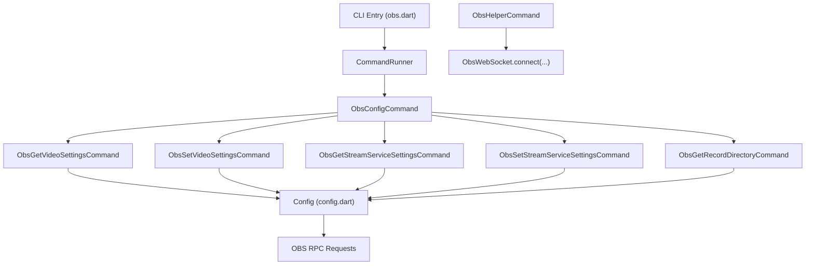
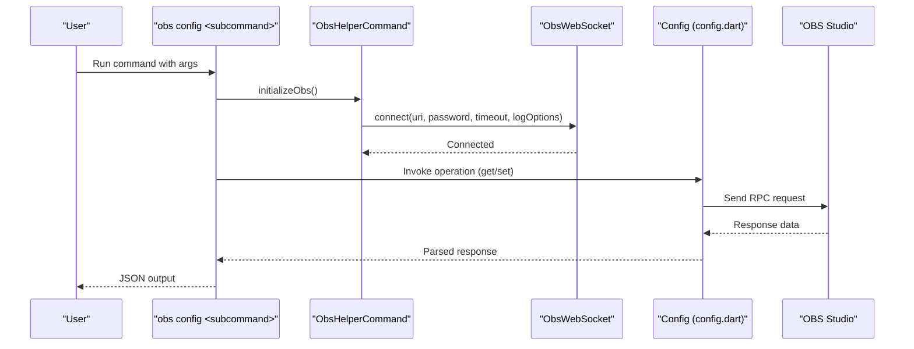
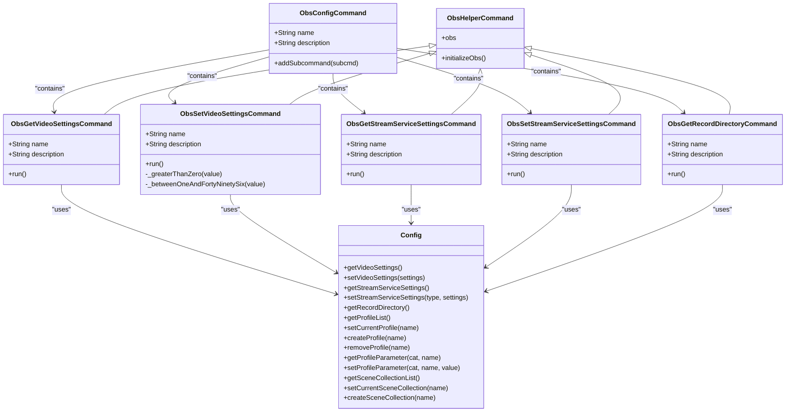
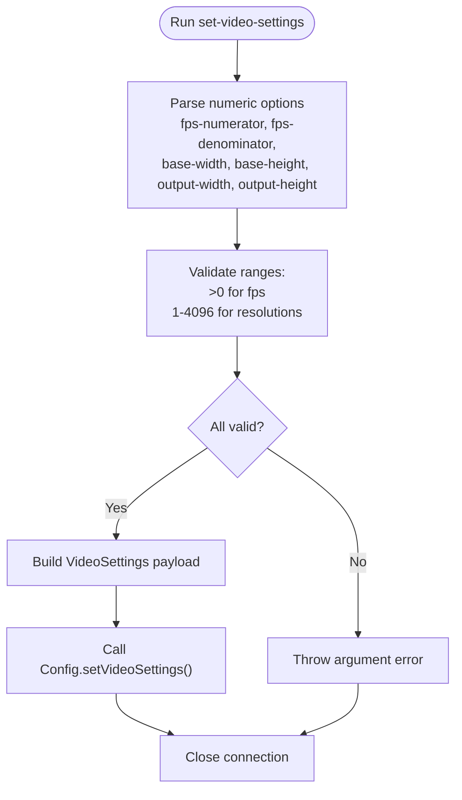
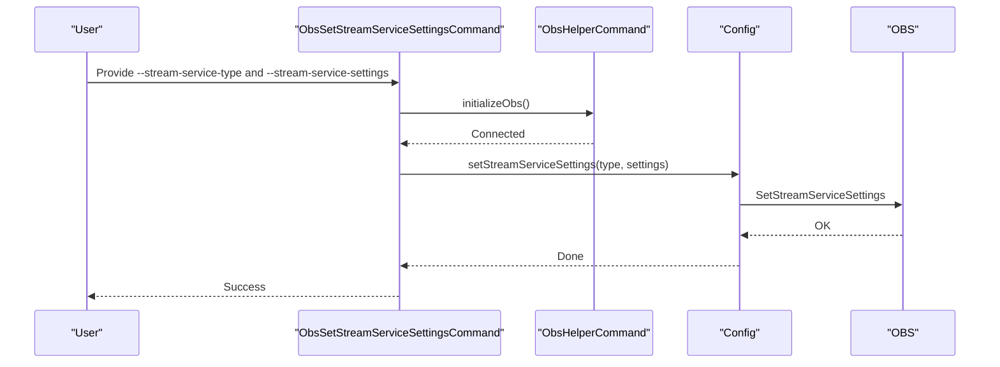
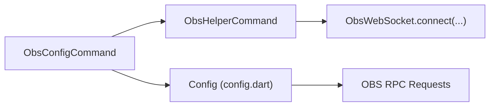

# Configuration Commands

<cite>
**Referenced Files in This Document**
- [obs.dart](file://bin/obs.dart)
- [README.md](file://bin/README.md)
- [obs_config_command.dart](file://lib/src/cmd/obs_config_command.dart)
- [obs_helper_command.dart](file://lib/src/cmd/obs_helper_command.dart)
- [config.dart](file://lib/src/request/config.dart)
- [config.sample.yaml](file://example/config.sample.yaml)
</cite>

## Table of Contents
1. [Introduction](#introduction)
2. [Project Structure](#project-structure)
3. [Core Components](#core-components)
4. [Architecture Overview](#architecture-overview)
5. [Detailed Component Analysis](#detailed-component-analysis)
6. [Dependency Analysis](#dependency-analysis)
7. [Performance Considerations](#performance-considerations)
8. [Troubleshooting Guide](#troubleshooting-guide)
9. [Conclusion](#conclusion)

## Introduction
This document explains the configuration management CLI commands for OBS profile and scene collection operations. It covers how to switch profiles, manage scene collections, configure video settings, control stream service settings, and validate configurations. The guide includes parameter requirements, configuration file formats, naming conventions, practical workflows, troubleshooting tips, and best practices for profile management.

## Project Structure
The CLI entry point registers the configuration command group and its subcommands. The configuration module exposes commands for retrieving and updating OBS configuration, including video settings, stream service settings, and recording directory. Helper utilities manage connection initialization and credential resolution.

**Diagram sources**
- [obs.dart:6-51](file://bin/obs.dart#L6-L51)
- [obs_config_command.dart:10-28](file://lib/src/cmd/obs_config_command.dart#L10-L28)
- [obs_helper_command.dart:13-42](file://lib/src/cmd/obs_helper_command.dart#L13-L42)
- [config.dart:4-267](file://lib/src/request/config.dart#L4-L267)

**Section sources**
- [obs.dart:6-51](file://bin/obs.dart#L6-L51)
- [README.md:184-276](file://bin/README.md#L184-L276)

## Core Components
- ObsConfigCommand: Root command grouping configuration-related subcommands.
- ObsGet/SetVideoSettingsCommand: Retrieve and update OBS video settings (FPS, base/output resolutions).
- ObsGet/SetStreamServiceSettingsCommand: Retrieve and update stream destination/service settings.
- ObsGetRecordDirectoryCommand: Retrieve the configured recording directory.
- ObsHelperCommand: Shared logic for initializing OBS connections via CLI flags or credentials file.
- Config (config.dart): Implements RPC wrappers for profile, scene collection, and configuration operations.

Key capabilities:
- Profile management: list, switch, create, remove, and modify profile parameters.
- Scene collection management: list, switch, and create scene collections.
- Video settings: get/set FPS numerator/denominator and base/output resolutions.
- Stream service settings: get/set stream type and settings (e.g., RTMP).
- Recording directory: get current recording folder.

**Section sources**
- [obs_config_command.dart:10-28](file://lib/src/cmd/obs_config_command.dart#L10-L28)
- [obs_config_command.dart:31-48](file://lib/src/cmd/obs_config_command.dart#L31-L48)
- [obs_config_command.dart:51-124](file://lib/src/cmd/obs_config_command.dart#L51-L124)
- [obs_config_command.dart:127-146](file://lib/src/cmd/obs_config_command.dart#L127-L146)
- [obs_config_command.dart:149-187](file://lib/src/cmd/obs_config_command.dart#L149-L187)
- [obs_config_command.dart:190-208](file://lib/src/cmd/obs_config_command.dart#L190-L208)
- [config.dart:48-129](file://lib/src/request/config.dart#L48-L129)
- [config.dart:172-266](file://lib/src/request/config.dart#L172-L266)

## Architecture Overview
The CLI orchestrates configuration operations by parsing arguments, establishing an OBS WebSocket connection, and invoking the appropriate configuration request handlers. Responses are printed as JSON for downstream processing.

**Diagram sources**
- [obs.dart:6-51](file://bin/obs.dart#L6-L51)
- [obs_helper_command.dart:13-42](file://lib/src/cmd/obs_helper_command.dart#L13-L42)
- [config.dart:172-266](file://lib/src/request/config.dart#L172-L266)

## Detailed Component Analysis

### ObsConfigCommand and Subcommands
ObsConfigCommand aggregates configuration operations. Its subcommands expose:
- get-video-settings
- set-video-settings
- get-stream-service-settings
- set-stream-service-settings
- get-record-directory

Each subcommand inherits connection initialization from ObsHelperCommand and performs RPC calls via the Config wrapper.

**Diagram sources**
- [obs_config_command.dart:10-28](file://lib/src/cmd/obs_config_command.dart#L10-L28)
- [obs_config_command.dart:31-48](file://lib/src/cmd/obs_config_command.dart#L31-L48)
- [obs_config_command.dart:51-124](file://lib/src/cmd/obs_config_command.dart#L51-L124)
- [obs_config_command.dart:127-146](file://lib/src/cmd/obs_config_command.dart#L127-L146)
- [obs_config_command.dart:149-187](file://lib/src/cmd/obs_config_command.dart#L149-L187)
- [obs_config_command.dart:190-208](file://lib/src/cmd/obs_config_command.dart#L190-L208)
- [obs_helper_command.dart:8-42](file://lib/src/cmd/obs_helper_command.dart#L8-L42)
- [config.dart:4-267](file://lib/src/request/config.dart#L4-L267)

**Section sources**
- [obs_config_command.dart:10-28](file://lib/src/cmd/obs_config_command.dart#L10-L28)
- [obs_config_command.dart:31-48](file://lib/src/cmd/obs_config_command.dart#L31-L48)
- [obs_config_command.dart:51-124](file://lib/src/cmd/obs_config_command.dart#L51-L124)
- [obs_config_command.dart:127-146](file://lib/src/cmd/obs_config_command.dart#L127-L146)
- [obs_config_command.dart:149-187](file://lib/src/cmd/obs_config_command.dart#L149-L187)
- [obs_config_command.dart:190-208](file://lib/src/cmd/obs_config_command.dart#L190-L208)

### Video Settings Management
- Purpose: Retrieve and update OBS video settings including FPS numerator/denominator and base/output resolutions.
- Parameters:
  - fps-numerator: integer greater than 0
  - fps-denominator: integer greater than 0
  - base-width: integer between 1 and 4096
  - base-height: integer between 1 and 4096
  - output-width: integer between 1 and 4096
  - output-height: integer between 1 and 4096
- Notes:
  - True FPS equals numerator divided by denominator.
  - Validation enforces numeric ranges and positive values.

**Diagram sources**
- [obs_config_command.dart:58-96](file://lib/src/cmd/obs_config_command.dart#L58-L96)
- [obs_config_command.dart:108-124](file://lib/src/cmd/obs_config_command.dart#L108-L124)

**Section sources**
- [obs_config_command.dart:58-96](file://lib/src/cmd/obs_config_command.dart#L58-L96)
- [obs_config_command.dart:108-124](file://lib/src/cmd/obs_config_command.dart#L108-L124)
- [config.dart:196-204](file://lib/src/request/config.dart#L196-L204)

### Stream Service Settings Management
- Purpose: Retrieve and update OBS stream service settings (e.g., RTMP destination).
- Parameters:
  - stream-service-type: mandatory string (e.g., rtmp_common, rtmp_custom)
  - stream-service-settings: mandatory JSON object containing provider-specific fields (e.g., server, key)
- Notes:
  - Simple RTMP destinations can be configured with rtmp_custom and server/key fields.
  - Settings are applied as a structured JSON object.

**Diagram sources**
- [obs_config_command.dart:157-187](file://lib/src/cmd/obs_config_command.dart#L157-L187)
- [obs_helper_command.dart:13-42](file://lib/src/cmd/obs_helper_command.dart#L13-L42)
- [config.dart:227-245](file://lib/src/request/config.dart#L227-L245)

**Section sources**
- [obs_config_command.dart:157-187](file://lib/src/cmd/obs_config_command.dart#L157-L187)
- [config.dart:227-245](file://lib/src/request/config.dart#L227-L245)

### Recording Directory Management
- Purpose: Retrieve the current recording directory configured in OBS.
- Output: Prints the recordDirectory field from the response.

**Section sources**
- [obs_config_command.dart:190-208](file://lib/src/cmd/obs_config_command.dart#L190-L208)
- [config.dart:247-266](file://lib/src/request/config.dart#L247-L266)

### Profile and Scene Collection Operations
- Profile operations:
  - List profiles
  - Switch to a profile
  - Create a new profile
  - Remove a profile
  - Get/set profile parameters
- Scene collection operations:
  - List scene collections
  - Switch to a scene collection
  - Create a new scene collection

These operations are exposed via the Config wrapper and enable environment-specific configuration and scene isolation.

**Section sources**
- [config.dart:48-129](file://lib/src/request/config.dart#L48-L129)

### Configuration File Formats and Naming Conventions
- Credentials file:
  - Location: ~/.obs/credentials.json
  - Fields: uri, password
  - Used when --uri is not provided via CLI.
- YAML sample for streaming:
  - Fields: host, password, stream.type, stream.settings.server, stream.settings.key
  - Useful for external orchestration scripts.

**Section sources**
- [obs_helper_command.dart:17-23](file://lib/src/cmd/obs_helper_command.dart#L17-L23)
- [config.sample.yaml:1-8](file://example/config.sample.yaml#L1-L8)

### Practical Configuration Workflows
- Switch to a specific profile:
  - Use the profile management operations to select the target profile.
- Create and switch to a new scene collection:
  - Create the collection, then switch to it.
- Configure video settings:
  - Set FPS numerator/denominator and base/output resolutions using validated parameters.
- Set stream service settings:
  - Choose stream-service-type (e.g., rtmp_custom) and provide JSON settings (e.g., server and key).
- Retrieve recording directory:
  - Use the get-record-directory command to confirm the configured output location.

**Section sources**
- [config.dart:48-129](file://lib/src/request/config.dart#L48-L129)
- [config.dart:172-266](file://lib/src/request/config.dart#L172-L266)

## Dependency Analysis
The configuration commands depend on:
- ObsHelperCommand for connection initialization and credential resolution.
- Config wrapper for RPC operations against OBS.
- CLI runner for argument parsing and command dispatch.

**Diagram sources**
- [obs_config_command.dart:10-28](file://lib/src/cmd/obs_config_command.dart#L10-L28)
- [obs_helper_command.dart:13-42](file://lib/src/cmd/obs_helper_command.dart#L13-L42)
- [config.dart:4-267](file://lib/src/request/config.dart#L4-L267)

**Section sources**
- [obs.dart:6-51](file://bin/obs.dart#L6-L51)
- [obs_config_command.dart:10-28](file://lib/src/cmd/obs_config_command.dart#L10-L28)
- [obs_helper_command.dart:13-42](file://lib/src/cmd/obs_helper_command.dart#L13-L42)
- [config.dart:4-267](file://lib/src/request/config.dart#L4-L267)

## Performance Considerations
- Minimize repeated connection attempts; reuse the initialized ObsWebSocket instance per command invocation.
- Validate inputs early to avoid unnecessary RPC calls.
- Use JSON parsing for settings carefully; ensure proper formatting to prevent errors.

## Troubleshooting Guide
Common issues and resolutions:
- Missing connection information:
  - Symptom: Usage error indicating missing OBS connection details.
  - Resolution: Provide --uri and optional --passwd, or place credentials.json in ~/.obs/.
- Invalid numeric ranges:
  - Symptom: Argument error for FPS or resolution parameters.
  - Resolution: Ensure fps-numerator and fps-denominator > 0, and base/output resolutions between 1 and 4096.
- Malformed JSON settings:
  - Symptom: Failure when applying stream service settings.
  - Resolution: Verify --stream-service-settings is valid JSON and matches the chosen stream-service-type.
- Authentication failure:
  - Symptom: Connection fails when password is required.
  - Resolution: Confirm OBS websocket password matches the CLI --passwd or credentials.json.

**Section sources**
- [obs_helper_command.dart:16-23](file://lib/src/cmd/obs_helper_command.dart#L16-L23)
- [obs_config_command.dart:98-105](file://lib/src/cmd/obs_config_command.dart#L98-L105)
- [obs_config_command.dart:180-183](file://lib/src/cmd/obs_config_command.dart#L180-L183)

## Conclusion
The configuration commands provide a robust interface for managing OBS profiles, scene collections, video settings, stream service settings, and recording directories. By following the parameter requirements, using the correct configuration file formats, and adhering to best practices for profile management, you can reliably automate and validate OBS configuration through the CLI.