# General Commands

<cite>
**Referenced Files in This Document**
- [obs.dart](file://bin/obs.dart)
- [obs_general_command.dart](file://lib/src/cmd/obs_general_command.dart)
- [obs_helper_command.dart](file://lib/src/cmd/obs_helper_command.dart)
- [general.dart](file://lib/src/request/general.dart)
- [stats_response.dart](file://lib/src/model/response/stats_response.dart)
- [version_response.dart](file://lib/src/model/response/version_response.dart)
- [call_vendor_request_response.dart](file://lib/src/model/response/call_vendor_request_response.dart)
- [string_list_response.dart](file://lib/src/model/response/string_list_response.dart)
- [key_modifiers.dart](file://lib/src/model/request/key_modifiers.dart)
- [validate.dart](file://lib/src/util/validate.dart)
- [README.md](file://README.md)
- [obs_websocket_general_test.dart](file://test/obs_websocket_general_test.dart)
</cite>

## Table of Contents
1. [Introduction](#introduction)
2. [Project Structure](#project-structure)
3. [Core Components](#core-components)
4. [Architecture Overview](#architecture-overview)
5. [Detailed Component Analysis](#detailed-component-analysis)
6. [Dependency Analysis](#dependency-analysis)
7. [Performance Considerations](#performance-considerations)
8. [Troubleshooting Guide](#troubleshooting-guide)
9. [Conclusion](#conclusion)

## Introduction
This document describes the general CLI commands that provide basic OBS Studio operations and system information. It covers:
- Version retrieval
- Statistics gathering
- Custom event broadcasting
- Vendor request calling
- Browser event handling
- Hotkey management
- Sleep functionality

Each command includes purpose, required and optional parameters, JSON data formatting requirements, parameter validation, error handling, and integration with OBS Studio’s hotkey system.

## Project Structure
The CLI entry point registers the general command group, which exposes subcommands for each general operation. The general command group delegates to helper commands that establish a connection to OBS, execute requests, and print results.

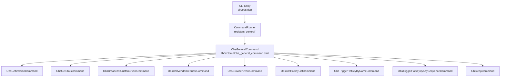

**Diagram sources**
- [obs.dart:6-51](file://bin/obs.dart#L6-L51)
- [obs_general_command.dart:8-26](file://lib/src/cmd/obs_general_command.dart#L8-L26)

**Section sources**
- [obs.dart:6-51](file://bin/obs.dart#L6-L51)
- [obs_general_command.dart:8-26](file://lib/src/cmd/obs_general_command.dart#L8-L26)

## Core Components
- ObsGeneralCommand: Root command that adds all general subcommands.
- ObsHelperCommand: Base class handling connection initialization and logging.
- General (request facade): Encapsulates general requests and response parsing.

Key behaviors:
- Connection is established per command execution using either a credentials file or explicit URI/password.
- Requests are sent via the underlying WebSocket transport and responses are parsed into typed models.

**Section sources**
- [obs_general_command.dart:8-26](file://lib/src/cmd/obs_general_command.dart#L8-L26)
- [obs_helper_command.dart:13-42](file://lib/src/cmd/obs_helper_command.dart#L13-L42)
- [general.dart:4-142](file://lib/src/request/general.dart#L4-L142)

## Architecture Overview
The general commands follow a consistent flow: initialize connection → execute request → parse response → print result → close connection.

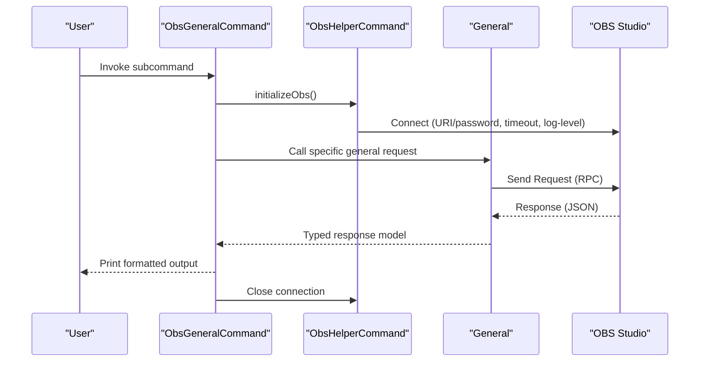

**Diagram sources**
- [obs_general_command.dart:38-46](file://lib/src/cmd/obs_general_command.dart#L38-L46)
- [obs_helper_command.dart:13-42](file://lib/src/cmd/obs_helper_command.dart#L13-L42)
- [general.dart:21-25](file://lib/src/request/general.dart#L21-L25)

## Detailed Component Analysis

### Version Retrieval
Purpose: Retrieve OBS and obs-websocket version information along with supported capabilities.

- Command: general get-version
- Required parameters: None
- Optional parameters: Global options (URI/password/timeout/log-level)
- JSON data formatting: No request data required
- Parameter validation: Uses global connection options validated by the CLI runner
- Error handling: Connection failures or invalid credentials cause exceptions; helper throws on missing credentials when URI is not provided
- Practical usage:
  - Using stored credentials: obs general get-version
  - Using explicit URI and password: obs -u ws://localhost:4455 -p password general get-version

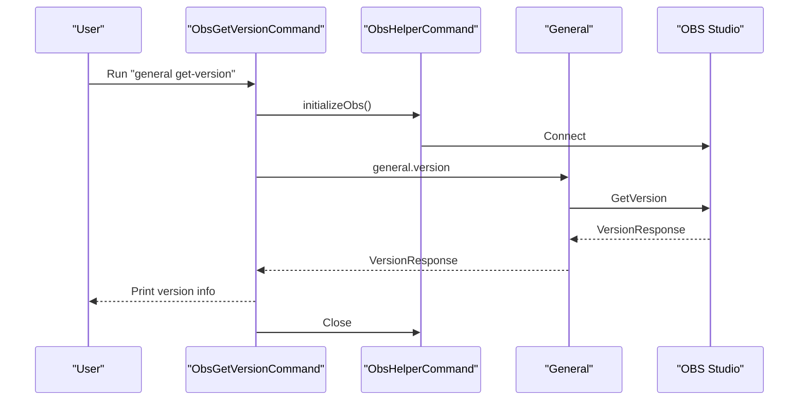

**Diagram sources**
- [obs_general_command.dart:29-46](file://lib/src/cmd/obs_general_command.dart#L29-L46)
- [general.dart:21-25](file://lib/src/request/general.dart#L21-L25)

**Section sources**
- [obs_general_command.dart:29-46](file://lib/src/cmd/obs_general_command.dart#L29-L46)
- [general.dart:14-25](file://lib/src/request/general.dart#L14-L25)
- [version_response.dart:8-34](file://lib/src/model/response/version_response.dart#L8-L34)

### Statistics Gathering
Purpose: Obtain runtime statistics about OBS, obs-websocket, and the current session.

- Command: general get-stats
- Required parameters: None
- Optional parameters: Global options
- JSON data formatting: No request data required
- Parameter validation: Inherits global connection options
- Error handling: Connection errors propagate; helper manages logging
- Practical usage: obs general get-stats

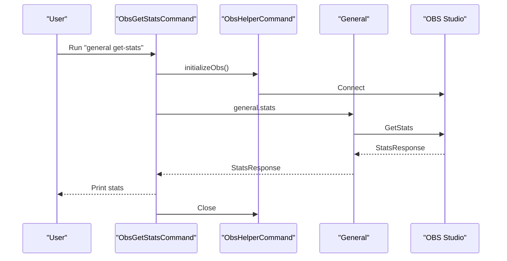

**Diagram sources**
- [obs_general_command.dart:50-67](file://lib/src/cmd/obs_general_command.dart#L50-L67)
- [general.dart:39-43](file://lib/src/request/general.dart#L39-L43)

**Section sources**
- [obs_general_command.dart:50-67](file://lib/src/cmd/obs_general_command.dart#L50-L67)
- [general.dart:32-43](file://lib/src/request/general.dart#L32-L43)
- [stats_response.dart:8-42](file://lib/src/model/response/stats_response.dart#L8-L42)

### Custom Event Broadcasting
Purpose: Broadcast a CustomEvent to all identified and subscribed WebSocket clients.

- Command: general broadcast-custom-event
- Required parameters:
  - --event-data: JSON payload to emit
- Optional parameters: Global options
- JSON data formatting requirements:
  - Must be a valid JSON object (enclose in braces)
  - Nested objects and arrays are supported
- Parameter validation:
  - --event-data is mandatory
  - No built-in JSON schema validation; malformed JSON will cause downstream errors
- Error handling:
  - Connection errors handled by helper
  - Malformed JSON will surface as request errors from OBS
- Practical usage:
  - obs general broadcast-custom-event --event-data='{"key":"value"}'

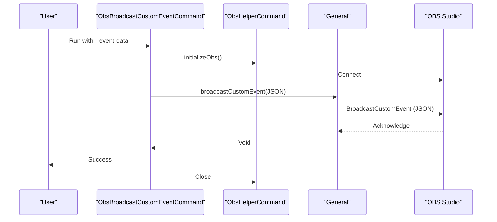

**Diagram sources**
- [obs_general_command.dart:71-96](file://lib/src/cmd/obs_general_command.dart#L71-L96)
- [general.dart:50-53](file://lib/src/request/general.dart#L50-L53)

**Section sources**
- [obs_general_command.dart:71-96](file://lib/src/cmd/obs_general_command.dart#L71-L96)
- [general.dart:45-53](file://lib/src/request/general.dart#L45-L53)

### Vendor Request Calling
Purpose: Call a request registered to a vendor (third-party plugin or script).

- Command: general call-vendor-request
- Required parameters:
  - --vendor-name: Name of the vendor
  - --request-type: The request type to call
- Optional parameters:
  - --request-data: JSON-encoded object with appropriate request data
- JSON data formatting requirements:
  - If provided, must be a valid JSON object
  - Schema depends on the vendor’s documented request
- Parameter validation:
  - --vendor-name and --request-type are mandatory
  - --request-data is optional; if present, must be valid JSON
- Error handling:
  - Connection errors handled by helper
  - Vendor-specific errors returned via CallVendorRequestResponse
- Practical usage:
  - obs general call-vendor-request --vendor-name my-vendor --request-type doThing --request-data='{"param":1}'

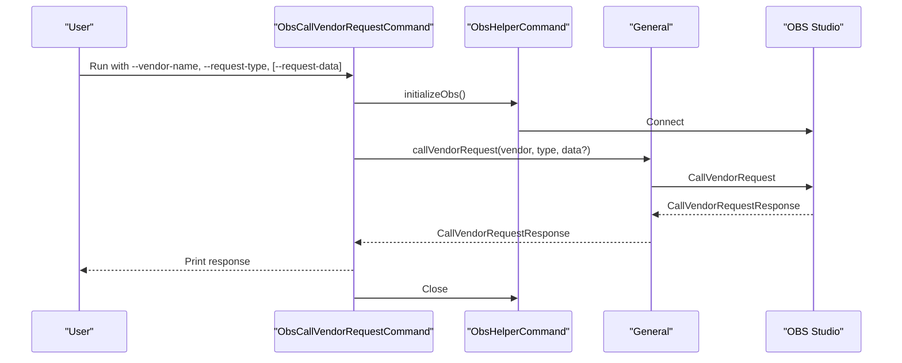

**Diagram sources**
- [obs_general_command.dart:101-142](file://lib/src/cmd/obs_general_command.dart#L101-L142)
- [general.dart:62-79](file://lib/src/request/general.dart#L62-L79)

**Section sources**
- [obs_general_command.dart:101-142](file://lib/src/cmd/obs_general_command.dart#L101-L142)
- [general.dart:55-79](file://lib/src/request/general.dart#L55-L79)
- [call_vendor_request_response.dart:12-31](file://lib/src/model/response/call_vendor_request_response.dart#L12-L31)

### Browser Event Handling
Purpose: Send a vendor request specifically to the obs-browser plugin.

- Command: general obs-browser-event
- Required parameters:
  - --event-name: Name of the event to emit
- Optional parameters:
  - --event-data: JSON-encoded object with event data
- JSON data formatting requirements:
  - If provided, must be a valid JSON object
- Parameter validation:
  - --event-name is mandatory
  - --event-data is optional; if present, must be valid JSON
- Error handling:
  - Connection errors handled by helper
  - Plugin-specific errors surfaced via CallVendorRequestResponse
- Practical usage:
  - obs general obs-browser-event --event-name test-event --event-data='{"message":"hi"}'

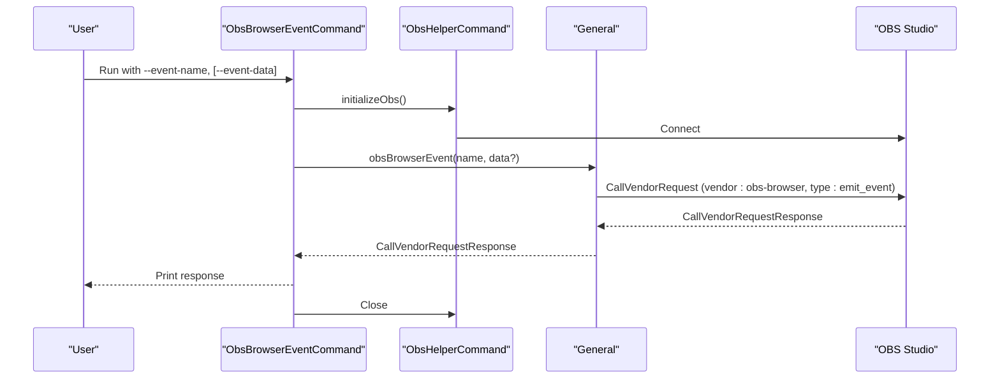

**Diagram sources**
- [obs_general_command.dart:146-182](file://lib/src/cmd/obs_general_command.dart#L146-L182)
- [general.dart:82-89](file://lib/src/request/general.dart#L82-L89)

**Section sources**
- [obs_general_command.dart:146-182](file://lib/src/cmd/obs_general_command.dart#L146-L182)
- [general.dart:81-89](file://lib/src/request/general.dart#L81-L89)

### Hotkey Management
Purpose: Manage OBS hotkeys via name or key sequence.

Available subcommands:
- general get-hotkey-list
- general trigger-hotkey-by-name
- general trigger-hotkey-by-key-sequence

#### Get Hotkey List
- Purpose: Retrieve all hotkey names in OBS
- Command: general get-hotkey-list
- Required parameters: None
- Optional parameters: Global options
- JSON data formatting: No request data required
- Parameter validation: Inherits global connection options
- Error handling: Connection errors handled by helper
- Practical usage: obs general get-hotkey-list

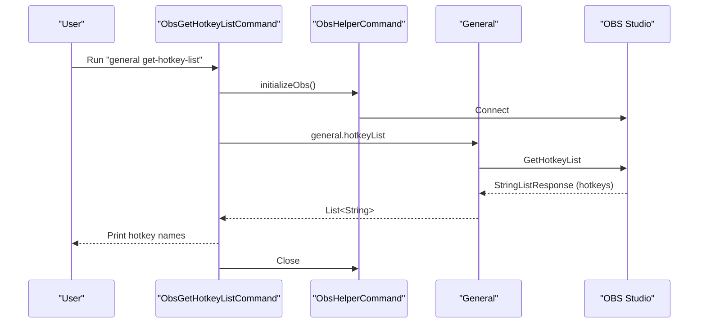

**Diagram sources**
- [obs_general_command.dart:185-202](file://lib/src/cmd/obs_general_command.dart#L185-L202)
- [general.dart:103-107](file://lib/src/request/general.dart#L103-L107)

**Section sources**
- [obs_general_command.dart:185-202](file://lib/src/cmd/obs_general_command.dart#L185-L202)
- [general.dart:96-107](file://lib/src/request/general.dart#L96-L107)
- [string_list_response.dart:8-35](file://lib/src/model/response/string_list_response.dart#L8-L35)

#### Trigger Hotkey by Name
- Purpose: Trigger a hotkey using its exact name
- Command: general trigger-hotkey-by-name
- Required parameters:
  - --hotkey-name: Name of the hotkey to trigger
- Optional parameters: Global options
- JSON data formatting: No request data required beyond the hotkey name
- Parameter validation:
  - --hotkey-name is mandatory
- Error handling:
  - Connection errors handled by helper
  - Unknown hotkey names will fail at the OBS level
- Practical usage: obs general trigger-hotkey-by-name --hotkey-name "OBSBasic.Screenshot"

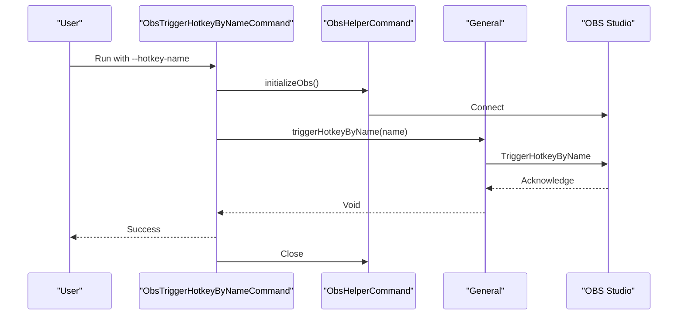

**Diagram sources**
- [obs_general_command.dart:205-230](file://lib/src/cmd/obs_general_command.dart#L205-L230)
- [general.dart:109-113](file://lib/src/request/general.dart#L109-L113)

**Section sources**
- [obs_general_command.dart:205-230](file://lib/src/cmd/obs_general_command.dart#L205-L230)
- [general.dart:109-113](file://lib/src/request/general.dart#L109-L113)

#### Trigger Hotkey by Key Sequence
- Purpose: Trigger a hotkey using a key ID and optional key modifiers
- Command: general trigger-hotkey-by-key-sequence
- Required parameters:
  - --key-id: OBS key ID (see referenced header)
- Optional parameters:
  - --key-modifiers: JSON object with modifier flags
- JSON data formatting requirements:
  - --key-modifiers must be a JSON object with boolean fields:
    - shift, control, alt, command
- Parameter validation:
  - --key-id is mandatory
  - --key-modifiers must be valid JSON if provided
- Error handling:
  - Connection errors handled by helper
  - Invalid key ID or modifiers will fail at the OBS level
- Practical usage:
  - obs general trigger-hotkey-by-key-sequence --key-id "KEY_F16" --key-modifiers='{"shift":true,"control":false}'
  - Notes: Key IDs and modifier semantics align with OBS hotkey definitions

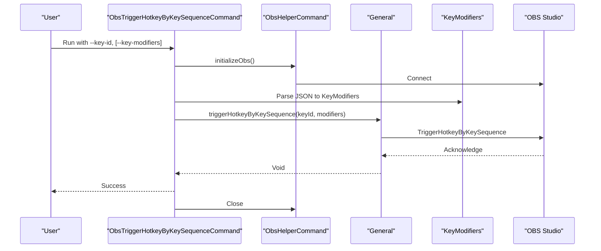

**Diagram sources**
- [obs_general_command.dart:233-270](file://lib/src/cmd/obs_general_command.dart#L233-L270)
- [general.dart:120-128](file://lib/src/request/general.dart#L120-L128)
- [key_modifiers.dart:8-30](file://lib/src/model/request/key_modifiers.dart#L8-L30)

**Section sources**
- [obs_general_command.dart:233-270](file://lib/src/cmd/obs_general_command.dart#L233-L270)
- [general.dart:115-128](file://lib/src/request/general.dart#L115-L128)
- [key_modifiers.dart:8-30](file://lib/src/model/request/key_modifiers.dart#L8-L30)

### Sleep Functionality
Purpose: Sleep for a time duration or number of frames. Only available in request batches with specific modes.

- Command: general sleep
- Required parameters: None
- Optional parameters:
  - --sleep-millis: Number of milliseconds to sleep (REALTIME mode)
  - --sleep-frames: Number of frames to sleep (FRAME mode)
- JSON data formatting: No request data required; numeric values are passed as integers
- Parameter validation:
  - Values must be integers within documented ranges
  - Mutually exclusive with one another (only one should be provided depending on batch mode)
- Error handling:
  - Connection errors handled by helper
  - Invalid values will fail at the OBS level
- Practical usage:
  - obs general sleep --sleep-millis 1000
  - obs general sleep --sleep-frames 30

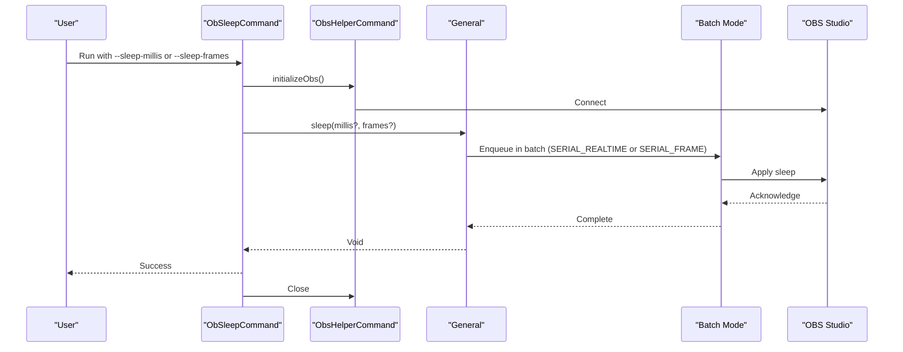

**Diagram sources**
- [obs_general_command.dart:273-305](file://lib/src/cmd/obs_general_command.dart#L273-L305)
- [general.dart:135-141](file://lib/src/request/general.dart#L135-L141)

**Section sources**
- [obs_general_command.dart:273-305](file://lib/src/cmd/obs_general_command.dart#L273-L305)
- [general.dart:130-141](file://lib/src/request/general.dart#L130-L141)

## Dependency Analysis
The general command group composes multiple subcommands, each delegating to the General request facade. The helper command centralizes connection setup and logging.

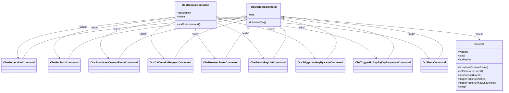

**Diagram sources**
- [obs_general_command.dart:8-305](file://lib/src/cmd/obs_general_command.dart#L8-L305)
- [obs_helper_command.dart:8-42](file://lib/src/cmd/obs_helper_command.dart#L8-L42)
- [general.dart:4-142](file://lib/src/request/general.dart#L4-L142)

**Section sources**
- [obs_general_command.dart:8-305](file://lib/src/cmd/obs_general_command.dart#L8-L305)
- [obs_helper_command.dart:8-42](file://lib/src/cmd/obs_helper_command.dart#L8-L42)
- [general.dart:4-142](file://lib/src/request/general.dart#L4-L142)

## Performance Considerations
- Connection reuse: Each subcommand initializes a new connection; consider batching operations within a single invocation to minimize reconnect overhead.
- Logging: Enable appropriate log levels (--log-level) to diagnose issues without overwhelming output.
- Batch mode: Sleep is intended for batch execution modes; avoid using it in ad-hoc CLI invocations outside of batch contexts.

## Troubleshooting Guide
Common issues and resolutions:
- Missing connection information:
  - Symptom: UsageException indicating missing credentials when URI is not provided.
  - Resolution: Provide --uri and optionally --passwd, or create ~/.obs/credentials.json with connection details.
- Invalid JSON payloads:
  - Symptom: Request errors when --event-data or --request-data/--key-modifiers are malformed.
  - Resolution: Ensure JSON is valid and properly escaped; verify nested structures.
- Unknown hotkey names or key IDs:
  - Symptom: Failures when triggering hotkeys by name or sequence.
  - Resolution: Use general get-hotkey-list to discover valid names; confirm key IDs match OBS definitions.
- Timeout/connection failures:
  - Symptom: Connection attempts fail or timeout.
  - Resolution: Adjust --timeout, verify OBS WebSocket settings, and confirm network reachability.

Validation utilities:
- Numeric range validation for sleep parameters is enforced by the CLI argument parser.
- JSON parsing for key modifiers is performed by the request layer.

**Section sources**
- [obs_helper_command.dart:13-42](file://lib/src/cmd/obs_helper_command.dart#L13-L42)
- [validate.dart:3-18](file://lib/src/util/validate.dart#L3-L18)
- [obs_general_command.dart:280-292](file://lib/src/cmd/obs_general_command.dart#L280-L292)

## Conclusion
The general CLI commands provide a concise interface to OBS Studio’s core capabilities: retrieving version and statistics, broadcasting custom events, invoking vendor requests, interacting with the obs-browser plugin, managing hotkeys, and applying sleep delays in batch contexts. By leveraging the helper command base and the General request facade, each subcommand follows a consistent pattern for connection, request execution, response parsing, and cleanup.