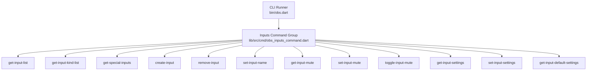
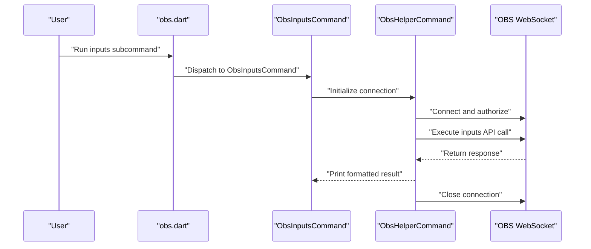
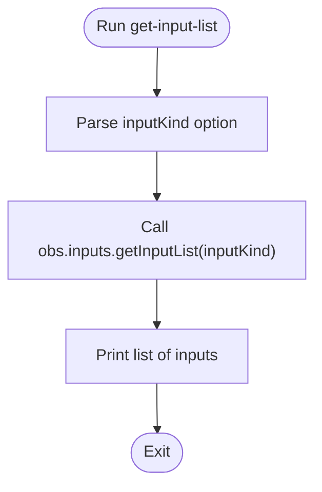
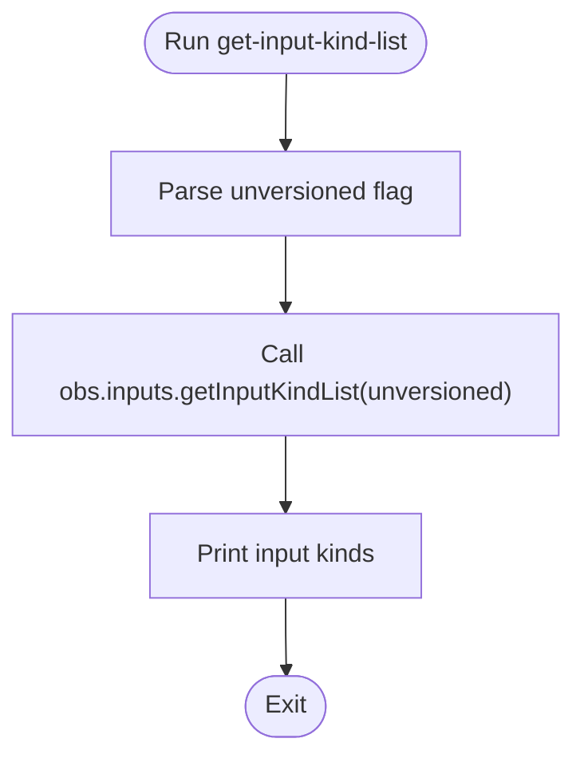
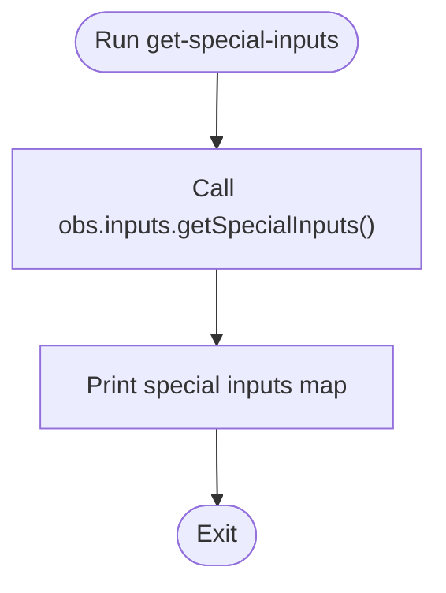
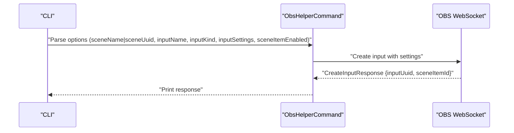
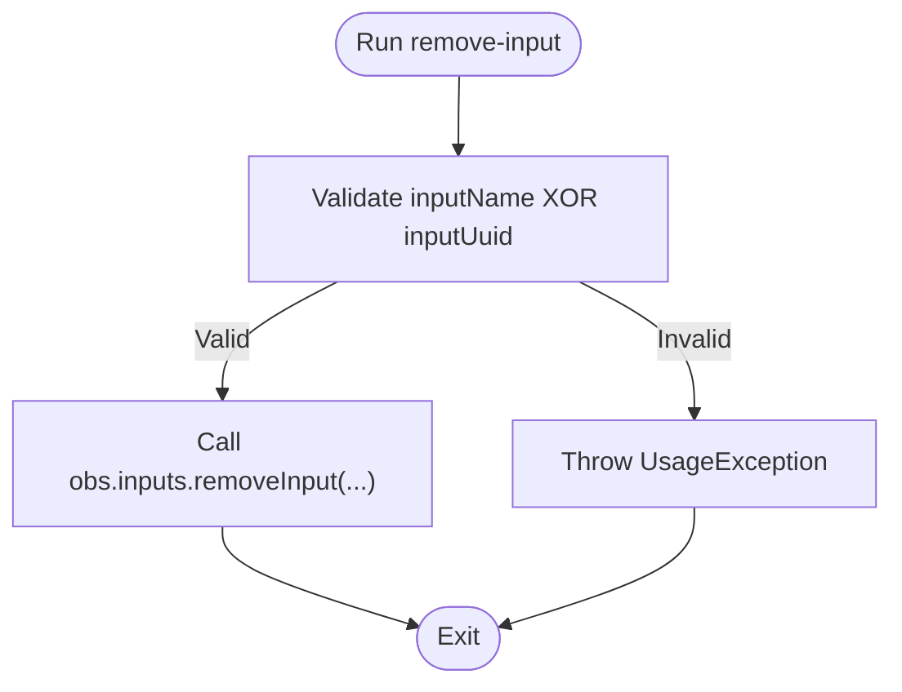
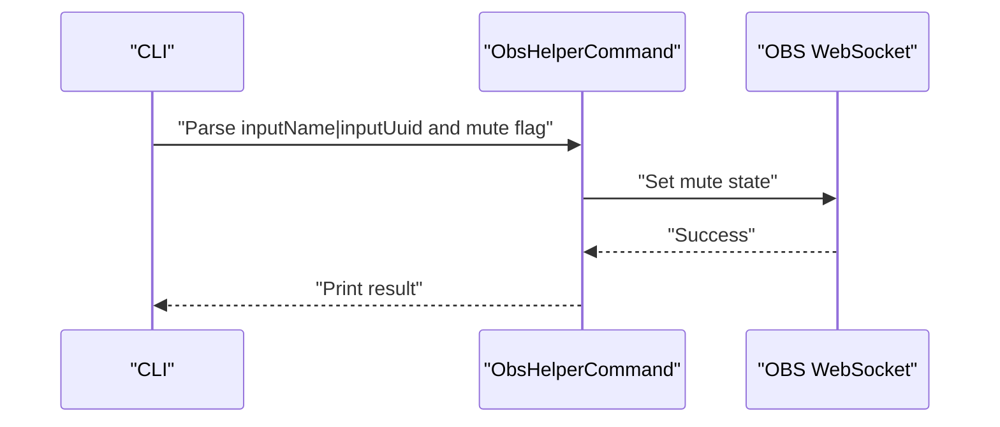
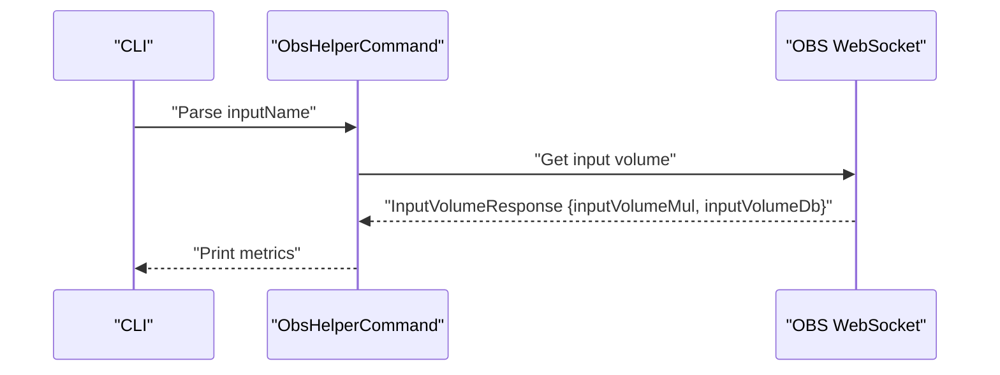
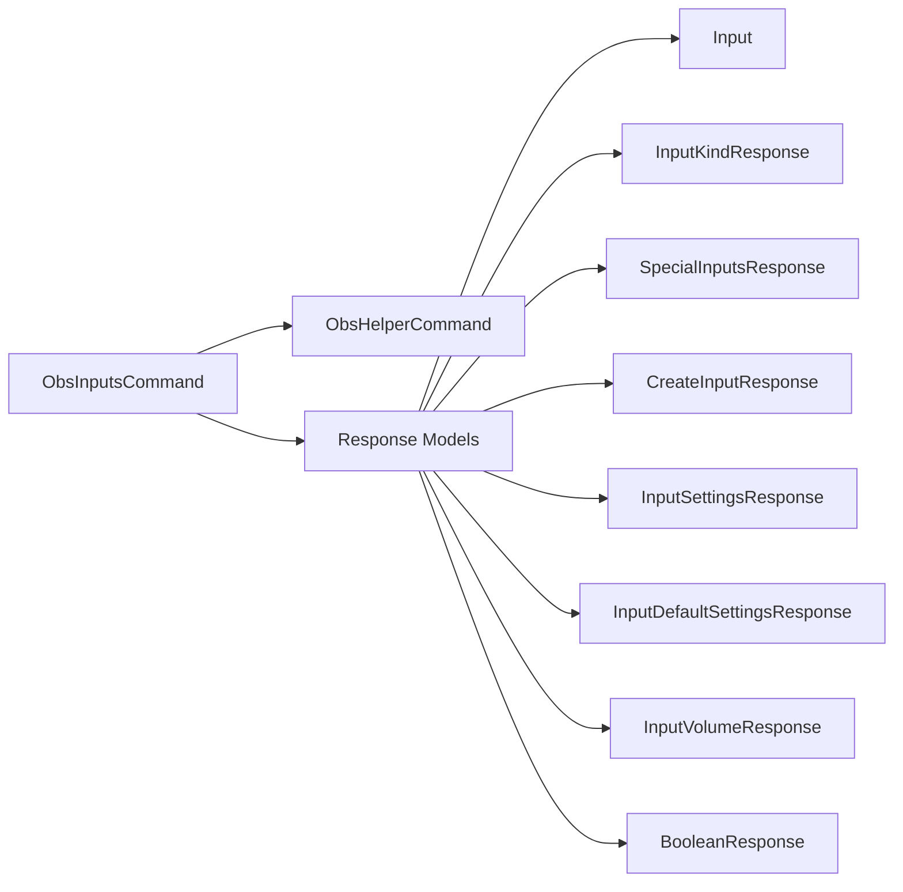

# Input Commands

<cite>
**Referenced Files in This Document**
- [obs.dart](file://bin/obs.dart)
- [command.dart](file://lib/command.dart)
- [obs_inputs_command.dart](file://lib/src/cmd/obs_inputs_command.dart)
- [obs_websocket_inputs_test.dart](file://test/obs_websocket_inputs_test.dart)
- [volume.dart](file://example/volume.dart)
- [obs_websocket.dart](file://lib/obs_websocket.dart)
- [obs_inputs_command.dart](file://lib/src/cmd/obs_inputs_command.dart)
- [obs_helper_command.dart](file://lib/src/cmd/obs_helper_command.dart)
- [obs_sources_command.dart](file://lib/src/cmd/obs_sources_command.dart)
- [obs_media_inputs_command.dart](file://lib/src/cmd/obs_media_inputs_command.dart)
- [input.dart](file://lib/src/model/response/input.dart)
- [input_kind_response.dart](file://lib/src/model/response/input_kind_response.dart)
- [special_inputs_response.dart](file://lib/src/model/response/special_inputs_response.dart)
- [create_input_response.dart](file://lib/src/model/response/create_input_response.dart)
- [input_settings_response.dart](file://lib/src/model/response/input_settings_response.dart)
- [input_default_settings_response.dart](file://lib/src/model/response/input_default_settings_response.dart)
- [input_volume_response.dart](file://lib/src/model/response/input_volume_response.dart)
- [boolean_response.dart](file://lib/src/model/response/boolean_response.dart)
</cite>

## Table of Contents
1. [Introduction](#introduction)
2. [Project Structure](#project-structure)
3. [Core Components](#core-components)
4. [Architecture Overview](#architecture-overview)
5. [Detailed Component Analysis](#detailed-component-analysis)
6. [Dependency Analysis](#dependency-analysis)
7. [Performance Considerations](#performance-considerations)
8. [Troubleshooting Guide](#troubleshooting-guide)
9. [Conclusion](#conclusion)
10. [Appendices](#appendices)

## Introduction
This document explains the input management CLI commands that control audio and video sources in OBS via the obs-websocket-dart library. It covers input discovery, creation, removal, renaming, and property inspection/modification. It also documents volume retrieval, mute state management, input filtering, and integration with audio routing systems. Practical automation examples and validation techniques are included to help you build reliable scripts and integrations.

## Project Structure
The CLI entry point wires the command runner to a suite of subcommands, including the inputs family. The inputs command group exposes subcommands for listing inputs, retrieving input kinds, managing special inputs, creating/removing inputs, renaming inputs, querying and updating settings, and toggling mute states.

**Diagram sources**
- [obs.dart:37-50](file://bin/obs.dart#L37-L50)
- [obs_inputs_command.dart:8-28](file://lib/src/cmd/obs_inputs_command.dart#L8-L28)

**Section sources**
- [obs.dart:6-60](file://bin/obs.dart#L6-L60)
- [command.dart:6-20](file://lib/command.dart#L6-L20)

## Core Components
- CLI entrypoint initializes the command runner and registers the inputs command group along with other command families.
- The inputs command group aggregates subcommands for input lifecycle and property management.
- Response models encapsulate server responses for inputs, settings, mute state, and volume.

Key capabilities:
- Input listing and filtering by kind
- Retrieving available input kinds (optionally unversioned)
- Managing special inputs (desktop/mic sources)
- Creating inputs with optional scene placement and initial settings
- Removing inputs by name or UUID
- Renaming inputs
- Inspecting and modifying input settings
- Querying and adjusting mute state
- Retrieving volume metrics (multiplier and decibels)

**Section sources**
- [obs.dart:37-50](file://bin/obs.dart#L37-L50)
- [obs_inputs_command.dart:8-28](file://lib/src/cmd/obs_inputs_command.dart#L8-L28)
- [input.dart:7-25](file://lib/src/model/response/input.dart#L7-L25)
- [input_kind_response.dart:9-22](file://lib/src/model/response/input_kind_response.dart#L9-L22)
- [special_inputs_response.dart:7-43](file://lib/src/model/response/special_inputs_response.dart#L7-L43)
- [create_input_response.dart:7-24](file://lib/src/model/response/create_input_response.dart#L7-L24)
- [input_settings_response.dart:7-24](file://lib/src/model/response/input_settings_response.dart#L7-L24)
- [input_default_settings_response.dart:7-21](file://lib/src/model/response/input_default_settings_response.dart#L7-L21)
- [input_volume_response.dart:7-24](file://lib/src/model/response/input_volume_response.dart#L7-L24)
- [boolean_response.dart:7-46](file://lib/src/model/response/boolean_response.dart#L7-L46)

## Architecture Overview
The CLI orchestrates requests to OBS through the obs-websocket protocol. Each subcommand resolves its arguments, connects to OBS, invokes the appropriate inputs API method, prints the result, and closes the connection.

**Diagram sources**
- [obs.dart:6-60](file://bin/obs.dart#L6-L60)
- [obs_inputs_command.dart:44-54](file://lib/src/cmd/obs_inputs_command.dart#L44-L54)
- [obs_helper_command.dart](file://lib/src/cmd/obs_helper_command.dart)

## Detailed Component Analysis

### Input Listing and Filtering
- Subcommand: get-input-list
- Purpose: Retrieve all inputs or filter by input kind.
- Input identification:
  - Optional filter: inputKind
- Output: Array of input entries containing inputKind, inputName, and unversionedInputKind.
- Practical automation:
  - Filter by kind to target specific source types (e.g., capture devices, media sources).
  - Combine with other commands to adjust settings or mute state.

**Diagram sources**
- [obs_inputs_command.dart:32-54](file://lib/src/cmd/obs_inputs_command.dart#L32-L54)
- [input_kind_response.dart:9-22](file://lib/src/model/response/input_kind_response.dart#L9-L22)
- [input.dart:7-25](file://lib/src/model/response/input.dart#L7-L25)

**Section sources**
- [obs_inputs_command.dart:31-55](file://lib/src/cmd/obs_inputs_command.dart#L31-L55)
- [obs_websocket_inputs_test.dart:6-24](file://test/obs_websocket_inputs_test.dart#L6-L24)

### Available Input Kinds
- Subcommand: get-input-kind-list
- Purpose: Enumerate supported input kinds, optionally unversioned.
- Options:
  - unversioned flag to request unversioned kinds
- Output: List of input kind strings.
- Practical automation:
  - Use to discover kinds before creating inputs or validating settings.

**Diagram sources**
- [obs_inputs_command.dart:58-84](file://lib/src/cmd/obs_inputs_command.dart#L58-L84)
- [string_list_response.dart:7-35](file://lib/src/model/response/string_list_response.dart#L7-L35)

**Section sources**
- [obs_inputs_command.dart:57-85](file://lib/src/cmd/obs_inputs_command.dart#L57-L85)
- [obs_websocket_inputs_test.dart:26-43](file://test/obs_websocket_inputs_test.dart#L26-L43)

### Special Inputs
- Subcommand: get-special-inputs
- Purpose: Retrieve names of special inputs (desktop audio 1/2, microphone 1–4).
- Output: SpecialInputsResponse with optional fields for each special input.
- Practical automation:
  - Map special inputs to routing targets for monitoring or recording.

**Diagram sources**
- [obs_inputs_command.dart:87-105](file://lib/src/cmd/obs_inputs_command.dart#L87-L105)
- [special_inputs_response.dart:7-43](file://lib/src/model/response/special_inputs_response.dart#L7-L43)

**Section sources**
- [obs_inputs_command.dart:87-105](file://lib/src/cmd/obs_inputs_command.dart#L87-L105)
- [obs_websocket_inputs_test.dart:45-62](file://test/obs_websocket_inputs_test.dart#L45-L62)

### Create Input
- Subcommand: create-input
- Purpose: Create a new input and add it as a scene item.
- Input identification:
  - Scene selection: sceneName or sceneUuid (mutually required for placement)
- Required options:
  - inputName
  - inputKind
- Optional options:
  - inputSettings (JSON object)
  - sceneItemEnabled (boolean)
- Output: CreateInputResponse with inputUuid and sceneItemId.
- Practical automation:
  - Batch-create inputs for templates (e.g., multiple media sources).
  - Preconfigure settings via inputSettings to avoid follow-up updates.

**Diagram sources**
- [obs_inputs_command.dart:107-175](file://lib/src/cmd/obs_inputs_command.dart#L107-L175)
- [create_input_response.dart:7-24](file://lib/src/model/response/create_input_response.dart#L7-L24)

**Section sources**
- [obs_inputs_command.dart:107-175](file://lib/src/cmd/obs_inputs_command.dart#L107-L175)
- [obs_websocket_inputs_test.dart:64-84](file://test/obs_websocket_inputs_test.dart#L64-L84)

### Remove Input
- Subcommand: remove-input
- Purpose: Remove an existing input.
- Input identification:
  - One of inputName or inputUuid must be provided.
- Practical automation:
  - Safely remove temporary or stale inputs during cleanup routines.

**Diagram sources**
- [obs_inputs_command.dart:177-210](file://lib/src/cmd/obs_inputs_command.dart#L177-L210)

**Section sources**
- [obs_inputs_command.dart:177-210](file://lib/src/cmd/obs_inputs_command.dart#L177-L210)
- [obs_websocket_inputs_test.dart:86-99](file://test/obs_websocket_inputs_test.dart#L86-L99)

### Rename Input
- Subcommand: set-input-name
- Purpose: Rename an input.
- Input identification:
  - inputName or inputUuid (at least one)
  - newInputName
- Practical automation:
  - Standardize naming across a large number of inputs for easier scripting.

**Section sources**
- [obs_inputs_command.dart:212-245](file://lib/src/cmd/obs_inputs_command.dart#L212-L245)
- [obs_websocket_inputs_test.dart:101-114](file://test/obs_websocket_inputs_test.dart#L101-L114)

### Default Settings for an Input Kind
- Subcommand: get-input-default-settings
- Purpose: Retrieve default settings for a given input kind.
- Input identification:
  - inputKind
- Output: defaultInputSettings object.
- Practical automation:
  - Use defaults as a baseline before applying custom settings.

**Section sources**
- [obs_inputs_command.dart:247-275](file://lib/src/cmd/obs_inputs_command.dart#L247-L275)
- [obs_websocket_inputs_test.dart:116-136](file://test/obs_websocket_inputs_test.dart#L116-L136)
- [input_default_settings_response.dart:7-21](file://lib/src/model/response/input_default_settings_response.dart#L7-L21)

### Get Input Settings
- Subcommand: get-input-settings
- Purpose: Retrieve current settings for an input.
- Input identification:
  - One of inputName or inputUuid must be provided.
- Output: inputKind and inputSettings.
- Practical automation:
  - Snapshot current settings before applying changes.

**Section sources**
- [obs_inputs_command.dart:277-321](file://lib/src/cmd/obs_inputs_command.dart#L277-L321)
- [obs_websocket_inputs_test.dart:138-156](file://test/obs_websocket_inputs_test.dart#L138-L156)
- [input_settings_response.dart:7-24](file://lib/src/model/response/input_settings_response.dart#L7-L24)

### Set Input Settings
- Subcommand: set-input-settings
- Purpose: Apply new settings to an input.
- Input identification:
  - One of inputName or inputUuid
- Required options:
  - inputSettings (JSON object)
  - overlay flag semantics:
    - True: merge settings on top of existing ones
    - False: reset to defaults then apply settings
- Practical automation:
  - Batch update settings for similar inputs.
  - Use overlay to minimize disruptive changes.

**Section sources**
- [obs_inputs_command.dart:323-368](file://lib/src/cmd/obs_inputs_command.dart#L323-L368)
- [obs_websocket_inputs_test.dart:157-170](file://test/obs_websocket_inputs_test.dart#L157-L170)

### Mute Control
- Subcommands:
  - get-input-mute
  - set-input-mute
  - toggle-input-mute
- Input identification:
  - One of inputName or inputUuid for set/toggle
  - inputName for get
- Mute state management:
  - States are boolean; toggle flips current state.
- Practical automation:
  - Automate muting during transitions or when specific conditions are met.
  - Monitor mute events via OBS events for reactive behavior.

**Diagram sources**
- [obs_inputs_command.dart:370-445](file://lib/src/cmd/obs_inputs_command.dart#L370-L445)
- [boolean_response.dart:7-46](file://lib/src/model/response/boolean_response.dart#L7-L46)

**Section sources**
- [obs_inputs_command.dart:370-491](file://lib/src/cmd/obs_inputs_command.dart#L370-L491)
- [obs_websocket_inputs_test.dart:172-223](file://test/obs_websocket_inputs_test.dart#L172-L223)

### Volume Metrics
- Subcommand: get-input-volume
- Purpose: Retrieve volume metrics for an input.
- Input identification:
  - inputName (as used in tests)
- Output fields:
  - inputVolumeMul (multiplier)
  - inputVolumeDb (decibels)
- Practical automation:
  - Build volume meters or trigger actions based on thresholds.
  - Subscribe to volume events for real-time dashboards.

**Diagram sources**
- [obs_inputs_command.dart:247-275](file://lib/src/cmd/obs_inputs_command.dart#L247-L275)
- [input_volume_response.dart:7-24](file://lib/src/model/response/input_volume_response.dart#L7-L24)

**Section sources**
- [obs_inputs_command.dart:247-275](file://lib/src/cmd/obs_inputs_command.dart#L247-L275)
- [obs_websocket_inputs_test.dart:225-242](file://test/obs_websocket_inputs_test.dart#L225-L242)
- [volume.dart:14-27](file://example/volume.dart#L14-L27)

## Dependency Analysis
The inputs command group depends on shared helpers for connection initialization and response parsing. Response models are generated via JSON serialization to align with OBS WebSocket schemas.

**Diagram sources**
- [obs_inputs_command.dart:8-28](file://lib/src/cmd/obs_inputs_command.dart#L8-L28)
- [obs_helper_command.dart](file://lib/src/cmd/obs_helper_command.dart)
- [input.dart:7-25](file://lib/src/model/response/input.dart#L7-L25)
- [input_kind_response.dart:9-22](file://lib/src/model/response/input_kind_response.dart#L9-L22)
- [special_inputs_response.dart:7-43](file://lib/src/model/response/special_inputs_response.dart#L7-L43)
- [create_input_response.dart:7-24](file://lib/src/model/response/create_input_response.dart#L7-L24)
- [input_settings_response.dart:7-24](file://lib/src/model/response/input_settings_response.dart#L7-L24)
- [input_default_settings_response.dart:7-21](file://lib/src/model/response/input_default_settings_response.dart#L7-L21)
- [input_volume_response.dart:7-24](file://lib/src/model/response/input_volume_response.dart#L7-L24)
- [boolean_response.dart:7-46](file://lib/src/model/response/boolean_response.dart#L7-L46)

**Section sources**
- [obs_inputs_command.dart:8-28](file://lib/src/cmd/obs_inputs_command.dart#L8-L28)

## Performance Considerations
- Minimize round-trips by batching compatible operations (e.g., create multiple inputs with precomputed settings).
- Use filters (inputKind) to reduce payload sizes when listing inputs.
- Avoid frequent polling for mute/volume; subscribe to OBS events where available to react to changes.
- Prefer overlay mode when updating settings to avoid resetting unrelated properties.

## Troubleshooting Guide
- Input identification errors:
  - Many commands require either inputName or inputUuid. Ensure at least one is provided; otherwise, a usage error is thrown.
- Scene placement for creation:
  - When creating inputs, specify sceneName or sceneUuid to place the input as a scene item; otherwise, creation may fail or behave unexpectedly.
- Settings validation:
  - Ensure inputSettings is a valid JSON object. Incorrect JSON will cause decoding failures.
- Mute operations:
  - Verify the input exists and is addressable by the chosen identifier before attempting to mute or toggle.
- Volume queries:
  - Some inputs may not expose volume metrics; confirm the input type supports volume reporting.

**Section sources**
- [obs_inputs_command.dart:199-204](file://lib/src/cmd/obs_inputs_command.dart#L199-L204)
- [obs_inputs_command.dart:305-310](file://lib/src/cmd/obs_inputs_command.dart#L305-L310)
- [obs_inputs_command.dart:430-435](file://lib/src/cmd/obs_inputs_command.dart#L430-L435)
- [obs_inputs_command.dart:475-480](file://lib/src/cmd/obs_inputs_command.dart#L475-L480)

## Conclusion
The input command group provides a comprehensive toolkit for discovering, creating, configuring, and controlling OBS inputs. By combining input listing, filtering, and property management with mute and volume controls, you can automate complex audio/video workflows. Use the provided response models and CLI patterns to build robust scripts that integrate seamlessly with OBS and its audio routing ecosystem.

## Appendices

### Command Reference Summary
- inputs get-input-list [--inputKind <kind>]
- inputs get-input-kind-list [--unversioned]
- inputs get-special-inputs
- inputs create-input --sceneName <name>|--sceneUuid <uuid> --inputName <name> --inputKind <kind> [--inputSettings <json>] [--sceneItemEnabled <bool>]
- inputs remove-input [--inputName <name>|--inputUuid <uuid>]
- inputs set-input-name [--inputName <name>|--inputUuid <uuid>] --newInputName <name>
- inputs get-input-settings [--inputName <name>|--inputUuid <uuid>]
- inputs set-input-settings [--inputName <name>|--inputUuid <uuid>] --inputSettings <json> [--overlay <bool>]
- inputs get-input-default-settings --inputKind <kind>
- inputs get-input-mute --inputName <name>
- inputs set-input-mute [--inputName <name>|--inputUuid <uuid>] --mute <bool>
- inputs toggle-input-mute [--inputName <name>|--inputUuid <uuid>]

### Example Workflows
- Batch mute/unmute:
  - List inputs by kind, iterate identifiers, and apply set-input-mute or toggle-input-mute.
- Dynamic routing:
  - Use get-special-inputs to map desktop/mic sources, then route them to specific outputs or scenes.
- Volume monitoring:
  - Use get-input-volume or subscribe to volume events to drive UI indicators or automation triggers.