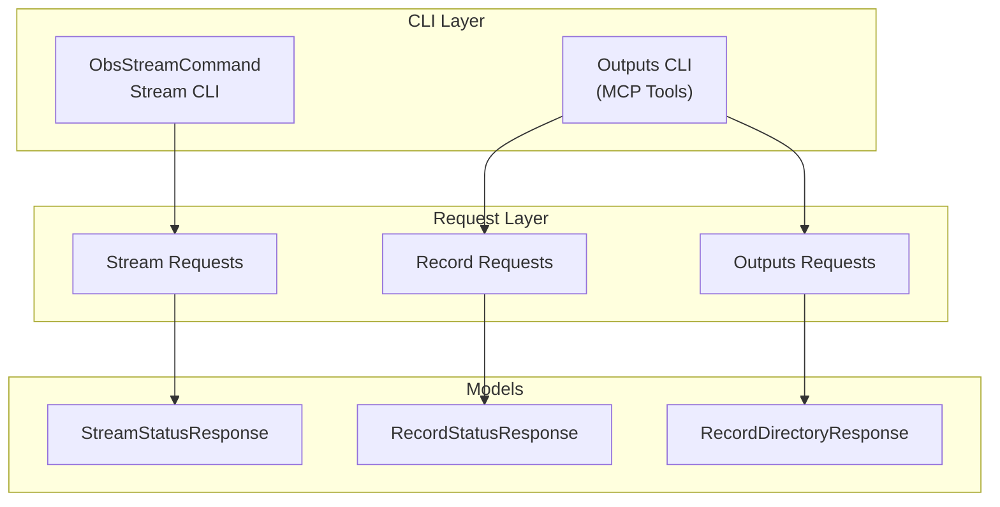
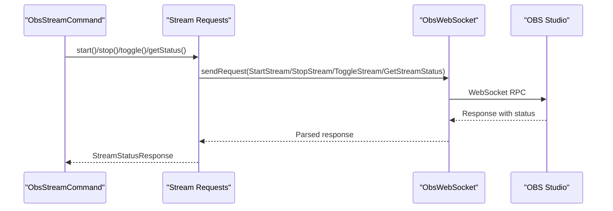
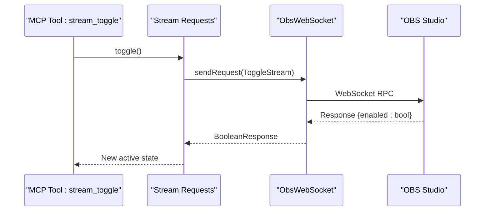
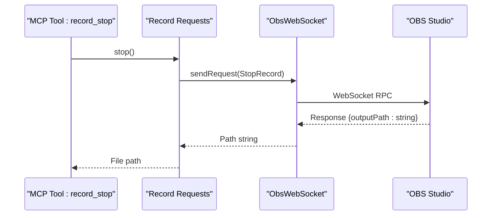
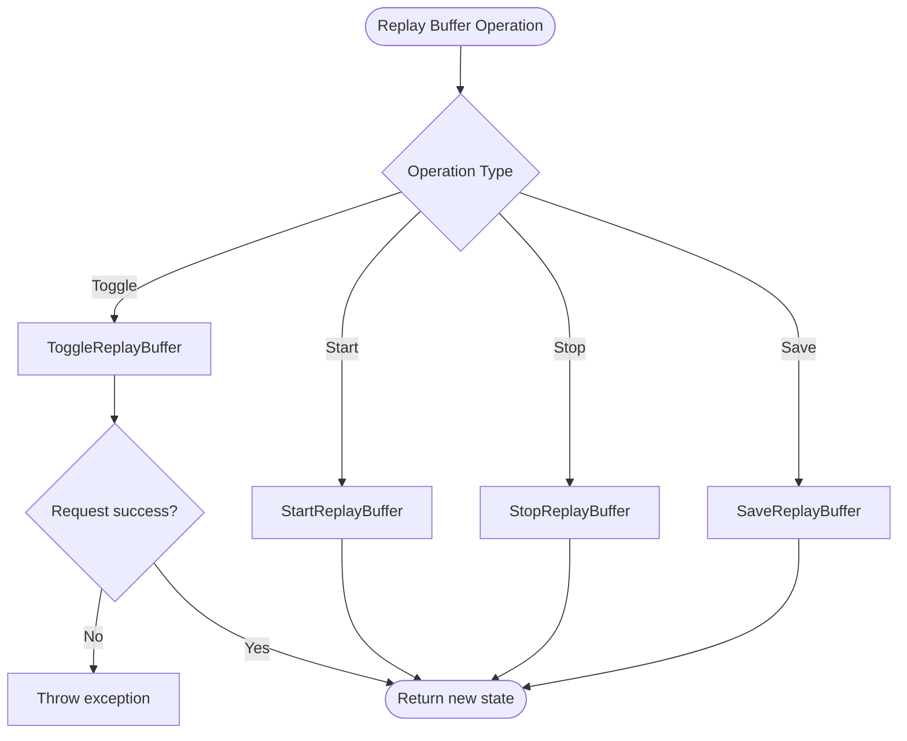
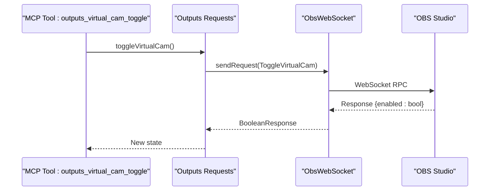
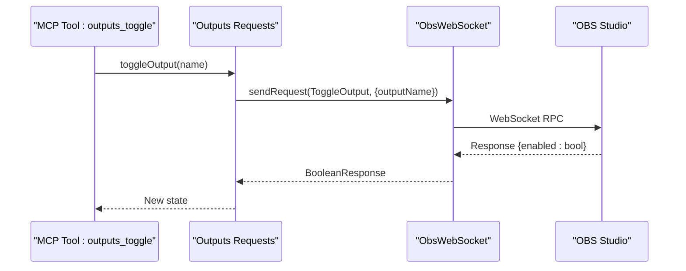
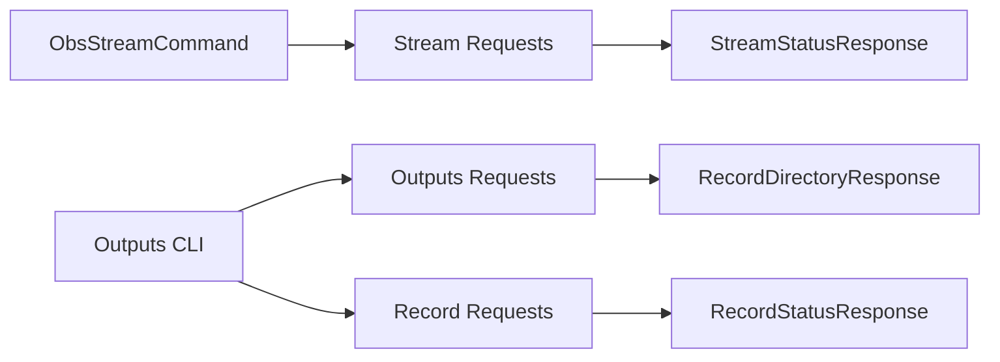

# Output Commands

<cite>
**Referenced Files in This Document**
- [obs_websocket.dart](file://lib/obs_websocket.dart)
- [obs_mcp_server.dart](file://lib/src/mcp/obs_mcp_server.dart)
- [obs_stream_command.dart](file://lib/src/cmd/obs_stream_command.dart)
- [outputs.dart](file://lib/src/request/outputs.dart)
- [record.dart](file://lib/src/request/record.dart)
- [stream.dart](file://lib/src/request/stream.dart)
- [stream_status_response.dart](file://lib/src/model/response/stream_status_response.dart)
- [record_status_response.dart](file://lib/src/model/response/record_status_response.dart)
- [record_directory_response.dart](file://lib/src/model/response/record_directory_response.dart)
- [virtualcam_state_changed.dart](file://lib/src/model/event/outputs/virtualcam_state_changed.dart)
- [obs_websocket_outputs_test.dart](file://test/obs_websocket_outputs_test.dart)
- [obs_websocket_stream_test.dart](file://test/obs_websocket_stream_test.dart)
</cite>

## Table of Contents
1. [Introduction](#introduction)
2. [Project Structure](#project-structure)
3. [Core Components](#core-components)
4. [Architecture Overview](#architecture-overview)
5. [Detailed Component Analysis](#detailed-component-analysis)
6. [Dependency Analysis](#dependency-analysis)
7. [Performance Considerations](#performance-considerations)
8. [Troubleshooting Guide](#troubleshooting-guide)
9. [Conclusion](#conclusion)
10. [Appendices](#appendices)

## Introduction
This document describes the output control CLI commands that manage recording, streaming, replay buffer, virtual camera, and generic output operations in OBS via the obs-websocket protocol. It explains output types, encoding settings, file path management, and practical examples of automated recording workflows. It also covers output status monitoring, error handling, and integration with external streaming platforms.

## Project Structure
The output command set is implemented across request classes, CLI commands, MCP tools, and response models. The CLI commands delegate to request classes, which communicate with OBS via the WebSocket interface. Response models parse and expose status fields for monitoring.

**Diagram sources**
- [obs_stream_command.dart:1-57](file://lib/src/cmd/obs_stream_command.dart#L1-L57)
- [obs_mcp_server.dart:614-794](file://lib/src/mcp/obs_mcp_server.dart#L614-L794)
- [stream.dart:1-93](file://lib/src/request/stream.dart#L1-L93)
- [record.dart:1-127](file://lib/src/request/record.dart#L1-L127)
- [outputs.dart:1-158](file://lib/src/request/outputs.dart#L1-L158)
- [stream_status_response.dart:1-36](file://lib/src/model/response/stream_status_response.dart#L1-L36)
- [record_status_response.dart:1-31](file://lib/src/model/response/record_status_response.dart#L1-L31)
- [record_directory_response.dart:1-22](file://lib/src/model/response/record_directory_response.dart#L1-L22)

**Section sources**
- [obs_websocket.dart:1-71](file://lib/obs_websocket.dart#L1-L71)
- [obs_stream_command.dart:1-57](file://lib/src/cmd/obs_stream_command.dart#L1-L57)
- [obs_mcp_server.dart:614-794](file://lib/src/mcp/obs_mcp_server.dart#L614-L794)

## Core Components
- Stream requests: start, stop, toggle, get status, send captions.
- Record requests: start, stop, pause, resume, get status.
- Outputs requests: virtual camera, replay buffer, arbitrary named outputs.
- CLI commands: stream and outputs subcommands for the CLI tool.
- MCP tools: stream and record operations exposed via the MCP server.
- Response models: structured status and configuration data for monitoring.

Key capabilities:
- Streaming management: start/stop/toggle, status monitoring, caption sending.
- Recording control: start/stop/pause/resume, status monitoring, file path retrieval.
- Replay buffer: status, toggle, start, stop, save.
- Virtual camera: status, toggle, start, stop.
- Generic outputs: toggle/start/stop by output name.

**Section sources**
- [stream.dart:1-93](file://lib/src/request/stream.dart#L1-L93)
- [record.dart:1-127](file://lib/src/request/record.dart#L1-L127)
- [outputs.dart:1-158](file://lib/src/request/outputs.dart#L1-L158)
- [obs_stream_command.dart:1-57](file://lib/src/cmd/obs_stream_command.dart#L1-L57)
- [obs_mcp_server.dart:614-794](file://lib/src/mcp/obs_mcp_server.dart#L614-L794)

## Architecture Overview
The CLI commands and MCP tools route to request classes that encapsulate RPC calls to OBS. Responses are parsed into typed models for status monitoring and automation.

**Diagram sources**
- [obs_stream_command.dart:21-57](file://lib/src/cmd/obs_stream_command.dart#L21-L57)
- [stream.dart:14-93](file://lib/src/request/stream.dart#L14-L93)

**Section sources**
- [obs_stream_command.dart:1-57](file://lib/src/cmd/obs_stream_command.dart#L1-L57)
- [stream.dart:1-93](file://lib/src/request/stream.dart#L1-L93)

## Detailed Component Analysis

### Streaming Management
Streaming operations are exposed via CLI and MCP tools. They support toggling, starting, stopping, and retrieving status, including congestion, bytes, frames, and reconnecting state.

- CLI commands:
  - stream get-stream-status
  - stream toggle-stream
  - stream start-stream
  - stream stop-stream
  - stream send-stream-caption

- MCP tools:
  - stream_status
  - stream_start
  - stream_stop
  - stream_toggle
  - stream_send_caption

- Status monitoring:
  - StreamStatusResponse fields include active state, reconnecting flag, timecode, duration, congestion, bytes per second, skipped frames, and total frames.

- Error handling:
  - Toggle operations return a boolean enabled state; errors are indicated by non-success request status codes.

- Practical examples:
  - Automated live streaming workflow:
    - Start streaming, monitor stream_status for active and congestion metrics, send periodic captions, and stop on failure or threshold crossing.
  - Integration with external platforms:
    - Use stream_status to detect reconnection events and adjust retry logic; send captions for accessibility or overlays.

**Diagram sources**
- [obs_mcp_server.dart:649-655](file://lib/src/mcp/obs_mcp_server.dart#L649-L655)
- [stream.dart:46-52](file://lib/src/request/stream.dart#L46-L52)

**Section sources**
- [obs_stream_command.dart:21-57](file://lib/src/cmd/obs_stream_command.dart#L21-L57)
- [obs_mcp_server.dart:618-665](file://lib/src/mcp/obs_mcp_server.dart#L618-L665)
- [stream.dart:14-93](file://lib/src/request/stream.dart#L14-L93)
- [stream_status_response.dart:1-36](file://lib/src/model/response/stream_status_response.dart#L1-L36)
- [obs_websocket_stream_test.dart:1-26](file://test/obs_websocket_stream_test.dart#L1-L26)

### Recording Control
Recording operations include start, stop, pause, resume, and status queries. Stop returns the output file path for post-processing.

- CLI commands:
  - record status
  - record start
  - record stop

- MCP tools:
  - record_status
  - record_start
  - record_stop
  - record_pause
  - record_resume
  - record_toggle_pause

- Status monitoring:
  - RecordStatusResponse includes active state, paused state, timecode, duration, and bytes written.

- File path management:
  - Stop recording returns the absolute path to the recorded file, enabling downstream automation (e.g., transcoding, upload).

- Practical examples:
  - Automated recording workflow:
    - Start recording, monitor record_status for duration and bytes, trigger post-processing on stop, and upload the file to storage or CDN.

**Diagram sources**
- [obs_mcp_server.dart:691-698](file://lib/src/mcp/obs_mcp_server.dart#L691-L698)
- [record.dart:73-83](file://lib/src/request/record.dart#L73-L83)

**Section sources**
- [obs_mcp_server.dart:671-698](file://lib/src/mcp/obs_mcp_server.dart#L671-L698)
- [record.dart:14-127](file://lib/src/request/record.dart#L14-L127)
- [record_status_response.dart:1-31](file://lib/src/model/response/record_status_response.dart#L1-L31)

### Replay Buffer Operations
Replay buffer controls include status, toggle, start, stop, and save operations. Save persists the buffer to disk.

- MCP tools:
  - outputs_replay_buffer_status
  - outputs_replay_buffer_toggle
  - outputs_replay_buffer_start
  - outputs_replay_buffer_stop
  - outputs_replay_buffer_save

- Error handling:
  - Toggle throws an exception if the request status code indicates failure.

- Practical examples:
  - Quick-save highlights after a game or presentation by triggering save immediately after a key event.

**Diagram sources**
- [outputs.dart:69-103](file://lib/src/request/outputs.dart#L69-L103)

**Section sources**
- [obs_mcp_server.dart:780-794](file://lib/src/mcp/obs_mcp_server.dart#L780-L794)
- [outputs.dart:51-103](file://lib/src/request/outputs.dart#L51-L103)

### Virtual Camera Functionality
Virtual camera controls include status, toggle, start, and stop.

- MCP tools:
  - outputs_virtual_cam_status
  - outputs_virtual_cam_toggle
  - outputs_virtual_cam_start
  - outputs_virtual_cam_stop

- Events:
  - VirtualcamStateChanged event carries outputActive and outputState for UI updates.

- Practical examples:
  - Integrate with video conferencing apps by starting the virtual camera when a scene becomes active and stopping when inactive.

**Diagram sources**
- [obs_mcp_server.dart:753-758](file://lib/src/mcp/obs_mcp_server.dart#L753-L758)
- [outputs.dart:27-33](file://lib/src/request/outputs.dart#L27-L33)

**Section sources**
- [obs_mcp_server.dart:745-778](file://lib/src/mcp/obs_mcp_server.dart#L745-L778)
- [outputs.dart:9-49](file://lib/src/request/outputs.dart#L9-L49)
- [virtualcam_state_changed.dart:1-31](file://lib/src/model/event/outputs/virtualcam_state_changed.dart#L1-L31)

### Generic Outputs (Arbitrary Named Outputs)
Generic output operations allow controlling any named output by name, including toggling, starting, and stopping.

- MCP tools:
  - outputs_toggle
  - outputs_start
  - outputs_stop

- Practical examples:
  - Control multiple outputs (e.g., streaming, recording, replay buffer) programmatically in scripts or integrations.

**Diagram sources**
- [obs_mcp_server.dart:741-743](file://lib/src/mcp/obs_mcp_server.dart#L741-L743)
- [outputs.dart:118-124](file://lib/src/request/outputs.dart#L118-L124)

**Section sources**
- [obs_mcp_server.dart:741-743](file://lib/src/mcp/obs_mcp_server.dart#L741-L743)
- [outputs.dart:105-156](file://lib/src/request/outputs.dart#L105-L156)

### Output Configuration and Encoding Settings
- Output configuration is managed within OBS Studio itself. The request classes provide status and control operations; encoding settings are configured via OBS Studio settings and do not require per-request parameters in these APIs.
- To integrate with external streaming platforms, configure the streaming service settings in OBS Studio and use the streaming commands here to start/stop and monitor the output.

[No sources needed since this section provides general guidance]

## Dependency Analysis
The CLI commands depend on request classes, which depend on the WebSocket transport. Response models are consumed by both CLI and MCP tools.

**Diagram sources**
- [obs_stream_command.dart:1-57](file://lib/src/cmd/obs_stream_command.dart#L1-L57)
- [obs_mcp_server.dart:614-794](file://lib/src/mcp/obs_mcp_server.dart#L614-L794)
- [stream.dart:1-93](file://lib/src/request/stream.dart#L1-L93)
- [record.dart:1-127](file://lib/src/request/record.dart#L1-L127)
- [outputs.dart:1-158](file://lib/src/request/outputs.dart#L1-L158)
- [stream_status_response.dart:1-36](file://lib/src/model/response/stream_status_response.dart#L1-L36)
- [record_status_response.dart:1-31](file://lib/src/model/response/record_status_response.dart#L1-L31)
- [record_directory_response.dart:1-22](file://lib/src/model/response/record_directory_response.dart#L1-L22)

**Section sources**
- [obs_websocket.dart:1-71](file://lib/obs_websocket.dart#L1-L71)

## Performance Considerations
- Use status polling judiciously; excessive polling increases overhead. Batch operations where possible.
- For streaming, monitor congestion and bytes per second to detect network issues early.
- For recording, track duration and bytes to estimate storage needs and trigger cleanup or archival workflows.
- For replay buffer, save frequently during long sessions to avoid data loss.

[No sources needed since this section provides general guidance]

## Troubleshooting Guide
- Toggle failures:
  - Replay buffer toggle throws an exception when the request status code indicates failure. Inspect the request status comment for details.
- Stream status anomalies:
  - If outputReconnecting is true, investigate network connectivity or streaming service configuration.
- Recording path issues:
  - On stop, ensure the returned file path exists and is accessible. Handle permission and disk space errors in downstream automation.
- Virtual camera state:
  - Use VirtualcamStateChanged events to synchronize UI and logs with actual state changes.

**Section sources**
- [outputs.dart:74-76](file://lib/src/request/outputs.dart#L74-L76)
- [virtualcam_state_changed.dart:1-31](file://lib/src/model/event/outputs/virtualcam_state_changed.dart#L1-L31)
- [obs_websocket_outputs_test.dart:1-24](file://test/obs_websocket_outputs_test.dart#L1-L24)
- [obs_websocket_stream_test.dart:1-26](file://test/obs_websocket_stream_test.dart#L1-L26)

## Conclusion
The output command suite provides robust control over OBS recording, streaming, replay buffer, and virtual camera operations. With status monitoring, error handling, and MCP/CLI integration, these commands enable automated workflows and platform integrations for live streaming and content creation.

[No sources needed since this section summarizes without analyzing specific files]

## Appendices

### Practical Automation Examples
- Automated recording workflow:
  - Start recording, poll record_status until a condition (duration or bytes threshold), then stop recording and process the returned file path.
- Live streaming workflow:
  - Start streaming, monitor stream_status for congestion and reconnecting flags, send periodic captions, and gracefully stop on failure.
- Highlights capture:
  - Start replay buffer, save on key events, and archive the saved file to a media library.

[No sources needed since this section provides general guidance]