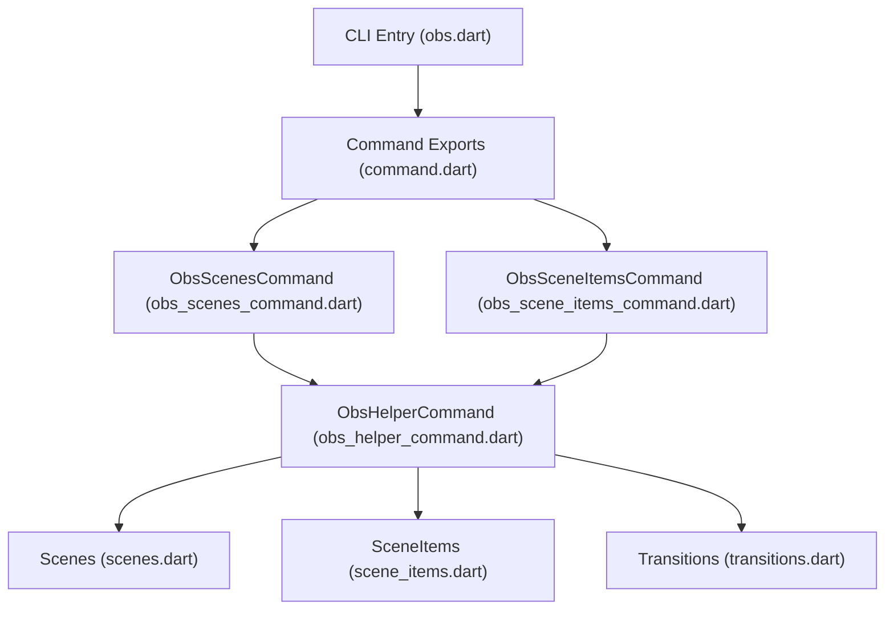
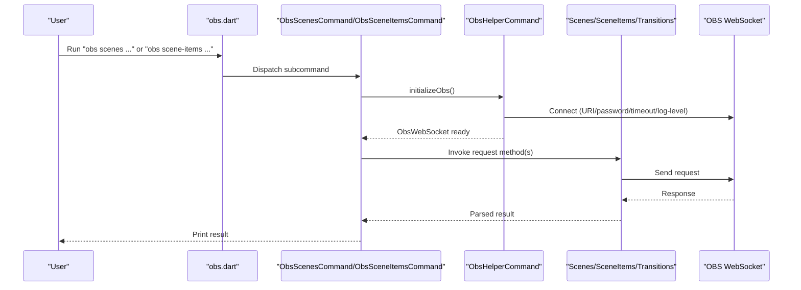
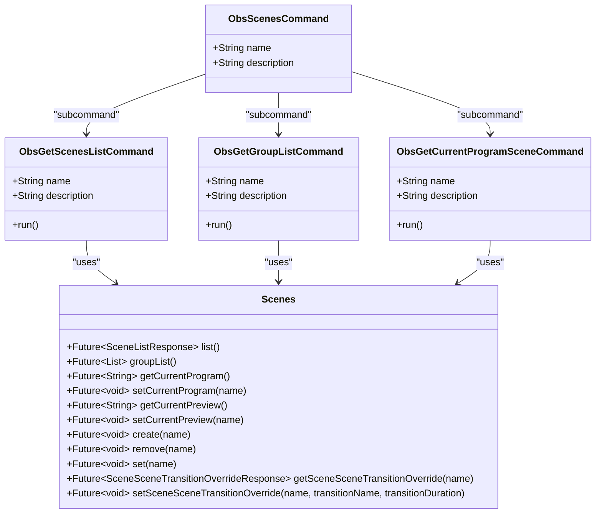
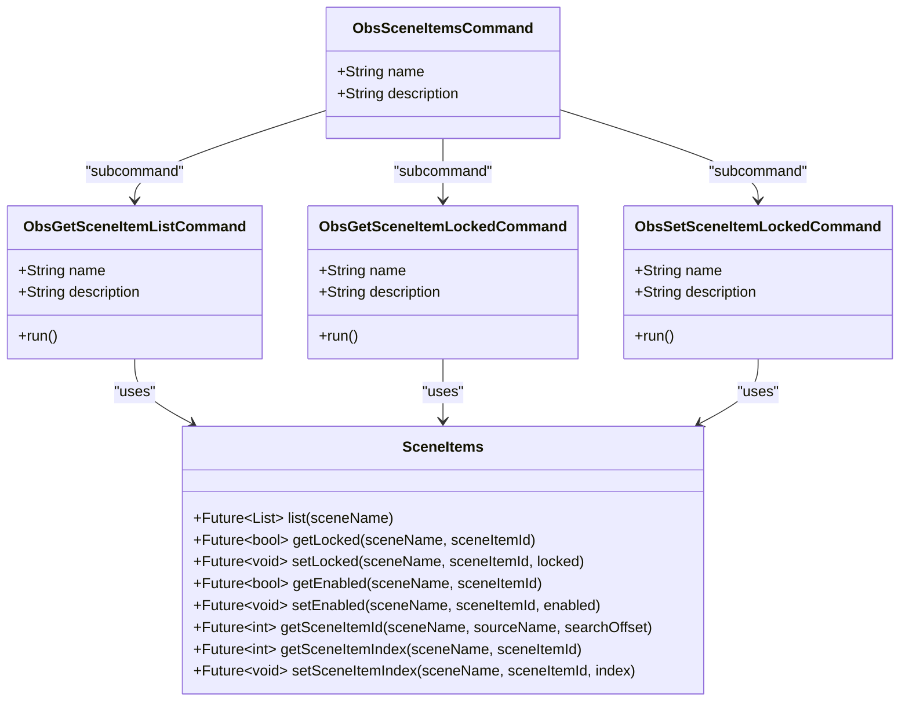
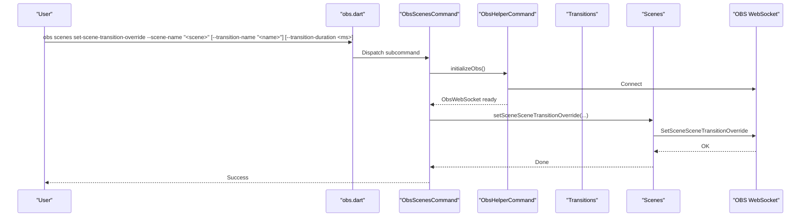
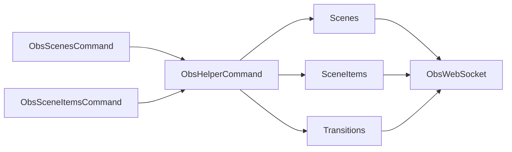

# Scene Commands

<cite>
**Referenced Files in This Document**
- [obs.dart](file://bin/obs.dart)
- [command.dart](file://lib/command.dart)
- [obs_scenes_command.dart](file://lib/src/cmd/obs_scenes_command.dart)
- [obs_scene_items_command.dart](file://lib/src/cmd/obs_scene_items_command.dart)
- [obs_helper_command.dart](file://lib/src/cmd/obs_helper_command.dart)
- [scenes.dart](file://lib/src/request/scenes.dart)
- [scene_items.dart](file://lib/src/request/scene_items.dart)
- [transitions.dart](file://lib/src/request/transitions.dart)
- [scene_list_response.dart](file://lib/src/model/response/scene_list_response.dart)
- [scene_scene_transition_override_response.dart](file://lib/src/model/response/scene_scene_transition_override_response.dart)
- [scene.dart](file://lib/src/model/shared/scene.dart)
- [README.md](file://README.md)
</cite>

## Table of Contents
1. [Introduction](#introduction)
2. [Project Structure](#project-structure)
3. [Core Components](#core-components)
4. [Architecture Overview](#architecture-overview)
5. [Detailed Component Analysis](#detailed-component-analysis)
6. [Dependency Analysis](#dependency-analysis)
7. [Performance Considerations](#performance-considerations)
8. [Troubleshooting Guide](#troubleshooting-guide)
9. [Conclusion](#conclusion)

## Introduction
This document explains the scene management CLI commands for OBS, focusing on how to create, delete, switch, rename, and configure transitions for scenes. It also covers scene hierarchy discovery, transition override per scene, and integration with scene item operations. The CLI is built around the obs-websocket protocol and provides high-level commands for everyday automation tasks.

## Project Structure
The CLI entrypoint registers commands for scenes and scene items, and delegates to helper commands that establish a WebSocket connection to OBS. Scene operations are implemented via the Scenes request class, while scene item operations are handled by SceneItems. Transitions are controlled via the Transitions request class.

**Diagram sources**
- [obs.dart:6-51](file://bin/obs.dart#L6-L51)
- [command.dart:6-19](file://lib/command.dart#L6-L19)
- [obs_scenes_command.dart:5-16](file://lib/src/cmd/obs_scenes_command.dart#L5-L16)
- [obs_scene_items_command.dart:5-16](file://lib/src/cmd/obs_scene_items_command.dart#L5-L16)
- [obs_helper_command.dart:8-42](file://lib/src/cmd/obs_helper_command.dart#L8-L42)
- [scenes.dart:4-231](file://lib/src/request/scenes.dart#L4-L231)
- [scene_items.dart:5-323](file://lib/src/request/scene_items.dart#L5-L323)
- [transitions.dart:4-32](file://lib/src/request/transitions.dart#L4-L32)

**Section sources**
- [obs.dart:6-51](file://bin/obs.dart#L6-L51)
- [command.dart:6-19](file://lib/command.dart#L6-L19)
- [obs_scenes_command.dart:5-16](file://lib/src/cmd/obs_scenes_command.dart#L5-L16)
- [obs_scene_items_command.dart:5-16](file://lib/src/cmd/obs_scene_items_command.dart#L5-L16)
- [obs_helper_command.dart:8-42](file://lib/src/cmd/obs_helper_command.dart#L8-L42)

## Core Components
- Scenes request class exposes operations for listing scenes, groups, current program/preview scenes, creating/removing/rename scenes, and configuring per-scene transition overrides.
- SceneItems request class exposes operations for listing scene items, finding a scene item by source name, and managing item enable/lock/index states.
- Transitions request class exposes operations for setting the current scene transition and triggering studio mode transitions.
- CLI commands under ObsScenesCommand and ObsSceneItemsCommand provide subcommands for listing scenes/groups, retrieving current scenes, and manipulating scene items.

Key capabilities:
- Scene lifecycle: create, delete, rename
- Scene navigation: set current program/preview scenes
- Scene hierarchy: list scenes and groups
- Transition configuration: set current transition globally and per-scene overrides
- Scene item integration: list items, manage locks/enabled state, adjust indices

**Section sources**
- [scenes.dart:4-231](file://lib/src/request/scenes.dart#L4-L231)
- [scene_items.dart:5-323](file://lib/src/request/scene_items.dart#L5-L323)
- [transitions.dart:4-32](file://lib/src/request/transitions.dart#L4-L32)
- [obs_scenes_command.dart:19-74](file://lib/src/cmd/obs_scenes_command.dart#L19-L74)
- [obs_scene_items_command.dart:19-135](file://lib/src/cmd/obs_scene_items_command.dart#L19-L135)

## Architecture Overview
The CLI composes commands that depend on a shared connection initialization routine. Each command initializes an ObsWebSocket connection using either a credentials file or explicit URI/password, then invokes the appropriate request class method(s).

**Diagram sources**
- [obs.dart:6-51](file://bin/obs.dart#L6-L51)
- [obs_helper_command.dart:13-42](file://lib/src/cmd/obs_helper_command.dart#L13-L42)
- [scenes.dart:34-101](file://lib/src/request/scenes.dart#L34-L101)
- [scene_items.dart:27-37](file://lib/src/request/scene_items.dart#L27-L37)
- [transitions.dart:26-32](file://lib/src/request/transitions.dart#L26-L32)

## Detailed Component Analysis

### Scenes Command Suite
The scenes command suite provides:
- Listing scenes and groups
- Retrieving current program/preview scenes
- Creating/deleting/rename scenes
- Setting per-scene transition overrides

**Diagram sources**
- [obs_scenes_command.dart:5-74](file://lib/src/cmd/obs_scenes_command.dart#L5-L74)
- [scenes.dart:4-231](file://lib/src/request/scenes.dart#L4-L231)

Practical usage examples (command-line):
- List scenes: obs scenes get-scenes-list
- List groups: obs scenes get-group-list
- Get current program scene: obs scenes get-current-program-scene
- Create scene: obs scenes create --scene-name "<scene-name>"
- Remove scene: obs scenes remove --scene-name "<scene-name>"
- Rename scene: obs scenes rename --scene-name "<scene-name>"
- Set per-scene transition override: obs scenes set-scene-transition-override --scene-name "<scene-name>" [--transition-name "<transition-name>"] [--transition-duration <ms>]

Scene naming conventions:
- Scene names are strings used to uniquely identify scenes within a scene collection.
- Renaming a scene updates its name; the underlying UUID remains stable for event correlation.

Scene hierarchy management:
- Groups in OBS are treated as scenes internally; listing groups returns a flat list of scene names that OBS considers groups.
- Use group list operations to discover hierarchical-like structures managed by OBS.

**Section sources**
- [obs_scenes_command.dart:19-74](file://lib/src/cmd/obs_scenes_command.dart#L19-L74)
- [scenes.dart:34-231](file://lib/src/request/scenes.dart#L34-L231)
- [scene_list_response.dart:8-27](file://lib/src/model/response/scene_list_response.dart#L8-L27)
- [scene.dart:7-25](file://lib/src/model/shared/scene.dart#L7-L25)

### Scene Items Command Suite
The scene items command suite provides:
- Listing scene items in a scene
- Getting/setting the lock state of a scene item
- Getting/setting the enabled state of a scene item
- Getting/setting the index of a scene item

**Diagram sources**
- [obs_scene_items_command.dart:5-135](file://lib/src/cmd/obs_scene_items_command.dart#L5-L135)
- [scene_items.dart:5-323](file://lib/src/request/scene_items.dart#L5-L323)

Integration with scene operations:
- Use get-scene-item-list to enumerate items in a target scene before applying enable/lock/index changes.
- Use get-scene-item-id to resolve a source name to a numeric ID for targeted operations.

**Section sources**
- [obs_scene_items_command.dart:19-135](file://lib/src/cmd/obs_scene_items_command.dart#L19-L135)
- [scene_items.dart:27-323](file://lib/src/request/scene_items.dart#L27-L323)

### Transition Configuration
Transition configuration supports:
- Setting the current scene transition globally
- Triggering a studio mode transition
- Overriding the transition for a specific scene (name and duration)

**Diagram sources**
- [scenes.dart:217-230](file://lib/src/request/scenes.dart#L217-L230)
- [transitions.dart:26-32](file://lib/src/request/transitions.dart#L26-L32)

Transition types and duration settings:
- Transition types are determined by OBS; the CLI accepts a transition name string.
- Duration is specified in milliseconds for transitions that support variable duration.
- Per-scene overrides take precedence over the global transition for that scene.

**Section sources**
- [scenes.dart:192-230](file://lib/src/request/scenes.dart#L192-L230)
- [scene_scene_transition_override_response.dart:7-26](file://lib/src/model/response/scene_scene_transition_override_response.dart#L7-L26)

### Practical Automation Workflows
Example scenarios using the CLI:

- Switch to a specific scene programmatically:
  - Command: obs scenes set-current-program-scene --scene-name "<scene>"
  - Use-case: Automated scene changes during recording or streaming.

- Batch update scene item visibility:
  - Steps:
    1) List items: obs scene-items get-scene-item-list --scene-name "<scene>"
    2) For each item, toggle enabled state: obs scene-items set-scene-item-enabled --scene-name "<scene>" --scene-item-id <id> --enabled <true|false>
  - Use-case: Dynamic overlays or source reveals.

- Configure per-scene transition:
  - Command: obs scenes set-scene-transition-override --scene-name "<scene>" --transition-name "<fade>" --transition-duration 500
  - Use-case: Scene-specific timing for cuts or wipes.

- Discover scene hierarchy:
  - Command: obs scenes get-group-list
  - Use-case: Understanding OBS groups treated as scenes.

Note: The CLI does not expose duplication of scene items in its current command set. For duplication, use the low-level send mechanism or extend the command set accordingly.

**Section sources**
- [obs_scenes_command.dart:57-74](file://lib/src/cmd/obs_scenes_command.dart#L57-L74)
- [obs_scene_items_command.dart:19-135](file://lib/src/cmd/obs_scene_items_command.dart#L19-L135)
- [README.md:106-263](file://README.md#L106-L263)

## Dependency Analysis
- ObsScenesCommand depends on ObsHelperCommand for connection setup and on Scenes for operations.
- ObsSceneItemsCommand depends on ObsHelperCommand and SceneItems for operations.
- Scenes and SceneItems depend on ObsWebSocket to send requests.
- Transitions provides global transition controls used alongside Scenes.

**Diagram sources**
- [obs_scenes_command.dart:5-16](file://lib/src/cmd/obs_scenes_command.dart#L5-L16)
- [obs_scene_items_command.dart:5-16](file://lib/src/cmd/obs_scene_items_command.dart#L5-L16)
- [obs_helper_command.dart:8-42](file://lib/src/cmd/obs_helper_command.dart#L8-L42)
- [scenes.dart:4-7](file://lib/src/request/scenes.dart#L4-L7)
- [scene_items.dart:5-6](file://lib/src/request/scene_items.dart#L5-L6)
- [transitions.dart:4-5](file://lib/src/request/transitions.dart#L4-L5)

**Section sources**
- [obs_scenes_command.dart:5-16](file://lib/src/cmd/obs_scenes_command.dart#L5-L16)
- [obs_scene_items_command.dart:5-16](file://lib/src/cmd/obs_scene_items_command.dart#L5-L16)
- [obs_helper_command.dart:8-42](file://lib/src/cmd/obs_helper_command.dart#L8-L42)

## Performance Considerations
- Minimize round-trips by batching related operations (e.g., list items, then apply multiple enable/lock changes).
- Use group list to understand scene organization before performing bulk operations.
- Prefer per-scene transition overrides for scenes requiring specialized transitions to avoid frequent global changes.

## Troubleshooting Guide
Common issues and resolutions:
- Connection failures:
  - Verify URI and password match OBS settings.
  - Increase timeout if the connection is slow.
- Authentication errors:
  - Ensure the password matches OBS configuration.
- Unknown scene names:
  - List scenes/groups first to confirm names.
- Permission errors:
  - Confirm the CLI has access to the OBS installation and network.

Operational tips:
- Use verbose logging (--log-level) to diagnose connectivity and request issues.
- Close connections properly to prevent resource leaks.

**Section sources**
- [obs_helper_command.dart:13-42](file://lib/src/cmd/obs_helper_command.dart#L13-L42)
- [obs.dart:11-36](file://bin/obs.dart#L11-L36)

## Conclusion
The scene management CLI provides robust capabilities for creating, deleting, renaming, and navigating scenes, discovering scene hierarchy, and configuring transitions at both global and per-scene levels. Combined with scene item operations, it enables flexible automation workflows for OBS. For advanced operations not exposed by high-level commands, the low-level send mechanism can be used to invoke additional requests.