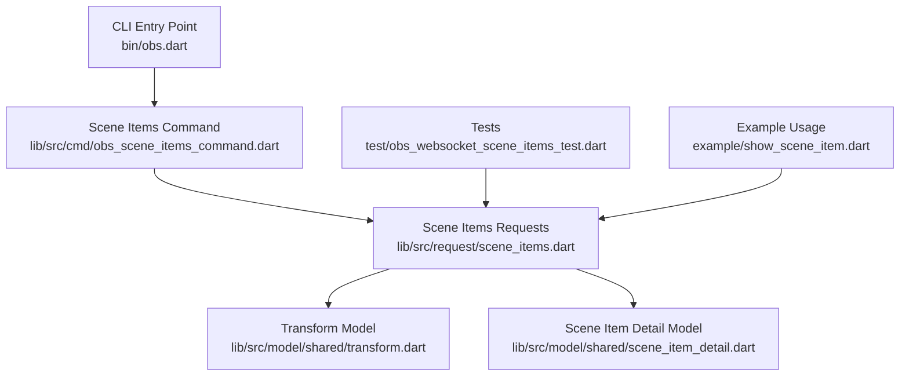
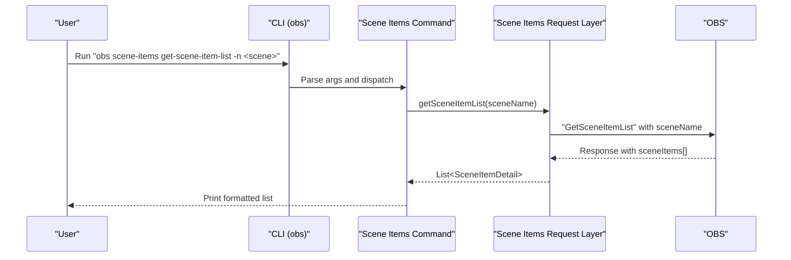
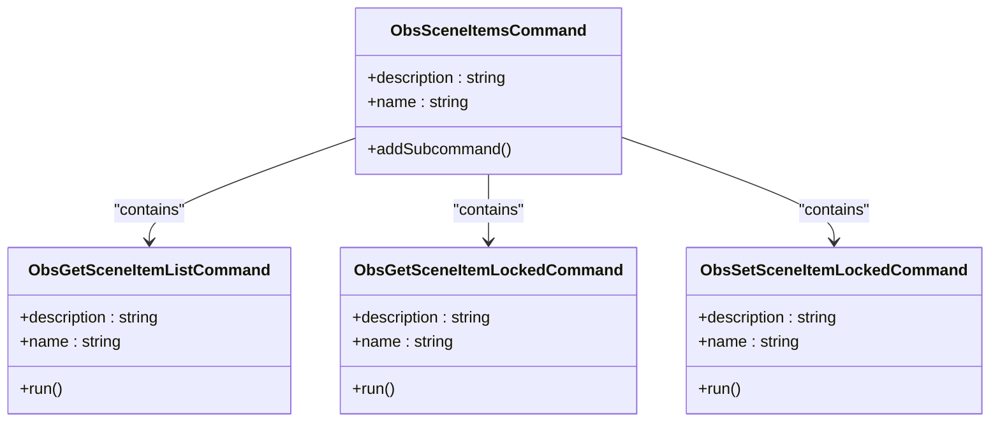
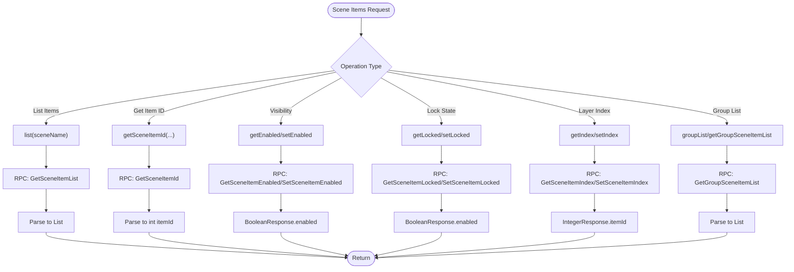
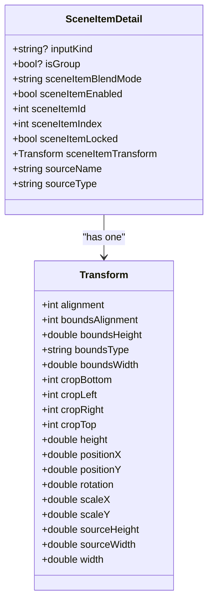
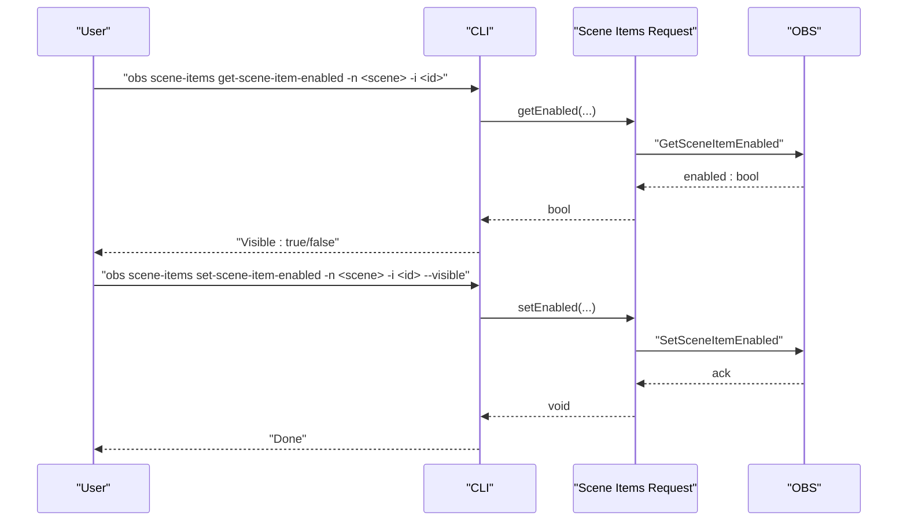
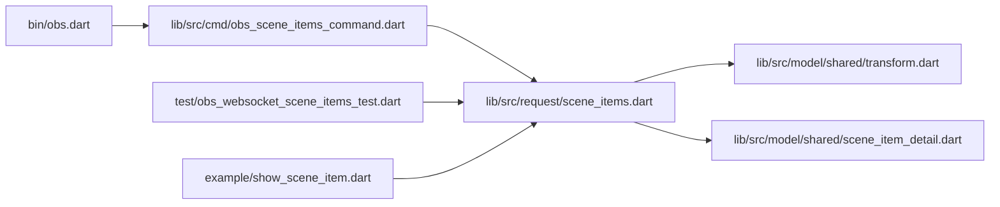

# Scene Item Commands

<cite>
**Referenced Files in This Document**
- [obs.dart](file://bin/obs.dart)
- [obs_scene_items_command.dart](file://lib/src/cmd/obs_scene_items_command.dart)
- [scene_items.dart](file://lib/src/request/scene_items.dart)
- [transform.dart](file://lib/src/model/shared/transform.dart)
- [scene_item_detail.dart](file://lib/src/model/shared/scene_item_detail.dart)
- [obs_websocket_scene_items_test.dart](file://test/obs_websocket_scene_items_test.dart)
- [show_scene_item.dart](file://example/show_scene_item.dart)
- [README.md](file://README.md)
</cite>

## Table of Contents
1. [Introduction](#introduction)
2. [Project Structure](#project-structure)
3. [Core Components](#core-components)
4. [Architecture Overview](#architecture-overview)
5. [Detailed Component Analysis](#detailed-component-analysis)
6. [Dependency Analysis](#dependency-analysis)
7. [Performance Considerations](#performance-considerations)
8. [Troubleshooting Guide](#troubleshooting-guide)
9. [Conclusion](#conclusion)

## Introduction
This document explains the scene item management CLI commands that manipulate individual elements within OBS scenes. It covers positioning, scaling, rotation, visibility control, and transformation operations. It also documents item selection methods, coordinate systems, transformation matrices, item grouping, layer management, and integration with scene and source operations. The focus is on the commands exposed through the CLI and the underlying request/response model used by the library.

## Project Structure
The CLI entry point registers the scene items command group, which exposes subcommands for listing items, checking lock state, and toggling lock state. The request layer encapsulates the RPC calls to OBS, while the model layer defines the data structures for transforms and scene item details.

**Diagram sources**
- [obs.dart:1-61](file://bin/obs.dart#L1-L61)
- [obs_scene_items_command.dart:1-136](file://lib/src/cmd/obs_scene_items_command.dart#L1-L136)
- [scene_items.dart:1-324](file://lib/src/request/scene_items.dart#L1-L324)
- [transform.dart:1-57](file://lib/src/model/shared/transform.dart#L1-L57)
- [scene_item_detail.dart:1-42](file://lib/src/model/shared/scene_item_detail.dart#L1-L42)
- [obs_websocket_scene_items_test.dart:1-58](file://test/obs_websocket_scene_items_test.dart#L1-L58)
- [show_scene_item.dart:1-70](file://example/show_scene_item.dart#L1-L70)

**Section sources**
- [obs.dart:1-61](file://bin/obs.dart#L1-L61)
- [obs_scene_items_command.dart:1-136](file://lib/src/cmd/obs_scene_items_command.dart#L1-L136)
- [scene_items.dart:1-324](file://lib/src/request/scene_items.dart#L1-L324)
- [transform.dart:1-57](file://lib/src/model/shared/transform.dart#L1-L57)
- [scene_item_detail.dart:1-42](file://lib/src/model/shared/scene_item_detail.dart#L1-L42)
- [obs_websocket_scene_items_test.dart:1-58](file://test/obs_websocket_scene_items_test.dart#L1-L58)
- [show_scene_item.dart:1-70](file://example/show_scene_item.dart#L1-L70)

## Core Components
- CLI command registration for scene items:
  - Command group: scene-items
  - Subcommands:
    - get-scene-item-list
    - get-scene-item-locked
    - set-scene-item-locked

- Request layer for scene items:
  - List scene items in a scene
  - Get scene item ID by scene and source name
  - Get/set scene item enabled state
  - Get/set scene item locked state
  - Get/set scene item index (layer order)
  - Group scene item list retrieval (deprecated in code comments)

- Data models:
  - Transform: encapsulates position, scale, rotation, bounds, cropping, and sizing
  - SceneItemDetail: includes transform, blend mode, enabled/locked flags, and indices

**Section sources**
- [obs_scene_items_command.dart:1-136](file://lib/src/cmd/obs_scene_items_command.dart#L1-L136)
- [scene_items.dart:10-324](file://lib/src/request/scene_items.dart#L10-L324)
- [transform.dart:7-57](file://lib/src/model/shared/transform.dart#L7-L57)
- [scene_item_detail.dart:8-42](file://lib/src/model/shared/scene_item_detail.dart#L8-L42)

## Architecture Overview
The CLI delegates to the scene items command, which initializes the OBS connection and invokes the request layer. The request layer sends RPC requests to OBS and parses responses into typed models.

**Diagram sources**
- [obs.dart:37-51](file://bin/obs.dart#L37-L51)
- [obs_scene_items_command.dart:19-49](file://lib/src/cmd/obs_scene_items_command.dart#L19-L49)
- [scene_items.dart:17-37](file://lib/src/request/scene_items.dart#L17-L37)

## Detailed Component Analysis

### CLI Scene Items Command
- Command group: scene-items
- Subcommands:
  - get-scene-item-list
    - Options: --scene-name (-n)
    - Behavior: lists all scene items in the given scene
  - get-scene-item-locked
    - Options: --scene-name (-n), --scene-item-id (-i)
    - Behavior: prints the lock state of a specific scene item
  - set-scene-item-locked
    - Options: --scene-name (-n), --scene-item-id (-i), --scene-item-locked (-l)
    - Behavior: sets the lock state of a specific scene item

**Diagram sources**
- [obs_scene_items_command.dart:4-16](file://lib/src/cmd/obs_scene_items_command.dart#L4-L16)
- [obs_scene_items_command.dart:19-49](file://lib/src/cmd/obs_scene_items_command.dart#L19-L49)
- [obs_scene_items_command.dart:51-90](file://lib/src/cmd/obs_scene_items_command.dart#L51-L90)
- [obs_scene_items_command.dart:92-136](file://lib/src/cmd/obs_scene_items_command.dart#L92-L136)

**Section sources**
- [obs_scene_items_command.dart:4-136](file://lib/src/cmd/obs_scene_items_command.dart#L4-L136)
- [obs.dart:47](file://bin/obs.dart#L47)

### Request Layer: Scene Items
- List scene items in a scene
  - Method: list(sceneName)
  - RPC: GetSceneItemList
  - Returns: List<SceneItemDetail>
- Get scene item ID by scene and source name
  - Method: getSceneItemId(sceneName, sourceName[, searchOffset])
  - RPC: GetSceneItemId
  - Returns: int itemId
- Visibility control
  - Get enabled state: getEnabled(sceneName, sceneItemId)
  - Set enabled state: setEnabled(sceneItemEnableStateChanged)
- Lock state control
  - Get locked: getLocked(sceneName, sceneItemId)
  - Set locked: setLocked(sceneName, sceneItemId, sceneItemLocked)
- Layer ordering
  - Get index: getIndex(sceneName, sceneItemId)
  - Set index: setIndex(sceneName, sceneItemId, sceneItemIndex)
- Group scene item list (deprecated note present)
  - Methods: groupList(sceneName) and getGroupSceneItemList(sceneName)
  - RPC: GetGroupSceneItemList

**Diagram sources**
- [scene_items.dart:17-37](file://lib/src/request/scene_items.dart#L17-L37)
- [scene_items.dart:96-113](file://lib/src/request/scene_items.dart#L96-L113)
- [scene_items.dart:134-146](file://lib/src/request/scene_items.dart#L134-L146)
- [scene_items.dart:166-173](file://lib/src/request/scene_items.dart#L166-L173)
- [scene_items.dart:203-207](file://lib/src/request/scene_items.dart#L203-L207)
- [scene_items.dart:238-246](file://lib/src/request/scene_items.dart#L238-L246)
- [scene_items.dart:280-284](file://lib/src/request/scene_items.dart#L280-L284)
- [scene_items.dart:314-322](file://lib/src/request/scene_items.dart#L314-L322)
- [scene_items.dart:48-70](file://lib/src/request/scene_items.dart#L48-L70)

**Section sources**
- [scene_items.dart:10-324](file://lib/src/request/scene_items.dart#L10-L324)

### Data Models: Transform and SceneItemDetail
- Transform
  - Fields: alignment, boundsAlignment, boundsType, boundsWidth/Height, cropTop/Bottom/Left/Right, height, positionX/Y, rotation, scaleX/Y, sourceHeight/Width, width
  - Purpose: describes the geometric and boundary properties of a scene item
- SceneItemDetail
  - Fields: inputKind, isGroup, sceneItemBlendMode, sceneItemEnabled, sceneItemId, sceneItemIndex, sceneItemLocked, sceneItemTransform, sourceName, sourceType
  - Purpose: comprehensive metadata for a single scene item

**Diagram sources**
- [transform.dart:8-56](file://lib/src/model/shared/transform.dart#L8-L56)
- [scene_item_detail.dart:9-41](file://lib/src/model/shared/scene_item_detail.dart#L9-L41)

**Section sources**
- [transform.dart:1-57](file://lib/src/model/shared/transform.dart#L1-L57)
- [scene_item_detail.dart:1-42](file://lib/src/model/shared/scene_item_detail.dart#L1-L42)

### Coordinate Systems and Transformation Matrices
- Position and Bounds
  - positionX, positionY: top-left anchor in scene coordinates
  - boundsType, boundsWidth, boundsHeight: optional bounding box constraints
  - sourceWidth/sourceHeight: native source dimensions
  - width/height: effective rendered size after scaling and bounds
- Scaling
  - scaleX, scaleY: uniform/non-uniform scaling factors
- Rotation
  - rotation: angle in degrees around the pivot
- Alignment and Cropping
  - alignment: aligns the item within its bounds
  - cropTop/Bottom/Left/Right: crop amounts subtracted from source before rendering
- Practical Implications
  - To center an item, adjust positionX/Y based on width/height and alignment
  - To zoom without cropping, adjust scaleX/SY; to crop, adjust crop values
  - To rotate, set rotation; consider boundsType to constrain fit

**Section sources**
- [transform.dart:8-56](file://lib/src/model/shared/transform.dart#L8-L56)

### Item Selection Methods
- Select by scene and source name
  - Use getSceneItemId(sceneName, sourceName[, searchOffset]) to resolve a unique item ID
- Select by scene and item ID
  - Use the resolved sceneItemId with per-item operations (visibility, lock, index)
- Group handling
  - Use groupList or getGroupSceneItemList for legacy group support (deprecated note in code)

**Section sources**
- [scene_items.dart:96-113](file://lib/src/request/scene_items.dart#L96-L113)
- [scene_items.dart:48-70](file://lib/src/request/scene_items.dart#L48-L70)

### Visibility Control Workflow
- Retrieve current state
  - getEnabled(sceneName, sceneItemId)
- Toggle visibility
  - setEnabled(SceneItemEnableStateChanged(...))
- Event-driven automation
  - Subscribe to SceneItemEnableStateChanged events and act upon transitions

**Diagram sources**
- [scene_items.dart:134-146](file://lib/src/request/scene_items.dart#L134-L146)
- [scene_items.dart:166-173](file://lib/src/request/scene_items.dart#L166-L173)

**Section sources**
- [scene_items.dart:115-173](file://lib/src/request/scene_items.dart#L115-L173)
- [show_scene_item.dart:32-53](file://example/show_scene_item.dart#L32-L53)

### Lock State Management
- Check lock state
  - getLocked(sceneName, sceneItemId)
- Set lock state
  - setLocked(sceneName, sceneItemId, sceneItemLocked)
- Use cases
  - Prevent accidental movement or editing during automated sequences
  - Protect key elements during transitions

**Section sources**
- [scene_items.dart:175-246](file://lib/src/request/scene_items.dart#L175-L246)
- [obs_websocket_scene_items_test.dart:26-56](file://test/obs_websocket_scene_items_test.dart#L26-L56)

### Layer Management (Index Ordering)
- Get index
  - getIndex(sceneName, sceneItemId)
- Set index
  - setIndex(sceneName, sceneItemId, sceneItemIndex)
- Notes
  - Index 0 is at the bottom of the source list in the UI
  - Reordering affects draw order and interaction behavior

**Section sources**
- [scene_items.dart:248-322](file://lib/src/request/scene_items.dart#L248-L322)

### Integration with Scenes and Sources
- Scenes
  - Use Scenes.getCurrentProgramScene() to target the active scene
  - Combine with SceneItems.getSceneItemId() to select the desired item
- Sources
  - Use Sources.getSourceActive()/getSourceScreenshot() for source-level operations
  - Scene items are instances of sources placed in scenes

**Section sources**
- [README.md:62-104](file://README.md#L62-L104)
- [README.md:139-142](file://README.md#L139-L142)
- [scene_items.dart:96-113](file://lib/src/request/scene_items.dart#L96-L113)

### Practical Examples of Automation
- Show then hide a scene item after a delay
  - Resolve scene and item ID
  - Check current visibility
  - If hidden, set visible
  - Wait and then set invisible
- Batch operations
  - List items, iterate, and apply transformations or visibility changes conditionally

**Section sources**
- [show_scene_item.dart:7-70](file://example/show_scene_item.dart#L7-L70)

## Dependency Analysis
- CLI depends on command registration to expose subcommands
- Commands depend on the request layer for RPC interactions
- Requests depend on the model layer for serialization/deserialization
- Tests validate request/response parsing and basic operations
- Example demonstrates end-to-end usage combining scenes and scene items

**Diagram sources**
- [obs.dart:1-61](file://bin/obs.dart#L1-L61)
- [obs_scene_items_command.dart:1-136](file://lib/src/cmd/obs_scene_items_command.dart#L1-L136)
- [scene_items.dart:1-324](file://lib/src/request/scene_items.dart#L1-L324)
- [transform.dart:1-57](file://lib/src/model/shared/transform.dart#L1-L57)
- [scene_item_detail.dart:1-42](file://lib/src/model/shared/scene_item_detail.dart#L1-L42)
- [obs_websocket_scene_items_test.dart:1-58](file://test/obs_websocket_scene_items_test.dart#L1-L58)
- [show_scene_item.dart:1-70](file://example/show_scene_item.dart#L1-L70)

**Section sources**
- [obs.dart:1-61](file://bin/obs.dart#L1-L61)
- [obs_scene_items_command.dart:1-136](file://lib/src/cmd/obs_scene_items_command.dart#L1-L136)
- [scene_items.dart:1-324](file://lib/src/request/scene_items.dart#L1-L324)
- [transform.dart:1-57](file://lib/src/model/shared/transform.dart#L1-L57)
- [scene_item_detail.dart:1-42](file://lib/src/model/shared/scene_item_detail.dart#L1-L42)
- [obs_websocket_scene_items_test.dart:1-58](file://test/obs_websocket_scene_items_test.dart#L1-L58)
- [show_scene_item.dart:1-70](file://example/show_scene_item.dart#L1-L70)

## Performance Considerations
- Minimize repeated RPC calls by batching operations where possible
- Use getItemId once and reuse sceneItemId across multiple operations
- Avoid frequent polling; subscribe to relevant events for state changes
- When iterating many items, consider filtering by name or type to reduce payload sizes

## Troubleshooting Guide
- Authentication and connectivity
  - Ensure OBS has obs-websocket enabled and the correct password configured
  - Verify URI and port options when invoking the CLI
- Common request errors
  - Invalid scene name or missing scene items
  - Invalid sceneItemId or mismatched scene
  - Permission denied if the item is locked
- Validation and tests
  - Use the provided unit tests as references for expected response shapes
  - Confirm that scene item lists and lock state queries return expected booleans

**Section sources**
- [obs.dart:11-36](file://bin/obs.dart#L11-L36)
- [obs_websocket_scene_items_test.dart:6-56](file://test/obs_websocket_scene_items_test.dart#L6-L56)

## Conclusion
The scene items CLI and request layer provide robust primitives for managing individual elements within OBS scenes. With precise control over position, scale, rotation, visibility, locking, and layer ordering, plus integration points to scenes and sources, developers can automate complex scene compositions reliably. The data models clearly separate geometry (Transform) from item metadata (SceneItemDetail), enabling straightforward extension and maintenance.