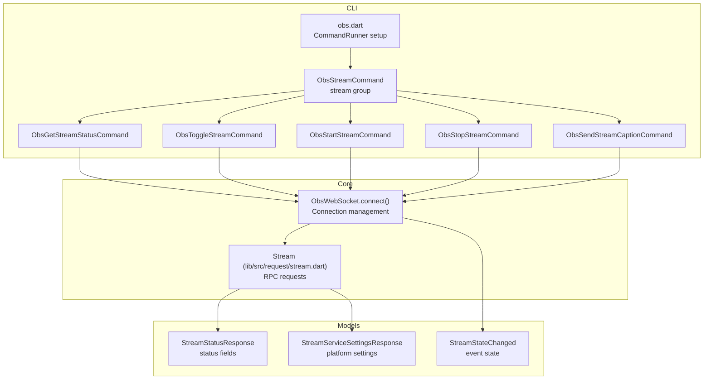
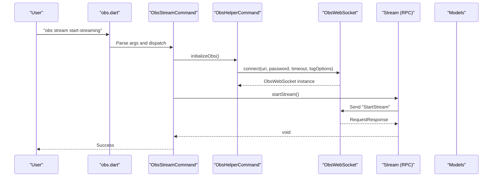
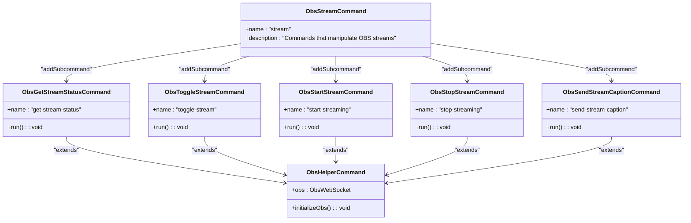
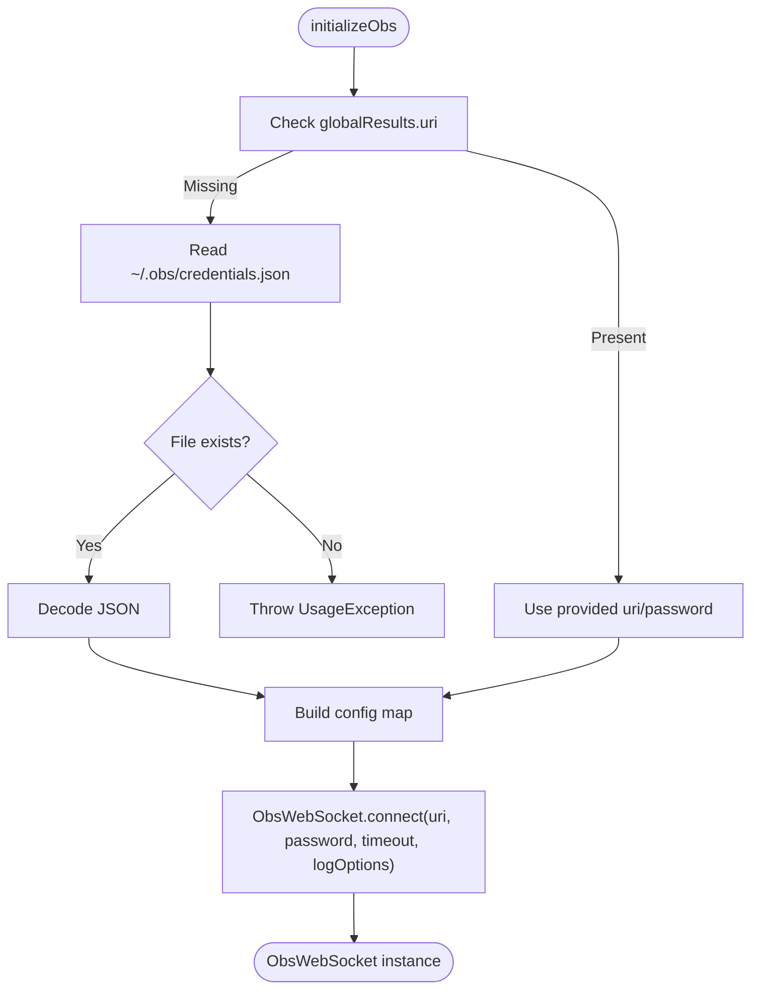
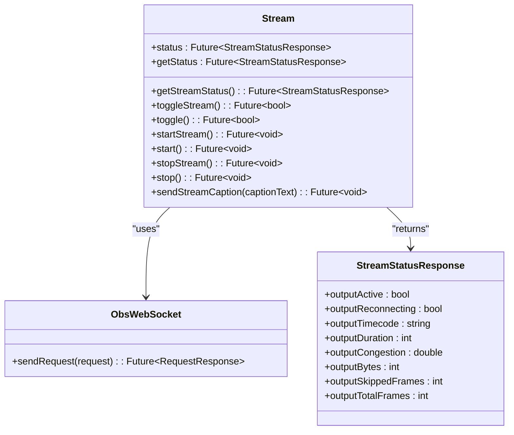
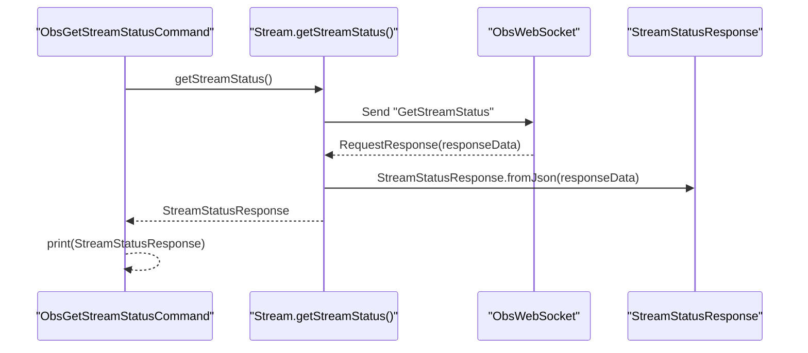
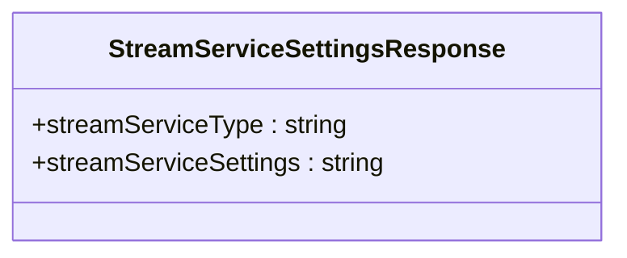
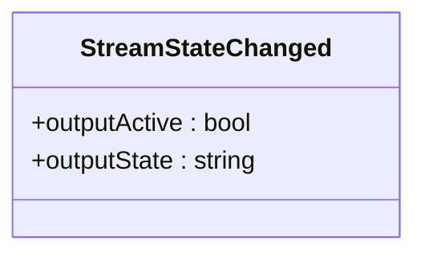
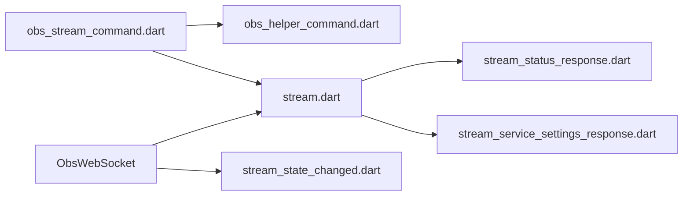

# Stream Commands

<cite>
**Referenced Files in This Document**
- [obs.dart](file://bin/obs.dart)
- [obs_stream_command.dart](file://lib/src/cmd/obs_stream_command.dart)
- [obs_helper_command.dart](file://lib/src/cmd/obs_helper_command.dart)
- [stream.dart](file://lib/src/request/stream.dart)
- [stream_status_response.dart](file://lib/src/model/response/stream_status_response.dart)
- [stream_service_settings_response.dart](file://lib/src/model/response/stream_service_settings_response.dart)
- [stream_state_changed.dart](file://lib/src/model/event/outputs/stream_state_changed.dart)
- [obs_websocket.dart](file://lib/obs_websocket.dart)
- [obs_websocket_stream_test.dart](file://test/obs_websocket_stream_test.dart)
</cite>

## Table of Contents
1. [Introduction](#introduction)
2. [Project Structure](#project-structure)
3. [Core Components](#core-components)
4. [Architecture Overview](#architecture-overview)
5. [Detailed Component Analysis](#detailed-component-analysis)
6. [Dependency Analysis](#dependency-analysis)
7. [Performance Considerations](#performance-considerations)
8. [Troubleshooting Guide](#troubleshooting-guide)
9. [Conclusion](#conclusion)

## Introduction
This document describes the live streaming CLI commands that control real-time streaming operations in OBS via the obs-websocket-dart library. It covers stream initialization, connection management, stream state monitoring, and platform-specific streaming configurations. For each command, we explain streaming protocols, bitrate settings, encoder configuration, and practical examples of automated streaming workflows. We also include stream quality optimization, error recovery procedures, and integration with streaming platform APIs.

## Project Structure
The streaming functionality is exposed through a CLI command group named stream. The CLI integrates with the core WebSocket client and provides subcommands for stream control and monitoring. Responses and events are modeled using generated JSON-serializable classes.

**Diagram sources**
- [obs.dart:6-60](file://bin/obs.dart#L6-L60)
- [obs_stream_command.dart:5-18](file://lib/src/cmd/obs_stream_command.dart#L5-L18)
- [obs_helper_command.dart:13-42](file://lib/src/cmd/obs_helper_command.dart#L13-L42)
- [stream.dart:4-94](file://lib/src/request/stream.dart#L4-L94)
- [stream_status_response.dart:7-36](file://lib/src/model/response/stream_status_response.dart#L7-L36)
- [stream_service_settings_response.dart:7-24](file://lib/src/model/response/stream_service_settings_response.dart#L7-L24)
- [stream_state_changed.dart:10-28](file://lib/src/model/event/outputs/stream_state_changed.dart#L10-L28)

**Section sources**
- [obs.dart:6-60](file://bin/obs.dart#L6-L60)
- [obs_stream_command.dart:5-18](file://lib/src/cmd/obs_stream_command.dart#L5-L18)
- [obs_helper_command.dart:13-42](file://lib/src/cmd/obs_helper_command.dart#L13-L42)
- [stream.dart:4-94](file://lib/src/request/stream.dart#L4-L94)

## Core Components
- Stream command group: Provides subcommands for stream control and monitoring.
- Connection initializer: Establishes a WebSocket connection to OBS with optional credentials and logging.
- Stream RPC client: Encapsulates OBS RPC calls for stream operations.
- Stream status model: Describes current stream health and metrics.
- Stream service settings model: Describes platform type and serialized settings.
- Stream state change event: Notifies when the stream output state changes.

Key capabilities:
- Get stream status and metrics
- Toggle, start, and stop streaming
- Send captions over the stream
- Monitor stream state changes
- Integrate with platform-specific streaming settings

**Section sources**
- [obs_stream_command.dart:21-121](file://lib/src/cmd/obs_stream_command.dart#L21-L121)
- [obs_helper_command.dart:13-42](file://lib/src/cmd/obs_helper_command.dart#L13-L42)
- [stream.dart:9-93](file://lib/src/request/stream.dart#L9-L93)
- [stream_status_response.dart:7-36](file://lib/src/model/response/stream_status_response.dart#L7-L36)
- [stream_service_settings_response.dart:7-24](file://lib/src/model/response/stream_service_settings_response.dart#L7-L24)
- [stream_state_changed.dart:10-28](file://lib/src/model/event/outputs/stream_state_changed.dart#L10-L28)

## Architecture Overview
The CLI initializes a connection to OBS, executes stream operations, and prints structured responses. Stream state changes are surfaced as events.

**Diagram sources**
- [obs.dart:6-60](file://bin/obs.dart#L6-L60)
- [obs_stream_command.dart:60-74](file://lib/src/cmd/obs_stream_command.dart#L60-L74)
- [obs_helper_command.dart:13-42](file://lib/src/cmd/obs_helper_command.dart#L13-L42)
- [stream.dart:66-67](file://lib/src/request/stream.dart#L66-L67)

## Detailed Component Analysis

### Stream Command Group
The stream command group exposes five subcommands:
- get-stream-status: Retrieves stream status and metrics
- toggle-stream: Toggles the current stream state
- start-streaming: Starts the stream output
- stop-streaming: Stops the stream output
- send-stream-caption: Sends CEA-608 caption text over the stream

Each subcommand inherits connection initialization from the helper base class and performs a single RPC operation.

**Diagram sources**
- [obs_stream_command.dart:5-18](file://lib/src/cmd/obs_stream_command.dart#L5-L18)
- [obs_stream_command.dart:22-38](file://lib/src/cmd/obs_stream_command.dart#L22-L38)
- [obs_stream_command.dart:42-56](file://lib/src/cmd/obs_stream_command.dart#L42-L56)
- [obs_stream_command.dart:60-74](file://lib/src/cmd/obs_stream_command.dart#L60-L74)
- [obs_stream_command.dart:77-92](file://lib/src/cmd/obs_stream_command.dart#L77-L92)
- [obs_stream_command.dart:95-121](file://lib/src/cmd/obs_stream_command.dart#L95-L121)
- [obs_helper_command.dart:8-11](file://lib/src/cmd/obs_helper_command.dart#L8-L11)

**Section sources**
- [obs_stream_command.dart:5-18](file://lib/src/cmd/obs_stream_command.dart#L5-L18)
- [obs_stream_command.dart:21-121](file://lib/src/cmd/obs_stream_command.dart#L21-L121)

### Connection Management
The helper base class manages connection initialization:
- Reads credentials from a local configuration file if no URI is provided
- Supports explicit URI and password overrides
- Configures timeout and logging level
- Exposes an ObsWebSocket instance for RPC calls

**Diagram sources**
- [obs_helper_command.dart:13-42](file://lib/src/cmd/obs_helper_command.dart#L13-L42)

**Section sources**
- [obs_helper_command.dart:13-42](file://lib/src/cmd/obs_helper_command.dart#L13-L42)

### Stream RPC Client
The Stream client encapsulates OBS RPC calls for streaming:
- Get stream status
- Toggle stream
- Start stream
- Stop stream
- Send stream caption

Each method sends a request and parses the response into typed models.

**Diagram sources**
- [stream.dart:4-94](file://lib/src/request/stream.dart#L4-L94)
- [stream_status_response.dart:7-36](file://lib/src/model/response/stream_status_response.dart#L7-L36)

**Section sources**
- [stream.dart:9-93](file://lib/src/request/stream.dart#L9-L93)
- [stream_status_response.dart:7-36](file://lib/src/model/response/stream_status_response.dart#L7-L36)

### Stream Status Monitoring
The CLI provides a dedicated command to fetch stream status and metrics. The response includes:
- Active state and reconnecting flag
- Timestamp and duration
- Congestion, bytes, skipped frames, and total frames

**Diagram sources**
- [obs_stream_command.dart:22-38](file://lib/src/cmd/obs_stream_command.dart#L22-L38)
- [stream.dart:28-32](file://lib/src/request/stream.dart#L28-L32)
- [stream_status_response.dart:29-30](file://lib/src/model/response/stream_status_response.dart#L29-L30)

**Section sources**
- [obs_stream_command.dart:22-38](file://lib/src/cmd/obs_stream_command.dart#L22-L38)
- [stream.dart:28-32](file://lib/src/request/stream.dart#L28-L32)
- [stream_status_response.dart:7-36](file://lib/src/model/response/stream_status_response.dart#L7-L36)
- [obs_websocket_stream_test.dart:6-25](file://test/obs_websocket_stream_test.dart#L6-L25)

### Platform-Specific Streaming Configurations
The library exposes platform type and serialized settings for the configured streaming service. These fields enable integration with platform APIs and automation workflows.

**Diagram sources**
- [stream_service_settings_response.dart:7-24](file://lib/src/model/response/stream_service_settings_response.dart#L7-L24)

**Section sources**
- [stream_service_settings_response.dart:7-24](file://lib/src/model/response/stream_service_settings_response.dart#L7-L24)
- [obs_websocket.dart:46-47](file://lib/obs_websocket.dart#L46-L47)

### Stream State Changes
The library models stream state changes as events, enabling reactive automation and monitoring.

**Diagram sources**
- [stream_state_changed.dart:10-28](file://lib/src/model/event/outputs/stream_state_changed.dart#L10-L28)

**Section sources**
- [stream_state_changed.dart:10-28](file://lib/src/model/event/outputs/stream_state_changed.dart#L10-L28)

## Dependency Analysis
The stream commands depend on the helper base class for connection management and on the Stream RPC client for OBS operations. Responses and events are modeled with generated JSON serializers.

**Diagram sources**
- [obs_stream_command.dart:1-3](file://lib/src/cmd/obs_stream_command.dart#L1-L3)
- [obs_helper_command.dart:1-6](file://lib/src/cmd/obs_helper_command.dart#L1-L6)
- [stream.dart:1-7](file://lib/src/request/stream.dart#L1-L7)
- [stream_status_response.dart:1-5](file://lib/src/model/response/stream_status_response.dart#L1-L5)
- [stream_service_settings_response.dart:1-5](file://lib/src/model/response/stream_service_settings_response.dart#L1-L5)
- [stream_state_changed.dart:1-7](file://lib/src/model/event/outputs/stream_state_changed.dart#L1-L7)

**Section sources**
- [obs_stream_command.dart:1-3](file://lib/src/cmd/obs_stream_command.dart#L1-L3)
- [obs_helper_command.dart:1-6](file://lib/src/cmd/obs_helper_command.dart#L1-L6)
- [stream.dart:1-7](file://lib/src/request/stream.dart#L1-L7)
- [stream_status_response.dart:1-5](file://lib/src/model/response/stream_status_response.dart#L1-L5)
- [stream_service_settings_response.dart:1-5](file://lib/src/model/response/stream_service_settings_response.dart#L1-L5)
- [stream_state_changed.dart:1-7](file://lib/src/model/event/outputs/stream_state_changed.dart#L1-L7)

## Performance Considerations
- Minimize repeated status polling by caching StreamStatusResponse and refreshing at intervals appropriate to your workflow.
- Use toggle operations sparingly; prefer start/stop for controlled automation.
- Keep caption updates periodic and concise to avoid overwhelming the stream output.
- Configure OBS output bitrate and encoder settings externally for optimal quality and stability.

## Troubleshooting Guide
Common issues and resolutions:
- Connection failures: Verify URI and password, adjust timeout, and check network connectivity.
- Missing credentials: Provide uri/password via CLI options or configure the local credentials file.
- Usage errors: Review command usage and required options; invalid arguments produce usage errors.
- Stream status anomalies: Inspect congestion, skipped frames, and reconnecting flags to diagnose network or encoder problems.

Operational checks:
- Confirm stream status after start/stop operations.
- Subscribe to stream state change events for reactive automation.
- Validate platform settings before launching automated workflows.

**Section sources**
- [obs_helper_command.dart:19-20](file://lib/src/cmd/obs_helper_command.dart#L19-L20)
- [obs.dart:53-59](file://bin/obs.dart#L53-L59)
- [obs_websocket_stream_test.dart:6-25](file://test/obs_websocket_stream_test.dart#L6-L25)

## Conclusion
The obs-websocket-dart CLI provides robust, scriptable control over OBS streaming operations. By combining connection management, RPC-driven commands, and typed models for status and events, it enables automated streaming workflows, platform integration, and reliable monitoring. Use the provided commands to initialize connections, manage stream state, and observe runtime metrics for production-grade automation.