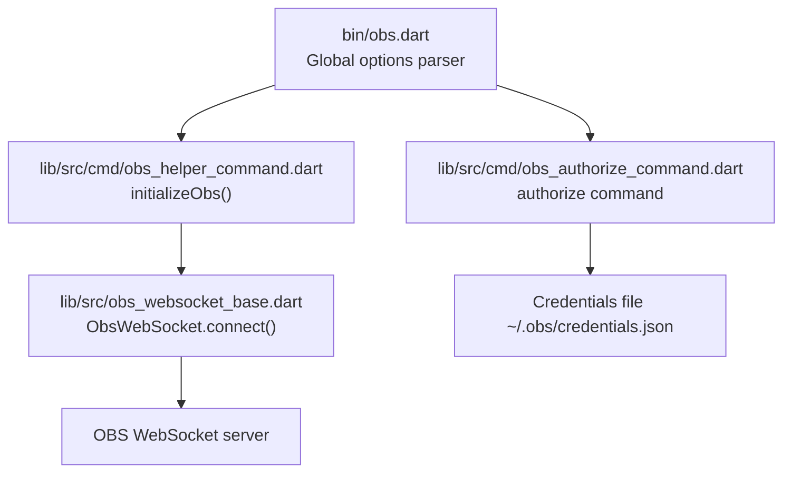
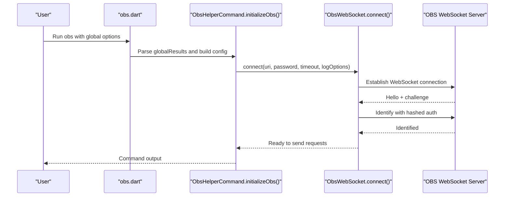
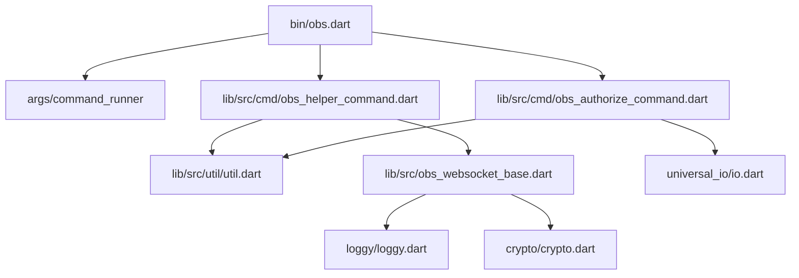

# Global Options and Configuration

<cite>
**Referenced Files in This Document**
- [obs.dart](file://bin/obs.dart)
- [obs_authorize_command.dart](file://lib/src/cmd/obs_authorize_command.dart)
- [obs_helper_command.dart](file://lib/src/cmd/obs_helper_command.dart)
- [util.dart](file://lib/src/util/util.dart)
- [obs_websocket_base.dart](file://lib/src/obs_websocket_base.dart)
- [README.md](file://README.md)
- [config.sample.yaml](file://example/config.sample.yaml)
</cite>

## Table of Contents
1. [Introduction](#introduction)
2. [Project Structure](#project-structure)
3. [Core Components](#core-components)
4. [Architecture Overview](#architecture-overview)
5. [Detailed Component Analysis](#detailed-component-analysis)
6. [Dependency Analysis](#dependency-analysis)
7. [Performance Considerations](#performance-considerations)
8. [Troubleshooting Guide](#troubleshooting-guide)
9. [Conclusion](#conclusion)
10. [Appendices](#appendices)

## Introduction
This document explains the CLI global options and configuration parameters for the OBS Websocket CLI. It covers:
- Global options: --uri for custom WebSocket URLs, --timeout for connection timeouts, --log-level for debugging verbosity, and --passwd for authentication.
- The authorize command for generating authentication files and secure credential management.
- Configuration file examples and environment variable usage.
- Connection parameters, logging levels from debug to off, and troubleshooting connection issues.
- Common configuration scenarios and best practices.

## Project Structure
The CLI is implemented as a command runner with global options and subcommands. Global options are parsed at the top-level and passed down to commands that establish connections to OBS.

**Diagram sources**
- [obs.dart:6-56](file://bin/obs.dart#L6-L56)
- [obs_helper_command.dart:13-42](file://lib/src/cmd/obs_helper_command.dart#L13-L42)
- [obs_websocket_base.dart:130-169](file://lib/src/obs_websocket_base.dart#L130-L169)
- [obs_authorize_command.dart:17-88](file://lib/src/cmd/obs_authorize_command.dart#L17-L88)

**Section sources**
- [obs.dart:6-56](file://bin/obs.dart#L6-L56)
- [README.md:509-536](file://README.md#L509-L536)

## Core Components
- Global options parser: Adds --uri, --timeout, --log-level, and --passwd to the CLI.
- Helper command base: Reads global options and establishes an ObsWebSocket connection.
- Authorize command: Generates a credentials file for authentication.
- Logging utility: Converts log-level strings to structured log options.

Key behaviors:
- --uri accepts ws:// or wss:// URLs; defaults to reading from a credentials file if not provided.
- --timeout sets the connection timeout in seconds; validated to be greater than or equal to 1.
- --log-level supports all, debug, info, warning, error, off; defaults to off.
- --passwd is optional and only required if OBS requires authentication.
- Credentials file stores uri and password for default connection reuse.

**Section sources**
- [obs.dart:8-33](file://bin/obs.dart#L8-L33)
- [obs_helper_command.dart:13-42](file://lib/src/cmd/obs_helper_command.dart#L13-L42)
- [obs_authorize_command.dart:17-88](file://lib/src/cmd/obs_authorize_command.dart#L17-L88)
- [util.dart:8-34](file://lib/src/util/util.dart#L8-L34)

## Architecture Overview
The CLI orchestrates global options parsing, then delegates to subcommands. Subcommands use a shared helper to connect to OBS with the provided or default configuration.

**Diagram sources**
- [obs.dart:6-56](file://bin/obs.dart#L6-L56)
- [obs_helper_command.dart:13-42](file://lib/src/cmd/obs_helper_command.dart#L13-L42)
- [obs_websocket_base.dart:130-169](file://lib/src/obs_websocket_base.dart#L130-L169)

## Detailed Component Analysis

### Global Options Parser
- --uri: Accepts ws:// or wss:// URLs. If omitted, the helper attempts to read credentials from a default file.
- --timeout: Integer seconds; validated to be at least 1.
- --log-level: Allowed values all, debug, info, warning, error, off; defaults to off.
- --passwd: Optional password; only required if OBS requires authentication.

Validation and defaults:
- Timeout validation ensures a minimum value.
- Log level conversion maps string values to structured log options.
- Password is optional and only included when provided.

**Section sources**
- [obs.dart:8-33](file://bin/obs.dart#L8-L33)
- [util.dart:8-34](file://lib/src/util/util.dart#L8-L34)

### Connection Initialization and Configuration
- The helper builds a configuration map from either:
  - Global options (--uri and --passwd), or
  - A credentials file (~/.obs/credentials.json) if --uri is not provided.
- It then connects to OBS with:
  - uri: WebSocket URL
  - password: Optional
  - timeout: Connection timeout derived from --timeout or default
  - logOptions: Converted from --log-level

Logging behavior:
- Log options are initialized before connecting.
- Log levels from debug to off control verbosity.

**Section sources**
- [obs_helper_command.dart:13-42](file://lib/src/cmd/obs_helper_command.dart#L13-L42)
- [util.dart:8-34](file://lib/src/util/util.dart#L8-L34)

### Authorization and Secure Credential Management
- The authorize command:
  - Prompts for URI and password.
  - Writes a JSON file ~/.obs/credentials.json with uri and password.
  - Attempts to set restrictive file permissions on POSIX systems.
- Environment variable usage:
  - The helper reads the user home directory from HOME or USERPROFILE environment variables to locate the credentials file.

Security considerations:
- On POSIX systems, the command tries to set permissions to prevent other users from reading the credentials file.
- On Windows, permission tightening is skipped.

**Section sources**
- [obs_authorize_command.dart:17-88](file://lib/src/cmd/obs_authorize_command.dart#L17-L88)
- [util.dart:36-37](file://lib/src/util/util.dart#L36-L37)

### Logging Levels and Verbosity
- Supported levels: all, debug, info, warning, error, off.
- Default: off.
- Behavior:
  - Higher verbosity levels increase diagnostic output during connection and request processing.
  - The ObsWebSocket constructor initializes logging with the provided log options.

**Section sources**
- [obs.dart:22-27](file://bin/obs.dart#L22-L27)
- [util.dart:8-34](file://lib/src/util/util.dart#L8-L34)
- [obs_websocket_base.dart:137-143](file://lib/src/obs_websocket_base.dart#L137-L143)

### Configuration File Examples
- The repository includes a YAML example for stream configuration, demonstrating how to configure stream settings and keys.
- The CLI’s credentials file is JSON and stores uri and password for default connection reuse.

Note: The YAML example is for stream configuration and not the CLI credentials file.

**Section sources**
- [config.sample.yaml:1-8](file://example/config.sample.yaml#L1-L8)

## Dependency Analysis
The CLI depends on:
- args/command_runner for option parsing and command dispatch.
- obs_websocket library for WebSocket connection and authentication.
- universal_io for file system operations and platform detection.
- crypto and loggy for hashing and logging.

**Diagram sources**
- [obs.dart:1-4](file://bin/obs.dart#L1-L4)
- [obs_helper_command.dart:1-6](file://lib/src/cmd/obs_helper_command.dart#L1-L6)
- [obs_authorize_command.dart:1-5](file://lib/src/cmd/obs_authorize_command.dart#L1-L5)
- [obs_websocket_base.dart:1-10](file://lib/src/obs_websocket_base.dart#L1-L10)

**Section sources**
- [obs.dart:1-4](file://bin/obs.dart#L1-L4)
- [obs_helper_command.dart:1-6](file://lib/src/cmd/obs_helper_command.dart#L1-L6)
- [obs_authorize_command.dart:1-5](file://lib/src/cmd/obs_authorize_command.dart#L1-L5)
- [obs_websocket_base.dart:1-10](file://lib/src/obs_websocket_base.dart#L1-L10)

## Performance Considerations
- Connection timeout: Tune --timeout to balance responsiveness and reliability. Lower values may fail on slow networks; higher values increase wait time on failures.
- Logging verbosity: Use --log-level off for production runs to minimize overhead. Enable debug or info for diagnostics.
- Authentication: Avoid unnecessary re-authentication by using the credentials file and the authorize command.

[No sources needed since this section provides general guidance]

## Troubleshooting Guide
Common issues and resolutions:
- Connection fails immediately:
  - Verify --uri is a valid ws:// or wss:// URL.
  - Confirm OBS is running and the obs-websocket plugin is enabled.
  - Increase --timeout if the network is slow.
- Authentication errors:
  - Ensure --passwd matches the OBS password if authentication is enabled.
  - Use the authorize command to generate a credentials file with correct uri and password.
- Permission errors on credentials file:
  - On POSIX systems, the authorize command attempts to set restrictive permissions. If chmod fails, check system permissions and retry.
- Excessive logging:
  - Set --log-level to off for minimal output, or reduce verbosity to info for essential logs.

**Section sources**
- [obs_authorize_command.dart:68-85](file://lib/src/cmd/obs_authorize_command.dart#L68-L85)
- [obs_websocket_base.dart:260-318](file://lib/src/obs_websocket_base.dart#L260-L318)

## Conclusion
The CLI provides straightforward global options for connecting to OBS via WebSocket, with robust support for authentication and logging. The authorize command simplifies secure credential management, while the helper command centralizes connection logic across subcommands. Properly configuring --uri, --timeout, --log-level, and --passwd enables reliable automation and debugging.

[No sources needed since this section summarizes without analyzing specific files]

## Appendices

### Option Reference
- --uri: Custom WebSocket URL (ws:// or wss://). Defaults to reading from ~/.obs/credentials.json if not provided.
- --timeout: Connection timeout in seconds (minimum 1).
- --log-level: Logging verbosity level (all, debug, info, warning, error, off).
- --passwd: OBS WebSocket password (optional; required if OBS requires authentication).

**Section sources**
- [obs.dart:8-33](file://bin/obs.dart#L8-L33)
- [README.md:516-521](file://README.md#L516-L521)

### Configuration Scenarios and Best Practices
- Default connection reuse:
  - Run obs authorize to generate ~/.obs/credentials.json with uri and password.
  - Omit --uri and --passwd in subsequent commands to use the credentials file.
- Debugging:
  - Use --log-level debug or info to capture handshake and request details.
  - Reduce verbosity to warning or error for production scripts.
- Security:
  - On POSIX systems, rely on the authorize command’s permission tightening.
  - Store credentials only on trusted machines and restrict file access.

**Section sources**
- [obs_authorize_command.dart:17-88](file://lib/src/cmd/obs_authorize_command.dart#L17-L88)
- [util.dart:36-37](file://lib/src/util/util.dart#L36-L37)