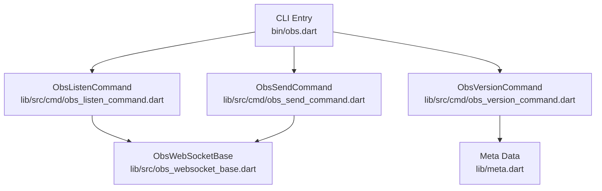
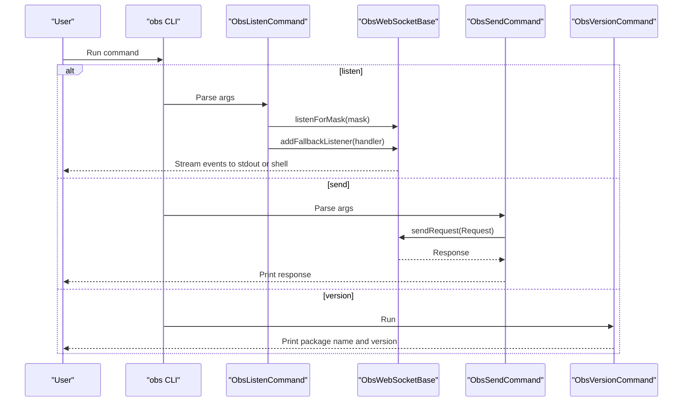
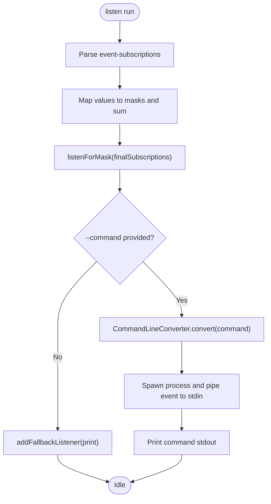
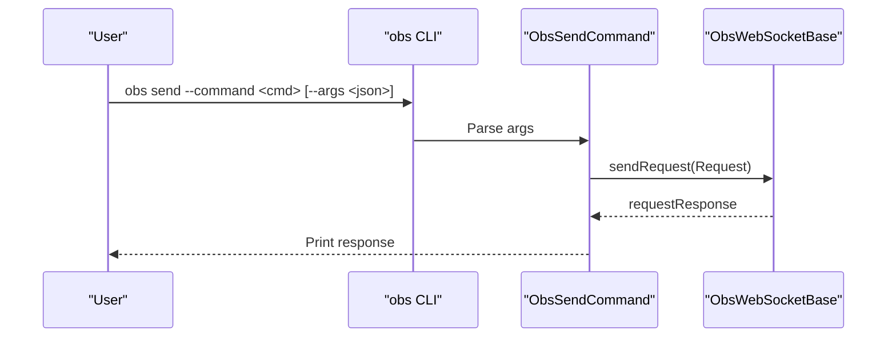
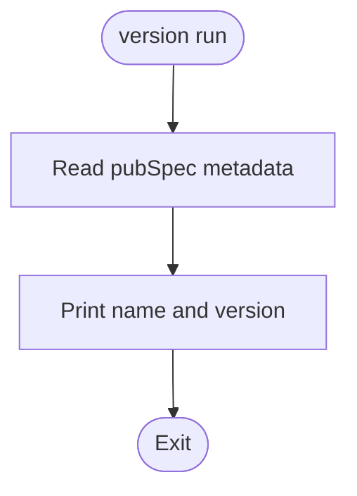
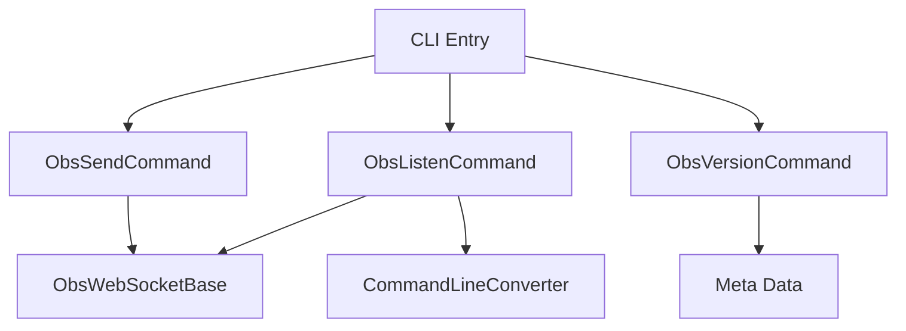

# Specialized Commands

<cite>
**Referenced Files in This Document**
- [obs.dart](file://bin/obs.dart)
- [obs_listen_command.dart](file://lib/src/cmd/obs_listen_command.dart)
- [obs_send_command.dart](file://lib/src/cmd/obs_send_command.dart)
- [obs_version_command.dart](file://lib/src/cmd/obs_version_command.dart)
- [command.dart](file://lib/command.dart)
- [obs_websocket_base.dart](file://lib/src/obs_websocket_base.dart)
- [command_line_converter.dart](file://lib/src/util/command_line_converter.dart)
- [README.md](file://README.md)
- [bin/README.md](file://bin/README.md)
- [meta.dart](file://lib/meta.dart)
</cite>

## Table of Contents
1. [Introduction](#introduction)
2. [Project Structure](#project-structure)
3. [Core Components](#core-components)
4. [Architecture Overview](#architecture-overview)
5. [Detailed Component Analysis](#detailed-component-analysis)
6. [Dependency Analysis](#dependency-analysis)
7. [Performance Considerations](#performance-considerations)
8. [Troubleshooting Guide](#troubleshooting-guide)
9. [Conclusion](#conclusion)

## Introduction
This document focuses on three specialized CLI commands that extend beyond standard request categories: listen, send, and version. These commands enable real-time event monitoring and subscription management, arbitrary request execution for protocol testing, and version information retrieval for compatibility checks. The documentation explains event subscription patterns, custom request formatting, advanced debugging techniques, and provides practical examples for power users and automation scenarios.

## Project Structure
The CLI entry point registers the specialized commands alongside standard request categories. The listen command manages event subscriptions and optional shell command execution per event. The send command executes low-level requests with JSON argument payloads. The version command prints package metadata.

**Diagram sources**
- [obs.dart:6-51](file://bin/obs.dart#L6-L51)
- [obs_listen_command.dart:10-125](file://lib/src/cmd/obs_listen_command.dart#L10-L125)
- [obs_send_command.dart:5-45](file://lib/src/cmd/obs_send_command.dart#L5-L45)
- [obs_version_command.dart:5-16](file://lib/src/cmd/obs_version_command.dart#L5-L16)
- [obs_websocket_base.dart:337-372](file://lib/src/obs_websocket_base.dart#L337-L372)
- [meta.dart:8-10](file://lib/meta.dart#L8-L10)

**Section sources**
- [obs.dart:6-51](file://bin/obs.dart#L6-L51)
- [command.dart:6-20](file://lib/command.dart#L6-L20)

## Core Components
- Listen command: Subscribes to OBS events by combining subscription masks, optionally executes a shell command for each event, and prints event data to stdout.
- Send command: Executes low-level requests against OBS with a command name and optional JSON arguments, printing the response.
- Version command: Prints the package name and version derived from metadata.

Key behaviors:
- Event subscription parsing supports comma-separated values and aggregates masks.
- Shell command execution uses a command-line converter to split quoted arguments safely.
- Low-level request execution uses a request wrapper with optional JSON payload.

**Section sources**
- [obs_listen_command.dart:10-125](file://lib/src/cmd/obs_listen_command.dart#L10-L125)
- [obs_send_command.dart:5-45](file://lib/src/cmd/obs_send_command.dart#L5-L45)
- [obs_version_command.dart:5-16](file://lib/src/cmd/obs_version_command.dart#L5-L16)
- [command_line_converter.dart:3-66](file://lib/src/util/command_line_converter.dart#L3-L66)

## Architecture Overview
The specialized commands integrate with the WebSocket base to manage subscriptions and request/response flows. The listen command sets up event subscriptions and attaches a fallback listener. The send command constructs a request and awaits a response. The version command reads metadata and prints it.

**Diagram sources**
- [obs_listen_command.dart:86-124](file://lib/src/cmd/obs_listen_command.dart#L86-L124)
- [obs_send_command.dart:32-44](file://lib/src/cmd/obs_send_command.dart#L32-L44)
- [obs_version_command.dart:13-15](file://lib/src/cmd/obs_version_command.dart#L13-L15)
- [obs_websocket_base.dart:337-372](file://lib/src/obs_websocket_base.dart#L337-L372)

## Detailed Component Analysis

### Listen Command: Real-Time Event Monitoring and Subscription Management
The listen command enables real-time monitoring of OBS events with flexible subscription patterns and optional per-event automation.

- Subscription management:
  - Parses comma-separated subscription values and maps them to internal masks.
  - Aggregates masks using bitwise addition to produce a final subscription mask.
  - Applies the mask via a dedicated method to update event subscriptions.

- Per-event automation:
  - Optional command execution per event using a shell command template.
  - Safely parses quoted arguments using a command-line converter.
  - Pipes event data to the command's stdin and prints the command's stdout.

- Event output:
  - Prints raw event data to stdout when no command is provided.
  - Integrates with external monitoring systems by chaining with standard Unix tools.

**Diagram sources**
- [obs_listen_command.dart:86-124](file://lib/src/cmd/obs_listen_command.dart#L86-L124)
- [command_line_converter.dart:5-65](file://lib/src/util/command_line_converter.dart#L5-L65)
- [obs_websocket_base.dart:337-346](file://lib/src/obs_websocket_base.dart#L337-L346)

Practical usage patterns:
- Filter by category: Combine categories like general, scenes, inputs, outputs, ui, and vendors.
- Reduce noise: Use none to disable all events, or all for non-high-volume events.
- High-volume events: Explicitly subscribe to inputVolumeMeters, inputActiveStateChanged, inputShowStateChanged, and sceneItemTransformChanged.
- Automation: Pipe events to jq for filtering, or to a script for triggering actions.

**Section sources**
- [obs_listen_command.dart:10-125](file://lib/src/cmd/obs_listen_command.dart#L10-L125)
- [obs_websocket_base.dart:337-372](file://lib/src/obs_websocket_base.dart#L337-L372)
- [bin/README.md:443-475](file://bin/README.md#L443-L475)

### Send Command: Arbitrary Request Execution and Protocol Testing
The send command provides low-level access to OBS requests for testing and advanced scenarios.

- Request construction:
  - Requires a command name and accepts optional JSON arguments.
  - Builds a request object and sends it to OBS.
  - Prints the response if available.

- Use cases:
  - Protocol exploration: Test undocumented or experimental requests.
  - Parameterized testing: Iterate over different argument sets.
  - Integration verification: Confirm server behavior under various conditions.

**Diagram sources**
- [obs_send_command.dart:32-44](file://lib/src/cmd/obs_send_command.dart#L32-L44)

Best practices:
- Validate JSON payloads with a linter or formatter before sending.
- Use jq to extract specific fields from responses for scripting.
- Close connections when finished to avoid resource leaks.

**Section sources**
- [obs_send_command.dart:5-45](file://lib/src/cmd/obs_send_command.dart#L5-L45)
- [bin/README.md:597-611](file://bin/README.md#L597-L611)

### Version Command: Version Information and Compatibility Checking
The version command reports the package name and version, enabling compatibility checks and automated diagnostics.

- Metadata source: Reads package metadata embedded at build time.
- Output format: Prints a concise identifier suitable for scripts and logs.

**Diagram sources**
- [obs_version_command.dart:13-15](file://lib/src/cmd/obs_version_command.dart#L13-L15)
- [meta.dart:8-10](file://lib/meta.dart#L8-L10)

**Section sources**
- [obs_version_command.dart:5-16](file://lib/src/cmd/obs_version_command.dart#L5-L16)
- [meta.dart:8-10](file://lib/meta.dart#L8-L10)

## Dependency Analysis
The specialized commands depend on shared WebSocket infrastructure and utilities. The listen command integrates with subscription management and fallback listeners. The send command relies on request construction and response handling. The version command depends on metadata.

**Diagram sources**
- [obs_listen_command.dart:10-125](file://lib/src/cmd/obs_listen_command.dart#L10-L125)
- [obs_send_command.dart:5-45](file://lib/src/cmd/obs_send_command.dart#L5-L45)
- [obs_version_command.dart:5-16](file://lib/src/cmd/obs_version_command.dart#L5-L16)
- [obs_websocket_base.dart:337-372](file://lib/src/obs_websocket_base.dart#L337-L372)
- [command_line_converter.dart:3-66](file://lib/src/util/command_line_converter.dart#L3-L66)
- [obs.dart:6-51](file://bin/obs.dart#L6-L51)

**Section sources**
- [obs.dart:6-51](file://bin/obs.dart#L6-L51)
- [obs_websocket_base.dart:337-372](file://lib/src/obs_websocket_base.dart#L337-L372)

## Performance Considerations
- Event subscription granularity: Prefer specific subscriptions to reduce bandwidth and CPU overhead. Use all for convenience, but narrow subscriptions for production monitoring.
- High-volume events: inputVolumeMeters and sceneItemTransformChanged generate frequent updates; subscribe only when necessary.
- Shell command execution: Executing external processes per event adds latency. Keep commands lightweight and avoid heavy I/O.
- Request batching: For high-frequency operations, consider helper methods that wrap batched requests where available.

## Troubleshooting Guide
Common issues and resolutions:
- Authentication failures: Ensure the WebSocket password matches OBS settings and is provided via the global option when required.
- Subscription mismatches: Verify subscription names match supported categories and high-volume event flags.
- Command quoting: Unbalanced quotes cause parsing errors. Use consistent quoting and escape special characters as needed.
- JSON argument formatting: Invalid JSON prevents request execution. Validate payloads with a JSON validator before sending.
- Connection lifecycle: Always close connections after use to prevent resource leaks.

**Section sources**
- [obs_listen_command.dart:10-125](file://lib/src/cmd/obs_listen_command.dart#L10-L125)
- [obs_send_command.dart:5-45](file://lib/src/cmd/obs_send_command.dart#L5-L45)
- [README.md:87-93](file://README.md#L87-L93)

## Conclusion
The listen, send, and version commands provide powerful capabilities for real-time monitoring, protocol testing, and compatibility verification. By leveraging flexible event subscriptions, custom request construction, and robust debugging techniques, power users and automation systems can integrate seamlessly with OBS through the command line.