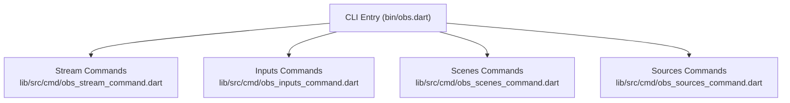
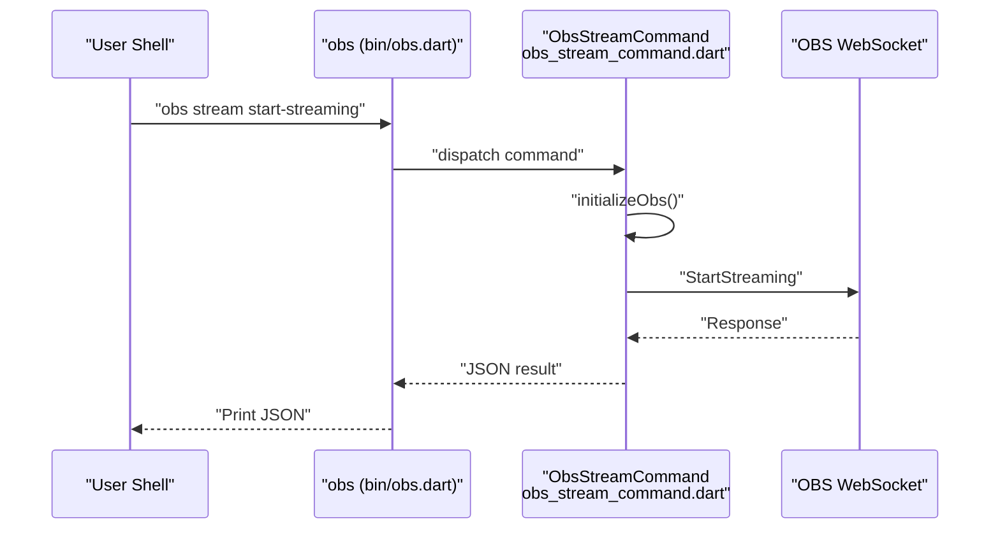
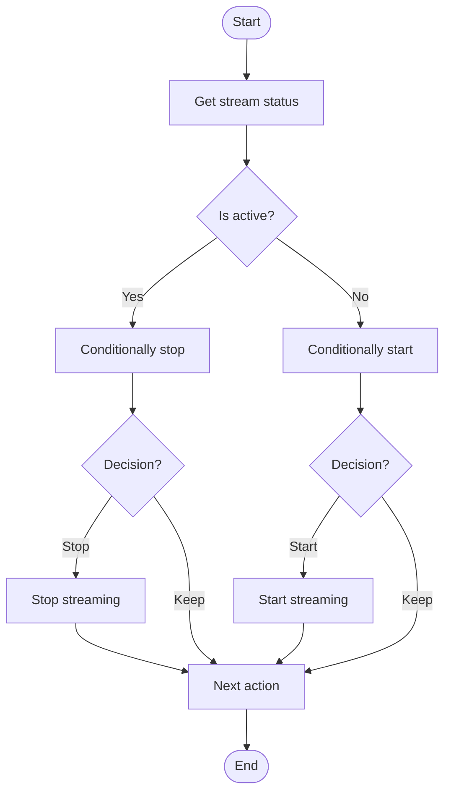
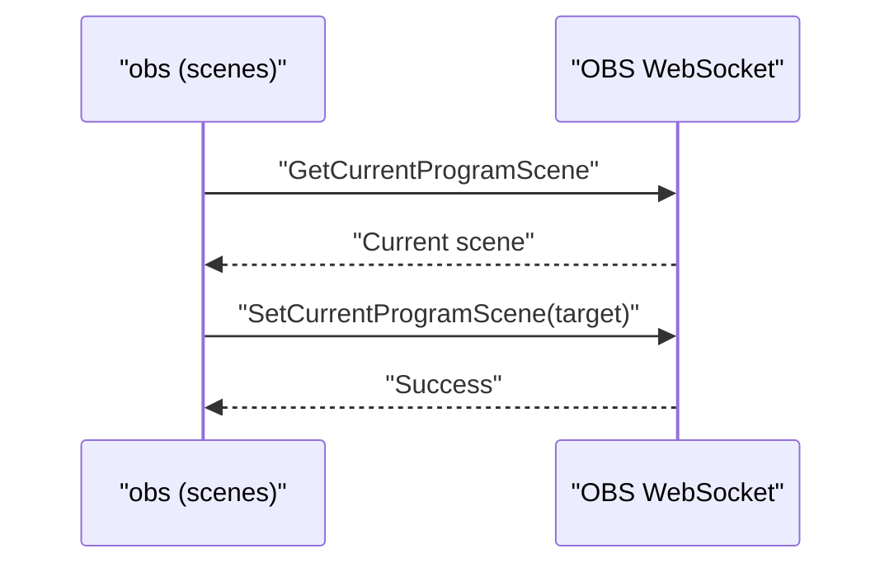
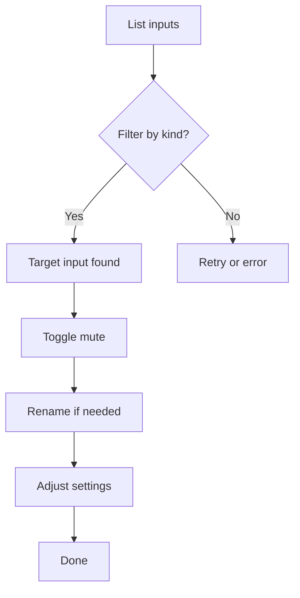
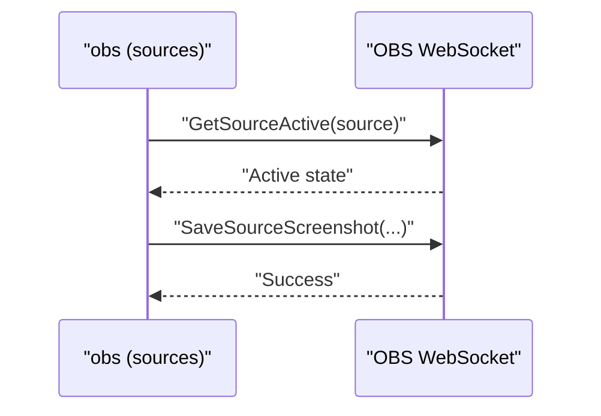
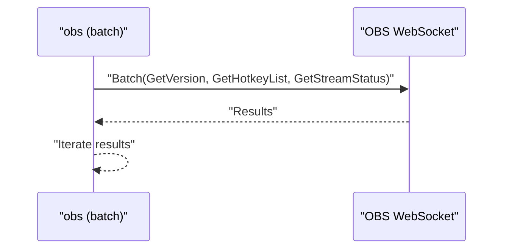
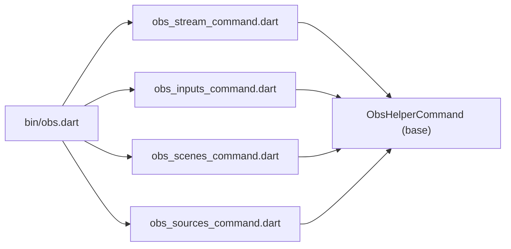

# Usage Examples and Automation

<cite>
**Referenced Files in This Document**
- [obs.dart](file://bin/obs.dart)
- [README.md](file://bin/README.md)
- [obs_stream_command.dart](file://lib/src/cmd/obs_stream_command.dart)
- [obs_inputs_command.dart](file://lib/src/cmd/obs_inputs_command.dart)
- [obs_scenes_command.dart](file://lib/src/cmd/obs_scenes_command.dart)
- [obs_sources_command.dart](file://lib/src/cmd/obs_sources_command.dart)
- [batch.dart](file://example/batch.dart)
- [general.dart](file://example/general.dart)
- [show_scene_item.dart](file://example/show_scene_item.dart)
- [volume.dart](file://example/volume.dart)
</cite>

## Table of Contents
1. [Introduction](#introduction)
2. [Project Structure](#project-structure)
3. [Core Components](#core-components)
4. [Architecture Overview](#architecture-overview)
5. [Detailed Component Analysis](#detailed-component-analysis)
6. [Dependency Analysis](#dependency-analysis)
7. [Performance Considerations](#performance-considerations)
8. [Troubleshooting Guide](#troubleshooting-guide)
9. [Conclusion](#conclusion)
10. [Appendices](#appendices)

## Introduction
This document provides practical usage examples and automation guides for the CLI that controls OBS via obs-websocket. It focuses on stream management, recording control, scene switching, and media playback automation. You will find common command combinations, scripting patterns, batch operation strategies, and integration tips for CI/CD pipelines. Guidance is also included for robust error handling, retry mechanisms, logging, and performance considerations tailored to automated workflows.

## Project Structure
The CLI entrypoint defines global options and registers commands for stream, inputs, scenes, sources, and more. The README documents available commands and their usage. Example programs demonstrate advanced patterns like event listening, batch requests, and scene item manipulation.

**Diagram sources**
- [obs.dart:6-52](file://bin/obs.dart#L6-L52)
- [obs_stream_command.dart:5-18](file://lib/src/cmd/obs_stream_command.dart#L5-L18)
- [obs_inputs_command.dart:8-28](file://lib/src/cmd/obs_inputs_command.dart#L8-L28)
- [obs_scenes_command.dart:5-16](file://lib/src/cmd/obs_scenes_command.dart#L5-L16)
- [obs_sources_command.dart:6-17](file://lib/src/cmd/obs_sources_command.dart#L6-L17)

**Section sources**
- [obs.dart:6-52](file://bin/obs.dart#L6-L52)
- [README.md:88-108](file://bin/README.md#L88-L108)

## Core Components
- Global CLI options:
  - URI: WebSocket endpoint for OBS.
  - Timeout: Connection timeout in seconds.
  - Log level: Control verbosity.
  - Password: Authentication for OBS websocket.
- Commands:
  - stream: get-stream-status, start-streaming, stop-streaming, toggle-stream, send-stream-caption.
  - inputs: list, mute/unmute/toggle, rename, create/remove, get/set settings.
  - scenes: list, groups, current program scene.
  - sources: active state, screenshot (base64), save screenshot.
  - listen: subscribe to OBS events.
  - send: low-level request passthrough.

These components enable robust automation across streaming, audio/video sources, scenes, and UI state.

**Section sources**
- [obs.dart:11-36](file://bin/obs.dart#L11-L36)
- [README.md:163-800](file://bin/README.md#L163-L800)

## Architecture Overview
The CLI composes a command runner and delegates to command classes that initialize a connection to OBS, execute requests, and print JSON responses. Many commands rely on helper base classes to manage connection lifecycle and request execution.

**Diagram sources**
- [obs.dart:6-52](file://bin/obs.dart#L6-L52)
- [obs_stream_command.dart:59-74](file://lib/src/cmd/obs_stream_command.dart#L59-L74)

## Detailed Component Analysis

### Stream Management Automation
Common tasks:
- Check streaming status and conditionally start/stop.
- Toggle streaming based on external conditions.
- Send captions for accessibility.

Recommended patterns:
- Use jq to parse JSON outputs for conditional logic.
- Chain commands with shell control structures.
- Add retries with exponential backoff for transient failures.

**Diagram sources**
- [obs_stream_command.dart:21-38](file://lib/src/cmd/obs_stream_command.dart#L21-L38)
- [obs_stream_command.dart:59-74](file://lib/src/cmd/obs_stream_command.dart#L59-L74)
- [obs_stream_command.dart:77-92](file://lib/src/cmd/obs_stream_command.dart#L77-L92)

**Section sources**
- [obs_stream_command.dart:21-121](file://lib/src/cmd/obs_stream_command.dart#L21-L121)
- [README.md:675-760](file://bin/README.md#L675-L760)

### Recording Control Automation
While recording-specific commands are not registered in the CLI entrypoint, you can still integrate recording actions using the low-level send command. Typical patterns include:
- Pre-flight checks: verify streaming status and storage availability.
- Batch recording toggles: combine multiple recording-related requests.
- Post-recording cleanup: update metadata or trigger downstream steps.

Best practices:
- Use the send command with JSON arguments for recording requests.
- Wrap operations in try/catch blocks and log errors.
- Validate responses before proceeding to next steps.

**Section sources**
- [obs.dart:46-46](file://bin/obs.dart#L46-L46)
- [README.md:597-611](file://bin/README.md#L597-L611)

### Scene Switching Automation
Automate scene changes based on events or schedules:
- Retrieve current program scene.
- Switch to target scene.
- Verify change via event handlers or polling.

**Diagram sources**
- [obs_scenes_command.dart:57-74](file://lib/src/cmd/obs_scenes_command.dart#L57-L74)

**Section sources**
- [obs_scenes_command.dart:19-74](file://lib/src/cmd/obs_scenes_command.dart#L19-L74)
- [README.md:540-595](file://bin/README.md#L540-L595)

### Media Playback Automation
Control media inputs (e.g., “Media” sources):
- List inputs and filter by kind.
- Mute/unmute media inputs.
- Rename inputs for consistent targeting.
- Set input settings (e.g., looping, channel).

**Diagram sources**
- [obs_inputs_command.dart:31-54](file://lib/src/cmd/obs_inputs_command.dart#L31-L54)
- [obs_inputs_command.dart:399-444](file://lib/src/cmd/obs_inputs_command.dart#L399-L444)
- [obs_inputs_command.dart:447-490](file://lib/src/cmd/obs_inputs_command.dart#L447-L490)

**Section sources**
- [obs_inputs_command.dart:31-491](file://lib/src/cmd/obs_inputs_command.dart#L31-L491)
- [README.md:321-442](file://bin/README.md#L321-L442)

### Screenshot and Source State Automation
Capture screenshots or check source activity for monitoring:
- Save screenshots to disk for post-production or QA.
- Monitor source active state to trigger downstream actions.

**Diagram sources**
- [obs_sources_command.dart:20-48](file://lib/src/cmd/obs_sources_command.dart#L20-L48)
- [obs_sources_command.dart:95-142](file://lib/src/cmd/obs_sources_command.dart#L95-L142)

**Section sources**
- [obs_sources_command.dart:20-142](file://lib/src/cmd/obs_sources_command.dart#L20-L142)
- [README.md:612-674](file://bin/README.md#L612-L674)

### Batch Operations and Event-Driven Workflows
- Batch requests reduce round-trips for multiple queries.
- Subscribe to events to react to state changes (e.g., scene switches, volume changes).

**Diagram sources**
- [batch.dart:17-28](file://example/batch.dart#L17-L28)

**Section sources**
- [batch.dart:1-29](file://example/batch.dart#L1-L29)
- [README.md:443-475](file://bin/README.md#L443-L475)

## Dependency Analysis
The CLI depends on command classes that encapsulate request logic. These commands rely on a shared helper base to initialize connections and handle responses.

**Diagram sources**
- [obs.dart:6-52](file://bin/obs.dart#L6-L52)
- [obs_stream_command.dart:1-18](file://lib/src/cmd/obs_stream_command.dart#L1-L18)
- [obs_inputs_command.dart:1-28](file://lib/src/cmd/obs_inputs_command.dart#L1-L28)
- [obs_scenes_command.dart:1-16](file://lib/src/cmd/obs_scenes_command.dart#L1-L16)
- [obs_sources_command.dart:1-17](file://lib/src/cmd/obs_sources_command.dart#L1-L17)

**Section sources**
- [obs.dart:6-52](file://bin/obs.dart#L6-L52)

## Performance Considerations
- Minimize round-trips:
  - Use batch requests for multiple related queries.
  - Combine related operations in a single script to reduce reconnect overhead.
- Reduce event noise:
  - Subscribe only to required event categories.
  - Avoid high-volume events unless necessary.
- Efficient parsing:
  - Pipe outputs through jq to extract fields quickly.
- Connection reuse:
  - Keep a single connection alive for sequential operations when feasible.
- Backoff strategies:
  - Implement exponential backoff for transient failures (e.g., network hiccups).

[No sources needed since this section provides general guidance]

## Troubleshooting Guide
- Authentication:
  - Ensure the authentication file is present and credentials match OBS settings.
  - Use the authorize command to regenerate credentials when needed.
- Connection issues:
  - Increase timeout for slow networks.
  - Verify URI and password.
- Parsing JSON:
  - Use jq to extract fields and avoid brittle string parsing.
- Logging:
  - Adjust log-level to debug for diagnostics; revert to off for production scripts.
- Error handling in scripts:
  - Capture exit codes and inspect stderr.
  - Implement retry loops with bounded attempts and delays.
- Idempotent operations:
  - Check current state before applying changes to avoid redundant work.

**Section sources**
- [obs.dart:53-59](file://bin/obs.dart#L53-L59)
- [README.md:165-183](file://bin/README.md#L165-L183)

## Conclusion
The CLI offers a comprehensive toolkit for automating OBS workflows. By combining commands, leveraging batch operations, subscribing to events, and adopting robust scripting practices, you can build reliable automation for streaming, media playback, scene management, and monitoring. Apply the patterns and best practices outlined here to achieve predictable, maintainable automation.

[No sources needed since this section summarizes without analyzing specific files]

## Appendices

### Practical Scripting Patterns
- Conditional stream control:
  - Check status, decide to start or stop, and log outcome.
- Media input orchestration:
  - List inputs, mute/unmute targets, and adjust settings.
- Scene automation:
  - Read current scene, switch to target, and confirm via event or status.
- Screenshot-based monitoring:
  - Capture screenshots and compare against baselines.

[No sources needed since this section provides general guidance]

### CI/CD Integration Tips
- Install the CLI globally or via package manager in CI environments.
- Store OBS credentials securely (e.g., secrets) and pass via environment variables or configuration files.
- Run preflight checks (version, stream status) before critical steps.
- Use artifacts to capture screenshots or logs after runs.

[No sources needed since this section provides general guidance]