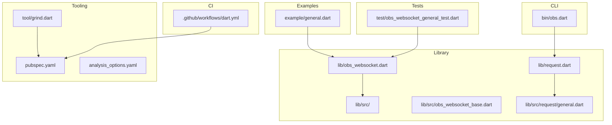
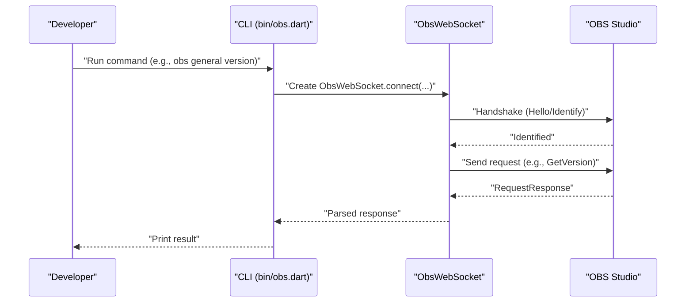
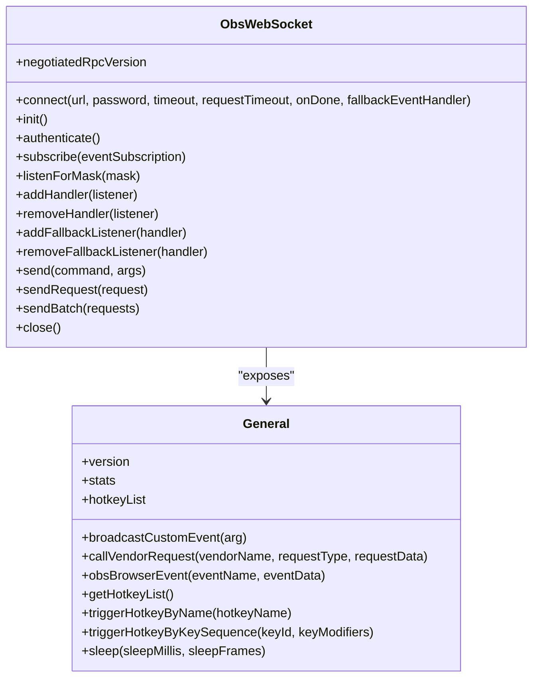
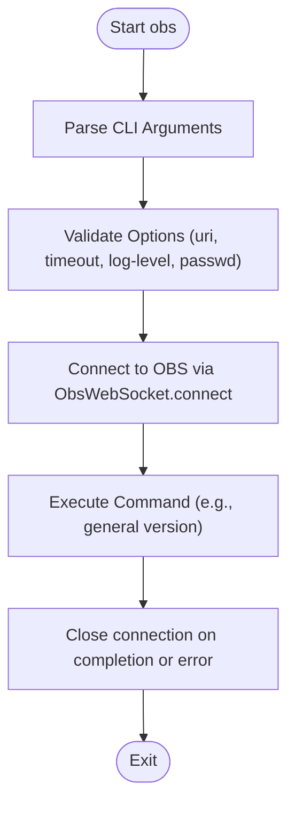
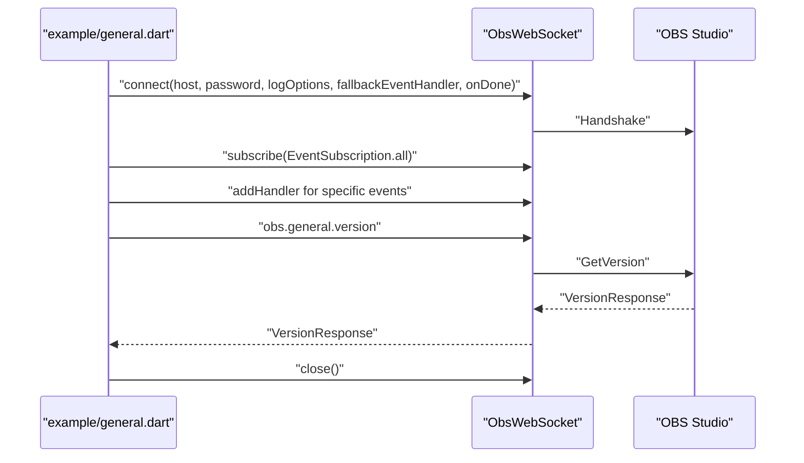
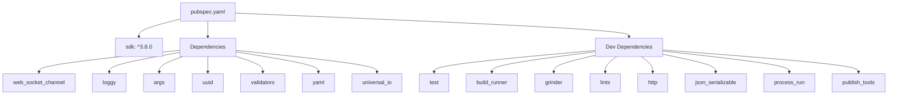
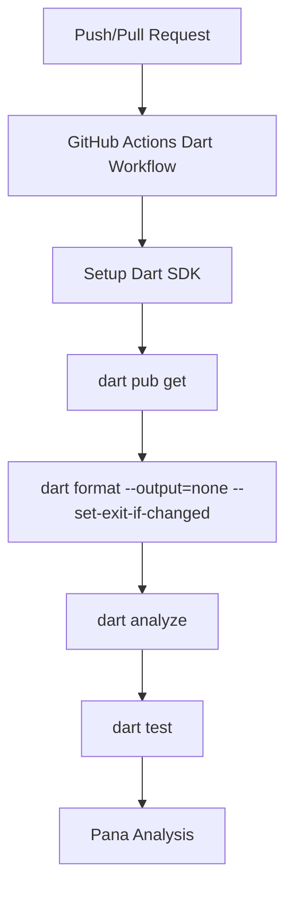
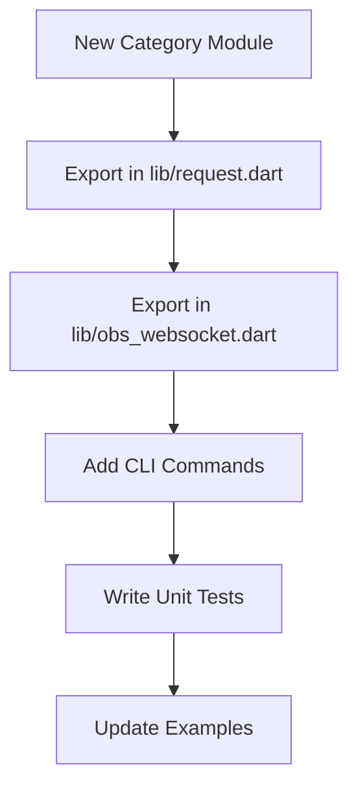

# Contributing and Development

<cite>
**Referenced Files in This Document**
- [README.md](file://README.md)
- [CODE_OF_CONDUCT.md](file://CODE_OF_CONDUCT.md)
- [analysis_options.yaml](file://analysis_options.yaml)
- [pubspec.yaml](file://pubspec.yaml)
- [tool/grind.dart](file://tool/grind.dart)
- [.github/workflows/dart.yml](file://.github/workflows/dart.yml)
- [lib/obs_websocket.dart](file://lib/obs_websocket.dart)
- [lib/request.dart](file://lib/request.dart)
- [lib/src/obs_websocket_base.dart](file://lib/src/obs_websocket_base.dart)
- [lib/src/request/general.dart](file://lib/src/request/general.dart)
- [lib/src/util/validate.dart](file://lib/src/util/validate.dart)
- [bin/obs.dart](file://bin/obs.dart)
- [example/general.dart](file://example/general.dart)
- [test/obs_websocket_general_test.dart](file://test/obs_websocket_general_test.dart)
- [CHANGELOG.md](file://CHANGELOG.md)
</cite>

## Table of Contents
1. [Introduction](#introduction)
2. [Project Structure](#project-structure)
3. [Core Components](#core-components)
4. [Architecture Overview](#architecture-overview)
5. [Detailed Component Analysis](#detailed-component-analysis)
6. [Dependency Analysis](#dependency-analysis)
7. [Performance Considerations](#performance-considerations)
8. [Troubleshooting Guide](#troubleshooting-guide)
9. [Contribution Workflow](#contribution-workflow)
10. [Testing Requirements](#testing-requirements)
11. [Build System and CI](#build-system-and-ci)
12. [Code Style and Quality Standards](#code-style-and-quality-standards)
13. [Adding New Request Categories](#adding-new-request-categories)
14. [Extending the CLI Interface](#extending-the-cli-interface)
15. [Documentation Standards](#documentation-standards)
16. [Release Procedures](#release-procedures)
17. [Governance and Community Guidelines](#governance-and-community-guidelines)
18. [Conclusion](#conclusion)

## Introduction
This document provides comprehensive guidance for contributors working on the obs-websocket Dart package. It covers development environment setup, code style and quality standards, contribution workflow, project structure, testing requirements, build system, continuous integration, pull request and code review processes, quality assurance, adding new request categories, extending the CLI, documentation standards, release procedures, and governance/community guidelines. The goal is to make contributions accessible while maintaining high code quality and consistency with the project's architecture and protocols.

## Project Structure
The repository follows a conventional Dart package layout with clear separation of concerns:
- Library exports and entry points in lib/
- Feature-based request modules under lib/src/request/
- Core WebSocket client implementation in lib/src/obs_websocket_base.dart
- CLI entry point in bin/obs.dart
- Examples in example/
- Tests in test/
- Tooling and automation in tool/
- Continuous integration in .github/workflows/

**Diagram sources**
- [lib/obs_websocket.dart:1-69](file://lib/obs_websocket.dart#L1-L69)
- [lib/request.dart:1-19](file://lib/request.dart#L1-L19)
- [lib/src/obs_websocket_base.dart:1-515](file://lib/src/obs_websocket_base.dart#L1-L515)
- [lib/src/request/general.dart:1-143](file://lib/src/request/general.dart#L1-L143)
- [bin/obs.dart:1-57](file://bin/obs.dart#L1-L57)
- [example/general.dart:1-152](file://example/general.dart#L1-L152)
- [test/obs_websocket_general_test.dart:1-98](file://test/obs_websocket_general_test.dart#L1-L98)
- [tool/grind.dart:1-22](file://tool/grind.dart#L1-L22)
- [pubspec.yaml:1-38](file://pubspec.yaml#L1-L38)
- [analysis_options.yaml:1-24](file://analysis_options.yaml#L1-L24)
- [.github/workflows/dart.yml:1-46](file://.github/workflows/dart.yml#L1-L46)

**Section sources**
- [lib/obs_websocket.dart:1-69](file://lib/obs_websocket.dart#L1-L69)
- [lib/request.dart:1-19](file://lib/request.dart#L1-L19)
- [bin/obs.dart:1-57](file://bin/obs.dart#L1-L57)
- [example/general.dart:1-152](file://example/general.dart#L1-L152)
- [test/obs_websocket_general_test.dart:1-98](file://test/obs_websocket_general_test.dart#L1-L98)
- [tool/grind.dart:1-22](file://tool/grind.dart#L1-L22)
- [pubspec.yaml:1-38](file://pubspec.yaml#L1-L38)
- [analysis_options.yaml:1-24](file://analysis_options.yaml#L1-L24)
- [.github/workflows/dart.yml:1-46](file://.github/workflows/dart.yml#L1-L46)

## Core Components
Key components and their responsibilities:
- ObsWebSocket: Central client managing WebSocket connection, authentication, request/response handling, event subscriptions, and logging.
- Request modules: Feature-specific request classes (General, Config, Inputs, Scenes, SceneItems, Sources, Filters, Transitions, Outputs, Record, Stream, MediaInputs, Ui) that encapsulate protocol commands.
- CLI: Command-line interface exposing high-level commands for interacting with OBS via obs-websocket.
- Examples: Practical usage demonstrations for common scenarios.
- Tests: Unit tests validating response decoding and basic functionality.

**Section sources**
- [lib/src/obs_websocket_base.dart:21-105](file://lib/src/obs_websocket_base.dart#L21-L105)
- [lib/src/request/general.dart:1-143](file://lib/src/request/general.dart#L1-L143)
- [bin/obs.dart:1-57](file://bin/obs.dart#L1-L57)
- [example/general.dart:1-152](file://example/general.dart#L1-L152)
- [test/obs_websocket_general_test.dart:1-98](file://test/obs_websocket_general_test.dart#L1-L98)

## Architecture Overview
The system architecture centers on a typed WebSocket client that speaks the obs-websocket protocol. Clients can use high-level helper methods or send low-level requests. Events are decoded and dispatched to typed handlers or a fallback handler. The CLI provides convenient command categories mirroring the request modules.

**Diagram sources**
- [bin/obs.dart:1-57](file://bin/obs.dart#L1-L57)
- [lib/src/obs_websocket_base.dart:130-169](file://lib/src/obs_websocket_base.dart#L130-L169)
- [lib/src/request/general.dart:21-25](file://lib/src/request/general.dart#L21-L25)

**Section sources**
- [lib/src/obs_websocket_base.dart:130-169](file://lib/src/obs_websocket_base.dart#L130-L169)
- [lib/src/request/general.dart:1-143](file://lib/src/request/general.dart#L1-L143)
- [bin/obs.dart:1-57](file://bin/obs.dart#L1-L57)

## Detailed Component Analysis

### ObsWebSocket Core
ObsWebSocket manages:
- Connection lifecycle and authentication
- Request/response routing and timeouts
- Event subscription and dispatch
- Logging via loggy
- Batch request support

**Diagram sources**
- [lib/src/obs_websocket_base.dart:21-105](file://lib/src/obs_websocket_base.dart#L21-L105)
- [lib/src/request/general.dart:1-143](file://lib/src/request/general.dart#L1-L143)

**Section sources**
- [lib/src/obs_websocket_base.dart:21-515](file://lib/src/obs_websocket_base.dart#L21-L515)
- [lib/src/request/general.dart:1-143](file://lib/src/request/general.dart#L1-L143)

### CLI Command Flow
The CLI parses arguments, validates them, and executes corresponding commands against the ObsWebSocket client.

**Diagram sources**
- [bin/obs.dart:6-56](file://bin/obs.dart#L6-L56)
- [lib/src/util/validate.dart:1-19](file://lib/src/util/validate.dart#L1-L19)
- [lib/src/obs_websocket_base.dart:130-169](file://lib/src/obs_websocket_base.dart#L130-L169)

**Section sources**
- [bin/obs.dart:1-57](file://bin/obs.dart#L1-L57)
- [lib/src/util/validate.dart:1-19](file://lib/src/util/validate.dart#L1-L19)

### Example Usage Pattern
The example demonstrates connecting, subscribing to events, and invoking helper methods.

**Diagram sources**
- [example/general.dart:7-17](file://example/general.dart#L7-L17)
- [example/general.dart:19-42](file://example/general.dart#L19-L42)
- [example/general.dart:72-74](file://example/general.dart#L72-L74)
- [lib/src/obs_websocket_base.dart:130-169](file://lib/src/obs_websocket_base.dart#L130-L169)
- [lib/src/request/general.dart:14-25](file://lib/src/request/general.dart#L14-L25)

**Section sources**
- [example/general.dart:1-152](file://example/general.dart#L1-L152)
- [lib/src/request/general.dart:1-143](file://lib/src/request/general.dart#L1-L143)

## Dependency Analysis
The project relies on Dart SDK 3.8+ and several packages for networking, logging, validation, and CLI parsing. Dev dependencies include testing, code generation, and publishing automation.

**Diagram sources**
- [pubspec.yaml:10-38](file://pubspec.yaml#L10-L38)

**Section sources**
- [pubspec.yaml:1-38](file://pubspec.yaml#L1-L38)

## Performance Considerations
- Always close the WebSocket connection to prevent resource leaks and performance degradation in OBS.
- Use batch requests for multiple related operations to reduce round-trips.
- Prefer helper methods for frequently used requests to minimize overhead.
- Monitor CPU and memory usage via stats responses for long-running scripts.
- Keep request timeouts reasonable to avoid hanging operations.

**Section sources**
- [lib/src/obs_websocket_base.dart:398-408](file://lib/src/obs_websocket_base.dart#L398-L408)
- [lib/src/obs_websocket_base.dart:453-475](file://lib/src/obs_websocket_base.dart#L453-L475)

## Troubleshooting Guide
Common issues and resolutions:
- Authentication failures: Ensure password matches OBS configuration and network connectivity is established before attempting authentication.
- Timeouts: Increase requestTimeout for slow networks or heavy workloads.
- Event handling: Use fallback event handlers for unsupported events and subscribe to appropriate event masks.
- CLI validation: Validate URI format and timeout values before connecting.

**Section sources**
- [lib/src/obs_websocket_base.dart:260-318](file://lib/src/obs_websocket_base.dart#L260-L318)
- [lib/src/obs_websocket_base.dart:354-372](file://lib/src/obs_websocket_base.dart#L354-L372)
- [lib/src/util/validate.dart:1-19](file://lib/src/util/validate.dart#L1-L19)
- [bin/obs.dart:8-33](file://bin/obs.dart#L8-L33)

## Contribution Workflow
1. Fork and clone the repository
2. Install dependencies: dart pub get
3. Run formatting and analysis checks: dart format --set-exit-if-changed . and dart analyze
4. Write tests for new functionality
5. Implement changes following code style guidelines
6. Run tests: dart test
7. Commit with clear messages referencing issues
8. Push and open a Pull Request
9. Address reviewer feedback and update PR as needed

**Section sources**
- [.github/workflows/dart.yml:30-45](file://.github/workflows/dart.yml#L30-L45)

## Testing Requirements
- All new features must include unit tests
- Tests should validate response decoding and error handling
- Use existing test patterns from test/obs_websocket_general_test.dart as references
- Ensure tests pass locally before submitting PRs

**Section sources**
- [test/obs_websocket_general_test.dart:1-98](file://test/obs_websocket_general_test.dart#L1-L98)

## Build System and CI
The project uses a Grind-based build system for publishing tasks and GitHub Actions for continuous integration:
- Grind tasks: meta, commit, publish, homebrew automation
- CI pipeline: installs Dart SDK, runs formatting verification, analysis, and tests

**Diagram sources**
- [.github/workflows/dart.yml:1-46](file://.github/workflows/dart.yml#L1-L46)
- [tool/grind.dart:1-22](file://tool/grind.dart#L1-L22)

**Section sources**
- [.github/workflows/dart.yml:1-46](file://.github/workflows/dart.yml#L1-L46)
- [tool/grind.dart:1-22](file://tool/grind.dart#L1-L22)

## Code Style and Quality Standards
Enforced by analysis_options.yaml:
- Strict casts, inference, and raw types
- Lint rules: avoid_print, avoid_catches_without_on_clauses, always_declare_return_types, always_use_package_imports, prefer_const_constructors, prefer_final_locals, unawaited_futures
- Formatting and analysis checks in CI

**Section sources**
- [analysis_options.yaml:1-24](file://analysis_options.yaml#L1-L24)
- [.github/workflows/dart.yml:33-39](file://.github/workflows/dart.yml#L33-L39)

## Adding New Request Categories
Follow these steps to add a new request category:
1. Create a new request module under lib/src/request/<category>.dart
2. Implement helper methods mirroring existing patterns (e.g., lib/src/request/general.dart)
3. Export the new module in lib/request.dart
4. Export the new module in lib/obs_websocket.dart
5. Add corresponding CLI command classes mirroring bin/command/*.dart patterns
6. Write unit tests following test/obs_websocket_general_test.dart patterns
7. Update examples if applicable

**Diagram sources**
- [lib/request.dart:6-18](file://lib/request.dart#L6-L18)
- [lib/obs_websocket.dart:6-68](file://lib/obs_websocket.dart#L6-L68)
- [lib/src/request/general.dart:1-143](file://lib/src/request/general.dart#L1-L143)

**Section sources**
- [lib/request.dart:1-19](file://lib/request.dart#L1-L19)
- [lib/obs_websocket.dart:1-69](file://lib/obs_websocket.dart#L1-L69)
- [lib/src/request/general.dart:1-143](file://lib/src/request/general.dart#L1-L143)

## Extending the CLI Interface
To add new CLI commands:
1. Create a new command class similar to existing ones in bin/command/
2. Register the command in bin/obs.dart using addCommand()
3. Implement argument parsing and validation using lib/src/util/validate.dart patterns
4. Wire the command to call the appropriate request module methods
5. Add tests for the new command

**Section sources**
- [bin/obs.dart:34-48](file://bin/obs.dart#L34-L48)
- [lib/src/util/validate.dart:1-19](file://lib/src/util/validate.dart#L1-L19)

## Documentation Standards
- Keep README.md updated with new features and usage examples
- Update CHANGELOG.md with detailed entries for each release
- Maintain inline code documentation following Dart conventions
- Reference protocol documentation links for protocol-compliant behavior

**Section sources**
- [README.md:1-566](file://README.md#L1-L566)
- [CHANGELOG.md:1-451](file://CHANGELOG.md#L1-L451)

## Release Procedures
Releases are automated using Grind tasks:
1. Run grind to execute meta, commit, publish, and homebrew tasks
2. Verify CI passes all checks
3. Tag and publish to pub.dev
4. Update homebrew formula repository
5. Update CHANGELOG.md with release notes

**Section sources**
- [tool/grind.dart:9-21](file://tool/grind.dart#L9-L21)

## Governance and Community Guidelines
- Follow the Contributor Covenant Code of Conduct
- Report issues and feature requests through GitHub Issues
- Engage respectfully in discussions and code reviews
- Adhere to community impact guidelines for enforcement actions

**Section sources**
- [CODE_OF_CONDUCT.md:1-129](file://CODE_OF_CONDUCT.md#L1-L129)

## Conclusion
This guide consolidates the essential information for contributing to the obs-websocket Dart package. By following the development environment setup, code style guidelines, contribution workflow, testing requirements, build system, and governance standards outlined above, contributors can efficiently add new features, maintain code quality, and ensure smooth releases while fostering a welcoming and productive community.