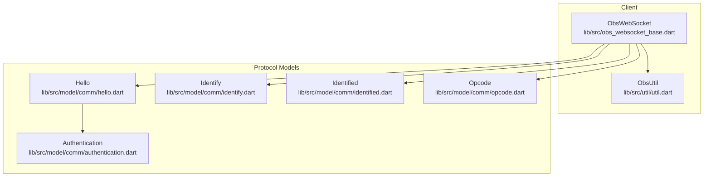
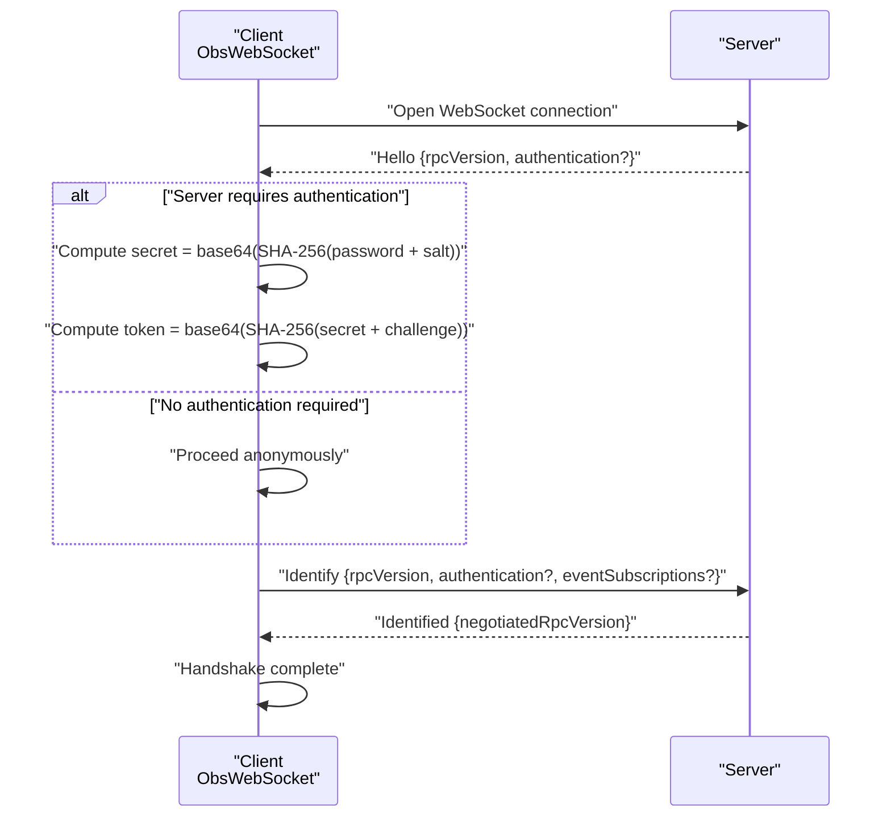
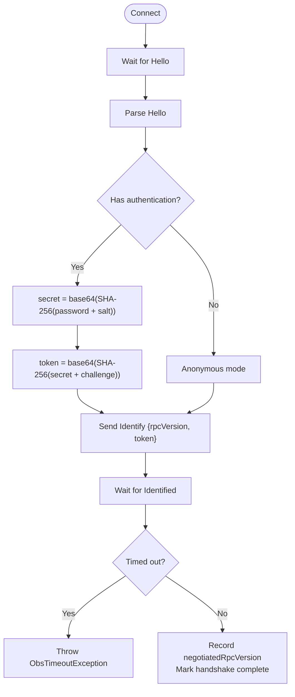
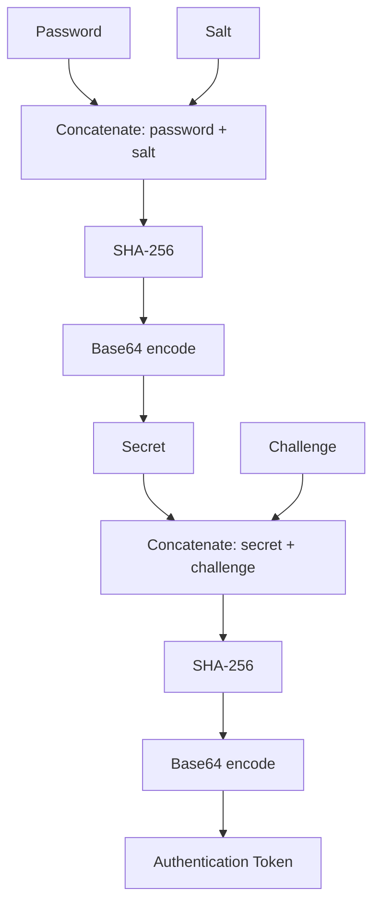
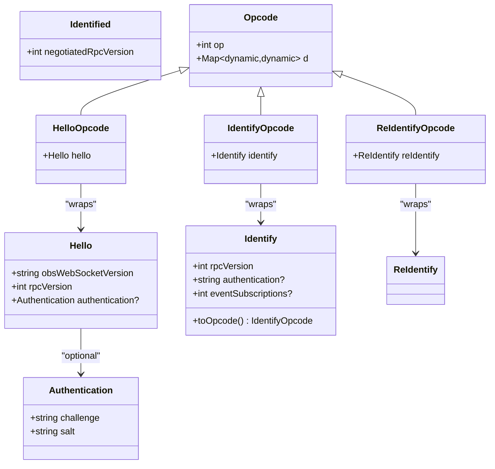
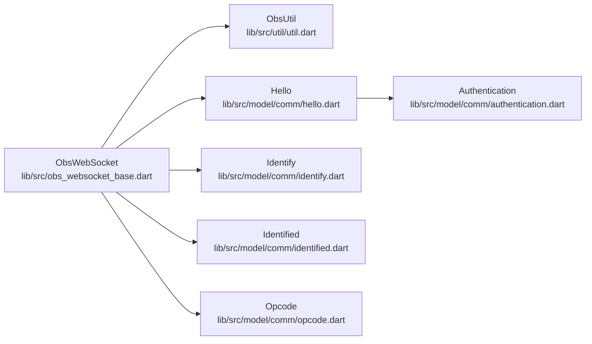

# Authentication and Handshake Process

<cite>
**Referenced Files in This Document**
- [obs_websocket_base.dart](file://lib/src/obs_websocket_base.dart)
- [util.dart](file://lib/src/util/util.dart)
- [hello.dart](file://lib/src/model/comm/hello.dart)
- [hello.g.dart](file://lib/src/model/comm/hello.g.dart)
- [authentication.dart](file://lib/src/model/comm/authentication.dart)
- [authentication.g.dart](file://lib/src/model/comm/authentication.g.dart)
- [identify.dart](file://lib/src/model/comm/identify.dart)
- [identified.dart](file://lib/src/model/comm/identified.dart)
- [opcode.dart](file://lib/src/model/comm/opcode.dart)
- [exception.dart](file://lib/src/exception.dart)
</cite>

## Table of Contents
1. [Introduction](#introduction)
2. [Project Structure](#project-structure)
3. [Core Components](#core-components)
4. [Architecture Overview](#architecture-overview)
5. [Detailed Component Analysis](#detailed-component-analysis)
6. [Dependency Analysis](#dependency-analysis)
7. [Performance Considerations](#performance-considerations)
8. [Troubleshooting Guide](#troubleshooting-guide)
9. [Conclusion](#conclusion)

## Introduction
This document explains the authentication and handshake process used by the obs-websocket Dart client. It covers the complete flow from receiving the Hello message (which may include challenge and salt), computing the authentication token via a base64-encoded SHA-256 challenge-response mechanism, sending the Identify message, and completing the handshake. It also describes anonymous connections, security considerations, and best practices for password management.

## Project Structure
The authentication and handshake logic is implemented in the core WebSocket client and a small set of model classes that represent protocol messages. The key files are:
- Client handshake and transport: [obs_websocket_base.dart](file://lib/src/obs_websocket_base.dart)
- Cryptographic utilities: [util.dart](file://lib/src/util/util.dart)
- Protocol models: [hello.dart](file://lib/src/model/comm/hello.dart), [authentication.dart](file://lib/src/model/comm/authentication.dart), [identify.dart](file://lib/src/model/comm/identify.dart), [identified.dart](file://lib/src/model/comm/identified.dart), [opcode.dart](file://lib/src/model/comm/opcode.dart)
- Exception types: [exception.dart](file://lib/src/exception.dart)

**Diagram sources**
- [obs_websocket_base.dart](file://lib/src/obs_websocket_base.dart)
- [util.dart](file://lib/src/util/util.dart)
- [hello.dart](file://lib/src/model/comm/hello.dart)
- [authentication.dart](file://lib/src/model/comm/authentication.dart)
- [identify.dart](file://lib/src/model/comm/identify.dart)
- [identified.dart](file://lib/src/model/comm/identified.dart)
- [opcode.dart](file://lib/src/model/comm/opcode.dart)

**Section sources**
- [obs_websocket_base.dart](file://lib/src/obs_websocket_base.dart)
- [util.dart](file://lib/src/util/util.dart)
- [hello.dart](file://lib/src/model/comm/hello.dart)
- [authentication.dart](file://lib/src/model/comm/authentication.dart)
- [identify.dart](file://lib/src/model/comm/identify.dart)
- [identified.dart](file://lib/src/model/comm/identified.dart)
- [opcode.dart](file://lib/src/model/comm/opcode.dart)

## Core Components
- ObsWebSocket: Orchestrates the handshake, reads the Hello message, computes the authentication token when required, sends Identify, and completes negotiation.
- ObsUtil: Provides the base64Hash function used for hashing with SHA-256 and base64 encoding.
- Hello: Carries the initial server greeting, including optional authentication metadata.
- Authentication: Contains challenge and salt used for the challenge-response.
- Identify: Client’s authentication request, including RPC version and optional authentication token.
- Identified: Server’s acknowledgment of successful authentication with negotiated RPC version.
- Opcode: Generic envelope for all protocol messages.

Key responsibilities:
- Handshake orchestration and timeouts: [obs_websocket_base.dart](file://lib/src/obs_websocket_base.dart)
- Hash computation: [util.dart](file://lib/src/util/util.dart)
- Message models: [hello.dart](file://lib/src/model/comm/hello.dart), [authentication.dart](file://lib/src/model/comm/authentication.dart), [identify.dart](file://lib/src/model/comm/identify.dart), [identified.dart](file://lib/src/model/comm/identified.dart), [opcode.dart](file://lib/src/model/comm/opcode.dart)

**Section sources**
- [obs_websocket_base.dart](file://lib/src/obs_websocket_base.dart)
- [util.dart](file://lib/src/util/util.dart)
- [hello.dart](file://lib/src/model/comm/hello.dart)
- [authentication.dart](file://lib/src/model/comm/authentication.dart)
- [identify.dart](file://lib/src/model/comm/identify.dart)
- [identified.dart](file://lib/src/model/comm/identified.dart)
- [opcode.dart](file://lib/src/model/comm/opcode.dart)

## Architecture Overview
The handshake follows a strict sequence: receive Hello, optionally compute authentication token, send Identify, and await Identified. The client sets up a pending handshake waiter before sending Identify to avoid race conditions.

**Diagram sources**
- [obs_websocket_base.dart](file://lib/src/obs_websocket_base.dart)
- [util.dart](file://lib/src/util/util.dart)
- [hello.dart](file://lib/src/model/comm/hello.dart)
- [authentication.dart](file://lib/src/model/comm/authentication.dart)
- [identify.dart](file://lib/src/model/comm/identify.dart)
- [identified.dart](file://lib/src/model/comm/identified.dart)

## Detailed Component Analysis

### Handshake Orchestration
ObsWebSocket manages the handshake lifecycle:
- Waits for Hello using a dedicated waiter.
- Reads Hello and checks for optional authentication metadata.
- Computes the authentication token when credentials are present.
- Sends Identify with computed token or null.
- Waits for Identified with a timeout and records negotiated RPC version.

**Diagram sources**
- [obs_websocket_base.dart](file://lib/src/obs_websocket_base.dart)
- [util.dart](file://lib/src/util/util.dart)
- [hello.dart](file://lib/src/model/comm/hello.dart)
- [authentication.dart](file://lib/src/model/comm/authentication.dart)
- [identify.dart](file://lib/src/model/comm/identify.dart)
- [identified.dart](file://lib/src/model/comm/identified.dart)

**Section sources**
- [obs_websocket_base.dart](file://lib/src/obs_websocket_base.dart)

### Cryptographic Hash Functions and Challenge-Response
The authentication uses a two-stage base64-encoded SHA-256 challenge-response:
- Stage 1: secret = base64(SHA-256(password + salt))
- Stage 2: token = base64(SHA-256(secret + challenge))

ObsUtil.base64Hash performs UTF-8 encoding, SHA-256 hashing, and base64 encoding.

**Diagram sources**
- [util.dart](file://lib/src/util/util.dart)
- [authentication.dart](file://lib/src/model/comm/authentication.dart)
- [hello.dart](file://lib/src/model/comm/hello.dart)

**Section sources**
- [util.dart](file://lib/src/util/util.dart)
- [authentication.dart](file://lib/src/model/comm/authentication.dart)
- [hello.dart](file://lib/src/model/comm/hello.dart)

### Anonymous vs Authenticated Connections
- Authenticated mode: Server Hello includes authentication metadata (challenge and salt). The client computes a token and sends it in Identify.
- Anonymous mode: Server Hello omits authentication metadata. The client sends Identify without an authentication token.

Behavior is controlled by the presence of authentication data in Hello.

**Section sources**
- [obs_websocket_base.dart](file://lib/src/obs_websocket_base.dart)
- [hello.dart](file://lib/src/model/comm/hello.dart)
- [authentication.dart](file://lib/src/model/comm/authentication.dart)

### Protocol Messages and Classes
The handshake messages are modeled as follows:

**Diagram sources**
- [hello.dart](file://lib/src/model/comm/hello.dart)
- [hello.g.dart](file://lib/src/model/comm/hello.g.dart)
- [authentication.dart](file://lib/src/model/comm/authentication.dart)
- [authentication.g.dart](file://lib/src/model/comm/authentication.g.dart)
- [identify.dart](file://lib/src/model/comm/identify.dart)
- [identified.dart](file://lib/src/model/comm/identified.dart)
- [opcode.dart](file://lib/src/model/comm/opcode.dart)

**Section sources**
- [hello.dart](file://lib/src/model/comm/hello.dart)
- [hello.g.dart](file://lib/src/model/comm/hello.g.dart)
- [authentication.dart](file://lib/src/model/comm/authentication.dart)
- [authentication.g.dart](file://lib/src/model/comm/authentication.g.dart)
- [identify.dart](file://lib/src/model/comm/identify.dart)
- [identified.dart](file://lib/src/model/comm/identified.dart)
- [opcode.dart](file://lib/src/model/comm/opcode.dart)

### Step-by-Step Authentication Flows

#### Successful Authenticated Flow
1. Client connects to WebSocket.
2. Server sends Hello with rpcVersion and authentication (challenge, salt).
3. Client computes secret = base64(SHA-256(password + salt)).
4. Client computes token = base64(SHA-256(secret + challenge)).
5. Client sends Identify with rpcVersion and token.
6. Server responds with Identified and negotiatedRpcVersion.
7. Handshake complete.

#### Successful Anonymous Flow
1. Client connects to WebSocket.
2. Server sends Hello without authentication metadata.
3. Client sends Identify without token.
4. Server responds with Identified and negotiatedRpcVersion.
5. Handshake complete.

#### Error Scenarios
- Timeout waiting for Hello or Identified: ObsTimeoutException is thrown.
- Malformed Hello or Identified: ObsProtocolException may occur during decoding.
- Authentication failure: Handshake completion depends on server acceptance; errors are surfaced via exceptions.

**Section sources**
- [obs_websocket_base.dart](file://lib/src/obs_websocket_base.dart)
- [exception.dart](file://lib/src/exception.dart)

## Dependency Analysis
The handshake depends on:
- ObsWebSocket for transport and state management.
- ObsUtil for cryptographic hashing.
- Model classes for message serialization/deserialization.
- Opcode wrappers for protocol framing.

**Diagram sources**
- [obs_websocket_base.dart](file://lib/src/obs_websocket_base.dart)
- [util.dart](file://lib/src/util/util.dart)
- [hello.dart](file://lib/src/model/comm/hello.dart)
- [authentication.dart](file://lib/src/model/comm/authentication.dart)
- [identify.dart](file://lib/src/model/comm/identify.dart)
- [identified.dart](file://lib/src/model/comm/identified.dart)
- [opcode.dart](file://lib/src/model/comm/opcode.dart)

**Section sources**
- [obs_websocket_base.dart](file://lib/src/obs_websocket_base.dart)
- [util.dart](file://lib/src/util/util.dart)
- [hello.dart](file://lib/src/model/comm/hello.dart)
- [authentication.dart](file://lib/src/model/comm/authentication.dart)
- [identify.dart](file://lib/src/model/comm/identify.dart)
- [identified.dart](file://lib/src/model/comm/identified.dart)
- [opcode.dart](file://lib/src/model/comm/opcode.dart)

## Performance Considerations
- Handshake timeouts: The client enforces a configurable timeout for Hello and Identified. Tune requestTimeout according to network conditions.
- Minimal hashing overhead: SHA-256 plus base64 encoding is lightweight compared to network latency.
- Avoid unnecessary retries: The handshake waiter prevents race conditions; do not resend Identify manually.

## Troubleshooting Guide
Common issues and resolutions:
- Timeout waiting for Hello or Identified:
  - Verify the server is reachable and the URL scheme is ws:// or wss://.
  - Increase requestTimeout if the server is slow to respond.
  - Check firewall/proxy settings.
- Authentication failures:
  - Ensure the password is correct and matches the server configuration.
  - Confirm the server requires authentication (Hello includes authentication metadata).
  - Recompute token using the exact challenge and salt provided by Hello.
- Protocol errors:
  - Inspect logs for malformed opcode frames.
  - Validate that the server supports the negotiated RPC version.
- Anonymous vs authenticated:
  - If Hello lacks authentication metadata, do not supply a token in Identify.

Related exception types:
- ObsTimeoutException: Indicates a timeout waiting for handshake messages.
- ObsAuthException: Indicates authentication or handshake failure.
- ObsProtocolException: Indicates malformed or unparseable protocol data.

**Section sources**
- [obs_websocket_base.dart](file://lib/src/obs_websocket_base.dart)
- [exception.dart](file://lib/src/exception.dart)

## Conclusion
The obs-websocket Dart client implements a robust, standards-aligned handshake using a base64-encoded SHA-256 challenge-response mechanism. By following the documented flow—reading Hello, computing the token when required, sending Identify, and awaiting Identified—you can establish secure, authenticated connections or operate anonymously depending on server configuration. Proper logging, timeouts, and correct handling of challenge and salt are essential for reliable authentication.