# Core Concepts and Architecture

<cite>
**Referenced Files in This Document**
- [obs_websocket.dart](file://lib/obs_websocket.dart)
- [request.dart](file://lib/request.dart)
- [command.dart](file://lib/command.dart)
- [event.dart](file://lib/event.dart)
- [obs_websocket_base.dart](file://lib/src/obs_websocket_base.dart)
- [connect.dart](file://lib/src/connect.dart)
- [from_json_singleton.dart](file://lib/src/from_json_singleton.dart)
- [authentication.dart](file://lib/src/model/comm/authentication.dart)
- [hello.dart](file://lib/src/model/comm/hello.dart)
- [identified.dart](file://lib/src/model/comm/identified.dart)
- [identify.dart](file://lib/src/model/comm/identify.dart)
- [opcode.dart](file://lib/src/model/comm/opcode.dart)
- [request.dart](file://lib/src/model/comm/request.dart)
- [request_batch.dart](file://lib/src/model/comm/request_batch.dart)
- [request_response.dart](file://lib/src/model/comm/request_response.dart)
- [request_batch_response.dart](file://lib/src/model/comm/request_batch_response.dart)
- [event.dart](file://lib/src/model/comm/event.dart)
- [reidentify.dart](file://lib/src/model/comm/reidentify.dart)
- [config.dart](file://lib/src/request/config.dart)
- [general.dart](file://lib/src/request/general.dart)
- [inputs.dart](file://lib/src/request/inputs.dart)
- [media_inputs.dart](file://lib/src/request/media_inputs.dart)
- [outputs.dart](file://lib/src/request/outputs.dart)
- [record.dart](file://lib/src/request/record.dart)
- [scene_items.dart](file://lib/src/request/scene_items.dart)
- [scenes.dart](file://lib/src/request/scenes.dart)
- [sources.dart](file://lib/src/request/sources.dart)
- [stream.dart](file://lib/src/request/stream.dart)
- [transitions.dart](file://lib/src/request/transitions.dart)
- [ui.dart](file://lib/src/request/ui.dart)
- [obs_authorize_command.dart](file://lib/src/cmd/obs_authorize_command.dart)
- [obs_general_command.dart](file://lib/src/cmd/obs_general_command.dart)
- [obs_listen_command.dart](file://lib/src/cmd/obs_listen_command.dart)
- [obs_send_command.dart](file://lib/src/cmd/obs_send_command.dart)
- [obs_version_command.dart](file://lib/src/cmd/obs_version_command.dart)
</cite>

## Table of Contents
1. [Introduction](#introduction)
2. [Project Structure](#project-structure)
3. [Core Components](#core-components)
4. [Architecture Overview](#architecture-overview)
5. [Detailed Component Analysis](#detailed-component-analysis)
6. [Dependency Analysis](#dependency-analysis)
7. [Performance Considerations](#performance-considerations)
8. [Troubleshooting Guide](#troubleshooting-guide)
9. [Conclusion](#conclusion)

## Introduction
This document explains the core concepts and architecture of the obs-websocket Dart library. It covers WebSocket communication fundamentals, the obs-websocket protocol 5.x specification as implemented in Dart, and how the library realizes an event-driven architecture. It documents the authentication handshake, message serialization/deserialization, connection lifecycle management, request-response semantics, batch processing, and error handling. Security considerations, connection pooling, and performance optimization techniques are also addressed, along with architectural diagrams and practical usage references.

## Project Structure
The library is organized around a central client class that manages the WebSocket channel, an authentication handshake, and request/response orchestration. Supporting modules encapsulate:
- Protocol models for messages (Hello, Identify, Request, Batch, Event, etc.)
- Feature-specific request managers (Config, General, Inputs, Scenes, etc.)
- Command wrappers for higher-level operations
- Event model classes for all observable events
- Cross-platform WebSocket connectivity abstraction

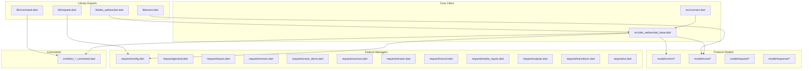

**Diagram sources**
- [obs_websocket.dart:1-68](file://lib/obs_websocket.dart#L1-L68)
- [request.dart:1-19](file://lib/request.dart#L1-L19)
- [command.dart:1-20](file://lib/command.dart#L1-L20)
- [event.dart:1-50](file://lib/event.dart#L1-L50)
- [obs_websocket_base.dart:11-133](file://lib/src/obs_websocket_base.dart#L11-L133)
- [connect.dart:1-15](file://lib/src/connect.dart#L1-L15)

**Section sources**
- [obs_websocket.dart:1-68](file://lib/obs_websocket.dart#L1-L68)
- [request.dart:1-19](file://lib/request.dart#L1-L19)
- [command.dart:1-20](file://lib/command.dart#L1-L20)
- [event.dart:1-50](file://lib/event.dart#L1-L50)

## Core Components
- ObsWebSocket client: Central orchestrator managing the WebSocketChannel, authentication handshake, request/response lifecycle, event dispatching, and connection lifecycle.
- Request managers: Feature-specific classes (Config, General, Inputs, Scenes, SceneItems, Sources, Stream, Record, MediaInputs, Outputs, Transitions, Ui) that expose typed methods delegating to the core client.
- Commands: Higher-level command wrappers (Authorize, General, Listen, Send, Version) that simplify common workflows.
- Protocol models: Strongly-typed models for Hello, Identify, Request, RequestBatch, RequestResponse, RequestBatchResponse, Event, Opcode, and related structures.
- Event models: Extensive set of event classes covering configuration, inputs, outputs, scenes, scene items, UI, and general OBS events.
- Connectivity abstraction: Cross-platform WebSocket creation via Connect interface with platform-specific implementations.

Key responsibilities:
- Authentication handshake and RPC version negotiation
- JSON serialization/deserialization of protocol messages
- Request-response correlation and error propagation
- Batch request processing
- Event subscription and dispatch
- Graceful connection closure

**Section sources**
- [obs_websocket_base.dart:11-133](file://lib/src/obs_websocket_base.dart#L11-L133)
- [obs_websocket_base.dart:174-236](file://lib/src/obs_websocket_base.dart#L174-L236)
- [obs_websocket_base.dart:351-418](file://lib/src/obs_websocket_base.dart#L351-L418)
- [obs_websocket_base.dart:356-388](file://lib/src/obs_websocket_base.dart#L356-L388)
- [obs_websocket_base.dart:294-311](file://lib/src/obs_websocket_base.dart#L294-L311)
- [connect.dart:1-15](file://lib/src/connect.dart#L1-L15)

## Architecture Overview
The library implements an event-driven architecture over a persistent WebSocket connection. The ObsWebSocket client:
- Establishes the WebSocket connection
- Performs the authentication handshake (Hello → Identify → Identified)
- Negotiates RPC version and enables event subscriptions
- Serializes/deserializes messages using protocol models
- Routes incoming events to registered handlers
- Correlates outgoing requests with incoming responses
- Supports batch requests for improved throughput

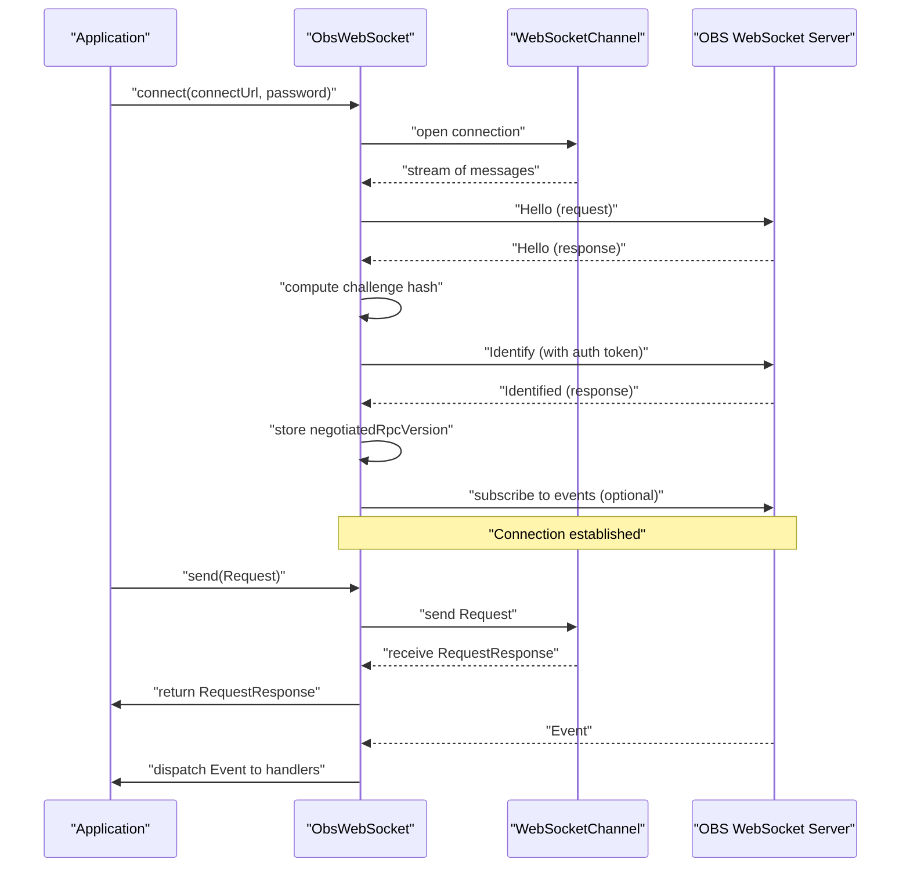

**Diagram sources**
- [obs_websocket_base.dart:135-172](file://lib/src/obs_websocket_base.dart#L135-L172)
- [obs_websocket_base.dart:190-236](file://lib/src/obs_websocket_base.dart#L190-L236)
- [obs_websocket_base.dart:351-418](file://lib/src/obs_websocket_base.dart#L351-L418)
- [obs_websocket_base.dart:174-188](file://lib/src/obs_websocket_base.dart#L174-L188)

## Detailed Component Analysis

### ObsWebSocket Client
The ObsWebSocket client is the core component that:
- Holds the WebSocketChannel and a broadcast stream for multiplexed listeners
- Manages feature-specific request managers lazily
- Implements the authentication handshake and RPC version negotiation
- Provides request-response and batch processing APIs
- Dispatches events to registered handlers or fallback handlers
- Handles graceful connection closure

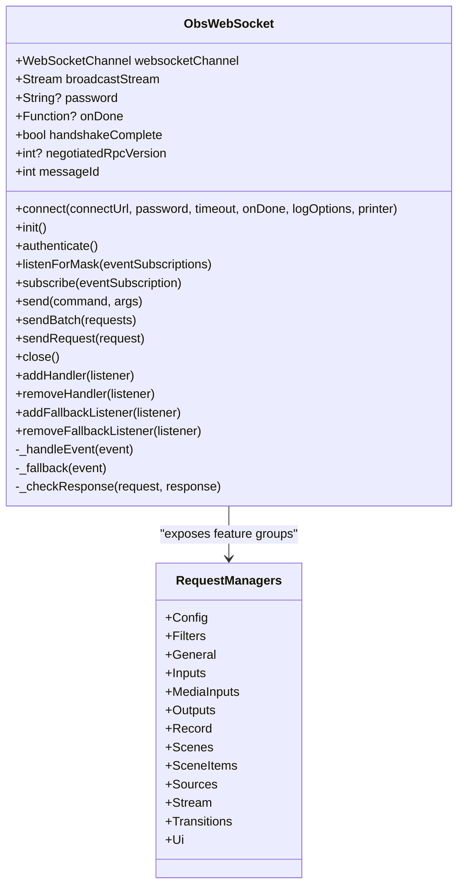

**Diagram sources**
- [obs_websocket_base.dart:11-133](file://lib/src/obs_websocket_base.dart#L11-L133)
- [obs_websocket_base.dart:351-418](file://lib/src/obs_websocket_base.dart#L351-L418)

**Section sources**
- [obs_websocket_base.dart:11-133](file://lib/src/obs_websocket_base.dart#L11-L133)
- [obs_websocket_base.dart:174-236](file://lib/src/obs_websocket_base.dart#L174-L236)
- [obs_websocket_base.dart:351-418](file://lib/src/obs_websocket_base.dart#L351-L418)

### Authentication Handshake
The handshake follows the obs-websocket protocol 5.x:
- Client receives Hello with optional authentication parameters
- Client computes challenge hash using password, salt, and challenge
- Client sends Identify with optional auth token and initial event subscription mask
- Server responds with Identified containing negotiated RPC version
- Client marks handshakeComplete and stores negotiated RPC version

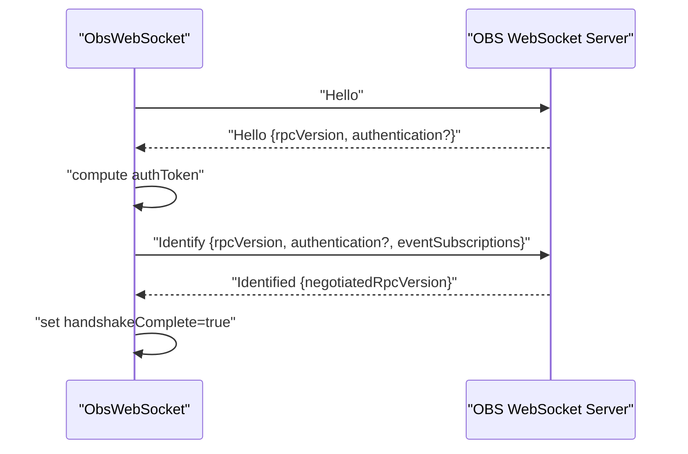

**Diagram sources**
- [obs_websocket_base.dart:190-236](file://lib/src/obs_websocket_base.dart#L190-L236)
- [hello.dart:1-200](file://lib/src/model/comm/hello.dart#L1-L200)
- [identify.dart:1-200](file://lib/src/model/comm/identify.dart#L1-L200)
- [identified.dart:1-200](file://lib/src/model/comm/identified.dart#L1-L200)
- [authentication.dart:1-200](file://lib/src/model/comm/authentication.dart#L1-L200)

**Section sources**
- [obs_websocket_base.dart:190-236](file://lib/src/obs_websocket_base.dart#L190-L236)
- [hello.dart:1-200](file://lib/src/model/comm/hello.dart#L1-L200)
- [identify.dart:1-200](file://lib/src/model/comm/identify.dart#L1-L200)
- [identified.dart:1-200](file://lib/src/model/comm/identified.dart#L1-L200)
- [authentication.dart:1-200](file://lib/src/model/comm/authentication.dart#L1-L200)

### Message Serialization and Deserialization
- Incoming messages are parsed from JSON into Opcode instances
- Opcode.op determines routing to event handling or response correlation
- Outgoing messages are serialized from typed models (Request, RequestBatch, Identify, etc.) to JSON strings
- Strongly-typed models generated via code generation support robust parsing

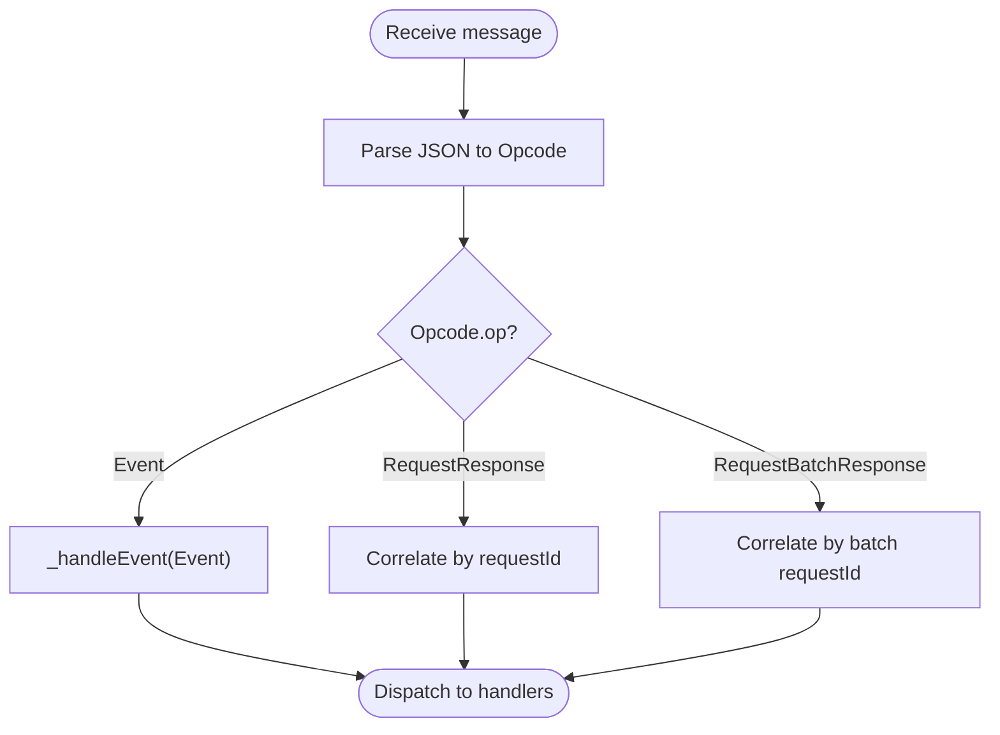

**Diagram sources**
- [obs_websocket_base.dart:174-188](file://lib/src/obs_websocket_base.dart#L174-L188)
- [obs_websocket_base.dart:390-418](file://lib/src/obs_websocket_base.dart#L390-L418)
- [obs_websocket_base.dart:356-388](file://lib/src/obs_websocket_base.dart#L356-L388)
- [opcode.dart:1-200](file://lib/src/model/comm/opcode.dart#L1-L200)

**Section sources**
- [obs_websocket_base.dart:174-188](file://lib/src/obs_websocket_base.dart#L174-L188)
- [obs_websocket_base.dart:390-418](file://lib/src/obs_websocket_base.dart#L390-L418)
- [obs_websocket_base.dart:356-388](file://lib/src/obs_websocket_base.dart#L356-L388)
- [opcode.dart:1-200](file://lib/src/model/comm/opcode.dart#L1-L200)

### Request-Response Model
- Requests are constructed from typed Request models and sent over the wire
- Responses are correlated by requestId and mapped to RequestResponse
- Errors are detected via requestStatus.result and raised as exceptions when applicable
- The client logs request/response pairs for observability

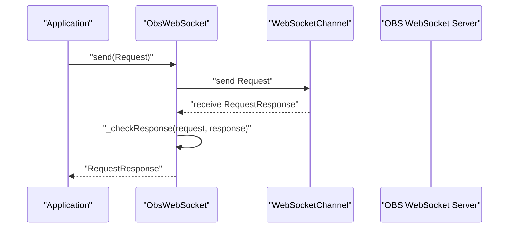

**Diagram sources**
- [obs_websocket_base.dart:351-418](file://lib/src/obs_websocket_base.dart#L351-L418)
- [request_response.dart:1-200](file://lib/src/model/comm/request_response.dart#L1-L200)

**Section sources**
- [obs_websocket_base.dart:351-418](file://lib/src/obs_websocket_base.dart#L351-L418)
- [request_response.dart:1-200](file://lib/src/model/comm/request_response.dart#L1-L200)

### Batch Processing
- Multiple requests can be bundled into a single RequestBatch
- The client sends the batch and waits for a single RequestBatchResponse
- Individual results are correlated by index and requestId
- Useful for reducing round-trips and improving throughput

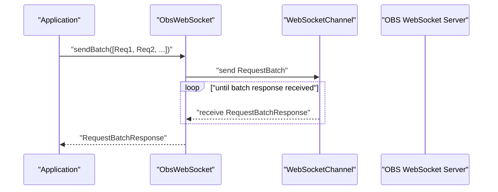

**Diagram sources**
- [obs_websocket_base.dart:356-388](file://lib/src/obs_websocket_base.dart#L356-L388)
- [request_batch.dart:1-200](file://lib/src/model/comm/request_batch.dart#L1-L200)
- [request_batch_response.dart:1-200](file://lib/src/model/comm/request_batch_response.dart#L1-L200)

**Section sources**
- [obs_websocket_base.dart:356-388](file://lib/src/obs_websocket_base.dart#L356-L388)
- [request_batch.dart:1-200](file://lib/src/model/comm/request_batch.dart#L1-L200)
- [request_batch_response.dart:1-200](file://lib/src/model/comm/request_batch_response.dart#L1-L200)

### Event-Driven Architecture
- Events are received as Opcode with op=event
- The client deserializes to Event and dispatches to registered handlers keyed by eventType
- A fallback mechanism handles unknown or unregistered event types
- Subscriptions can be toggled via ReIdentify after handshake

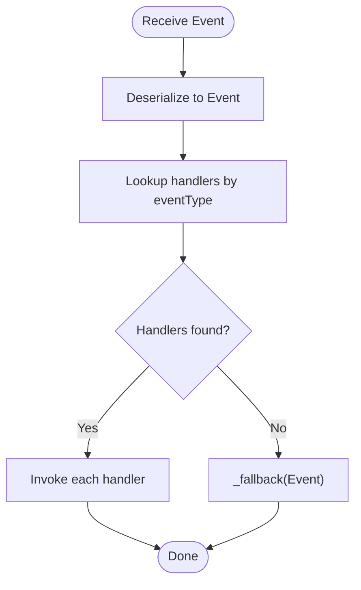

**Diagram sources**
- [obs_websocket_base.dart:178-184](file://lib/src/obs_websocket_base.dart#L178-L184)
- [obs_websocket_base.dart:294-311](file://lib/src/obs_websocket_base.dart#L294-L311)
- [event.dart:1-200](file://lib/src/model/comm/event.dart#L1-L200)
- [from_json_singleton.dart:1-200](file://lib/src/from_json_singleton.dart#L1-L200)

**Section sources**
- [obs_websocket_base.dart:178-184](file://lib/src/obs_websocket_base.dart#L178-L184)
- [obs_websocket_base.dart:294-311](file://lib/src/obs_websocket_base.dart#L294-L311)
- [event.dart:1-200](file://lib/src/model/comm/event.dart#L1-L200)
- [from_json_singleton.dart:1-200](file://lib/src/from_json_singleton.dart#L1-L200)

### Connection Lifecycle Management
- Connection establishment via Connect abstraction
- Initialization subscribes to events and starts listening
- Authentication ensures secure session negotiation
- Graceful closure via normal closure status

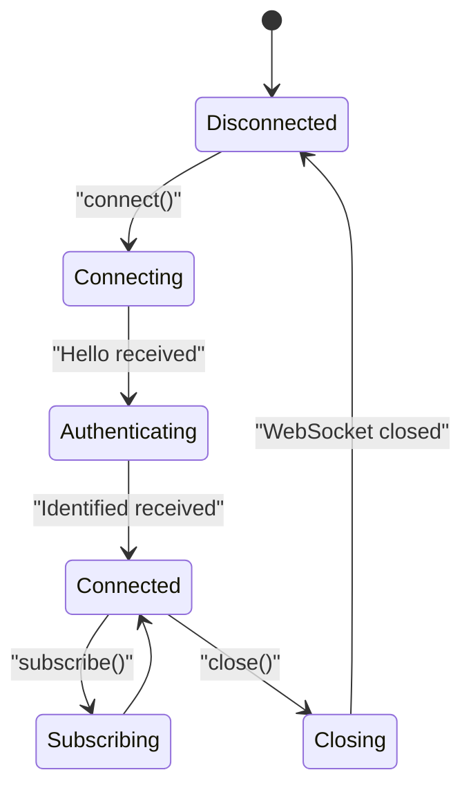

**Diagram sources**
- [obs_websocket_base.dart:135-172](file://lib/src/obs_websocket_base.dart#L135-L172)
- [obs_websocket_base.dart:174-188](file://lib/src/obs_websocket_base.dart#L174-L188)
- [obs_websocket_base.dart:314-318](file://lib/src/obs_websocket_base.dart#L314-L318)

**Section sources**
- [obs_websocket_base.dart:135-172](file://lib/src/obs_websocket_base.dart#L135-L172)
- [obs_websocket_base.dart:174-188](file://lib/src/obs_websocket_base.dart#L174-L188)
- [obs_websocket_base.dart:314-318](file://lib/src/obs_websocket_base.dart#L314-L318)
- [connect.dart:1-15](file://lib/src/connect.dart#L1-L15)

### Feature Request Managers
The library exposes feature-specific request managers under lib/request.dart. These group related commands (e.g., Scenes, Sources, Stream, Record, MediaInputs, Outputs, Transitions, Ui) and delegate to the core ObsWebSocket client for transport.

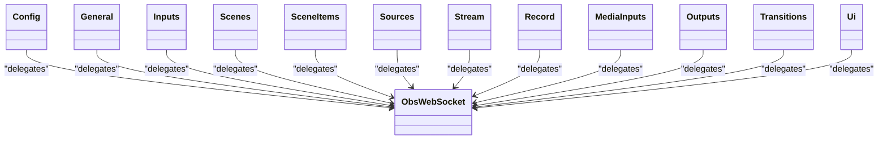

**Diagram sources**
- [request.dart:1-19](file://lib/request.dart#L1-L19)
- [config.dart:1-200](file://lib/src/request/config.dart#L1-L200)
- [general.dart:1-200](file://lib/src/request/general.dart#L1-L200)
- [inputs.dart:1-200](file://lib/src/request/inputs.dart#L1-L200)
- [scenes.dart:1-200](file://lib/src/request/scenes.dart#L1-L200)
- [scene_items.dart:1-200](file://lib/src/request/scene_items.dart#L1-L200)
- [sources.dart:1-200](file://lib/src/request/sources.dart#L1-L200)
- [stream.dart:1-200](file://lib/src/request/stream.dart#L1-L200)
- [record.dart:1-200](file://lib/src/request/record.dart#L1-L200)
- [media_inputs.dart:1-200](file://lib/src/request/media_inputs.dart#L1-L200)
- [outputs.dart:1-200](file://lib/src/request/outputs.dart#L1-L200)
- [transitions.dart:1-200](file://lib/src/request/transitions.dart#L1-L200)
- [ui.dart:1-200](file://lib/src/request/ui.dart#L1-L200)

**Section sources**
- [request.dart:1-19](file://lib/request.dart#L1-L19)
- [config.dart:1-200](file://lib/src/request/config.dart#L1-L200)
- [general.dart:1-200](file://lib/src/request/general.dart#L1-L200)
- [inputs.dart:1-200](file://lib/src/request/inputs.dart#L1-L200)
- [scenes.dart:1-200](file://lib/src/request/scenes.dart#L1-L200)
- [scene_items.dart:1-200](file://lib/src/request/scene_items.dart#L1-L200)
- [sources.dart:1-200](file://lib/src/request/sources.dart#L1-L200)
- [stream.dart:1-200](file://lib/src/request/stream.dart#L1-L200)
- [record.dart:1-200](file://lib/src/request/record.dart#L1-L200)
- [media_inputs.dart:1-200](file://lib/src/request/media_inputs.dart#L1-L200)
- [outputs.dart:1-200](file://lib/src/request/outputs.dart#L1-L200)
- [transitions.dart:1-200](file://lib/src/request/transitions.dart#L1-L200)
- [ui.dart:1-200](file://lib/src/request/ui.dart#L1-L200)

### Commands
Higher-level command wrappers simplify common tasks:
- Authorize: wraps authentication and handshake
- General: general OBS operations
- Listen: toggles event subscriptions
- Send: low-level request sending
- Version: retrieves server info

These are exported from lib/command.dart and implemented under lib/src/cmd/.

**Section sources**
- [command.dart:1-20](file://lib/command.dart#L1-L20)
- [obs_authorize_command.dart:1-200](file://lib/src/cmd/obs_authorize_command.dart#L1-L200)
- [obs_general_command.dart:1-200](file://lib/src/cmd/obs_general_command.dart#L1-L200)
- [obs_listen_command.dart:1-200](file://lib/src/cmd/obs_listen_command.dart#L1-L200)
- [obs_send_command.dart:1-200](file://lib/src/cmd/obs_send_command.dart#L1-L200)
- [obs_version_command.dart:1-200](file://lib/src/cmd/obs_version_command.dart#L1-L200)

## Dependency Analysis
The ObsWebSocket client depends on:
- WebSocketChannel for transport
- Protocol models for serialization/deserialization
- Feature request managers for command delegation
- FromJsonSingleton for dynamic event deserialization
- Connect abstraction for cross-platform WebSocket creation

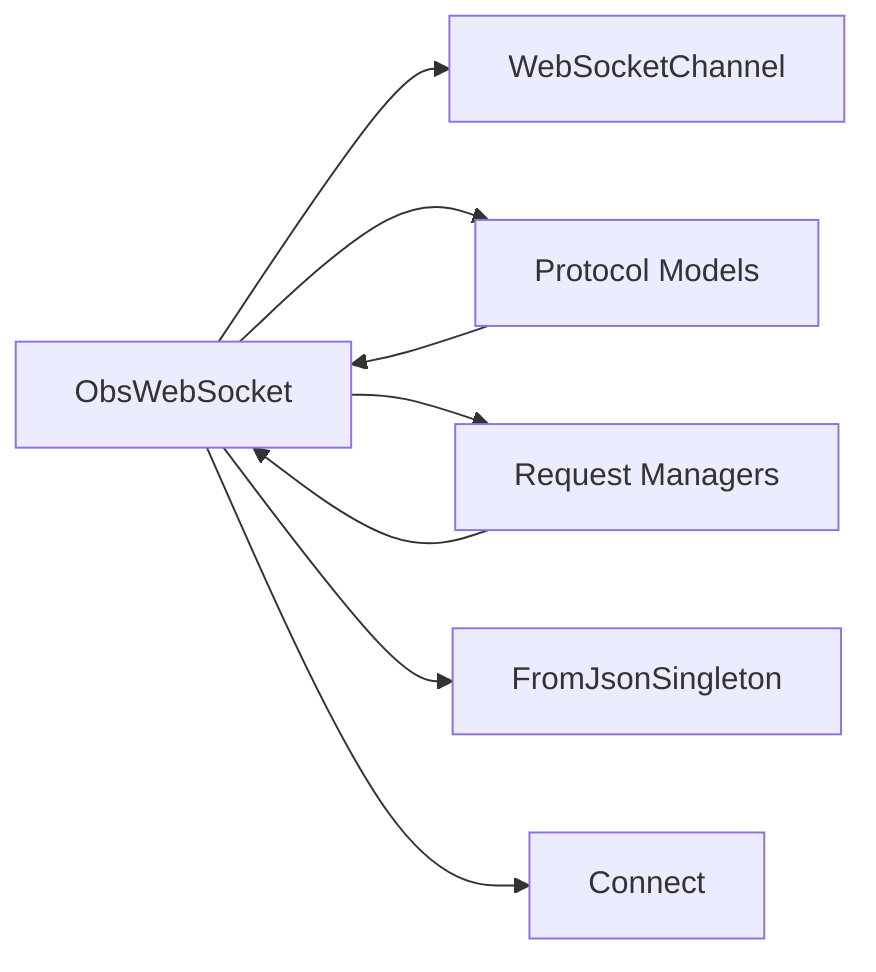

**Diagram sources**
- [obs_websocket_base.dart:11-133](file://lib/src/obs_websocket_base.dart#L11-L133)
- [from_json_singleton.dart:1-200](file://lib/src/from_json_singleton.dart#L1-L200)
- [connect.dart:1-15](file://lib/src/connect.dart#L1-L15)

**Section sources**
- [obs_websocket_base.dart:11-133](file://lib/src/obs_websocket_base.dart#L11-L133)
- [from_json_singleton.dart:1-200](file://lib/src/from_json_singleton.dart#L1-L200)
- [connect.dart:1-15](file://lib/src/connect.dart#L1-L15)

## Performance Considerations
- Batch requests: Use sendBatch to reduce round-trips when issuing multiple commands.
- Event filtering: Subscribe only to required event masks to minimize traffic.
- Broadcast streams: The client uses a broadcast stream to support multiple listeners efficiently.
- Logging controls: Configure LogOptions and printers to reduce overhead in production.
- Connection reuse: Keep a single ObsWebSocket instance per OBS instance to avoid reconnect churn.
- Backpressure awareness: Respect WebSocket sink capacity and avoid flooding the connection.

[No sources needed since this section provides general guidance]

## Troubleshooting Guide
Common issues and remedies:
- Handshake failures: Verify password correctness and server authentication settings; inspect Hello and Identified messages.
- Authentication errors: Ensure challenge hashing matches protocol; confirm server requires authentication.
- Request timeouts: Increase timeout during connect; check server load and network latency.
- Event handler mismatches: Register handlers for expected event types; use fallback handlers for unknown events.
- Batch response mismatch: Confirm batch requestId correlation and result ordering.

**Section sources**
- [obs_websocket_base.dart:190-236](file://lib/src/obs_websocket_base.dart#L190-L236)
- [obs_websocket_base.dart:420-426](file://lib/src/obs_websocket_base.dart#L420-L426)
- [obs_websocket_base.dart:356-388](file://lib/src/obs_websocket_base.dart#L356-L388)

## Conclusion
The obs-websocket Dart library provides a robust, event-driven client for OBS Studio’s WebSocket interface. Its architecture centers on a strongly-typed protocol model, a clean authentication handshake, efficient request-response and batch processing, and flexible event dispatching. By leveraging feature request managers and commands, developers can build reliable integrations while maintaining performance and security.