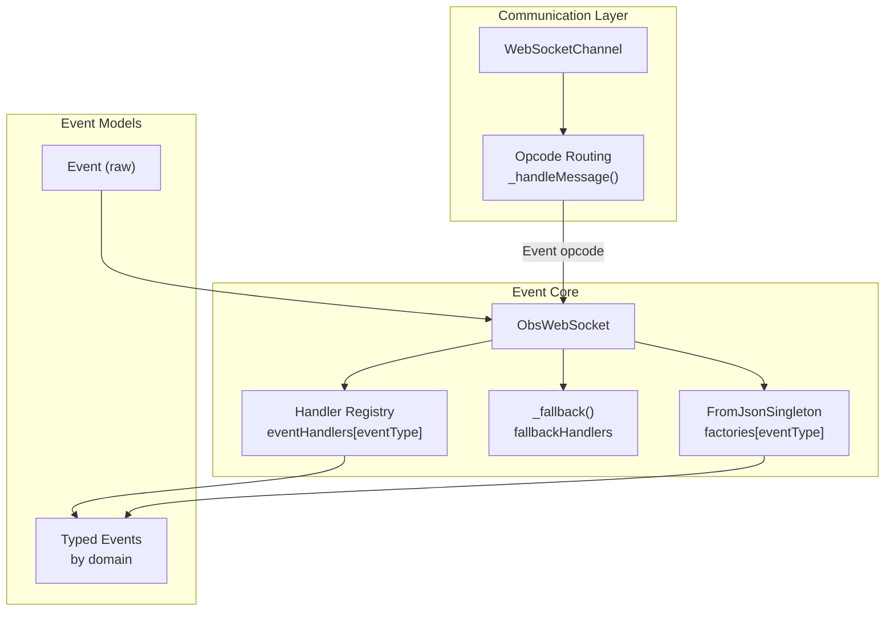
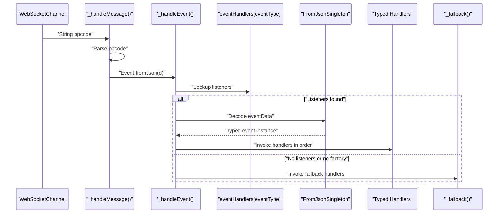
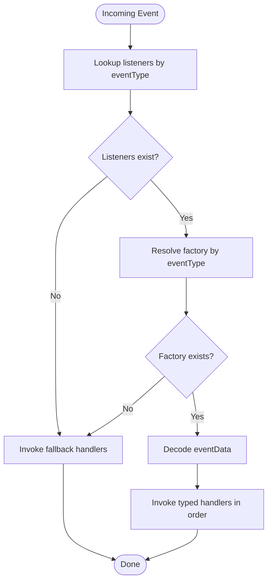
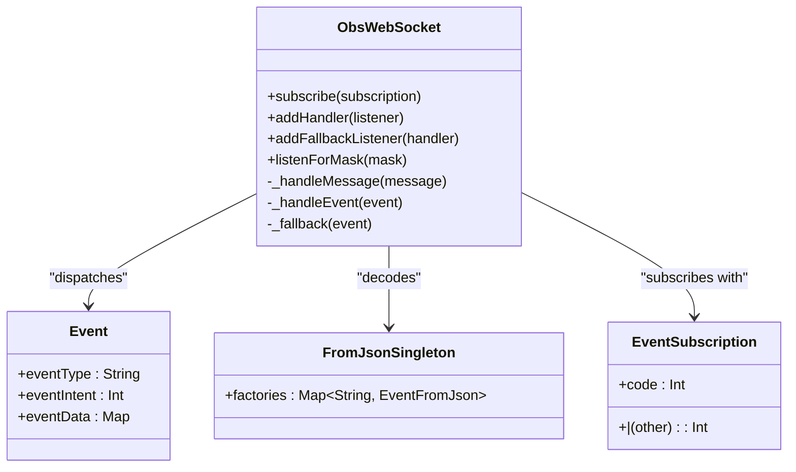

# Event-Driven Architecture

<cite>
**Referenced Files in This Document**
- [obs_websocket_base.dart](file://lib/src/obs_websocket_base.dart)
- [from_json_singleton.dart](file://lib/src/from_json_singleton.dart)
- [enum.dart](file://lib/src/util/enum.dart)
- [event.dart](file://lib/src/model/comm/event.dart)
- [event.dart](file://lib/event.dart)
- [event.dart](file://example/event.dart)
</cite>

## Table of Contents
1. [Introduction](#introduction)
2. [Project Structure](#project-structure)
3. [Core Components](#core-components)
4. [Architecture Overview](#architecture-overview)
5. [Detailed Component Analysis](#detailed-component-analysis)
6. [Dependency Analysis](#dependency-analysis)
7. [Performance Considerations](#performance-considerations)
8. [Troubleshooting Guide](#troubleshooting-guide)
9. [Conclusion](#conclusion)

## Introduction
This document explains the event-driven architecture used by the OBS WebSocket Dart library. It focuses on the observer pattern implementation for event handling, including event subscription mechanisms, handler registration, event dispatching, and the fallback event handler mechanism for unhandled events. It also covers event type categorization, ordering guarantees, error handling, and performance considerations for high-frequency event streams.

## Project Structure
The event system spans several modules:
- Communication and protocol handling: WebSocket message parsing, opcode routing, and handshake.
- Event subscription and dispatch: Subscription masks, handler registration, and event routing.
- Typed event decoding: A centralized factory mapping event names to typed models.
- Event models: Strongly typed event classes grouped by domain (config, general, inputs, outputs, scenes, scene_items, ui).

**Diagram sources**
- [obs_websocket_base.dart:180-236](file://lib/src/obs_websocket_base.dart#L180-L236)
- [obs_websocket_base.dart:374-395](file://lib/src/obs_websocket_base.dart#L374-L395)
- [from_json_singleton.dart:9-92](file://lib/src/from_json_singleton.dart#L9-L92)
- [event.dart:10-30](file://lib/src/model/comm/event.dart#L10-L30)

**Section sources**
- [obs_websocket_base.dart:1-513](file://lib/src/obs_websocket_base.dart#L1-L513)
- [enum.dart:62-87](file://lib/src/util/enum.dart#L62-L87)
- [from_json_singleton.dart:1-100](file://lib/src/from_json_singleton.dart#L1-L100)
- [event.dart:1-31](file://lib/src/model/comm/event.dart#L1-L31)

## Core Components
- ObsWebSocket: Central orchestrator for connection, handshake, subscription, and event dispatch. Provides APIs to subscribe via masks or enums, register typed and fallback handlers, and close gracefully.
- EventSubscription: Enum-based bitmask representing categories of events (general, config, scenes, inputs, outputs, sceneItems, mediaInputs, vendors, ui, plus specialized flags).
- Event: Lightweight container for raw event data received from the WebSocket.
- FromJsonSingleton: Centralized factory mapping event names to typed event constructors.
- Handler Registry: A map keyed by event type string to lists of typed handlers.

Key responsibilities:
- Subscription: Convert EventSubscription or integer masks into a re-identify opcode to enable server-side event delivery.
- Dispatch: Route incoming Event opcodes to typed handlers by event type, falling back to a global fallback handler when no typed decoder exists.
- Decoding: Use the factory to decode raw event data into strongly typed models.

**Section sources**
- [obs_websocket_base.dart:337-372](file://lib/src/obs_websocket_base.dart#L337-L372)
- [obs_websocket_base.dart:374-395](file://lib/src/obs_websocket_base.dart#L374-L395)
- [enum.dart:62-87](file://lib/src/util/enum.dart#L62-L87)
- [event.dart:10-30](file://lib/src/model/comm/event.dart#L10-L30)
- [from_json_singleton.dart:9-92](file://lib/src/from_json_singleton.dart#L9-L92)

## Architecture Overview
The event pipeline follows a clear flow:
1. WebSocket receives an opcode.
2. The message router identifies it as an event and parses it into an Event object.
3. The dispatcher resolves typed handlers by event type and attempts to decode the event payload via the factory.
4. If a typed handler exists and decoding succeeds, handlers are invoked in registration order.
5. If no typed handler or no factory exists, the fallback handler(s) receive the raw Event.

**Diagram sources**
- [obs_websocket_base.dart:180-236](file://lib/src/obs_websocket_base.dart#L180-L236)
- [obs_websocket_base.dart:374-395](file://lib/src/obs_websocket_base.dart#L374-L395)
- [from_json_singleton.dart:9-92](file://lib/src/from_json_singleton.dart#L9-L92)

## Detailed Component Analysis

### EventSubscription System
EventSubscription defines a bitmask of event categories and specialized flags. Subscriptions can be combined using bitwise OR and passed to subscribe(), which computes a mask and sends a re-identify opcode to the server.

- Categories: general, config, scenes, inputs, transitions, filters, outputs, sceneItems, mediaInputs, vendors, ui.
- Specialized flags: inputVolumeMeters, inputActiveStateChanged, inputShowStateChanged, sceneItemTransformChanged.
- Combination operator: Bitwise OR via operator |.

Practical usage:
- Subscribe to a single category or combine multiple categories.
- Pass either a single EventSubscription, an iterable, or a raw integer mask.

**Section sources**
- [enum.dart:62-87](file://lib/src/util/enum.dart#L62-L87)
- [obs_websocket_base.dart:352-372](file://lib/src/obs_websocket_base.dart#L352-L372)

### Handler Registration and Dispatch
ObsWebSocket maintains a registry of typed handlers keyed by the runtime type’s string representation. Handlers are invoked in the order they were registered.

- addHandler<T>: Registers a typed handler for type T.
- removeHandler<T>: Removes all handlers for type T (or attempts removal of a specific listener reference).
- addFallbackListener/removeFallbackListener: Manage fallback handlers invoked when no typed handler exists or decoding fails.

Dispatch logic:
- Lookup listeners by event.eventType.
- If none found, invoke fallback handlers.
- Resolve factory by event.eventType; if none, invoke fallback handlers.
- Decode eventData using the factory and invoke each typed handler.

**Diagram sources**
- [obs_websocket_base.dart:374-395](file://lib/src/obs_websocket_base.dart#L374-L395)
- [from_json_singleton.dart:9-92](file://lib/src/from_json_singleton.dart#L9-L92)

**Section sources**
- [obs_websocket_base.dart:410-439](file://lib/src/obs_websocket_base.dart#L410-L439)
- [obs_websocket_base.dart:374-395](file://lib/src/obs_websocket_base.dart#L374-L395)

### Fallback Event Handler Mechanism
When an event lacks a typed handler or a typed decoder, the fallback mechanism ensures no event is dropped. Applications can register a fallback handler to inspect raw event data or implement dynamic behavior.

- Fallback invocation occurs when:
  - No listeners are registered for the event type.
  - No factory exists for the event type.
- Fallback handlers receive the raw Event object and can inspect eventType and eventData.

Dynamic handler creation:
- Not implemented in code; however, fallback handlers can inspect eventType and construct or route to custom handlers dynamically.

**Section sources**
- [obs_websocket_base.dart:431-446](file://lib/src/obs_websocket_base.dart#L431-L446)
- [obs_websocket_base.dart:374-395](file://lib/src/obs_websocket_base.dart#L374-L395)
- [from_json_singleton.dart:9-92](file://lib/src/from_json_singleton.dart#L9-L92)

### Event Type Categorization and Processing
Events are categorized by domain and mapped to typed models. The export surface organizes event models by domain, while the factory maps event names to constructors.

- Domains represented in exports: config, general, inputs, outputs, scenes, scene_items, ui.
- Factory coverage includes all exported event names across domains.

Processing steps:
- Incoming Event contains eventType and eventData.
- Factory maps eventType to a typed constructor.
- Typed constructor validates and constructs the strongly typed model.
- Typed handlers receive the constructed model.

**Section sources**
- [event.dart:1-50](file://lib/event.dart#L1-L50)
- [from_json_singleton.dart:9-92](file://lib/src/from_json_singleton.dart#L9-L92)
- [event.dart:10-30](file://lib/src/model/comm/event.dart#L10-L30)

### Practical Examples
- Subscribing to specific events:
  - Combine EventSubscription flags using bitwise OR and pass to subscribe().
- Registering custom event handlers:
  - Use addHandler<T>() with the desired typed event class.
- Implementing event-driven workflows:
  - Chain actions upon receiving typed events (e.g., reacting to scene changes, input volume changes, exit started).

Example usage references:
- Subscribing to a combination of categories and a specialized flag.
- Registering handlers for scene name changes, scene list changes, input audio balance changes, input volume meters, and exit started.

**Section sources**
- [event.dart:21-44](file://example/event.dart#L21-L44)
- [enum.dart:62-87](file://lib/src/util/enum.dart#L62-L87)
- [obs_websocket_base.dart:410-414](file://lib/src/obs_websocket_base.dart#L410-L414)

## Dependency Analysis
The event system exhibits low coupling and clear separation of concerns:
- ObsWebSocket depends on:
  - WebSocketChannel for transport.
  - FromJsonSingleton for decoding.
  - EventSubscription for subscription masks.
- FromJsonSingleton depends on:
  - Exported event models to provide factories.
- Event models depend on:
  - Base classes and json_serializable annotations.

**Diagram sources**
- [obs_websocket_base.dart:337-395](file://lib/src/obs_websocket_base.dart#L337-L395)
- [from_json_singleton.dart:9-92](file://lib/src/from_json_singleton.dart#L9-L92)
- [event.dart:10-30](file://lib/src/model/comm/event.dart#L10-L30)
- [enum.dart:62-87](file://lib/src/util/enum.dart#L62-L87)

**Section sources**
- [obs_websocket_base.dart:1-513](file://lib/src/obs_websocket_base.dart#L1-L513)
- [from_json_singleton.dart:1-100](file://lib/src/from_json_singleton.dart#L1-L100)
- [event.dart:1-31](file://lib/src/model/comm/event.dart#L1-L31)
- [enum.dart:1-88](file://lib/src/util/enum.dart#L1-L88)

## Performance Considerations
- Handler invocation order: Typed handlers are invoked in registration order; avoid heavy synchronous work inside handlers to prevent backpressure.
- Event decoding cost: Factories are simple lookups; decoding cost depends on the complexity of individual event models.
- Subscription granularity: Use specific EventSubscription flags to minimize unnecessary event traffic.
- Backpressure handling: The library does not buffer events; slow handlers can cause delays. Consider offloading work to isolates or queues.
- Batch requests: While not part of the event pipeline, batched requests can reduce overhead when issuing many commands.

[No sources needed since this section provides general guidance]

## Troubleshooting Guide
Common issues and resolutions:
- No handlers invoked:
  - Ensure subscribe() was called with the correct EventSubscription mask.
  - Verify addHandler<T>() is called with the correct event type.
- Fallback invoked unexpectedly:
  - Confirm the event name exists in the factory mapping.
  - Check that the event model is exported and compiled.
- Event ordering:
  - Handlers are invoked in registration order; if strict ordering is required, consolidate logic into a single handler or sequence operations synchronously.
- Error handling:
  - The library logs malformed frames and stream errors and fails pending requests with timeouts.
  - For request failures, exceptions are thrown with request status details.

**Section sources**
- [obs_websocket_base.dart:180-258](file://lib/src/obs_websocket_base.dart#L180-L258)
- [obs_websocket_base.dart:498-511](file://lib/src/obs_websocket_base.dart#L498-L511)

## Conclusion
The library implements a robust event-driven architecture centered on the observer pattern:
- EventSubscription enables fine-grained control over event delivery.
- Typed handlers provide compile-time safety and predictable decoding.
- The fallback mechanism ensures resilience for unknown or unsupported events.
- The design supports high-frequency streams with minimal overhead, while maintaining clarity and extensibility.