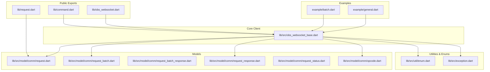
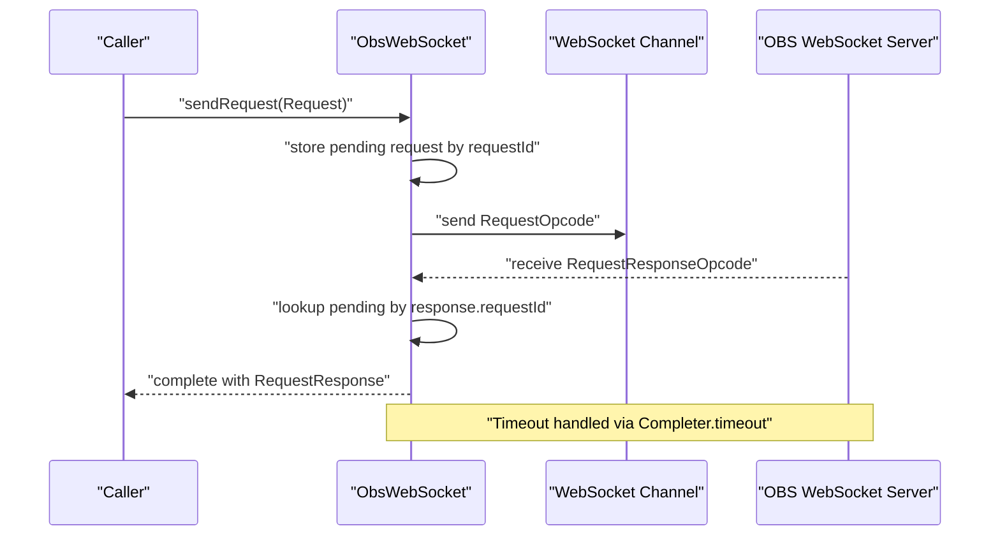
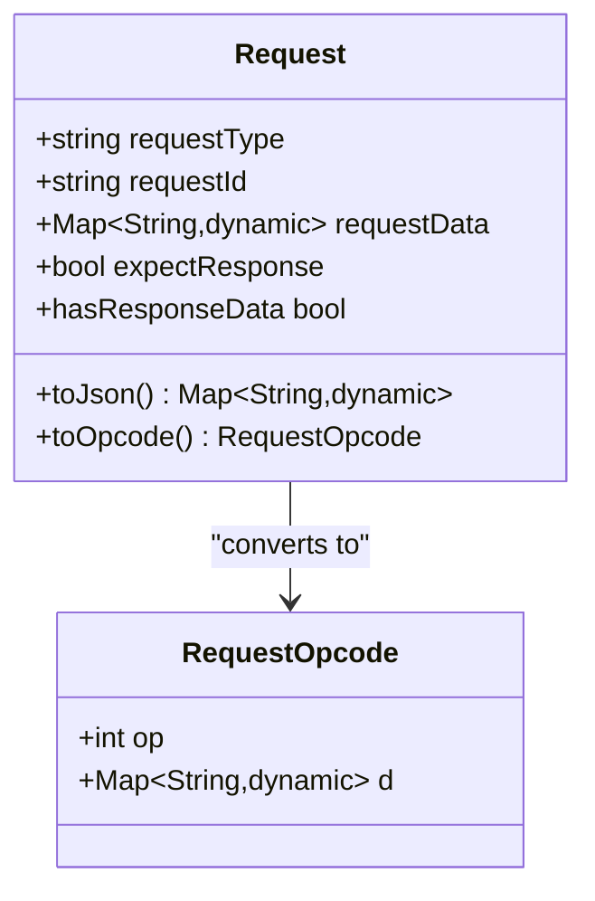
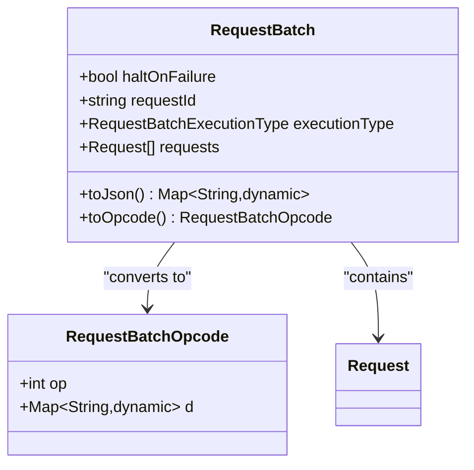
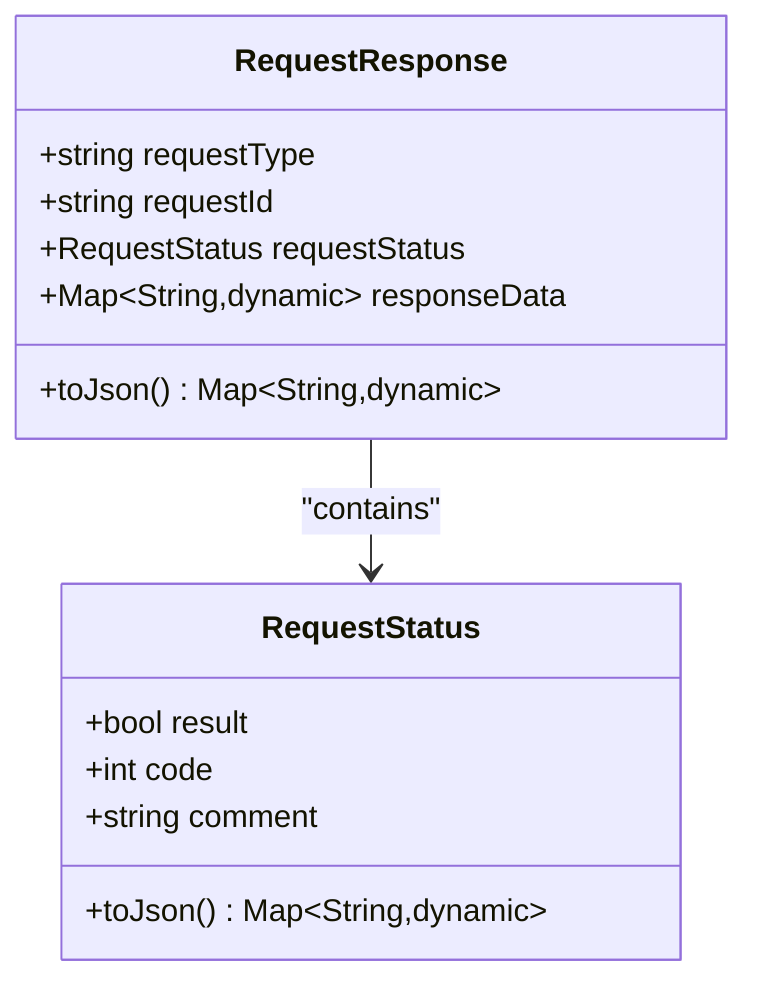
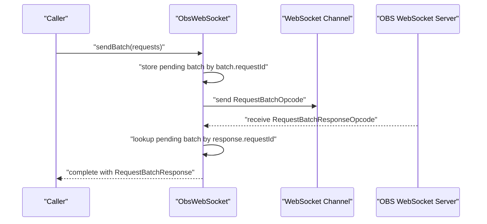
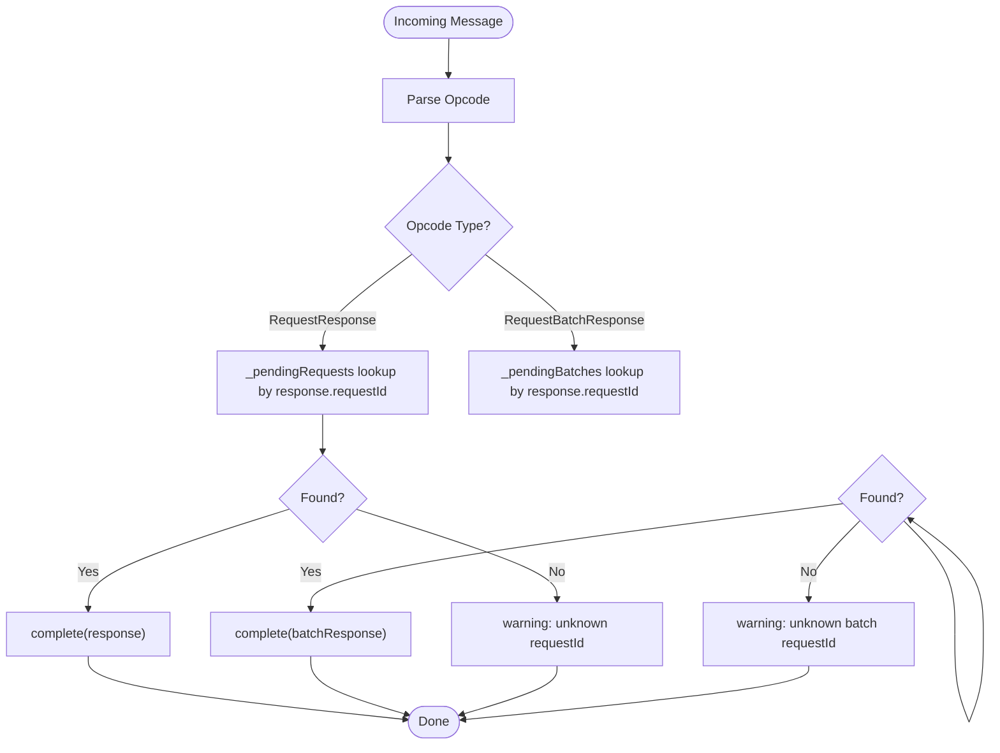
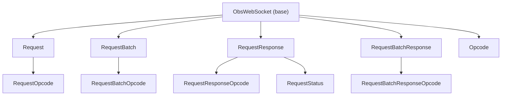

# Request-Response Model and Batch Processing

<cite>
**Referenced Files in This Document**
- [lib/request.dart](file://lib/request.dart)
- [lib/command.dart](file://lib/command.dart)
- [lib/obs_websocket.dart](file://lib/obs_websocket.dart)
- [lib/src/obs_websocket_base.dart](file://lib/src/obs_websocket_base.dart)
- [lib/src/model/comm/request.dart](file://lib/src/model/comm/request.dart)
- [lib/src/model/comm/request_batch.dart](file://lib/src/model/comm/request_batch.dart)
- [lib/src/model/comm/request_batch_response.dart](file://lib/src/model/comm/request_batch_response.dart)
- [lib/src/model/comm/request_response.dart](file://lib/src/model/comm/request_response.dart)
- [lib/src/model/comm/request_status.dart](file://lib/src/model/comm/request_status.dart)
- [lib/src/model/comm/opcode.dart](file://lib/src/model/comm/opcode.dart)
- [lib/src/exception.dart](file://lib/src/exception.dart)
- [lib/src/util/enum.dart](file://lib/src/util/enum.dart)
- [example/batch.dart](file://example/batch.dart)
- [example/general.dart](file://example/general.dart)
</cite>

## Table of Contents
1. [Introduction](#introduction)
2. [Project Structure](#project-structure)
3. [Core Components](#core-components)
4. [Architecture Overview](#architecture-overview)
5. [Detailed Component Analysis](#detailed-component-analysis)
6. [Dependency Analysis](#dependency-analysis)
7. [Performance Considerations](#performance-considerations)
8. [Troubleshooting Guide](#troubleshooting-guide)
9. [Conclusion](#conclusion)
10. [Appendices](#appendices)

## Introduction
This document explains the request-response model and batch processing capabilities of the OBS Websocket client library. It covers the synchronous request-response pattern with request ID correlation, error handling mechanisms, and response validation. It documents the Request class structure, parameter handling, and response parsing. It also details batch request processing, including RequestBatch construction, individual request tracking, and batch result aggregation. Practical examples demonstrate single requests, batch operations, and error handling strategies. Finally, it addresses request queuing, timeout management, and performance optimization for high-throughput scenarios, along with the relationship between requests and responses, including requestId matching and response validation.

## Project Structure
The request-response and batch processing logic is implemented across several modules:
- Public exports for request categories and command helpers
- Core WebSocket client with request/response orchestration
- Data models for requests, responses, statuses, and opcodes
- Enumerations for opcodes, request status codes, and batch execution types
- Examples demonstrating single and batch operations

**Diagram sources**
- [lib/request.dart:1-19](file://lib/request.dart#L1-L19)
- [lib/command.dart:1-20](file://lib/command.dart#L1-L20)
- [lib/obs_websocket.dart:1-69](file://lib/obs_websocket.dart#L1-L69)
- [lib/src/obs_websocket_base.dart:1-513](file://lib/src/obs_websocket_base.dart#L1-L513)
- [lib/src/model/comm/request.dart:1-38](file://lib/src/model/comm/request.dart#L1-L38)
- [lib/src/model/comm/request_batch.dart:1-40](file://lib/src/model/comm/request_batch.dart#L1-L40)
- [lib/src/model/comm/request_batch_response.dart:1-23](file://lib/src/model/comm/request_batch_response.dart#L1-L23)
- [lib/src/model/comm/request_response.dart:1-31](file://lib/src/model/comm/request_response.dart#L1-L31)
- [lib/src/model/comm/request_status.dart:1-27](file://lib/src/model/comm/request_status.dart#L1-L27)
- [lib/src/model/comm/opcode.dart:1-87](file://lib/src/model/comm/opcode.dart#L1-L87)
- [lib/src/util/enum.dart:1-88](file://lib/src/util/enum.dart#L1-L88)
- [lib/src/exception.dart:1-77](file://lib/src/exception.dart#L1-L77)
- [example/batch.dart:1-30](file://example/batch.dart#L1-L30)
- [example/general.dart:1-154](file://example/general.dart#L1-L154)

**Section sources**
- [lib/request.dart:1-19](file://lib/request.dart#L1-L19)
- [lib/command.dart:1-20](file://lib/command.dart#L1-L20)
- [lib/obs_websocket.dart:1-69](file://lib/obs_websocket.dart#L1-L69)

## Core Components
This section documents the core data structures and their roles in the request-response model and batch processing.

- Request: Encapsulates a single request with requestType, requestId, requestData, and expectResponse. It serializes to an opcode and determines whether a response body is expected based on the request type.
- RequestBatch: Encapsulates a collection of Request items with batch-wide settings such as haltOnFailure, executionType, and a batch-level requestId. It serializes to an opcode for batch execution.
- RequestResponse: Represents a single request’s response, including requestType, requestId, requestStatus, and optional responseData.
- RequestBatchResponse: Aggregates results for a RequestBatch, pairing each Request with its corresponding RequestResponse.
- RequestStatus: Encodes the outcome of a request with result, code, and comment.
- Opcode: The transport envelope carrying opcodes and payloads for handshake, requests, responses, and batch variants.

Key behaviors:
- Request automatically generates a unique requestId and sets expectResponse based on requestType heuristics.
- RequestBatch generates a unique requestId and serializes each contained Request.
- RequestResponse validates that responses correspond to the originating request via requestId.
- RequestBatchResponse aggregates per-request results and matches them to the originating batch via requestId.

**Section sources**
- [lib/src/model/comm/request.dart:10-38](file://lib/src/model/comm/request.dart#L10-L38)
- [lib/src/model/comm/request_batch.dart:12-40](file://lib/src/model/comm/request_batch.dart#L12-L40)
- [lib/src/model/comm/request_response.dart:9-31](file://lib/src/model/comm/request_response.dart#L9-L31)
- [lib/src/model/comm/request_batch_response.dart:8-23](file://lib/src/model/comm/request_batch_response.dart#L8-L23)
- [lib/src/model/comm/request_status.dart:7-27](file://lib/src/model/comm/request_status.dart#L7-L27)
- [lib/src/model/comm/opcode.dart:8-87](file://lib/src/model/comm/opcode.dart#L8-L87)

## Architecture Overview
The request-response architecture centers on ObsWebSocket, which manages:
- Outgoing request orchestration and correlation via requestId
- Incoming response routing to pending completers
- Batch request submission and result aggregation
- Timeout management and error propagation
- Handshake and authentication flow

**Diagram sources**
- [lib/src/obs_websocket_base.dart:448-501](file://lib/src/obs_websocket_base.dart#L448-L501)
- [lib/src/model/comm/opcode.dart:54-69](file://lib/src/model/comm/opcode.dart#L54-L69)
- [lib/src/model/comm/request_response.dart:9-31](file://lib/src/model/comm/request_response.dart#L9-L31)

**Section sources**
- [lib/src/obs_websocket_base.dart:448-501](file://lib/src/obs_websocket_base.dart#L448-L501)

## Detailed Component Analysis

### Request Class Analysis
The Request class encapsulates a single request:
- Fields: requestType, requestId, requestData, expectResponse
- Behavior:
  - Generates a unique requestId using a UUID generator
  - Sets expectResponse based on requestType heuristic (defaults to true for “Get”-style requests)
  - Serializes to JSON suitable for transport
  - Converts to RequestOpcode for network transmission

**Diagram sources**
- [lib/src/model/comm/request.dart:10-38](file://lib/src/model/comm/request.dart#L10-L38)
- [lib/src/model/comm/opcode.dart:54-59](file://lib/src/model/comm/opcode.dart#L54-L59)

**Section sources**
- [lib/src/model/comm/request.dart:10-38](file://lib/src/model/comm/request.dart#L10-L38)

### RequestBatch Construction and Execution
RequestBatch aggregates multiple Request items:
- Fields: haltOnFailure, requestId, executionType, requests
- Behavior:
  - Generates a unique batch-level requestId
  - Serializes each contained Request
  - Converts to RequestBatchOpcode for batch execution
  - Supports execution types: serialRealtime, serialFrame, parallel

**Diagram sources**
- [lib/src/model/comm/request_batch.dart:12-40](file://lib/src/model/comm/request_batch.dart#L12-L40)
- [lib/src/model/comm/opcode.dart:71-76](file://lib/src/model/comm/opcode.dart#L71-L76)
- [lib/src/util/enum.dart:52-60](file://lib/src/util/enum.dart#L52-L60)

**Section sources**
- [lib/src/model/comm/request_batch.dart:12-40](file://lib/src/model/comm/request_batch.dart#L12-L40)
- [lib/src/util/enum.dart:52-60](file://lib/src/util/enum.dart#L52-L60)

### RequestResponse and RequestStatus Validation
RequestResponse carries the server’s response:
- Fields: requestType, requestId, requestStatus, responseData
- Validation:
  - _checkResponse enforces that requests expecting a response body succeed when requestStatus.result is false
  - Throws ObsRequestException with requestType, code, and comment for failures

**Diagram sources**
- [lib/src/model/comm/request_response.dart:9-31](file://lib/src/model/comm/request_response.dart#L9-L31)
- [lib/src/model/comm/request_status.dart:7-27](file://lib/src/model/comm/request_status.dart#L7-L27)

**Section sources**
- [lib/src/model/comm/request_response.dart:9-31](file://lib/src/model/comm/request_response.dart#L9-L31)
- [lib/src/model/comm/request_status.dart:7-27](file://lib/src/model/comm/request_status.dart#L7-L27)
- [lib/src/obs_websocket_base.dart:503-511](file://lib/src/obs_websocket_base.dart#L503-L511)

### Batch Result Aggregation
RequestBatchResponse aggregates per-request results:
- Fields: requestId (matches the batch), results (List of RequestResponse)
- Behavior:
  - sendBatch constructs a RequestBatch, stores a Completer keyed by batch requestId, sends RequestBatchOpcode
  - On receiving RequestBatchResponseOpcode, routes to the matching Completer and completes with RequestBatchResponse
  - Results preserve order and correlation with the submitted requests

**Diagram sources**
- [lib/src/obs_websocket_base.dart:451-473](file://lib/src/obs_websocket_base.dart#L451-L473)
- [lib/src/model/comm/request_batch_response.dart:8-23](file://lib/src/model/comm/request_batch_response.dart#L8-L23)
- [lib/src/model/comm/opcode.dart:78-85](file://lib/src/model/comm/opcode.dart#L78-L85)

**Section sources**
- [lib/src/obs_websocket_base.dart:451-473](file://lib/src/obs_websocket_base.dart#L451-L473)
- [lib/src/model/comm/request_batch_response.dart:8-23](file://lib/src/model/comm/request_batch_response.dart#L8-L23)

### Request Correlation and Matching
RequestId correlation ensures accurate response routing:
- Pending requests are stored in _pendingRequests keyed by request.requestId
- Pending batches are stored in _pendingBatches keyed by batch.requestId
- Incoming responses are matched by requestId and routed to the appropriate Completer
- Unknown requestIds produce warnings and are ignored

**Diagram sources**
- [lib/src/obs_websocket_base.dart:180-236](file://lib/src/obs_websocket_base.dart#L180-L236)

**Section sources**
- [lib/src/obs_websocket_base.dart:180-236](file://lib/src/obs_websocket_base.dart#L180-L236)

### Parameter Handling and Helpers
Parameter handling is straightforward:
- requestData is a Map<String, dynamic> passed to Request
- Helper methods in request categories (e.g., General) construct Request instances with appropriate requestData and parse response payloads into typed models

Example usage patterns:
- Single request via send or sendRequest
- Batch request via sendBatch
- Typed helpers in request categories for convenience

**Section sources**
- [lib/src/model/comm/request.dart:19-33](file://lib/src/model/comm/request.dart#L19-L33)
- [lib/src/request/general.dart:21-25](file://lib/src/request/general.dart#L21-L25)
- [lib/src/request/general.dart:103-107](file://lib/src/request/general.dart#L103-L107)
- [example/batch.dart:17-28](file://example/batch.dart#L17-L28)
- [example/general.dart:78-90](file://example/general.dart#L78-L90)

## Dependency Analysis
The following diagram shows key dependencies among core components:

**Diagram sources**
- [lib/src/obs_websocket_base.dart:448-501](file://lib/src/obs_websocket_base.dart#L448-L501)
- [lib/src/model/comm/request.dart:27](file://lib/src/model/comm/request.dart#L27)
- [lib/src/model/comm/request_batch.dart:28](file://lib/src/model/comm/request_batch.dart#L28)
- [lib/src/model/comm/request_response.dart:23](file://lib/src/model/comm/request_response.dart#L23)
- [lib/src/model/comm/request_batch_response.dart:15](file://lib/src/model/comm/request_batch_response.dart#L15)
- [lib/src/model/comm/opcode.dart:54-85](file://lib/src/model/comm/opcode.dart#L54-L85)

**Section sources**
- [lib/src/obs_websocket_base.dart:448-501](file://lib/src/obs_websocket_base.dart#L448-L501)
- [lib/src/model/comm/opcode.dart:54-85](file://lib/src/model/comm/opcode.dart#L54-L85)

## Performance Considerations
- Timeout management: Both single requests and batch requests enforce timeouts using Completer.timeout. Adjust requestTimeout according to network conditions and workload.
- Concurrency: Pending requests and batches are tracked separately in _pendingRequests and _pendingBatches. This enables concurrent operations without cross-contamination.
- Batch execution types: Choose executionType based on desired throughput and ordering guarantees. Parallel execution maximizes throughput, while serialRealtime or serialFrame preserves timing semantics.
- Logging overhead: Debug logging can be enabled via LogOptions. For production, reduce verbosity to minimize overhead.
- Backpressure: The library relies on WebSocket backpressure. For very high-throughput scenarios, consider batching and rate limiting at the application level.

[No sources needed since this section provides general guidance]

## Troubleshooting Guide
Common issues and resolutions:
- Unknown requestId: Incoming responses that do not match any pending request are logged as warnings and ignored. Ensure requestIds are preserved and not reused.
- Timeout errors: ObsTimeoutException indicates the operation did not complete within requestTimeout. Increase timeout or optimize network conditions.
- Request failures: ObsRequestException indicates a non-success status from OBS. Inspect requestStatus.code and comment for actionable details.
- Protocol decoding errors: ObsProtocolException signals malformed data. Verify server compatibility and payload correctness.
- Stream errors: On websocket stream errors, all pending requests and batches are failed immediately to prevent deadlocks.

**Section sources**
- [lib/src/obs_websocket_base.dart:208-225](file://lib/src/obs_websocket_base.dart#L208-L225)
- [lib/src/obs_websocket_base.dart:242-257](file://lib/src/obs_websocket_base.dart#L242-L257)
- [lib/src/exception.dart:59-71](file://lib/src/exception.dart#L59-L71)
- [lib/src/obs_websocket_base.dart:503-511](file://lib/src/obs_websocket_base.dart#L503-L511)

## Conclusion
The OBS Websocket client implements a robust request-response model with strong request ID correlation and comprehensive error handling. Single requests and batch operations share the same correlation and timeout mechanisms, enabling predictable behavior under load. The design supports high-throughput scenarios through batching and configurable execution types, while maintaining clear separation between request orchestration, response validation, and error propagation.

[No sources needed since this section summarizes without analyzing specific files]

## Appendices

### Practical Examples

- Single request example:
  - Demonstrates sending a request via send and retrieving response status and data
  - Example path: [example/general.dart:78-90](file://example/general.dart#L78-L90)

- Batch request example:
  - Demonstrates constructing a list of Request items and sending them as a batch
  - Example path: [example/batch.dart:17-28](file://example/batch.dart#L17-L28)

- Parameter handling:
  - requestData is passed as a Map<String, dynamic> to Request
  - Example path: [lib/src/model/comm/request.dart:19-33](file://lib/src/model/comm/request.dart#L19-L33)

- Response parsing:
  - Typed responses are parsed into model classes (e.g., VersionResponse)
  - Example path: [lib/src/request/general.dart:21-25](file://lib/src/request/general.dart#L21-L25)

**Section sources**
- [example/general.dart:78-90](file://example/general.dart#L78-L90)
- [example/batch.dart:17-28](file://example/batch.dart#L17-L28)
- [lib/src/model/comm/request.dart:19-33](file://lib/src/model/comm/request.dart#L19-L33)
- [lib/src/request/general.dart:21-25](file://lib/src/request/general.dart#L21-L25)