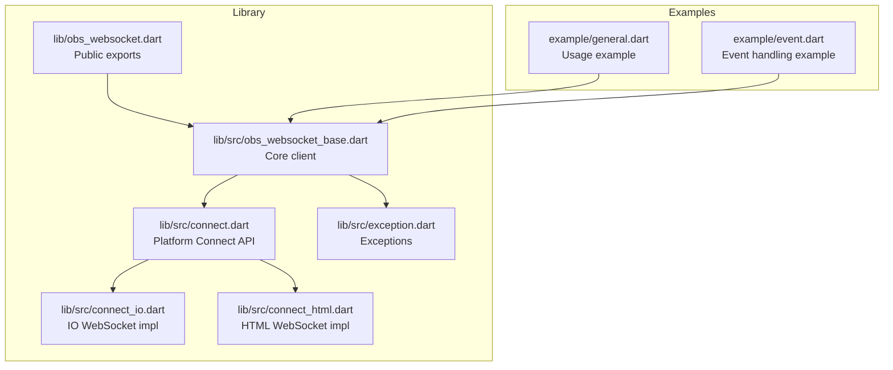
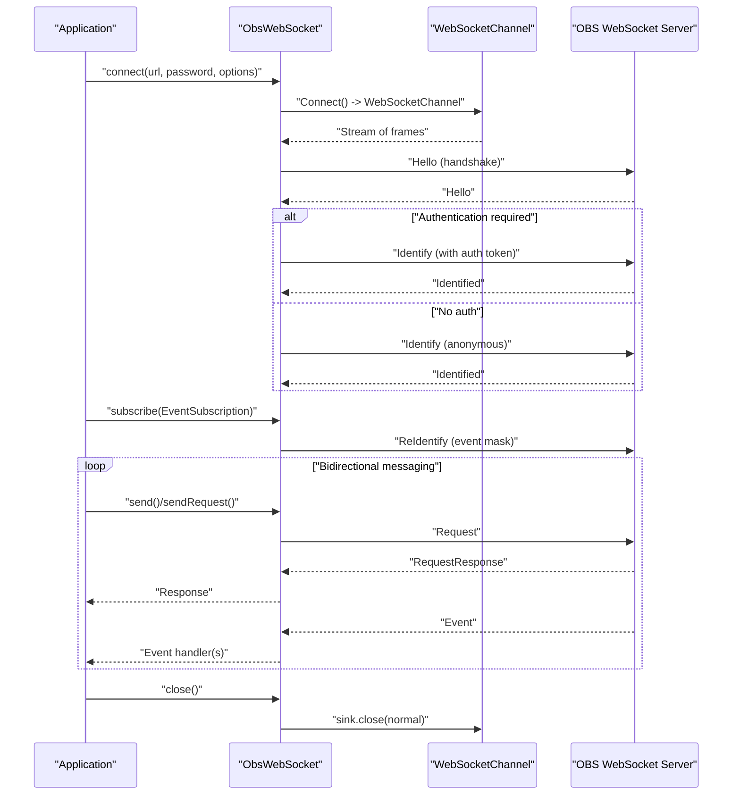
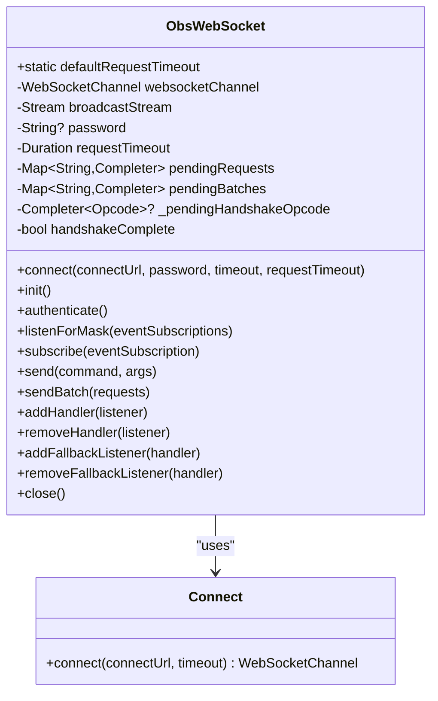
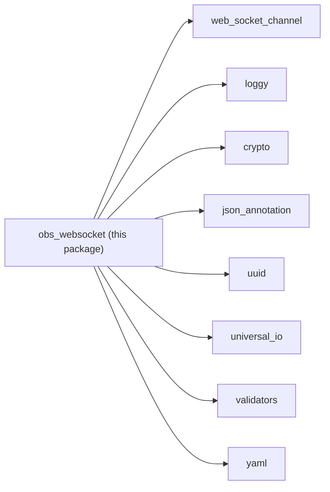

# WebSocket Fundamentals

<cite>
**Referenced Files in This Document**
- [README.md](file://README.md)
- [pubspec.yaml](file://pubspec.yaml)
- [lib/obs_websocket.dart](file://lib/obs_websocket.dart)
- [lib/src/obs_websocket_base.dart](file://lib/src/obs_websocket_base.dart)
- [lib/src/connect.dart](file://lib/src/connect.dart)
- [lib/src/connect_api.dart](file://lib/src/connect_api.dart)
- [lib/src/connect_io.dart](file://lib/src/connect_io.dart)
- [lib/src/connect_html.dart](file://lib/src/connect_html.dart)
- [lib/src/exception.dart](file://lib/src/exception.dart)
- [example/general.dart](file://example/general.dart)
- [example/event.dart](file://example/event.dart)
</cite>

## Table of Contents
1. [Introduction](#introduction)
2. [Project Structure](#project-structure)
3. [Core Components](#core-components)
4. [Architecture Overview](#architecture-overview)
5. [Detailed Component Analysis](#detailed-component-analysis)
6. [Dependency Analysis](#dependency-analysis)
7. [Performance Considerations](#performance-considerations)
8. [Troubleshooting Guide](#troubleshooting-guide)
9. [Conclusion](#conclusion)

## Introduction
This document explains WebSocket fundamentals as applied to OBS control using the obs_websocket Dart package. It covers protocol basics (connection establishment, message framing, and bidirectional communication), the library’s implementation using web_socket_channel, connection lifecycle management, timeouts and error recovery, and the broadcast stream mechanism enabling multiple listeners. Practical examples demonstrate connecting to OBS, handling connection states, and managing lifecycle. Security considerations, connection pooling strategies, and performance optimizations for real-time OBS control are also addressed.

## Project Structure
The obs_websocket package centers around a WebSocket client that speaks the obs-websocket protocol. Key elements:
- Public API exports and model/response/request definitions
- Core WebSocket client implementation
- Platform abstraction for WebSocket creation
- Examples demonstrating connection, subscriptions, and lifecycle

**Diagram sources**
- [lib/obs_websocket.dart:1-69](file://lib/obs_websocket.dart#L1-L69)
- [lib/src/obs_websocket_base.dart:1-515](file://lib/src/obs_websocket_base.dart#L1-L515)
- [lib/src/connect.dart:1-15](file://lib/src/connect.dart#L1-L15)
- [lib/src/connect_io.dart](file://lib/src/connect_io.dart)
- [lib/src/connect_html.dart](file://lib/src/connect_html.dart)
- [lib/src/exception.dart:1-77](file://lib/src/exception.dart#L1-L77)
- [example/general.dart:1-152](file://example/general.dart#L1-L152)
- [example/event.dart:1-44](file://example/event.dart#L1-L44)

**Section sources**
- [lib/obs_websocket.dart:1-69](file://lib/obs_websocket.dart#L1-L69)
- [lib/src/obs_websocket_base.dart:1-515](file://lib/src/obs_websocket_base.dart#L1-L515)
- [lib/src/connect.dart:1-15](file://lib/src/connect.dart#L1-L15)
- [pubspec.yaml:13-22](file://pubspec.yaml#L13-L22)
- [README.md:66-104](file://README.md#L66-L104)

## Core Components
- ObsWebSocket: Main client implementing the obs-websocket protocol, including handshake, authentication, request/response routing, event dispatch, and lifecycle management.
- Connect: Platform abstraction for creating WebSocketChannel instances (IO and HTML).
- Exceptions: Structured error types for auth failures, timeouts, protocol errors, and request failures.
- Examples: Demonstrations of connecting, subscribing to events, and closing connections.

Key responsibilities:
- Establish WebSocket connection via web_socket_channel
- Perform obs-websocket handshake and optional authentication
- Route incoming messages to handlers or fallbacks
- Manage request/response correlation via request IDs
- Support event subscriptions and typed event handling
- Provide broadcast stream for multiple listeners

**Section sources**
- [lib/src/obs_websocket_base.dart:21-128](file://lib/src/obs_websocket_base.dart#L21-L128)
- [lib/src/connect.dart:7-14](file://lib/src/connect.dart#L7-L14)
- [lib/src/exception.dart:18-77](file://lib/src/exception.dart#L18-L77)
- [example/general.dart:7-17](file://example/general.dart#L7-L17)
- [example/event.dart:7-17](file://example/event.dart#L7-L17)

## Architecture Overview
The client uses web_socket_channel to manage a persistent WebSocket connection. The ObsWebSocket class:
- Wraps a WebSocketChannel and exposes a broadcast stream
- Listens to incoming frames, parses opcodes, and routes to handlers
- Manages in-flight requests and batches with timeouts
- Performs handshake and optional authentication
- Supports event subscriptions and typed event dispatch

**Diagram sources**
- [lib/src/obs_websocket_base.dart:130-169](file://lib/src/obs_websocket_base.dart#L130-L169)
- [lib/src/obs_websocket_base.dart:260-318](file://lib/src/obs_websocket_base.dart#L260-L318)
- [lib/src/obs_websocket_base.dart:337-372](file://lib/src/obs_websocket_base.dart#L337-L372)
- [lib/src/obs_websocket_base.dart:448-503](file://lib/src/obs_websocket_base.dart#L448-L503)

## Detailed Component Analysis

### ObsWebSocket: Connection Lifecycle and Message Routing
ObsWebSocket manages:
- Connection establishment via Connect abstraction
- Handshake and authentication
- Request/response correlation and batching
- Event subscription and dispatch
- Broadcast stream for multiple listeners
- Graceful closure with onDone hook

**Diagram sources**
- [lib/src/obs_websocket_base.dart:21-128](file://lib/src/obs_websocket_base.dart#L21-L128)
- [lib/src/connect.dart:7-14](file://lib/src/connect.dart#L7-L14)

Key behaviors:
- Connection establishment: ObsWebSocket.connect constructs a WebSocketChannel via Connect and initializes the client.
- Handshake: Waits for Hello, optionally computes auth token, sends Identify, and awaits Identified.
- Message routing: Parses opcodes, dispatches events to typed handlers or fallbacks, resolves pending requests/batches.
- Timeouts: Applies requestTimeout to handshake, Identify, and request/batch responses.
- Event subscriptions: Sends ReIdentify with desired event masks; dispatches events to registered handlers.
- Broadcast stream: Exposes broadcastStream for multiple listeners to receive frames.

Practical usage references:
- Connection and authentication: [example/general.dart:10-17](file://example/general.dart#L10-L17)
- Subscribing to events: [example/event.dart:19-21](file://example/event.dart#L19-L21)
- Closing connection: [example/general.dart:39](file://example/general.dart#L39)

**Section sources**
- [lib/src/obs_websocket_base.dart:130-169](file://lib/src/obs_websocket_base.dart#L130-L169)
- [lib/src/obs_websocket_base.dart:171-178](file://lib/src/obs_websocket_base.dart#L171-L178)
- [lib/src/obs_websocket_base.dart:180-236](file://lib/src/obs_websocket_base.dart#L180-L236)
- [lib/src/obs_websocket_base.dart:260-318](file://lib/src/obs_websocket_base.dart#L260-L318)
- [lib/src/obs_websocket_base.dart:337-372](file://lib/src/obs_websocket_base.dart#L337-L372)
- [lib/src/obs_websocket_base.dart:448-503](file://lib/src/obs_websocket_base.dart#L448-L503)
- [lib/src/obs_websocket_base.dart:398-408](file://lib/src/obs_websocket_base.dart#L398-L408)
- [example/general.dart:10-17](file://example/general.dart#L10-L17)
- [example/event.dart:19-21](file://example/event.dart#L19-L21)

### Broadcast Stream Mechanism
ObsWebSocket creates a broadcast stream from the underlying WebSocketChannel stream, enabling multiple listeners to receive messages simultaneously. This supports:
- Multiple event handlers for the same event type
- Multiple request senders awaiting responses
- Parallel processing of events and responses

Implementation highlights:
- broadcastStream is initialized as a broadcast stream from websocketChannel.stream
- All listeners share the same underlying stream
- Ensures no message duplication across listeners

References:
- Broadcast stream initialization: [lib/src/obs_websocket_base.dart:124](file://lib/src/obs_websocket_base.dart#L124)
- Listener setup during init: [lib/src/obs_websocket_base.dart:172-175](file://lib/src/obs_websocket_base.dart#L172-L175)

**Section sources**
- [lib/src/obs_websocket_base.dart:124](file://lib/src/obs_websocket_base.dart#L124)
- [lib/src/obs_websocket_base.dart:172-175](file://lib/src/obs_websocket_base.dart#L172-L175)

### WebSocket Protocol Basics in OBS Context
- Connection establishment: ObsWebSocket.connect ensures the URL uses ws:// or wss:// and delegates to Connect to create a WebSocketChannel.
- Message framing: Messages are JSON-encoded opcodes containing an opcode field and data payload. The client decodes opcodes and routes accordingly.
- Bidirectional communication: Clients send requests and receive responses; OBS emits events that clients can subscribe to.

References:
- Connection guidance: [README.md:66-86](file://README.md#L66-L86)
- Protocol framing: [lib/src/obs_websocket_base.dart:181-236](file://lib/src/obs_websocket_base.dart#L181-L236)

**Section sources**
- [README.md:66-86](file://README.md#L66-L86)
- [lib/src/obs_websocket_base.dart:181-236](file://lib/src/obs_websocket_base.dart#L181-L236)

### Practical Examples: Establishing Connections and Managing Lifecycle
- Connecting to OBS: Use ObsWebSocket.connect with host, optional password, and logging options.
- Handling connection states: Subscribe to events using subscribe and add typed handlers.
- Managing lifecycle: Close the connection via close to release resources.

References:
- Basic connection and usage: [example/general.dart:10-17](file://example/general.dart#L10-L17)
- Event subscription and handlers: [example/event.dart:19-34](file://example/event.dart#L19-L34)
- Closing connection: [example/general.dart:39](file://example/general.dart#L39)

**Section sources**
- [example/general.dart:10-17](file://example/general.dart#L10-L17)
- [example/event.dart:19-34](file://example/event.dart#L19-L34)
- [example/general.dart:39](file://example/general.dart#L39)

## Dependency Analysis
External dependencies relevant to WebSocket functionality:
- web_socket_channel: Provides WebSocketChannel abstraction for IO and HTML platforms
- loggy: Logging support for debugging and diagnostics
- Other libraries: crypto, json_annotation, uuid, universal_io, validators, yaml

**Diagram sources**
- [pubspec.yaml:13-22](file://pubspec.yaml#L13-L22)

**Section sources**
- [pubspec.yaml:13-22](file://pubspec.yaml#L13-L22)

## Performance Considerations
- Use broadcast streams: Leverage the built-in broadcast stream to avoid duplicating work across multiple listeners.
- Tune timeouts: Adjust requestTimeout to balance responsiveness and reliability for your environment.
- Minimize unnecessary subscriptions: Subscribe only to required event categories to reduce traffic.
- Batch requests: Use sendBatch for grouped operations when supported by the protocol.
- Efficient decoding: Rely on typed factories for events to avoid repeated parsing overhead.
- Resource cleanup: Always close connections to prevent resource leaks and maintain OBS performance.

[No sources needed since this section provides general guidance]

## Troubleshooting Guide
Common issues and remedies:
- Authentication failures: Ensure password matches OBS configuration and verify handshake completion.
- Timeouts: Increase requestTimeout for slow networks or busy OBS instances; inspect ObsTimeoutException details.
- Malformed responses: Verify protocol compliance; inspect ObsProtocolException for decoding errors.
- Unhandled events: Register fallback event handlers to capture unknown events.
- Connection leaks: Always call close to cancel subscriptions and close the WebSocket sink.

References:
- Exception types and messages: [lib/src/exception.dart:18-77](file://lib/src/exception.dart#L18-L77)
- Handshake and authentication logic: [lib/src/obs_websocket_base.dart:260-318](file://lib/src/obs_websocket_base.dart#L260-L318)
- Timeout handling for requests and batches: [lib/src/obs_websocket_base.dart:464-474](file://lib/src/obs_websocket_base.dart#L464-L474)
- Stream error handling and pending request cancellation: [lib/src/obs_websocket_base.dart:238-258](file://lib/src/obs_websocket_base.dart#L238-L258)

**Section sources**
- [lib/src/exception.dart:18-77](file://lib/src/exception.dart#L18-L77)
- [lib/src/obs_websocket_base.dart:260-318](file://lib/src/obs_websocket_base.dart#L260-L318)
- [lib/src/obs_websocket_base.dart:464-474](file://lib/src/obs_websocket_base.dart#L464-L474)
- [lib/src/obs_websocket_base.dart:238-258](file://lib/src/obs_websocket_base.dart#L238-L258)

## Conclusion
The obs_websocket Dart package provides a robust, typed client for the obs-websocket protocol. It leverages web_socket_channel for transport, implements a clear handshake and authentication flow, and offers a broadcast stream for scalable multi-listener architectures. With structured exceptions, configurable timeouts, and comprehensive examples, it enables reliable real-time control of OBS. Apply the recommended performance and troubleshooting practices to ensure smooth operation in production environments.