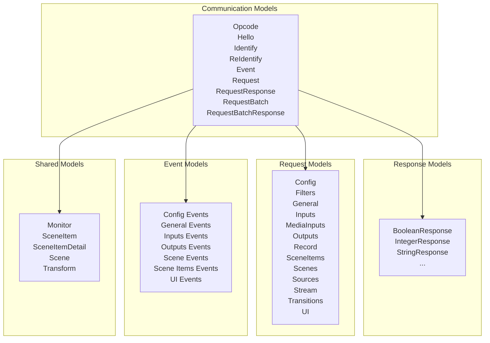
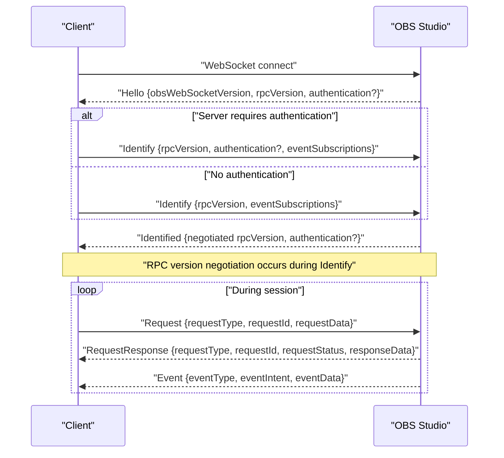
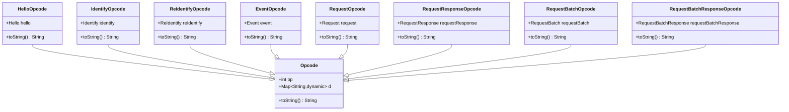
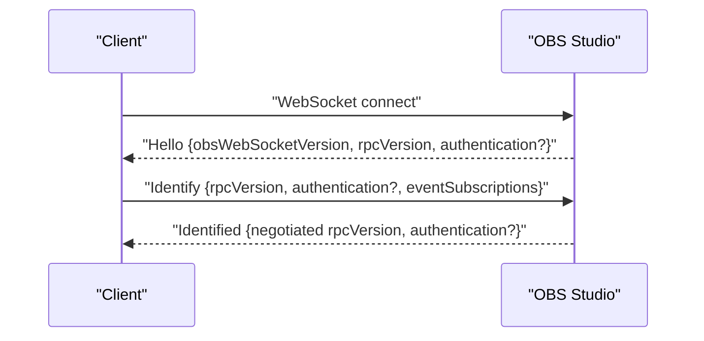
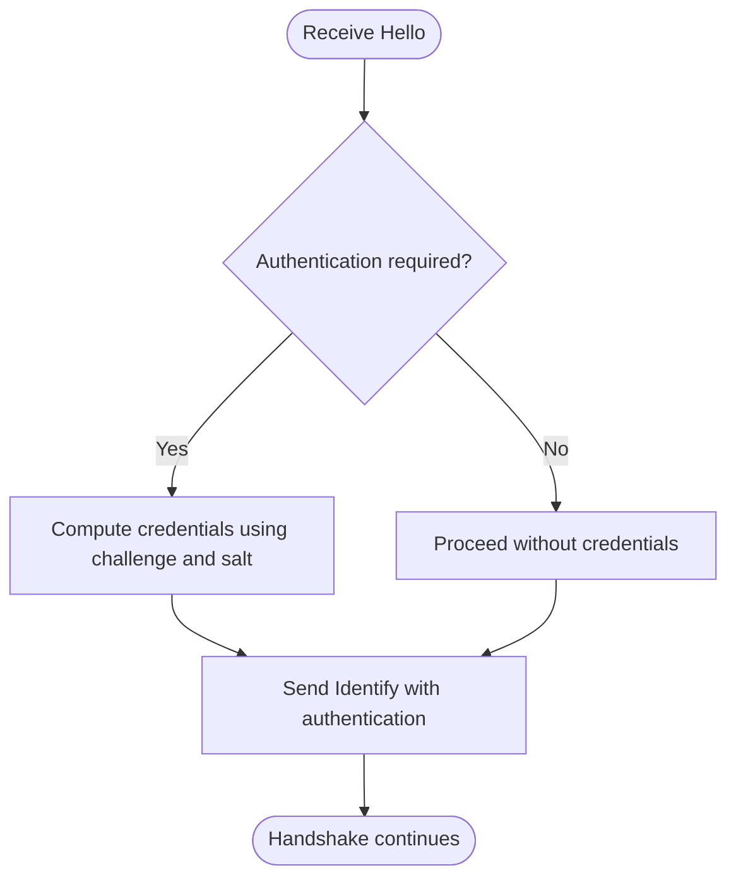
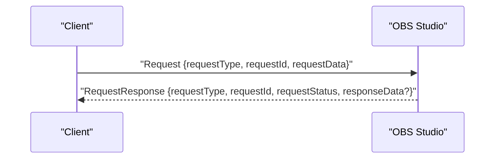
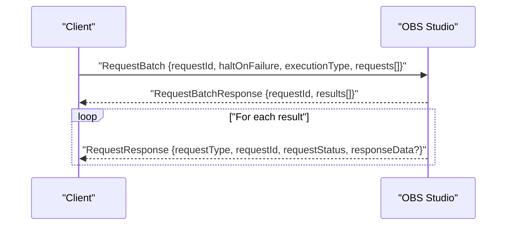
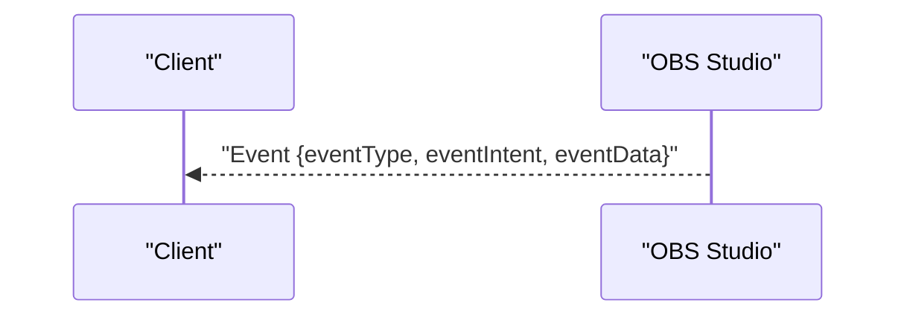
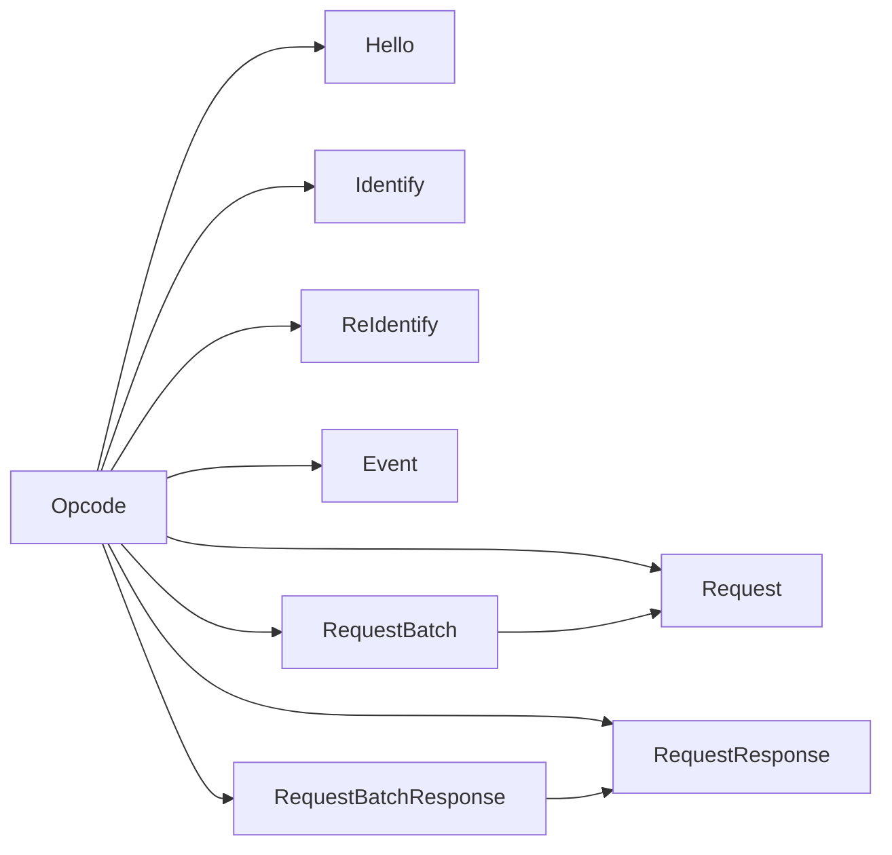

# obs-websocket Protocol Specification

<cite>
**Referenced Files in This Document**
- [lib/obs_websocket.dart](file://lib/obs_websocket.dart)
- [lib/src/model/comm/opcode.dart](file://lib/src/model/comm/opcode.dart)
- [lib/src/model/comm/hello.dart](file://lib/src/model/comm/hello.dart)
- [lib/src/model/comm/identify.dart](file://lib/src/model/comm/identify.dart)
- [lib/src/model/comm/reidentify.dart](file://lib/src/model/comm/reidentify.dart)
- [lib/src/model/comm/authentication.dart](file://lib/src/model/comm/authentication.dart)
- [lib/src/model/comm/request.dart](file://lib/src/model/comm/request.dart)
- [lib/src/model/comm/request_response.dart](file://lib/src/model/comm/request_response.dart)
- [lib/src/model/comm/request_batch.dart](file://lib/src/model/comm/request_batch.dart)
- [lib/src/model/comm/request_batch_response.dart](file://lib/src/model/comm/request_batch_response.dart)
- [lib/src/model/comm/event.dart](file://lib/src/model/comm/event.dart)
- [example/batch.dart](file://example/batch.dart)
- [example/general.dart](file://example/general.dart)
- [example/event.dart](file://example/event.dart)
- [example/show_scene_item.dart](file://example/show_scene_item.dart)
- [example/volume.dart](file://example/volume.dart)
</cite>

## Table of Contents
1. [Introduction](#introduction)
2. [Project Structure](#project-structure)
3. [Core Components](#core-components)
4. [Architecture Overview](#architecture-overview)
5. [Detailed Component Analysis](#detailed-component-analysis)
6. [Dependency Analysis](#dependency-analysis)
7. [Performance Considerations](#performance-considerations)
8. [Troubleshooting Guide](#troubleshooting-guide)
9. [Conclusion](#conclusion)
10. [Appendices](#appendices)

## Introduction
This document specifies the obs-websocket 5.x protocol as implemented in the Dart library. It covers the complete message structure, opcodes, request/response formats, and batch processing capabilities. It also documents the handshake flow (Hello/Identify), authentication mechanisms, RPC version negotiation, and how different message types are handled. Protocol version compatibility, backward compatibility considerations, and migration strategies for different OBS versions are addressed.

## Project Structure
The protocol implementation is organized around strongly-typed message models and opcodes. The top-level exports expose:
- Communication models for Hello, Identify, ReIdentify, Event, Request, RequestResponse, RequestBatch, and RequestBatchResponse
- Response models for various RPC endpoints
- Request models for endpoint categories
- Event models for server-sent events
- Shared models for scenes, scene items, transforms, and monitors
- Utilities and enums for serialization and extensions

**Diagram sources**
- [lib/obs_websocket.dart:10-62](file://lib/obs_websocket.dart#L10-L62)

**Section sources**
- [lib/obs_websocket.dart:10-62](file://lib/obs_websocket.dart#L10-L62)

## Core Components
This section describes the core protocol building blocks: the base Opcode envelope and specialized message types.

- Base Opcode envelope
  - Fields: op (integer opcode), d (payload map)
  - Serialization: JSON encoding/decoding via generated adapters
  - Purpose: Wraps all messages exchanged between client and server

- Specialized Opcode subclasses
  - HelloOpcode: carries Hello payload
  - IdentifyOpcode: carries Identify payload
  - ReIdentifyOpcode: carries ReIdentify payload
  - EventOpcode: carries Event payload
  - RequestOpcode: carries Request payload
  - RequestResponseOpcode: carries RequestResponse payload
  - RequestBatchOpcode: carries RequestBatch payload
  - RequestBatchResponseOpcode: carries RequestBatchResponse payload

- Hello message
  - Fields: obsWebSocketVersion (string), rpcVersion (integer), authentication (optional)
  - Purpose: Initial server greeting indicating supported RPC version and optional authentication challenge

- Identify message
  - Fields: rpcVersion (integer), authentication (optional string), eventSubscriptions (optional integer)
  - Purpose: Client’s initial identification and subscription preferences

- ReIdentify message
  - Fields: eventSubscriptions (optional integer)
  - Purpose: Update event subscriptions after initial identification

- Authentication challenge
  - Fields: challenge (string), salt (string)
  - Purpose: Provides challenge-response parameters for authentication

- Request message
  - Fields: requestType (string), requestId (string UUID), requestData (optional map), expectResponse (bool, derived)
  - Purpose: Encodes a single RPC call; requestId is auto-generated if omitted

- RequestResponse message
  - Fields: requestType (string), requestId (string), requestStatus (object), responseData (optional map)
  - Purpose: Encodes a single RPC response

- RequestBatch message
  - Fields: haltOnFailure (bool), requestId (string UUID), executionType (enum), requests (list of Request)
  - Purpose: Encodes a batch of requests with execution semantics

- RequestBatchResponse message
  - Fields: requestId (string), results (list of RequestResponse)
  - Purpose: Encodes a batch response containing per-request results

- Event message
  - Fields: eventType (string), eventIntent (integer), eventData (map)
  - Purpose: Encodes server-sent events

**Section sources**
- [lib/src/model/comm/opcode.dart:8-87](file://lib/src/model/comm/opcode.dart#L8-L87)
- [lib/src/model/comm/hello.dart:9-29](file://lib/src/model/comm/hello.dart#L9-L29)
- [lib/src/model/comm/identify.dart:8-31](file://lib/src/model/comm/identify.dart#L8-L31)
- [lib/src/model/comm/reidentify.dart:8-23](file://lib/src/model/comm/reidentify.dart#L8-L23)
- [lib/src/model/comm/authentication.dart:7-21](file://lib/src/model/comm/authentication.dart#L7-L21)
- [lib/src/model/comm/request.dart:10-37](file://lib/src/model/comm/request.dart#L10-L37)
- [lib/src/model/comm/request_response.dart:9-30](file://lib/src/model/comm/request_response.dart#L9-L30)
- [lib/src/model/comm/request_batch.dart:12-39](file://lib/src/model/comm/request_batch.dart#L12-L39)
- [lib/src/model/comm/request_batch_response.dart:8-22](file://lib/src/model/comm/request_batch_response.dart#L8-L22)
- [lib/src/model/comm/event.dart:10-30](file://lib/src/model/comm/event.dart#L10-L30)

## Architecture Overview
The protocol uses a WebSocket transport with JSON-encoded messages. The message envelope (Opcode) carries an operation code and a typed payload. The handshake establishes RPC version compatibility and optional authentication. Subsequent messages are either client-initiated requests or server-initiated events.

**Diagram sources**
- [lib/src/model/comm/hello.dart:9-29](file://lib/src/model/comm/hello.dart#L9-L29)
- [lib/src/model/comm/identify.dart:8-31](file://lib/src/model/comm/identify.dart#L8-L31)
- [lib/src/model/comm/request.dart:10-37](file://lib/src/model/comm/request.dart#L10-L37)
- [lib/src/model/comm/request_response.dart:9-30](file://lib/src/model/comm/request_response.dart#L9-L30)
- [lib/src/model/comm/event.dart:10-30](file://lib/src/model/comm/event.dart#L10-L30)

## Detailed Component Analysis

### Opcode Class Structure
The Opcode class is the base envelope for all protocol messages. Specializations encapsulate typed payloads and provide convenience constructors and toOpcode() methods.

**Diagram sources**
- [lib/src/model/comm/opcode.dart:8-87](file://lib/src/model/comm/opcode.dart#L8-L87)

**Section sources**
- [lib/src/model/comm/opcode.dart:8-87](file://lib/src/model/comm/opcode.dart#L8-L87)

### Hello/Identify Handshake and RPC Version Negotiation
- Hello: Server sends obsWebSocketVersion, rpcVersion, and optional authentication challenge
- Identify: Client responds with rpcVersion, optional authentication credentials, and eventSubscriptions
- RPC version negotiation: The server indicates supported rpcVersion in Hello; the client proposes rpcVersion in Identify; the server replies with the negotiated version

**Diagram sources**
- [lib/src/model/comm/hello.dart:9-29](file://lib/src/model/comm/hello.dart#L9-L29)
- [lib/src/model/comm/identify.dart:8-31](file://lib/src/model/comm/identify.dart#L8-L31)

**Section sources**
- [lib/src/model/comm/hello.dart:9-29](file://lib/src/model/comm/hello.dart#L9-L29)
- [lib/src/model/comm/identify.dart:8-31](file://lib/src/model/comm/identify.dart#L8-L31)

### Authentication Mechanisms
- Challenge fields: challenge and salt are provided by the server in Hello
- Client responsibility: Compute and provide the appropriate authentication string in Identify
- Optional: ReIdentify can update eventSubscriptions without re-authenticating if the session remains valid

**Diagram sources**
- [lib/src/model/comm/hello.dart:9-29](file://lib/src/model/comm/hello.dart#L9-L29)
- [lib/src/model/comm/identify.dart:8-31](file://lib/src/model/comm/identify.dart#L8-L31)
- [lib/src/model/comm/authentication.dart:7-21](file://lib/src/model/comm/authentication.dart#L7-L21)

**Section sources**
- [lib/src/model/comm/authentication.dart:7-21](file://lib/src/model/comm/authentication.dart#L7-L21)
- [lib/src/model/comm/hello.dart:9-29](file://lib/src/model/comm/hello.dart#L9-L29)
- [lib/src/model/comm/identify.dart:8-31](file://lib/src/model/comm/identify.dart#L8-L31)

### Request/Response Message Flow
- Requests: Each Request carries requestType, requestId, requestData, and an automatically determined expectResponse flag
- Responses: RequestResponse carries matching requestId, requestStatus, and optional responseData

**Diagram sources**
- [lib/src/model/comm/request.dart:10-37](file://lib/src/model/comm/request.dart#L10-L37)
- [lib/src/model/comm/request_response.dart:9-30](file://lib/src/model/comm/request_response.dart#L9-L30)

**Section sources**
- [lib/src/model/comm/request.dart:10-37](file://lib/src/model/comm/request.dart#L10-L37)
- [lib/src/model/comm/request_response.dart:9-30](file://lib/src/model/comm/request_response.dart#L9-L30)

### Batch Processing Capabilities
- RequestBatch: Encodes a list of Request objects with execution semantics (haltOnFailure, executionType)
- RequestBatchResponse: Returns a list of RequestResponse objects aligned with the batch order
- Execution types: Controlled via an enum; serialRealtime is the default

**Diagram sources**
- [lib/src/model/comm/request_batch.dart:12-39](file://lib/src/model/comm/request_batch.dart#L12-L39)
- [lib/src/model/comm/request_batch_response.dart:8-22](file://lib/src/model/comm/request_batch_response.dart#L8-L22)
- [lib/src/model/comm/request.dart:10-37](file://lib/src/model/comm/request.dart#L10-L37)
- [lib/src/model/comm/request_response.dart:9-30](file://lib/src/model/comm/request_response.dart#L9-L30)

**Section sources**
- [lib/src/model/comm/request_batch.dart:12-39](file://lib/src/model/comm/request_batch.dart#L12-L39)
- [lib/src/model/comm/request_batch_response.dart:8-22](file://lib/src/model/comm/request_batch_response.dart#L8-L22)

### Event Delivery Model
- Server-to-client events are delivered as Event messages with eventType, eventIntent, and eventData
- Clients can subscribe/unsubscribe via eventSubscriptions in Identify/ReIdentify

**Diagram sources**
- [lib/src/model/comm/event.dart:10-30](file://lib/src/model/comm/event.dart#L10-L30)

**Section sources**
- [lib/src/model/comm/event.dart:10-30](file://lib/src/model/comm/event.dart#L10-L30)

### Protocol-Specific Examples

- Message serialization/deserialization
  - Use the generated toJson()/fromJson() adapters for all message types
  - Example paths:
    - [lib/src/model/comm/hello.dart:23-25](file://lib/src/model/comm/hello.dart#L23-L25)
    - [lib/src/model/comm/identify.dart:22-27](file://lib/src/model/comm/identify.dart#L22-L27)
    - [lib/src/model/comm/request.dart:24-33](file://lib/src/model/comm/request.dart#L24-L33)
    - [lib/src/model/comm/request_batch.dart:25-35](file://lib/src/model/comm/request_batch.dart#L25-L35)

- Batch processing
  - Build a RequestBatch with multiple Request entries
  - Submit via RequestBatchOpcode and handle RequestBatchResponse
  - Example paths:
    - [lib/src/model/comm/request_batch.dart:19-23](file://lib/src/model/comm/request_batch.dart#L19-L23)
    - [lib/src/model/comm/request_batch_response.dart:13-13](file://lib/src/model/comm/request_batch_response.dart#L13-L13)
    - [example/batch.dart](file://example/batch.dart)

- Error handling
  - Inspect requestStatus in RequestResponse for failure conditions
  - In batch mode, check individual RequestResponse items and consider haltOnFailure behavior
  - Example paths:
    - [lib/src/model/comm/request_response.dart:16-21](file://lib/src/model/comm/request_response.dart#L16-L21)
    - [lib/src/model/comm/request_batch_response.dart:10-11](file://lib/src/model/comm/request_batch_response.dart#L10-L11)

**Section sources**
- [lib/src/model/comm/hello.dart:23-25](file://lib/src/model/comm/hello.dart#L23-L25)
- [lib/src/model/comm/identify.dart:22-27](file://lib/src/model/comm/identify.dart#L22-L27)
- [lib/src/model/comm/request.dart:24-33](file://lib/src/model/comm/request.dart#L24-L33)
- [lib/src/model/comm/request_batch.dart:25-35](file://lib/src/model/comm/request_batch.dart#L25-L35)
- [lib/src/model/comm/request_response.dart:16-21](file://lib/src/model/comm/request_response.dart#L16-L21)
- [lib/src/model/comm/request_batch_response.dart:10-11](file://lib/src/model/comm/request_batch_response.dart#L10-L11)
- [example/batch.dart](file://example/batch.dart)

## Dependency Analysis
The protocol models are loosely coupled and rely on generated JSON adapters. The primary dependency chain is:
- Opcode subclasses depend on their payload models (Hello, Identify, Request, etc.)
- RequestBatch depends on Request
- RequestBatchResponse depends on RequestResponse
- Event depends on event-specific payload models (exposed via event.dart exports)

**Diagram sources**
- [lib/src/model/comm/opcode.dart:8-87](file://lib/src/model/comm/opcode.dart#L8-L87)
- [lib/src/model/comm/request_batch.dart:12-39](file://lib/src/model/comm/request_batch.dart#L12-L39)
- [lib/src/model/comm/request_batch_response.dart:8-22](file://lib/src/model/comm/request_batch_response.dart#L8-L22)
- [lib/src/model/comm/request.dart:10-37](file://lib/src/model/comm/request.dart#L10-L37)
- [lib/src/model/comm/request_response.dart:9-30](file://lib/src/model/comm/request_response.dart#L9-L30)

**Section sources**
- [lib/src/model/comm/opcode.dart:8-87](file://lib/src/model/comm/opcode.dart#L8-L87)
- [lib/src/model/comm/request_batch.dart:12-39](file://lib/src/model/comm/request_batch.dart#L12-L39)
- [lib/src/model/comm/request_batch_response.dart:8-22](file://lib/src/model/comm/request_batch_response.dart#L8-L22)
- [lib/src/model/comm/request.dart:10-37](file://lib/src/model/comm/request.dart#L10-L37)
- [lib/src/model/comm/request_response.dart:9-30](file://lib/src/model/comm/request_response.dart#L9-L30)

## Performance Considerations
- Prefer RequestBatch for grouping related operations to reduce round-trips
- Use eventSubscriptions to limit event traffic to only what is needed
- Avoid unnecessary requestData payloads; keep them minimal
- Consider haltOnFailure behavior to balance safety vs throughput in batches

## Troubleshooting Guide
- Authentication failures
  - Verify challenge/salt handling and correct credential computation
  - Ensure Identify includes the computed authentication string
  - Reference: [lib/src/model/comm/authentication.dart:7-21](file://lib/src/model/comm/authentication.dart#L7-L21), [lib/src/model/comm/identify.dart:8-31](file://lib/src/model/comm/identify.dart#L8-L31)

- RPC version mismatch
  - Confirm Identify rpcVersion matches server’s supported range
  - Review Hello rpcVersion and adjust client Identify accordingly
  - Reference: [lib/src/model/comm/hello.dart:9-29](file://lib/src/model/comm/hello.dart#L9-L29), [lib/src/model/comm/identify.dart:8-31](file://lib/src/model/comm/identify.dart#L8-L31)

- Request failures
  - Inspect requestStatus in RequestResponse for failure details
  - For batches, check individual RequestResponse items
  - Reference: [lib/src/model/comm/request_response.dart:9-30](file://lib/src/model/comm/request_response.dart#L9-L30), [lib/src/model/comm/request_batch_response.dart:8-22](file://lib/src/model/comm/request_batch_response.dart#L8-L22)

- Event delivery issues
  - Adjust eventSubscriptions in Identify/ReIdentify
  - Reference: [lib/src/model/comm/identify.dart:8-31](file://lib/src/model/comm/identify.dart#L8-L31), [lib/src/model/comm/reidentify.dart:8-23](file://lib/src/model/comm/reidentify.dart#L8-L23)

**Section sources**
- [lib/src/model/comm/authentication.dart:7-21](file://lib/src/model/comm/authentication.dart#L7-L21)
- [lib/src/model/comm/identify.dart:8-31](file://lib/src/model/comm/identify.dart#L8-L31)
- [lib/src/model/comm/hello.dart:9-29](file://lib/src/model/comm/hello.dart#L9-L29)
- [lib/src/model/comm/request_response.dart:9-30](file://lib/src/model/comm/request_response.dart#L9-L30)
- [lib/src/model/comm/request_batch_response.dart:8-22](file://lib/src/model/comm/request_batch_response.dart#L8-L22)
- [lib/src/model/comm/reidentify.dart:8-23](file://lib/src/model/comm/reidentify.dart#L8-L23)

## Conclusion
The obs-websocket 5.x protocol in this Dart implementation provides a robust, strongly-typed foundation for communicating with OBS Studio over WebSocket. The protocol supports RPC version negotiation, optional authentication, request/response messaging, and efficient batch operations. By leveraging the provided models and examples, clients can implement reliable integrations while maintaining compatibility across OBS versions.

## Appendices

### Protocol Version Compatibility and Migration Strategies
- RPC version negotiation
  - The server advertises supported rpcVersion in Hello
  - The client proposes rpcVersion in Identify
  - Maintain backward compatibility by supporting multiple rpcVersion values in Identify
  - Reference: [lib/src/model/comm/hello.dart:9-29](file://lib/src/model/comm/hello.dart#L9-L29), [lib/src/model/comm/identify.dart:8-31](file://lib/src/model/comm/identify.dart#L8-L31)

- Backward compatibility considerations
  - Keep expectResponse default behavior for Get* requests
  - Preserve field names and types in Request/RequestResponse
  - Support optional fields gracefully
  - Reference: [lib/src/model/comm/request.dart:17-22](file://lib/src/model/comm/request.dart#L17-L22), [lib/src/model/comm/request_response.dart:16-21](file://lib/src/model/comm/request_response.dart#L16-L21)

- Migration strategies
  - Gradually phase out older rpcVersion values
  - Add deprecation warnings for removed features
  - Provide clear error messages for unsupported requestTypes
  - Reference: [lib/src/model/comm/request.dart:19-22](file://lib/src/model/comm/request.dart#L19-L22)

### Example Usage References
- General operations and events
  - [example/general.dart](file://example/general.dart)
  - [example/event.dart](file://example/event.dart)

- Scene item operations
  - [example/show_scene_item.dart](file://example/show_scene_item.dart)

- Volume controls
  - [example/volume.dart](file://example/volume.dart)

- Batch operations
  - [example/batch.dart](file://example/batch.dart)

**Section sources**
- [lib/src/model/comm/hello.dart:9-29](file://lib/src/model/comm/hello.dart#L9-L29)
- [lib/src/model/comm/identify.dart:8-31](file://lib/src/model/comm/identify.dart#L8-L31)
- [lib/src/model/comm/request.dart:17-22](file://lib/src/model/comm/request.dart#L17-L22)
- [lib/src/model/comm/request_response.dart:16-21](file://lib/src/model/comm/request_response.dart#L16-L21)
- [example/general.dart](file://example/general.dart)
- [example/event.dart](file://example/event.dart)
- [example/show_scene_item.dart](file://example/show_scene_item.dart)
- [example/volume.dart](file://example/volume.dart)
- [example/batch.dart](file://example/batch.dart)