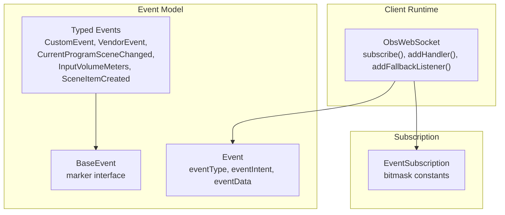
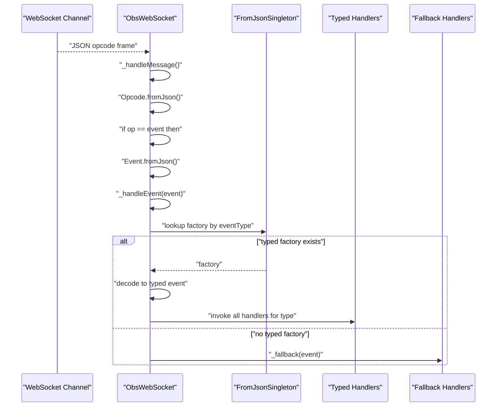
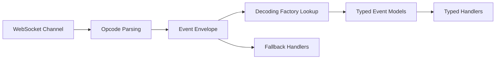

# Event System

<cite>
**Referenced Files in This Document**
- [obs_websocket_base.dart](file://lib/src/obs_websocket_base.dart)
- [event.dart](file://lib/src/model/comm/event.dart)
- [event.dart](file://lib/event.dart)
- [obs_websocket.dart](file://lib/obs_websocket.dart)
- [event.dart](file://lib/src/model/event/general/custom_event.dart)
- [event.dart](file://lib/src/model/event/general/vendor_event.dart)
- [event.dart](file://lib/src/model/event/scene/current_program_scene_changed.dart)
- [event.dart](file://lib/src/model/event/inputs/input_volume_meters.dart)
- [event.dart](file://lib/src/model/event/scene_items/scene_item_created.dart)
- [event.dart](file://lib/src/model/event/base_event.dart)
- [event.dart](file://example/event.dart)
</cite>

## Table of Contents
1. [Introduction](#introduction)
2. [Project Structure](#project-structure)
3. [Core Components](#core-components)
4. [Architecture Overview](#architecture-overview)
5. [Detailed Component Analysis](#detailed-component-analysis)
6. [Dependency Analysis](#dependency-analysis)
7. [Performance Considerations](#performance-considerations)
8. [Troubleshooting Guide](#troubleshooting-guide)
9. [Conclusion](#conclusion)
10. [Appendices](#appendices)

## Introduction
This document explains the event system used by the OBS WebSocket client library. It covers how to subscribe to events, register typed and fallback handlers, the event data model, type safety, and practical patterns for filtering, conditional processing, and error handling. It also includes performance guidance for high-frequency events and real-world integration examples from the codebase.

## Project Structure
The event system spans several modules:
- Core runtime and subscription logic live in the main client class.
- Event payloads are modeled as strongly-typed Dart classes.
- Event subscriptions are represented by a bitmask enumeration.
- Example usage demonstrates handler registration and subscription patterns.

**Diagram sources**
- [obs_websocket_base.dart:337-372](file://lib/src/obs_websocket_base.dart#L337-L372)
- [event.dart:10-30](file://lib/src/model/comm/event.dart#L10-L30)
- [event.dart](file://lib/src/model/event/base_event.dart)
- [event.dart:9-25](file://lib/src/model/event/general/custom_event.dart#L9-L25)
- [event.dart:9-29](file://lib/src/model/event/general/vendor_event.dart#L9-L29)
- [event.dart:9-25](file://lib/src/model/event/scene/current_program_scene_changed.dart#L9-L25)
- [event.dart:15-30](file://lib/src/model/event/inputs/input_volume_meters.dart#L15-L30)
- [event.dart:9-39](file://lib/src/model/event/scene_items/scene_item_created.dart#L9-L39)

**Section sources**
- [obs_websocket_base.dart:118-128](file://lib/src/obs_websocket_base.dart#L118-L128)
- [event.dart:10-30](file://lib/src/model/comm/event.dart#L10-L30)
- [event.dart:1-50](file://lib/event.dart#L1-L50)

## Core Components
- Event subscription mechanism:
  - Subscriptions are configured via a bitmask passed during re-identification.
  - The client supports subscribing to a single category, multiple categories, or all events.
- Handler registration:
  - Typed handlers are registered per event type using a generic method.
  - Fallback handlers receive any event that lacks a typed decoder.
- Event decoding:
  - Incoming event payloads are decoded into typed Dart models when available.
  - Unknown event types are routed to fallback handlers.

Key APIs and behaviors:
- Subscription API: [subscribe:352-372](file://lib/src/obs_websocket_base.dart#L352-L372), [listenForMask:337-346](file://lib/src/obs_websocket_base.dart#L337-L346)
- Handler registration: [addHandler:410-414](file://lib/src/obs_websocket_base.dart#L410-L414), [removeHandler:416-429](file://lib/src/obs_websocket_base.dart#L416-L429)
- Fallback handling: [addFallbackListener:431-439](file://lib/src/obs_websocket_base.dart#L431-L439), [_fallback:441-446](file://lib/src/obs_websocket_base.dart#L441-L446)
- Event routing: [_handleEvent:374-395](file://lib/src/obs_websocket_base.dart#L374-L395)

**Section sources**
- [obs_websocket_base.dart:337-372](file://lib/src/obs_websocket_base.dart#L337-L372)
- [obs_websocket_base.dart:410-414](file://lib/src/obs_websocket_base.dart#L410-L414)
- [obs_websocket_base.dart:431-439](file://lib/src/obs_websocket_base.dart#L431-L439)
- [obs_websocket_base.dart:374-395](file://lib/src/obs_websocket_base.dart#L374-L395)

## Architecture Overview
The event pipeline consists of:
- WebSocket reception and opcode parsing
- Event opcode extraction and decoding
- Typed handler dispatch or fallback routing
- Optional logging and error propagation

**Diagram sources**
- [obs_websocket_base.dart:180-236](file://lib/src/obs_websocket_base.dart#L180-L236)
- [obs_websocket_base.dart:374-395](file://lib/src/obs_websocket_base.dart#L374-L395)

## Detailed Component Analysis

### EventSubscription System
- Purpose: Bitmask-based selection of event categories.
- Usage patterns:
  - Subscribe to a single category using an enum value.
  - Combine multiple categories using bitwise OR.
  - Subscribe to all events using a convenience constant.
- Implementation:
  - The client sends a re-identify opcode with the selected mask.
  - The subscription accepts an enum, an iterable of enums, or a raw integer mask.

Practical example from the codebase:
- Subscribing to a combination of categories and a specific high-frequency category is demonstrated in the example.

**Section sources**
- [obs_websocket_base.dart:337-372](file://lib/src/obs_websocket_base.dart#L337-L372)
- [event.dart:19-21](file://example/event.dart#L19-L21)

### Typed Event Handlers
- Registration:
  - Register a handler for a specific event type using a generic method.
  - Handlers are stored in a map keyed by the type’s string name.
- Dispatch:
  - On receiving an event, the client looks up handlers by event type and invokes them with the decoded payload.
- Removal:
  - Handlers can be removed by type; exact listener removal is not supported due to internal wrapping.

Example from the codebase:
- Handlers for scene changes, scene list updates, input audio balance changes, input volume meters, and exit events are registered in the example.

**Section sources**
- [obs_websocket_base.dart:410-414](file://lib/src/obs_websocket_base.dart#L410-L414)
- [obs_websocket_base.dart:416-429](file://lib/src/obs_websocket_base.dart#L416-L429)
- [event.dart:22-42](file://example/event.dart#L22-L42)

### Fallback Event Handler
- Purpose: Capture events that are unknown to the client (unknown event type) or for which no typed decoder exists.
- Registration:
  - Add a fallback handler to receive all unmatched events.
- Behavior:
  - If no typed handlers exist for an event, or if a typed decoder is missing, the event is routed to fallback handlers.

Example from the codebase:
- The example shows how to configure a fallback handler via the client constructor.

**Section sources**
- [obs_websocket_base.dart:15-19](file://lib/src/obs_websocket_base.dart#L15-L19)
- [obs_websocket_base.dart:431-439](file://lib/src/obs_websocket_base.dart#L431-L439)
- [obs_websocket_base.dart:441-446](file://lib/src/obs_websocket_base.dart#L441-L446)
- [event.dart:14-16](file://example/event.dart#L14-L16)

### Event Data Structures and Type Safety
- Event envelope:
  - The incoming event envelope includes the event type, intent, and optional payload data.
- Typed models:
  - Each supported event type has a dedicated Dart class annotated for JSON serialization/deserialization.
  - These models implement a marker interface for consistency.
- Type safety:
  - Decoding is performed via a factory lookup keyed by the event type.
  - If a factory is missing, the event is treated as untyped and routed to fallback handlers.

Representative models:
- General custom and vendor events
- Scene and scene item events
- Input-specific events including high-frequency volume meters

**Section sources**
- [event.dart:10-30](file://lib/src/model/comm/event.dart#L10-L30)
- [event.dart:9-25](file://lib/src/model/event/general/custom_event.dart#L9-L25)
- [event.dart:9-29](file://lib/src/model/event/general/vendor_event.dart#L9-L29)
- [event.dart:9-25](file://lib/src/model/event/scene/current_program_scene_changed.dart#L9-L25)
- [event.dart:15-30](file://lib/src/model/event/inputs/input_volume_meters.dart#L15-L30)
- [event.dart:9-39](file://lib/src/model/event/scene_items/scene_item_created.dart#L9-L39)
- [event.dart](file://lib/src/model/event/base_event.dart)

### Event Filtering and Conditional Processing
- Filter by type:
  - Register only the handlers you need; unused handlers are simply not registered.
- Filter by payload:
  - Inside a handler, inspect the typed payload fields to decide whether to act.
- Filter by intent:
  - The event envelope includes an intent field; use it to distinguish between immediate and buffered events if applicable to your scenario.

Note: The intent field is part of the event envelope and can be used to implement conditional logic inside handlers.

**Section sources**
- [event.dart:10-30](file://lib/src/model/comm/event.dart#L10-L30)

### Practical Examples from the Codebase
- Subscribing to multiple categories and a high-frequency category:
  - Demonstrates combining subscription masks and enabling a high-frequency event stream.
- Registering typed handlers for scene and input events:
  - Shows how to register handlers for scene name changes, scene list changes, input audio balance changes, input volume meters, and exit events.
- Using a fallback handler:
  - Illustrates configuring a fallback handler to capture unknown events.

**Section sources**
- [event.dart:19-21](file://example/event.dart#L19-L21)
- [event.dart:22-42](file://example/event.dart#L22-L42)
- [event.dart:14-16](file://example/event.dart#L14-L16)

## Dependency Analysis
The event system depends on:
- WebSocket channel for transport
- Opcode parsing for routing
- JSON serialization for event envelopes
- Factory-based decoding for typed events
- Logging for observability

**Diagram sources**
- [obs_websocket_base.dart:180-236](file://lib/src/obs_websocket_base.dart#L180-L236)
- [obs_websocket_base.dart:374-395](file://lib/src/obs_websocket_base.dart#L374-L395)
- [event.dart:10-30](file://lib/src/model/comm/event.dart#L10-L30)

**Section sources**
- [obs_websocket_base.dart:180-236](file://lib/src/obs_websocket_base.dart#L180-L236)
- [obs_websocket_base.dart:374-395](file://lib/src/obs_websocket_base.dart#L374-L395)

## Performance Considerations
- High-frequency events:
  - Some events (for example, input volume meters) arrive at high rates and carry substantial payload arrays.
  - Keep handlers lightweight; avoid heavy computations or blocking operations.
- Payload size:
  - Decode only the fields you need; consider filtering in handlers to reduce processing overhead.
- Handler throughput:
  - Prefer batching or throttling outside handlers if you must perform expensive work.
- Memory management:
  - Avoid retaining large intermediate structures across invocations.
  - Dispose of resources promptly in handlers.
- Logging:
  - Reduce verbosity for high-frequency events to minimize I/O overhead.

[No sources needed since this section provides general guidance]

## Troubleshooting Guide
- Symptom: No events received
  - Verify subscription mask includes the desired categories.
  - Confirm the client is calling the subscription method after connecting.
- Symptom: Unknown event types are not handled
  - Register a fallback handler to capture them.
  - Check that the event type string matches the expected spelling.
- Symptom: Handlers not invoked
  - Ensure handlers are registered with the correct generic type.
  - Confirm the event type string used by the client matches the handler’s type key.
- Symptom: High CPU usage from frequent events
  - Implement rate limiting or sampling in handlers.
  - Reduce payload processing and logging for high-frequency events.
- Debugging techniques:
  - Enable client-side logging to observe incoming opcodes and decoded events.
  - Use fallback handlers to log raw event envelopes for inspection.

**Section sources**
- [obs_websocket_base.dart:137-143](file://lib/src/obs_websocket_base.dart#L137-L143)
- [obs_websocket_base.dart:431-439](file://lib/src/obs_websocket_base.dart#L431-L439)
- [obs_websocket_base.dart:441-446](file://lib/src/obs_websocket_base.dart#L441-L446)

## Conclusion
The event system provides a robust, type-safe mechanism for subscribing to and processing OBS WebSocket events. By combining bitmask-based subscriptions, typed handlers, and fallback routes, applications can efficiently handle both common and specialized event streams. For high-frequency events, careful handler design and minimal processing are essential to maintain responsiveness.

[No sources needed since this section summarizes without analyzing specific files]

## Appendices

### Event Categories and Examples
- Scene events: Program scene change, scene list changes, scene name changes
- Scene item events: Creation, enable state changes, selection
- Input events: Mute state, volume changes, audio balance, volume meters
- General events: Custom events, vendor events, exit started
- Outputs and UI: Stream state, record state, replay buffer, virtual camera, studio mode

**Section sources**
- [event.dart:1-50](file://lib/event.dart#L1-L50)
- [event.dart:9-25](file://lib/src/model/event/scene/current_program_scene_changed.dart#L9-L25)
- [event.dart:9-39](file://lib/src/model/event/scene_items/scene_item_created.dart#L9-L39)
- [event.dart:9-13](file://lib/src/model/event/inputs/input_volume_meters.dart#L9-L13)
- [event.dart:9-25](file://lib/src/model/event/general/custom_event.dart#L9-L25)
- [event.dart:9-29](file://lib/src/model/event/general/vendor_event.dart#L9-L29)