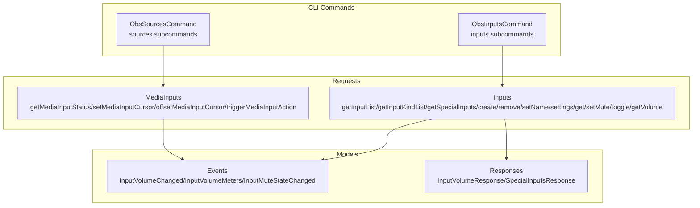
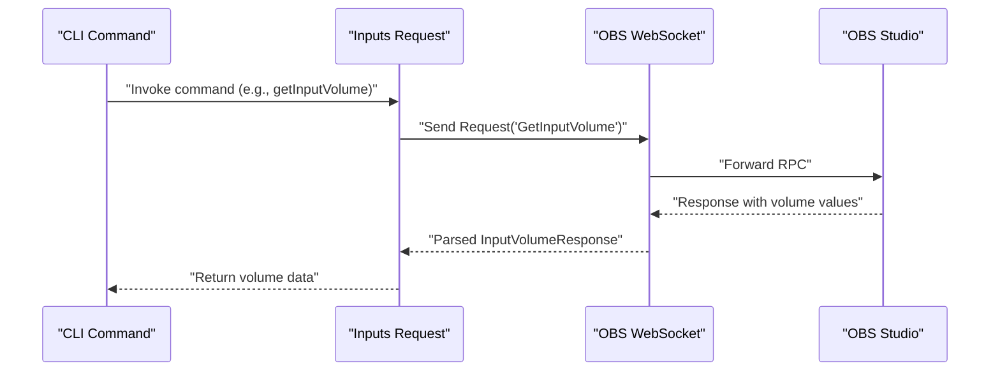
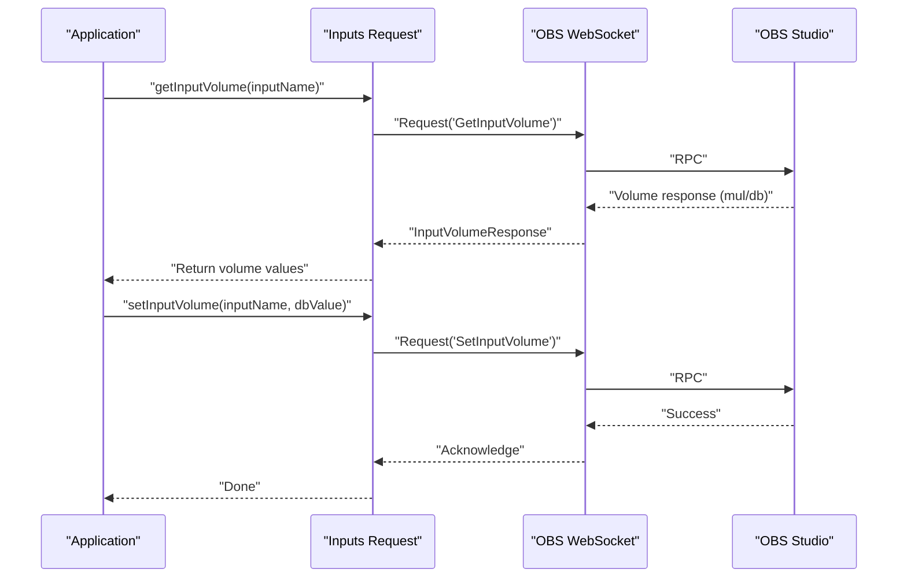
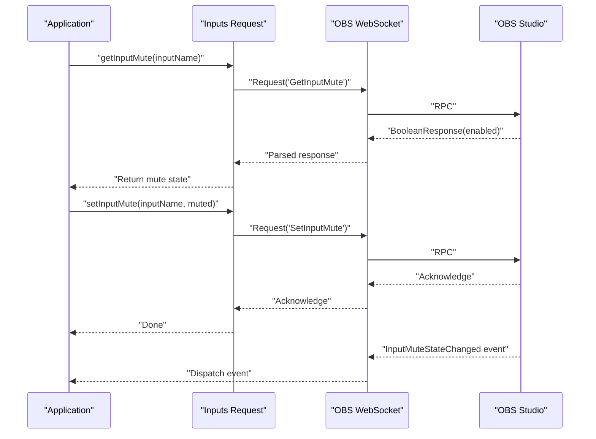
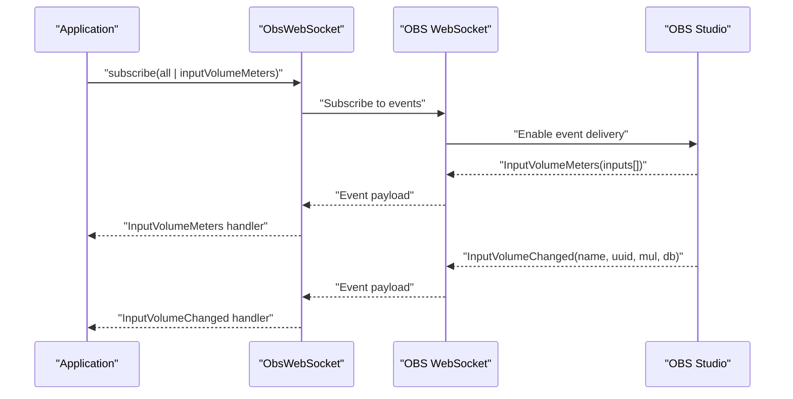
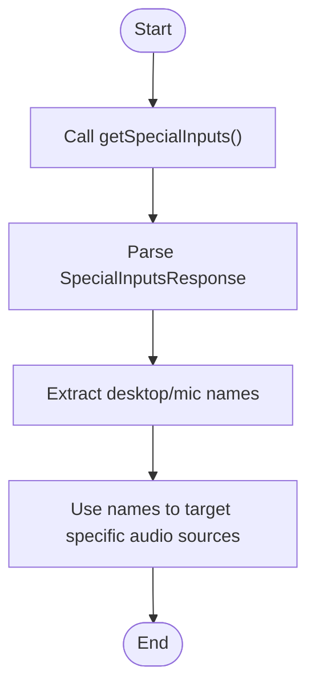
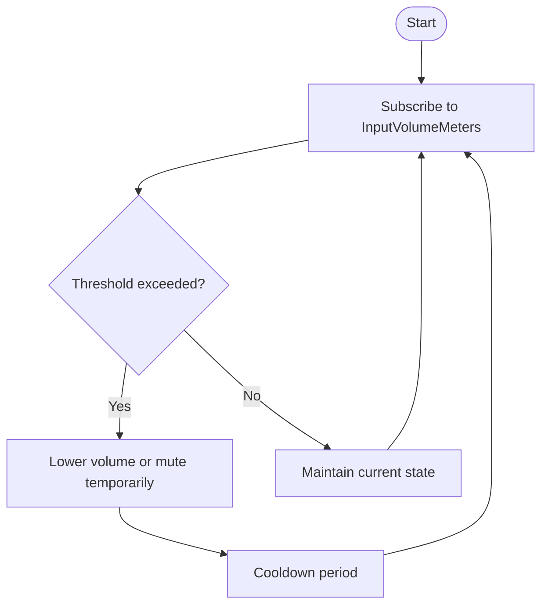
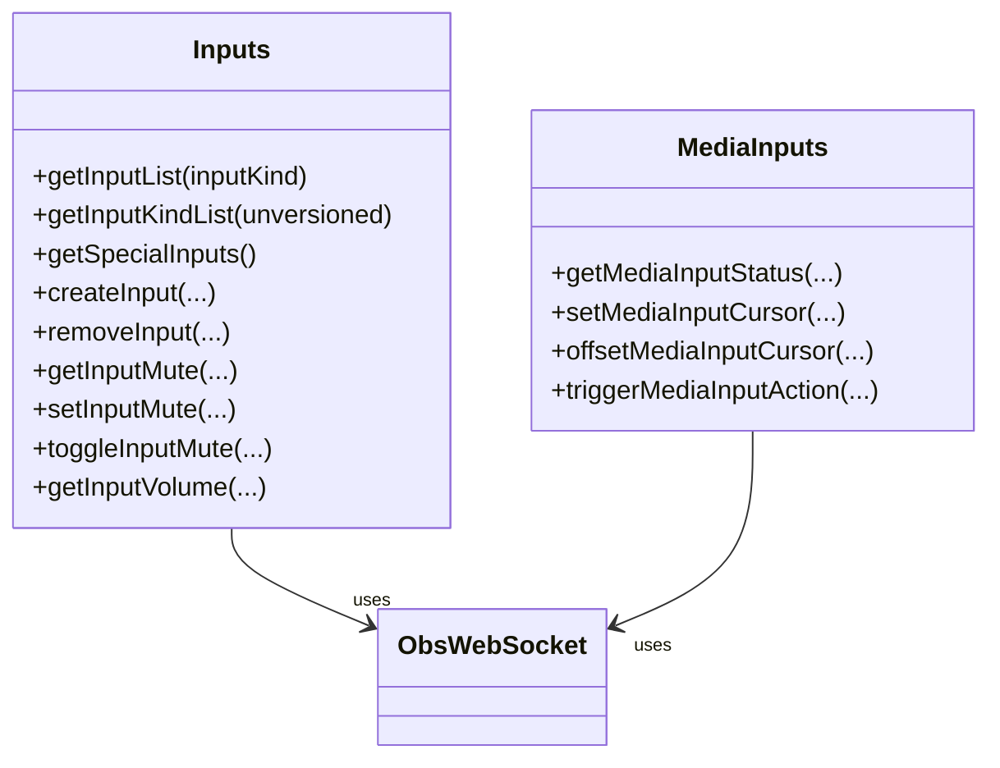
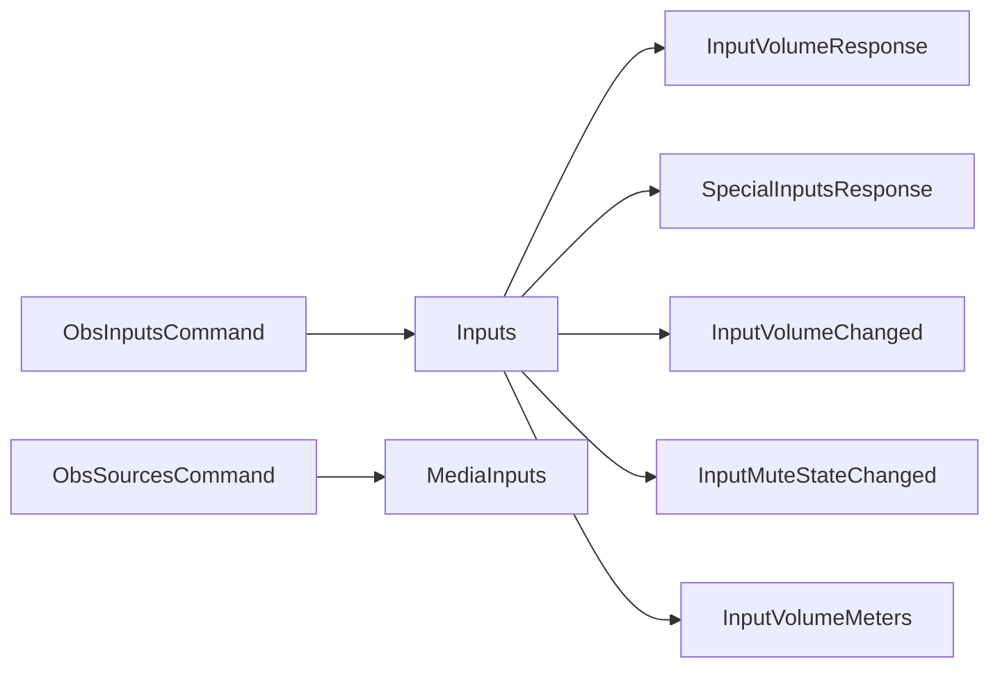

# Audio Control Examples

<cite>
**Referenced Files in This Document**
- [volume.dart](file://example/volume.dart)
- [obs_inputs_command.dart](file://lib/src/cmd/obs_inputs_command.dart)
- [obs_sources_command.dart](file://lib/src/cmd/obs_sources_command.dart)
- [inputs.dart](file://lib/src/request/inputs.dart)
- [media_inputs.dart](file://lib/src/request/media_inputs.dart)
- [input_volume_changed.dart](file://lib/src/model/event/inputs/input_volume_changed.dart)
- [input_volume_meters.dart](file://lib/src/model/event/inputs/input_volume_meters.dart)
- [input_mute_state_changed.dart](file://lib/src/model/event/inputs/input_mute_state_changed.dart)
- [input_volume_response.dart](file://lib/src/model/response/input_volume_response.dart)
- [special_inputs_response.dart](file://lib/src/model/response/special_inputs_response.dart)
- [obs_websocket_inputs_test.dart](file://test/obs_websocket_inputs_test.dart)
</cite>

## Table of Contents
1. [Introduction](#introduction)
2. [Project Structure](#project-structure)
3. [Core Components](#core-components)
4. [Architecture Overview](#architecture-overview)
5. [Detailed Component Analysis](#detailed-component-analysis)
6. [Dependency Analysis](#dependency-analysis)
7. [Performance Considerations](#performance-considerations)
8. [Troubleshooting Guide](#troubleshooting-guide)
9. [Conclusion](#conclusion)

## Introduction
This document provides practical, code-backed examples for audio control using the OBS WebSocket Dart library. It focuses on:
- Volume management: getting and setting volume, monitoring volume changes
- Mute/unmute operations
- Audio device enumeration via special inputs
- Real-time audio monitoring and event-driven workflows
- Practical automation patterns for audio levels and ducking
- Managing multiple audio sources and media inputs
- Advanced scenarios: audio routing, filters application, and batch operations
- Latency considerations and real-time control best practices
- Troubleshooting and performance optimization

The examples leverage the repository's built-in commands and models for inputs, sources, and events.

## Project Structure
The audio control functionality spans three main areas:
- CLI command layer for inputs and sources
- Request layer for sending commands and receiving structured responses
- Model layer for events and responses

**Diagram sources**
- [obs_inputs_command.dart:8-29](file://lib/src/cmd/obs_inputs_command.dart#L8-L29)
- [obs_sources_command.dart:6-18](file://lib/src/cmd/obs_sources_command.dart#L6-L18)
- [inputs.dart:4-389](file://lib/src/request/inputs.dart#L4-L389)
- [media_inputs.dart:4-134](file://lib/src/request/media_inputs.dart#L4-L134)
- [input_volume_changed.dart:15-45](file://lib/src/model/event/inputs/input_volume_changed.dart#L15-L45)
- [input_volume_meters.dart:15-31](file://lib/src/model/event/inputs/input_volume_meters.dart#L15-L31)
- [input_mute_state_changed.dart:15-41](file://lib/src/model/event/inputs/input_mute_state_changed.dart#L15-L41)
- [input_volume_response.dart:7-24](file://lib/src/model/response/input_volume_response.dart#L7-L24)
- [special_inputs_response.dart:7-43](file://lib/src/model/response/special_inputs_response.dart#L7-L43)

**Section sources**
- [obs_inputs_command.dart:8-29](file://lib/src/cmd/obs_inputs_command.dart#L8-L29)
- [obs_sources_command.dart:6-18](file://lib/src/cmd/obs_sources_command.dart#L6-L18)
- [inputs.dart:4-389](file://lib/src/request/inputs.dart#L4-L389)
- [media_inputs.dart:4-134](file://lib/src/request/media_inputs.dart#L4-L134)

## Core Components
This section outlines the primary building blocks for audio control:

- Inputs API
  - Enumerate inputs and kinds
  - Manage special inputs (desktop/mic)
  - Create/remove inputs
  - Set input names and settings
  - Mute/unmute and toggle mute
  - Get current volume and convert between multiplier and decibel scales

- Media Inputs API
  - Query media input status
  - Control playback cursor
  - Trigger actions (play/pause/stop/etc.)

- Events
  - Volume change notifications
  - Volume meters (periodic)
  - Mute state changes

- Responses
  - Volume response with multiplier and decibel values
  - Special inputs response enumerating desktop and microphone inputs

Practical example entry point: [volume.dart](file://example/volume.dart)

**Section sources**
- [inputs.dart:14-389](file://lib/src/request/inputs.dart#L14-L389)
- [media_inputs.dart:32-134](file://lib/src/request/media_inputs.dart#L32-L134)
- [input_volume_changed.dart:15-45](file://lib/src/model/event/inputs/input_volume_changed.dart#L15-L45)
- [input_volume_meters.dart:15-31](file://lib/src/model/event/inputs/input_volume_meters.dart#L15-L31)
- [input_mute_state_changed.dart:15-41](file://lib/src/model/event/inputs/input_mute_state_changed.dart#L15-L41)
- [input_volume_response.dart:7-24](file://lib/src/model/response/input_volume_response.dart#L7-L24)
- [special_inputs_response.dart:7-43](file://lib/src/model/response/special_inputs_response.dart#L7-L43)
- [volume.dart:6-28](file://example/volume.dart#L6-L28)

## Architecture Overview
The audio control architecture follows a layered pattern:
- CLI commands parse arguments and delegate to the Inputs/MediaInputs request classes
- Requests send JSON-RPC messages to OBS and parse typed responses
- Events stream from OBS to the client, enabling real-time monitoring

**Diagram sources**
- [obs_inputs_command.dart:32-55](file://lib/src/cmd/obs_inputs_command.dart#L32-L55)
- [inputs.dart:371-388](file://lib/src/request/inputs.dart#L371-L388)

## Detailed Component Analysis

### Volume Management Workflow
This workflow covers retrieving and updating volume, converting between multiplier and decibel scales, and monitoring changes.

Key APIs and models:
- [getInputVolume:371-388](file://lib/src/request/inputs.dart#L371-L388)
- [InputVolumeResponse:7-24](file://lib/src/model/response/input_volume_response.dart#L7-L24)
- [InputVolumeChanged event:15-45](file://lib/src/model/event/inputs/input_volume_changed.dart#L15-L45)

**Diagram sources**
- [inputs.dart:371-388](file://lib/src/request/inputs.dart#L371-L388)
- [input_volume_response.dart:7-24](file://lib/src/model/response/input_volume_response.dart#L7-L24)
- [input_volume_changed.dart:15-45](file://lib/src/model/event/inputs/input_volume_changed.dart#L15-L45)

**Section sources**
- [inputs.dart:371-388](file://lib/src/request/inputs.dart#L371-L388)
- [input_volume_response.dart:7-24](file://lib/src/model/response/input_volume_response.dart#L7-L24)
- [input_volume_changed.dart:15-45](file://lib/src/model/event/inputs/input_volume_changed.dart#L15-L45)

### Mute/Unmute Operations
Mute state changes are handled via dedicated requests and events.

Key APIs and models:
- [getInputMute:293-299](file://lib/src/request/inputs.dart#L293-L299)
- [setInputMute:306-325](file://lib/src/request/inputs.dart#L306-L325)
- [toggleInputMute:355-364](file://lib/src/request/inputs.dart#L355-L364)
- [InputMuteStateChanged event:15-41](file://lib/src/model/event/inputs/input_mute_state_changed.dart#L15-L41)

**Diagram sources**
- [inputs.dart:293-325](file://lib/src/request/inputs.dart#L293-L325)
- [inputs.dart:355-364](file://lib/src/request/inputs.dart#L355-L364)
- [input_mute_state_changed.dart:15-41](file://lib/src/model/event/inputs/input_mute_state_changed.dart#L15-L41)

**Section sources**
- [inputs.dart:293-325](file://lib/src/request/inputs.dart#L293-L325)
- [inputs.dart:355-364](file://lib/src/request/inputs.dart#L355-L364)
- [input_mute_state_changed.dart:15-41](file://lib/src/model/event/inputs/input_mute_state_changed.dart#L15-L41)

### Audio Monitoring and Real-Time Updates
The library supports two monitoring mechanisms:
- Periodic volume meters event stream
- Per-input volume change events

Example entry point: [volume.dart](file://example/volume.dart)

**Diagram sources**
- [volume.dart:14-27](file://example/volume.dart#L14-L27)
- [input_volume_meters.dart:15-31](file://lib/src/model/event/inputs/input_volume_meters.dart#L15-L31)
- [input_volume_changed.dart:15-45](file://lib/src/model/event/inputs/input_volume_changed.dart#L15-L45)

**Section sources**
- [volume.dart:14-27](file://example/volume.dart#L14-L27)
- [input_volume_meters.dart:15-31](file://lib/src/model/event/inputs/input_volume_meters.dart#L15-L31)
- [input_volume_changed.dart:15-45](file://lib/src/model/event/inputs/input_volume_changed.dart#L15-L45)

### Audio Device Enumeration
Special inputs expose desktop audio and microphone sources, enabling device enumeration and selection.

Key APIs and models:
- [getSpecialInputs:51-57](file://lib/src/request/inputs.dart#L51-L57)
- [SpecialInputsResponse:7-43](file://lib/src/model/response/special_inputs_response.dart#L7-L43)

**Diagram sources**
- [inputs.dart:51-57](file://lib/src/request/inputs.dart#L51-L57)
- [special_inputs_response.dart:7-43](file://lib/src/model/response/special_inputs_response.dart#L7-L43)

**Section sources**
- [inputs.dart:51-57](file://lib/src/request/inputs.dart#L51-L57)
- [special_inputs_response.dart:7-43](file://lib/src/model/response/special_inputs_response.dart#L7-L43)

### Automating Audio Levels and Ducking Effects
Automated leveling and ducking can be implemented by combining:
- Periodic volume meter polling
- Input volume retrieval
- Conditional mute/unmute or volume adjustments

Implementation anchors:
- [InputVolumeMeters event:15-31](file://lib/src/model/event/inputs/input_volume_meters.dart#L15-L31)
- [getInputVolume:371-388](file://lib/src/request/inputs.dart#L371-L388)
- [setInputVolume:306-325](file://lib/src/request/inputs.dart#L306-L325)

**Diagram sources**
- [input_volume_meters.dart:15-31](file://lib/src/model/event/inputs/input_volume_meters.dart#L15-L31)
- [inputs.dart:371-388](file://lib/src/request/inputs.dart#L371-L388)
- [inputs.dart:306-325](file://lib/src/request/inputs.dart#L306-L325)

**Section sources**
- [input_volume_meters.dart:15-31](file://lib/src/model/event/inputs/input_volume_meters.dart#L15-L31)
- [inputs.dart:371-388](file://lib/src/request/inputs.dart#L371-L388)
- [inputs.dart:306-325](file://lib/src/request/inputs.dart#L306-L325)

### Managing Multiple Audio Sources and Media Inputs
- Enumerate inputs and kinds to discover available sources
- Create/remove inputs programmatically
- Control media playback cursors and actions

**Diagram sources**
- [inputs.dart:14-389](file://lib/src/request/inputs.dart#L14-L389)
- [media_inputs.dart:32-134](file://lib/src/request/media_inputs.dart#L32-L134)

**Section sources**
- [inputs.dart:14-389](file://lib/src/request/inputs.dart#L14-L389)
- [media_inputs.dart:32-134](file://lib/src/request/media_inputs.dart#L32-L134)

### Audio Routing, Filters, and Batch Operations
- Audio routing: select specific desktop or microphone inputs via special inputs enumeration
- Filters: adjust input settings to apply filters (e.g., gain, compressors) using [setInputSettings:245-260](file://lib/src/request/inputs.dart#L245-L260)
- Batch operations: iterate over input lists to apply uniform changes (e.g., set mute across sources)

References:
- [getInputList:14-22](file://lib/src/request/inputs.dart#L14-L22)
- [getInputKindList:29-37](file://lib/src/request/inputs.dart#L29-L37)
- [setInputSettings:245-260](file://lib/src/request/inputs.dart#L245-L260)

**Section sources**
- [inputs.dart:14-37](file://lib/src/request/inputs.dart#L14-L37)
- [inputs.dart:245-260](file://lib/src/request/inputs.dart#L245-L260)

### Practical Example: Basic Volume Monitoring
See the example script that subscribes to volume events and prints updates.

- [volume.dart](file://example/volume.dart)

**Section sources**
- [volume.dart:6-28](file://example/volume.dart#L6-L28)

## Dependency Analysis
The audio control layer exhibits clean separation of concerns:
- CLI commands depend on Inputs/MediaInputs request classes
- Requests depend on the WebSocket transport and parse typed responses
- Events are modeled independently and dispatched to handlers

**Diagram sources**
- [obs_inputs_command.dart:8-29](file://lib/src/cmd/obs_inputs_command.dart#L8-L29)
- [obs_sources_command.dart:6-18](file://lib/src/cmd/obs_sources_command.dart#L6-L18)
- [inputs.dart:4-389](file://lib/src/request/inputs.dart#L4-L389)
- [media_inputs.dart:4-134](file://lib/src/request/media_inputs.dart#L4-L134)
- [input_volume_response.dart:7-24](file://lib/src/model/response/input_volume_response.dart#L7-L24)
- [special_inputs_response.dart:7-43](file://lib/src/model/response/special_inputs_response.dart#L7-L43)
- [input_volume_changed.dart:15-45](file://lib/src/model/event/inputs/input_volume_changed.dart#L15-L45)
- [input_mute_state_changed.dart:15-41](file://lib/src/model/event/inputs/input_mute_state_changed.dart#L15-L41)
- [input_volume_meters.dart:15-31](file://lib/src/model/event/inputs/input_volume_meters.dart#L15-L31)

**Section sources**
- [obs_inputs_command.dart:8-29](file://lib/src/cmd/obs_inputs_command.dart#L8-L29)
- [obs_sources_command.dart:6-18](file://lib/src/cmd/obs_sources_command.dart#L6-L18)
- [inputs.dart:4-389](file://lib/src/request/inputs.dart#L4-L389)
- [media_inputs.dart:4-134](file://lib/src/request/media_inputs.dart#L4-L134)

## Performance Considerations
- Event frequency: InputVolumeMeters fires frequently; throttle UI updates or aggregation to reduce rendering overhead.
- Batch operations: Prefer single requests where possible; group related changes to minimize round-trips.
- Latency: Network latency and event dispatch timing contribute to perceived latency; buffer small adjustments to avoid rapid oscillation.
- Decibel vs. multiplier: Use the scale most appropriate for your UI (e.g., logarithmic sliders for dB, linear for multipliers).
- Memory: Avoid retaining large event histories; process and discard old meter samples promptly.

[No sources needed since this section provides general guidance]

## Troubleshooting Guide
Common issues and resolutions:
- No volume events received
  - Ensure subscription to input volume meters is active before connecting handlers.
  - Verify the event subscription flag is included when connecting.
  - Reference: [volume.dart](file://example/volume.dart)

- Mute state not changing
  - Confirm either inputName or inputUuid is provided; both are supported but one is required.
  - Validate the response indicates success.
  - Reference: [setInputMute:306-325](file://lib/src/request/inputs.dart#L306-L325)

- Volume retrieval fails
  - Provide inputName or inputUuid; missing both throws an argument error.
  - Reference: [getInputVolume:371-388](file://lib/src/request/inputs.dart#L371-L388)

- Testing expectations
  - Unit tests demonstrate expected response shapes for mute toggling and volume retrieval.
  - References:
    - [obs_websocket_inputs_test.dart:206-243](file://test/obs_websocket_inputs_test.dart#L206-L243)

**Section sources**
- [volume.dart:6-28](file://example/volume.dart#L6-L28)
- [inputs.dart:306-325](file://lib/src/request/inputs.dart#L306-L325)
- [inputs.dart:371-388](file://lib/src/request/inputs.dart#L371-L388)
- [obs_websocket_inputs_test.dart:206-243](file://test/obs_websocket_inputs_test.dart#L206-L243)

## Conclusion
The OBS WebSocket Dart library provides a robust foundation for audio control:
- Direct APIs for volume retrieval and adjustment
- Mute/unmute operations with immediate feedback
- Real-time monitoring via events
- Special inputs for device enumeration
- Extensible patterns for automation, ducking, routing, filtering, and batch operations

By combining these capabilities with careful event handling and performance-aware batching, you can build responsive, real-time audio workflows tailored to streaming, recording, and live production needs.