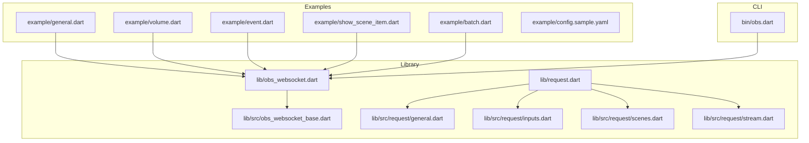
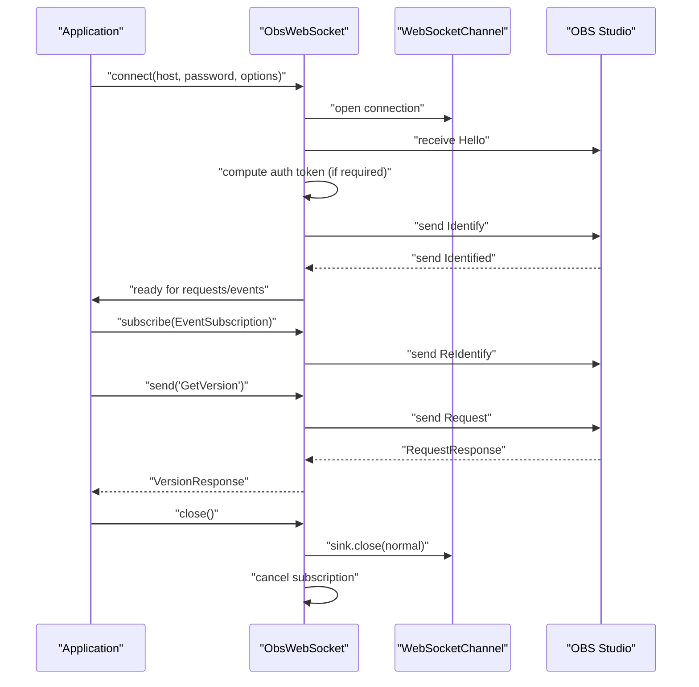
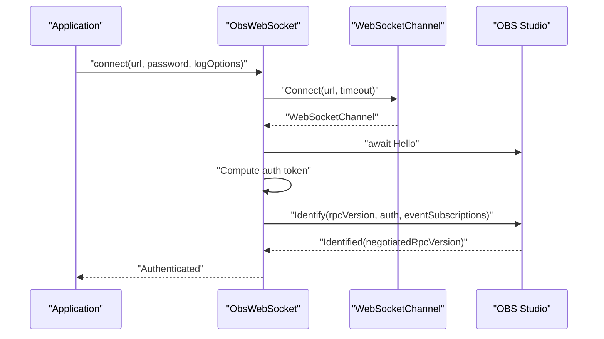
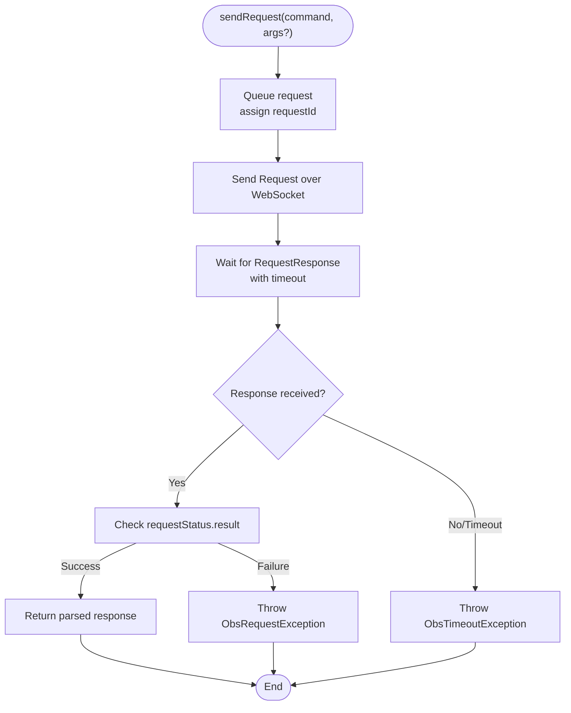
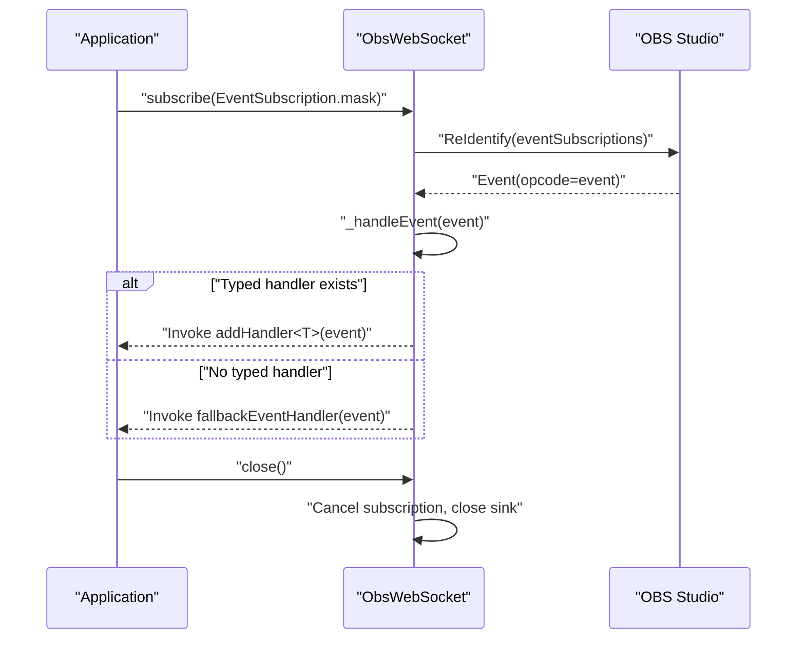
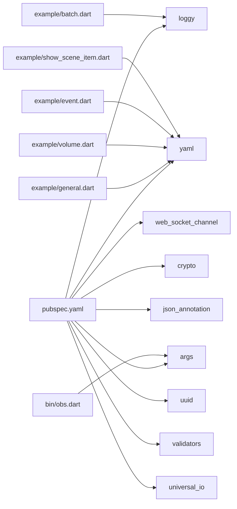

# Basic Usage Examples

<cite>
**Referenced Files in This Document**
- [README.md](file://README.md)
- [pubspec.yaml](file://pubspec.yaml)
- [lib/obs_websocket.dart](file://lib/obs_websocket.dart)
- [lib/src/obs_websocket_base.dart](file://lib/src/obs_websocket_base.dart)
- [lib/request.dart](file://lib/request.dart)
- [lib/src/request/general.dart](file://lib/src/request/general.dart)
- [lib/src/request/inputs.dart](file://lib/src/request/inputs.dart)
- [lib/src/request/scenes.dart](file://lib/src/request/scenes.dart)
- [lib/src/request/stream.dart](file://lib/src/request/stream.dart)
- [example/general.dart](file://example/general.dart)
- [example/volume.dart](file://example/volume.dart)
- [example/event.dart](file://example/event.dart)
- [example/show_scene_item.dart](file://example/show_scene_item.dart)
- [example/batch.dart](file://example/batch.dart)
- [example/config.sample.yaml](file://example/config.sample.yaml)
- [bin/obs.dart](file://bin/obs.dart)
</cite>

## Table of Contents
1. [Introduction](#introduction)
2. [Project Structure](#project-structure)
3. [Core Components](#core-components)
4. [Architecture Overview](#architecture-overview)
5. [Detailed Component Analysis](#detailed-component-analysis)
6. [Dependency Analysis](#dependency-analysis)
7. [Performance Considerations](#performance-considerations)
8. [Troubleshooting Guide](#troubleshooting-guide)
9. [Conclusion](#conclusion)
10. [Appendices](#appendices)

## Introduction
This guide demonstrates how to use obs-websocket-dart for basic OBS Studio automation. It covers connecting to OBS, authenticating, managing the connection lifecycle, and performing common operations such as retrieving the OBS version, listing scenes, accessing input volumes, and checking stream status. It also explains configuration file setup, environment preparation, logging configuration, error handling patterns, and best practices for resource management and graceful shutdown.

## Project Structure
The repository provides:
- A Dart library exposing a typed client for obs-websocket protocol v5.x
- Example scripts demonstrating typical usage patterns
- A CLI tool for quick testing and automation
- Logging and configuration utilities

**Diagram sources**
- [lib/obs_websocket.dart:1-69](file://lib/obs_websocket.dart#L1-L69)
- [lib/src/obs_websocket_base.dart:1-515](file://lib/src/obs_websocket_base.dart#L1-L515)
- [lib/request.dart:1-19](file://lib/request.dart#L1-L19)
- [lib/src/request/general.dart:1-143](file://lib/src/request/general.dart#L1-L143)
- [lib/src/request/inputs.dart:1-389](file://lib/src/request/inputs.dart#L1-L389)
- [lib/src/request/scenes.dart:1-232](file://lib/src/request/scenes.dart#L1-L232)
- [lib/src/request/stream.dart:1-94](file://lib/src/request/stream.dart#L1-L94)
- [example/general.dart:1-152](file://example/general.dart#L1-L152)
- [example/volume.dart:1-28](file://example/volume.dart#L1-L28)
- [example/event.dart:1-44](file://example/event.dart#L1-L44)
- [example/show_scene_item.dart:1-70](file://example/show_scene_item.dart#L1-L70)
- [example/batch.dart:1-30](file://example/batch.dart#L1-L30)
- [example/config.sample.yaml:1-8](file://example/config.sample.yaml#L1-L8)
- [bin/obs.dart:1-57](file://bin/obs.dart#L1-L57)

**Section sources**
- [README.md:41-104](file://README.md#L41-L104)
- [pubspec.yaml:1-38](file://pubspec.yaml#L1-L38)

## Core Components
- ObsWebSocket: The main client class that manages the WebSocket connection, authentication handshake, request/response lifecycle, event subscriptions, and logging.
- Request modules: Typed helpers for General, Inputs, Scenes, Stream, and other categories of requests.
- Examples: Ready-to-run scripts showcasing connection, events, and common operations.
- CLI: A command-line interface for quick tasks and testing.

Key capabilities demonstrated in examples:
- Connecting with optional password and logging configuration
- Subscribing to events and handling typed and fallback events
- Performing high-level requests (e.g., GetVersion, GetStreamStatus)
- Low-level send() usage for advanced scenarios
- Batch requests for improved throughput
- Graceful shutdown via close()

**Section sources**
- [lib/src/obs_websocket_base.dart:130-169](file://lib/src/obs_websocket_base.dart#L130-L169)
- [lib/src/obs_websocket_base.dart:260-318](file://lib/src/obs_websocket_base.dart#L260-L318)
- [lib/src/obs_websocket_base.dart:398-408](file://lib/src/obs_websocket_base.dart#L398-L408)
- [lib/request.dart:1-19](file://lib/request.dart#L1-L19)
- [lib/src/request/general.dart:9-25](file://lib/src/request/general.dart#L9-L25)
- [lib/src/request/inputs.dart:371-387](file://lib/src/request/inputs.dart#L371-L387)
- [lib/src/request/scenes.dart:16-38](file://lib/src/request/scenes.dart#L16-L38)
- [lib/src/request/stream.dart:14-32](file://lib/src/request/stream.dart#L14-L32)
- [example/general.dart:7-17](file://example/general.dart#L7-L17)
- [example/batch.dart:17-28](file://example/batch.dart#L17-L28)

## Architecture Overview
The client follows a structured flow:
- Initialization: Establish WebSocket, perform handshake, authenticate (if password provided)
- Request lifecycle: Queue outgoing requests, correlate responses by requestId, enforce timeouts
- Event lifecycle: Subscribe to event masks, route events to typed handlers or fallback handlers
- Shutdown: Cancel subscriptions, close sink gracefully

**Diagram sources**
- [lib/src/obs_websocket_base.dart:130-169](file://lib/src/obs_websocket_base.dart#L130-L169)
- [lib/src/obs_websocket_base.dart:260-318](file://lib/src/obs_websocket_base.dart#L260-L318)
- [lib/src/obs_websocket_base.dart:338-372](file://lib/src/obs_websocket_base.dart#L338-L372)
- [lib/src/obs_websocket_base.dart:448-503](file://lib/src/obs_websocket_base.dart#L448-L503)
- [lib/src/obs_websocket_base.dart:398-408](file://lib/src/obs_websocket_base.dart#L398-L408)

## Detailed Component Analysis

### Connection and Authentication
- Host configuration: Provide ws:// or wss:// URL or a host string (the client normalizes to ws:// if missing).
- Authentication: If OBS requires a password, supply it during connect; the client computes the challenge-response token and sends an Identify message.
- Logging: Configure LogOptions to enable debug logs for troubleshooting.

**Diagram sources**
- [lib/src/obs_websocket_base.dart:130-169](file://lib/src/obs_websocket_base.dart#L130-L169)
- [lib/src/obs_websocket_base.dart:260-318](file://lib/src/obs_websocket_base.dart#L260-L318)

**Section sources**
- [lib/src/obs_websocket_base.dart:130-169](file://lib/src/obs_websocket_base.dart#L130-L169)
- [lib/src/obs_websocket_base.dart:260-318](file://lib/src/obs_websocket_base.dart#L260-L318)
- [example/general.dart:7-17](file://example/general.dart#L7-L17)

### Request Lifecycle and Error Handling
- High-level helpers: Use category-specific getters and methods (e.g., general.version, inputs.getInputVolume, scenes.list, stream.status).
- Low-level send(): Submit raw request names with optional arguments.
- Error handling: Responses with non-success status raise ObsRequestException; timeouts raise ObsTimeoutException; stream errors cancel pending requests.

**Diagram sources**
- [lib/src/obs_websocket_base.dart:477-503](file://lib/src/obs_websocket_base.dart#L477-L503)
- [lib/src/obs_websocket_base.dart:505-513](file://lib/src/obs_websocket_base.dart#L505-L513)

**Section sources**
- [lib/src/obs_websocket_base.dart:448-503](file://lib/src/obs_websocket_base.dart#L448-L503)
- [lib/src/obs_websocket_base.dart:505-513](file://lib/src/obs_websocket_base.dart#L505-L513)
- [lib/src/request/general.dart:21-25](file://lib/src/request/general.dart#L21-L25)
- [lib/src/request/inputs.dart:371-387](file://lib/src/request/inputs.dart#L371-L387)
- [lib/src/request/scenes.dart:34-38](file://lib/src/request/scenes.dart#L34-L38)
- [lib/src/request/stream.dart:28-32](file://lib/src/request/stream.dart#L28-L32)

### Event Subscription and Handling
- Subscribe to event masks using subscribe(EventSubscription) or bitwise combinations.
- Register typed handlers via addHandler<T>() for supported event types.
- Use fallbackEventHandler for unsupported events.
- Close the connection on completion to free resources.

**Diagram sources**
- [lib/src/obs_websocket_base.dart:338-372](file://lib/src/obs_websocket_base.dart#L338-L372)
- [lib/src/obs_websocket_base.dart:374-395](file://lib/src/obs_websocket_base.dart#L374-L395)
- [lib/src/obs_websocket_base.dart:398-408](file://lib/src/obs_websocket_base.dart#L398-L408)

**Section sources**
- [lib/src/obs_websocket_base.dart:338-372](file://lib/src/obs_websocket_base.dart#L338-L372)
- [lib/src/obs_websocket_base.dart:374-395](file://lib/src/obs_websocket_base.dart#L374-L395)
- [example/event.dart:19-42](file://example/event.dart#L19-L42)

### Practical Operations: Examples Walkthrough
- Getting OBS version:
  - Use general.version or general.getVersion().
  - Reference: [lib/src/request/general.dart:9-25](file://lib/src/request/general.dart#L9-L25)
  - Example usage: [example/general.dart:72-74](file://example/general.dart#L72-L74)

- Retrieving scene lists:
  - Use scenes.list() or scenes.getSceneList().
  - Reference: [lib/src/request/scenes.dart:16-38](file://lib/src/request/scenes.dart#L16-L38)
  - Example usage: [example/general.dart:90-103](file://example/general.dart#L90-L103)

- Accessing input volumes:
  - Use inputs.getInputVolume(inputName: '...').
  - Reference: [lib/src/request/inputs.dart:371-387](file://lib/src/request/inputs.dart#L371-L387)
  - Example usage: [example/general.dart:48-50](file://example/general.dart#L48-L50), [example/volume.dart:17-23](file://example/volume.dart#L17-L23)

- Checking stream status:
  - Use stream.status or stream.getStreamStatus().
  - Reference: [lib/src/request/stream.dart:14-32](file://lib/src/request/stream.dart#L14-L32)
  - Example usage: [example/general.dart:79-81](file://example/general.dart#L79-L81), [example/general.dart:84-88](file://example/general.dart#L84-L88)

- Batch requests:
  - Build a list of Request objects and call sendBatch().
  - Reference: [lib/src/obs_websocket_base.dart:453-475](file://lib/src/obs_websocket_base.dart#L453-L475)
  - Example usage: [example/batch.dart:17-28](file://example/batch.dart#L17-L28)

- Listening for input volume changes:
  - Subscribe to input volume meters and register addHandler<InputVolumeChanged>.
  - Reference: [lib/src/obs_websocket_base.dart:338-372](file://lib/src/obs_websocket_base.dart#L338-L372)
  - Example usage: [example/volume.dart:14-27](file://example/volume.dart#L14-L27)

- Event-driven scene item toggling:
  - Subscribe to SceneItemEnableStateChanged and toggle visibility after delay.
  - Example usage: [example/show_scene_item.dart:32-53](file://example/show_scene_item.dart#L32-L53)

**Section sources**
- [lib/src/request/general.dart:9-25](file://lib/src/request/general.dart#L9-L25)
- [lib/src/request/scenes.dart:16-38](file://lib/src/request/scenes.dart#L16-L38)
- [lib/src/request/inputs.dart:371-387](file://lib/src/request/inputs.dart#L371-L387)
- [lib/src/request/stream.dart:14-32](file://lib/src/request/stream.dart#L14-L32)
- [lib/src/obs_websocket_base.dart:453-475](file://lib/src/obs_websocket_base.dart#L453-L475)
- [example/general.dart:48-88](file://example/general.dart#L48-L88)
- [example/batch.dart:17-28](file://example/batch.dart#L17-L28)
- [example/volume.dart:14-27](file://example/volume.dart#L14-L27)
- [example/show_scene_item.dart:32-53](file://example/show_scene_item.dart#L32-L53)

## Dependency Analysis
External dependencies used by the library and examples include:
- web_socket_channel for WebSocket transport
- loggy for structured logging
- yaml for parsing configuration files
- args for CLI argument parsing
- crypto, json_annotation, uuid, validators, universal_io for supporting functionality

**Diagram sources**
- [pubspec.yaml:13-22](file://pubspec.yaml#L13-L22)
- [example/general.dart:1-6](file://example/general.dart#L1-L6)
- [example/volume.dart:1-5](file://example/volume.dart#L1-L5)
- [example/event.dart:1-6](file://example/event.dart#L1-L6)
- [example/show_scene_item.dart:1-6](file://example/show_scene_item.dart#L1-L6)
- [example/batch.dart:1-5](file://example/batch.dart#L1-L5)
- [bin/obs.dart:1-5](file://bin/obs.dart#L1-L5)

**Section sources**
- [pubspec.yaml:13-22](file://pubspec.yaml#L13-L22)
- [example/general.dart:1-6](file://example/general.dart#L1-L6)
- [example/volume.dart:1-5](file://example/volume.dart#L1-L5)
- [example/event.dart:1-6](file://example/event.dart#L1-L6)
- [example/show_scene_item.dart:1-6](file://example/show_scene_item.dart#L1-L6)
- [example/batch.dart:1-5](file://example/batch.dart#L1-L5)
- [bin/obs.dart:1-5](file://bin/obs.dart#L1-L5)

## Performance Considerations
- Prefer batch requests for multiple independent queries to reduce round-trips.
- Limit event subscriptions to only what you need to minimize bandwidth and CPU overhead.
- Use appropriate requestTimeout values to avoid indefinite hangs while still allowing sufficient time for OBS operations.
- Close connections promptly to prevent resource leaks and maintain OBS performance.

[No sources needed since this section provides general guidance]

## Troubleshooting Guide
Common issues and resolutions:
- Connection fails or times out:
  - Verify the host URL and port; ensure ws:// or wss:// is used or that normalization applies.
  - Confirm OBS is reachable on the network and the obs-websocket plugin is enabled.
  - Increase timeout if needed.
  - Reference: [lib/src/obs_websocket_base.dart:130-169](file://lib/src/obs_websocket_base.dart#L130-L169)

- Authentication failure:
  - Ensure the correct password matches OBS settings.
  - If OBS does not require a password, omit the password parameter.
  - Reference: [lib/src/obs_websocket_base.dart:260-318](file://lib/src/obs_websocket_base.dart#L260-L318)

- No events received:
  - Subscribe to the appropriate EventSubscription mask before expecting events.
  - Use fallbackEventHandler to inspect unknown events.
  - Reference: [lib/src/obs_websocket_base.dart:338-372](file://lib/src/obs_websocket_base.dart#L338-L372), [lib/src/obs_websocket_base.dart:442-446](file://lib/src/obs_websocket_base.dart#L442-L446)

- Request timeouts:
  - Adjust requestTimeout or simplify the workload.
  - Check OBS responsiveness and avoid heavy operations during critical moments.
  - Reference: [lib/src/obs_websocket_base.dart:477-503](file://lib/src/obs_websocket_base.dart#L477-L503)

- Logging and diagnostics:
  - Enable LogOptions(LogLevel.debug) to capture detailed logs.
  - Reference: [example/general.dart](file://example/general.dart#L13)

- Graceful shutdown:
  - Always call close() to release resources and avoid performance issues in OBS.
  - Reference: [lib/src/obs_websocket_base.dart:398-408](file://lib/src/obs_websocket_base.dart#L398-L408)

**Section sources**
- [lib/src/obs_websocket_base.dart:130-169](file://lib/src/obs_websocket_base.dart#L130-L169)
- [lib/src/obs_websocket_base.dart:260-318](file://lib/src/obs_websocket_base.dart#L260-L318)
- [lib/src/obs_websocket_base.dart:338-372](file://lib/src/obs_websocket_base.dart#L338-L372)
- [lib/src/obs_websocket_base.dart:442-446](file://lib/src/obs_websocket_base.dart#L442-L446)
- [lib/src/obs_websocket_base.dart:477-503](file://lib/src/obs_websocket_base.dart#L477-L503)
- [lib/src/obs_websocket_base.dart:398-408](file://lib/src/obs_websocket_base.dart#L398-L408)
- [example/general.dart](file://example/general.dart#L13)

## Conclusion
With obs-websocket-dart, you can reliably connect to OBS, authenticate, subscribe to events, and perform common automation tasks. Use the provided examples as templates, configure logging for diagnostics, and always close connections gracefully. For advanced scenarios, leverage low-level send() and batch requests to optimize performance.

[No sources needed since this section summarizes without analyzing specific files]

## Appendices

### Configuration File Setup and Environment Preparation
- Prepare a YAML configuration file with host and password, mirroring the sample layout.
- Load the configuration in your script and pass values to ObsWebSocket.connect().
- Ensure the environment has Dart SDK and dependencies installed.

References:
- [example/config.sample.yaml:1-8](file://example/config.sample.yaml#L1-L8)
- [example/general.dart:7-17](file://example/general.dart#L7-L17)
- [pubspec.yaml:10-11](file://pubspec.yaml#L10-L11)

**Section sources**
- [example/config.sample.yaml:1-8](file://example/config.sample.yaml#L1-L8)
- [example/general.dart:7-17](file://example/general.dart#L7-L17)
- [pubspec.yaml:10-11](file://pubspec.yaml#L10-L11)

### CLI Quick Start
- Install the CLI globally via the project’s instructions.
- Use commands to test connectivity, list scenes, manage streams, and listen to events.

Reference:
- [bin/obs.dart:1-57](file://bin/obs.dart#L1-L57)

**Section sources**
- [bin/obs.dart:1-57](file://bin/obs.dart#L1-L57)