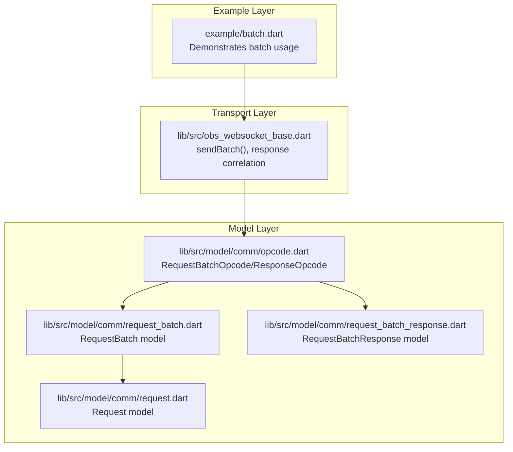
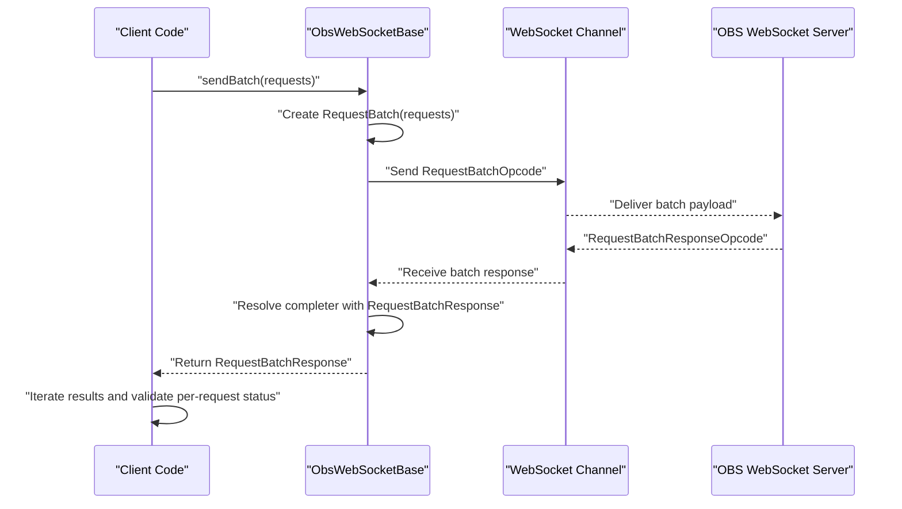
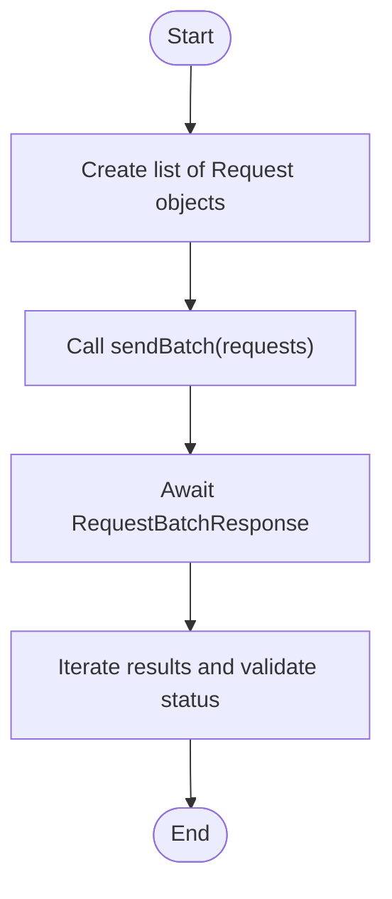
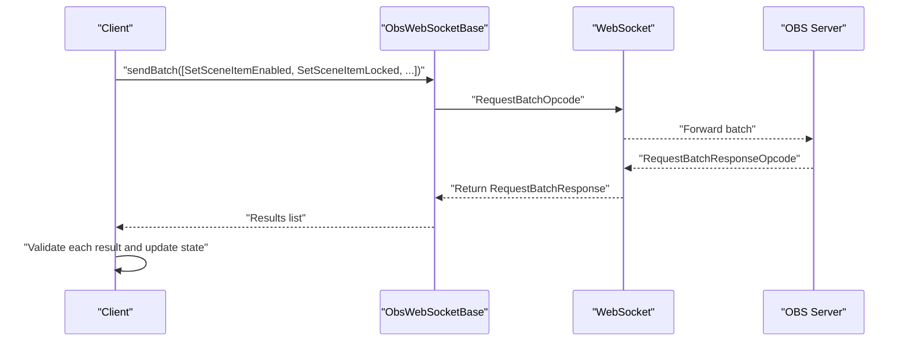
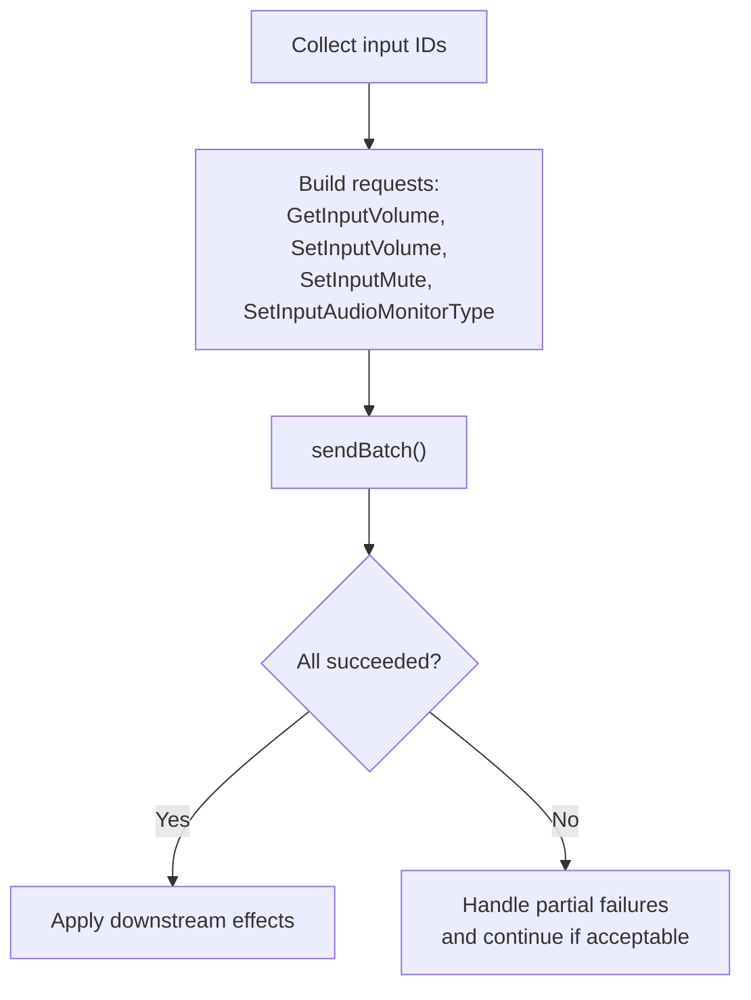
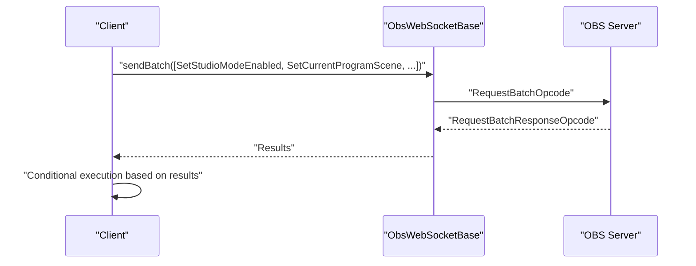

# Batch Operations Examples

<cite>
**Referenced Files in This Document**
- [batch.dart](file://example/batch.dart)
- [obs_websocket_base.dart](file://lib/src/obs_websocket_base.dart)
- [request_batch.dart](file://lib/src/model/comm/request_batch.dart)
- [request_batch_response.dart](file://lib/src/model/comm/request_batch_response.dart)
- [request.dart](file://lib/src/model/comm/request.dart)
- [opcode.dart](file://lib/src/model/comm/opcode.dart)
- [README.md](file://README.md)
</cite>

## Table of Contents
1. [Introduction](#introduction)
2. [Project Structure](#project-structure)
3. [Core Components](#core-components)
4. [Architecture Overview](#architecture-overview)
5. [Detailed Component Analysis](#detailed-component-analysis)
6. [Dependency Analysis](#dependency-analysis)
7. [Performance Considerations](#performance-considerations)
8. [Troubleshooting Guide](#troubleshooting-guide)
9. [Conclusion](#conclusion)

## Introduction
This document provides practical, production-ready examples of batch operations for efficient multi-request execution and bulk operations against OBS Studio via the obs-websocket protocol. It focuses on:
- Creating and executing batch requests
- Handling batch responses and validating results
- Optimizing performance through batching
- Managing atomicity and error handling within batches
- Advanced patterns: conditional execution, result aggregation, and coordinated system state changes
- Real-world scenarios: bulk scene item updates, mass audio parameter adjustments, and coordinated state changes

The examples leverage the existing batch infrastructure in the codebase and demonstrate best practices for large-scale automation.

## Project Structure
The batch operation capability is implemented across several core modules:
- Example usage: a minimal batch example demonstrates constructing multiple requests and executing them in a single batch
- Core transport: the WebSocket base class handles batch submission, response correlation, and timeouts
- Data models: request, request batch, and request batch response models define the payload structure and serialization
- Protocol opcodes: opcodes encapsulate the wire-level encoding for batch messages

**Diagram sources**
- [batch.dart:1-30](file://example/batch.dart#L1-L30)
- [obs_websocket_base.dart:451-473](file://lib/src/obs_websocket_base.dart#L451-L473)
- [request_batch.dart:12-39](file://lib/src/model/comm/request_batch.dart#L12-L39)
- [request_batch_response.dart:8-22](file://lib/src/model/comm/request_batch_response.dart#L8-L22)
- [request.dart:10-37](file://lib/src/model/comm/request.dart#L10-L37)
- [opcode.dart:71-86](file://lib/src/model/comm/opcode.dart#L71-L86)

**Section sources**
- [batch.dart:1-30](file://example/batch.dart#L1-L30)
- [obs_websocket_base.dart:451-473](file://lib/src/obs_websocket_base.dart#L451-L473)
- [request_batch.dart:12-39](file://lib/src/model/comm/request_batch.dart#L12-L39)
- [request_batch_response.dart:8-22](file://lib/src/model/comm/request_batch_response.dart#L8-L22)
- [request.dart:10-37](file://lib/src/model/comm/request.dart#L10-L37)
- [opcode.dart:71-86](file://lib/src/model/comm/opcode.dart#L71-L86)

## Core Components
This section outlines the essential building blocks for batch operations and how they work together.

- Request model: represents a single request with type, optional data, and response expectation
- RequestBatch model: aggregates multiple requests with execution semantics and failure behavior
- RequestBatchResponse model: carries per-request results and correlates them to the originating batch
- Opcode wrappers: serialize batch and batch response payloads for WebSocket transmission
- Transport layer: submits the batch, correlates responses, and manages timeouts

Key behaviors:
- Each Request gets a unique ID and defaults to expecting a response for "Get" requests
- RequestBatch assigns a unique batch ID and serializes into a RequestBatchOpcode
- Responses are returned as RequestBatchResponse with ordered results matching the submitted requests
- The transport layer stores pending batches by ID and resolves futures upon receiving the correlated response

**Section sources**
- [request.dart:10-37](file://lib/src/model/comm/request.dart#L10-L37)
- [request_batch.dart:12-39](file://lib/src/model/comm/request_batch.dart#L12-L39)
- [request_batch_response.dart:8-22](file://lib/src/model/comm/request_batch_response.dart#L8-L22)
- [opcode.dart:71-86](file://lib/src/model/comm/opcode.dart#L71-L86)
- [obs_websocket_base.dart:451-473](file://lib/src/obs_websocket_base.dart#L451-L473)

## Architecture Overview
The batch execution pipeline follows a strict request-response flow with correlation by request IDs.

**Diagram sources**
- [obs_websocket_base.dart:451-473](file://lib/src/obs_websocket_base.dart#L451-L473)
- [request_batch.dart:12-39](file://lib/src/model/comm/request_batch.dart#L12-L39)
- [request_batch_response.dart:8-22](file://lib/src/model/comm/request_batch_response.dart#L8-L22)
- [opcode.dart:71-86](file://lib/src/model/comm/opcode.dart#L71-L86)

## Detailed Component Analysis

### Batch Request Creation and Execution
This example demonstrates constructing a batch of independent requests and executing them atomically.

Practical steps:
- Construct individual Request objects for each operation
- Pass the list to sendBatch
- Receive RequestBatchResponse and iterate over results
- Validate each RequestResponse status before proceeding

Validation pattern:
- Inspect requestType and requestStatus.code for each result
- Treat failures according to business logic (continue, abort, or retry)

**Diagram sources**
- [batch.dart:17-28](file://example/batch.dart#L17-L28)
- [obs_websocket_base.dart:451-473](file://lib/src/obs_websocket_base.dart#L451-L473)
- [request_batch_response.dart:8-22](file://lib/src/model/comm/request_batch_response.dart#L8-L22)

**Section sources**
- [batch.dart:17-28](file://example/batch.dart#L17-L28)
- [obs_websocket_base.dart:451-473](file://lib/src/obs_websocket_base.dart#L451-L473)
- [request_batch_response.dart:8-22](file://lib/src/model/comm/request_batch_response.dart#L8-L22)

### Bulk Scene Item Updates
Scenario: Update visibility, lock state, and index for multiple scene items in a single batch.

Implementation outline:
- Build a list of requests targeting scene items (e.g., SetSceneItemEnabled, SetSceneItemLocked, SetSceneItemIndex)
- Submit with sendBatch
- Aggregate results and apply conditional logic per-item

Best practices:
- Group related updates together to minimize round-trips
- Validate each result before applying downstream actions
- Use SetSceneItemIndex to reorder efficiently in a single batch

**Diagram sources**
- [obs_websocket_base.dart:451-473](file://lib/src/obs_websocket_base.dart#L451-L473)
- [request_batch.dart:12-39](file://lib/src/model/comm/request_batch.dart#L12-L39)
- [opcode.dart:71-86](file://lib/src/model/comm/opcode.dart#L71-L86)

### Mass Audio Parameter Adjustments
Scenario: Adjust volume, mute state, and monitoring type for multiple inputs.

Implementation outline:
- Compose requests for GetInputVolume, SetInputVolume, SetInputMute, SetInputAudioMonitorType
- Execute in a batch and validate each response
- Apply conditional logic based on prior states

**Diagram sources**
- [obs_websocket_base.dart:451-473](file://lib/src/obs_websocket_base.dart#L451-L473)
- [request_batch.dart:12-39](file://lib/src/model/comm/request_batch.dart#L12-L39)

### Coordinated System State Changes
Scenario: Toggle studio mode, switch scenes, and adjust transitions atomically.

Implementation outline:
- Create a batch containing SetStudioModeEnabled, SetCurrentProgramScene, SetCurrentSceneTransition, SetCurrentSceneTransitionDuration
- Execute and validate each step
- Abort or roll back on failure depending on policy

**Diagram sources**
- [obs_websocket_base.dart:451-473](file://lib/src/obs_websocket_base.dart#L451-L473)
- [request_batch.dart:12-39](file://lib/src/model/comm/request_batch.dart#L12-L39)
- [opcode.dart:71-86](file://lib/src/model/comm/opcode.dart#L71-L86)

### Advanced Batching Patterns

#### Conditional Execution Within a Batch
- Use Get* requests to fetch current state before issuing Set* updates
- Build conditional logic in client code based on previous results
- For strictly atomic behavior across multiple systems, consider orchestrating multiple batches with explicit checks

#### Error Handling Within Batches
- Inspect each RequestResponse in RequestBatchResponse.results
- Decide whether to continue, abort, or retry based on business requirements
- Use haltOnFailure to control early termination if needed

#### Result Aggregation
- Iterate results in order and maintain a summary map keyed by requestType or target identifier
- Apply transformations or downstream actions only after successful validation

#### Atomic Operations Across Systems
- For true atomicity across multiple systems, implement external coordination (e.g., transaction logs) and compensating actions
- Within a single OBS instance, batches provide ordered execution with immediate feedback

**Section sources**
- [obs_websocket_base.dart:451-473](file://lib/src/obs_websocket_base.dart#L451-L473)
- [request_batch_response.dart:8-22](file://lib/src/model/comm/request_batch_response.dart#L8-L22)

## Dependency Analysis
The batch execution depends on a clear chain of abstractions:

Key relationships:
- RequestBatch aggregates Request objects and serializes them into a batch opcode
- The transport layer correlates responses via request IDs
- Client code consumes RequestBatchResponse and validates per-request outcomes

Potential coupling points:
- Correlation by request IDs requires robust ID generation and storage
- Timeout handling ensures client responsiveness under network issues

**Diagram sources**
- [request.dart:10-37](file://lib/src/model/comm/request.dart#L10-L37)
- [request_batch.dart:12-39](file://lib/src/model/comm/request_batch.dart#L12-L39)
- [opcode.dart:71-86](file://lib/src/model/comm/opcode.dart#L71-L86)
- [obs_websocket_base.dart:451-473](file://lib/src/obs_websocket_base.dart#L451-L473)
- [request_batch_response.dart:8-22](file://lib/src/model/comm/request_batch_response.dart#L8-L22)

**Section sources**
- [request.dart:10-37](file://lib/src/model/comm/request.dart#L10-L37)
- [request_batch.dart:12-39](file://lib/src/model/comm/request_batch.dart#L12-L39)
- [opcode.dart:71-86](file://lib/src/model/comm/opcode.dart#L71-L86)
- [obs_websocket_base.dart:451-473](file://lib/src/obs_websocket_base.dart#L451-L473)
- [request_batch_response.dart:8-22](file://lib/src/model/comm/request_batch_response.dart#L8-L22)

## Performance Considerations
- Reduced round-trips: Batching consolidates multiple requests into a single WebSocket message, minimizing latency overhead
- Network efficiency: Fewer TCP/TLS handshakes and reduced protocol framing overhead
- Ordered execution: Batches preserve request order, enabling predictable state transitions
- Scalability: For large-scale automation, batching reduces the total number of operations and improves throughput

Guidance:
- Group logically related operations (e.g., scene item updates, audio adjustments) into a single batch
- Avoid mixing incompatible operations (e.g., read and write on the same resource) without proper sequencing
- Monitor response sizes and consider splitting very large batches if needed

[No sources needed since this section provides general guidance]

## Troubleshooting Guide
Common issues and resolutions:
- Timeout during batch execution: The transport layer throws a timeout exception when waiting for a response. Increase timeouts or split the batch into smaller units
- Partial failures: Not all results may succeed. Validate each RequestResponse and implement retry or rollback logic
- Correlation mismatches: Ensure batch IDs are preserved and futures are resolved only upon receipt of the matching response
- Unexpected ordering: Verify that the server respects the order of requests within the batch

Operational tips:
- Enable logging to inspect outgoing RequestBatchOpcode and incoming RequestBatchResponseOpcode
- Validate requestStatus.code for each result and handle non-success codes appropriately
- Keep batch sizes reasonable to avoid overwhelming the server or exceeding limits

**Section sources**
- [obs_websocket_base.dart:462-472](file://lib/src/obs_websocket_base.dart#L462-L472)
- [request_batch_response.dart:8-22](file://lib/src/model/comm/request_batch_response.dart#L8-L22)

## Conclusion
Batch operations provide a powerful mechanism to optimize performance and coordinate multiple changes in OBS Studio. By leveraging the existing Request, RequestBatch, and RequestBatchResponse models along with the transport layer’s correlation and timeout handling, developers can implement efficient, reliable, and scalable automation workflows. For advanced scenarios, combine batching with conditional logic, result aggregation, and careful error handling to achieve robust, production-grade solutions.

[No sources needed since this section summarizes without analyzing specific files]