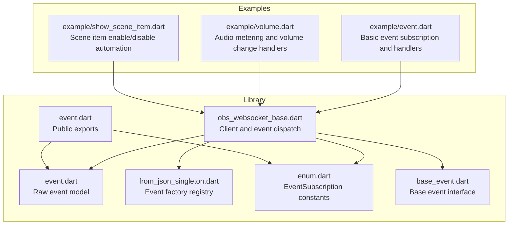
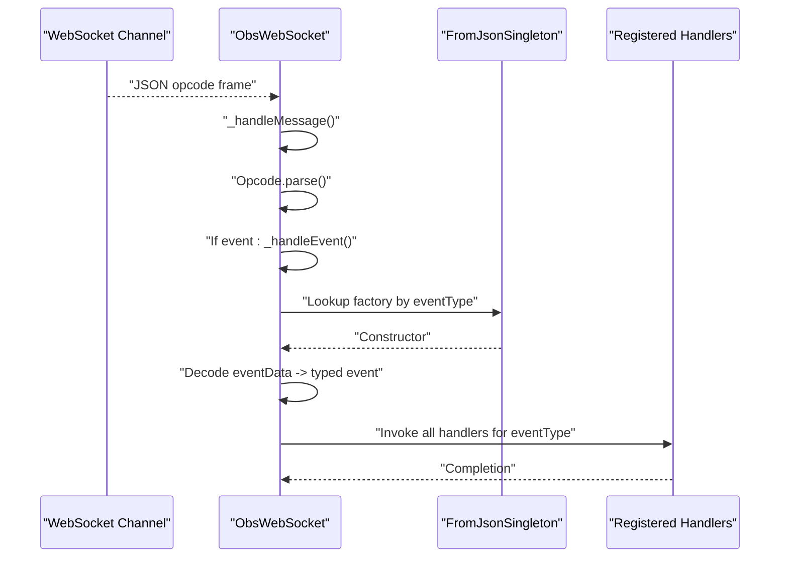
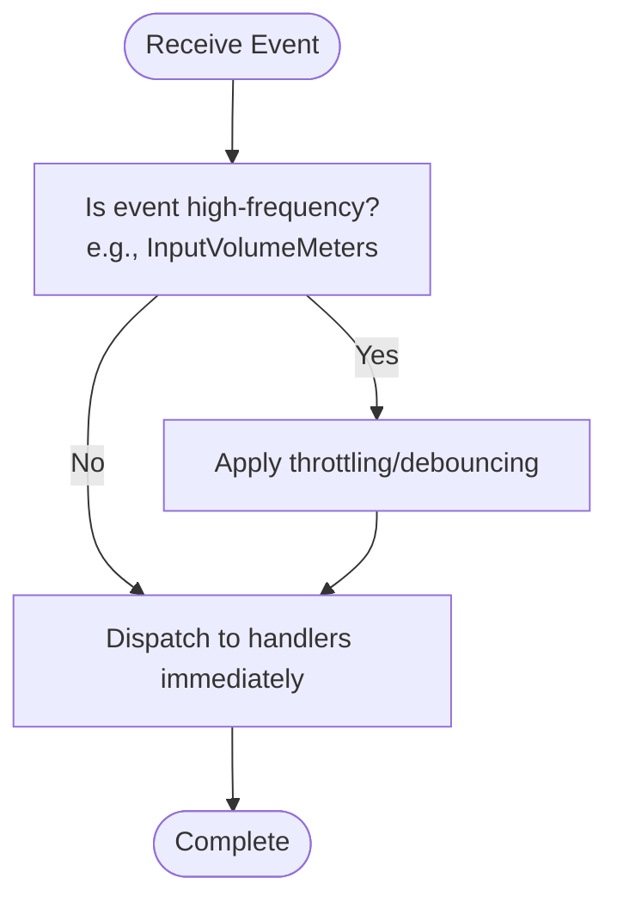
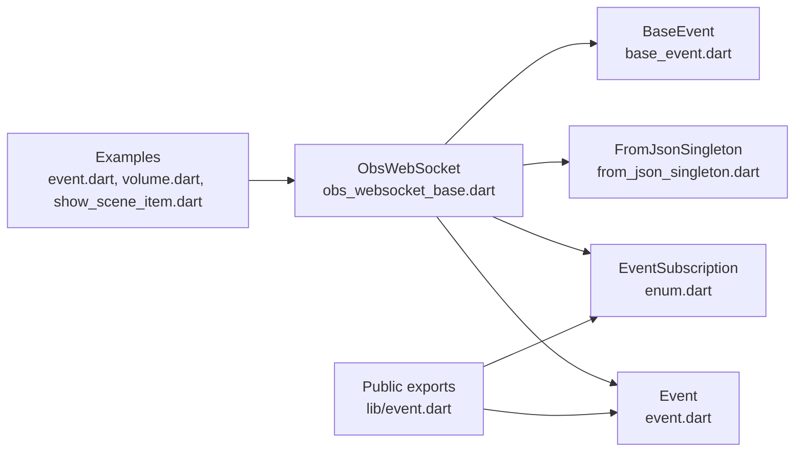

# Event-Driven Scripting

<cite>
**Referenced Files in This Document**
- [obs_websocket_base.dart](file://lib/src/obs_websocket_base.dart)
- [obs_websocket.dart](file://lib/obs_websocket.dart)
- [event.dart](file://lib/src/model/comm/event.dart)
- [from_json_singleton.dart](file://lib/src/from_json_singleton.dart)
- [enum.dart](file://lib/src/util/enum.dart)
- [base_event.dart](file://lib/src/model/event/base_event.dart)
- [event.dart](file://lib/event.dart)
- [input_volume_meters.dart](file://lib/src/model/event/inputs/input_volume_meters.dart)
- [input_volume_changed.dart](file://lib/src/model/event/inputs/input_volume_changed.dart)
- [current_program_scene_changed.dart](file://lib/src/model/event/scene/current_program_scene_changed.dart)
- [custom_event.dart](file://lib/src/model/event/general/custom_event.dart)
- [event.dart](file://example/event.dart)
- [volume.dart](file://example/volume.dart)
- [show_scene_item.dart](file://example/show_scene_item.dart)
</cite>

## Table of Contents
1. [Introduction](#introduction)
2. [Project Structure](#project-structure)
3. [Core Components](#core-components)
4. [Architecture Overview](#architecture-overview)
5. [Detailed Component Analysis](#detailed-component-analysis)
6. [Dependency Analysis](#dependency-analysis)
7. [Performance Considerations](#performance-considerations)
8. [Troubleshooting Guide](#troubleshooting-guide)
9. [Conclusion](#conclusion)
10. [Appendices](#appendices)

## Introduction
This document provides comprehensive event-driven scripting examples for real-time event handling and reactive automation with the OBS WebSocket client. It covers event subscription patterns, custom event handlers, and event-driven workflow automation. Practical scenarios include automatic scene switching based on external events, audio level monitoring and alerts, and integration with external systems via event hooks. Advanced patterns such as event filtering, debouncing, and event composition are addressed alongside performance considerations for high-frequency event processing and memory management for long-running event listeners.

## Project Structure
The library exposes a typed event system and a WebSocket client that manages subscriptions, decoding, and dispatching of OBS events. Example scripts demonstrate common automation patterns.

**Diagram sources**
- [obs_websocket_base.dart:1-513](file://lib/src/obs_websocket_base.dart#L1-L513)
- [event.dart:1-31](file://lib/src/model/comm/event.dart#L1-L31)
- [from_json_singleton.dart:1-27](file://lib/src/from_json_singleton.dart#L1-L27)
- [enum.dart:58-87](file://lib/src/util/enum.dart#L58-L87)
- [base_event.dart:1-7](file://lib/src/model/event/base_event.dart#L1-L7)
- [event.dart:1-50](file://lib/event.dart#L1-L50)
- [event.dart:1-46](file://example/event.dart#L1-L46)
- [volume.dart:1-28](file://example/volume.dart#L1-L28)
- [show_scene_item.dart:1-70](file://example/show_scene_item.dart#L1-L70)

**Section sources**
- [obs_websocket_base.dart:1-513](file://lib/src/obs_websocket_base.dart#L1-L513)
- [obs_websocket.dart:1-69](file://lib/obs_websocket.dart#L1-L69)
- [event.dart:1-31](file://lib/src/model/comm/event.dart#L1-L31)
- [from_json_singleton.dart:1-27](file://lib/src/from_json_singleton.dart#L1-L27)
- [enum.dart:58-87](file://lib/src/util/enum.dart#L58-L87)
- [base_event.dart:1-7](file://lib/src/model/event/base_event.dart#L1-L7)
- [event.dart:1-50](file://lib/event.dart#L1-L50)
- [event.dart:1-46](file://example/event.dart#L1-L46)
- [volume.dart:1-28](file://example/volume.dart#L1-L28)
- [show_scene_item.dart:1-70](file://example/show_scene_item.dart#L1-L70)

## Core Components
- ObsWebSocket: Manages WebSocket connection, handshake, subscriptions, and event dispatch. Provides subscribe(), addHandler<T>(), and fallback handling.
- Event: Decodable event envelope carrying eventType, eventIntent, and eventData.
- FromJsonSingleton: Registry mapping event names to typed constructors for decoding.
- EventSubscription: Bitmask constants enabling selective event subscriptions.
- BaseEvent: Contract for typed event models.

Key capabilities:
- Subscribe to subsets of events using bitwise masks.
- Register typed handlers for specific event types.
- Fallback handlers for untyped or unsupported events.
- High-frequency events like InputVolumeMeters are supported with dedicated models.

**Section sources**
- [obs_websocket_base.dart:118-169](file://lib/src/obs_websocket_base.dart#L118-L169)
- [obs_websocket_base.dart:352-372](file://lib/src/obs_websocket_base.dart#L352-L372)
- [obs_websocket_base.dart:410-429](file://lib/src/obs_websocket_base.dart#L410-L429)
- [obs_websocket_base.dart:441-446](file://lib/src/obs_websocket_base.dart#L441-L446)
- [event.dart:10-30](file://lib/src/model/comm/event.dart#L10-L30)
- [from_json_singleton.dart:9-27](file://lib/src/from_json_singleton.dart#L9-L27)
- [enum.dart:62-87](file://lib/src/util/enum.dart#L62-L87)
- [base_event.dart:1-7](file://lib/src/model/event/base_event.dart#L1-L7)

## Architecture Overview
The event pipeline connects incoming WebSocket frames to typed event models and dispatches them to registered handlers.

**Diagram sources**
- [obs_websocket_base.dart:180-236](file://lib/src/obs_websocket_base.dart#L180-L236)
- [obs_websocket_base.dart:374-395](file://lib/src/obs_websocket_base.dart#L374-L395)
- [from_json_singleton.dart:9-27](file://lib/src/from_json_singleton.dart#L9-L27)

## Detailed Component Analysis

### Event Subscription Patterns
- Single subscription: Pass a single EventSubscription or an integer mask to subscribe().
- Combined subscriptions: Use bitwise OR on EventSubscription values to combine categories.
- Re-identify mask updates: Internally sends a re-identify opcode with the new mask.

Practical usage:
- Subscribe to all events plus input volume meters.
- Combine scene and input subscriptions for targeted automation.

**Section sources**
- [obs_websocket_base.dart:352-372](file://lib/src/obs_websocket_base.dart#L352-L372)
- [enum.dart:62-87](file://lib/src/util/enum.dart#L62-L87)
- [event.dart:21-22](file://example/event.dart#L21-L22)
- [volume.dart:14-15](file://example/volume.dart#L14-L15)

### Custom Event Handlers
- Typed handlers: Register with addHandler<T>() for compile-time safety and IDE support.
- Fallback handlers: Register with addFallbackListener() to capture untyped events.
- Handler lifecycle: removeHandler<T>() clears all handlers for a type; removeFallbackListener() removes fallback handlers.

Example patterns:
- Scene name change detection and logging.
- Volume change notifications and metering.
- Exit started event to gracefully shut down.

**Section sources**
- [obs_websocket_base.dart:410-429](file://lib/src/obs_websocket_base.dart#L410-L429)
- [obs_websocket_base.dart:431-446](file://lib/src/obs_websocket_base.dart#L431-L446)
- [event.dart:24-44](file://example/event.dart#L24-L44)
- [volume.dart:17-26](file://example/volume.dart#L17-L26)

### Event-Driven Workflow Automation
- Automatic scene switching: Subscribe to scene change events and trigger scene transitions or item visibility changes.
- Audio monitoring and alerts: Subscribe to input volume changes and meters; apply thresholds and actions.
- External system integration: Use custom events and vendor events to bridge to external systems.

Concrete examples:
- Scene item enable/disable automation based on enable state events.
- Volume threshold alerts and subsequent actions.

**Section sources**
- [current_program_scene_changed.dart:10-25](file://lib/src/model/event/scene/current_program_scene_changed.dart#L10-L25)
- [input_volume_changed.dart:15-44](file://lib/src/model/event/inputs/input_volume_changed.dart#L15-L44)
- [input_volume_meters.dart:15-30](file://lib/src/model/event/inputs/input_volume_meters.dart#L15-L30)
- [custom_event.dart:10-25](file://lib/src/model/event/general/custom_event.dart#L10-L25)
- [show_scene_item.dart:32-53](file://example/show_scene_item.dart#L32-L53)

### Advanced Event Handling Patterns

#### Event Filtering
- Use EventSubscription masks to filter low-level noise and focus on relevant categories.
- Combine masks to include only desired event streams (e.g., scenes and inputs).

**Section sources**
- [enum.dart:62-87](file://lib/src/util/enum.dart#L62-L87)
- [obs_websocket_base.dart:352-372](file://lib/src/obs_websocket_base.dart#L352-L372)

#### Debouncing
- For high-frequency events (e.g., InputVolumeMeters), debounce handler invocations to reduce processing overhead.
- Strategy: Track last processed timestamp and coalesce updates within a short window.

[No sources needed since this section provides general guidance]

#### Event Composition
- Compose multiple event handlers to build complex workflows (e.g., scene change → item visibility → audio alert).
- Use a central orchestrator to manage state transitions across handlers.

[No sources needed since this section provides general guidance]

### High-Frequency Event Processing

[No sources needed since this diagram shows conceptual workflow, not actual code structure]

**Section sources**
- [input_volume_meters.dart:9-13](file://lib/src/model/event/inputs/input_volume_meters.dart#L9-L13)

### Memory Management for Long-Running Listeners
- Remove unused handlers periodically to prevent accumulation.
- Use weak references or scoped handler lifecycles where applicable.
- Close connections cleanly to release resources.

**Section sources**
- [obs_websocket_base.dart:398-408](file://lib/src/obs_websocket_base.dart#L398-L408)
- [obs_websocket_base.dart:416-429](file://lib/src/obs_websocket_base.dart#L416-L429)

## Dependency Analysis
The client depends on a WebSocket channel, an event envelope, a factory registry for typed events, and subscription constants. Examples depend on the client and typed event models.

**Diagram sources**
- [obs_websocket_base.dart:1-513](file://lib/src/obs_websocket_base.dart#L1-L513)
- [event.dart:1-31](file://lib/src/model/comm/event.dart#L1-L31)
- [from_json_singleton.dart:1-27](file://lib/src/from_json_singleton.dart#L1-L27)
- [enum.dart:58-87](file://lib/src/util/enum.dart#L58-L87)
- [base_event.dart:1-7](file://lib/src/model/event/base_event.dart#L1-L7)
- [event.dart:1-50](file://lib/event.dart#L1-L50)
- [event.dart:1-46](file://example/event.dart#L1-L46)
- [volume.dart:1-28](file://example/volume.dart#L1-L28)
- [show_scene_item.dart:1-70](file://example/show_scene_item.dart#L1-L70)

**Section sources**
- [obs_websocket_base.dart:1-513](file://lib/src/obs_websocket_base.dart#L1-L513)
- [event.dart:1-31](file://lib/src/model/comm/event.dart#L1-L31)
- [from_json_singleton.dart:1-27](file://lib/src/from_json_singleton.dart#L1-L27)
- [enum.dart:58-87](file://lib/src/util/enum.dart#L58-L87)
- [base_event.dart:1-7](file://lib/src/model/event/base_event.dart#L1-L7)
- [event.dart:1-50](file://lib/event.dart#L1-L50)
- [event.dart:1-46](file://example/event.dart#L1-L46)
- [volume.dart:1-28](file://example/volume.dart#L1-L28)
- [show_scene_item.dart:1-70](file://example/show_scene_item.dart#L1-L70)

## Performance Considerations
- Prefer filtered subscriptions to reduce bandwidth and CPU usage.
- Debounce or throttle high-frequency events to avoid overwhelming handlers.
- Batch operations where possible to minimize round trips.
- Monitor handler execution time and avoid blocking operations inside handlers.

[No sources needed since this section provides general guidance]

## Troubleshooting Guide
- Malformed opcode frames: The client logs malformed frames and ignores them.
- Stream errors: Pending requests are failed to prevent hangs; ensure proper error handling around subscriptions.
- Unknown event types: Fallback handlers receive unknown events; register fallbacks to inspect raw payloads.
- Graceful shutdown: Use the onDone hook and close() to terminate connections cleanly.

**Section sources**
- [obs_websocket_base.dart:188-191](file://lib/src/obs_websocket_base.dart#L188-L191)
- [obs_websocket_base.dart:238-258](file://lib/src/obs_websocket_base.dart#L238-L258)
- [obs_websocket_base.dart:441-446](file://lib/src/obs_websocket_base.dart#L441-L446)
- [obs_websocket_base.dart:398-408](file://lib/src/obs_websocket_base.dart#L398-L408)

## Conclusion
The OBS WebSocket client provides a robust, typed event system suitable for building reactive automation. By combining selective subscriptions, typed handlers, and fallback mechanisms, developers can implement sophisticated event-driven workflows. Careful attention to filtering, throttling, and resource cleanup ensures reliable operation under high-frequency conditions.

[No sources needed since this section summarizes without analyzing specific files]

## Appendices

### Practical Scenarios and Implementation Paths
- Automatic scene switching based on external events:
  - Subscribe to scene change events and orchestrate scene transitions.
  - Reference: [current_program_scene_changed.dart:10-25](file://lib/src/model/event/scene/current_program_scene_changed.dart#L10-L25)
- Audio level monitoring and alerts:
  - Subscribe to input volume changes and meters; implement thresholds and actions.
  - Reference: [input_volume_changed.dart:15-44](file://lib/src/model/event/inputs/input_volume_changed.dart#L15-L44), [input_volume_meters.dart:15-30](file://lib/src/model/event/inputs/input_volume_meters.dart#L15-L30)
- Integration with external systems through event hooks:
  - Emit and handle custom events to bridge to external systems.
  - Reference: [custom_event.dart:10-25](file://lib/src/model/event/general/custom_event.dart#L10-L25)

**Section sources**
- [current_program_scene_changed.dart:10-25](file://lib/src/model/event/scene/current_program_scene_changed.dart#L10-L25)
- [input_volume_changed.dart:15-44](file://lib/src/model/event/inputs/input_volume_changed.dart#L15-L44)
- [input_volume_meters.dart:15-30](file://lib/src/model/event/inputs/input_volume_meters.dart#L15-L30)
- [custom_event.dart:10-25](file://lib/src/model/event/general/custom_event.dart#L10-L25)