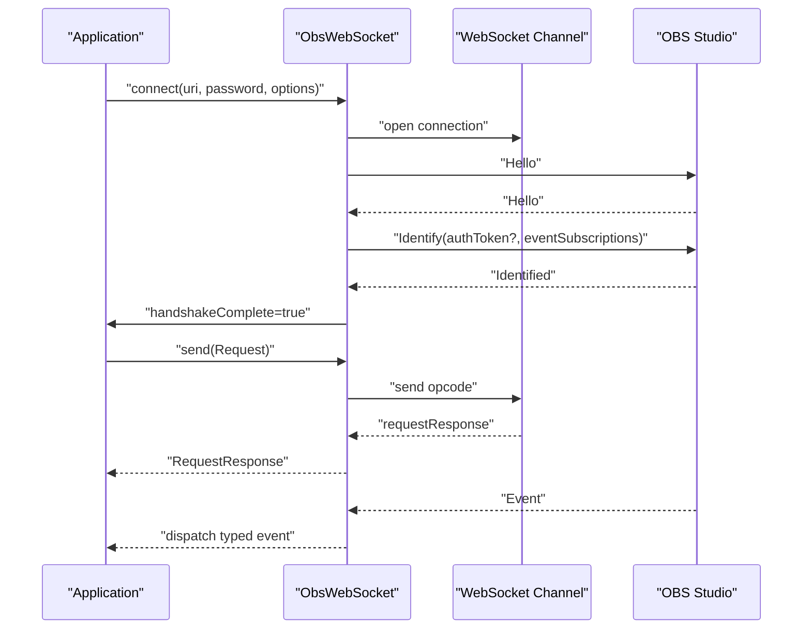
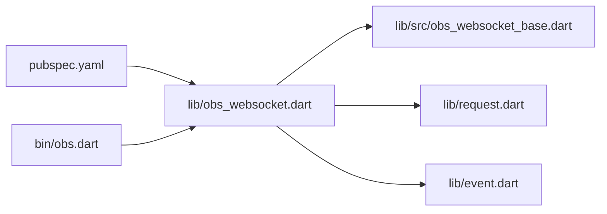

# Examples and Tutorials

<cite>
**Referenced Files in This Document**
- [README.md](file://README.md)
- [pubspec.yaml](file://pubspec.yaml)
- [lib/obs_websocket.dart](file://lib/obs_websocket.dart)
- [lib/src/obs_websocket_base.dart](file://lib/src/obs_websocket_base.dart)
- [lib/event.dart](file://lib/event.dart)
- [lib/request.dart](file://lib/request.dart)
- [lib/src/request/general.dart](file://lib/src/request/general.dart)
- [lib/src/request/scenes.dart](file://lib/src/request/scenes.dart)
- [lib/src/request/inputs.dart](file://lib/src/request/inputs.dart)
- [lib/src/request/stream.dart](file://lib/src/request/stream.dart)
- [lib/src/request/record.dart](file://lib/src/request/record.dart)
- [bin/obs.dart](file://bin/obs.dart)
- [example/general.dart](file://example/general.dart)
- [example/event.dart](file://example/event.dart)
- [example/volume.dart](file://example/volume.dart)
- [example/show_scene_item.dart](file://example/show_scene_item.dart)
- [example/batch.dart](file://example/batch.dart)
- [example/config.sample.yaml](file://example/config.sample.yaml)
</cite>

## Table of Contents
1. [Introduction](#introduction)
2. [Project Structure](#project-structure)
3. [Core Components](#core-components)
4. [Architecture Overview](#architecture-overview)
5. [Detailed Component Analysis](#detailed-component-analysis)
6. [Dependency Analysis](#dependency-analysis)
7. [Performance Considerations](#performance-considerations)
8. [Troubleshooting Guide](#troubleshooting-guide)
9. [Conclusion](#conclusion)
10. [Appendices](#appendices)

## Introduction
This document provides a comprehensive examples and tutorials section for obs-websocket-dart. It focuses on practical implementations for:
- Basic connection and authentication
- Scene management automation
- Audio control workflows
- Streaming setup
- Recording automation
- Event-driven scripting

It documents the provided example files, explains implementation patterns, and offers integration guidance for Flutter apps, command-line tools, and server-side automation. It also covers best practices for error handling, connection management, resource cleanup, performance optimization, scalability, and troubleshooting.

## Project Structure
The repository is organized around a Dart package that exposes a typed client for the obs-websocket protocol. Key areas:
- Library exports and entry points
- Core client implementation (connection, authentication, request/response, events)
- Feature-specific request modules (general, scenes, inputs, stream, record, etc.)
- CLI tooling
- Example scripts demonstrating real-world usage
- Configuration samples

```mermaid
graph TB
subgraph "Library"
A["lib/obs_websocket.dart"]
B["lib/src/obs_websocket_base.dart"]
C["lib/request.dart"]
D["lib/event.dart"]
end
subgraph "Feature Modules"
G["lib/src/request/general.dart"]
S["lib/src/request/scenes.dart"]
I["lib/src/request/inputs.dart"]
ST["lib/src/request/stream.dart"]
R["lib/src/request/record.dart"]
end
subgraph "CLI"
CLI["bin/obs.dart"]
end
subgraph "Examples"
EG["example/general.dart"]
EE["example/event.dart"]
EV["example/volume.dart"]
ESI["example/show_scene_item.dart"]
EB["example/batch.dart"]
EC["example/config.sample.yaml"]
end
A --> B
A --> C
A --> D
C --> G
C --> S
C --> I
C --> ST
C --> R
CLI --> A
EG --> A
EE --> A
EV --> A
ESI --> A
EB --> A
EG --> EC
EE --> EC
EV --> EC
ESI --> EC
EB --> EC
```

**Diagram sources**
- [lib/obs_websocket.dart:1-69](file://lib/obs_websocket.dart#L1-L69)
- [lib/src/obs_websocket_base.dart:1-515](file://lib/src/obs_websocket_base.dart#L1-L515)
- [lib/request.dart:1-19](file://lib/request.dart#L1-L19)
- [lib/src/request/general.dart:1-143](file://lib/src/request/general.dart#L1-L143)
- [lib/src/request/scenes.dart:1-232](file://lib/src/request/scenes.dart#L1-L232)
- [lib/src/request/inputs.dart:1-389](file://lib/src/request/inputs.dart#L1-L389)
- [lib/src/request/stream.dart:1-94](file://lib/src/request/stream.dart#L1-L94)
- [lib/src/request/record.dart:1-128](file://lib/src/request/record.dart#L1-L128)
- [bin/obs.dart:1-57](file://bin/obs.dart#L1-L57)
- [example/general.dart:1-152](file://example/general.dart#L1-L152)
- [example/event.dart:1-44](file://example/event.dart#L1-L44)
- [example/volume.dart:1-28](file://example/volume.dart#L1-L28)
- [example/show_scene_item.dart:1-70](file://example/show_scene_item.dart#L1-L70)
- [example/batch.dart:1-30](file://example/batch.dart#L1-L30)
- [example/config.sample.yaml:1-8](file://example/config.sample.yaml#L1-L8)

**Section sources**
- [pubspec.yaml:1-38](file://pubspec.yaml#L1-L38)
- [lib/obs_websocket.dart:1-69](file://lib/obs_websocket.dart#L1-L69)
- [lib/src/obs_websocket_base.dart:1-515](file://lib/src/obs_websocket_base.dart#L1-L515)
- [bin/obs.dart:1-57](file://bin/obs.dart#L1-L57)

## Core Components
This section outlines the essential building blocks used across examples and tutorials.

- ObsWebSocket core
  - Connection establishment and authentication handshake
  - Request/response lifecycle with timeouts and error propagation
  - Event subscription and typed event dispatch
  - Batch request support
  - Graceful close and resource cleanup

- Feature request modules
  - General: version, stats, hotkeys, vendor events
  - Scenes: list, current program/preview, create/remove/rename, transitions
  - Inputs: list, create/remove, rename, settings, mute, volume
  - Stream: status, start/stop/toggle, captions
  - Record: status, start/stop/toggle pause/resume

- CLI tool
  - Command runner exposing commands for general, scenes, inputs, stream, record, and more
  - Options for URI, timeout, log level, and password

- Examples
  - General usage, event listening, volume monitoring, scene item toggling, batch requests

**Section sources**
- [lib/src/obs_websocket_base.dart:118-169](file://lib/src/obs_websocket_base.dart#L118-L169)
- [lib/src/obs_websocket_base.dart:260-318](file://lib/src/obs_websocket_base.dart#L260-L318)
- [lib/src/obs_websocket_base.dart:448-513](file://lib/src/obs_websocket_base.dart#L448-L513)
- [lib/src/request/general.dart:1-143](file://lib/src/request/general.dart#L1-L143)
- [lib/src/request/scenes.dart:1-232](file://lib/src/request/scenes.dart#L1-L232)
- [lib/src/request/inputs.dart:1-389](file://lib/src/request/inputs.dart#L1-L389)
- [lib/src/request/stream.dart:1-94](file://lib/src/request/stream.dart#L1-L94)
- [lib/src/request/record.dart:1-128](file://lib/src/request/record.dart#L1-L128)
- [bin/obs.dart:1-57](file://bin/obs.dart#L1-L57)
- [example/general.dart:1-152](file://example/general.dart#L1-L152)
- [example/event.dart:1-44](file://example/event.dart#L1-L44)
- [example/volume.dart:1-28](file://example/volume.dart#L1-L28)
- [example/show_scene_item.dart:1-70](file://example/show_scene_item.dart#L1-L70)
- [example/batch.dart:1-30](file://example/batch.dart#L1-L30)

## Architecture Overview
The client follows a typed request/response model with an event bus. Connections are established via WebSocket, authenticated using a challenge-response mechanism, and then used to send requests and receive events.



**Diagram sources**
- [lib/src/obs_websocket_base.dart:130-169](file://lib/src/obs_websocket_base.dart#L130-L169)
- [lib/src/obs_websocket_base.dart:260-318](file://lib/src/obs_websocket_base.dart#L260-L318)
- [lib/src/obs_websocket_base.dart:181-236](file://lib/src/obs_websocket_base.dart#L181-L236)

## Detailed Component Analysis

### Basic Connection and Authentication
- Establish a WebSocket connection using the provided connect helper
- Supply host, port, and optional password
- Observe handshake completion and negotiate RPC version
- Optionally set request timeout and logging

Implementation pattern references:
- Connection and initialization: [lib/src/obs_websocket_base.dart:130-169](file://lib/src/obs_websocket_base.dart#L130-L169)
- Authentication handshake: [lib/src/obs_websocket_base.dart:260-318](file://lib/src/obs_websocket_base.dart#L260-L318)
- Logging and options: [example/general.dart:10-17](file://example/general.dart#L10-L17)

Best practices:
- Always close the connection when done
- Use reasonable timeouts for request/response
- Enable logging during development

**Section sources**
- [lib/src/obs_websocket_base.dart:130-169](file://lib/src/obs_websocket_base.dart#L130-L169)
- [lib/src/obs_websocket_base.dart:260-318](file://lib/src/obs_websocket_base.dart#L260-L318)
- [example/general.dart:10-17](file://example/general.dart#L10-L17)

### Scene Management Automation
- List scenes and groups
- Get/set current program/preview scenes
- Create/remove/rename scenes
- Configure scene transition overrides

Implementation pattern references:
- Scene list and current scenes: [lib/src/request/scenes.dart:34-80](file://lib/src/request/scenes.dart#L34-L80)
- Preview scene management: [lib/src/request/scenes.dart:115-142](file://lib/src/request/scenes.dart#L115-L142)
- Create/remove/rename: [lib/src/request/scenes.dart:156-190](file://lib/src/request/scenes.dart#L156-L190)
- Transition override: [lib/src/request/scenes.dart:197-230](file://lib/src/request/scenes.dart#L197-L230)

Example usage:
- Show/hide a scene item and observe enable-state changes: [example/show_scene_item.dart:1-70](file://example/show_scene_item.dart#L1-L70)

**Section sources**
- [lib/src/request/scenes.dart:34-80](file://lib/src/request/scenes.dart#L34-L80)
- [lib/src/request/scenes.dart:115-142](file://lib/src/request/scenes.dart#L115-L142)
- [lib/src/request/scenes.dart:156-190](file://lib/src/request/scenes.dart#L156-L190)
- [lib/src/request/scenes.dart:197-230](file://lib/src/request/scenes.dart#L197-L230)
- [example/show_scene_item.dart:1-70](file://example/show_scene_item.dart#L1-L70)

### Audio Control Workflows
- List inputs and input kinds
- Get/set mute state
- Get current volume (multiplier and dB)
- Monitor volume meters

Implementation pattern references:
- Input list and kinds: [lib/src/request/inputs.dart:14-37](file://lib/src/request/inputs.dart#L14-L37)
- Mute operations: [lib/src/request/inputs.dart:286-340](file://lib/src/request/inputs.dart#L286-L340)
- Volume retrieval: [lib/src/request/inputs.dart:371-387](file://lib/src/request/inputs.dart#L371-L387)

Example usage:
- Listen to volume changes and meters: [example/volume.dart:1-28](file://example/volume.dart#L1-L28), [example/event.dart:1-44](file://example/event.dart#L1-L44)

**Section sources**
- [lib/src/request/inputs.dart:14-37](file://lib/src/request/inputs.dart#L14-L37)
- [lib/src/request/inputs.dart:286-340](file://lib/src/request/inputs.dart#L286-L340)
- [lib/src/request/inputs.dart:371-387](file://lib/src/request/inputs.dart#L371-L387)
- [example/volume.dart:1-28](file://example/volume.dart#L1-L28)
- [example/event.dart:1-44](file://example/event.dart#L1-L44)

### Streaming Setup
- Check stream status
- Start/stop/toggle streaming
- Send captions

Implementation pattern references:
- Status and controls: [lib/src/request/stream.dart:28-82](file://lib/src/request/stream.dart#L28-L82)
- Captions: [lib/src/request/stream.dart:89-92](file://lib/src/request/stream.dart#L89-L92)

Example usage:
- General checks and helpers: [example/general.dart:76-88](file://example/general.dart#L76-L88)

**Section sources**
- [lib/src/request/stream.dart:28-82](file://lib/src/request/stream.dart#L28-L82)
- [lib/src/request/stream.dart:89-92](file://lib/src/request/stream.dart#L89-L92)
- [example/general.dart:76-88](file://example/general.dart#L76-L88)

### Recording Automation
- Check record status
- Start/stop/toggle pause/resume recording

Implementation pattern references:
- Status and controls: [lib/src/request/record.dart:28-80](file://lib/src/request/record.dart#L28-L80)
- Pause/resume: [lib/src/request/record.dart:95-126](file://lib/src/request/record.dart#L95-L126)

Example usage:
- General checks and helpers: [example/general.dart:52-54](file://example/general.dart#L52-L54)

**Section sources**
- [lib/src/request/record.dart:28-80](file://lib/src/request/record.dart#L28-L80)
- [lib/src/request/record.dart:95-126](file://lib/src/request/record.dart#L95-L126)
- [example/general.dart:52-54](file://example/general.dart#L52-L54)

### Event-Driven Scripting
- Subscribe to event masks
- Register typed event handlers
- Use fallback handlers for unsupported events
- Close connection on exit

Implementation pattern references:
- Subscription and handlers: [lib/src/obs_websocket_base.dart:337-372](file://lib/src/obs_websocket_base.dart#L337-L372), [lib/src/obs_websocket_base.dart:410-446](file://lib/src/obs_websocket_base.dart#L410-L446)
- Supported events export: [lib/event.dart:1-50](file://lib/event.dart#L1-L50)
- Example handlers: [example/event.dart:22-34](file://example/event.dart#L22-L34), [example/general.dart:21-42](file://example/general.dart#L21-L42)

Example usage:
- Scene item enable-state toggle after visibility: [example/show_scene_item.dart:32-53](file://example/show_scene_item.dart#L32-L53)

**Section sources**
- [lib/src/obs_websocket_base.dart:337-372](file://lib/src/obs_websocket_base.dart#L337-L372)
- [lib/src/obs_websocket_base.dart:410-446](file://lib/src/obs_websocket_base.dart#L410-L446)
- [lib/event.dart:1-50](file://lib/event.dart#L1-L50)
- [example/event.dart:22-34](file://example/event.dart#L22-L34)
- [example/general.dart:21-42](file://example/general.dart#L21-L42)
- [example/show_scene_item.dart:32-53](file://example/show_scene_item.dart#L32-L53)

### Batch Requests
- Group multiple requests into a single batch
- Receive per-request results

Implementation pattern references:
- Batch sending: [lib/src/obs_websocket_base.dart:453-475](file://lib/src/obs_websocket_base.dart#L453-L475)
- Example usage: [example/batch.dart:17-28](file://example/batch.dart#L17-L28)

**Section sources**
- [lib/src/obs_websocket_base.dart:453-475](file://lib/src/obs_websocket_base.dart#L453-L475)
- [example/batch.dart:17-28](file://example/batch.dart#L17-L28)

### CLI Tooling
- Command runner with subcommands for general, scenes, inputs, stream, record, and more
- Global options for URI, timeout, log level, and password

Implementation pattern references:
- Runner setup and commands: [bin/obs.dart:6-56](file://bin/obs.dart#L6-L56)

**Section sources**
- [bin/obs.dart:6-56](file://bin/obs.dart#L6-L56)

### Integration Scenarios

#### Flutter Applications
- Use the same ObsWebSocket client to control OBS from a Flutter app
- Manage lifecycle in widgets (initialize on load, dispose on close)
- Handle permissions and network connectivity gracefully
- Use event subscriptions to update UI state reactively

Integration pattern references:
- Connection and event handling: [lib/src/obs_websocket_base.dart:130-169](file://lib/src/obs_websocket_base.dart#L130-L169), [lib/src/obs_websocket_base.dart:337-372](file://lib/src/obs_websocket_base.dart#L337-L372)

**Section sources**
- [lib/src/obs_websocket_base.dart:130-169](file://lib/src/obs_websocket_base.dart#L130-L169)
- [lib/src/obs_websocket_base.dart:337-372](file://lib/src/obs_websocket_base.dart#L337-L372)

#### Command-Line Tools
- Build scripts using the CLI to automate common tasks
- Chain commands for setup, monitoring, and teardown
- Use YAML config for credentials and stream settings

Implementation pattern references:
- CLI runner: [bin/obs.dart:6-56](file://bin/obs.dart#L6-L56)
- Config sample: [example/config.sample.yaml:1-8](file://example/config.sample.yaml#L1-L8)

**Section sources**
- [bin/obs.dart:6-56](file://bin/obs.dart#L6-L56)
- [example/config.sample.yaml:1-8](file://example/config.sample.yaml#L1-L8)

#### Server-Side Automation
- Initialize ObsWebSocket in a long-running service
- Implement retry/backoff for transient failures
- Centralize event handling and orchestrate multi-step workflows
- Securely manage credentials and expose safe APIs

Implementation pattern references:
- Request/response and error handling: [lib/src/obs_websocket_base.dart:477-513](file://lib/src/obs_websocket_base.dart#L477-L513)

**Section sources**
- [lib/src/obs_websocket_base.dart:477-513](file://lib/src/obs_websocket_base.dart#L477-L513)

## Dependency Analysis
The library depends on standard Dart and third-party packages for networking, logging, and configuration parsing. The CLI depends on the library and command-runner utilities.



**Diagram sources**
- [pubspec.yaml:13-22](file://pubspec.yaml#L13-L22)
- [lib/obs_websocket.dart:1-69](file://lib/obs_websocket.dart#L1-L69)
- [lib/src/obs_websocket_base.dart:1-515](file://lib/src/obs_websocket_base.dart#L1-L515)
- [lib/request.dart:1-19](file://lib/request.dart#L1-L19)
- [lib/event.dart:1-50](file://lib/event.dart#L1-L50)
- [bin/obs.dart:1-57](file://bin/obs.dart#L1-L57)

**Section sources**
- [pubspec.yaml:13-22](file://pubspec.yaml#L13-L22)
- [lib/obs_websocket.dart:1-69](file://lib/obs_websocket.dart#L1-L69)

## Performance Considerations
- Use batch requests to reduce round-trips for related operations
- Limit event subscriptions to only what is needed to minimize overhead
- Apply appropriate request timeouts to avoid hanging futures
- Close connections promptly to free resources on both ends
- Monitor CPU and memory via stats responses for long-running sessions

[No sources needed since this section provides general guidance]

## Troubleshooting Guide
Common issues and resolutions:
- Authentication failures
  - Verify password and OBS settings
  - Ensure the client supplies the password during connect
  - Check handshake logs and RPC version negotiation

- Timeouts
  - Increase requestTimeout for heavy operations
  - Use batch requests to reduce latency
  - Validate network connectivity and firewall rules

- Missing events
  - Confirm event subscription mask includes desired events
  - Use fallback handlers to inspect unknown events
  - Ensure event handlers are registered before subscribing

- Resource leaks
  - Always call close() on completion
  - Cancel subscriptions and remove handlers when no longer needed

Implementation references:
- Authentication and handshake: [lib/src/obs_websocket_base.dart:260-318](file://lib/src/obs_websocket_base.dart#L260-L318)
- Request timeouts and error handling: [lib/src/obs_websocket_base.dart:477-513](file://lib/src/obs_websocket_base.dart#L477-L513)
- Event subscription and fallback: [lib/src/obs_websocket_base.dart:337-372](file://lib/src/obs_websocket_base.dart#L337-L372), [lib/src/obs_websocket_base.dart:410-446](file://lib/src/obs_websocket_base.dart#L410-L446)
- Connection close: [lib/src/obs_websocket_base.dart:398-408](file://lib/src/obs_websocket_base.dart#L398-L408)

**Section sources**
- [lib/src/obs_websocket_base.dart:260-318](file://lib/src/obs_websocket_base.dart#L260-L318)
- [lib/src/obs_websocket_base.dart:477-513](file://lib/src/obs_websocket_base.dart#L477-L513)
- [lib/src/obs_websocket_base.dart:337-372](file://lib/src/obs_websocket_base.dart#L337-L372)
- [lib/src/obs_websocket_base.dart:410-446](file://lib/src/obs_websocket_base.dart#L410-L446)
- [lib/src/obs_websocket_base.dart:398-408](file://lib/src/obs_websocket_base.dart#L398-L408)

## Conclusion
The examples and tutorials demonstrate practical, reusable patterns for connecting to OBS, automating scenes and audio, managing streams and recordings, and reacting to events. By following the best practices for connection management, error handling, and performance, you can build robust integrations across Flutter, CLI, and server environments.

[No sources needed since this section summarizes without analyzing specific files]

## Appendices

### Templates and Boilerplate Code
- Connection template
  - Initialize ObsWebSocket with host, password, and options
  - Subscribe to events if needed
  - Perform operations and close on completion

- Event handler template
  - Register typed handlers for specific events
  - Use fallback handlers for unknown events
  - Clean up handlers and subscriptions on exit

- Batch request template
  - Prepare a list of requests
  - Send via sendBatch and iterate results

Implementation references:
- Connection and close: [lib/src/obs_websocket_base.dart:130-169](file://lib/src/obs_websocket_base.dart#L130-L169), [lib/src/obs_websocket_base.dart:398-408](file://lib/src/obs_websocket_base.dart#L398-L408)
- Event subscription and handlers: [lib/src/obs_websocket_base.dart:337-372](file://lib/src/obs_websocket_base.dart#L337-L372), [lib/src/obs_websocket_base.dart:410-446](file://lib/src/obs_websocket_base.dart#L410-L446)
- Batch requests: [lib/src/obs_websocket_base.dart:453-475](file://lib/src/obs_websocket_base.dart#L453-L475)

**Section sources**
- [lib/src/obs_websocket_base.dart:130-169](file://lib/src/obs_websocket_base.dart#L130-L169)
- [lib/src/obs_websocket_base.dart:337-372](file://lib/src/obs_websocket_base.dart#L337-L372)
- [lib/src/obs_websocket_base.dart:410-446](file://lib/src/obs_websocket_base.dart#L410-L446)
- [lib/src/obs_websocket_base.dart:453-475](file://lib/src/obs_websocket_base.dart#L453-L475)