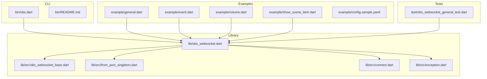
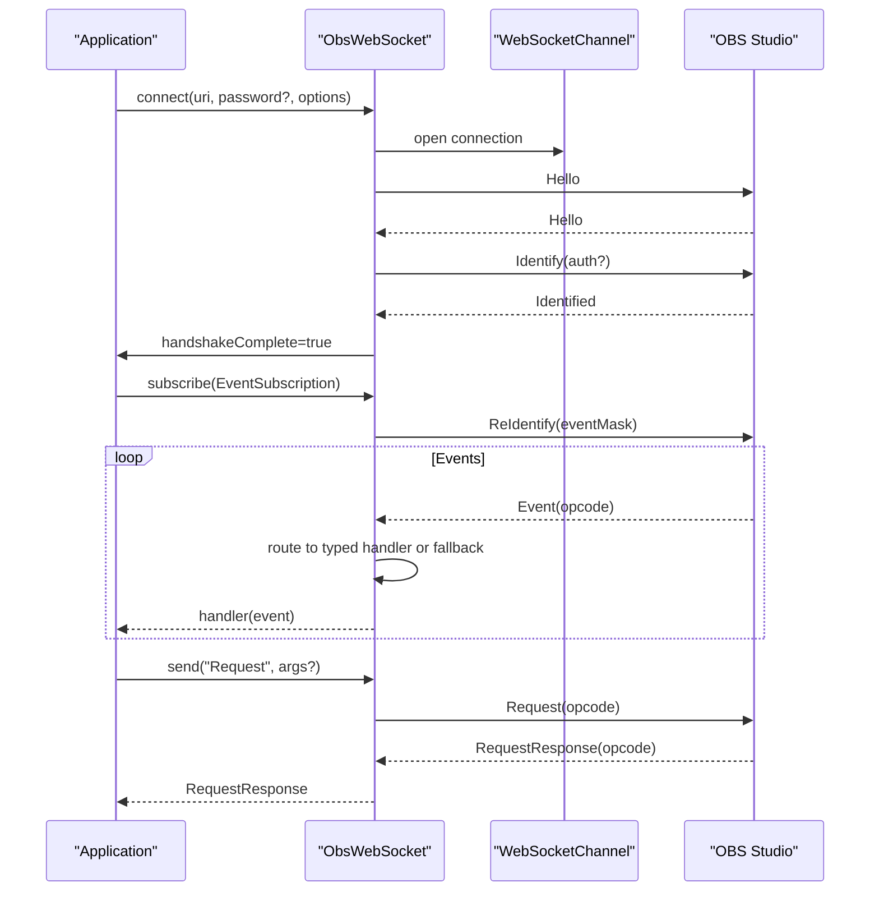
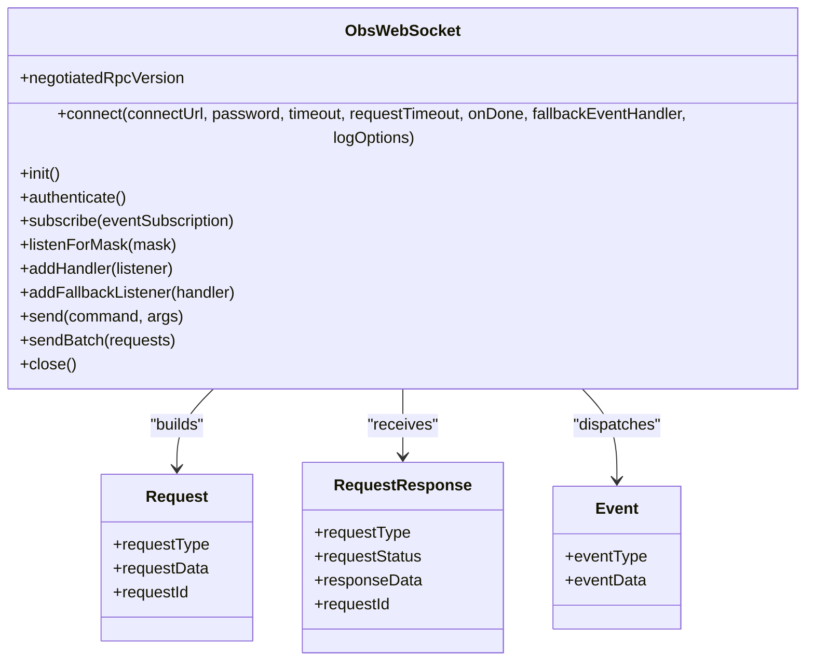
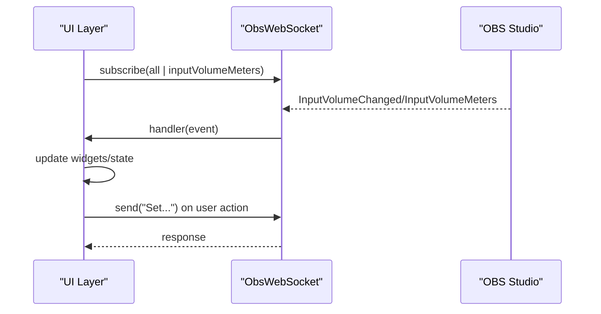
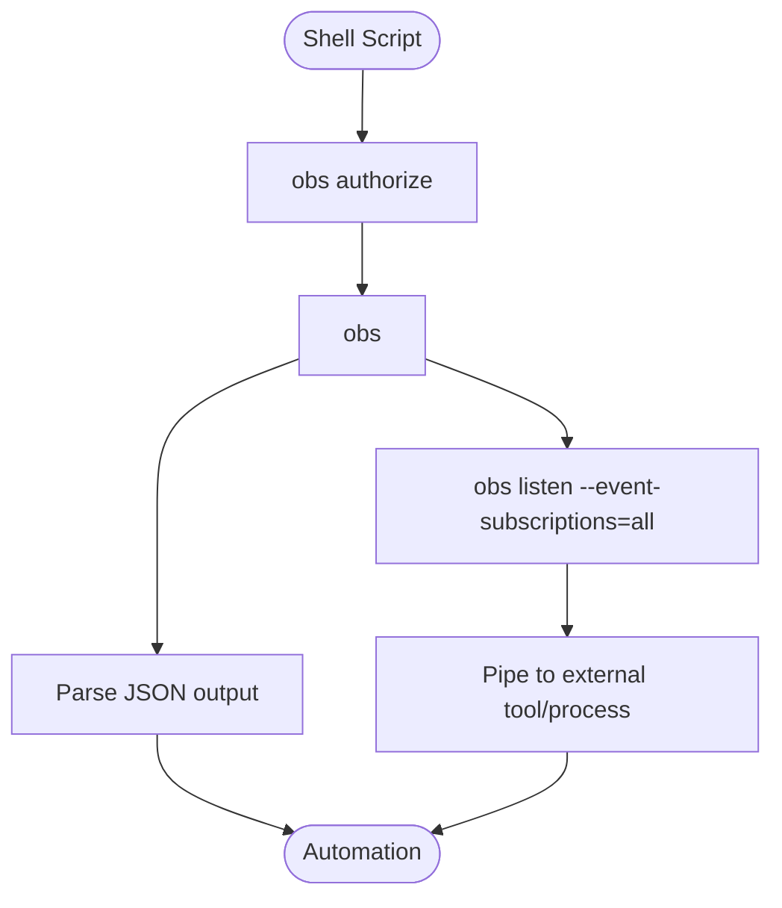
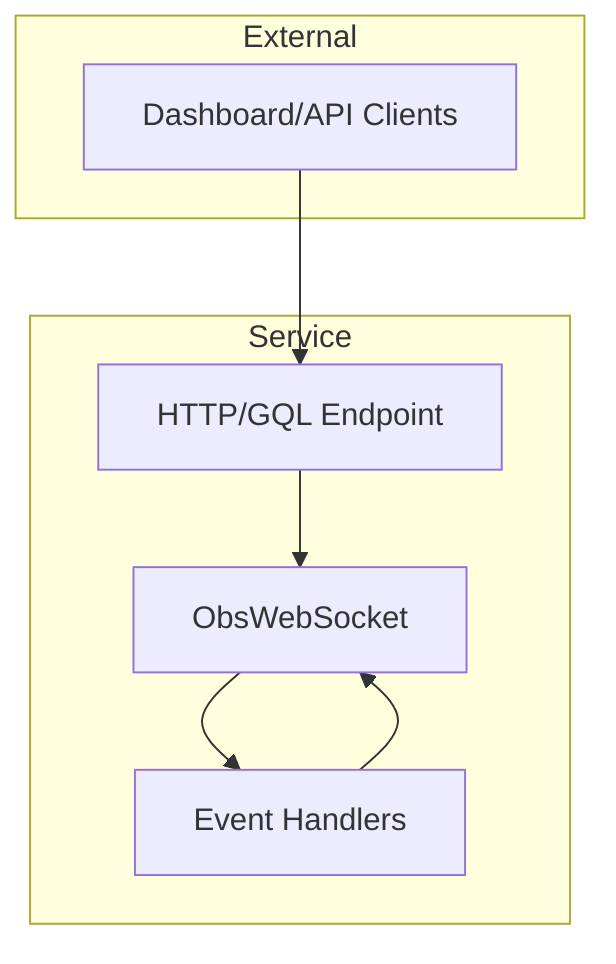
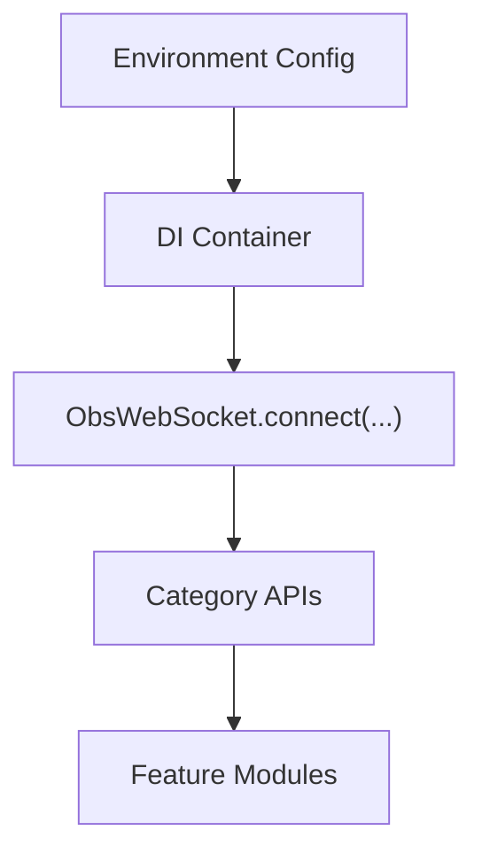
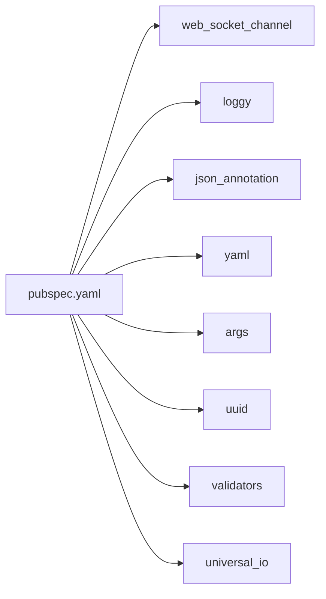
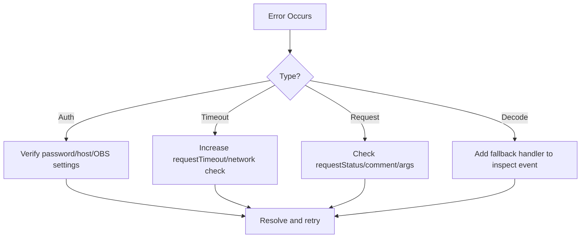

# Integration Patterns

<cite>
**Referenced Files in This Document**
- [README.md](file://README.md)
- [pubspec.yaml](file://pubspec.yaml)
- [lib/obs_websocket.dart](file://lib/obs_websocket.dart)
- [lib/src/obs_websocket_base.dart](file://lib/src/obs_websocket_base.dart)
- [lib/src/from_json_singleton.dart](file://lib/src/from_json_singleton.dart)
- [lib/src/connect.dart](file://lib/src/connect.dart)
- [lib/src/exception.dart](file://lib/src/exception.dart)
- [bin/obs.dart](file://bin/obs.dart)
- [bin/README.md](file://bin/README.md)
- [example/general.dart](file://example/general.dart)
- [example/event.dart](file://example/event.dart)
- [example/volume.dart](file://example/volume.dart)
- [example/show_scene_item.dart](file://example/show_scene_item.dart)
- [example/config.sample.yaml](file://example/config.sample.yaml)
- [test/obs_websocket_general_test.dart](file://test/obs_websocket_general_test.dart)
</cite>

## Table of Contents
1. [Introduction](#introduction)
2. [Project Structure](#project-structure)
3. [Core Components](#core-components)
4. [Architecture Overview](#architecture-overview)
5. [Detailed Component Analysis](#detailed-component-analysis)
6. [Dependency Analysis](#dependency-analysis)
7. [Performance Considerations](#performance-considerations)
8. [Troubleshooting Guide](#troubleshooting-guide)
9. [Conclusion](#conclusion)
10. [Appendices](#appendices)

## Introduction
This document presents comprehensive integration patterns for obs-websocket-dart across diverse application contexts. It covers:
- Flutter-based widget automation and UI synchronization
- Command-line tool usage and scripting
- Server-side automation and microservice patterns
- Desktop applications, web dashboards, and mobile interfaces
- Dependency injection, configuration management, and environment-specific setups
- Cross-platform considerations, platform-specific optimizations, and production-ready strategies

The patterns leverage the typed request/response API, event subscriptions, and the CLI tooling to enable robust, maintainable integrations.

## Project Structure
The repository is organized around a Dart library that exposes a typed API for OBS remote control, plus a CLI executable and example scripts demonstrating real-world usage.

**Diagram sources**
- [lib/obs_websocket.dart:1-69](file://lib/obs_websocket.dart#L1-L69)
- [lib/src/obs_websocket_base.dart:1-513](file://lib/src/obs_websocket_base.dart#L1-L513)
- [lib/src/from_json_singleton.dart:1-100](file://lib/src/from_json_singleton.dart#L1-L100)
- [lib/src/connect.dart:1-15](file://lib/src/connect.dart#L1-L15)
- [lib/src/exception.dart:1-77](file://lib/src/exception.dart#L1-L77)
- [bin/obs.dart:1-61](file://bin/obs.dart#L1-L61)
- [bin/README.md:1-800](file://bin/README.md#L1-L800)
- [example/general.dart:1-154](file://example/general.dart#L1-L154)
- [example/event.dart:1-46](file://example/event.dart#L1-L46)
- [example/volume.dart:1-28](file://example/volume.dart#L1-L28)
- [example/show_scene_item.dart:1-70](file://example/show_scene_item.dart#L1-L70)
- [example/config.sample.yaml:1-8](file://example/config.sample.yaml#L1-L8)
- [test/obs_websocket_general_test.dart:1-98](file://test/obs_websocket_general_test.dart#L1-L98)

**Section sources**
- [pubspec.yaml:1-41](file://pubspec.yaml#L1-L41)
- [lib/obs_websocket.dart:1-69](file://lib/obs_websocket.dart#L1-L69)
- [bin/obs.dart:1-61](file://bin/obs.dart#L1-L61)

## Core Components
- ObsWebSocket: Central class managing WebSocket connection, authentication, request/response lifecycle, and event routing. Provides typed accessors for categories (general, config, inputs, scenes, scene items, sources, outputs, stream, record, transitions, filters, media inputs, ui).
- FromJsonSingleton: Registry mapping event names to typed decoders for runtime event deserialization.
- Connect abstraction: Platform-specific WebSocket channel creation (IO vs HTML).
- CLI entrypoint: Command runner exposing subcommands for common tasks and low-level send operations.
- Examples: Realistic usage patterns for events, volume monitoring, toggling stream, and scene item visibility.

Key capabilities:
- Typed helpers for frequently used requests
- Low-level send for unsupported requests
- Event subscription masks and typed handlers with fallback support
- Batch request support
- Strong exception model for auth, timeouts, and protocol errors

**Section sources**
- [lib/src/obs_websocket_base.dart:21-106](file://lib/src/obs_websocket_base.dart#L21-L106)
- [lib/src/from_json_singleton.dart:6-99](file://lib/src/from_json_singleton.dart#L6-L99)
- [lib/src/connect.dart:7-14](file://lib/src/connect.dart#L7-L14)
- [lib/src/exception.dart:18-77](file://lib/src/exception.dart#L18-L77)
- [example/general.dart:9-154](file://example/general.dart#L9-L154)
- [example/event.dart:9-46](file://example/event.dart#L9-L46)
- [example/volume.dart:6-28](file://example/volume.dart#L6-L28)
- [example/show_scene_item.dart:7-70](file://example/show_scene_item.dart#L7-L70)

## Architecture Overview
The integration architecture centers on a single connection to OBS with typed request/response and event-driven updates.

**Diagram sources**
- [lib/src/obs_websocket_base.dart:130-169](file://lib/src/obs_websocket_base.dart#L130-L169)
- [lib/src/obs_websocket_base.dart:260-318](file://lib/src/obs_websocket_base.dart#L260-L318)
- [lib/src/obs_websocket_base.dart:337-372](file://lib/src/obs_websocket_base.dart#L337-L372)
- [lib/src/obs_websocket_base.dart:180-236](file://lib/src/obs_websocket_base.dart#L180-L236)

## Detailed Component Analysis

### ObsWebSocket Core
ObsWebSocket encapsulates:
- Connection lifecycle and authentication
- Request/response with timeouts and error propagation
- Event subscription and dispatch
- Category accessors for modular request APIs

**Diagram sources**
- [lib/src/obs_websocket_base.dart:118-169](file://lib/src/obs_websocket_base.dart#L118-L169)
- [lib/src/obs_websocket_base.dart:448-501](file://lib/src/obs_websocket_base.dart#L448-L501)

**Section sources**
- [lib/src/obs_websocket_base.dart:118-169](file://lib/src/obs_websocket_base.dart#L118-L169)
- [lib/src/obs_websocket_base.dart:337-372](file://lib/src/obs_websocket_base.dart#L337-L372)
- [lib/src/obs_websocket_base.dart:448-501](file://lib/src/obs_websocket_base.dart#L448-L501)

### Event Handling and UI Synchronization
The library supports subscribing to event masks and registering typed handlers. Unknown events can be handled via a fallback handler. This pattern is ideal for synchronizing UI state with OBS.

Practical examples:
- Volume monitoring and meters
- Scene and input state changes
- ExitStarted for cleanup

**Diagram sources**
- [example/event.dart:21-44](file://example/event.dart#L21-L44)
- [example/volume.dart:14-27](file://example/volume.dart#L14-L27)
- [example/general.dart:21-44](file://example/general.dart#L21-L44)

**Section sources**
- [lib/src/obs_websocket_base.dart:354-372](file://lib/src/obs_websocket_base.dart#L354-L372)
- [lib/src/obs_websocket_base.dart:410-446](file://lib/src/obs_websocket_base.dart#L410-L446)
- [example/event.dart:9-46](file://example/event.dart#L9-L46)
- [example/volume.dart:6-28](file://example/volume.dart#L6-L28)

### CLI Integration Patterns
The CLI enables automation and scripting:
- authorize to persist credentials
- subcommands for each request category
- listen to events and pipe to external tools
- send arbitrary low-level requests

**Diagram sources**
- [bin/README.md:165-183](file://bin/README.md#L165-L183)
- [bin/README.md:443-476](file://bin/README.md#L443-L476)
- [bin/README.md:597-611](file://bin/README.md#L597-L611)

**Section sources**
- [bin/obs.dart:6-60](file://bin/obs.dart#L6-L60)
- [bin/README.md:1-800](file://bin/README.md#L1-L800)

### Server-Side Automation and Microservices
Patterns:
- Initialize ObsWebSocket once per service lifecycle
- Use subscribe to react to state changes
- Expose REST/gRPC endpoints that translate to obs-websocket requests
- Batch requests for performance-sensitive sequences
- Centralized error handling and logging

[No sources needed since this diagram shows conceptual workflow, not actual code structure]

### Desktop Applications
- Single-window apps can manage a singleton ObsWebSocket instance
- UI state mirrors OBS events; actions trigger requests
- Graceful shutdown closes the connection and cleans up handlers

**Section sources**
- [example/general.dart:9-154](file://example/general.dart#L9-L154)
- [example/show_scene_item.dart:7-70](file://example/show_scene_item.dart#L7-L70)

### Web Dashboards
- Use the HTML-compatible WebSocket channel implementation
- Subscribe to non-high-volume events
- Render real-time metrics (volume, stats) and control buttons

**Section sources**
- [lib/src/connect.dart:3-5](file://lib/src/connect.dart#L3-L5)
- [example/event.dart:9-46](file://example/event.dart#L9-L46)

### Mobile Interfaces
- Leverage the IO-compatible channel on mobile platforms
- Implement retry/backoff for transient failures
- Persist configuration via environment variables or secure storage

**Section sources**
- [lib/src/connect.dart:3-5](file://lib/src/connect.dart#L3-L5)
- [example/config.sample.yaml:1-8](file://example/config.sample.yaml#L1-L8)

### Dependency Injection and Configuration Management
Recommended approaches:
- DI container manages ObsWebSocket lifetime and injects into controllers/services
- Environment-specific configuration (host, password, log level)
- Feature flags for enabling/disabling high-volume event subscriptions
- Secrets management for passwords and stream keys

**Diagram sources**
- [example/config.sample.yaml:1-8](file://example/config.sample.yaml#L1-L8)
- [example/general.dart:9-21](file://example/general.dart#L9-L21)

**Section sources**
- [example/config.sample.yaml:1-8](file://example/config.sample.yaml#L1-L8)
- [example/general.dart:9-21](file://example/general.dart#L9-L21)

### Cross-Platform Considerations
- Platform-specific WebSocket channel selection is abstracted; ensure correct platform target
- Logging and timeouts may vary; tune requestTimeout per environment
- Event volume differs by platform; prefer non-high-volume subscriptions for mobile/web

**Section sources**
- [lib/src/connect.dart:3-5](file://lib/src/connect.dart#L3-L5)
- [lib/src/obs_websocket_base.dart:24-24](file://lib/src/obs_websocket_base.dart#L24-L24)

## Dependency Analysis
External dependencies include logging, JSON serialization, WebSocket channels, YAML parsing, and argument parsing for the CLI.

**Diagram sources**
- [pubspec.yaml:13-23](file://pubspec.yaml#L13-L23)

**Section sources**
- [pubspec.yaml:13-23](file://pubspec.yaml#L13-L23)

## Performance Considerations
- Prefer category APIs for readability; use send() for unsupported requests
- Batch requests when performing sequences of independent operations
- Limit event subscriptions to necessary masks; avoid high-volume events on constrained devices
- Tune requestTimeout for network conditions
- Close connections on app termination to prevent resource leaks

[No sources needed since this section provides general guidance]

## Troubleshooting Guide
Common issues and resolutions:
- Authentication failures: Verify password and OBS settings; ensure OBS requires authentication
- Timeouts: Increase requestTimeout; check network latency
- Protocol errors: Inspect requestStatus and comments; validate request arguments
- Event decoding: Use fallback handler to inspect raw event payloads

**Diagram sources**
- [lib/src/exception.dart:29-77](file://lib/src/exception.dart#L29-L77)
- [lib/src/obs_websocket_base.dart:503-511](file://lib/src/obs_websocket_base.dart#L503-L511)
- [lib/src/obs_websocket_base.dart:442-446](file://lib/src/obs_websocket_base.dart#L442-L446)

**Section sources**
- [lib/src/exception.dart:18-77](file://lib/src/exception.dart#L18-L77)
- [lib/src/obs_websocket_base.dart:238-258](file://lib/src/obs_websocket_base.dart#L238-L258)
- [lib/src/obs_websocket_base.dart:503-511](file://lib/src/obs_websocket_base.dart#L503-L511)

## Conclusion
obs-websocket-dart offers a robust, typed foundation for integrating OBS control and telemetry across Flutter, CLI, server, desktop, web, and mobile environments. By leveraging category APIs, event subscriptions, and the CLI, teams can build scalable, maintainable automation systems with strong error handling and cross-platform compatibility.

[No sources needed since this section summarizes without analyzing specific files]

## Appendices

### Practical Implementation Index
- Flutter widget automation: [example/general.dart:9-154](file://example/general.dart#L9-L154), [example/event.dart:9-46](file://example/event.dart#L9-L46)
- Volume monitoring UI: [example/volume.dart:6-28](file://example/volume.dart#L6-L28)
- Scene item visibility toggle: [example/show_scene_item.dart:7-70](file://example/show_scene_item.dart#L7-L70)
- CLI automation: [bin/README.md:165-183](file://bin/README.md#L165-L183), [bin/README.md:443-476](file://bin/README.md#L443-L476)
- Protocol coverage and helpers: [README.md:106-263](file://README.md#L106-L263)

**Section sources**
- [example/general.dart:9-154](file://example/general.dart#L9-L154)
- [example/event.dart:9-46](file://example/event.dart#L9-L46)
- [example/volume.dart:6-28](file://example/volume.dart#L6-L28)
- [example/show_scene_item.dart:7-70](file://example/show_scene_item.dart#L7-L70)
- [bin/README.md:165-183](file://bin/README.md#L165-L183)
- [bin/README.md:443-476](file://bin/README.md#L443-L476)
- [README.md:106-263](file://README.md#L106-L263)