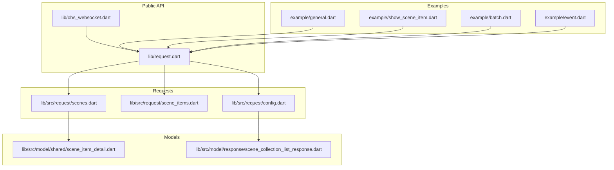
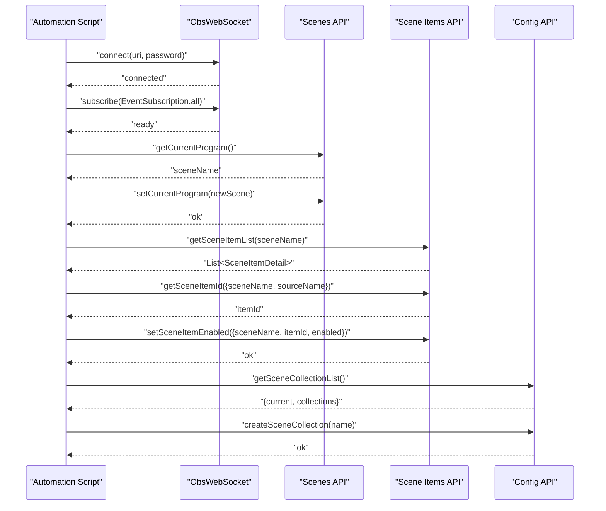
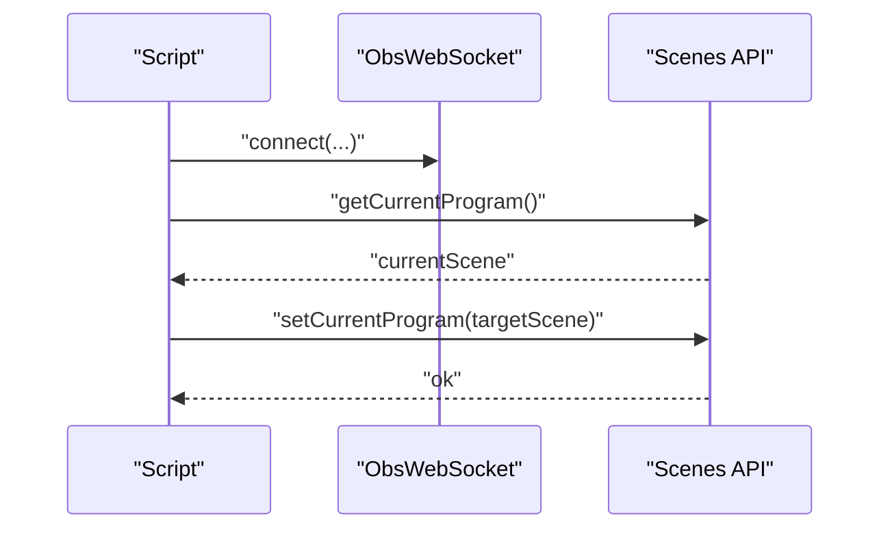
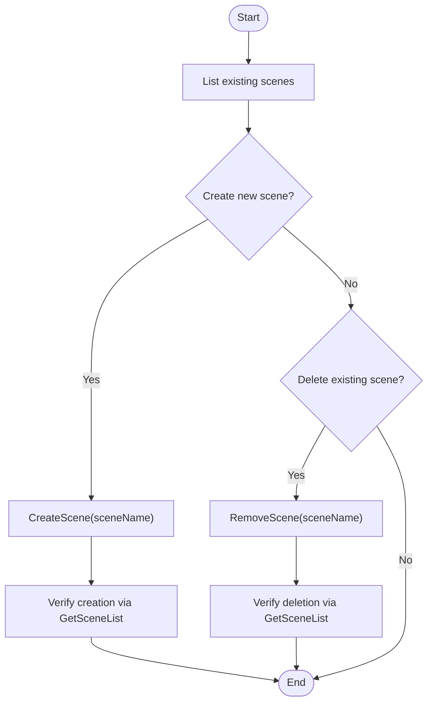
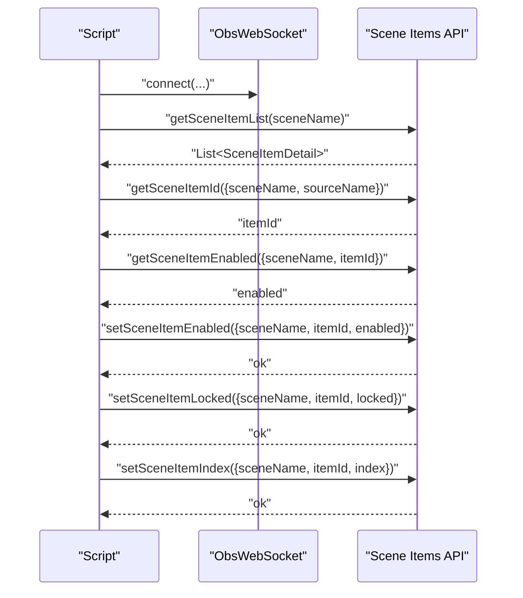
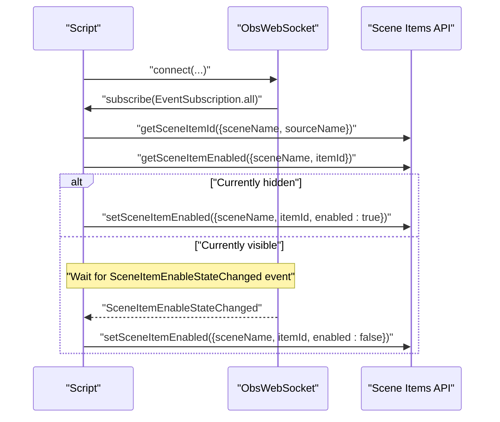
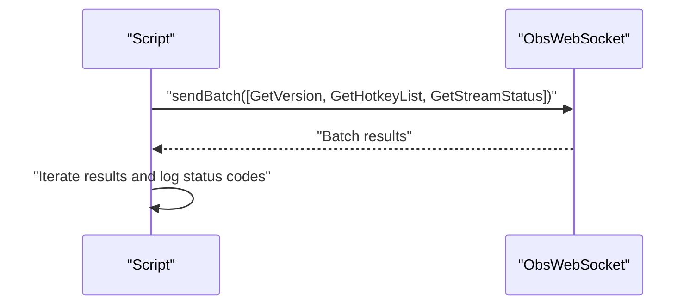
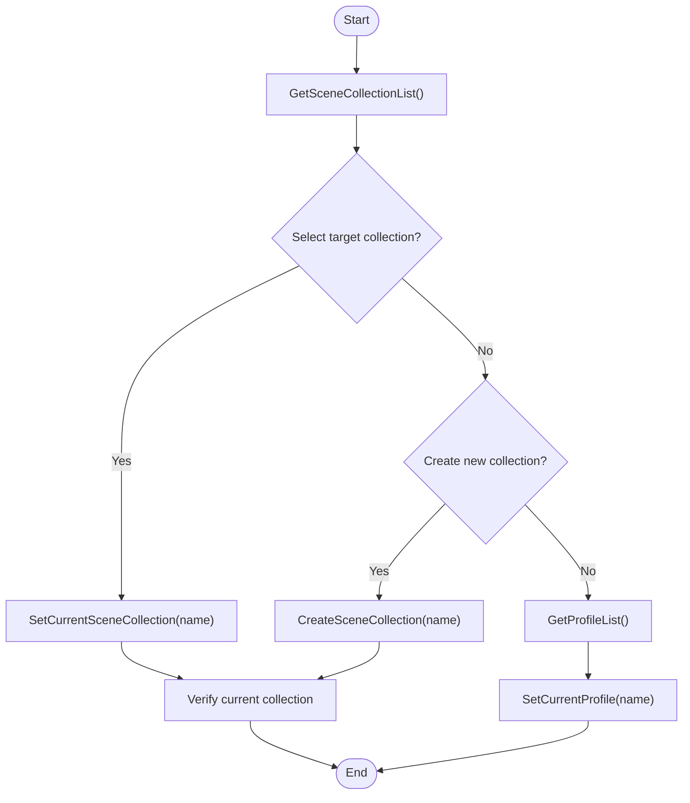
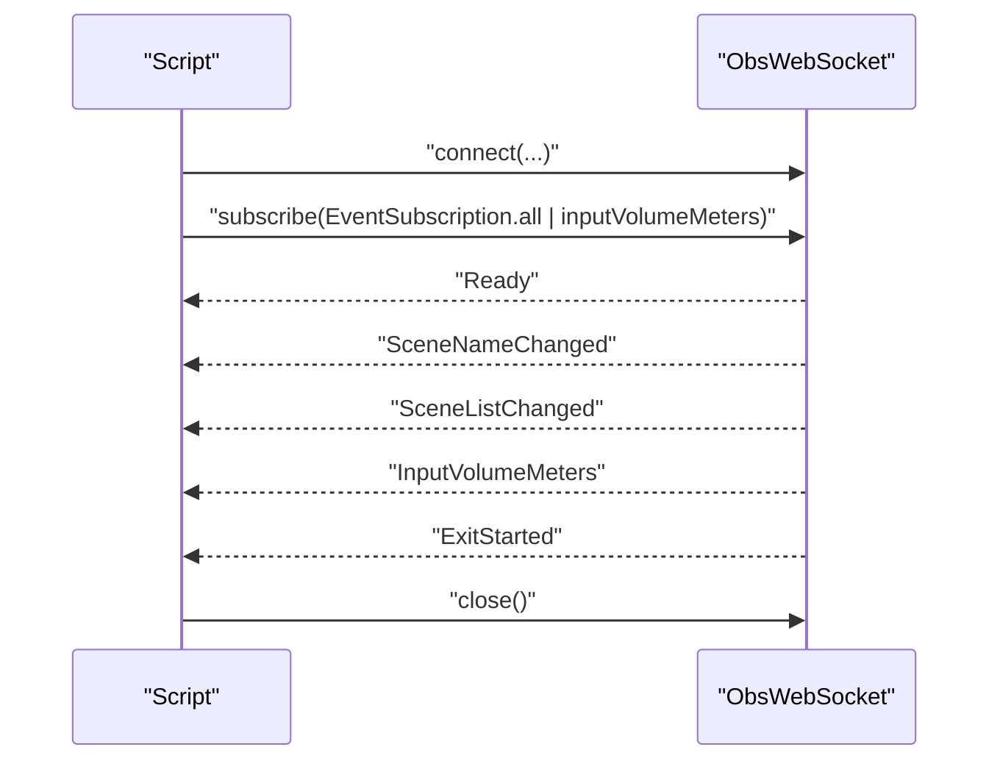
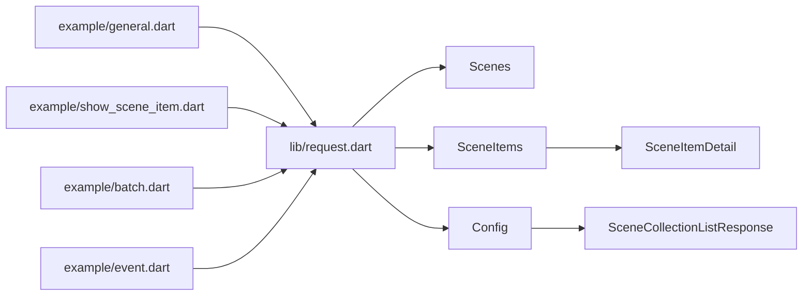

# Scene Management Examples

<cite>
**Referenced Files in This Document**
- [README.md](file://README.md)
- [example/show_scene_item.dart](file://example/show_scene_item.dart)
- [example/general.dart](file://example/general.dart)
- [example/batch.dart](file://example/batch.dart)
- [example/event.dart](file://example/event.dart)
- [lib/request.dart](file://lib/request.dart)
- [lib/obs_websocket.dart](file://lib/obs_websocket.dart)
- [lib/src/request/scenes.dart](file://lib/src/request/scenes.dart)
- [lib/src/request/scene_items.dart](file://lib/src/request/scene_items.dart)
- [lib/src/request/config.dart](file://lib/src/request/config.dart)
- [lib/src/model/shared/scene_item_detail.dart](file://lib/src/model/shared/scene_item_detail.dart)
- [lib/src/model/response/scene_collection_list_response.dart](file://lib/src/model/response/scene_collection_list_response.dart)
- [test/obs_websocket_scene_items_test.dart](file://test/obs_websocket_scene_items_test.dart)
- [test/obs_websocket_config_test.dart](file://test/obs_websocket_config_test.dart)
</cite>

## Table of Contents
1. [Introduction](#introduction)
2. [Project Structure](#project-structure)
3. [Core Components](#core-components)
4. [Architecture Overview](#architecture-overview)
5. [Detailed Component Analysis](#detailed-component-analysis)
6. [Dependency Analysis](#dependency-analysis)
7. [Performance Considerations](#performance-considerations)
8. [Troubleshooting Guide](#troubleshooting-guide)
9. [Conclusion](#conclusion)

## Introduction
This document provides comprehensive scene management examples for automating OBS Studio workflows using the obs-websocket Dart package. It focuses on:
- Scene switching between program and preview
- Creating and deleting scenes
- Managing scene items (visibility, locking, ordering)
- Automating scene transitions and batch operations
- Working with scene collections and profiles
- Practical automation scripts and advanced patterns

The examples leverage high-level helper methods exposed by the package for reliable, maintainable integrations.

## Project Structure
The repository organizes functionality by domain:
- High-level request categories are exported via a central request aggregator
- Scenes, scene items, and configuration are implemented as typed request classes
- Example scripts demonstrate real-world usage patterns
- Tests validate response parsing and basic workflows

**Diagram sources**
- [lib/request.dart:6-19](file://lib/request.dart#L6-L19)
- [lib/obs_websocket.dart:1-69](file://lib/obs_websocket.dart#L1-L69)
- [lib/src/request/scenes.dart:1-232](file://lib/src/request/scenes.dart#L1-L232)
- [lib/src/request/scene_items.dart:1-324](file://lib/src/request/scene_items.dart#L1-L324)
- [lib/src/request/config.dart:1-268](file://lib/src/request/config.dart#L1-L268)
- [lib/src/model/shared/scene_item_detail.dart:1-41](file://lib/src/model/shared/scene_item_detail.dart#L1-L41)
- [lib/src/model/response/scene_collection_list_response.dart:1-24](file://lib/src/model/response/scene_collection_list_response.dart#L1-L24)
- [example/general.dart:1-154](file://example/general.dart#L1-L154)
- [example/show_scene_item.dart:1-70](file://example/show_scene_item.dart#L1-L70)
- [example/batch.dart:1-30](file://example/batch.dart#L1-L30)
- [example/event.dart:1-46](file://example/event.dart#L1-L46)

**Section sources**
- [lib/request.dart:6-19](file://lib/request.dart#L6-L19)
- [lib/obs_websocket.dart:1-69](file://lib/obs_websocket.dart#L1-L69)

## Core Components
- Scenes API: List scenes, manage current program/preview scenes, create/remove scenes, rename scenes, and override per-scene transitions.
- Scene Items API: Retrieve scene items, resolve item IDs by source name, toggle visibility, lock/unlock items, reorder items, and inspect transforms.
- Config API: Manage scene collections and profiles, including listing, switching, and creating new collections/profiles.

Key capabilities demonstrated in examples:
- Subscribing to events and reacting to scene changes
- Batch requests for improved throughput
- Automation of visibility toggles and delayed actions

**Section sources**
- [lib/src/request/scenes.dart:9-231](file://lib/src/request/scenes.dart#L9-L231)
- [lib/src/request/scene_items.dart:10-323](file://lib/src/request/scene_items.dart#L10-L323)
- [lib/src/request/config.dart:48-128](file://lib/src/request/config.dart#L48-L128)
- [example/general.dart:23-44](file://example/general.dart#L23-L44)
- [example/batch.dart:17-28](file://example/batch.dart#L17-L28)

## Architecture Overview
The high-level architecture centers on ObsWebSocket connecting to OBS, issuing typed requests, and receiving structured responses. Scene management flows are encapsulated in dedicated request classes.

**Diagram sources**
- [lib/src/request/scenes.dart:62-142](file://lib/src/request/scenes.dart#L62-L142)
- [lib/src/request/scene_items.dart:17-37](file://lib/src/request/scene_items.dart#L17-L37)
- [lib/src/request/scene_items.dart:79-113](file://lib/src/request/scene_items.dart#L79-L113)
- [lib/src/request/scene_items.dart:155-173](file://lib/src/request/scene_items.dart#L155-L173)
- [lib/src/request/config.dart:53-87](file://lib/src/request/config.dart#L53-L87)

## Detailed Component Analysis

### Scene Switching Workflow
Switching scenes involves retrieving the current program scene and setting a new target scene. This pattern is ideal for automated transitions and cueing.

Practical usage is demonstrated in the general example script, which retrieves the current program scene and switches to a named scene.

**Section sources**
- [lib/src/request/scenes.dart:62-101](file://lib/src/request/scenes.dart#L62-L101)
- [example/general.dart:119-140](file://example/general.dart#L119-L140)

### Scene Creation and Deletion
Creating and removing scenes enables dynamic scene management for recurring workflows.

**Section sources**
- [lib/src/request/scenes.dart:144-190](file://lib/src/request/scenes.dart#L144-L190)
- [example/general.dart:92-105](file://example/general.dart#L92-L105)

### Scene Item Management
Scene items are the building blocks of scenes. You can:
- List items in a scene
- Resolve an item ID by source name
- Toggle visibility
- Lock/unlock items
- Reorder items by index

**Section sources**
- [lib/src/request/scene_items.dart:17-37](file://lib/src/request/scene_items.dart#L17-L37)
- [lib/src/request/scene_items.dart:79-113](file://lib/src/request/scene_items.dart#L79-L113)
- [lib/src/request/scene_items.dart:122-146](file://lib/src/request/scene_items.dart#L122-L146)
- [lib/src/request/scene_items.dart:155-173](file://lib/src/request/scene_items.dart#L155-L173)
- [lib/src/request/scene_items.dart:182-246](file://lib/src/request/scene_items.dart#L182-L246)
- [lib/src/request/scene_items.dart:248-322](file://lib/src/request/scene_items.dart#L248-L322)
- [lib/src/model/shared/scene_item_detail.dart:8-41](file://lib/src/model/shared/scene_item_detail.dart#L8-L41)

### Visibility Control and Delayed Actions
Automate visibility toggles with event-driven triggers and timed actions. The example demonstrates listening for a visibility change event and then hiding the item after a delay.

**Section sources**
- [example/show_scene_item.dart:31-53](file://example/show_scene_item.dart#L31-L53)
- [example/show_scene_item.dart:55-68](file://example/show_scene_item.dart#L55-L68)

### Batch Scene Operations
Use batch requests to reduce round-trips and improve throughput when performing multiple operations.

**Section sources**
- [example/batch.dart:17-28](file://example/batch.dart#L17-L28)

### Scene Collections and Profiles
Manage scene collections and profiles to isolate sets of scenes and settings. The example shows listing and switching between collections.

**Section sources**
- [lib/src/request/config.dart:53-87](file://lib/src/request/config.dart#L53-L87)
- [test/obs_websocket_config_test.dart:39-56](file://test/obs_websocket_config_test.dart#L39-L56)

### Advanced Patterns: Event-Driven Automation
Subscribe to scene and input events to drive automation. The general example subscribes to scene name and list changes, while the event example demonstrates subscribing to input volume meters and exit events.

**Section sources**
- [example/general.dart:21-44](file://example/general.dart#L21-L44)
- [example/event.dart:21-44](file://example/event.dart#L21-L44)

## Dependency Analysis
The request module aggregates all domain-specific APIs, exposing them through a unified interface. Scene item details depend on transform models, and configuration responses include collection lists.

**Diagram sources**
- [lib/request.dart:6-19](file://lib/request.dart#L6-L19)
- [lib/src/request/scene_items.dart:1-324](file://lib/src/request/scene_items.dart#L1-L324)
- [lib/src/model/shared/scene_item_detail.dart:1-41](file://lib/src/model/shared/scene_item_detail.dart#L1-L41)
- [lib/src/request/config.dart:1-268](file://lib/src/request/config.dart#L1-L268)
- [lib/src/model/response/scene_collection_list_response.dart:1-24](file://lib/src/model/response/scene_collection_list_response.dart#L1-L24)
- [example/general.dart:1-154](file://example/general.dart#L1-L154)
- [example/show_scene_item.dart:1-70](file://example/show_scene_item.dart#L1-L70)
- [example/batch.dart:1-30](file://example/batch.dart#L1-L30)
- [example/event.dart:1-46](file://example/event.dart#L1-L46)

**Section sources**
- [lib/request.dart:6-19](file://lib/request.dart#L6-L19)
- [lib/obs_websocket.dart:1-69](file://lib/obs_websocket.dart#L1-L69)

## Performance Considerations
- Prefer batch requests for multiple independent operations to minimize latency and round-trips.
- Subscribe only to necessary event categories to avoid high-frequency event storms.
- Use targeted scene item operations (enable/lock/index) rather than full scene rebuilds when possible.
- For frequent scene switching, cache current scene names and item IDs to reduce repeated lookups.

[No sources needed since this section provides general guidance]

## Troubleshooting Guide
- Authentication failures: Ensure the correct password is provided during connection and that obs-websocket is enabled in OBS.
- Event handling: Use a fallback event handler for unsupported events and subscribe to the appropriate event categories.
- Response validation: Confirm request status codes and parse response models to detect malformed data.
- Test coverage: Use unit tests to validate response parsing and expected behaviors for scene items and configuration operations.

**Section sources**
- [README.md:87-93](file://README.md#L87-L93)
- [example/event.dart:15-18](file://example/event.dart#L15-L18)
- [test/obs_websocket_scene_items_test.dart:6-24](file://test/obs_websocket_scene_items_test.dart#L6-L24)
- [test/obs_websocket_config_test.dart:39-56](file://test/obs_websocket_config_test.dart#L39-L56)

## Conclusion
The obs-websocket Dart package provides robust, high-level APIs for scene and scene item management. By combining helper methods, event subscriptions, and batch operations, you can build reliable automation scripts for dynamic scene workflows, efficient scene switching, and scalable scene collection management.

[No sources needed since this section summarizes without analyzing specific files]