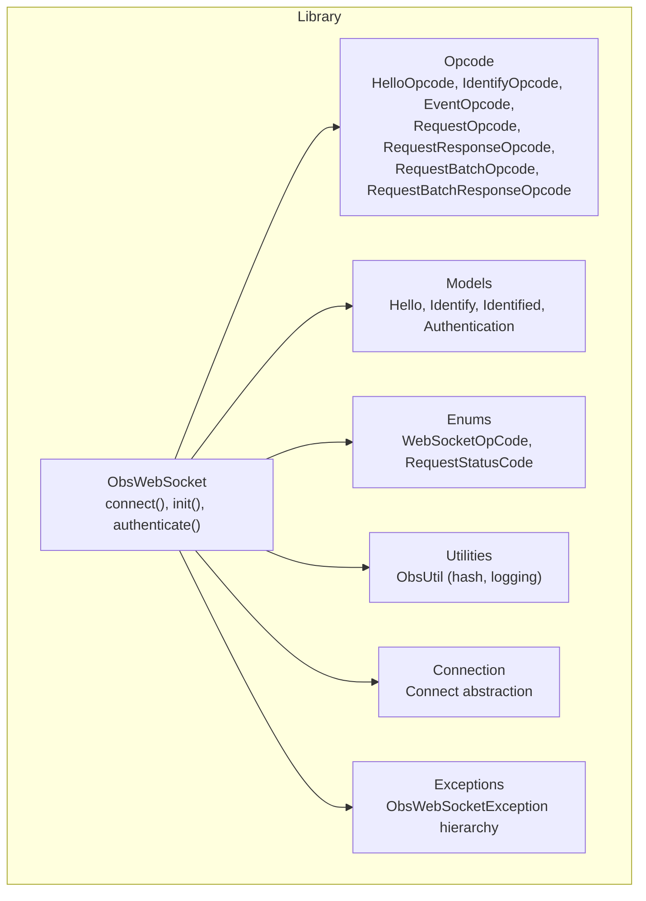
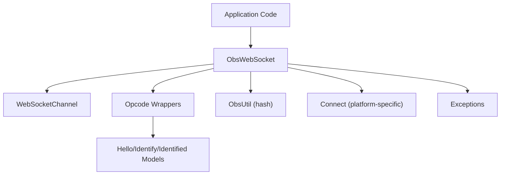
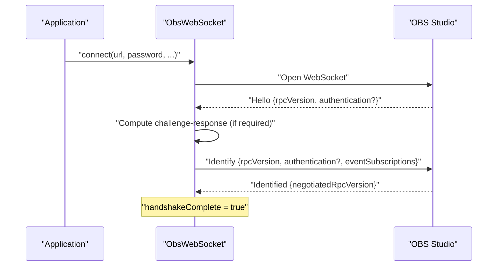
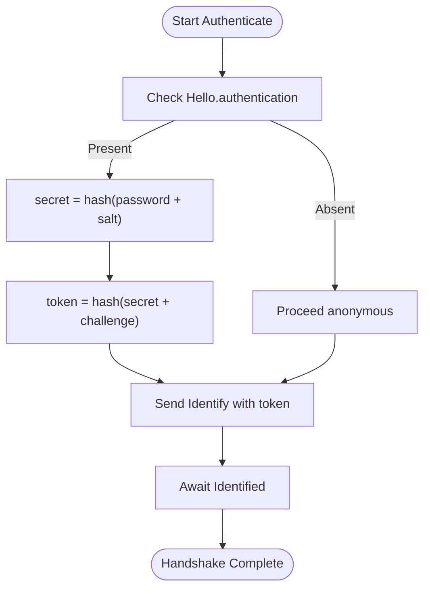
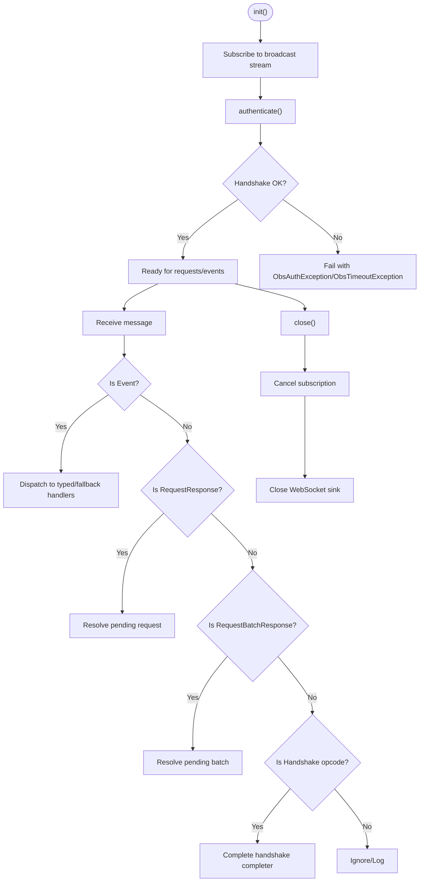
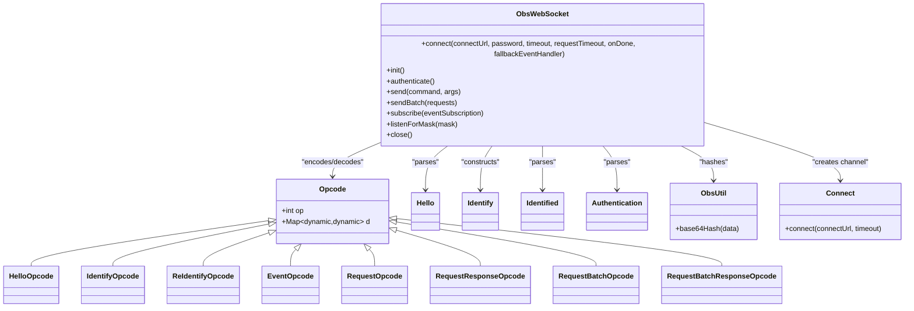

# Basic Connection and Authentication

<cite>
**Referenced Files in This Document**
- [obs_websocket_base.dart](file://lib/src/obs_websocket_base.dart)
- [opcode.dart](file://lib/src/model/comm/opcode.dart)
- [hello.dart](file://lib/src/model/comm/hello.dart)
- [identify.dart](file://lib/src/model/comm/identify.dart)
- [identified.dart](file://lib/src/model/comm/identified.dart)
- [authentication.dart](file://lib/src/model/comm/authentication.dart)
- [enum.dart](file://lib/src/util/enum.dart)
- [util.dart](file://lib/src/util/util.dart)
- [connect.dart](file://lib/src/connect.dart)
- [exception.dart](file://lib/src/exception.dart)
- [general.dart](file://example/general.dart)
- [event.dart](file://example/event.dart)
- [obs.dart](file://bin/obs.dart)
</cite>

## Table of Contents
1. [Introduction](#introduction)
2. [Project Structure](#project-structure)
3. [Core Components](#core-components)
4. [Architecture Overview](#architecture-overview)
5. [Detailed Component Analysis](#detailed-component-analysis)
6. [Dependency Analysis](#dependency-analysis)
7. [Performance Considerations](#performance-considerations)
8. [Troubleshooting Guide](#troubleshooting-guide)
9. [Conclusion](#conclusion)
10. [Appendices](#appendices)

## Introduction
This document explains how to establish a WebSocket connection to OBS Studio and complete the authentication handshake using the ObsWebSocket client. It covers the ObsWebSocketBase class initialization, connection parameters, the Hello and Identify protocol messages, challenge-response authentication, connection lifecycle management, timeouts, and error handling. Practical examples demonstrate proper setup, error handling for connection failures and authentication errors, and guidance for troubleshooting common issues such as invalid credentials, protocol mismatches, and network connectivity problems.

## Project Structure
The ObsWebSocket client is implemented as a Dart library with the following relevant parts:
- ObsWebSocket class orchestrates connection, authentication, message routing, and lifecycle.
- Protocol models represent Hello, Identify, Identified, and Opcode structures.
- Operation codes enumerate supported WebSocket opcodes.
- Utilities provide hashing and logging helpers.
- Examples illustrate typical usage patterns.

**Diagram sources**
- [obs_websocket_base.dart:21-515](file://lib/src/obs_websocket_base.dart#L21-L515)
- [opcode.dart:1-87](file://lib/src/model/comm/opcode.dart#L1-L87)
- [hello.dart:1-30](file://lib/src/model/comm/hello.dart#L1-L30)
- [identify.dart:1-32](file://lib/src/model/comm/identify.dart#L1-L32)
- [identified.dart:1-21](file://lib/src/model/comm/identified.dart#L1-L21)
- [enum.dart:1-60](file://lib/src/util/enum.dart#L1-L60)
- [util.dart:1-44](file://lib/src/util/util.dart#L1-L44)
- [connect.dart:1-15](file://lib/src/connect.dart#L1-L15)
- [exception.dart:1-77](file://lib/src/exception.dart#L1-L77)

**Section sources**
- [obs_websocket_base.dart:1-515](file://lib/src/obs_websocket_base.dart#L1-L515)
- [opcode.dart:1-87](file://lib/src/model/comm/opcode.dart#L1-L87)
- [hello.dart:1-30](file://lib/src/model/comm/hello.dart#L1-L30)
- [identify.dart:1-32](file://lib/src/model/comm/identify.dart#L1-L32)
- [identified.dart:1-21](file://lib/src/model/comm/identified.dart#L1-L21)
- [enum.dart:1-60](file://lib/src/util/enum.dart#L1-L60)
- [util.dart:1-44](file://lib/src/util/util.dart#L1-L44)
- [connect.dart:1-15](file://lib/src/connect.dart#L1-L15)
- [exception.dart:1-77](file://lib/src/exception.dart#L1-L77)

## Core Components
- ObsWebSocket: Provides connection establishment, authentication, message routing, event handling, and lifecycle management.
- Protocol models: Define Hello, Identify, Identified, and Authentication structures used during the handshake.
- Opcode wrappers: Encode/decode protocol messages with opcodes.
- Operation codes: Enumerates WebSocket opcodes (hello, identify, identified, event, request, requestResponse, requestBatch, requestBatchResponse).
- Utilities: ObsUtil provides SHA-256 hashing and base64 encoding for authentication.
- Connection: Connect abstraction handles platform-specific WebSocket creation with timeouts.
- Exceptions: ObsWebSocketException hierarchy covers authentication, request, timeout, and protocol errors.

Key responsibilities:
- Establish WebSocket connection with configurable timeout.
- Perform handshake: await Hello, compute challenge-response, send Identify, await Identified.
- Route incoming messages to handlers or pending request completers.
- Manage event subscriptions and typed event dispatch.
- Enforce request/response timeouts and propagate errors.

**Section sources**
- [obs_websocket_base.dart:21-515](file://lib/src/obs_websocket_base.dart#L21-L515)
- [opcode.dart:1-87](file://lib/src/model/comm/opcode.dart#L1-L87)
- [hello.dart:1-30](file://lib/src/model/comm/hello.dart#L1-L30)
- [identify.dart:1-32](file://lib/src/model/comm/identify.dart#L1-L32)
- [identified.dart:1-21](file://lib/src/model/comm/identified.dart#L1-L21)
- [enum.dart:1-60](file://lib/src/util/enum.dart#L1-L60)
- [util.dart:1-44](file://lib/src/util/util.dart#L1-L44)
- [connect.dart:1-15](file://lib/src/connect.dart#L1-L15)
- [exception.dart:1-77](file://lib/src/exception.dart#L1-L77)

## Architecture Overview
The ObsWebSocket client follows a layered architecture:
- Transport layer: WebSocketChannel for bidirectional communication.
- Protocol layer: Opcode wrappers and models for Hello/Identify/Identified and request/response framing.
- Application layer: ObsWebSocket manages authentication, event subscriptions, and request/response lifecycles.
- Utilities: ObsUtil provides cryptographic hashing for challenge-response.
- Connection abstraction: Connect handles platform-specific WebSocket creation.

**Diagram sources**
- [obs_websocket_base.dart:21-515](file://lib/src/obs_websocket_base.dart#L21-L515)
- [opcode.dart:1-87](file://lib/src/model/comm/opcode.dart#L1-L87)
- [util.dart:1-44](file://lib/src/util/util.dart#L1-L44)
- [connect.dart:1-15](file://lib/src/connect.dart#L1-L15)
- [exception.dart:1-77](file://lib/src/exception.dart#L1-L77)

## Detailed Component Analysis

### ObsWebSocket Initialization and Connection Parameters
- Static default request timeout is defined for outbound requests and handshake messages.
- Constructor accepts an existing WebSocketChannel, optional password, request timeout, and lifecycle hooks.
- Static connect method:
  - Normalizes the URL to ws:// or wss:// if not provided.
  - Uses Connect abstraction to create the WebSocket with a connection timeout.
  - Creates ObsWebSocket instance and initializes it.
- init subscribes to the broadcast stream and starts authentication.

Practical example references:
- Example usage of ObsWebSocket.connect with host, password, logging, and onDone hook.
- CLI example demonstrates passing URI, timeout, and password options.

**Section sources**
- [obs_websocket_base.dart:21-169](file://lib/src/obs_websocket_base.dart#L21-L169)
- [general.dart:10-17](file://example/general.dart#L10-L17)
- [obs.dart:8-33](file://bin/obs.dart#L8-L33)

### Authentication Handshake: Hello and Identify
The handshake proceeds as follows:
1. Await Hello opcode from server.
2. Parse Hello to extract obsWebSocketVersion, rpcVersion, and optional Authentication (challenge and salt).
3. Compute authentication token if Authentication is present:
   - Hash(password + salt) -> secret
   - Hash(secret + challenge) -> authToken
4. Send Identify with rpcVersion, optional authentication token, and eventSubscriptions mask.
5. Await Identified opcode; parse negotiatedRpcVersion and mark handshakeComplete.

**Diagram sources**
- [obs_websocket_base.dart:260-318](file://lib/src/obs_websocket_base.dart#L260-L318)
- [hello.dart:1-30](file://lib/src/model/comm/hello.dart#L1-L30)
- [identify.dart:1-32](file://lib/src/model/comm/identify.dart#L1-L32)
- [identified.dart:1-21](file://lib/src/model/comm/identified.dart#L1-L21)
- [authentication.dart:1-22](file://lib/src/model/comm/authentication.dart#L1-L22)
- [util.dart:39-42](file://lib/src/util/util.dart#L39-L42)

**Section sources**
- [obs_websocket_base.dart:260-318](file://lib/src/obs_websocket_base.dart#L260-L318)
- [opcode.dart:23-45](file://lib/src/model/comm/opcode.dart#L23-L45)
- [enum.dart:1-14](file://lib/src/util/enum.dart#L1-L14)
- [util.dart:39-42](file://lib/src/util/util.dart#L39-L42)

### Challenge-Response Authentication Details
- Authentication model carries challenge and salt.
- ObsUtil.base64Hash computes SHA-256 hash and encodes as base64.
- Token computation order: secret = hash(password + salt), authToken = hash(secret + challenge).

**Diagram sources**
- [authentication.dart:1-22](file://lib/src/model/comm/authentication.dart#L1-L22)
- [util.dart:39-42](file://lib/src/util/util.dart#L39-L42)
- [obs_websocket_base.dart:260-318](file://lib/src/obs_websocket_base.dart#L260-L318)

**Section sources**
- [authentication.dart:1-22](file://lib/src/model/comm/authentication.dart#L1-L22)
- [util.dart:39-42](file://lib/src/util/util.dart#L39-L42)
- [obs_websocket_base.dart:260-318](file://lib/src/obs_websocket_base.dart#L260-L318)

### Connection Lifecycle Management
- On successful handshake, negotiate rpcVersion and set handshakeComplete.
- Message routing:
  - Events dispatched to typed handlers or fallback handlers.
  - Request responses resolve pending request Completers.
  - Batch responses resolve pending batch Completers.
- Stream error handling fails all pending requests/batches and completes handshake completer with error.
- Graceful shutdown closes subscription and WebSocket sink with normal closure.

**Diagram sources**
- [obs_websocket_base.dart:171-408](file://lib/src/obs_websocket_base.dart#L171-L408)

**Section sources**
- [obs_websocket_base.dart:171-408](file://lib/src/obs_websocket_base.dart#L171-L408)

### Timeout Configurations and Retry Mechanisms
- Default request timeout is applied to handshake opcodes and outbound requests/batches.
- connect method accepts a connection timeout for WebSocket establishment.
- Timeouts raise ObsTimeoutException with requestType and timeout details.
- No built-in automatic retry loop is implemented; applications should wrap connect/send calls with retry logic if desired.

Practical example references:
- Example usage of ObsWebSocket.connect with explicit requestTimeout and log options.
- CLI example passes timeout and password options.

**Section sources**
- [obs_websocket_base.dart:22-37](file://lib/src/obs_websocket_base.dart#L22-L37)
- [obs_websocket_base.dart:130-169](file://lib/src/obs_websocket_base.dart#L130-L169)
- [obs_websocket_base.dart:299-307](file://lib/src/obs_websocket_base.dart#L299-L307)
- [obs_websocket_base.dart:464-474](file://lib/src/obs_websocket_base.dart#L464-L474)
- [obs_websocket_base.dart:487-494](file://lib/src/obs_websocket_base.dart#L487-L494)
- [general.dart:10-17](file://example/general.dart#L10-L17)
- [obs.dart:15-21](file://bin/obs.dart#L15-L21)

### Connection State Monitoring
- handshakeComplete flag indicates whether authentication is finalized.
- negotiatedRpcVersion getter throws if accessed before handshake completion.
- Event subscription masks can be adjusted via listenForMask or subscribe.

**Section sources**
- [obs_websocket_base.dart:70-76](file://lib/src/obs_websocket_base.dart#L70-L76)
- [obs_websocket_base.dart:337-372](file://lib/src/obs_websocket_base.dart#L337-L372)

### Practical Examples: Setup, Error Handling, and Shutdown
- Basic connection and event subscription:
  - Use ObsWebSocket.connect with host and password.
  - Subscribe to event masks and register typed handlers.
  - Close gracefully on exit.
- CLI usage:
  - Pass --uri, --timeout, --log-level, and --passwd options to the CLI tool.

References:
- Example demonstrating connect, subscribe, handlers, and close.
- CLI argument parsing for connection parameters.

**Section sources**
- [general.dart:10-42](file://example/general.dart#L10-L42)
- [event.dart:10-42](file://example/event.dart#L10-L42)
- [obs.dart:8-33](file://bin/obs.dart#L8-L33)

## Dependency Analysis
ObsWebSocket depends on:
- WebSocketChannel for transport.
- Opcode wrappers and models for protocol framing.
- ObsUtil for cryptographic hashing.
- Connect abstraction for platform-specific WebSocket creation.
- Enums for opcodes and request status codes.
- Exception hierarchy for error propagation.

**Diagram sources**
- [obs_websocket_base.dart:21-515](file://lib/src/obs_websocket_base.dart#L21-L515)
- [opcode.dart:1-87](file://lib/src/model/comm/opcode.dart#L1-L87)
- [hello.dart:1-30](file://lib/src/model/comm/hello.dart#L1-L30)
- [identify.dart:1-32](file://lib/src/model/comm/identify.dart#L1-L32)
- [identified.dart:1-21](file://lib/src/model/comm/identified.dart#L1-L21)
- [authentication.dart:1-22](file://lib/src/model/comm/authentication.dart#L1-L22)
- [util.dart:1-44](file://lib/src/util/util.dart#L1-L44)
- [connect.dart:1-15](file://lib/src/connect.dart#L1-L15)

**Section sources**
- [obs_websocket_base.dart:21-515](file://lib/src/obs_websocket_base.dart#L21-L515)
- [opcode.dart:1-87](file://lib/src/model/comm/opcode.dart#L1-L87)
- [util.dart:1-44](file://lib/src/util/util.dart#L1-L44)
- [connect.dart:1-15](file://lib/src/connect.dart#L1-L15)

## Performance Considerations
- Default request timeout balances responsiveness with server latency; adjust based on deployment conditions.
- Using broadcast streams enables multiple listeners without duplicating subscriptions.
- Batch requests reduce round-trips for related operations.
- Logging verbosity impacts performance; use appropriate log levels in production.

[No sources needed since this section provides general guidance]

## Troubleshooting Guide
Common issues and resolutions:
- Invalid credentials:
  - Symptom: Authentication fails during Identify.
  - Resolution: Verify password matches OBS settings; ensure Hello.authentication is present and challenge-response is computed correctly.
- Protocol mismatch:
  - Symptom: Negotiation fails or unexpected opcode.
  - Resolution: Confirm rpcVersion compatibility; check negotiatedRpcVersion after handshake.
- Network connectivity:
  - Symptom: Connection timeout or stream errors.
  - Resolution: Increase connection timeout; verify OBS WebSocket address and firewall settings; ensure ws:// or wss:// scheme is correct.
- Timeouts:
  - Symptom: ObsTimeoutException for Hello, Identify, request, or batch.
  - Resolution: Increase requestTimeout; check server load and network latency.
- Malformed messages:
  - Symptom: Protocol errors or decoding failures.
  - Resolution: Inspect logs; ensure server and client versions are compatible.

Error types and handling:
- ObsAuthException: Thrown for authentication failures.
- ObsTimeoutException: Thrown for request/response timeouts.
- ObsRequestException: Thrown for non-success request statuses.
- ObsProtocolException: Thrown for protocol-related decoding issues.

**Section sources**
- [obs_websocket_base.dart:238-258](file://lib/src/obs_websocket_base.dart#L238-L258)
- [obs_websocket_base.dart:299-307](file://lib/src/obs_websocket_base.dart#L299-L307)
- [obs_websocket_base.dart:464-474](file://lib/src/obs_websocket_base.dart#L464-L474)
- [obs_websocket_base.dart:487-494](file://lib/src/obs_websocket_base.dart#L487-L494)
- [exception.dart:29-76](file://lib/src/exception.dart#L29-L76)

## Conclusion
The ObsWebSocket client provides a robust foundation for connecting to OBS Studio and completing the authentication handshake. By understanding the Hello/Identify/Identified protocol, configuring timeouts appropriately, and handling errors with the provided exception types, developers can build reliable integrations. Use the examples as templates for setup, and apply the troubleshooting guidance to diagnose and resolve common issues.

[No sources needed since this section summarizes without analyzing specific files]

## Appendices

### Appendix A: Operation Codes Reference
- hello: Initial server greeting with protocol metadata.
- identify: Client authentication and subscription preferences.
- identified: Server acknowledgment with negotiated RPC version.
- event: Server-to-client event notifications.
- request: Client-to-server command requests.
- requestResponse: Server response to a request.
- requestBatch: Batched requests.
- requestBatchResponse: Batched responses.

**Section sources**
- [enum.dart:1-14](file://lib/src/util/enum.dart#L1-L14)

### Appendix B: Example Usage References
- General example: Demonstrates connect, subscribe, handlers, and graceful shutdown.
- Event example: Shows event subscription and handler registration.
- CLI example: Shows command-line options for connection parameters.

**Section sources**
- [general.dart:10-42](file://example/general.dart#L10-L42)
- [event.dart:10-42](file://example/event.dart#L10-L42)
- [obs.dart:8-33](file://bin/obs.dart#L8-L33)