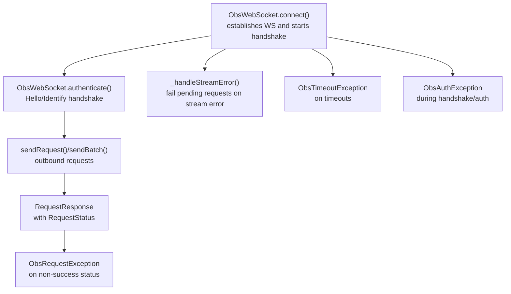
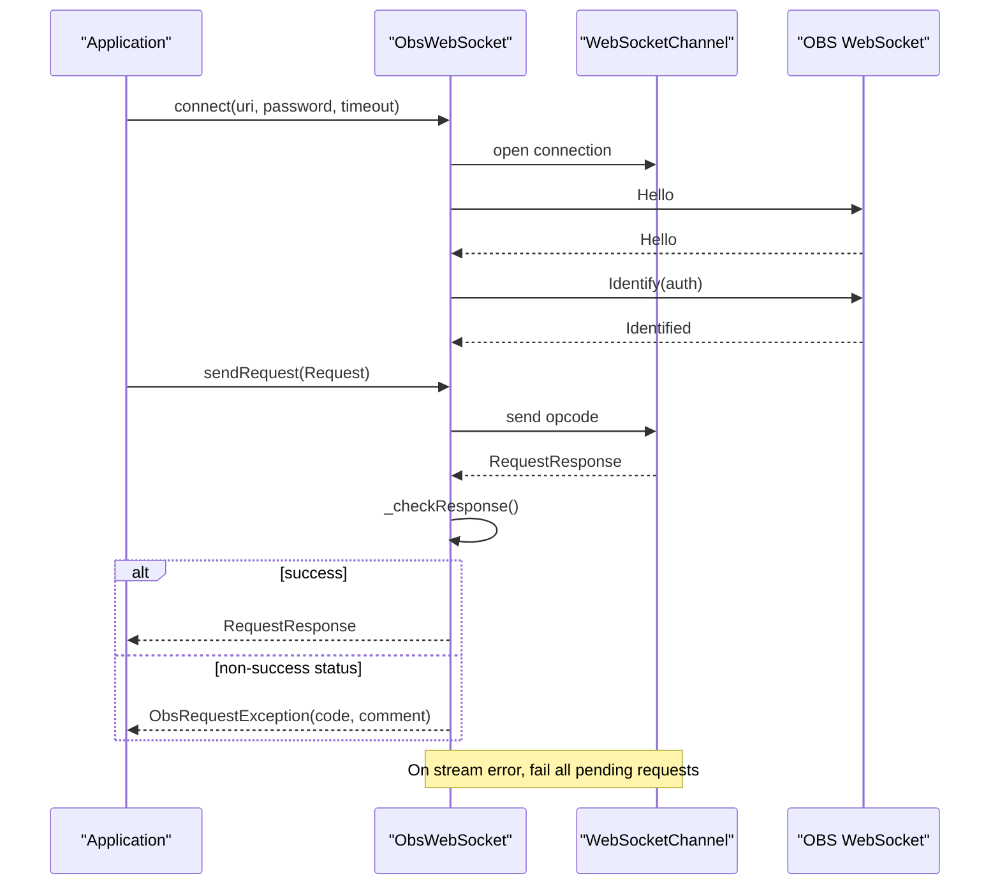
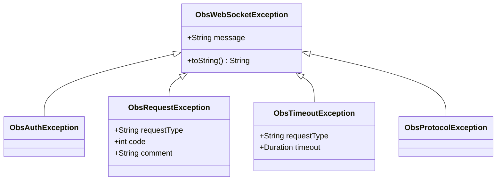
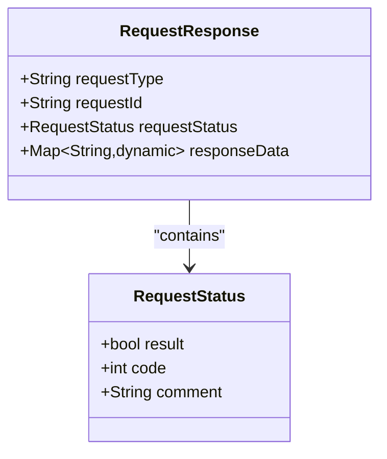
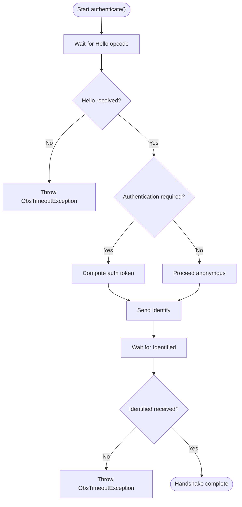
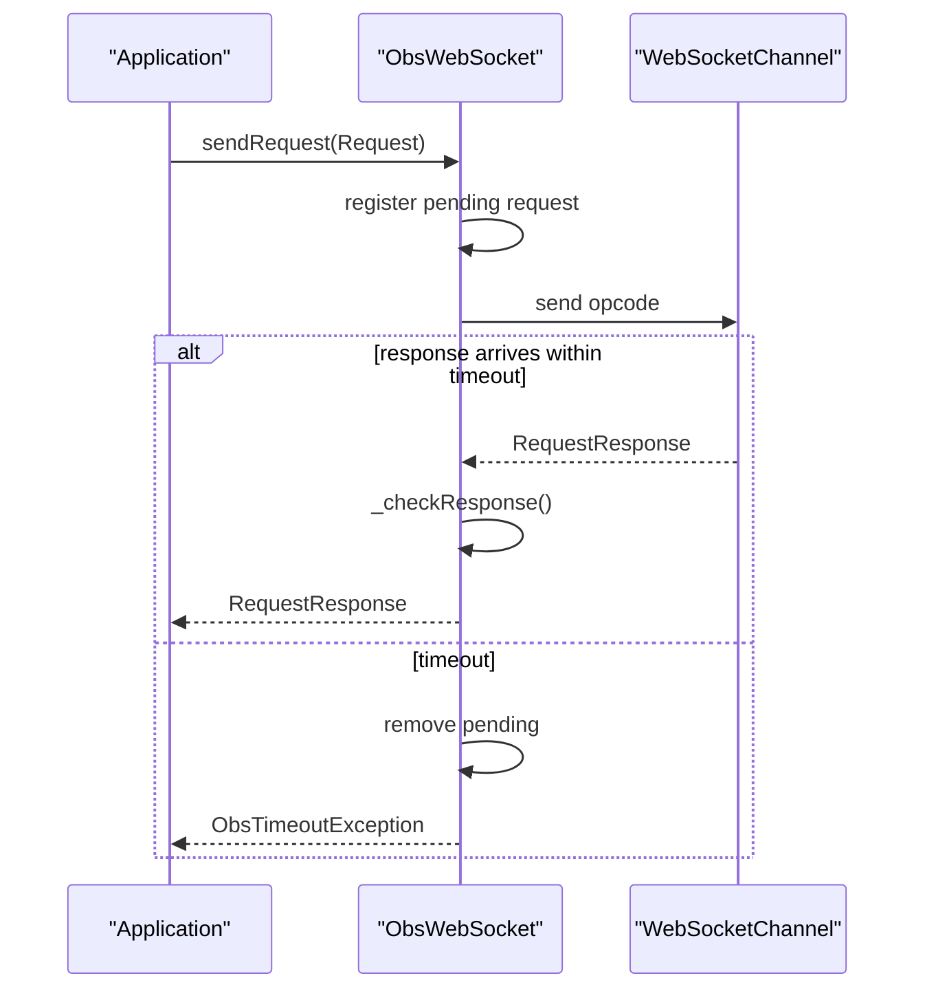
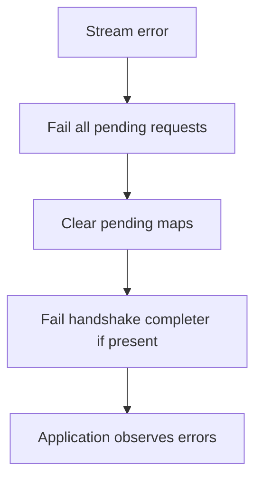
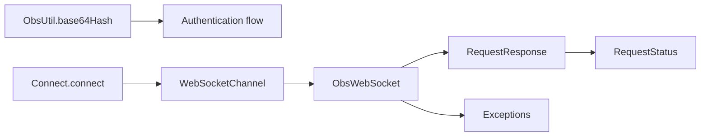

# Error Handling and Troubleshooting

<cite>
**Referenced Files in This Document**
- [README.md](file://README.md)
- [obs_websocket_base.dart](file://lib/src/obs_websocket_base.dart)
- [exception.dart](file://lib/src/exception.dart)
- [request_response.dart](file://lib/src/model/comm/request_response.dart)
- [request_status.dart](file://lib/src/model/comm/request_status.dart)
- [connect.dart](file://lib/src/connect.dart)
- [util.dart](file://lib/src/util/util.dart)
- [obs.dart](file://bin/obs.dart)
- [obs_websocket_general_test.dart](file://test/obs_websocket_general_test.dart)
</cite>

## Table of Contents
1. [Introduction](#introduction)
2. [Project Structure](#project-structure)
3. [Core Components](#core-components)
4. [Architecture Overview](#architecture-overview)
5. [Detailed Component Analysis](#detailed-component-analysis)
6. [Dependency Analysis](#dependency-analysis)
7. [Performance Considerations](#performance-considerations)
8. [Troubleshooting Guide](#troubleshooting-guide)
9. [Conclusion](#conclusion)

## Introduction
This document provides comprehensive error handling and troubleshooting guidance for the obs-websocket-dart project. It covers error types during WebSocket communication, authentication failures, and request processing errors. It explains error response structures, how to interpret error codes and messages, and offers systematic approaches to diagnose and resolve issues. It also documents logging strategies, debugging techniques, performance considerations, and best practices for robust production deployments.

## Project Structure
The error-handling and troubleshooting coverage centers on the core WebSocket client implementation, error models, and protocol response structures.

**Diagram sources**
- [obs_websocket_base.dart:130-169](file://lib/src/obs_websocket_base.dart#L130-L169)
- [obs_websocket_base.dart:260-318](file://lib/src/obs_websocket_base.dart#L260-L318)
- [obs_websocket_base.dart:448-501](file://lib/src/obs_websocket_base.dart#L448-L501)
- [obs_websocket_base.dart:238-258](file://lib/src/obs_websocket_base.dart#L238-L258)
- [obs_websocket_base.dart:475-492](file://lib/src/obs_websocket_base.dart#L475-L492)
- [obs_websocket_base.dart:300-307](file://lib/src/obs_websocket_base.dart#L300-L307)
- [obs_websocket_base.dart:270-318](file://lib/src/obs_websocket_base.dart#L270-L318)

**Section sources**
- [obs_websocket_base.dart:130-169](file://lib/src/obs_websocket_base.dart#L130-L169)
- [obs_websocket_base.dart:260-318](file://lib/src/obs_websocket_base.dart#L260-L318)
- [obs_websocket_base.dart:448-501](file://lib/src/obs_websocket_base.dart#L448-L501)
- [obs_websocket_base.dart:238-258](file://lib/src/obs_websocket_base.dart#L238-L258)
- [obs_websocket_base.dart:475-492](file://lib/src/obs_websocket_base.dart#L475-L492)
- [obs_websocket_base.dart:300-307](file://lib/src/obs_websocket_base.dart#L300-L307)
- [obs_websocket_base.dart:270-318](file://lib/src/obs_websocket_base.dart#L270-L318)

## Core Components
- ObsWebSocket: Manages the WebSocket connection, handshake, authentication, request dispatch, and event routing. It tracks pending requests and handles timeouts and stream errors.
- Exception hierarchy: Provides structured error types for authentication failures, request failures, timeouts, and protocol decoding issues.
- RequestResponse and RequestStatus: Define the structure of server responses and their embedded status codes/comments.

Key responsibilities:
- Connection establishment and authentication
- Outbound request orchestration with timeouts
- Inbound event routing and fallback handling
- Graceful closure and cleanup

**Section sources**
- [obs_websocket_base.dart:21-106](file://lib/src/obs_websocket_base.dart#L21-L106)
- [exception.dart:18-77](file://lib/src/exception.dart#L18-L77)
- [request_response.dart:9-31](file://lib/src/model/comm/request_response.dart#L9-L31)
- [request_status.dart:7-27](file://lib/src/model/comm/request_status.dart#L7-L27)

## Architecture Overview
The error-handling architecture integrates logging, timeouts, and structured exceptions across the WebSocket lifecycle.

**Diagram sources**
- [obs_websocket_base.dart:130-169](file://lib/src/obs_websocket_base.dart#L130-L169)
- [obs_websocket_base.dart:260-318](file://lib/src/obs_websocket_base.dart#L260-L318)
- [obs_websocket_base.dart:448-501](file://lib/src/obs_websocket_base.dart#L448-L501)
- [obs_websocket_base.dart:238-258](file://lib/src/obs_websocket_base.dart#L238-L258)

## Detailed Component Analysis

### Error Types and Exception Hierarchy
The library defines a clear exception hierarchy to categorize failures:
- ObsAuthException: Authentication or handshake failures.
- ObsRequestException: Non-success request responses from OBS, including code and optional comment.
- ObsTimeoutException: Timeouts while waiting for handshake, identify, or request responses.
- ObsProtocolException: Decoding or protocol parsing failures.

**Diagram sources**
- [exception.dart:18-77](file://lib/src/exception.dart#L18-L77)

**Section sources**
- [exception.dart:18-77](file://lib/src/exception.dart#L18-L77)

### Request Response Model and Error Interpretation
RequestResponse encapsulates the server reply, including a RequestStatus with:
- result: Boolean success indicator
- code: Numeric status code (per protocol)
- comment: Optional human-readable comment

ObsWebSocket._checkResponse throws ObsRequestException when result is false and the request expects response data.

**Diagram sources**
- [request_response.dart:9-31](file://lib/src/model/comm/request_response.dart#L9-L31)
- [request_status.dart:7-27](file://lib/src/model/comm/request_status.dart#L7-L27)

**Section sources**
- [request_response.dart:9-31](file://lib/src/model/comm/request_response.dart#L9-L31)
- [request_status.dart:7-27](file://lib/src/model/comm/request_status.dart#L7-L27)
- [obs_websocket_base.dart:503-511](file://lib/src/obs_websocket_base.dart#L503-L511)

### Authentication and Handshake Error Handling
The handshake flow involves:
- Waiting for Hello opcode
- Optionally authenticating if OBS requires credentials
- Sending Identify and awaiting Identified
- Tracking negotiated RPC version

Failures here raise ObsAuthException or ObsTimeoutException depending on cause.

**Diagram sources**
- [obs_websocket_base.dart:260-318](file://lib/src/obs_websocket_base.dart#L260-L318)
- [util.dart:39-43](file://lib/src/util/util.dart#L39-L43)

**Section sources**
- [obs_websocket_base.dart:260-318](file://lib/src/obs_websocket_base.dart#L260-L318)
- [util.dart:39-43](file://lib/src/util/util.dart#L39-L43)

### Request Dispatch and Timeout Handling
Outbound requests are tracked by requestId. Responses are matched to pending requests and resolved or rejected accordingly. Timeouts trigger ObsTimeoutException.

**Diagram sources**
- [obs_websocket_base.dart:475-501](file://lib/src/obs_websocket_base.dart#L475-L501)
- [obs_websocket_base.dart:485-492](file://lib/src/obs_websocket_base.dart#L485-L492)

**Section sources**
- [obs_websocket_base.dart:475-501](file://lib/src/obs_websocket_base.dart#L475-L501)
- [obs_websocket_base.dart:485-492](file://lib/src/obs_websocket_base.dart#L485-L492)

### Stream Error Handling and Recovery
On WebSocket stream errors, all pending requests are failed immediately to prevent indefinite hangs. This ensures callers can react promptly.

**Diagram sources**
- [obs_websocket_base.dart:238-258](file://lib/src/obs_websocket_base.dart#L238-L258)

**Section sources**
- [obs_websocket_base.dart:238-258](file://lib/src/obs_websocket_base.dart#L238-L258)

### Logging and Debugging Strategies
- Logging is initialized with configurable log levels and a pretty printer.
- The CLI supports setting log levels to aid debugging.
- Core paths log connection, handshake, and response details.

Practical tips:
- Increase log level to debug during development to capture opcode traffic.
- Use the CLI’s log-level option to reduce noise in production.
- Capture and correlate timestamps around request send and response receipt.

**Section sources**
- [obs_websocket_base.dart:137-143](file://lib/src/obs_websocket_base.dart#L137-L143)
- [obs.dart:26-30](file://bin/obs.dart#L26-L30)
- [README.md:300-303](file://README.md#L300-L303)

## Dependency Analysis
The error-handling logic depends on:
- WebSocketChannel for transport
- Json serialization for opcodes and responses
- Logging framework for diagnostics
- Utility helpers for hashing and logging options

**Diagram sources**
- [util.dart:39-43](file://lib/src/util/util.dart#L39-L43)
- [connect.dart:7-14](file://lib/src/connect.dart#L7-L14)
- [obs_websocket_base.dart:21-11](file://lib/src/obs_websocket_base.dart#L21-L11)
- [request_response.dart:9-31](file://lib/src/model/comm/request_response.dart#L9-L31)
- [request_status.dart:7-27](file://lib/src/model/comm/request_status.dart#L7-L27)
- [exception.dart:18-77](file://lib/src/exception.dart#L18-L77)

**Section sources**
- [util.dart:39-43](file://lib/src/util/util.dart#L39-L43)
- [connect.dart:7-14](file://lib/src/connect.dart#L7-L14)
- [obs_websocket_base.dart:21-11](file://lib/src/obs_websocket_base.dart#L21-L11)
- [request_response.dart:9-31](file://lib/src/model/comm/request_response.dart#L9-L31)
- [request_status.dart:7-27](file://lib/src/model/comm/request_status.dart#L7-L27)
- [exception.dart:18-77](file://lib/src/exception.dart#L18-L77)

## Performance Considerations
- Pending request tracking: The client maintains maps keyed by requestId for requests and batches. Ensure to close connections properly to release resources.
- Logging overhead: In high-throughput scenarios, consider reducing log verbosity to avoid impacting performance.
- Timeouts: Tune requestTimeout to balance responsiveness and reliability for your environment.
- Resource cleanup: Always call close() to cancel subscriptions and close the WebSocket sink.

[No sources needed since this section provides general guidance]

## Troubleshooting Guide

### Common Error Scenarios and Solutions
- Authentication failures
  - Symptoms: Immediate disconnect after connect or ObsAuthException during handshake.
  - Causes: Incorrect password, mismatched RPC version, or OBS requiring authentication.
  - Actions:
    - Verify OBS websocket password and settings.
    - Confirm the client’s requestTimeout is sufficient for handshake.
    - Check negotiated RPC version availability.

- Request failures (non-success status)
  - Symptoms: ObsRequestException with code and optional comment.
  - Causes: Invalid parameters, unsupported request, or OBS internal error.
  - Actions:
    - Inspect RequestStatus.code and comment.
    - Validate request payload and parameters.
    - Retry with corrected inputs.

- Timeouts
  - Symptoms: ObsTimeoutException for handshake, identify, or request responses.
  - Causes: Network latency, OBS overload, or insufficient timeout.
  - Actions:
    - Increase requestTimeout appropriately.
    - Investigate network conditions and OBS performance.

- Stream errors
  - Symptoms: Sudden connection drop and immediate failure of pending requests.
  - Causes: Network interruption, server restart, or client-side transport issues.
  - Actions:
    - Implement retry with exponential backoff.
    - Recreate the connection and re-authenticate.
    - Ensure proper close() on shutdown to free resources.

- Protocol decoding errors
  - Symptoms: ObsProtocolException or malformed opcode logs.
  - Causes: Unexpected message format or unsupported opcode.
  - Actions:
    - Upgrade to a compatible OBS and plugin version.
    - Validate message boundaries and encoding.

**Section sources**
- [obs_websocket_base.dart:260-318](file://lib/src/obs_websocket_base.dart#L260-L318)
- [obs_websocket_base.dart:475-501](file://lib/src/obs_websocket_base.dart#L475-L501)
- [obs_websocket_base.dart:238-258](file://lib/src/obs_websocket_base.dart#L238-L258)
- [exception.dart:29-77](file://lib/src/exception.dart#L29-L77)

### Interpreting Error Codes and Messages
- RequestStatus.code: Numeric status code indicating success or failure. Use it to programmatically branch error handling.
- RequestStatus.comment: Optional human-readable comment from OBS providing context.
- ObsRequestException: Includes requestType, code, and comment for targeted handling.

**Section sources**
- [request_status.dart:7-27](file://lib/src/model/comm/request_status.dart#L7-L27)
- [obs_websocket_base.dart:503-511](file://lib/src/obs_websocket_base.dart#L503-L511)
- [README.md:300-303](file://README.md#L300-L303)

### Logging and Debugging Techniques
- Enable debug logging during development to capture handshake and request/response opcodes.
- Use the CLI’s log-level option to adjust verbosity.
- Correlate logs around request send and response receipt to identify delays or failures.

**Section sources**
- [obs_websocket_base.dart:137-143](file://lib/src/obs_websocket_base.dart#L137-L143)
- [obs.dart:26-30](file://bin/obs.dart#L26-L30)
- [README.md:300-303](file://README.md#L300-L303)

### Network Interruptions and Recovery Procedures
- Detect stream errors and fail pending requests promptly.
- Implement retry logic with backoff and jitter.
- Reconnect by calling connect() again, then re-authenticate and re-subscribe to events.
- Always call close() on graceful shutdown to prevent resource leaks.

**Section sources**
- [obs_websocket_base.dart:238-258](file://lib/src/obs_websocket_base.dart#L238-L258)
- [obs_websocket_base.dart:398-408](file://lib/src/obs_websocket_base.dart#L398-L408)

### Best Practices for Production
- Configure appropriate timeouts for your environment.
- Centralize error handling using the exception hierarchy.
- Keep logs actionable but not noisy; avoid logging sensitive credentials.
- Monitor and alert on frequent timeouts or authentication failures.
- Test error paths in CI using representative fixtures and mocks.

**Section sources**
- [obs_websocket_general_test.dart:6-97](file://test/obs_websocket_general_test.dart#L6-L97)
- [README.md:483-489](file://README.md#L483-L489)

## Conclusion
Robust error handling in obs-websocket-dart relies on structured exceptions, clear response models, and disciplined logging. By understanding the handshake, request/response lifecycle, and error categories, you can implement resilient clients that recover gracefully from network issues, authentication failures, and request processing errors. Apply the troubleshooting steps and best practices to maintain reliable integrations in production environments.