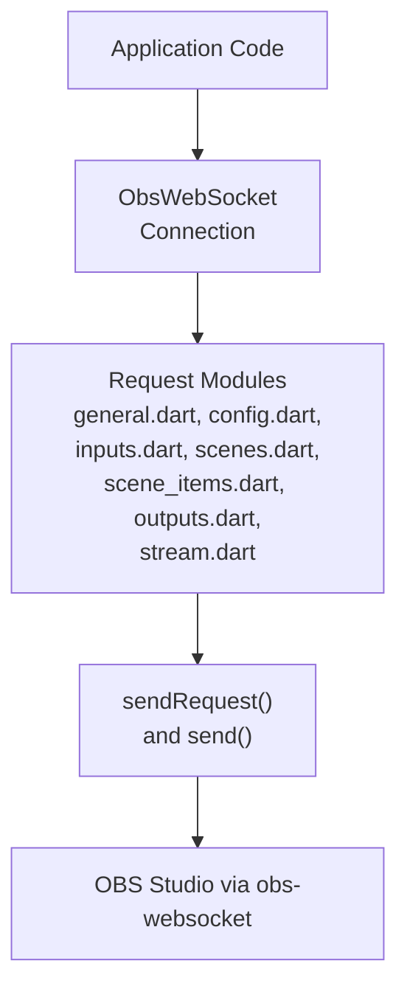
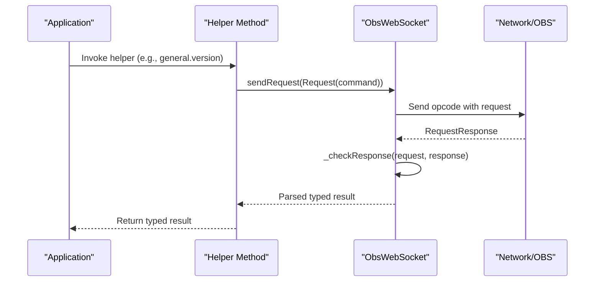
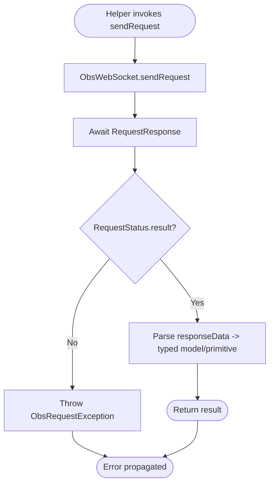
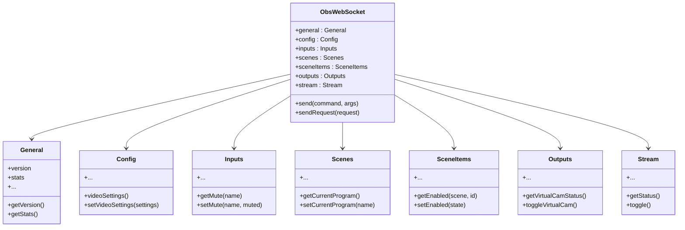
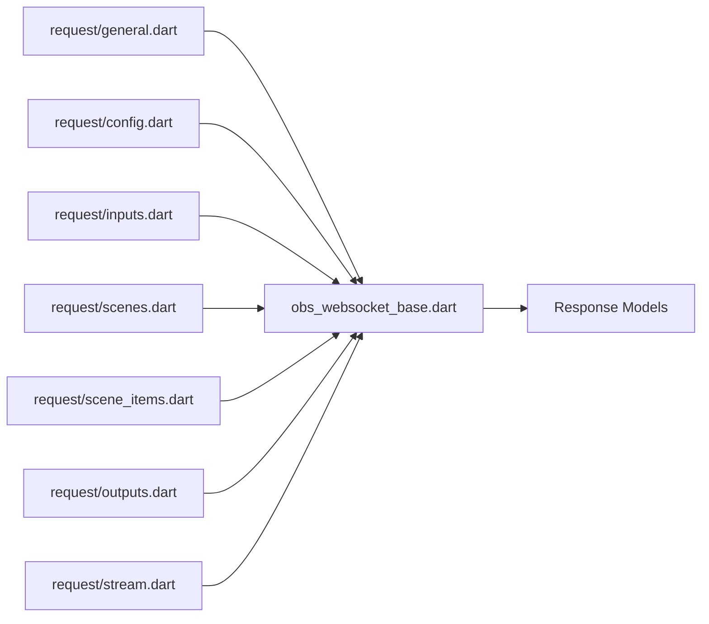

# High-Level Helper Methods

<cite>
**Referenced Files in This Document**
- [README.md](file://README.md)
- [obs_websocket.dart](file://lib/obs_websocket.dart)
- [obs_websocket_base.dart](file://lib/src/obs_websocket_base.dart)
- [obs_helper_command.dart](file://lib/src/cmd/obs_helper_command.dart)
- [general.dart](file://lib/src/request/general.dart)
- [config.dart](file://lib/src/request/config.dart)
- [inputs.dart](file://lib/src/request/inputs.dart)
- [scenes.dart](file://lib/src/request/scenes.dart)
- [scene_items.dart](file://lib/src/request/scene_items.dart)
- [outputs.dart](file://lib/src/request/outputs.dart)
- [stream.dart](file://lib/src/request/stream.dart)
</cite>

## Table of Contents
1. [Introduction](#introduction)
2. [Project Structure](#project-structure)
3. [Core Components](#core-components)
4. [Architecture Overview](#architecture-overview)
5. [Detailed Component Analysis](#detailed-component-analysis)
6. [Dependency Analysis](#dependency-analysis)
7. [Performance Considerations](#performance-considerations)
8. [Troubleshooting Guide](#troubleshooting-guide)
9. [Conclusion](#conclusion)

## Introduction
This document explains the high-level helper methods that simplify common OBS operations in the obs-websocket Dart library. It covers the helper method pattern used across all request categories (general, config, inputs, scenes, outputs, etc.), how helpers abstract request construction and response parsing, standardized naming and parameter conventions, practical usage examples, automatic validation and error handling, and the relationship between helpers and their underlying low-level request counterparts. Guidance is also provided on when to use helpers versus direct low-level calls.

## Project Structure
The library exposes a clean facade through exported modules and a central connection class. High-level helper methods are grouped by domain (general, config, inputs, scenes, outputs, stream, etc.) and invoked via properties on the main connection object.

**Diagram sources**
- [obs_websocket_base.dart:56-105](file://lib/src/obs_websocket_base.dart#L56-L105)
- [general.dart:1-143](file://lib/src/request/general.dart#L1-L143)
- [config.dart:1-268](file://lib/src/request/config.dart#L1-L268)
- [inputs.dart:1-389](file://lib/src/request/inputs.dart#L1-L389)
- [scenes.dart:1-232](file://lib/src/request/scenes.dart#L1-L232)
- [scene_items.dart:1-324](file://lib/src/request/scene_items.dart#L1-L324)
- [outputs.dart:1-158](file://lib/src/request/outputs.dart#L1-L158)
- [stream.dart:1-94](file://lib/src/request/stream.dart#L1-L94)

**Section sources**
- [obs_websocket_base.dart:56-105](file://lib/src/obs_websocket_base.dart#L56-L105)
- [obs_websocket.dart:1-69](file://lib/obs_websocket.dart#L1-L69)

## Core Components
- ObsWebSocket: Central connection class that owns typed request modules and handles low-level communication, timeouts, and response validation.
- Request Modules: Domain-specific classes (General, Config, Inputs, Scenes, SceneItems, Outputs, Stream) that expose helper methods.
- Helper Methods: Public methods that encapsulate request construction, response parsing, and validation, returning strongly-typed models or primitives.

Key responsibilities:
- Request Construction: Build Request objects with the correct command and requestData.
- Response Parsing: Convert responseData into typed models or primitives.
- Validation and Error Handling: Throw structured exceptions on request failures; helpers surface meaningful errors.
- Convenience: Offer both property-style accessors and explicit method forms for parity.

**Section sources**
- [obs_websocket_base.dart:448-513](file://lib/src/obs_websocket_base.dart#L448-L513)
- [general.dart:14-25](file://lib/src/request/general.dart#L14-L25)
- [config.dart:179-194](file://lib/src/request/config.dart#L179-L194)
- [inputs.dart:286-299](file://lib/src/request/inputs.dart#L286-L299)
- [scenes.dart:67-80](file://lib/src/request/scenes.dart#L67-L80)
- [scene_items.dart:122-146](file://lib/src/request/scene_items.dart#L122-L146)
- [outputs.dart:14-20](file://lib/src/request/outputs.dart#L14-L20)
- [stream.dart:14-32](file://lib/src/request/stream.dart#L14-L32)

## Architecture Overview
The helper method pattern follows a consistent flow: a helper constructs a Request, delegates to ObsWebSocket.sendRequest(), validates the response, and parses the result into a typed model or primitive.

**Diagram sources**
- [general.dart:21-25](file://lib/src/request/general.dart#L21-L25)
- [obs_websocket_base.dart:477-503](file://lib/src/obs_websocket_base.dart#L477-L503)
- [obs_websocket_base.dart:505-513](file://lib/src/obs_websocket_base.dart#L505-L513)

## Detailed Component Analysis

### Naming Conventions and Parameter Patterns
- Property vs Method: Many helpers expose a property alias (e.g., general.version) and a method form (e.g., general.getVersion()). Both delegate to the same underlying logic.
- Verbosity: Some helpers provide concise forms (e.g., inputs.getMute(name)) and longer forms (e.g., inputs.getInputMute(name)).
- Optional vs Required: Helpers accept optional identifiers (e.g., inputName or inputUuid) and enforce argument validation where needed.
- Typed Arguments: Helpers accept typed models or primitives (e.g., VideoSettings) and serialize them appropriately.

Examples by category:
- General: version, stats, hotkeyList, callVendorRequest, obsBrowserEvent, triggerHotkeyByName, triggerHotkeyByKeySequence, sleep.
- Config: persistent data, scene collections, profiles, video settings, stream service settings, record directory.
- Inputs: list/kind, special inputs, create/remove/setName, default/settings, mute/toggle/volume.
- Scenes: list/group/get/set program/preview, create/remove/rename, transition override.
- Scene Items: list/group/id, enabled/locked, index.
- Outputs: virtual cam, replay buffer, generic output toggles/start/stop.
- Stream: status, toggle/start/stop, send captions.

**Section sources**
- [general.dart:14-143](file://lib/src/request/general.dart#L14-L143)
- [config.dart:14-268](file://lib/src/request/config.dart#L14-L268)
- [inputs.dart:14-389](file://lib/src/request/inputs.dart#L14-L389)
- [scenes.dart:16-232](file://lib/src/request/scenes.dart#L16-L232)
- [scene_items.dart:17-324](file://lib/src/request/scene_items.dart#L17-L324)
- [outputs.dart:14-158](file://lib/src/request/outputs.dart#L14-L158)
- [stream.dart:14-94](file://lib/src/request/stream.dart#L14-L94)

### Automatic Response Validation and Error Handling
- Response Validation: ObsWebSocket._checkResponse throws a structured exception when a request fails (non-success result), preserving request type, code, and comment.
- Helper Behavior: Helpers rely on ObsWebSocket.sendRequest to perform validation; they return typed data or void depending on the request semantics.
- Special Cases: Some helpers (e.g., Outputs.toggleReplayBuffer) perform additional checks and throw on non-success codes.

**Diagram sources**
- [obs_websocket_base.dart:505-513](file://lib/src/obs_websocket_base.dart#L505-L513)
- [outputs.dart:74-78](file://lib/src/request/outputs.dart#L74-L78)

**Section sources**
- [obs_websocket_base.dart:505-513](file://lib/src/obs_websocket_base.dart#L505-L513)
- [outputs.dart:74-78](file://lib/src/request/outputs.dart#L74-L78)

### Practical Usage Patterns
Below are typical usage patterns for each major helper category. Replace the helper calls with the desired method or property form.

- General
  - Get version: general.version or general.getVersion()
  - Get stats: general.stats or general.getStats()
  - Broadcast custom event: general.broadcastCustomEvent(...)
  - Call vendor request: general.callVendorRequest(vendorName, requestType, requestData)
  - Browser event helper: general.obsBrowserEvent(eventName, eventData)
  - Hotkeys: general.hotkeyList, general.triggerHotkeyByName(name), general.triggerHotkeyByKeySequence(keyId, keyModifiers)

- Config
  - Persistent data: config.getPersistentData(realm, slotName), config.setPersistentData(...)
  - Scene collections: config.getSceneCollectionList(), config.setCurrentSceneCollection(name), config.createSceneCollection(name)
  - Profiles: config.getProfileList(), config.setCurrentProfile(name), config.createProfile(name), config.removeProfile(name)
  - Profile parameters: config.getProfileParameter(cat, name), config.setProfileParameter(cat, name, value)
  - Video settings: config.videoSettings(), config.setVideoSettings(videoSettings)
  - Stream service: config.streamServiceSettings(), config.setStreamServiceSettings(type, settings)
  - Record directory: config.recordDirectory()

- Inputs
  - List/kind/special: inputs.getInputList(kind), inputs.getInputKindList(unversioned), inputs.specialInputs()
  - Create/remove/rename: inputs.createInput(...), inputs.remove(name/uuid), inputs.setName(name/uuid, newName)
  - Defaults/settings: inputs.defaultSettings(kind), inputs.settings(name/uuid), inputs.setSettings(name/uuid, settings, overlay)
  - Mute: inputs.getMute(name), inputs.setMute(name/uuid, muted), inputs.toggleMute(name/uuid)
  - Volume: inputs.getInputVolume(name/uuid)

- Scenes
  - List/group: scenes.list(), scenes.groupList()
  - Program/preview: scenes.getCurrentProgram(), scenes.setCurrentProgram(name), scenes.getCurrentPreview(), scenes.setCurrentPreview(name)
  - Create/remove/rename: scenes.create(name), scenes.remove(name), scenes.set(name)
  - Transitions: scenes.getSceneSceneTransitionOverride(name), scenes.setSceneSceneTransitionOverride(name, transitionName, transitionDuration)

- Scene Items
  - List/group/id: sceneItems.list(scene), sceneItems.groupList(scene), sceneItems.getSceneItemId(scene, source, searchOffset)
  - Enabled/locked: sceneItems.getEnabled(scene, id), sceneItems.setEnabled(sceneItemEnableStateChanged)
  - Index: sceneItems.getIndex(scene, id), sceneItems.setIndex(scene, id, index)

- Outputs
  - Virtual cam: outputs.getVirtualCamStatus(), outputs.toggleVirtualCam(), outputs.startVirtualCam(), outputs.stopVirtualCam()
  - Replay buffer: outputs.getReplayBufferStatus(), outputs.toggleReplayBuffer(), outputs.startReplayBuffer(), outputs.stopReplayBuffer(), outputs.saveReplayBuffer()
  - Generic outputs: outputs.toggleOutput(name), outputs.start(name), outputs.stop(name)

- Stream
  - Status: stream.status or stream.getStatus
  - Control: stream.toggle(), stream.start(), stream.stop()
  - Captions: stream.sendStreamCaption(text)

Note: These patterns reflect the helper method signatures and behaviors defined in the request modules.

**Section sources**
- [general.dart:14-143](file://lib/src/request/general.dart#L14-L143)
- [config.dart:14-268](file://lib/src/request/config.dart#L14-L268)
- [inputs.dart:14-389](file://lib/src/request/inputs.dart#L14-L389)
- [scenes.dart:16-232](file://lib/src/request/scenes.dart#L16-L232)
- [scene_items.dart:17-324](file://lib/src/request/scene_items.dart#L17-L324)
- [outputs.dart:14-158](file://lib/src/request/outputs.dart#L14-L158)
- [stream.dart:14-94](file://lib/src/request/stream.dart#L14-L94)

### Relationship Between Helpers and Low-Level Requests
- Helpers are thin wrappers around ObsWebSocket.sendRequest(Request(...)).
- They construct the Request with the correct command and requestData, parse the response into typed models, and propagate errors.
- For advanced or unsupported requests, use ObsWebSocket.send(command, args) to bypass helper coverage.

**Diagram sources**
- [obs_websocket_base.dart:56-105](file://lib/src/obs_websocket_base.dart#L56-L105)
- [general.dart:14-25](file://lib/src/request/general.dart#L14-L25)
- [config.dart:179-194](file://lib/src/request/config.dart#L179-L194)
- [inputs.dart:286-299](file://lib/src/request/inputs.dart#L286-L299)
- [scenes.dart:74-80](file://lib/src/request/scenes.dart#L74-L80)
- [scene_items.dart:134-146](file://lib/src/request/scene_items.dart#L134-L146)
- [outputs.dart:14-20](file://lib/src/request/outputs.dart#L14-L20)
- [stream.dart:28-32](file://lib/src/request/stream.dart#L28-L32)

**Section sources**
- [obs_websocket_base.dart:448-513](file://lib/src/obs_websocket_base.dart#L448-L513)
- [obs_websocket_base.dart:56-105](file://lib/src/obs_websocket_base.dart#L56-L105)

### When to Use Helpers vs Direct Requests
- Use Helpers when:
  - The operation is covered by a helper method (recommended for common tasks).
  - You want automatic response parsing and validation.
  - You prefer concise, typed APIs aligned with the library’s conventions.
- Use Low-Level send(command, args):
  - When a specific request is not yet exposed as a helper.
  - When you need fine-grained control over request construction.
  - When integrating with vendor-specific or experimental requests.

Guidance from the README:
- High-level helpers are available for many documented requests; otherwise, use the low-level send(...) method.

**Section sources**
- [README.md:106-108](file://README.md#L106-L108)
- [README.md:288-333](file://README.md#L288-L333)

## Dependency Analysis
The helper modules depend on ObsWebSocket for network communication and on typed response models for parsing. ObsWebSocket depends on request/response models and utility classes.

**Diagram sources**
- [general.dart:1-143](file://lib/src/request/general.dart#L1-L143)
- [config.dart:1-268](file://lib/src/request/config.dart#L1-L268)
- [inputs.dart:1-389](file://lib/src/request/inputs.dart#L1-L389)
- [scenes.dart:1-232](file://lib/src/request/scenes.dart#L1-L232)
- [scene_items.dart:1-324](file://lib/src/request/scene_items.dart#L1-L324)
- [outputs.dart:1-158](file://lib/src/request/outputs.dart#L1-L158)
- [stream.dart:1-94](file://lib/src/request/stream.dart#L1-L94)
- [obs_websocket_base.dart:448-513](file://lib/src/obs_websocket_base.dart#L448-L513)

**Section sources**
- [obs_websocket_base.dart:448-513](file://lib/src/obs_websocket_base.dart#L448-L513)

## Performance Considerations
- Prefer helpers for frequently used operations to reduce boilerplate and potential mistakes.
- Batch operations when possible using the low-level batch mechanism for reduced round-trips.
- Use targeted event subscriptions to minimize overhead if you rely on events.

## Troubleshooting Guide
Common issues and resolutions:
- Authentication failures: Ensure the connection is established and password matches OBS configuration.
- Request timeouts: Adjust ObsWebSocket.requestTimeout or investigate OBS responsiveness.
- Non-success responses: Helpers throw ObsRequestException with code and comment; inspect these for diagnostics.
- Argument errors: Some helpers validate arguments (e.g., requiring inputName or inputUuid); ensure required parameters are provided.

**Section sources**
- [obs_websocket_base.dart:260-318](file://lib/src/obs_websocket_base.dart#L260-L318)
- [obs_websocket_base.dart:487-503](file://lib/src/obs_websocket_base.dart#L487-L503)
- [obs_websocket_base.dart:505-513](file://lib/src/obs_websocket_base.dart#L505-L513)
- [inputs.dart:127-138](file://lib/src/request/inputs.dart#L127-L138)
- [inputs.dart:212-214](file://lib/src/request/inputs.dart#L212-L214)
- [inputs.dart:375-377](file://lib/src/request/inputs.dart#L375-L377)

## Conclusion
The helper methods provide a consistent, typed, and validated interface over the obs-websocket protocol. They streamline common workflows, enforce parameter validation, and deliver strongly-typed results. Use helpers for supported operations and fall back to low-level send(...) for advanced or unsupported requests. This approach balances usability, safety, and flexibility.