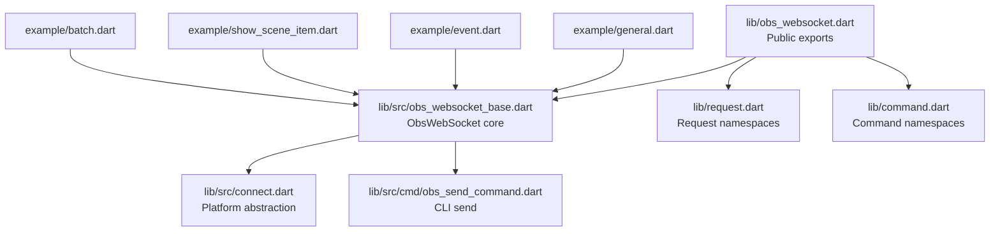
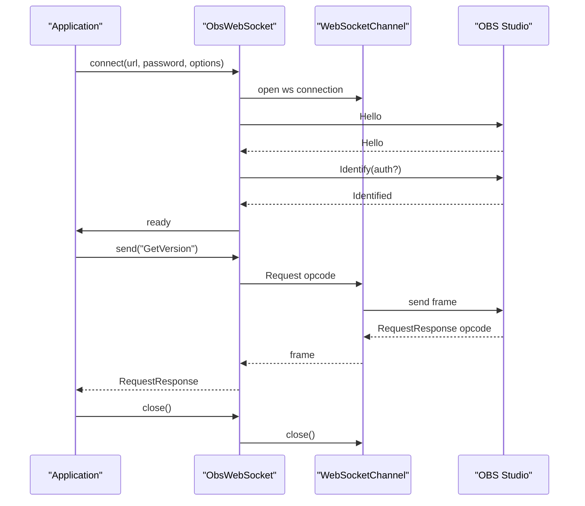
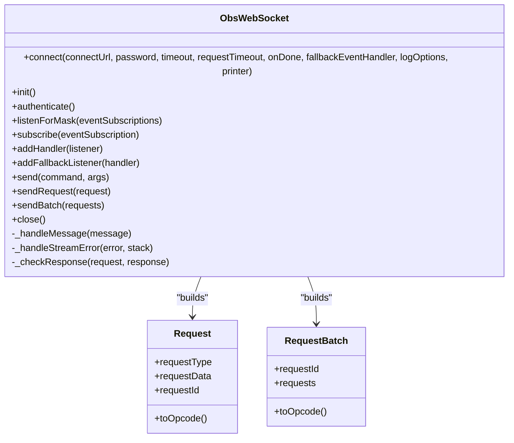
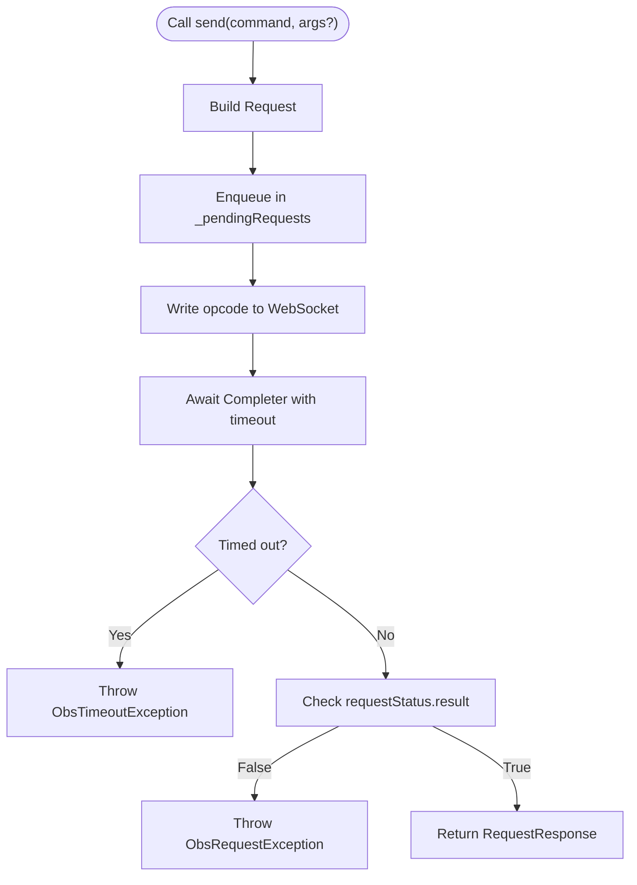
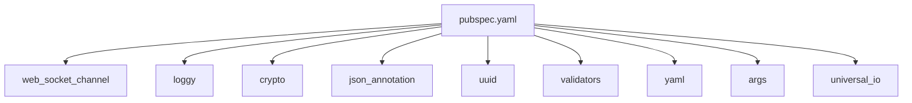

# Library Usage Guide

<cite>
**Referenced Files in This Document**
- [README.md](file://README.md)
- [pubspec.yaml](file://pubspec.yaml)
- [lib/obs_websocket.dart](file://lib/obs_websocket.dart)
- [lib/command.dart](file://lib/command.dart)
- [lib/request.dart](file://lib/request.dart)
- [lib/src/obs_websocket_base.dart](file://lib/src/obs_websocket_base.dart)
- [lib/src/connect.dart](file://lib/src/connect.dart)
- [lib/src/cmd/obs_helper_command.dart](file://lib/src/cmd/obs_helper_command.dart)
- [lib/src/cmd/obs_send_command.dart](file://lib/src/cmd/obs_send_command.dart)
- [example/general.dart](file://example/general.dart)
- [example/event.dart](file://example/event.dart)
- [example/show_scene_item.dart](file://example/show_scene_item.dart)
- [example/batch.dart](file://example/batch.dart)
</cite>

## Table of Contents
1. [Introduction](#introduction)
2. [Project Structure](#project-structure)
3. [Core Components](#core-components)
4. [Architecture Overview](#architecture-overview)
5. [Detailed Component Analysis](#detailed-component-analysis)
6. [Dependency Analysis](#dependency-analysis)
7. [Performance Considerations](#performance-considerations)
8. [Troubleshooting Guide](#troubleshooting-guide)
9. [Conclusion](#conclusion)
10. [Appendices](#appendices)

## Introduction
This guide explains how to use the obs_websocket Dart library to communicate with OBS Studio over the obs-websocket protocol. It covers both high-level helper methods and the low-level send() interface, connection lifecycle management, authentication, event handling, error handling, and practical usage patterns drawn from the repository’s examples.

## Project Structure
The library exposes a thin facade for consumers while organizing internal models, commands, and requests under dedicated namespaces. Examples demonstrate real-world usage patterns for common tasks.

**Diagram sources**
- [lib/obs_websocket.dart:1-69](file://lib/obs_websocket.dart#L1-L69)
- [lib/request.dart:1-19](file://lib/request.dart#L1-L19)
- [lib/command.dart:1-20](file://lib/command.dart#L1-L20)
- [lib/src/obs_websocket_base.dart:21-106](file://lib/src/obs_websocket_base.dart#L21-L106)
- [lib/src/connect.dart:1-15](file://lib/src/connect.dart#L1-L15)
- [lib/src/cmd/obs_send_command.dart:1-46](file://lib/src/cmd/obs_send_command.dart#L1-L46)
- [example/general.dart:1-152](file://example/general.dart#L1-L152)
- [example/event.dart:1-44](file://example/event.dart#L1-L44)
- [example/show_scene_item.dart:1-70](file://example/show_scene_item.dart#L1-L70)
- [example/batch.dart:1-30](file://example/batch.dart#L1-L30)

**Section sources**
- [lib/obs_websocket.dart:1-69](file://lib/obs_websocket.dart#L1-L69)
- [lib/request.dart:1-19](file://lib/request.dart#L1-L19)
- [lib/command.dart:1-20](file://lib/command.dart#L1-L20)
- [lib/src/obs_websocket_base.dart:21-106](file://lib/src/obs_websocket_base.dart#L21-L106)
- [lib/src/connect.dart:1-15](file://lib/src/connect.dart#L1-L15)
- [example/general.dart:1-152](file://example/general.dart#L1-L152)
- [example/event.dart:1-44](file://example/event.dart#L1-L44)
- [example/show_scene_item.dart:1-70](file://example/show_scene_item.dart#L1-L70)
- [example/batch.dart:1-30](file://example/batch.dart#L1-L30)

## Core Components
- ObsWebSocket: The primary class managing connection, authentication, request/response lifecycle, batching, event subscriptions, and cleanup.
- Request namespaces: Grouped helpers for categories like general, config, inputs, scenes, scene items, sources, stream, record, outputs, transitions, ui, filters, and media inputs.
- Low-level send(): A generic method to send any request by name and optional arguments.
- CLI send command: A helper command that exercises the low-level send() path.

Key capabilities:
- Connection management: connect(), authenticate(), listen/subscribe(), close().
- Request execution: send(), sendRequest(), sendBatch().
- Event handling: addHandler<T>(), addFallbackListener(), subscribe().
- Error handling: timeouts, request failures, and stream errors.

**Section sources**
- [lib/src/obs_websocket_base.dart:21-106](file://lib/src/obs_websocket_base.dart#L21-L106)
- [lib/src/obs_websocket_base.dart:448-514](file://lib/src/obs_websocket_base.dart#L448-L514)
- [lib/request.dart:1-19](file://lib/request.dart#L1-L19)
- [lib/command.dart:1-20](file://lib/command.dart#L1-L20)
- [lib/src/cmd/obs_send_command.dart:1-46](file://lib/src/cmd/obs_send_command.dart#L1-L46)

## Architecture Overview
The library encapsulates a WebSocket transport and an RPC-like protocol. Requests and responses are framed as opcodes, with helper methods delegating to the low-level send() method.

**Diagram sources**
- [lib/src/obs_websocket_base.dart:130-178](file://lib/src/obs_websocket_base.dart#L130-L178)
- [lib/src/obs_websocket_base.dart:260-318](file://lib/src/obs_websocket_base.dart#L260-L318)
- [lib/src/obs_websocket_base.dart:448-503](file://lib/src/obs_websocket_base.dart#L448-L503)

## Detailed Component Analysis

### ObsWebSocket Class
Responsibilities:
- Manage WebSocket lifecycle and authentication handshake.
- Route incoming frames to event handlers or response completers.
- Provide typed request helpers and a low-level send() method.
- Support request batching and event subscriptions.

Notable members and behaviors:
- Connection and handshake: connect(), authenticate(), negotiatedRpcVersion getter.
- Request execution: send(), sendRequest(), sendBatch().
- Event handling: addHandler<T>(), addFallbackListener(), subscribe().
- Cleanup: close() with onDone hook and normal closure.

**Diagram sources**
- [lib/src/obs_websocket_base.dart:21-106](file://lib/src/obs_websocket_base.dart#L21-L106)
- [lib/src/obs_websocket_base.dart:448-514](file://lib/src/obs_websocket_base.dart#L448-L514)

**Section sources**
- [lib/src/obs_websocket_base.dart:21-106](file://lib/src/obs_websocket_base.dart#L21-L106)
- [lib/src/obs_websocket_base.dart:130-178](file://lib/src/obs_websocket_base.dart#L130-L178)
- [lib/src/obs_websocket_base.dart:260-318](file://lib/src/obs_websocket_base.dart#L260-L318)
- [lib/src/obs_websocket_base.dart:337-372](file://lib/src/obs_websocket_base.dart#L337-L372)
- [lib/src/obs_websocket_base.dart:410-446](file://lib/src/obs_websocket_base.dart#L410-L446)
- [lib/src/obs_websocket_base.dart:448-514](file://lib/src/obs_websocket_base.dart#L448-L514)

### Helper Method Pattern (Request Namespaces)
The library organizes frequently used requests into category-specific helpers:
- general, config, inputs, scenes, sceneItems, sources, stream, record, outputs, transitions, ui, filters, mediaInputs.

Each helper is exposed as a property on ObsWebSocket (e.g., obs.general.version, obs.config.getRecordDirectory(), obs.stream.status). These helpers internally call the low-level send() method.

Practical usage examples:
- Accessing stream status via helper vs. low-level send.
- Listing scenes and iterating response data.
- Modifying video settings by retrieving current settings and sending updated ones.

**Section sources**
- [lib/obs_websocket.dart:57-69](file://lib/obs_websocket.dart#L57-L69)
- [lib/request.dart:1-19](file://lib/request.dart#L1-L19)
- [example/general.dart:72-142](file://example/general.dart#L72-L142)

### Low-Level send() Method
Purpose:
- Send any request by name and optional arguments.
- Returns a RequestResponse with requestStatus and responseData.
- Validates success using requestStatus.result and throws on failure.

Typical flow:
- Build Request with command and optional args.
- Call send() or sendRequest().
- Inspect requestStatus.code/comment and extract responseData.

**Diagram sources**
- [lib/src/obs_websocket_base.dart:448-503](file://lib/src/obs_websocket_base.dart#L448-L503)
- [lib/src/obs_websocket_base.dart:505-513](file://lib/src/obs_websocket_base.dart#L505-L513)

**Section sources**
- [lib/src/obs_websocket_base.dart:448-503](file://lib/src/obs_websocket_base.dart#L448-L503)
- [lib/src/obs_websocket_base.dart:505-513](file://lib/src/obs_websocket_base.dart#L505-L513)
- [example/general.dart:76-136](file://example/general.dart#L76-L136)

### Request Batching
Purpose:
- Submit multiple requests atomically and receive a batch response.
- Useful for reducing round-trips and coordinating related operations.

Behavior:
- Construct a list of Request objects.
- Call sendBatch(requests).
- Iterate results and check each RequestResponse.

**Section sources**
- [lib/src/obs_websocket_base.dart:453-475](file://lib/src/obs_websocket_base.dart#L453-L475)
- [example/batch.dart:17-28](file://example/batch.dart#L17-L28)

### Event Handling and Subscriptions
Capabilities:
- subscribe() accepts EventSubscription enums, iterable of them, or raw masks.
- addHandler<T>() registers typed event handlers.
- addFallbackListener() handles unknown or untyped events.
- listenForMask() re-identify with desired event subscriptions.

Example patterns:
- Subscribing to all events plus specific masks.
- Reacting to scene and input events, then closing gracefully.

**Section sources**
- [lib/src/obs_websocket_base.dart:337-372](file://lib/src/obs_websocket_base.dart#L337-L372)
- [lib/src/obs_websocket_base.dart:410-446](file://lib/src/obs_websocket_base.dart#L410-L446)
- [example/event.dart:19-42](file://example/event.dart#L19-L42)
- [example/show_scene_item.dart:31-53](file://example/show_scene_item.dart#L31-L53)

### CLI Integration (Low-Level Send)
The CLI provides a convenience command to send arbitrary requests and print responses.

Usage:
- obs send --command GetVersion [--args '{"..."}']
- Initializes ObsWebSocket, sends request, prints response, closes.

**Section sources**
- [lib/src/cmd/obs_send_command.dart:1-46](file://lib/src/cmd/obs_send_command.dart#L1-L46)
- [lib/src/cmd/obs_helper_command.dart:13-42](file://lib/src/cmd/obs_helper_command.dart#L13-L42)

## Dependency Analysis
External dependencies include platform abstraction for WebSocket connectivity, logging, JSON serialization, and optional CLI support.

**Diagram sources**
- [pubspec.yaml:13-22](file://pubspec.yaml#L13-L22)

**Section sources**
- [pubspec.yaml:13-22](file://pubspec.yaml#L13-L22)

## Performance Considerations
- Prefer helper methods for frequently used requests to reduce boilerplate and potential errors.
- Use sendBatch() for related operations to minimize latency and network overhead.
- Tune requestTimeout for environments with higher latency.
- Avoid excessive event subscriptions if not needed; subscribe selectively to reduce traffic.
- Close connections promptly to prevent resource leaks in OBS.

## Troubleshooting Guide
Common issues and resolutions:
- Authentication failures or missing password: Ensure the password matches OBS settings; the library attempts automatic authentication during handshake.
- Timeouts: Increase requestTimeout or reduce workload; verify OBS responsiveness.
- Unknown request names: Use the low-level send() method with the exact command string from the protocol reference.
- Unhandled events: Register fallback handlers or subscribe to broader masks.
- Graceful shutdown: Always call close() to release resources.

Operational tips:
- Enable debug logs to inspect opcodes and responses.
- Validate requestStatus.result and code to diagnose failures.
- Use examples as templates for common workflows.

**Section sources**
- [lib/src/obs_websocket_base.dart:260-318](file://lib/src/obs_websocket_base.dart#L260-L318)
- [lib/src/obs_websocket_base.dart:496-503](file://lib/src/obs_websocket_base.dart#L496-L503)
- [example/general.dart:10-17](file://example/general.dart#L10-L17)
- [README.md:483-489](file://README.md#L483-L489)

## Conclusion
The obs_websocket Dart library offers a robust, typed interface for OBS Studio automation alongside a flexible low-level send() method. By combining helper methods for common operations with the low-level interface for advanced use cases, developers can integrate OBS control into Dart applications reliably. Proper connection lifecycle management, event subscription strategies, and error handling ensure stable integrations.

## Appendices

### Practical Usage Patterns
- Basic connection and helper usage: [example/general.dart:10-151](file://example/general.dart#L10-L151)
- Event-driven automation: [example/event.dart:19-42](file://example/event.dart#L19-L42), [example/show_scene_item.dart:31-53](file://example/show_scene_item.dart#L31-L53)
- Batch requests: [example/batch.dart:17-28](file://example/batch.dart#L17-L28)
- Low-level send() examples: [example/general.dart:76-136](file://example/general.dart#L76-L136)

### Protocol and Reference Links
- Protocol reference and supported requests/events are linked from the README for authoritative details.

**Section sources**
- [example/general.dart:10-151](file://example/general.dart#L10-L151)
- [example/event.dart:19-42](file://example/event.dart#L19-L42)
- [example/show_scene_item.dart:31-53](file://example/show_scene_item.dart#L31-L53)
- [example/batch.dart:17-28](file://example/batch.dart#L17-L28)
- [README.md:106-263](file://README.md#L106-L263)