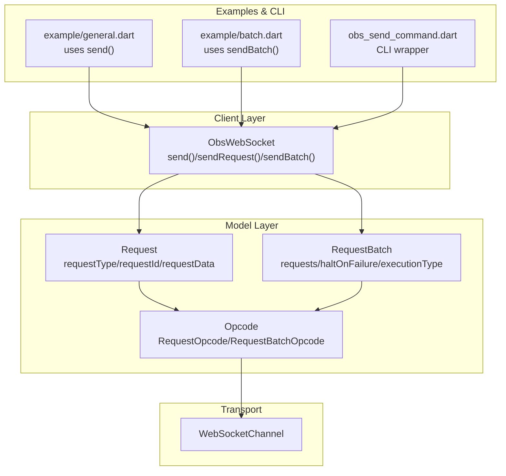
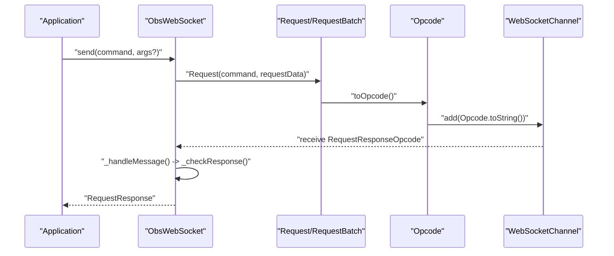
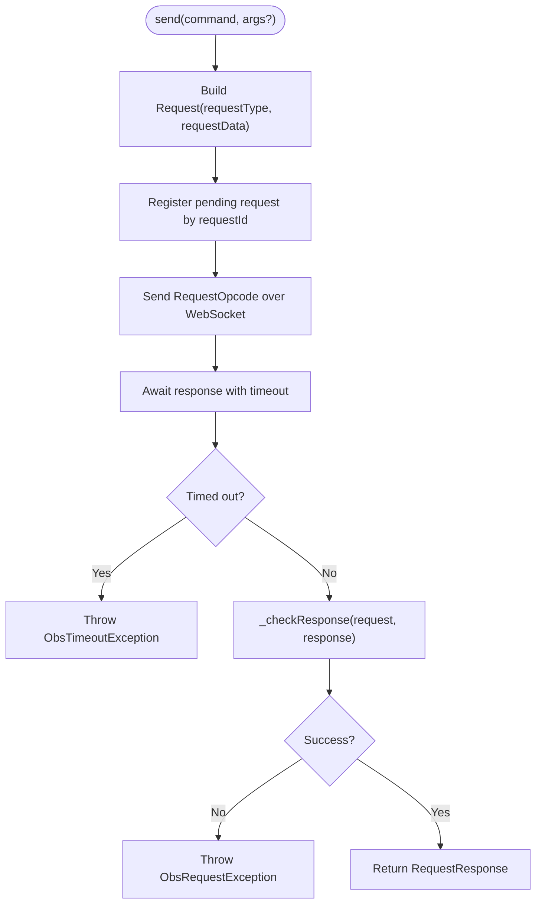
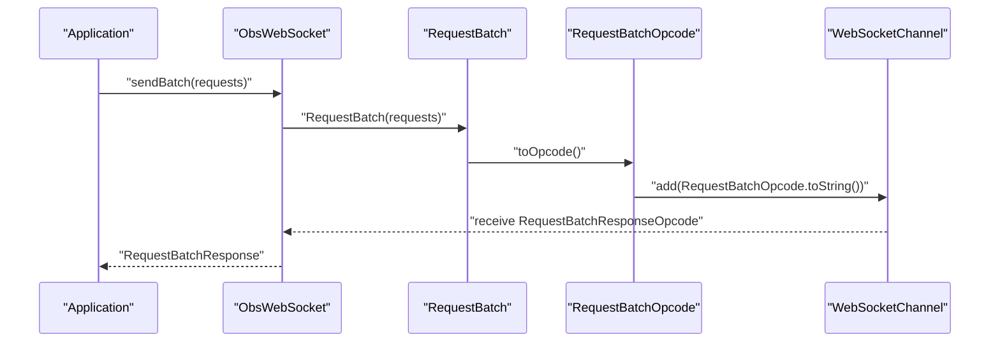
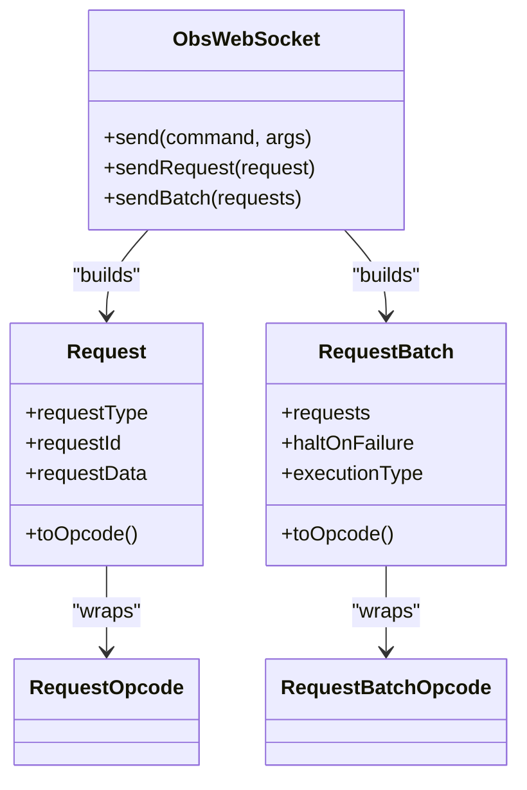

# Low-Level Request Interface

<cite>
**Referenced Files in This Document**
- [obs_websocket_base.dart](file://lib/src/obs_websocket_base.dart)
- [request.dart](file://lib/request.dart)
- [command.dart](file://lib/command.dart)
- [batch.dart](file://example/batch.dart)
- [general.dart](file://example/general.dart)
- [obs_send_command.dart](file://lib/src/cmd/obs_send_command.dart)
- [obs_helper_command.dart](file://lib/src/cmd/obs_helper_command.dart)
- [request.dart](file://lib/src/model/comm/request.dart)
- [request_batch.dart](file://lib/src/model/comm/request_batch.dart)
- [opcode.dart](file://lib/src/model/comm/opcode.dart)
</cite>

## Table of Contents
1. [Introduction](#introduction)
2. [Project Structure](#project-structure)
3. [Core Components](#core-components)
4. [Architecture Overview](#architecture-overview)
5. [Detailed Component Analysis](#detailed-component-analysis)
6. [Dependency Analysis](#dependency-analysis)
7. [Performance Considerations](#performance-considerations)
8. [Troubleshooting Guide](#troubleshooting-guide)
9. [Conclusion](#conclusion)

## Introduction
This document explains the low-level request interface used to execute arbitrary OBS WebSocket commands directly. It covers the send() method and its parameters, request construction patterns, parameter validation, response handling, batch request processing, and the end-to-end request/response lifecycle including serialization, transmission, and deserialization. It also describes how the low-level interface relates to the higher-level helper method abstraction layer and provides practical examples and debugging strategies.

## Project Structure
The low-level request interface is implemented in the core WebSocket client and exposed via helper methods and CLI commands. Key areas:
- Core client: ObsWebSocket with send(), sendRequest(), and sendBatch()
- Request models: Request and RequestBatch for building and serializing requests
- Opcodes: Encapsulation of request/response frames for transport
- Examples: Usage of send() and sendBatch() in example scripts
- CLI: ObsSendCommand demonstrates invoking low-level requests from the command line

**Diagram sources**
- [obs_websocket_base.dart:448-512](file://lib/src/obs_websocket_base.dart#L448-L512)
- [request.dart:10-37](file://lib/src/model/comm/request.dart#L10-L37)
- [request_batch.dart:12-39](file://lib/src/model/comm/request_batch.dart#L12-L39)
- [opcode.dart:57-86](file://lib/src/model/comm/opcode.dart#L57-L86)
- [general.dart:78-90](file://example/general.dart#L78-L90)
- [batch.dart:17-28](file://example/batch.dart#L17-L28)
- [obs_send_command.dart:32-44](file://lib/src/cmd/obs_send_command.dart#L32-L44)

**Section sources**
- [obs_websocket_base.dart:1-513](file://lib/src/obs_websocket_base.dart#L1-L513)
- [request.dart:1-38](file://lib/src/model/comm/request.dart#L1-L38)
- [request_batch.dart:1-40](file://lib/src/model/comm/request_batch.dart#L1-L40)
- [general.dart:1-154](file://example/general.dart#L1-L154)
- [batch.dart:1-30](file://example/batch.dart#L1-L30)
- [obs_send_command.dart:1-46](file://lib/src/cmd/obs_send_command.dart#L1-L46)

## Core Components
- ObsWebSocket.send(): Convenience method that wraps a raw command string and optional argument map into a Request and delegates to sendRequest().
- ObsWebSocket.sendRequest(): Builds a Request, registers a pending request keyed by requestId, sends the Request as an Opcode over the WebSocket, waits for a response with timeout, logs the outcome, validates success, and returns the RequestResponse.
- ObsWebSocket.sendBatch(): Constructs a RequestBatch, sends it as a RequestBatchOpcode, awaits a RequestBatchResponse, and returns it.
- Request: Immutable request model with requestType, requestId, requestData, and expectResponse. Provides toOpcode() and JSON serialization.
- RequestBatch: Batch container with haltOnFailure, executionType, and a list of Request objects. Also serializes to an Opcode.
- Opcodes: RequestOpcode and RequestBatchOpcode wrap request payloads for transport.

Key behaviors:
- Automatic request ID generation using UUID v4
- Default expectResponse derived from requestType (Get* implies expectResponse)
- Timeout handling via Duration-based timeouts
- Response validation via _checkResponse() that throws on failure when response data is expected
- Logging throughout the lifecycle

**Section sources**
- [obs_websocket_base.dart:448-512](file://lib/src/obs_websocket_base.dart#L448-L512)
- [request.dart:10-37](file://lib/src/model/comm/request.dart#L10-L37)
- [request_batch.dart:12-39](file://lib/src/model/comm/request_batch.dart#L12-L39)
- [opcode.dart:57-86](file://lib/src/model/comm/opcode.dart#L57-L86)

## Architecture Overview
The low-level request interface sits between the application and the WebSocket transport. Requests are constructed, serialized to JSON, wrapped in an Opcode, transmitted over the WebSocket, and then deserialized back into response models.

**Diagram sources**
- [obs_websocket_base.dart:448-512](file://lib/src/obs_websocket_base.dart#L448-L512)
- [request.dart:27-27](file://lib/src/model/comm/request.dart#L27-L27)
- [opcode.dart:57-69](file://lib/src/model/comm/opcode.dart#L57-L69)

## Detailed Component Analysis

### ObsWebSocket.send() and sendRequest()
- Purpose: Execute a single low-level request with minimal overhead.
- Parameters:
  - command: String OBS request type (e.g., GetVersion, GetStreamStatus)
  - args: Optional Map<String, dynamic> containing request parameters
- Behavior:
  - Wraps command and args into a Request
  - Registers a Completer keyed by request.requestId
  - Sends Request as RequestOpcode
  - Waits for response with timeout
  - Validates response and returns RequestResponse or null if expectResponse is false

**Diagram sources**
- [obs_websocket_base.dart:448-512](file://lib/src/obs_websocket_base.dart#L448-L512)
- [request.dart:19-22](file://lib/src/model/comm/request.dart#L19-L22)

**Section sources**
- [obs_websocket_base.dart:448-512](file://lib/src/obs_websocket_base.dart#L448-L512)
- [general.dart:78-90](file://example/general.dart#L78-L90)

### ObsWebSocket.sendBatch()
- Purpose: Efficiently execute multiple requests in a single WebSocket round-trip.
- Parameters:
  - requests: List<Request> to be sent as a batch
- Behavior:
  - Creates RequestBatch(requests)
  - Sends RequestBatchOpcode
  - Awaits RequestBatchResponse with timeout
  - Returns aggregated results

**Diagram sources**
- [obs_websocket_base.dart:451-473](file://lib/src/obs_websocket_base.dart#L451-L473)
- [request_batch.dart:27-27](file://lib/src/model/comm/request_batch.dart#L27-L27)
- [opcode.dart:71-86](file://lib/src/model/comm/opcode.dart#L71-L86)

**Section sources**
- [obs_websocket_base.dart:451-473](file://lib/src/obs_websocket_base.dart#L451-L473)
- [batch.dart:17-28](file://example/batch.dart#L17-L28)

### Request Construction Patterns
- Single request: Use send() with command and args
- Batch request: Build multiple Request objects and pass to sendBatch()
- Parameter validation: The library does not perform deep validation of request parameters; invalid parameters will surface as request errors from OBS
- Response handling: For Get* requests, expectResponse defaults to true and _checkResponse() will throw on failure; for non-Get requests, expectResponse defaults to false and the response may be empty

**Section sources**
- [request.dart:19-22](file://lib/src/model/comm/request.dart#L19-L22)
- [obs_websocket_base.dart:503-511](file://lib/src/obs_websocket_base.dart#L503-L511)

### Response Handling and Validation
- RequestResponse: Contains requestStatus and responseData
- _checkResponse(): Throws ObsRequestException when request.hasResponseData is true and requestStatus.result is false
- TimeoutException: Thrown when awaiting a response exceeds requestTimeout

**Section sources**
- [obs_websocket_base.dart:503-511](file://lib/src/obs_websocket_base.dart#L503-L511)

### Relationship to Helper Method Abstraction Layer
- Helper methods (e.g., obs.stream.status, obs.scenes.getCurrentProgramScene) encapsulate common requests and return typed models
- Low-level send() bypasses typed helpers and returns raw RequestResponse for maximum flexibility
- Example: obs.send('GetStreamStatus') vs obs.stream.status

**Section sources**
- [general.dart:74-90](file://example/general.dart#L74-L90)

### CLI Integration
- ObsSendCommand provides a command-line entry point to send low-level requests
- It parses --command and optional --args JSON string, constructs a Request, and prints the response

**Section sources**
- [obs_send_command.dart:32-44](file://lib/src/cmd/obs_send_command.dart#L32-L44)
- [obs_helper_command.dart:13-42](file://lib/src/cmd/obs_helper_command.dart#L13-L42)

## Dependency Analysis
The low-level interface depends on:
- ObsWebSocket for transport and lifecycle management
- Request and RequestBatch for modeling
- Opcode wrappers for serialization
- WebSocketChannel for network I/O

**Diagram sources**
- [obs_websocket_base.dart:448-473](file://lib/src/obs_websocket_base.dart#L448-L473)
- [request.dart:10-37](file://lib/src/model/comm/request.dart#L10-L37)
- [request_batch.dart:12-39](file://lib/src/model/comm/request_batch.dart#L12-L39)
- [opcode.dart:57-86](file://lib/src/model/comm/opcode.dart#L57-L86)

**Section sources**
- [obs_websocket_base.dart:1-513](file://lib/src/obs_websocket_base.dart#L1-L513)
- [request.dart:1-38](file://lib/src/model/comm/request.dart#L1-L38)
- [request_batch.dart:1-40](file://lib/src/model/comm/request_batch.dart#L1-L40)
- [opcode.dart:1-86](file://lib/src/model/comm/opcode.dart#L1-L86)

## Performance Considerations
- Prefer sendBatch() for multiple related operations to reduce round-trips
- Use appropriate requestTimeout to balance responsiveness and reliability
- Avoid sending large requestData payloads unnecessarily; keep requests minimal
- Use helper methods when available to reduce manual request construction overhead

## Troubleshooting Guide
Common issues and strategies:
- Authentication failures during handshake: Ensure password is configured correctly; verify OBS authentication requirements
- Timeouts: Increase requestTimeout or check network connectivity; inspect logs around send() and sendBatch()
- Request errors: Inspect requestStatus.code and comment; verify command spelling and requestData correctness
- Unknown request IDs: Indicates mismatch between sent and received responses; ensure single-threaded request handling and no concurrent modifications to pending maps
- Logging: Enable debug logging to trace opcodes, request IDs, and response sizes

Operational tips:
- Use example/general.dart to validate basic send() usage
- Use example/batch.dart to validate batch processing
- Use ObsSendCommand CLI to quickly test ad-hoc requests

**Section sources**
- [obs_websocket_base.dart:180-258](file://lib/src/obs_websocket_base.dart#L180-L258)
- [general.dart:7-19](file://example/general.dart#L7-L19)
- [batch.dart:6-15](file://example/batch.dart#L6-L15)
- [obs_send_command.dart:32-44](file://lib/src/cmd/obs_send_command.dart#L32-L44)

## Conclusion
The low-level request interface provides direct, flexible access to OBS WebSocket commands. By understanding request construction, response validation, and batch processing, developers can build efficient integrations while retaining control over request parameters and outcomes. The helper method abstraction layer remains available for common tasks, while the low-level API supports advanced scenarios requiring custom or unsupported operations.