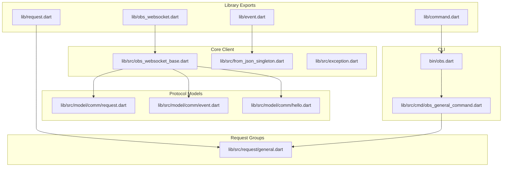
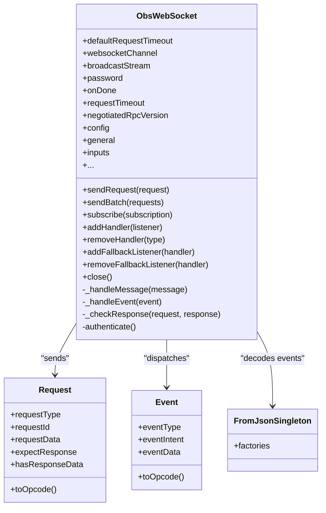
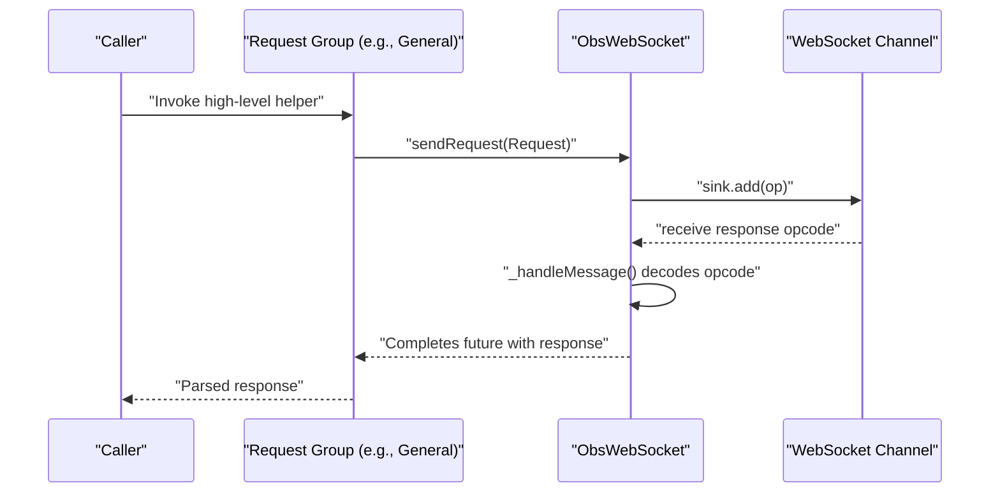
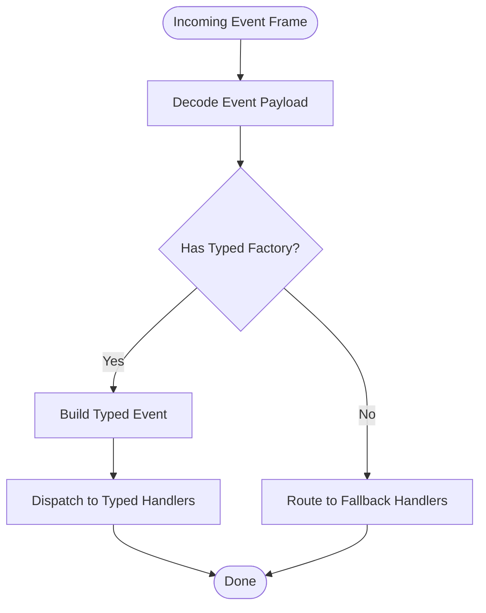
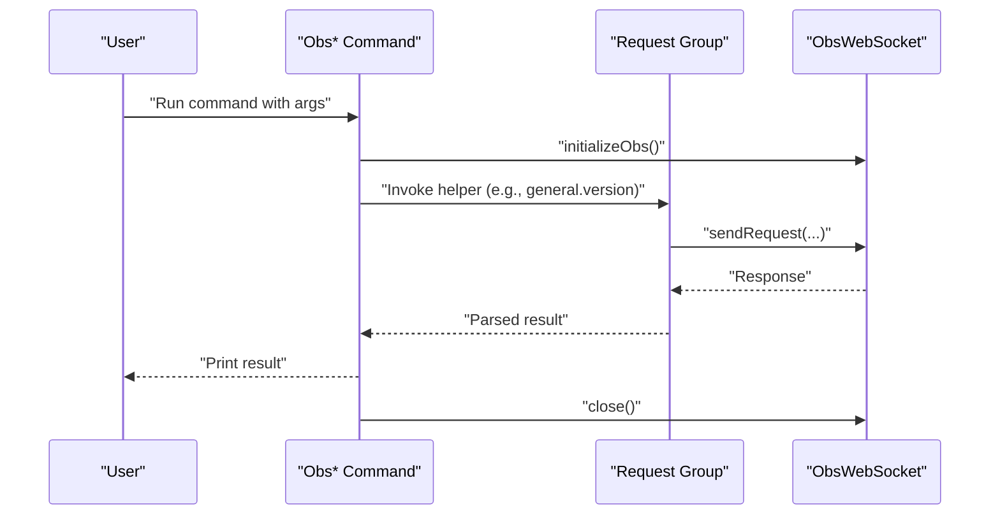
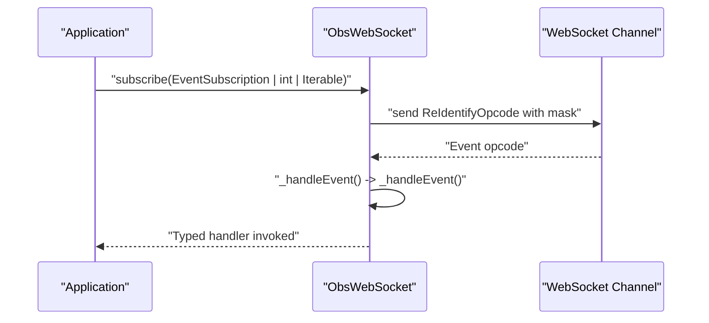
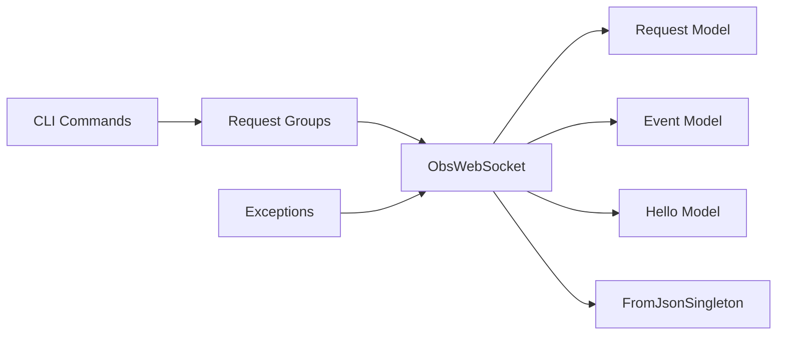

# Architecture Overview

<cite>
**Referenced Files in This Document**
- [obs_websocket_base.dart](file://lib/src/obs_websocket_base.dart)
- [from_json_singleton.dart](file://lib/src/from_json_singleton.dart)
- [exception.dart](file://lib/src/exception.dart)
- [obs_websocket.dart](file://lib/obs_websocket.dart)
- [request.dart](file://lib/request.dart)
- [command.dart](file://lib/command.dart)
- [event.dart](file://lib/event.dart)
- [obs.dart](file://bin/obs.dart)
- [general.dart](file://lib/src/request/general.dart)
- [obs_general_command.dart](file://lib/src/cmd/obs_general_command.dart)
- [request.dart](file://lib/src/model/comm/request.dart)
- [event.dart](file://lib/src/model/comm/event.dart)
- [hello.dart](file://lib/src/model/comm/hello.dart)
</cite>

## Table of Contents
1. [Introduction](#introduction)
2. [Project Structure](#project-structure)
3. [Core Components](#core-components)
4. [Architecture Overview](#architecture-overview)
5. [Detailed Component Analysis](#detailed-component-analysis)
6. [Dependency Analysis](#dependency-analysis)
7. [Performance Considerations](#performance-considerations)
8. [Troubleshooting Guide](#troubleshooting-guide)
9. [Conclusion](#conclusion)

## Introduction
This document presents the architecture overview of the OBS WebSocket client library. It explains the high-level system design, focusing on the WebSocket client architecture, request/response pattern, event-driven communication model, and CLI interface design. The document also documents the main architectural components—ObsWebSocket client, RequestManager, EventDispatcher—and protocol message handling. It describes the separation of concerns between high-level helper methods and low-level request interface, explains the event subscription system, and illustrates the integration with the WebSocket connection. Finally, it highlights the design patterns used throughout the codebase, including factory patterns for request creation, observer pattern for event handling, and protocol-oriented design for WebSocket communication.

## Project Structure
The project is organized into libraries and executables:
- Library exports and entry points define the public API surface.
- Core client logic resides in the ObsWebSocket base class.
- Request groups encapsulate high-level helper methods for different OBS subsystems.
- Commands implement the CLI interface.
- Protocol models define the wire-level message structures.
- Event models represent typed event payloads.
- An exception hierarchy provides structured error handling.



**Diagram sources**
- [obs_websocket.dart:1-69](file://lib/obs_websocket.dart#L1-L69)
- [request.dart:1-19](file://lib/request.dart#L1-L19)
- [command.dart:1-20](file://lib/command.dart#L1-L20)
- [event.dart:1-50](file://lib/event.dart#L1-L50)
- [obs_websocket_base.dart:1-513](file://lib/src/obs_websocket_base.dart#L1-L513)
- [from_json_singleton.dart:1-100](file://lib/src/from_json_singleton.dart#L1-L100)
- [exception.dart:1-77](file://lib/src/exception.dart#L1-L77)
- [request.dart:1-38](file://lib/src/model/comm/request.dart#L1-L38)
- [event.dart:1-31](file://lib/src/model/comm/event.dart#L1-L31)
- [hello.dart:1-30](file://lib/src/model/comm/hello.dart#L1-L30)
- [general.dart:1-143](file://lib/src/request/general.dart#L1-L143)
- [obs.dart:1-61](file://bin/obs.dart#L1-L61)
- [obs_general_command.dart:1-306](file://lib/src/cmd/obs_general_command.dart#L1-L306)

**Section sources**
- [obs_websocket.dart:1-69](file://lib/obs_websocket.dart#L1-L69)
- [request.dart:1-19](file://lib/request.dart#L1-L19)
- [command.dart:1-20](file://lib/command.dart#L1-L20)
- [event.dart:1-50](file://lib/event.dart#L1-L50)
- [obs_websocket_base.dart:1-513](file://lib/src/obs_websocket_base.dart#L1-L513)
- [from_json_singleton.dart:1-100](file://lib/src/from_json_singleton.dart#L1-L100)
- [exception.dart:1-77](file://lib/src/exception.dart#L1-L77)
- [request.dart:1-38](file://lib/src/model/comm/request.dart#L1-L38)
- [event.dart:1-31](file://lib/src/model/comm/event.dart#L1-L31)
- [hello.dart:1-30](file://lib/src/model/comm/hello.dart#L1-L30)
- [general.dart:1-143](file://lib/src/request/general.dart#L1-L143)
- [obs.dart:1-61](file://bin/obs.dart#L1-L61)
- [obs_general_command.dart:1-306](file://lib/src/cmd/obs_general_command.dart#L1-L306)

## Core Components
This section introduces the primary architectural components and their responsibilities:
- ObsWebSocket: The central client that manages the WebSocket connection, handles authentication, routes messages, and dispatches events.
- RequestManager: Implemented implicitly via ObsWebSocket’s request sending and response routing mechanisms.
- EventDispatcher: Implemented via ObsWebSocket’s event subscription and typed handler dispatching.
- Protocol Message Handling: Encapsulated by protocol models and opcode conversion helpers.

Key responsibilities:
- ObsWebSocket: Establishes connection, performs handshake and authentication, sends requests, receives responses, and emits events to typed and fallback handlers.
- Request groups (e.g., General): Provide high-level helper methods that encapsulate request construction and response parsing.
- CLI: Provides a command-line interface that delegates to request groups and prints results.

**Section sources**
- [obs_websocket_base.dart:21-128](file://lib/src/obs_websocket_base.dart#L21-L128)
- [general.dart:4-143](file://lib/src/request/general.dart#L4-L143)
- [obs_general_command.dart:8-306](file://lib/src/cmd/obs_general_command.dart#L8-L306)
- [obs.dart:6-61](file://bin/obs.dart#L6-L61)

## Architecture Overview
The system follows a protocol-oriented design with explicit message models and an event-driven architecture. The ObsWebSocket client encapsulates the WebSocket transport, authentication, and message routing. High-level request groups provide helper methods that construct protocol requests and parse responses. Events are decoded and dispatched to typed handlers or a fallback handler. The CLI composes commands that invoke request groups and present results.

```mermaid
graph TB
subgraph "Client Layer"
OW["ObsWebSocket<br/>Connection + Handshake + Routing"]
end
subgraph "Protocol Layer"
REQ["Request Model<br/>toOpcode()"]
EVT["Event Model<br/>toOpcode()"]
HELLO["Hello Model"]
end
subgraph "Request Groups"
RG["Request Group (e.g., General)<br/>High-level Helpers"]
end
subgraph "Event System"
FJS["FromJsonSingleton<br/>Event Factories"]
EH["Event Handlers<br/>Typed + Fallback"]
end
subgraph "CLI"
CLI["Obs* Commands<br/>Args Runner"]
end
OW --> REQ
OW --> EVT
OW --> HELLO
RG --> OW
OW --> FJS
FJS --> EH
CLI --> RG
```

**Diagram sources**
- [obs_websocket_base.dart:118-178](file://lib/src/obs_websocket_base.dart#L118-L178)
- [request.dart:10-38](file://lib/src/model/comm/request.dart#L10-L38)
- [event.dart:10-31](file://lib/src/model/comm/event.dart#L10-L31)
- [hello.dart:9-30](file://lib/src/model/comm/hello.dart#L9-L30)
- [general.dart:4-143](file://lib/src/request/general.dart#L4-L143)
- [from_json_singleton.dart:6-99](file://lib/src/from_json_singleton.dart#L6-L99)
- [obs_general_command.dart:8-306](file://lib/src/cmd/obs_general_command.dart#L8-L306)
- [obs.dart:6-61](file://bin/obs.dart#L6-L61)

## Detailed Component Analysis

### ObsWebSocket Client
ObsWebSocket is the core component managing the WebSocket lifecycle, authentication, request/response handling, and event dispatching. It maintains:
- WebSocket channel and broadcast stream for multiplexed listeners.
- Pending request tracking via requestId for correlating responses.
- Handshake state machine for Hello/Identified opcodes.
- Event subscription masks and typed handler buckets.
- Factory-based event decoding and fallback handling.



**Diagram sources**
- [obs_websocket_base.dart:21-128](file://lib/src/obs_websocket_base.dart#L21-L128)
- [request.dart:10-38](file://lib/src/model/comm/request.dart#L10-L38)
- [event.dart:10-31](file://lib/src/model/comm/event.dart#L10-L31)
- [from_json_singleton.dart:6-99](file://lib/src/from_json_singleton.dart#L6-L99)

**Section sources**
- [obs_websocket_base.dart:21-128](file://lib/src/obs_websocket_base.dart#L21-L128)
- [obs_websocket_base.dart:171-178](file://lib/src/obs_websocket_base.dart#L171-L178)
- [obs_websocket_base.dart:181-236](file://lib/src/obs_websocket_base.dart#L181-L236)
- [obs_websocket_base.dart:260-318](file://lib/src/obs_websocket_base.dart#L260-L318)
- [obs_websocket_base.dart:337-372](file://lib/src/obs_websocket_base.dart#L337-L372)
- [obs_websocket_base.dart:374-395](file://lib/src/obs_websocket_base.dart#L374-L395)
- [obs_websocket_base.dart:448-501](file://lib/src/obs_websocket_base.dart#L448-L501)
- [obs_websocket_base.dart:503-511](file://lib/src/obs_websocket_base.dart#L503-L511)

### Request/Response Pattern
The request/response pattern is protocol-oriented:
- Request model encapsulates requestType, requestId, requestData, and expectResponse.
- ObsWebSocket constructs opcodes from requests and tracks pending requests by requestId.
- Responses are decoded and correlated to pending futures; errors are propagated as structured exceptions.



**Diagram sources**
- [general.dart:21-43](file://lib/src/request/general.dart#L21-L43)
- [obs_websocket_base.dart:475-501](file://lib/src/obs_websocket_base.dart#L475-L501)
- [request.dart:19-37](file://lib/src/model/comm/request.dart#L19-L37)

**Section sources**
- [general.dart:21-43](file://lib/src/request/general.dart#L21-L43)
- [obs_websocket_base.dart:475-501](file://lib/src/obs_websocket_base.dart#L475-L501)
- [request.dart:19-37](file://lib/src/model/comm/request.dart#L19-L37)

### Event-Driven Communication Model
Events are decoded and dispatched to typed handlers. The FromJsonSingleton provides factories for each event type. If no typed handler exists, the event is routed to fallback handlers.



**Diagram sources**
- [obs_websocket_base.dart:374-395](file://lib/src/obs_websocket_base.dart#L374-L395)
- [from_json_singleton.dart:9-92](file://lib/src/from_json_singleton.dart#L9-L92)

**Section sources**
- [obs_websocket_base.dart:374-395](file://lib/src/obs_websocket_base.dart#L374-L395)
- [from_json_singleton.dart:9-92](file://lib/src/from_json_singleton.dart#L9-L92)

### CLI Interface Design
The CLI uses args command runner to expose commands grouped under functional categories (e.g., general). Each command initializes the ObsWebSocket, invokes a request group method, prints the result, and closes the connection.



**Diagram sources**
- [obs.dart:6-61](file://bin/obs.dart#L6-L61)
- [obs_general_command.dart:38-46](file://lib/src/cmd/obs_general_command.dart#L38-L46)
- [general.dart:14-25](file://lib/src/request/general.dart#L14-L25)

**Section sources**
- [obs.dart:6-61](file://bin/obs.dart#L6-L61)
- [obs_general_command.dart:38-46](file://lib/src/cmd/obs_general_command.dart#L38-L46)
- [general.dart:14-25](file://lib/src/request/general.dart#L14-L25)

### Separation of Concerns
- High-level helper methods: Provided by request groups (e.g., General) to simplify usage and encapsulate request/response parsing.
- Low-level request interface: Implemented by ObsWebSocket methods that handle opcodes, timeouts, and correlation of requests/responses.
- Event handling: ObsWebSocket manages subscriptions and dispatches to typed/fallback handlers; FromJsonSingleton centralizes event decoding.

**Section sources**
- [general.dart:4-143](file://lib/src/request/general.dart#L4-L143)
- [obs_websocket_base.dart:448-501](file://lib/src/obs_websocket_base.dart#L448-L501)
- [from_json_singleton.dart:6-99](file://lib/src/from_json_singleton.dart#L6-L99)

### Event Subscription System
ObsWebSocket supports subscribing to events via masks or enumerations. Subscriptions are reconfigured by sending a re-identify opcode with the desired mask. Incoming events are decoded and dispatched to registered handlers.



**Diagram sources**
- [obs_websocket_base.dart:337-372](file://lib/src/obs_websocket_base.dart#L337-L372)
- [obs_websocket_base.dart:374-395](file://lib/src/obs_websocket_base.dart#L374-L395)

**Section sources**
- [obs_websocket_base.dart:337-372](file://lib/src/obs_websocket_base.dart#L337-L372)
- [obs_websocket_base.dart:374-395](file://lib/src/obs_websocket_base.dart#L374-L395)

### Design Patterns
- Factory Pattern: Used for event decoding via FromJsonSingleton factories keyed by event type.
- Observer Pattern: Event handlers are registered and invoked when matching events arrive.
- Protocol-Oriented Design: Requests and events are modeled as structured data with explicit opcode conversions, enabling clear serialization/deserialization and routing.

**Section sources**
- [from_json_singleton.dart:6-99](file://lib/src/from_json_singleton.dart#L6-L99)
- [obs_websocket_base.dart:410-446](file://lib/src/obs_websocket_base.dart#L410-L446)
- [request.dart:27-37](file://lib/src/model/comm/request.dart#L27-L37)
- [event.dart:24-26](file://lib/src/model/comm/event.dart#L24-L26)

## Dependency Analysis
The following diagram shows key dependencies among components:



**Diagram sources**
- [obs_websocket_base.dart:1-513](file://lib/src/obs_websocket_base.dart#L1-L513)
- [request.dart:1-38](file://lib/src/model/comm/request.dart#L1-L38)
- [event.dart:1-31](file://lib/src/model/comm/event.dart#L1-L31)
- [hello.dart:1-30](file://lib/src/model/comm/hello.dart#L1-L30)
- [from_json_singleton.dart:1-100](file://lib/src/from_json_singleton.dart#L1-L100)
- [general.dart:1-143](file://lib/src/request/general.dart#L1-L143)
- [obs_general_command.dart:1-306](file://lib/src/cmd/obs_general_command.dart#L1-L306)
- [exception.dart:1-77](file://lib/src/exception.dart#L1-L77)

**Section sources**
- [obs_websocket_base.dart:1-513](file://lib/src/obs_websocket_base.dart#L1-L513)
- [request.dart:1-38](file://lib/src/model/comm/request.dart#L1-L38)
- [event.dart:1-31](file://lib/src/model/comm/event.dart#L1-L31)
- [hello.dart:1-30](file://lib/src/model/comm/hello.dart#L1-L30)
- [from_json_singleton.dart:1-100](file://lib/src/from_json_singleton.dart#L1-L100)
- [general.dart:1-143](file://lib/src/request/general.dart#L1-L143)
- [obs_general_command.dart:1-306](file://lib/src/cmd/obs_general_command.dart#L1-L306)
- [exception.dart:1-77](file://lib/src/exception.dart#L1-L77)

## Performance Considerations
- Timeout handling: Requests and handshake opcodes enforce timeouts to prevent indefinite blocking.
- Pending request tracking: Uses requestId-based correlation to avoid race conditions and reduce overhead.
- Logging: Structured logging aids diagnostics without impacting core performance.
- Batch requests: Request batching reduces round-trips for related operations.

[No sources needed since this section provides general guidance]

## Troubleshooting Guide
Common exceptions and their causes:
- ObsAuthException: Authentication or handshake failures.
- ObsRequestException: Non-success status codes from OBS or malformed responses.
- ObsTimeoutException: Timeouts while waiting for responses or handshake opcodes.
- ObsProtocolException: Malformed or undecodable protocol data.

Resolution steps:
- Verify connection URI and credentials.
- Confirm event subscription masks if expecting events.
- Check request/response schemas and optional fields.
- Adjust requestTimeout for long-running operations.

**Section sources**
- [exception.dart:18-77](file://lib/src/exception.dart#L18-L77)
- [obs_websocket_base.dart:238-258](file://lib/src/obs_websocket_base.dart#L238-L258)
- [obs_websocket_base.dart:299-307](file://lib/src/obs_websocket_base.dart#L299-L307)
- [obs_websocket_base.dart:466-472](file://lib/src/obs_websocket_base.dart#L466-L472)

## Conclusion
The architecture combines a robust WebSocket client with protocol-oriented models, a clean separation between high-level helpers and low-level request interface, and a flexible event-driven system. The CLI demonstrates practical usage by composing commands that leverage request groups. The design emphasizes clarity, extensibility, and structured error handling, enabling reliable integration with OBS Studio via the WebSocket protocol.