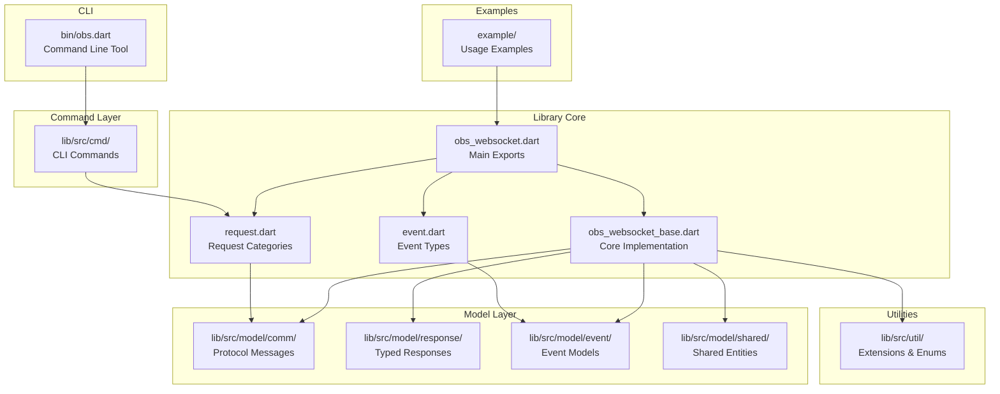
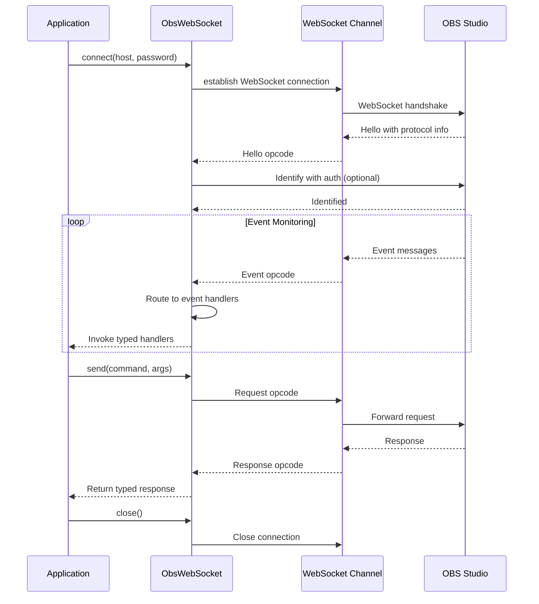
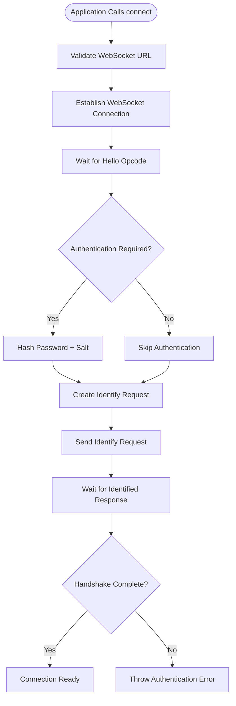
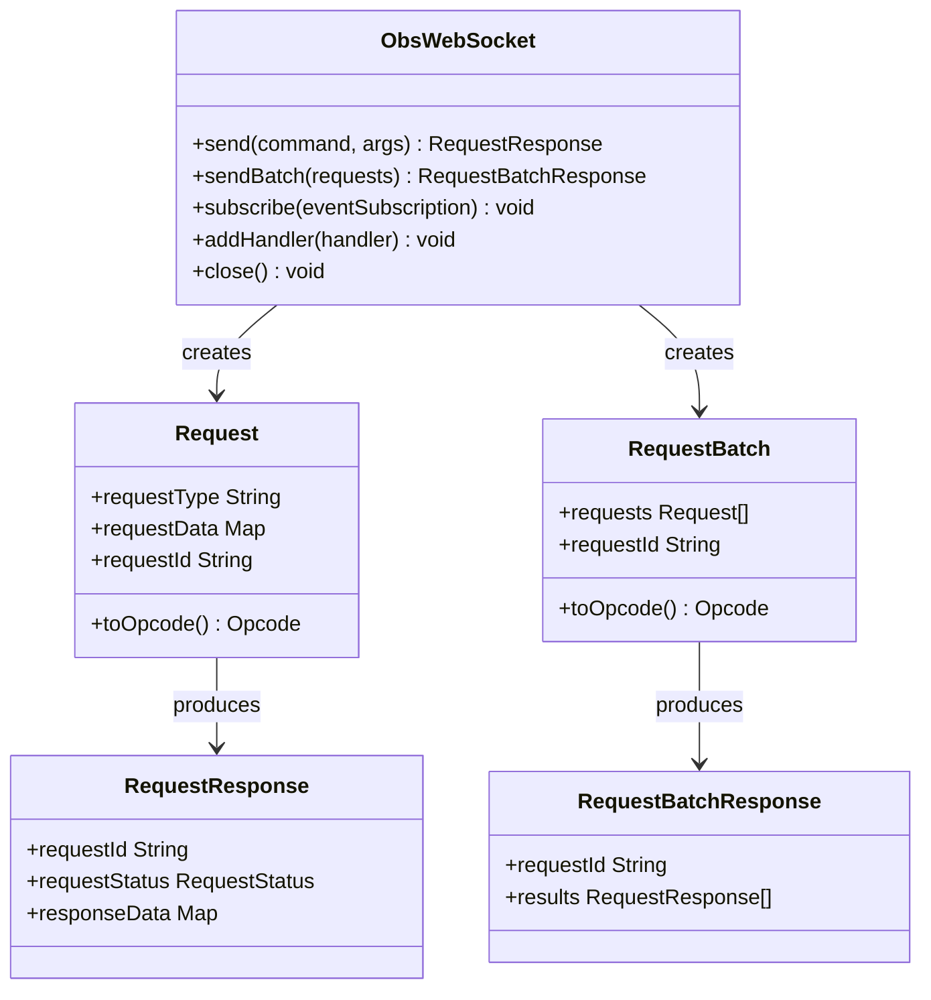
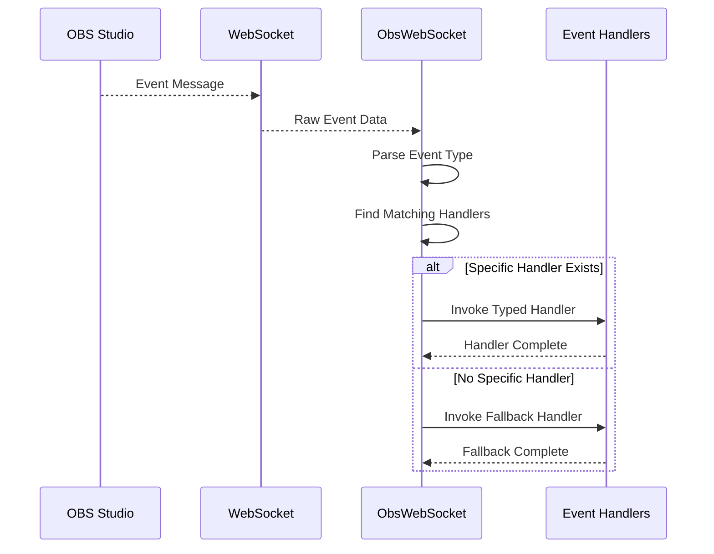
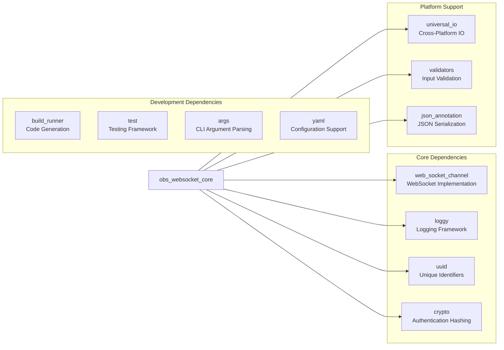

# Introduction and Purpose

<cite>
**Referenced Files in This Document**
- [README.md](file://README.md)
- [pubspec.yaml](file://pubspec.yaml)
- [obs_websocket.dart](file://lib/obs_websocket.dart)
- [obs_websocket_base.dart](file://lib/src/obs_websocket_base.dart)
- [request.dart](file://lib/request.dart)
- [event.dart](file://lib/event.dart)
- [obs.dart](file://bin/obs.dart)
- [general.dart](file://example/general.dart)
- [event.dart](file://example/event.dart)
- [show_scene_item.dart](file://example/show_scene_item.dart)
- [CLAUDE.md](file://CLAUDE.md)
- [CHANGELOG.md](file://CHANGELOG.md)
</cite>

## Table of Contents
1. [Introduction](#introduction)
2. [Project Structure](#project-structure)
3. [Core Components](#core-components)
4. [Architecture Overview](#architecture-overview)
5. [Detailed Component Analysis](#detailed-component-analysis)
6. [Dependency Analysis](#dependency-analysis)
7. [Performance Considerations](#performance-considerations)
8. [Troubleshooting Guide](#troubleshooting-guide)
9. [Conclusion](#conclusion)

## Introduction

obs-websocket-dart is a comprehensive Dart library that provides complete control over OBS (Open Broadcaster Software) through the obs-websocket 5.x protocol. As a WebSocket-based solution, it enables developers to remotely control OBS instances, monitor real-time events, and automate complex broadcasting workflows directly from Dart and Flutter applications.

### Mission Statement

The library's mission is to bridge the gap between modern Dart/Flutter development ecosystems and professional broadcasting tools by providing a robust, type-safe, and event-driven interface to OBS Studio. It transforms the obs-websocket protocol from a JSON-RPC over WebSocket into an intuitive, developer-friendly API that supports both high-level helper methods and low-level command execution.

### Target Audience

This library serves several key developer communities:
- **Dart/Flutter Developers** building broadcasting and streaming applications
- **Automation Engineers** creating sophisticated stream workflows
- **Content Creators** developing custom broadcasting tools
- **Enterprise Streaming Solutions** requiring programmatic OBS control

### Primary Use Cases

The library enables developers to accomplish several critical broadcasting automation tasks:

- **Remote OBS Control**: Programmatically manage scenes, sources, inputs, and outputs
- **Event Monitoring**: React to real-time OBS events like scene changes, input state modifications, and recording status updates
- **Stream Automation**: Automate complex streaming workflows including transitions, overlays, and dynamic content
- **Broadcasting Tools**: Build custom applications for stream management, content scheduling, and interactive features
- **OBS Control Applications**: Create desktop or web applications that interface with OBS for professional broadcasting scenarios

### Architectural Significance

The WebSocket-based architecture provides several key advantages:

- **Real-time Communication**: Bidirectional messaging enables immediate response to OBS state changes
- **Event-Driven Design**: Typed event handlers allow applications to react instantly to OBS events
- **Protocol Compliance**: Direct implementation of obs-websocket 5.x protocol ensures compatibility with modern OBS installations
- **Cross-Platform Support**: Built-in support for both Dart:io and Dart:html environments enables deployment across various platforms

### Why This Library Was Created

The library addresses a critical gap in the Dart ecosystem for professional broadcasting automation. While OBS provides extensive scripting capabilities through external tools, there was no native Dart solution for programmatic OBS control. This library fills that void by providing:

- A complete implementation of the obs-websocket 5.x protocol
- Type-safe Dart interfaces that mirror OBS functionality
- Comprehensive event handling for real-time broadcasting applications
- Both high-level helper methods and low-level command access for maximum flexibility
- A command-line interface for testing and automation workflows

## Project Structure

The project follows a well-organized structure that separates concerns across different functional areas:

**Diagram sources**
- [obs_websocket.dart:1-69](file://lib/obs_websocket.dart#L1-L69)
- [obs_websocket_base.dart:21-106](file://lib/src/obs_websocket_base.dart#L21-L106)
- [request.dart:1-19](file://lib/request.dart#L1-L19)
- [event.dart:1-50](file://lib/event.dart#L1-L50)

**Section sources**
- [obs_websocket.dart:1-69](file://lib/obs_websocket.dart#L1-L69)
- [CLAUDE.md:13-32](file://CLAUDE.md#L13-L32)

## Core Components

The library's core components work together to provide a comprehensive OBS control solution:

### ObsWebSocket Core Class

The `ObsWebSocket` class serves as the central hub for all OBS communication, implementing the complete obs-websocket 5.x protocol with WebSocket-based messaging. It manages the connection lifecycle, handles authentication, processes requests and responses, and routes events to appropriate handlers.

Key responsibilities include:
- WebSocket connection management and authentication
- Request/response cycle handling with timeout support
- Event subscription and routing
- Batch request processing for improved performance
- Error handling and recovery mechanisms

### Request Categories

The library organizes OBS functionality into logical request categories, each providing both high-level helper methods and direct command access:

- **General Requests**: Version information, statistics, custom events
- **Config Requests**: Scene collections, profiles, video settings
- **Sources Requests**: Source management and screenshots
- **Scenes Requests**: Scene manipulation and studio mode
- **Inputs Requests**: Audio/video input control
- **Outputs Requests**: Stream, record, and replay buffer control
- **Scene Items Requests**: Individual element management
- **Transitions Requests**: Scene transition control
- **Filters Requests**: Source filtering
- **Media Inputs Requests**: Media playback control
- **UI Requests**: Interface manipulation

### Event System

The event-driven architecture provides comprehensive coverage of OBS-generated events, enabling real-time application responses to broadcasting state changes. The system supports both typed event handlers and fallback mechanisms for unsupported events.

**Section sources**
- [obs_websocket_base.dart:21-106](file://lib/src/obs_websocket_base.dart#L21-L106)
- [obs_websocket_base.dart:448-514](file://lib/src/obs_websocket_base.dart#L448-L514)
- [request.dart:6-18](file://lib/request.dart#L6-L18)
- [event.dart:3-49](file://lib/event.dart#L3-L49)

## Architecture Overview

The library implements a layered architecture that separates protocol handling from application logic while maintaining flexibility for different use cases:

**Diagram sources**
- [obs_websocket_base.dart:130-169](file://lib/src/obs_websocket_base.dart#L130-L169)
- [obs_websocket_base.dart:180-236](file://lib/src/obs_websocket_base.dart#L180-L236)
- [obs_websocket_base.dart:448-503](file://lib/src/obs_websocket_base.dart#L448-L503)

The architecture emphasizes:
- **Protocol Abstraction**: Clean separation between WebSocket protocol and application logic
- **Type Safety**: Strong typing for all requests, responses, and events
- **Async Operations**: Non-blocking operations suitable for GUI and server applications
- **Error Handling**: Comprehensive error propagation and recovery mechanisms

**Section sources**
- [obs_websocket_base.dart:130-169](file://lib/src/obs_websocket_base.dart#L130-L169)
- [obs_websocket_base.dart:180-236](file://lib/src/obs_websocket_base.dart#L180-L236)
- [obs_websocket_base.dart:448-503](file://lib/src/obs_websocket_base.dart#L448-L503)

## Detailed Component Analysis

### Connection and Authentication Flow

The connection process implements the obs-websocket handshake protocol with robust error handling and timeout management:

**Diagram sources**
- [obs_websocket_base.dart:260-318](file://lib/src/obs_websocket_base.dart#L260-L318)

### Request/Response Processing

The library implements a sophisticated request/response handling system with support for both individual requests and batch operations:

**Diagram sources**
- [obs_websocket_base.dart:448-475](file://lib/src/obs_websocket_base.dart#L448-L475)
- [obs_websocket_base.dart:477-503](file://lib/src/obs_websocket_base.dart#L477-L503)

### Event Handling System

The event-driven architecture provides comprehensive coverage of OBS-generated events with flexible handler registration:

**Diagram sources**
- [obs_websocket_base.dart:374-395](file://lib/src/obs_websocket_base.dart#L374-L395)

**Section sources**
- [obs_websocket_base.dart:260-318](file://lib/src/obs_websocket_base.dart#L260-L318)
- [obs_websocket_base.dart:448-503](file://lib/src/obs_websocket_base.dart#L448-L503)
- [obs_websocket_base.dart:374-395](file://lib/src/obs_websocket_base.dart#L374-L395)

## Dependency Analysis

The library maintains a focused dependency set that balances functionality with minimal overhead:

**Diagram sources**
- [pubspec.yaml:13-22](file://pubspec.yaml#L13-L22)
- [pubspec.yaml:24-34](file://pubspec.yaml#L24-L34)

The dependency strategy prioritizes:
- **Minimal Runtime Dependencies**: Only essential packages for WebSocket communication and serialization
- **Cross-Platform Compatibility**: Universal IO support for both server and web deployments
- **Development Flexibility**: Comprehensive tooling for testing, code generation, and CLI functionality

**Section sources**
- [pubspec.yaml:13-38](file://pubspec.yaml#L13-L38)

## Performance Considerations

The library implements several performance optimizations for production broadcasting scenarios:

- **Connection Pooling**: Single persistent WebSocket connection reduces overhead
- **Batch Operations**: Support for request batching improves throughput for bulk operations
- **Event Filtering**: Selective event subscription reduces bandwidth usage
- **Timeout Management**: Configurable timeouts prevent resource leaks
- **Memory Efficiency**: Proper cleanup of handlers and subscriptions prevents memory leaks

## Troubleshooting Guide

Common issues and their solutions:

### Connection Problems
- **Authentication Failure**: Verify OBS websocket password matches configuration
- **Network Issues**: Ensure OBS instance is reachable on specified host/port
- **Protocol Mismatch**: Confirm OBS has obs-websocket plugin version compatible with library

### Event Handling Issues
- **Missing Events**: Verify event subscription masks include desired event types
- **Handler Registration**: Ensure handlers are registered before connecting to OBS
- **Event Type Errors**: Check for unsupported events in fallback handler

### Performance Issues
- **Request Timeouts**: Adjust requestTimeout for slow OBS instances
- **Memory Leaks**: Properly remove event handlers and close connections
- **Batch Processing**: Use batch operations for multiple simultaneous requests

**Section sources**
- [obs_websocket_base.dart:238-258](file://lib/src/obs_websocket_base.dart#L238-L258)
- [obs_websocket_base.dart:397-408](file://lib/src/obs_websocket_base.dart#L397-L408)

## Conclusion

obs-websocket-dart represents a mature, production-ready solution for integrating OBS Studio into Dart and Flutter applications. Its comprehensive implementation of the obs-websocket 5.x protocol, combined with a thoughtful architectural design, makes it an ideal choice for developers building broadcasting automation tools, streaming applications, and professional broadcasting solutions.

The library's strengths lie in its protocol compliance, type safety, event-driven architecture, and cross-platform support. By providing both high-level convenience methods and direct protocol access, it accommodates developers with varying needs and expertise levels while maintaining the flexibility required for complex broadcasting automation scenarios.

As the streaming ecosystem continues to evolve, this library positions itself as a crucial bridge between modern Dart development practices and professional broadcasting infrastructure, enabling developers to create innovative solutions for the growing world of live streaming and content creation.