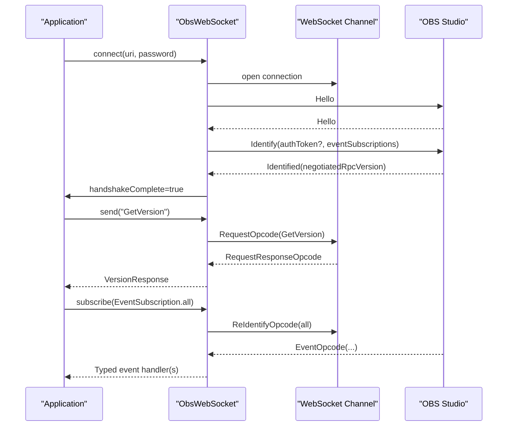
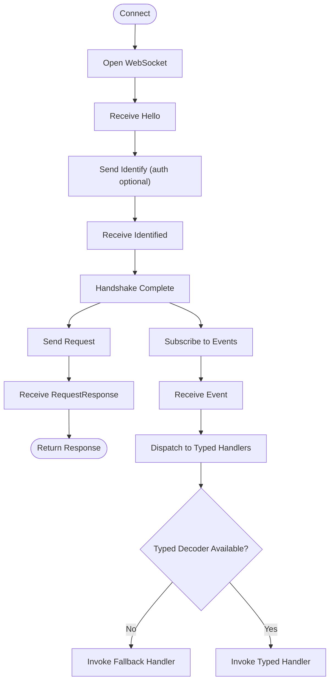
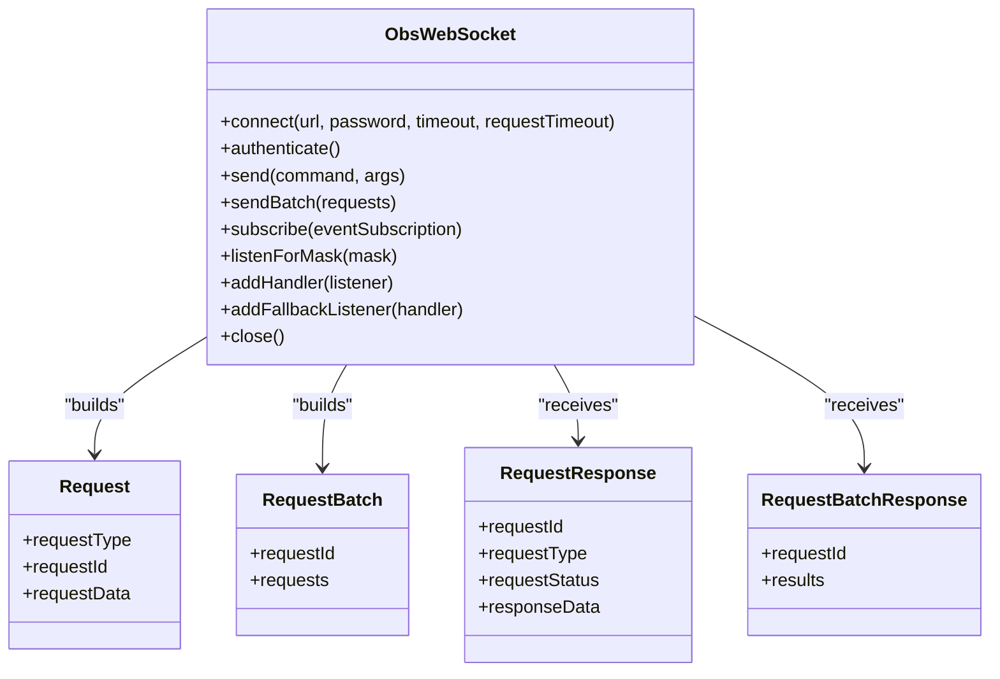
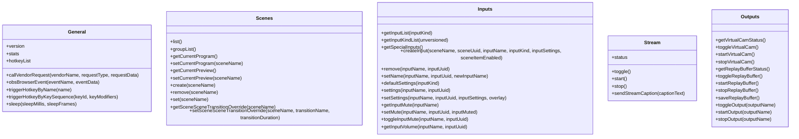
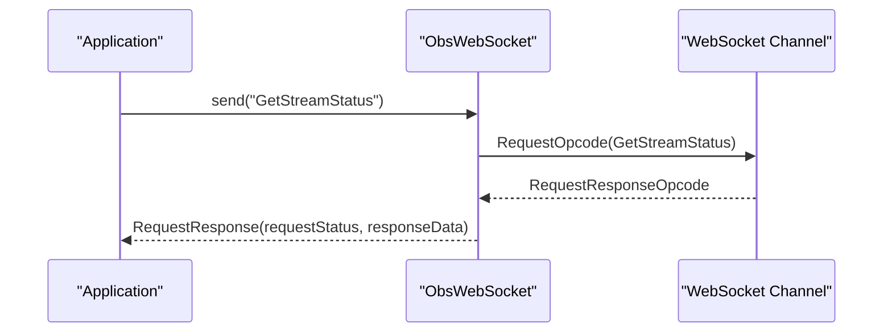
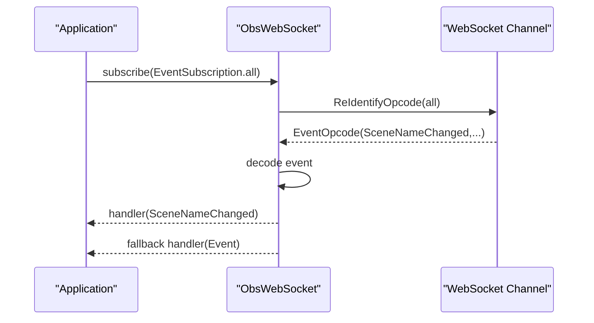
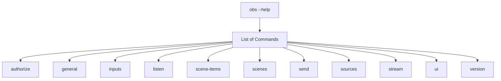
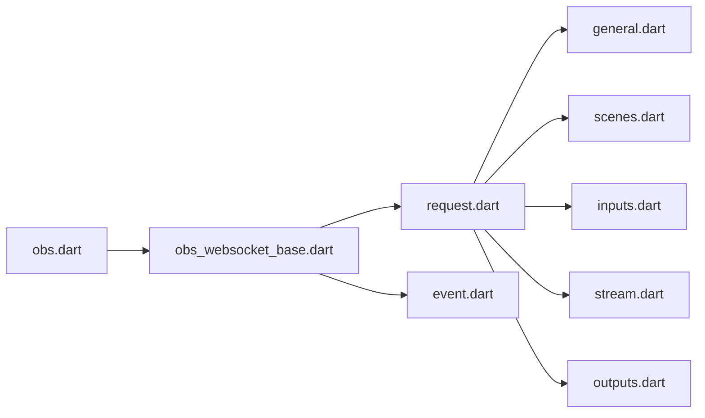

# Key Features and Capabilities

<cite>
**Referenced Files in This Document**
- [README.md](file://README.md)
- [obs_websocket.dart](file://lib/obs_websocket.dart)
- [obs_websocket_base.dart](file://lib/src/obs_websocket_base.dart)
- [request.dart](file://lib/request.dart)
- [event.dart](file://lib/event.dart)
- [general.dart](file://lib/src/request/general.dart)
- [scenes.dart](file://lib/src/request/scenes.dart)
- [inputs.dart](file://lib/src/request/inputs.dart)
- [stream.dart](file://lib/src/request/stream.dart)
- [outputs.dart](file://lib/src/request/outputs.dart)
- [obs.dart](file://bin/obs.dart)
- [general.dart (example)](file://example/general.dart)
- [batch.dart (example)](file://example/batch.dart)
- [event.dart (example)](file://example/event.dart)
</cite>

## Table of Contents
1. [Introduction](#introduction)
2. [Project Structure](#project-structure)
3. [Core Components](#core-components)
4. [Architecture Overview](#architecture-overview)
5. [Detailed Component Analysis](#detailed-component-analysis)
6. [Dependency Analysis](#dependency-analysis)
7. [Performance Considerations](#performance-considerations)
8. [Troubleshooting Guide](#troubleshooting-guide)
9. [Conclusion](#conclusion)

## Introduction
This document presents the key features and capabilities of obs-websocket-dart, focusing on how the package enables robust, production-ready control of OBS Studio over WebSocket. It covers the complete obs-websocket 5.x protocol implementation, high-level helper methods for common operations, and a low-level request interface for advanced use cases. It also explains the event subscription and handling system, the CLI interface for terminal control, and the architectural improvements and breaking changes from v4.9.1 to v5.x.

## Project Structure
The project is organized around a core WebSocket client, a typed request subsystem grouped by functional domains, a comprehensive event model, and a CLI for terminal control. The structure supports both high-level helpers and low-level raw requests, enabling flexible integration across simple scripts and complex automation systems.

```mermaid
graph TB
subgraph "Library"
A["obs_websocket.dart<br/>Exports core models and entry points"]
B["request.dart<br/>Exports request modules"]
C["event.dart<br/>Exports event models"]
D["obs_websocket_base.dart<br/>Core client, handshake, batching, events"]
end
subgraph "Request Modules"
G["general.dart"]
S["scenes.dart"]
I["inputs.dart"]
ST["stream.dart"]
O["outputs.dart"]
end
subgraph "CLI"
CLI["obs.dart"]
end
A --> D
B --> G
B --> S
B --> I
B --> ST
B --> O
D --> G
D --> S
D --> I
D --> ST
D --> O
CLI --> D
```

**Diagram sources**
- [obs_websocket.dart:1-69](file://lib/obs_websocket.dart#L1-L69)
- [request.dart:1-19](file://lib/request.dart#L1-L19)
- [event.dart:1-50](file://lib/event.dart#L1-L50)
- [obs_websocket_base.dart:118-169](file://lib/src/obs_websocket_base.dart#L118-L169)
- [general.dart:1-143](file://lib/src/request/general.dart#L1-L143)
- [scenes.dart:1-232](file://lib/src/request/scenes.dart#L1-L232)
- [inputs.dart:1-389](file://lib/src/request/inputs.dart#L1-L389)
- [stream.dart:1-94](file://lib/src/request/stream.dart#L1-L94)
- [outputs.dart:1-158](file://lib/src/request/outputs.dart#L1-L158)
- [obs.dart:1-57](file://bin/obs.dart#L1-L57)

**Section sources**
- [README.md:106-263](file://README.md#L106-L263)
- [obs_websocket.dart:1-69](file://lib/obs_websocket.dart#L1-L69)
- [request.dart:1-19](file://lib/request.dart#L1-L19)
- [event.dart:1-50](file://lib/event.dart#L1-L50)
- [obs_websocket_base.dart:118-169](file://lib/src/obs_websocket_base.dart#L118-L169)

## Core Components
- WebSocket-based client with typed request/response handling and event routing
- Complete obs-websocket 5.x protocol implementation including handshake, authentication, request/response, request batching, and event subscriptions
- High-level helper methods grouped by functional domains (General, Config, Sources, Scenes, Inputs, Transitions, Filters, Scene Items, Outputs, Stream, Record, Media Inputs, Ui)
- Low-level request interface for advanced use cases and unsupported requests
- Event subscription and handling system with typed handlers and fallback handling
- CLI for terminal control and scripting

**Section sources**
- [README.md:37-40](file://README.md#L37-L40)
- [README.md:106-263](file://README.md#L106-L263)
- [obs_websocket_base.dart:21-105](file://lib/src/obs_websocket_base.dart#L21-L105)
- [obs_websocket_base.dart:448-513](file://lib/src/obs_websocket_base.dart#L448-L513)

## Architecture Overview
The architecture centers on a single client that manages the WebSocket connection, negotiates the obs-websocket handshake, and routes both requests and events. Requests are either sent individually or in batches. Events are decoded into typed models and dispatched to registered handlers, with a fallback mechanism for unsupported events.



**Diagram sources**
- [obs_websocket_base.dart:130-178](file://lib/src/obs_websocket_base.dart#L130-L178)
- [obs_websocket_base.dart:260-318](file://lib/src/obs_websocket_base.dart#L260-L318)
- [obs_websocket_base.dart:448-503](file://lib/src/obs_websocket_base.dart#L448-L503)
- [obs_websocket_base.dart:337-372](file://lib/src/obs_websocket_base.dart#L337-L372)

## Detailed Component Analysis

### WebSocket-based OBS Control
- Connection lifecycle: automatic connection establishment, logging configuration, and graceful close
- Handshake and authentication: negotiation of RPC version, optional password-based authentication, and event subscription mask updates
- Request/response handling: individual requests with timeouts and error propagation, plus batch requests for improved throughput
- Event routing: decoding of events into typed models and dispatch to registered handlers, with fallback handling for unknown events



**Diagram sources**
- [obs_websocket_base.dart:130-178](file://lib/src/obs_websocket_base.dart#L130-L178)
- [obs_websocket_base.dart:180-236](file://lib/src/obs_websocket_base.dart#L180-L236)
- [obs_websocket_base.dart:337-395](file://lib/src/obs_websocket_base.dart#L337-L395)

**Section sources**
- [obs_websocket_base.dart:130-178](file://lib/src/obs_websocket_base.dart#L130-L178)
- [obs_websocket_base.dart:260-318](file://lib/src/obs_websocket_base.dart#L260-L318)
- [obs_websocket_base.dart:337-395](file://lib/src/obs_websocket_base.dart#L337-L395)

### Complete obs-websocket 5.x Protocol Implementation
- Handshake and authentication: password hashing, challenge-response, and negotiated RPC version exposure
- Request/response: typed request/response models, request status checking, and error propagation
- Request batching: batch submission with per-batch response handling and per-request status inspection
- Event subscriptions: bitmask-based subscription masks and re-identification updates



**Diagram sources**
- [obs_websocket_base.dart:448-513](file://lib/src/obs_websocket_base.dart#L448-L513)
- [obs_websocket_base.dart:453-475](file://lib/src/obs_websocket_base.dart#L453-L475)

**Section sources**
- [obs_websocket_base.dart:107-112](file://lib/src/obs_websocket_base.dart#L107-L112)
- [obs_websocket_base.dart:260-318](file://lib/src/obs_websocket_base.dart#L260-L318)
- [obs_websocket_base.dart:448-513](file://lib/src/obs_websocket_base.dart#L448-L513)
- [obs_websocket_base.dart:453-475](file://lib/src/obs_websocket_base.dart#L453-L475)

### High-level Helper Methods for Common Operations
The package provides domain-specific request classes with helper methods that wrap low-level requests. These include:
- General: version, stats, hotkeys, vendor requests, and sleep
- Scenes: scene lists, groups, current program/preview, creation/removal, and transition overrides
- Inputs: input lists, kinds, special inputs, creation/removal, renaming, default/settings, mute, and volume
- Stream: status, toggle, start/stop, and captions
- Outputs: virtual cam, replay buffer, and generic output toggles/start/stop



**Diagram sources**
- [general.dart:1-143](file://lib/src/request/general.dart#L1-L143)
- [scenes.dart:1-232](file://lib/src/request/scenes.dart#L1-L232)
- [inputs.dart:1-389](file://lib/src/request/inputs.dart#L1-L389)
- [stream.dart:1-94](file://lib/src/request/stream.dart#L1-L94)
- [outputs.dart:1-158](file://lib/src/request/outputs.dart#L1-L158)

**Section sources**
- [README.md:106-263](file://README.md#L106-L263)
- [general.dart:1-143](file://lib/src/request/general.dart#L1-L143)
- [scenes.dart:1-232](file://lib/src/request/scenes.dart#L1-L232)
- [inputs.dart:1-389](file://lib/src/request/inputs.dart#L1-L389)
- [stream.dart:1-94](file://lib/src/request/stream.dart#L1-L94)
- [outputs.dart:1-158](file://lib/src/request/outputs.dart#L1-L158)

### Low-level Request Interface for Advanced Use Cases
For unsupported or experimental requests, the low-level interface exposes a simple send method that accepts a request name and optional arguments, returning a structured response with request status and data. This enables direct access to the full protocol surface while preserving typed response handling for supported operations.



**Diagram sources**
- [obs_websocket_base.dart:448-503](file://lib/src/obs_websocket_base.dart#L448-L503)

**Section sources**
- [README.md:288-332](file://README.md#L288-L332)
- [obs_websocket_base.dart:448-503](file://lib/src/obs_websocket_base.dart#L448-L503)

### Event Subscription and Handling System
The event system supports subscribing to specific event categories via bitmask masks, with typed handlers for supported events and a fallback handler for unknown events. Examples demonstrate listening to all events and reacting to scene and input changes.



**Diagram sources**
- [obs_websocket_base.dart:337-372](file://lib/src/obs_websocket_base.dart#L337-L372)
- [obs_websocket_base.dart:374-395](file://lib/src/obs_websocket_base.dart#L374-L395)
- [obs_websocket_base.dart:431-446](file://lib/src/obs_websocket_base.dart#L431-L446)

**Section sources**
- [README.md:334-481](file://README.md#L334-L481)
- [obs_websocket_base.dart:337-395](file://lib/src/obs_websocket_base.dart#L337-L395)
- [obs_websocket_base.dart:431-446](file://lib/src/obs_websocket_base.dart#L431-L446)
- [event.dart:1-50](file://lib/event.dart#L1-L50)

### CLI Interface for Terminal Control
The CLI provides commands for authorization, general commands, inputs, listening to events, scene items, scenes, sending raw requests, sources, streams, UI manipulation, and version reporting. It supports URI, timeout, log level, and password options.



**Diagram sources**
- [obs.dart:6-56](file://bin/obs.dart#L6-L56)

**Section sources**
- [README.md:491-536](file://README.md#L491-L536)
- [obs.dart:6-56](file://bin/obs.dart#L6-L56)

### Support for All Major OBS Functionality Categories
The package covers all major OBS functionality categories exposed by the obs-websocket 5.x protocol, including:
- General: version, stats, hotkeys, vendor requests, and sleep
- Config: scene collections, profiles, video settings, stream service settings, and record directory
- Sources: active state and screenshots
- Scenes: scene and group lists, current program/preview, creation/removal, and transition overrides
- Inputs: list, kinds, special inputs, creation/removal, renaming, default/settings, mute, and volume
- Transitions: current transition and duration
- Filters: filter list, creation/removal, renaming, indexing, settings, and enable state
- Scene Items: list, enable/lock state, index, and transform
- Outputs: virtual cam, replay buffer, and generic outputs
- Stream: status, toggle, start/stop, and captions
- Record: status, toggle, start/stop, pause/resume
- Media Inputs: status, cursor, and actions
- Ui: studio mode, monitor list, and projectors

**Section sources**
- [README.md:106-263](file://README.md#L106-L263)

### Breaking Changes from v4.9.1 to v5.x and Architectural Improvements
- Everything changed: the v5.x protocol is substantially different from v4.9.1 and requires rewriting code built for the older protocol
- Architectural improvements include a unified request/response model, explicit batching support, stronger typing for events and responses, and a clearer separation between high-level helpers and low-level requests

**Section sources**
- [README.md:37-40](file://README.md#L37-L40)

### Feature Highlights
- Batch request processing: submit multiple requests atomically and inspect per-request statuses
- Authentication handling: automatic challenge-response authentication when a password is provided
- Vendor request support: CallVendorRequest and a dedicated helper for the obs-browser plugin
- Event-driven automation: subscribe to specific event categories and react to real-time changes
- Flexible request model: combine high-level helpers with low-level requests for maximum coverage

Examples of what users can accomplish:
- Automate streaming workflows: check stream status, toggle streaming, send captions, and manage replay buffer
- Manage scenes and inputs: switch scenes, create/remove inputs, adjust mute/volume, and control transitions
- Monitor and react to changes: subscribe to scene and input events to drive UI overlays or external integrations
- Batch operations: reduce latency and improve reliability by grouping related requests
- Vendor integrations: emit custom events to plugins like obs-browser for advanced inter-plugin communication

**Section sources**
- [README.md:95-104](file://README.md#L95-L104)
- [README.md:266-286](file://README.md#L266-L286)
- [batch.dart (example):17-28](file://example/batch.dart#L17-L28)
- [general.dart (example):72-86](file://example/general.dart#L72-L86)
- [event.dart (example):19-42](file://example/event.dart#L19-L42)

## Dependency Analysis
The core client depends on the request modules and event models, while the CLI depends on the client and command implementations. The request modules encapsulate protocol-specific logic, and the event module provides typed event models.



**Diagram sources**
- [obs_websocket_base.dart:56-105](file://lib/src/obs_websocket_base.dart#L56-L105)
- [request.dart:6-18](file://lib/request.dart#L6-L18)
- [event.dart:3-49](file://lib/event.dart#L3-L49)
- [obs.dart:2-47](file://bin/obs.dart#L2-L47)

**Section sources**
- [obs_websocket_base.dart:56-105](file://lib/src/obs_websocket_base.dart#L56-L105)
- [request.dart:6-18](file://lib/request.dart#L6-L18)
- [event.dart:3-49](file://lib/event.dart#L3-L49)
- [obs.dart:2-47](file://bin/obs.dart#L2-L47)

## Performance Considerations
- Use batch requests for operations that can be grouped to minimize round-trips and improve throughput
- Configure request timeouts appropriately to avoid hanging operations under heavy load
- Subscribe only to necessary event categories to reduce bandwidth and processing overhead
- Close connections properly to prevent resource leaks and maintain OBS performance

## Troubleshooting Guide
- Authentication failures: ensure the password matches OBS settings and that the client attempts authentication during handshake
- Timeouts: increase requestTimeout for operations that take longer than the default
- Unknown events: use fallback event handlers to capture and log unknown events for future support
- Connection issues: verify the WebSocket URI scheme (ws/wss), port, and network accessibility

**Section sources**
- [obs_websocket_base.dart:260-318](file://lib/src/obs_websocket_base.dart#L260-L318)
- [obs_websocket_base.dart:477-503](file://lib/src/obs_websocket_base.dart#L477-L503)
- [obs_websocket_base.dart:431-446](file://lib/src/obs_websocket_base.dart#L431-L446)

## Conclusion
obs-websocket-dart delivers a comprehensive, production-grade implementation of the obs-websocket 5.x protocol. It combines high-level helper methods for everyday tasks with a powerful low-level interface for advanced scenarios, robust event handling, and a CLI for terminal control. The package’s architecture emphasizes reliability, performance, and extensibility, enabling developers to build sophisticated automation and integration solutions around OBS Studio.