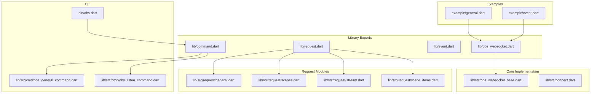
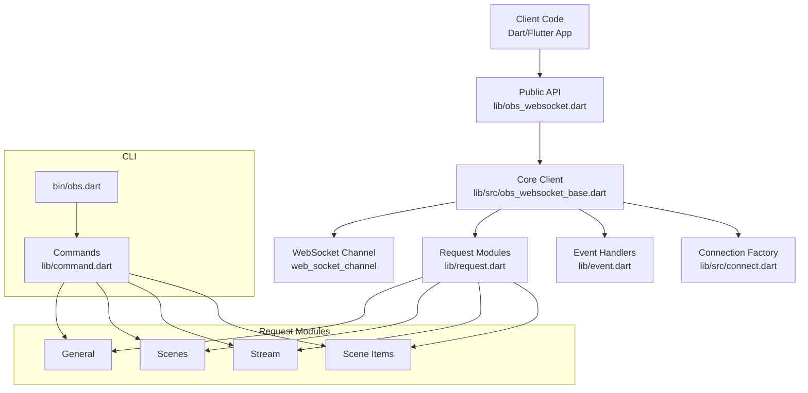
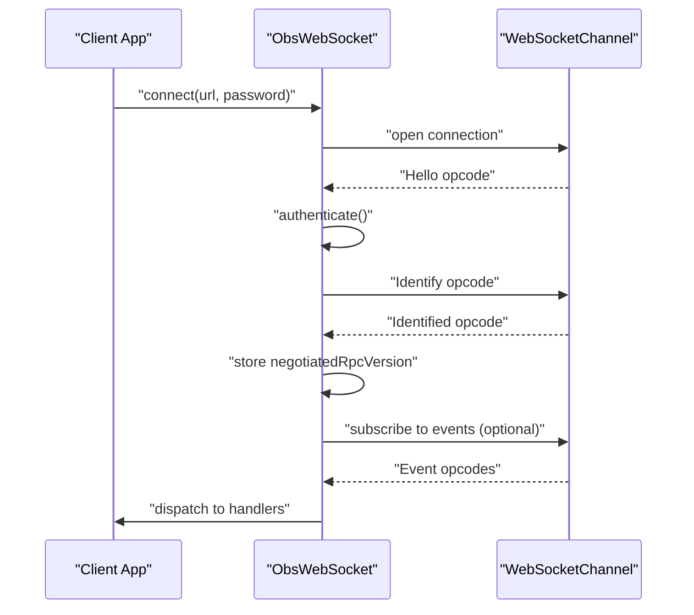
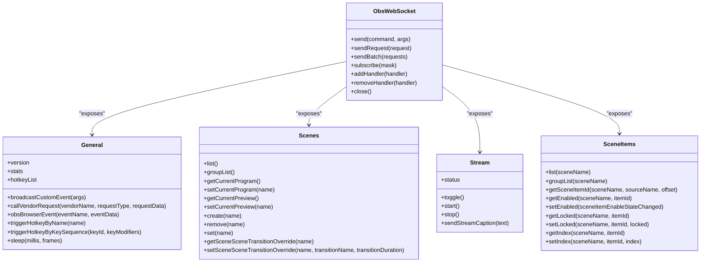
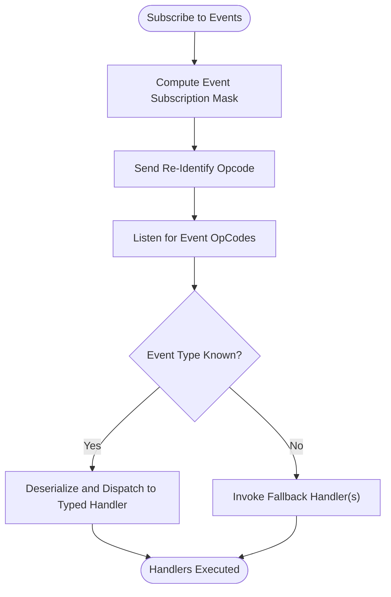
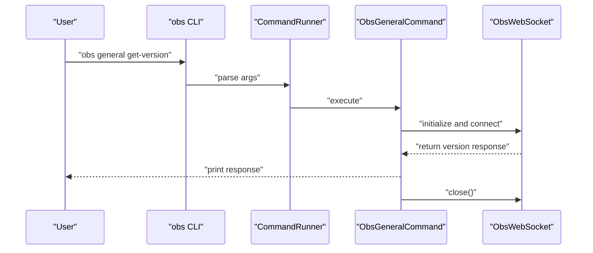
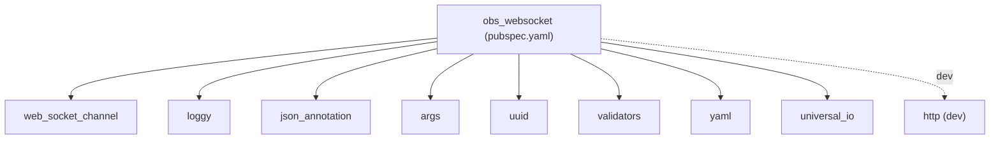

# Project Overview

<cite>
**Referenced Files in This Document**
- [README.md](file://README.md)
- [pubspec.yaml](file://pubspec.yaml)
- [lib/obs_websocket.dart](file://lib/obs_websocket.dart)
- [lib/request.dart](file://lib/request.dart)
- [lib/event.dart](file://lib/event.dart)
- [lib/command.dart](file://lib/command.dart)
- [lib/src/obs_websocket_base.dart](file://lib/src/obs_websocket_base.dart)
- [lib/src/connect.dart](file://lib/src/connect.dart)
- [lib/src/request/general.dart](file://lib/src/request/general.dart)
- [lib/src/request/scenes.dart](file://lib/src/request/scenes.dart)
- [lib/src/request/stream.dart](file://lib/src/request/stream.dart)
- [lib/src/request/scene_items.dart](file://lib/src/request/scene_items.dart)
- [lib/src/cmd/obs_general_command.dart](file://lib/src/cmd/obs_general_command.dart)
- [lib/src/cmd/obs_listen_command.dart](file://lib/src/cmd/obs_listen_command.dart)
- [bin/obs.dart](file://bin/obs.dart)
- [example/general.dart](file://example/general.dart)
- [example/event.dart](file://example/event.dart)
</cite>

## Table of Contents
1. [Introduction](#introduction)
2. [Project Structure](#project-structure)
3. [Core Components](#core-components)
4. [Architecture Overview](#architecture-overview)
5. [Detailed Component Analysis](#detailed-component-analysis)
6. [Dependency Analysis](#dependency-analysis)
7. [Performance Considerations](#performance-considerations)
8. [Troubleshooting Guide](#troubleshooting-guide)
9. [Conclusion](#conclusion)

## Introduction
obs-websocket-dart is a Dart library that provides complete control over OBS (Open Broadcaster Software) using the obs-websocket 5.x protocol. It enables Dart and Flutter developers to automate and integrate with OBS remotely via a WebSocket connection, supporting both high-level helper methods and a low-level request system. The library offers robust event subscription, a CLI for command-line control, and comprehensive coverage of the protocol’s requests and events.

Key highlights:
- WebSocket-based control of OBS with automatic authentication and handshake
- Complete protocol implementation aligned with obs-websocket 5.x
- Event subscription system for real-time updates
- High-level helper methods for common requests
- CLI interface for scripting and automation tasks

Target audience:
- Dart and Flutter developers building broadcasting tools, stream automation systems, and OBS control applications

Common use cases:
- Stream automation (start/stop streams, toggle recording, manage transitions)
- OBS control applications (remote UIs, dashboards, and integrations)
- Broadcasting tools (captions, overlays, and dynamic scene management)

Breaking changes from v4.9.1 to v5.x:
- The v5.x protocol introduces significant architectural and behavioral changes compared to v4.9.1. Any code written for the older protocol requires rewriting for v5.x compatibility.

## Project Structure
The project is organized into libraries, request modules, event models, command-line interface, and examples. The main entry points expose high-level APIs and a CLI executable.

**Diagram sources**
- [lib/obs_websocket.dart:1-68](file://lib/obs_websocket.dart#L1-L68)
- [lib/request.dart:1-19](file://lib/request.dart#L1-L19)
- [lib/event.dart:1-50](file://lib/event.dart#L1-L50)
- [lib/command.dart:1-20](file://lib/command.dart#L1-L20)
- [lib/src/obs_websocket_base.dart:1-428](file://lib/src/obs_websocket_base.dart#L1-L428)
- [lib/src/connect.dart:1-15](file://lib/src/connect.dart#L1-L15)
- [lib/src/request/general.dart:1-143](file://lib/src/request/general.dart#L1-L143)
- [lib/src/request/scenes.dart:1-232](file://lib/src/request/scenes.dart#L1-L232)
- [lib/src/request/stream.dart:1-94](file://lib/src/request/stream.dart#L1-L94)
- [lib/src/request/scene_items.dart:1-324](file://lib/src/request/scene_items.dart#L1-L324)
- [lib/src/cmd/obs_general_command.dart:1-306](file://lib/src/cmd/obs_general_command.dart#L1-L306)
- [lib/src/cmd/obs_listen_command.dart:1-123](file://lib/src/cmd/obs_listen_command.dart#L1-L123)
- [bin/obs.dart:1-57](file://bin/obs.dart#L1-L57)
- [example/general.dart:1-152](file://example/general.dart#L1-L152)
- [example/event.dart:1-44](file://example/event.dart#L1-L44)

**Section sources**
- [README.md:37-106](file://README.md#L37-L106)
- [pubspec.yaml:1-38](file://pubspec.yaml#L1-L38)
- [lib/obs_websocket.dart:1-68](file://lib/obs_websocket.dart#L1-L68)
- [lib/request.dart:1-19](file://lib/request.dart#L1-L19)
- [lib/event.dart:1-50](file://lib/event.dart#L1-L50)
- [lib/command.dart:1-20](file://lib/command.dart#L1-L20)
- [bin/obs.dart:1-57](file://bin/obs.dart#L1-L57)

## Core Components
- WebSocket client: Establishes and manages the WebSocket connection, handles authentication, and routes messages.
- Request system: Provides high-level helper methods grouped by functional domains (General, Scenes, Stream, Scene Items, etc.) and a low-level send method for arbitrary requests.
- Event management: Supports subscribing to event categories, dispatching typed events to handlers, and a fallback mechanism for unsupported events.
- CLI interface: Offers a command-line tool to control OBS, including general commands, listening to events, and sending low-level requests.

Practical examples:
- Connect to OBS, subscribe to events, and toggle streaming using high-level helpers.
- Use the CLI to broadcast custom events to the obs-browser plugin.
- Subscribe to input volume meters and react to scene changes in real time.

**Section sources**
- [README.md:106-490](file://README.md#L106-L490)
- [lib/src/obs_websocket_base.dart:11-428](file://lib/src/obs_websocket_base.dart#L11-L428)
- [lib/src/request/general.dart:1-143](file://lib/src/request/general.dart#L1-L143)
- [lib/src/request/scenes.dart:1-232](file://lib/src/request/scenes.dart#L1-L232)
- [lib/src/request/stream.dart:1-94](file://lib/src/request/stream.dart#L1-L94)
- [lib/src/request/scene_items.dart:1-324](file://lib/src/request/scene_items.dart#L1-L324)
- [lib/src/cmd/obs_general_command.dart:1-306](file://lib/src/cmd/obs_general_command.dart#L1-L306)
- [lib/src/cmd/obs_listen_command.dart:1-123](file://lib/src/cmd/obs_listen_command.dart#L1-L123)
- [example/general.dart:1-152](file://example/general.dart#L1-L152)
- [example/event.dart:1-44](file://example/event.dart#L1-L44)

## Architecture Overview
The library follows a layered architecture:
- Export layer: Public APIs and model exports
- Core layer: WebSocket client, authentication, request/response handling, and event routing
- Feature layer: Request modules for each domain (General, Scenes, Stream, etc.)
- CLI layer: Command runner and commands for general operations and event listening

**Diagram sources**
- [lib/obs_websocket.dart:1-68](file://lib/obs_websocket.dart#L1-L68)
- [lib/src/obs_websocket_base.dart:1-428](file://lib/src/obs_websocket_base.dart#L1-L428)
- [lib/request.dart:1-19](file://lib/request.dart#L1-L19)
- [lib/event.dart:1-50](file://lib/event.dart#L1-L50)
- [lib/src/connect.dart:1-15](file://lib/src/connect.dart#L1-L15)
- [bin/obs.dart:1-57](file://bin/obs.dart#L1-L57)
- [lib/command.dart:1-20](file://lib/command.dart#L1-L20)

## Detailed Component Analysis

### WebSocket Client and Handshake
The core client initializes a WebSocket channel, performs the obs-websocket handshake, authenticates (if required), and sets up event and request handling.

**Diagram sources**
- [lib/src/obs_websocket_base.dart:135-236](file://lib/src/obs_websocket_base.dart#L135-L236)
- [lib/src/connect.dart:1-15](file://lib/src/connect.dart#L1-L15)

**Section sources**
- [lib/src/obs_websocket_base.dart:11-428](file://lib/src/obs_websocket_base.dart#L11-L428)
- [lib/src/connect.dart:1-15](file://lib/src/connect.dart#L1-L15)

### Request System
High-level request modules encapsulate protocol requests into typed methods. Each module exposes getters and methods that internally call the core sendRequest mechanism.

**Diagram sources**
- [lib/src/obs_websocket_base.dart:351-418](file://lib/src/obs_websocket_base.dart#L351-L418)
- [lib/src/request/general.dart:1-143](file://lib/src/request/general.dart#L1-L143)
- [lib/src/request/scenes.dart:1-232](file://lib/src/request/scenes.dart#L1-L232)
- [lib/src/request/stream.dart:1-94](file://lib/src/request/stream.dart#L1-L94)
- [lib/src/request/scene_items.dart:1-324](file://lib/src/request/scene_items.dart#L1-L324)

**Section sources**
- [lib/src/obs_websocket_base.dart:351-418](file://lib/src/obs_websocket_base.dart#L351-L418)
- [lib/src/request/general.dart:1-143](file://lib/src/request/general.dart#L1-L143)
- [lib/src/request/scenes.dart:1-232](file://lib/src/request/scenes.dart#L1-L232)
- [lib/src/request/stream.dart:1-94](file://lib/src/request/stream.dart#L1-L94)
- [lib/src/request/scene_items.dart:1-324](file://lib/src/request/scene_items.dart#L1-L324)

### Event Management
The client supports subscribing to event masks, dispatching typed events to registered handlers, and falling back to a generic handler for unsupported events.

**Diagram sources**
- [lib/src/obs_websocket_base.dart:266-349](file://lib/src/obs_websocket_base.dart#L266-L349)
- [lib/event.dart:1-50](file://lib/event.dart#L1-L50)

**Section sources**
- [lib/src/obs_websocket_base.dart:266-349](file://lib/src/obs_websocket_base.dart#L266-L349)
- [lib/event.dart:1-50](file://lib/event.dart#L1-L50)

### CLI Interface
The CLI provides commands for general operations, listening to events, and sending low-level requests. It integrates with the command modules and the core client.

**Diagram sources**
- [bin/obs.dart:1-57](file://bin/obs.dart#L1-L57)
- [lib/src/cmd/obs_general_command.dart:1-306](file://lib/src/cmd/obs_general_command.dart#L1-L306)
- [lib/src/obs_websocket_base.dart:135-172](file://lib/src/obs_websocket_base.dart#L135-L172)

**Section sources**
- [bin/obs.dart:1-57](file://bin/obs.dart#L1-L57)
- [lib/src/cmd/obs_general_command.dart:1-306](file://lib/src/cmd/obs_general_command.dart#L1-L306)
- [lib/src/cmd/obs_listen_command.dart:1-123](file://lib/src/cmd/obs_listen_command.dart#L1-L123)

## Dependency Analysis
External dependencies include web sockets, logging, JSON serialization, and argument parsing for the CLI.

**Diagram sources**
- [pubspec.yaml:10-38](file://pubspec.yaml#L10-L38)

**Section sources**
- [pubspec.yaml:10-38](file://pubspec.yaml#L10-L38)

## Performance Considerations
- Use event subscriptions judiciously; high-volume events (e.g., input volume meters) should be filtered appropriately.
- Batch related requests when possible to reduce round-trips.
- Close the WebSocket connection after use to prevent resource leaks on the OBS instance.

## Troubleshooting Guide
- Authentication failures: Ensure the correct password is provided and that OBS has the obs-websocket plugin configured.
- No events received: Verify the event subscription mask and that listen/subscribe was called before expecting events.
- Low-level request errors: Inspect the request status code and comment returned by the response to diagnose issues.

**Section sources**
- [lib/src/obs_websocket_base.dart:190-236](file://lib/src/obs_websocket_base.dart#L190-L236)
- [lib/src/obs_websocket_base.dart:420-426](file://lib/src/obs_websocket_base.dart#L420-L426)
- [README.md:334-490](file://README.md#L334-L490)

## Conclusion
obs-websocket-dart delivers a comprehensive, protocol-aligned solution for Dart and Flutter developers to control OBS remotely. With a strong WebSocket foundation, rich request modules, robust event handling, and a practical CLI, it supports a wide range of broadcasting and automation scenarios. Developers migrating from v4.9.1 should update their implementations to align with the v5.x protocol.