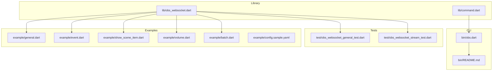
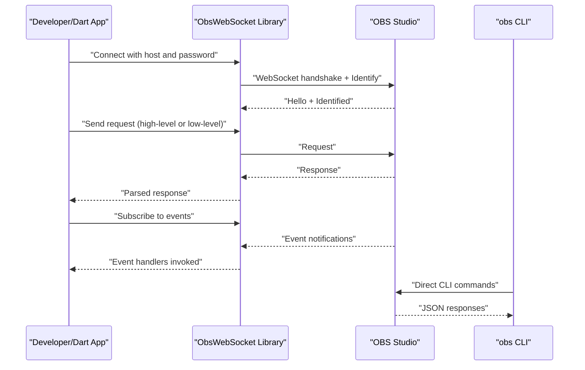
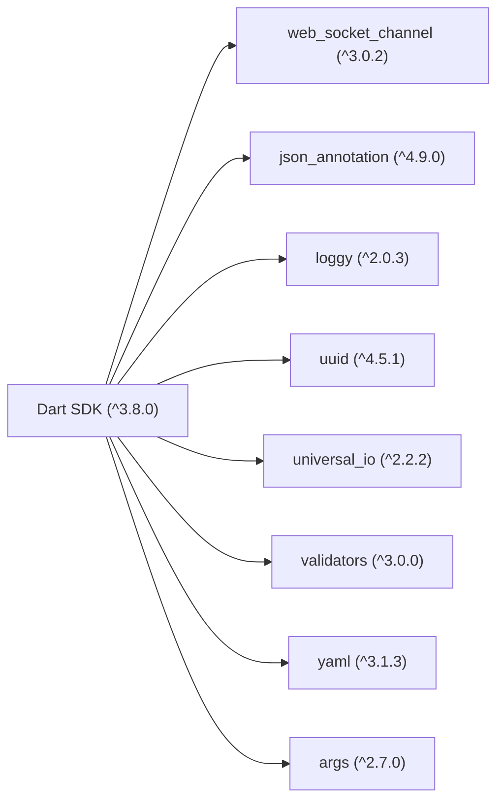

# Target Audience and Use Cases

<cite>
**Referenced Files in This Document**
- [README.md](file://README.md)
- [pubspec.yaml](file://pubspec.yaml)
- [lib/obs_websocket.dart](file://lib/obs_websocket.dart)
- [example/general.dart](file://example/general.dart)
- [example/event.dart](file://example/event.dart)
- [example/show_scene_item.dart](file://example/show_scene_item.dart)
- [example/volume.dart](file://example/volume.dart)
- [example/batch.dart](file://example/batch.dart)
- [bin/obs.dart](file://bin/obs.dart)
- [bin/README.md](file://bin/README.md)
- [lib/command.dart](file://lib/command.dart)
- [test/obs_websocket_general_test.dart](file://test/obs_websocket_general_test.dart)
- [test/obs_websocket_stream_test.dart](file://test/obs_websocket_stream_test.dart)
- [example/config.sample.yaml](file://example/config.sample.yaml)
</cite>

## Table of Contents
1. [Introduction](#introduction)
2. [Project Structure](#project-structure)
3. [Core Components](#core-components)
4. [Architecture Overview](#architecture-overview)
5. [Detailed Component Analysis](#detailed-component-analysis)
6. [Dependency Analysis](#dependency-analysis)
7. [Performance Considerations](#performance-considerations)
8. [Troubleshooting Guide](#troubleshooting-guide)
9. [Conclusion](#conclusion)
10. [Appendices](#appendices)

## Introduction
This document defines the target audience and use cases for the OBS WebSocket Dart library. It identifies who will benefit most—Dart/Flutter developers, streaming automation engineers, and broadcast production teams—and explains how the library enables automated streaming workflows, OBS control applications, live production automation, and custom broadcasting tools. It also outlines skill requirements, prerequisites, and practical project examples, along with guidance on when to choose this library versus alternatives and how to integrate it into existing systems.

## Project Structure
The repository provides:
- A Dart library exposing high-level helpers and low-level request/response handling for the obs-websocket protocol
- A CLI tool for scripting and automation tasks
- Examples demonstrating real-world usage patterns
- Tests validating protocol responses and capabilities

**Diagram sources**
- [lib/obs_websocket.dart:1-69](file://lib/obs_websocket.dart#L1-L69)
- [lib/command.dart:1-20](file://lib/command.dart#L1-L20)
- [example/general.dart:1-154](file://example/general.dart#L1-L154)
- [example/event.dart:1-46](file://example/event.dart#L1-L46)
- [example/show_scene_item.dart:1-70](file://example/show_scene_item.dart#L1-L70)
- [example/volume.dart:1-28](file://example/volume.dart#L1-L28)
- [example/batch.dart:1-30](file://example/batch.dart#L1-L30)
- [bin/obs.dart:1-61](file://bin/obs.dart#L1-L61)
- [bin/README.md:1-800](file://bin/README.md#L1-L800)
- [test/obs_websocket_general_test.dart:1-98](file://test/obs_websocket_general_test.dart#L1-L98)
- [test/obs_websocket_stream_test.dart:1-26](file://test/obs_websocket_stream_test.dart#L1-L26)

**Section sources**
- [README.md:41-105](file://README.md#L41-L105)
- [pubspec.yaml:1-38](file://pubspec.yaml#L1-L38)

## Core Components
- ObsWebSocket connection and authentication
- High-level helper methods for common requests (streams, scenes, inputs, outputs, UI, etc.)
- Low-level request/response handling for advanced or unsupported requests
- Event subscription and handler registration for real-time automation
- Batch request support for improved throughput
- CLI tool for command-line automation and integration

Key capabilities include:
- Streaming control (start/stop/toggle, status, captions)
- Recording and replay buffer management
- Scene and scene item manipulation
- Input volume and mute controls
- Virtual camera toggling
- Studio mode and transitions
- Browser source event bridging

**Section sources**
- [README.md:106-263](file://README.md#L106-L263)
- [example/general.dart:74-84](file://example/general.dart#L74-L84)
- [example/batch.dart:17-28](file://example/batch.dart#L17-L28)
- [bin/README.md:163-800](file://bin/README.md#L163-L800)

## Architecture Overview
The library connects to OBS via WebSocket, authenticates, sends requests, receives responses, and handles events. The CLI wraps the same capabilities for non-code automation.

**Diagram sources**
- [README.md:66-105](file://README.md#L66-L105)
- [example/general.dart:12-19](file://example/general.dart#L12-L19)
- [bin/obs.dart:6-60](file://bin/obs.dart#L6-L60)

## Detailed Component Analysis

### Target Audience
- Dart/Flutter developers building integrations, overlays, or control panels that communicate with OBS
- Streaming automation engineers designing robust, scriptable workflows for live production
- Broadcast production teams automating repetitive tasks, managing transitions, and orchestrating multi-camera setups

These users leverage the library to:
- Build custom dashboards and control surfaces
- Automate scene changes, transitions, and overlays
- Integrate with external systems (streaming platforms, alert systems, or interactive widgets)
- Reduce manual intervention during live shows

**Section sources**
- [README.md:43-56](file://README.md#L43-L56)
- [bin/README.md:56-80](file://bin/README.md#L56-L80)

### Use Cases
- Automated streaming workflows: start/stop streams, monitor status, send captions
- OBS control applications: manage scenes, scene items, inputs, and outputs
- Live production automation: trigger transitions, toggle virtual camera, control recording
- Custom broadcasting tools: build overlays, alerts, or interactive widgets synchronized with OBS

Practical examples:
- Stream overlay automation: show/hide scene items on cue
- Scene transition controllers: orchestrate studio mode transitions
- Recording management systems: start/stop recording and replay buffer with status monitoring

**Section sources**
- [README.md:106-263](file://README.md#L106-L263)
- [example/show_scene_item.dart:32-53](file://example/show_scene_item.dart#L32-L53)
- [example/volume.dart:17-26](file://example/volume.dart#L17-L26)
- [bin/README.md:675-760](file://bin/README.md#L675-L760)

### Skill Level and Prerequisites
- Dart programming proficiency to use the library and write automation scripts
- Understanding of WebSocket communication fundamentals
- Basic familiarity with OBS Studio (UI, scenes, inputs, outputs) to configure and validate behavior
- Optional: CLI usage for non-code automation and integration testing

**Section sources**
- [README.md:43-56](file://README.md#L43-L56)
- [pubspec.yaml:10-22](file://pubspec.yaml#L10-L22)
- [bin/README.md:56-80](file://bin/README.md#L56-L80)

### Typical Projects Benefiting from This Library
- Stream overlay automation: dynamically show/hide and schedule overlays
- Scene transition controllers: automate transitions and timing
- Recording management systems: monitor and control recording and replay buffer
- Interactive overlays: bridge browser sources and external event systems
- Production dashboards: centralize controls for multiple operators

**Section sources**
- [example/show_scene_item.dart:12-68](file://example/show_scene_item.dart#L12-L68)
- [example/general.dart:54-56](file://example/general.dart#L54-L56)
- [README.md:264-287](file://README.md#L264-L287)

### Choosing This Library vs. Alternatives
- Choose this library when you need a Dart-native, well-tested implementation of the obs-websocket protocol with high-level helpers and strong event support
- Consider alternatives if you require a different language binding or specialized features not yet exposed by this library
- Evaluate integration scenarios: if your system is already built in Dart/Flutter, this library minimizes friction and leverages existing toolchains

**Section sources**
- [README.md:106-263](file://README.md#L106-L263)
- [lib/obs_websocket.dart:1-69](file://lib/obs_websocket.dart#L1-L69)

### Integration Scenarios with Existing Systems
- Embed the library in Flutter apps to create operator dashboards
- Use the CLI to integrate with shell scripts, systemd services, or CI/CD pipelines
- Bridge browser sources and external event systems using the vendor event helper
- Combine with batch requests to optimize performance for high-frequency operations

**Section sources**
- [example/general.dart:12-19](file://example/general.dart#L12-L19)
- [example/batch.dart:17-28](file://example/batch.dart#L17-L28)
- [README.md:264-287](file://README.md#L264-L287)
- [bin/README.md:163-202](file://bin/README.md#L163-L202)

## Dependency Analysis
The library depends on standard Dart packages for networking, JSON serialization, logging, and CLI argument parsing. These dependencies support WebSocket communication, model serialization, and CLI tooling.

**Diagram sources**
- [pubspec.yaml:10-22](file://pubspec.yaml#L10-L22)

**Section sources**
- [pubspec.yaml:10-38](file://pubspec.yaml#L10-L38)

## Performance Considerations
- Use batch requests for high-frequency sequences to reduce round-trips
- Subscribe only to necessary event categories to avoid high-volume event floods
- Close connections when done to prevent resource leaks
- Prefer high-level helpers for common operations to reduce overhead and improve reliability

**Section sources**
- [example/batch.dart:17-28](file://example/batch.dart#L17-L28)
- [example/event.dart:21-22](file://example/event.dart#L21-L22)
- [README.md:483-489](file://README.md#L483-L489)

## Troubleshooting Guide
- Authentication failures: verify OBS WebSocket password and URI configuration
- Connection issues: ensure OBS is reachable on the local network and the plugin is enabled
- Event handling: subscribe to the appropriate event categories and register handlers
- CLI usage: use the authorize command to generate credentials and validate commands with JSON parsers

**Section sources**
- [README.md:66-94](file://README.md#L66-L94)
- [bin/README.md:165-183](file://bin/README.md#L165-L183)
- [example/event.dart:21-22](file://example/event.dart#L21-L22)

## Conclusion
The OBS WebSocket Dart library provides a comprehensive, Dart-native solution for integrating with OBS Studio. It supports a wide range of automation scenarios—from simple stream control to complex production orchestration—while offering both high-level helpers and low-level flexibility. By aligning skill requirements with practical use cases, teams can build reliable, maintainable automation systems tailored to their workflows.

## Appendices

### Appendix A: Capability Reference
- Streams: status, start/stop/toggle, captions
- Scenes: list, current program/preview, transitions
- Inputs: list, mute/volume, properties
- Outputs: virtual cam, replay buffer, recording
- UI: studio mode, monitors, projectors
- Events: extensive coverage for automation triggers

**Section sources**
- [README.md:110-263](file://README.md#L110-L263)
- [bin/README.md:163-800](file://bin/README.md#L163-L800)

### Appendix B: Configuration Example
- Host and password for OBS connection
- Stream service type and settings for RTMP

**Section sources**
- [example/config.sample.yaml:1-8](file://example/config.sample.yaml#L1-L8)