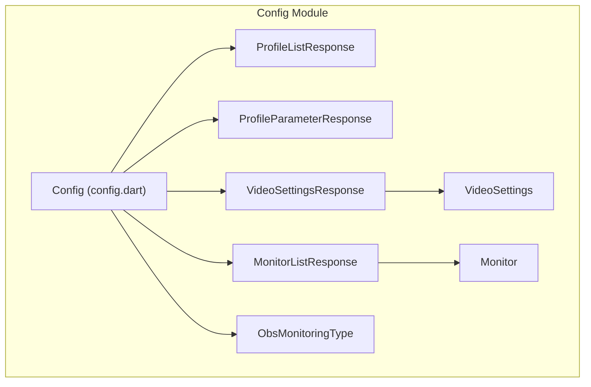
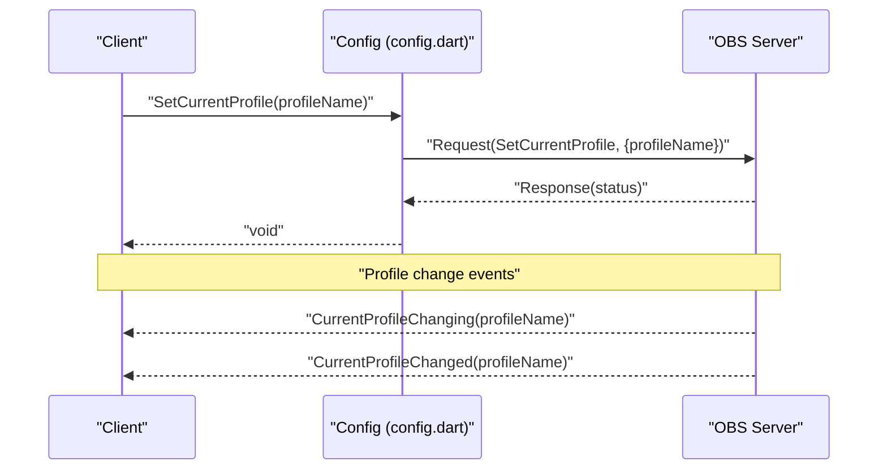
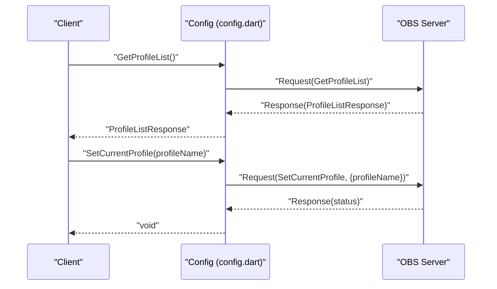
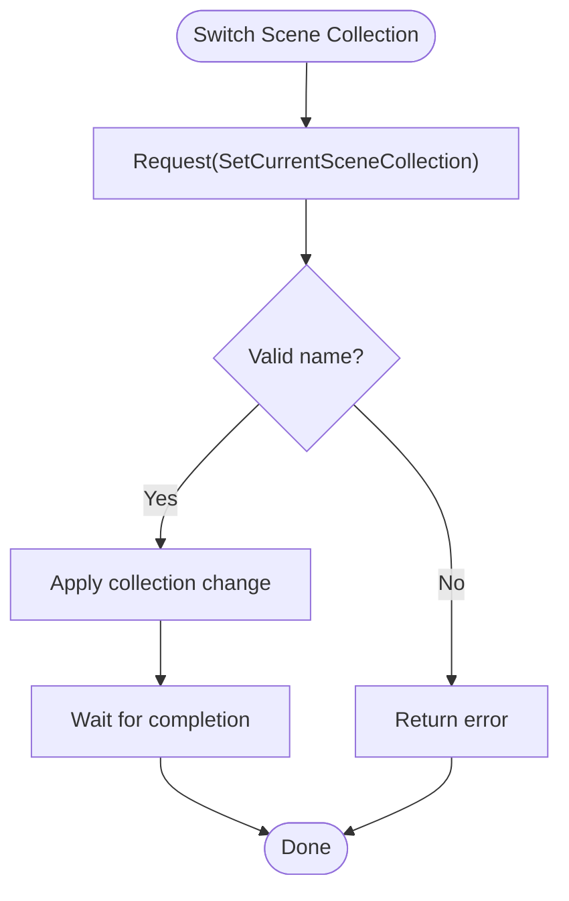
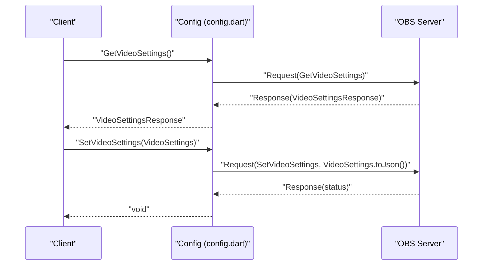
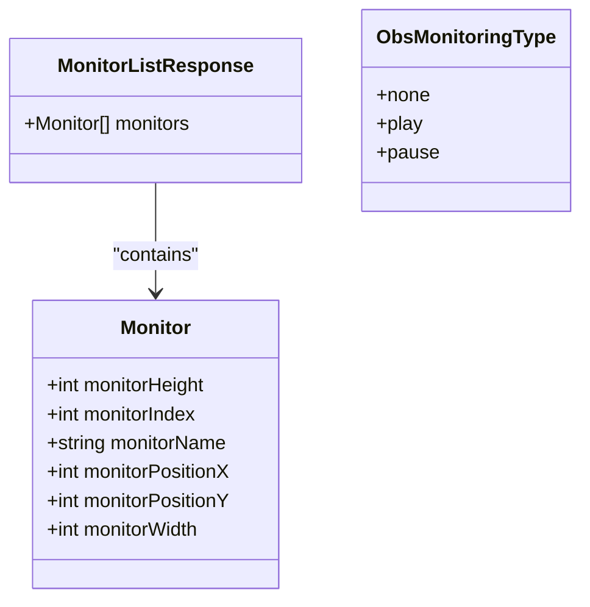
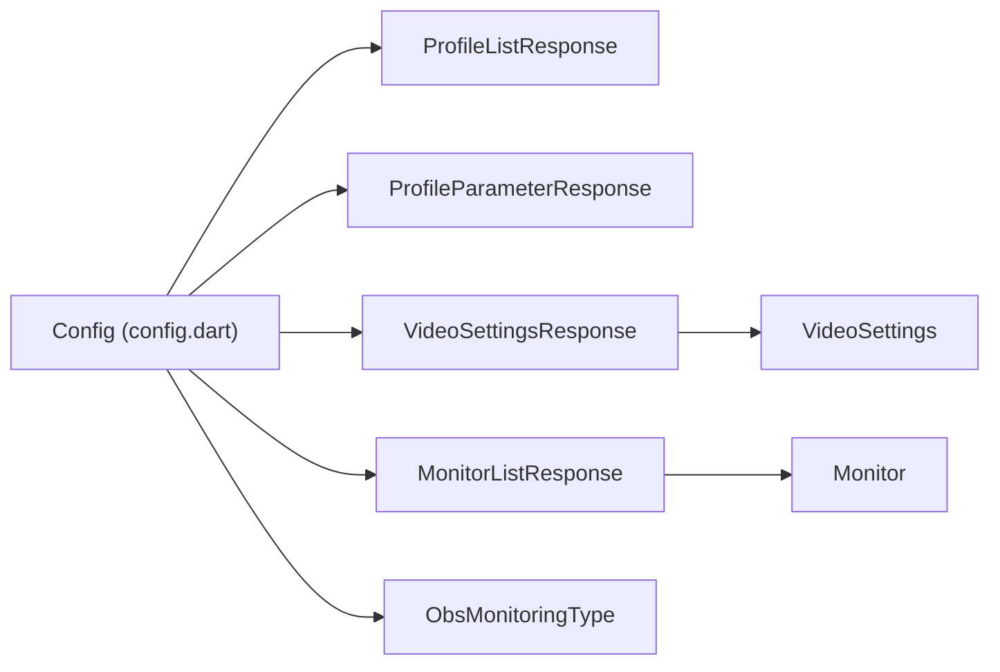

# Configuration Requests

<cite>
**Referenced Files in This Document**
- [README.md](file://README.md)
- [config.dart](file://lib/src/request/config.dart)
- [profile_list_response.dart](file://lib/src/model/response/profile_list_response.dart)
- [profile_parameter_response.dart](file://lib/src/model/response/profile_parameter_response.dart)
- [video_settings_response.dart](file://lib/src/model/response/video_settings_response.dart)
- [video_settings.dart](file://lib/src/model/request/video_settings.dart)
- [monitor_list_response.dart](file://lib/src/model/response/monitor_list_response.dart)
- [monitor.dart](file://lib/src/model/shared/monitor.dart)
- [obs_monitoring_type.dart](file://lib/src/enum/obs_monitoring_type.dart)
- [current_profile_changed.dart](file://lib/src/model/event/config/current_profile_changed.dart)
- [current_profile_changing.dart](file://lib/src/model/event/config/current_profile_changing.dart)
- [profile_list_changed.dart](file://lib/src/model/event/config/profile_list_changed.dart)
</cite>

## Table of Contents
1. [Introduction](#introduction)
2. [Project Structure](#project-structure)
3. [Core Components](#core-components)
4. [Architecture Overview](#architecture-overview)
5. [Detailed Component Analysis](#detailed-component-analysis)
6. [Dependency Analysis](#dependency-analysis)
7. [Performance Considerations](#performance-considerations)
8. [Troubleshooting Guide](#troubleshooting-guide)
9. [Conclusion](#conclusion)

## Introduction
This document provides detailed API documentation for Configuration Requests in the obs-websocket Dart client. It covers profile management, scene collection operations, and video/audio settings. The focus areas include:
- Profile management: GetProfileList, GetCurrentProfile, SetCurrentProfile, GetProfileParameter, SetProfileParameter
- Scene collection operations: GetSceneCollectionList, SetCurrentSceneCollection, CreateSceneCollection
- Video settings: GetVideoSettings, SetVideoSettings
- Audio monitoring: GetMonitorList, GetAudioMonitorType (via input events)

The documentation explains request parameters, validation expectations, constraints, defaults, persistence, and practical examples for common workflows such as profile switching, audio monitoring setup, and video resolution changes. It also outlines configuration backup/restore patterns and troubleshooting guidance.

## Project Structure
The configuration-related functionality is implemented as a dedicated Config module with typed request/response models and supporting enumerations. The high-level README lists supported requests and categorizes them under "Config Requests".

**Diagram sources**
- [config.dart:1-268](file://lib/src/request/config.dart#L1-L268)
- [profile_list_response.dart:1-25](file://lib/src/model/response/profile_list_response.dart#L1-L25)
- [profile_parameter_response.dart:1-26](file://lib/src/model/response/profile_parameter_response.dart#L1-L26)
- [video_settings_response.dart:1-39](file://lib/src/model/response/video_settings_response.dart#L1-L39)
- [video_settings.dart:1-33](file://lib/src/model/request/video_settings.dart#L1-L33)
- [monitor_list_response.dart:1-23](file://lib/src/model/response/monitor_list_response.dart#L1-L23)
- [monitor.dart:1-33](file://lib/src/model/shared/monitor.dart#L1-L33)
- [obs_monitoring_type.dart:1-10](file://lib/src/enum/obs_monitoring_type.dart#L1-L10)

**Section sources**
- [README.md:122-139](file://README.md#L122-L139)
- [config.dart:1-268](file://lib/src/request/config.dart#L1-L268)

## Core Components
This section summarizes the primary configuration requests and their roles:

- Profile Management
  - GetProfileList: Lists all available profiles and identifies the current profile.
  - SetCurrentProfile: Switches to a specified profile.
  - CreateProfile: Creates a new profile and switches to it.
  - RemoveProfile: Removes a profile; if it is the current profile, OBS switches to another profile first.
  - GetProfileParameter: Retrieves a parameter from the current profile's configuration.
  - SetProfileParameter: Sets a parameter in the current profile's configuration.

- Scene Collection Operations
  - GetSceneCollectionList: Lists all scene collections.
  - SetCurrentSceneCollection: Switches to a specified scene collection.
  - CreateSceneCollection: Creates a new scene collection and switches to it.

- Video Settings
  - GetVideoSettings: Retrieves current video settings including base/output dimensions and FPS numerator/denominator.
  - SetVideoSettings: Applies new video settings.

- Audio Monitoring
  - GetMonitorList: Retrieves a list of connected monitors.
  - GetAudioMonitorType: Not a direct request; audio monitoring type is exposed via input events (e.g., InputAudioMonitorTypeChanged).

Notes:
- Parameter validation and constraints are enforced by the obs-websocket server. Client-side validation is recommended for robustness.
- Persistence: Profile and scene collection changes persist across sessions. Video settings changes apply immediately and persist according to OBS behavior.
- Backup/restore pattern: Export profile parameters and video settings before major changes; restore by applying saved values.

**Section sources**
- [README.md:122-139](file://README.md#L122-L139)
- [config.dart:89-266](file://lib/src/request/config.dart#L89-L266)

## Architecture Overview
The configuration API follows a layered design:
- Request Layer: Typed request methods in the Config class.
- Transport Layer: The underlying sendRequest mechanism (not detailed here) handles JSON-RPC communication with OBS.
- Response Layer: Strongly-typed response models parse server replies.
- Event Layer: Profile change events notify clients of configuration changes.

**Diagram sources**
- [config.dart:100-108](file://lib/src/request/config.dart#L100-L108)
- [current_profile_changing.dart:1-25](file://lib/src/model/event/config/current_profile_changing.dart#L1-L25)
- [current_profile_changed.dart:1-25](file://lib/src/model/event/config/current_profile_changed.dart#L1-L25)

## Detailed Component Analysis

### Profile Management API
- GetProfileList
  - Purpose: Enumerates all profiles and indicates the current profile.
  - Response: ProfileListResponse with currentProfileName and profiles.
  - Typical use: Populate UI dropdowns or log current selection.
  - Constraints: Requires valid OBS connection; returns an empty list if no profiles exist (unlikely in practice).
  - Persistence: Changes are persisted by OBS.

- SetCurrentProfile
  - Purpose: Switches the active profile.
  - Parameters: profileName (string).
  - Validation: The server validates existence; invalid names cause errors.
  - Events: Emits CurrentProfileChanging followed by CurrentProfileChanged.
  - Persistence: Immediate effect; persists across sessions.

- CreateProfile
  - Purpose: Creates a new profile and switches to it.
  - Parameters: profileName (string).
  - Behavior: Blocks until the switch completes.

- RemoveProfile
  - Purpose: Deletes a profile; if it is the current profile, OBS switches to another profile first.
  - Parameters: profileName (string).

- GetProfileParameter
  - Purpose: Reads a parameter from the current profile's configuration.
  - Parameters: parameterCategory (string), parameterName (string).
  - Response: ProfileParameterResponse with parameterValue and defaultParameterValue.
  - Use cases: Querying current settings before modifying.

- SetProfileParameter
  - Purpose: Updates a parameter in the current profile's configuration.
  - Parameters: parameterCategory (string), parameterName (string), parameterValue (string).
  - Validation: parameterValue must be a valid string for the target parameter category.

**Diagram sources**
- [config.dart:89-108](file://lib/src/request/config.dart#L89-L108)
- [profile_list_response.dart:1-25](file://lib/src/model/response/profile_list_response.dart#L1-L25)

**Section sources**
- [config.dart:89-170](file://lib/src/request/config.dart#L89-L170)
- [profile_list_response.dart:1-25](file://lib/src/model/response/profile_list_response.dart#L1-L25)
- [profile_parameter_response.dart:1-26](file://lib/src/model/response/profile_parameter_response.dart#L1-L26)
- [current_profile_changing.dart:1-25](file://lib/src/model/event/config/current_profile_changing.dart#L1-L25)
- [current_profile_changed.dart:1-25](file://lib/src/model/event/config/current_profile_changed.dart#L1-L25)

### Scene Collection Operations API
- GetSceneCollectionList
  - Purpose: Lists all scene collections.
  - Response: SceneCollectionListResponse (typed in the Config class).
  - Use cases: UI population and diagnostics.

- SetCurrentSceneCollection
  - Purpose: Switches to a specified scene collection.
  - Parameters: sceneCollectionName (string).
  - Behavior: Blocks until the change completes.

- CreateSceneCollection
  - Purpose: Creates a new scene collection and switches to it.
  - Parameters: sceneCollectionName (string).

**Diagram sources**
- [config.dart:48-87](file://lib/src/request/config.dart#L48-L87)

**Section sources**
- [config.dart:48-87](file://lib/src/request/config.dart#L48-L87)

### Video Settings API
- GetVideoSettings
  - Purpose: Retrieves current video settings.
  - Response: VideoSettingsResponse with fpsNumerator, fpsDenominator, baseWidth, baseHeight, outputWidth, outputHeight.
  - Notes: True FPS equals fpsNumerator divided by fpsDenominator.

- SetVideoSettings
  - Purpose: Applies new video settings.
  - Parameters: VideoSettings object (fpsNumerator, fpsDenominator, baseWidth, baseHeight, outputWidth, outputHeight).
  - Validation: Values must be valid integers; invalid combinations may be rejected by OBS.

**Diagram sources**
- [config.dart:172-204](file://lib/src/request/config.dart#L172-L204)
- [video_settings_response.dart:1-39](file://lib/src/model/response/video_settings_response.dart#L1-L39)
- [video_settings.dart:1-33](file://lib/src/model/request/video_settings.dart#L1-L33)

**Section sources**
- [config.dart:172-204](file://lib/src/request/config.dart#L172-L204)
- [video_settings_response.dart:1-39](file://lib/src/model/response/video_settings_response.dart#L1-L39)
- [video_settings.dart:1-33](file://lib/src/model/request/video_settings.dart#L1-L33)

### Audio Monitoring API
- GetMonitorList
  - Purpose: Retrieves a list of connected monitors.
  - Response: MonitorListResponse containing Monitor entries with monitorIndex, monitorName, monitorWidth, monitorHeight, monitorPositionX, monitorPositionY.
  - Use cases: Selecting a monitor for preview or testing.

- GetAudioMonitorType
  - Purpose: Not a direct request in this client. Audio monitoring type is exposed via input events (e.g., InputAudioMonitorTypeChanged).
  - Related event: InputAudioMonitorTypeChanged provides inputName, inputUuid, and monitorType (ObsMonitoringType).
  - Enumerations: ObsMonitoringType includes none, play, pause.

**Diagram sources**
- [monitor_list_response.dart:1-23](file://lib/src/model/response/monitor_list_response.dart#L1-L23)
- [monitor.dart:1-33](file://lib/src/model/shared/monitor.dart#L1-L33)
- [obs_monitoring_type.dart:1-10](file://lib/src/enum/obs_monitoring_type.dart#L1-L10)

**Section sources**
- [config.dart:247-266](file://lib/src/request/config.dart#L247-L266)
- [monitor_list_response.dart:1-23](file://lib/src/model/response/monitor_list_response.dart#L1-L23)
- [monitor.dart:1-33](file://lib/src/model/shared/monitor.dart#L1-L33)
- [obs_monitoring_type.dart:1-10](file://lib/src/enum/obs_monitoring_type.dart#L1-L10)

## Dependency Analysis
Configuration requests depend on:
- Request/response models for typed data exchange.
- Enumerations for constrained values (e.g., ObsMonitoringType).
- Event models for observing configuration changes (e.g., profile switching).

**Diagram sources**
- [config.dart:1-268](file://lib/src/request/config.dart#L1-L268)
- [profile_list_response.dart:1-25](file://lib/src/model/response/profile_list_response.dart#L1-L25)
- [profile_parameter_response.dart:1-26](file://lib/src/model/response/profile_parameter_response.dart#L1-L26)
- [video_settings_response.dart:1-39](file://lib/src/model/response/video_settings_response.dart#L1-L39)
- [video_settings.dart:1-33](file://lib/src/model/request/video_settings.dart#L1-L33)
- [monitor_list_response.dart:1-23](file://lib/src/model/response/monitor_list_response.dart#L1-L23)
- [monitor.dart:1-33](file://lib/src/model/shared/monitor.dart#L1-L33)
- [obs_monitoring_type.dart:1-10](file://lib/src/enum/obs_monitoring_type.dart#L1-L10)

**Section sources**
- [config.dart:1-268](file://lib/src/request/config.dart#L1-L268)

## Performance Considerations
- Profile and scene collection switches can be blocking operations; avoid frequent rapid toggles.
- Video settings changes take effect immediately; large dimension changes may cause temporary rendering overhead.
- Event-driven updates (e.g., profile change events) help avoid polling and reduce overhead.

## Troubleshooting Guide
Common issues and resolutions:
- Invalid profile name
  - Symptom: SetCurrentProfile fails with an error.
  - Resolution: Use GetProfileList to confirm the profile exists; ensure correct spelling and casing.

- Invalid scene collection name
  - Symptom: SetCurrentSceneCollection fails.
  - Resolution: Use GetSceneCollectionList to verify the name.

- Invalid video settings
  - Symptom: SetVideoSettings fails or is ignored.
  - Resolution: Validate baseWidth/baseHeight and outputWidth/outputHeight; ensure fpsNumerator/fpsDenominator are positive integers.

- Audio monitoring not applied
  - Symptom: No audible feedback during preview.
  - Resolution: Confirm input audio monitor type via InputAudioMonitorTypeChanged events; ensure the input is enabled and unmuted.

- Configuration not persisting across restarts
  - Symptom: Settings revert after restarting OBS.
  - Resolution: Verify that the correct profile is active; remember that profile and scene collection changes persist per OBS configuration.

**Section sources**
- [config.dart:89-266](file://lib/src/request/config.dart#L89-L266)
- [current_profile_changed.dart:1-25](file://lib/src/model/event/config/current_profile_changed.dart#L1-L25)
- [current_profile_changing.dart:1-25](file://lib/src/model/event/config/current_profile_changing.dart#L1-L25)
- [profile_list_changed.dart:1-25](file://lib/src/model/event/config/profile_list_changed.dart#L1-L25)

## Conclusion
The Configuration Requests module provides a comprehensive, typed interface for managing profiles, scene collections, and video/audio settings in OBS via obs-websocket. By leveraging strongly-typed models, event notifications, and the documented APIs, developers can implement robust automation and control flows. Adhering to parameter constraints, validating inputs, and using events for state synchronization ensures reliable configuration management.