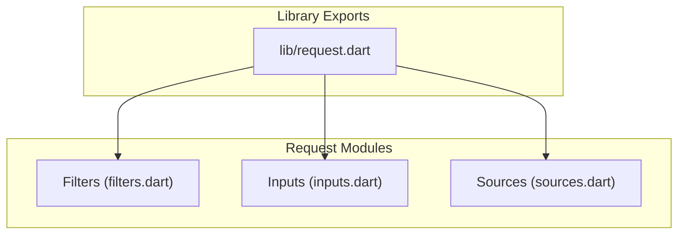
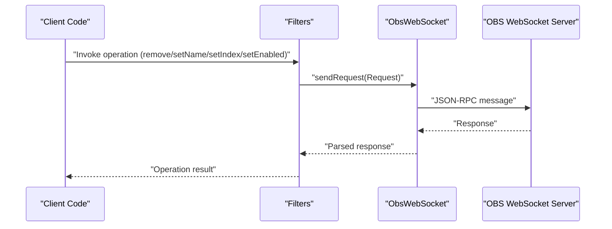
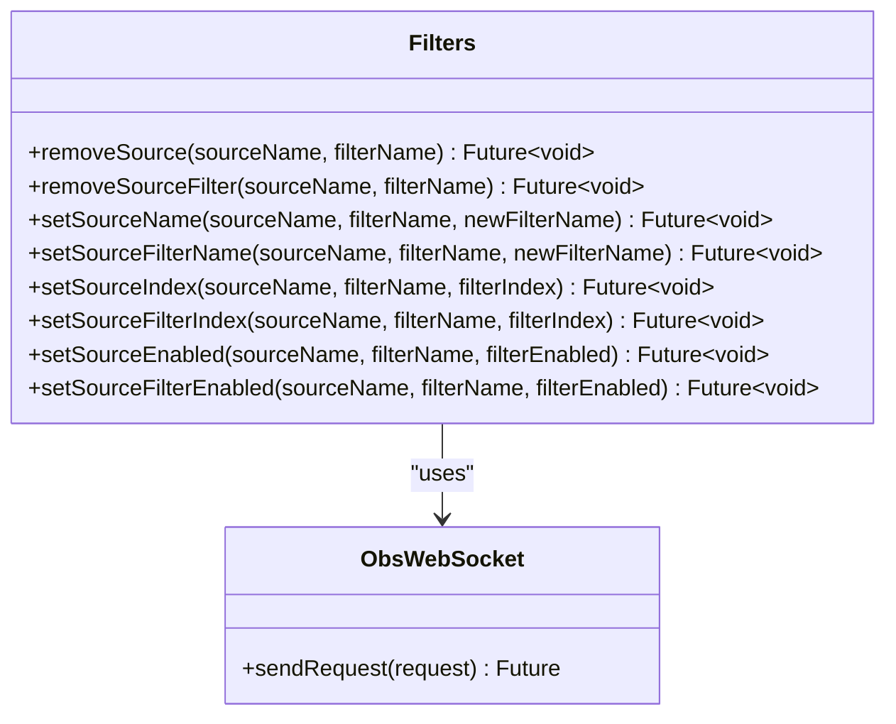
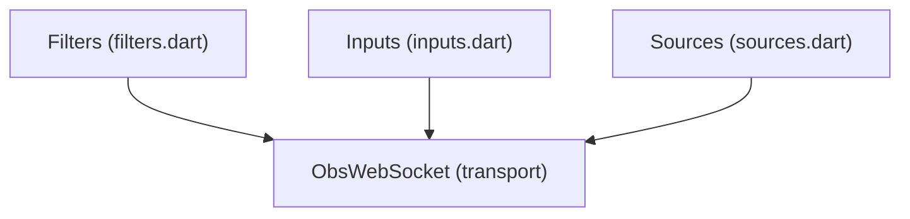

# Filter Requests

<cite>
**Referenced Files in This Document**
- [filters.dart](file://lib/src/request/filters.dart)
- [request.dart](file://lib/request.dart)
- [inputs.dart](file://lib/src/request/inputs.dart)
- [sources.dart](file://lib/src/request/sources.dart)
- [general.dart](file://example/general.dart)
- [volume.dart](file://example/volume.dart)
- [show_scene_item.dart](file://example/show_scene_item.dart)
- [enum.dart](file://lib/src/util/enum.dart)
</cite>

## Table of Contents
1. [Introduction](#introduction)
2. [Project Structure](#project-structure)
3. [Core Components](#core-components)
4. [Architecture Overview](#architecture-overview)
5. [Detailed Component Analysis](#detailed-component-analysis)
6. [Dependency Analysis](#dependency-analysis)
7. [Performance Considerations](#performance-considerations)
8. [Troubleshooting Guide](#troubleshooting-guide)
9. [Conclusion](#conclusion)

## Introduction
This document provides comprehensive API documentation for Filter Requests, focusing on managing source filters and effects within the OBS Websocket ecosystem. It covers filter creation, configuration, and management operations, including filter type enumeration, parameter control, enable/disable operations, and ordering within the filter chain. Practical examples demonstrate dynamic filter application, parameter automation, and complex filter combinations. Guidance is included on performance impact, dependency management, and troubleshooting filter conflicts.

## Project Structure
The Filter Requests API is part of a modular Dart library that exposes a set of request classes grouped under a central export module. The Filters class encapsulates all filter-related operations and communicates with the OBS WebSocket server via a shared transport abstraction.

**Diagram sources**
- [request.dart:1-19](file://lib/request.dart#L1-L19)
- [filters.dart:1-140](file://lib/src/request/filters.dart#L1-L140)
- [inputs.dart:1-389](file://lib/src/request/inputs.dart#L1-L389)
- [sources.dart:1-96](file://lib/src/request/sources.dart#L1-L96)

**Section sources**
- [request.dart:1-19](file://lib/request.dart#L1-L19)
- [filters.dart:1-140](file://lib/src/request/filters.dart#L1-L140)

## Core Components
This section outlines the primary Filter Requests operations and their purpose, parameters, and behavior.

- Remove Source Filter
  - Purpose: Remove a named filter from a specified source.
  - Parameters: sourceName, filterName.
  - Notes: Complexity rating 2/5; supported RPC version 1; added in v5.0.0.

- Set Source Filter Name
  - Purpose: Rename an existing filter on a source.
  - Parameters: sourceName, filterName, newFilterName.
  - Notes: Complexity rating 2/5; supported RPC version 1; added in v5.0.0.

- Set Source Filter Index
  - Purpose: Change the order/index of a filter within the filter chain of a source.
  - Parameters: sourceName, filterName, filterIndex.
  - Notes: Complexity rating 3/5; supported RPC version 1; added in v5.0.0.

- Set Source Filter Enabled
  - Purpose: Enable or disable a filter on a source.
  - Parameters: sourceName, filterName, filterEnabled (boolean).
  - Notes: Complexity rating 3/5; supported RPC version 1; added in v5.0.0.

These operations are exposed through the Filters class and rely on the shared ObsWebSocket transport to send requests to the OBS server.

**Section sources**
- [filters.dart:9-139](file://lib/src/request/filters.dart#L9-L139)

## Architecture Overview
The Filter Requests API integrates with the broader OBS Websocket client architecture. The Filters class delegates all operations to the underlying transport, ensuring consistent request formatting and response handling.

**Diagram sources**
- [filters.dart:25-139](file://lib/src/request/filters.dart#L25-L139)

## Detailed Component Analysis

### Filters Class
The Filters class provides a cohesive interface for managing source filters. It encapsulates four primary operations: removal, renaming, reordering, and enabling/disabling. Each method constructs a typed request and forwards it to the transport layer.

**Diagram sources**
- [filters.dart:4-139](file://lib/src/request/filters.dart#L4-L139)

**Section sources**
- [filters.dart:4-139](file://lib/src/request/filters.dart#L4-L139)

### Filter Type Enumeration
Filter types are represented by input kinds. The Inputs module exposes methods to enumerate available input kinds, which correspond to the types of filters and sources supported by OBS. Use the input kind list to discover and select appropriate filter types for your needs.

Key operations:
- Get Input Kind List: Retrieve all available input kinds.
- Get Input Default Settings: Obtain default settings for a given input kind, which can guide parameter configuration.

Practical usage:
- Enumerate input kinds to identify filter-capable inputs.
- Fetch default settings for a chosen input kind to understand parameter structure.

**Section sources**
- [inputs.dart:24-37](file://lib/src/request/inputs.dart#L24-L37)
- [inputs.dart:177-190](file://lib/src/request/inputs.dart#L177-L190)

### Filter Parameter Control
Filter parameters are managed through input settings. The Inputs module provides mechanisms to:
- Get Input Settings: Retrieve current settings for an input/filter.
- Set Input Settings: Apply updated settings to an input/filter.

Guidelines:
- Combine current settings with default settings to maintain a complete configuration object.
- Overlay new settings on top of defaults to avoid losing unspecified parameters.

Example references:
- Getting input settings for a filter source.
- Setting input settings to adjust filter parameters dynamically.

**Section sources**
- [inputs.dart:201-236](file://lib/src/request/inputs.dart#L201-L236)
- [inputs.dart:238-280](file://lib/src/request/inputs.dart#L238-L280)

### Filter Enable/Disable Operations
Enable/disable toggles are controlled per filter on a source. The Filters class exposes a dedicated method to switch a filter's enabled state. This allows for dynamic control of filter effects without removing them from the chain.

Operational notes:
- Use the filter's sourceName and filterName to target the correct filter.
- Toggle states can be combined with index changes to manage complex filter chains.

**Section sources**
- [filters.dart:105-139](file://lib/src/request/filters.dart#L105-L139)

### Filter Ordering Within the Filter Chain
Filter ordering determines the sequence in which filters are applied. The Filters class supports changing a filter's index within the chain. Proper ordering is essential for predictable outcomes, especially when filters modify similar properties (e.g., color adjustments followed by blur).

Operational notes:
- Specify the desired index position for a filter.
- Reordering affects rendering performance and visual results.

**Section sources**
- [filters.dart:70-103](file://lib/src/request/filters.dart#L70-L103)

### Dynamic Filter Application Examples
The following examples illustrate practical scenarios for applying and managing filters dynamically.

- Example: General usage and event handling
  - Demonstrates connecting to OBS, subscribing to events, and performing basic operations.
  - Useful for understanding how to integrate filter management with broader OBS workflows.

- Example: Volume monitoring and filtering
  - Shows how to subscribe to input volume events and react to changes.
  - Can be extended to trigger filter adjustments based on audio metrics.

- Example: Scene item visibility and filter interplay
  - Illustrates toggling scene item visibility and responding to related events.
  - Highlights the importance of coordinating scene items and filter states.

**Section sources**
- [general.dart:1-154](file://example/general.dart#L1-L154)
- [volume.dart:1-28](file://example/volume.dart#L1-L28)
- [show_scene_item.dart:1-70](file://example/show_scene_item.dart#L1-L70)

### Filter Parameter Automation
Automation involves programmatically adjusting filter parameters over time or in response to conditions. Recommended approach:
- Periodically fetch current input settings.
- Compute new parameter values based on triggers (time, audio level, scene change).
- Apply updated settings using set input settings.

Integration tips:
- Combine with event subscriptions to respond to runtime changes.
- Maintain a configuration baseline derived from default settings to preserve unchanged parameters.

**Section sources**
- [inputs.dart:201-280](file://lib/src/request/inputs.dart#L201-L280)

### Complex Filter Combinations
Managing multiple filters requires careful ordering and state coordination:
- Establish a filter chain with deterministic order.
- Group related filters (e.g., color correction, sharpening, noise reduction) to minimize redundant processing.
- Use enable/disable toggles to quickly compare filtered vs. unfiltered states.

Performance considerations:
- Heavy filters (e.g., blur, noise reduction) near the beginning of the chain can increase CPU/GPU load.
- Place less expensive filters earlier to reduce downstream computation.

**Section sources**
- [filters.dart:70-139](file://lib/src/request/filters.dart#L70-L139)

## Dependency Analysis
Filter Requests depend on the shared transport layer and leverage input-related APIs for parameter management. The following diagram illustrates these relationships.

**Diagram sources**
- [filters.dart:1-140](file://lib/src/request/filters.dart#L1-L140)
- [inputs.dart:1-389](file://lib/src/request/inputs.dart#L1-L389)
- [sources.dart:1-96](file://lib/src/request/sources.dart#L1-L96)

**Section sources**
- [filters.dart:1-140](file://lib/src/request/filters.dart#L1-L140)
- [inputs.dart:1-389](file://lib/src/request/inputs.dart#L1-L389)
- [sources.dart:1-96](file://lib/src/request/sources.dart#L1-L96)

## Performance Considerations
- Filter ordering impacts performance: place computationally expensive filters later in the chain to reduce repeated processing.
- Enable/disable toggles allow quick A/B comparisons without reconstructing filter chains.
- Parameter updates should be batched when possible to minimize network overhead.
- Monitor system resources and adjust filter complexity or chain length accordingly.

[No sources needed since this section provides general guidance]

## Troubleshooting Guide
Common issues and resolutions when working with filters:

- Filter not found or index out of range
  - Verify the sourceName and filterName exist.
  - Confirm the target filterIndex is within the valid range of the filter chain.

- Parameter changes not taking effect
  - Ensure you are updating the correct input/filter settings.
  - Combine current settings with defaults to avoid unintentionally resetting parameters.

- Conflicts between filters
  - Reorder filters to separate conflicting operations (e.g., resize before color correction).
  - Temporarily disable filters to isolate problematic interactions.

- Event-driven filter adjustments
  - Subscribe to relevant events (e.g., input volume meters) to trigger dynamic updates.
  - Coordinate with scene item and filter state changes to prevent race conditions.

**Section sources**
- [enum.dart:62-87](file://lib/src/util/enum.dart#L62-L87)
- [inputs.dart:201-280](file://lib/src/request/inputs.dart#L201-L280)
- [filters.dart:70-139](file://lib/src/request/filters.dart#L70-L139)

## Conclusion
Filter Requests provide a robust foundation for managing OBS filters and effects. By leveraging filter removal, renaming, reordering, and enable/disable controls—combined with input settings management—you can build dynamic, automated, and high-performance filter chains. Integrate with event subscriptions to achieve responsive, context-aware filtering and maintain system performance through thoughtful ordering and parameter automation.