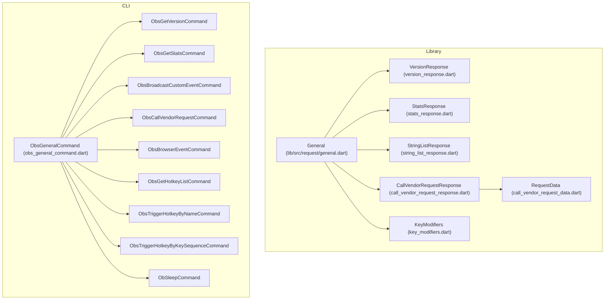
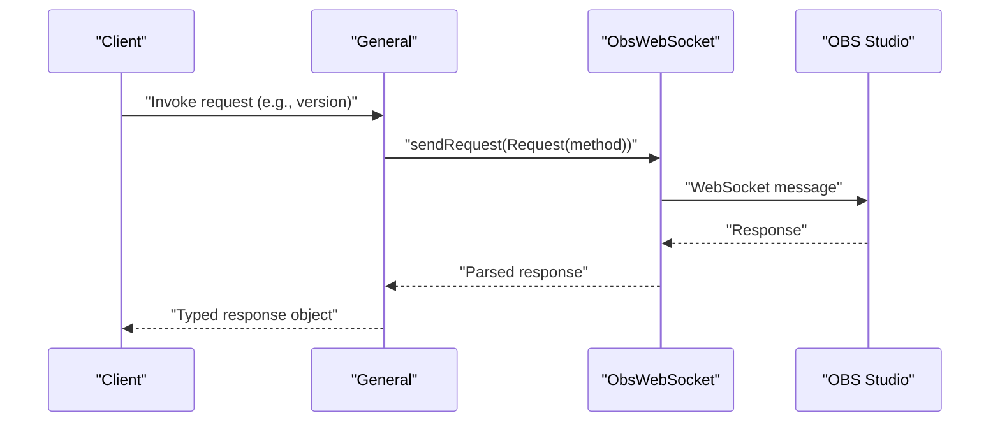
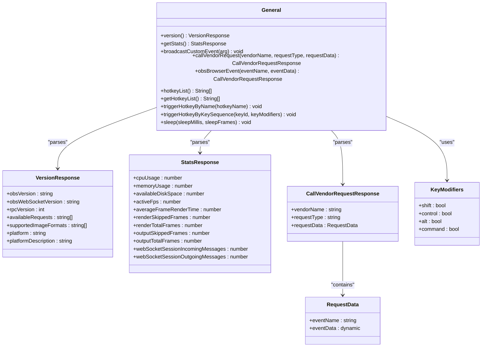

# General Requests

<cite>
**Referenced Files in This Document**
- [general.dart](file://lib/src/request/general.dart)
- [obs_general_command.dart](file://lib/src/cmd/obs_general_command.dart)
- [version_response.dart](file://lib/src/model/response/version_response.dart)
- [stats_response.dart](file://lib/src/model/response/stats_response.dart)
- [string_list_response.dart](file://lib/src/model/response/string_list_response.dart)
- [call_vendor_request_response.dart](file://lib/src/model/response/call_vendor_request_response.dart)
- [call_vendor_request_data.dart](file://lib/src/model/response/call_vendor_request_data.dart)
- [key_modifiers.dart](file://lib/src/model/request/key_modifiers.dart)
- [obs_websocket_general_test.dart](file://test/obs_websocket_general_test.dart)
- [general.dart](file://example/general.dart)
</cite>

## Table of Contents
1. [Introduction](#introduction)
2. [Project Structure](#project-structure)
3. [Core Components](#core-components)
4. [Architecture Overview](#architecture-overview)
5. [Detailed Component Analysis](#detailed-component-analysis)
6. [Dependency Analysis](#dependency-analysis)
7. [Performance Considerations](#performance-considerations)
8. [Troubleshooting Guide](#troubleshooting-guide)
9. [Conclusion](#conclusion)

## Introduction
This document provides comprehensive API documentation for General Requests in the obs-websocket protocol. It covers plugin and RPC version information retrieval, OBS statistics collection, custom event broadcasting, third-party vendor plugin integration, hotkey management, keyboard-based hotkey triggering, and batch operation timing. For each request, you will find method signatures, parameter descriptions, expected response formats, error handling characteristics, complexity ratings, and practical usage examples. Integration patterns for vendor plugins and browser plugin communication are included, along with hotkey automation scenarios.

## Project Structure
The General Requests are implemented within the library's request module and exposed via both programmatic APIs and CLI commands. Supporting data models define standardized response structures for version, statistics, string lists, vendor request responses, and key modifiers.

**Diagram sources**
- [general.dart:1-143](file://lib/src/request/general.dart#L1-L143)
- [obs_general_command.dart:1-306](file://lib/src/cmd/obs_general_command.dart#L1-L306)
- [version_response.dart:1-35](file://lib/src/model/response/version_response.dart#L1-L35)
- [stats_response.dart:1-43](file://lib/src/model/response/stats_response.dart#L1-L43)
- [string_list_response.dart:1-36](file://lib/src/model/response/string_list_response.dart#L1-L36)
- [call_vendor_request_response.dart:1-31](file://lib/src/model/response/call_vendor_request_response.dart#L1-L31)
- [call_vendor_request_data.dart:1-29](file://lib/src/model/response/call_vendor_request_data.dart#L1-L29)
- [key_modifiers.dart:1-30](file://lib/src/model/request/key_modifiers.dart#L1-L30)

**Section sources**
- [general.dart:1-143](file://lib/src/request/general.dart#L1-L143)
- [obs_general_command.dart:1-306](file://lib/src/cmd/obs_general_command.dart#L1-L306)

## Core Components
This section summarizes the core General Requests and their capabilities:
- GetVersion: Retrieves plugin and RPC version information, available requests, supported image formats, platform details, and RPC version.
- GetStats: Returns OBS, obs-websocket, and session statistics including CPU usage, memory usage, disk space, FPS, frame render time, skipped/total frames, and WebSocket message counts.
- BroadcastCustomEvent: Broadcasts a custom event payload to all subscribed WebSocket clients.
- CallVendorRequest: Invokes a request registered to a vendor (third-party plugin or script), returning the vendor name, request type, and optional request data.
- GetHotkeyList: Lists all hotkey names available in OBS.
- TriggerHotkeyByName: Executes a named hotkey.
- TriggerHotkeyByKeySequence: Executes a hotkey using a key identifier and optional key modifiers.
- Sleep: Pauses processing in batch operations (SERIAL_REALTIME or SERIAL_FRAME modes).

**Section sources**
- [general.dart:9-143](file://lib/src/request/general.dart#L9-L143)
- [obs_general_command.dart:28-306](file://lib/src/cmd/obs_general_command.dart#L28-L306)

## Architecture Overview
The General Requests are encapsulated in a dedicated class that delegates to the core WebSocket connection to send requests and parse responses. CLI commands provide convenient wrappers around these methods for interactive use.

**Diagram sources**
- [general.dart:21-25](file://lib/src/request/general.dart#L21-L25)
- [general.dart:39-43](file://lib/src/request/general.dart#L39-L43)

## Detailed Component Analysis

### GetVersion
Retrieves plugin and RPC version information, available requests, supported image formats, platform details, and RPC version.

- Method signature (programmatic): `Future<VersionResponse> getVersion()`
- Method signature (property): `Future<VersionResponse> get version`
- Parameters: None
- Expected response: VersionResponse with fields:
  - obsVersion: string
  - obsWebSocketVersion: string
  - rpcVersion: integer
  - availableRequests: array of strings
  - supportedImageFormats: array of strings
  - platform: string
  - platformDescription: string
- Complexity rating: 1/5
- Notes: Added in v5.0.0; latest supported RPC version: 1

Example usage:
- Programmatic: await obs.general.version
- CLI: general get-version

**Section sources**
- [general.dart:9-25](file://lib/src/request/general.dart#L9-L25)
- [version_response.dart:7-35](file://lib/src/model/response/version_response.dart#L7-L35)
- [obs_general_command.dart:28-47](file://lib/src/cmd/obs_general_command.dart#L28-L47)

### GetStats
Returns statistics about OBS, obs-websocket, and the current session.

- Method signature (programmatic): `Future<StatsResponse> getStats()`
- Method signature (property): `Future<StatsResponse> get stats`
- Parameters: None
- Expected response: StatsResponse with fields:
  - cpuUsage: number
  - memoryUsage: number
  - availableDiskSpace: number
  - activeFps: number
  - averageFrameRenderTime: number
  - renderSkippedFrames: number
  - renderTotalFrames: number
  - outputSkippedFrames: number
  - outputTotalFrames: number
  - webSocketSessionIncomingMessages: number
  - webSocketSessionOutgoingMessages: number
- Complexity rating: 2/5
- Notes: Added in v5.0.0; latest supported RPC version: 1

Example usage:
- Programmatic: await obs.general.stats
- CLI: general get-stats

**Section sources**
- [general.dart:27-43](file://lib/src/request/general.dart#L27-L43)
- [stats_response.dart:7-43](file://lib/src/model/response/stats_response.dart#L7-L43)
- [obs_general_command.dart:49-68](file://lib/src/cmd/obs_general_command.dart#L49-L68)

### BroadcastCustomEvent
Broadcasts a custom event payload to all subscribed WebSocket clients.

- Method signature: `Future<void> broadcastCustomEvent(Map<String, dynamic> arg)`
- Parameters:
  - arg: JSON-serializable object representing the event payload
- Expected response: No response body on success
- Complexity rating: 1/5
- Notes: Added in v5.0.0; latest supported RPC version: 1

Example usage:
- Programmatic: await obs.general.broadcastCustomEvent({'key': 'value'})
- CLI: general broadcast-custom-event --event-data '{"key":"value"}'

**Section sources**
- [general.dart:45-53](file://lib/src/request/general.dart#L45-L53)
- [obs_general_command.dart:70-96](file://lib/src/cmd/obs_general_command.dart#L70-L96)

### CallVendorRequest
Invokes a request registered to a vendor (third-party plugin or script).

- Method signature: `Future<CallVendorRequestResponse> callVendorRequest({required String vendorName, required String requestType, RequestData? requestData})`
- Parameters:
  - vendorName: string (unique vendor identifier)
  - requestType: string (vendor-specific request type)
  - requestData: optional RequestData object with event_name and event_data
- Expected response: CallVendorRequestResponse with:
  - vendorName: string
  - requestType: string
  - requestData: optional RequestData
- Complexity rating: 3/5
- Notes: Added in v5.0.0; latest supported RPC version: 1

Integration pattern for browser plugin:
- Helper method: obsBrowserEvent({required String eventName, dynamic eventData})
- Internally calls CallVendorRequest with vendorName: "obs-browser", requestType: "emit_event"

Example usage:
- Programmatic: await obs.general.callVendorRequest(vendorName: 'vendor', requestType: 'request', requestData: RequestData(eventName: 'event', eventData: {}))
- Programmatic (browser): await obs.general.obsBrowserEvent(eventName: 'event', eventData: {})
- CLI: general call-vendor-request --vendor-name "vendor" --request-type "request" --request-data '{}'
- CLI (browser): general obs-browser-event --event-name "event" --event-data '{}'

**Section sources**
- [general.dart:55-89](file://lib/src/request/general.dart#L55-L89)
- [call_vendor_request_response.dart:8-31](file://lib/src/model/response/call_vendor_request_response.dart#L8-L31)
- [call_vendor_request_data.dart:7-29](file://lib/src/model/response/call_vendor_request_data.dart#L7-L29)
- [obs_general_command.dart:98-182](file://lib/src/cmd/obs_general_command.dart#L98-L182)

### GetHotkeyList
Retrieves an array of all hotkey names in OBS.

- Method signature (programmatic): `Future<List<String>> getHotkeyList()`
- Method signature (property): `Future<List<String>> get hotkeyList`
- Parameters: None
- Expected response: List of strings representing hotkey names
- Complexity rating: 3/5
- Notes: Added in v5.0.0; latest supported RPC version: 1

Example usage:
- Programmatic: await obs.general.hotkeyList
- CLI: general get-hotkey-list

**Section sources**
- [general.dart:91-107](file://lib/src/request/general.dart#L91-L107)
- [string_list_response.dart:7-36](file://lib/src/model/response/string_list_response.dart#L7-L36)
- [obs_general_command.dart:184-202](file://lib/src/cmd/obs_general_command.dart#L184-L202)

### TriggerHotkeyByName
Executes a hotkey by its name.

- Method signature: `Future<void> triggerHotkeyByName(String hotkeyName)`
- Parameters:
  - hotkeyName: string (name from GetHotkeyList)
- Expected response: No response body on success
- Complexity rating: 3/5
- Notes: Added in v5.0.0; latest supported RPC version: 1

Example usage:
- Programmatic: await obs.general.triggerHotkeyByName("OBSBasic.Screenshot")
- CLI: general trigger-hotkey-by-name --hotkey-name "OBSBasic.Screenshot"

**Section sources**
- [general.dart:109-113](file://lib/src/request/general.dart#L109-L113)
- [obs_general_command.dart:204-230](file://lib/src/cmd/obs_general_command.dart#L204-L230)

### TriggerHotkeyByKeySequence
Executes a hotkey using a key identifier and optional key modifiers.

- Method signature: `Future<void> triggerHotkeyByKeySequence({String? keyId, KeyModifiers? keyModifiers})`
- Parameters:
  - keyId: string (OBS key ID)
  - keyModifiers: KeyModifiers object with optional shift, control, alt, command flags
- Expected response: No response body on success
- Complexity rating: 4/5
- Notes: Added in v5.0.0; latest supported RPC version: 1

Example usage:
- Programmatic: await obs.general.triggerHotkeyByKeySequence(keyId: 'OBS_KEY_F', keyModifiers: KeyModifiers(shift: true))
- CLI: general trigger-hotkey-by-key-sequence --key-id "OBS_KEY_F" --key-modifiers '{"shift":true}'

**Section sources**
- [general.dart:115-128](file://lib/src/request/general.dart#L115-L128)
- [key_modifiers.dart:7-30](file://lib/src/model/request/key_modifiers.dart#L7-L30)
- [obs_general_command.dart:232-270](file://lib/src/cmd/obs_general_command.dart#L232-L270)

### Sleep
Pauses processing in batch operations (SERIAL_REALTIME or SERIAL_FRAME modes).

- Method signature: `Future<void> sleep({int? sleepMillis, int? sleepFrames})`
- Parameters:
  - sleepMillis: integer (milliseconds; applies in SERIAL_REALTIME mode)
  - sleepFrames: integer (frames; applies in SERIAL_FRAME mode)
- Expected response: No response body on success
- Complexity rating: 2/5
- Notes: Added in v5.0.0; latest supported RPC version: 1

Example usage:
- Programmatic: await obs.general.sleep(sleepMillis: 1000)
- Programmatic: await obs.general.sleep(sleepFrames: 30)
- CLI: general sleep --sleep-millis 1000
- CLI: general sleep --sleep-frames 30

**Section sources**
- [general.dart:130-141](file://lib/src/request/general.dart#L130-L141)
- [obs_general_command.dart:272-305](file://lib/src/cmd/obs_general_command.dart#L272-L305)

## Dependency Analysis
The General class depends on:
- ObsWebSocket for sending requests
- Typed response models for parsing server responses
- KeyModifiers for keyboard-based hotkey triggering
- RequestData for vendor event payloads

**Diagram sources**
- [general.dart:4-143](file://lib/src/request/general.dart#L4-L143)
- [version_response.dart:7-35](file://lib/src/model/response/version_response.dart#L7-L35)
- [stats_response.dart:7-43](file://lib/src/model/response/stats_response.dart#L7-L43)
- [call_vendor_request_response.dart:12-31](file://lib/src/model/response/call_vendor_request_response.dart#L12-L31)
- [call_vendor_request_data.dart:11-29](file://lib/src/model/response/call_vendor_request_data.dart#L11-L29)
- [key_modifiers.dart:7-30](file://lib/src/model/request/key_modifiers.dart#L7-L30)

**Section sources**
- [general.dart:1-143](file://lib/src/request/general.dart#L1-L143)

## Performance Considerations
- GetVersion and GetStats are lightweight operations suitable for frequent polling.
- Hotkey operations (TriggerHotkeyByName, TriggerHotkeyByKeySequence) are synchronous actions that may impact UI responsiveness during intensive automation; batch with Sleep to control pacing.
- Vendor requests depend on third-party plugin performance; errors propagate through the standard request status mechanism.
- Batch timing with Sleep allows precise control over real-time or frame-based sequences.

## Troubleshooting Guide
Common issues and resolutions:
- Invalid vendor name or request type: Expect a non-success request status code. Verify vendor registration and request type spelling.
- Unknown hotkey name: Ensure the hotkey exists in the list returned by GetHotkeyList.
- Key modifiers mismatch: Confirm keyId values align with OBS key constants and modifier flags match expected combinations.
- Batch mode constraints: Sleep is only effective within batch contexts (SERIAL_REALTIME or SERIAL_FRAME); standalone invocations outside batches are ignored.

Validation references:
- Response status codes and result flags are part of the standard request response envelope.
- Tests demonstrate expected response shapes for GetVersion, GetStats, CallVendorRequest, and GetHotkeyList.

**Section sources**
- [obs_websocket_general_test.dart:6-97](file://test/obs_websocket_general_test.dart#L6-L97)

## Conclusion
The General Requests provide essential capabilities for introspection, monitoring, automation, and integration within the obs-websocket ecosystem. By leveraging typed responses, structured vendor integrations, and precise hotkey controls, developers can build robust automation scripts and applications. Use the provided CLI commands for quick testing and the programmatic API for integration into larger systems.