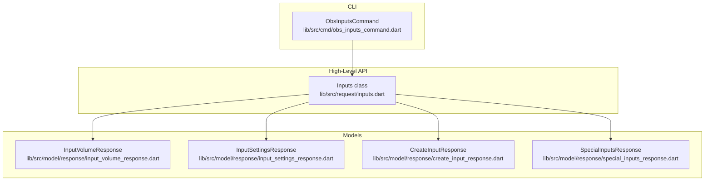
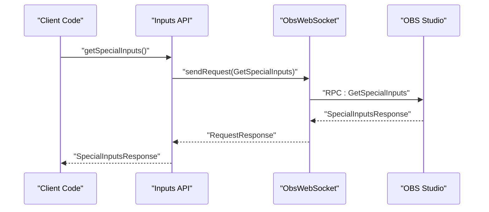
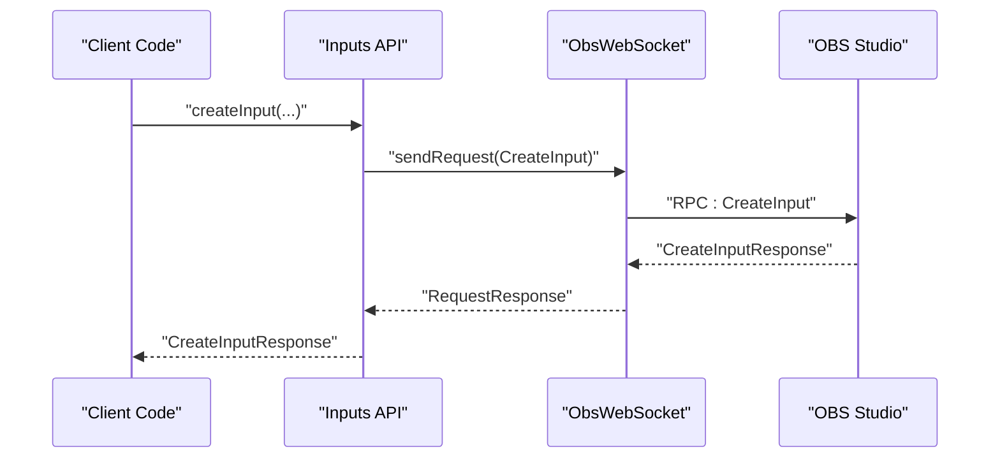
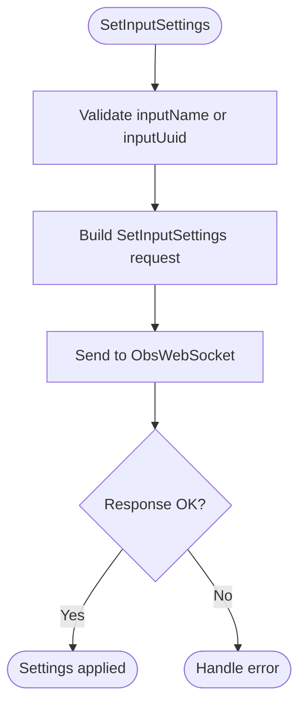
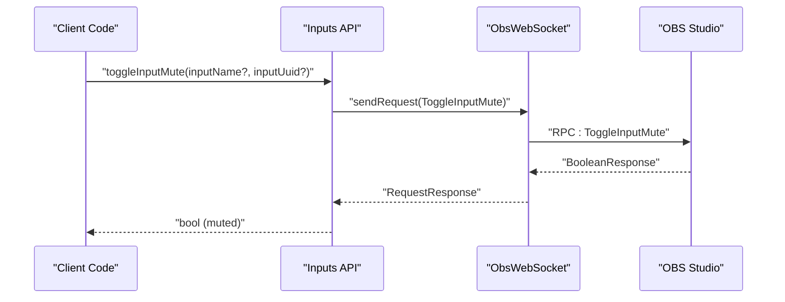
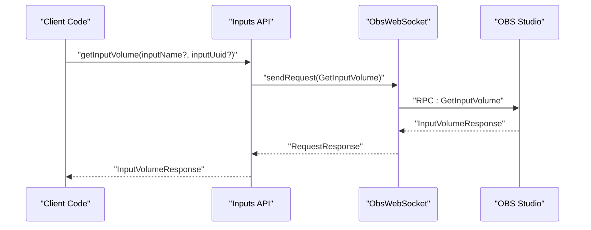
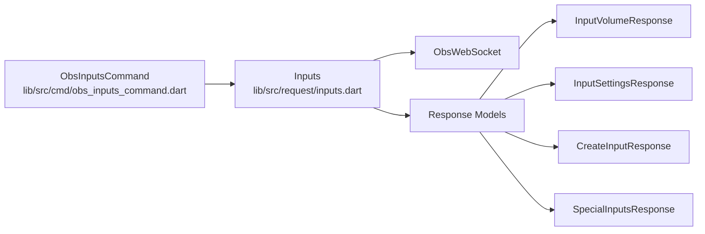

# Input Requests

<cite>
**Referenced Files in This Document**
- [README.md](file://README.md)
- [lib/request.dart](file://lib/request.dart)
- [lib/command.dart](file://lib/command.dart)
- [lib/src/request/inputs.dart](file://lib/src/request/inputs.dart)
- [lib/src/cmd/obs_inputs_command.dart](file://lib/src/cmd/obs_inputs_command.dart)
- [lib/src/model/response/input_volume_response.dart](file://lib/src/model/response/input_volume_response.dart)
- [lib/src/model/response/input_settings_response.dart](file://lib/src/model/response/input_settings_response.dart)
- [lib/src/model/response/create_input_response.dart](file://lib/src/model/response/create_input_response.dart)
- [lib/src/model/response/special_inputs_response.dart](file://lib/src/model/response/special_inputs_response.dart)
- [test/obs_websocket_inputs_test.dart](file://test/obs_websocket_inputs_test.dart)
</cite>

## Table of Contents
1. [Introduction](#introduction)
2. [Project Structure](#project-structure)
3. [Core Components](#core-components)
4. [Architecture Overview](#architecture-overview)
5. [Detailed Component Analysis](#detailed-component-analysis)
6. [Dependency Analysis](#dependency-analysis)
7. [Performance Considerations](#performance-considerations)
8. [Troubleshooting Guide](#troubleshooting-guide)
9. [Conclusion](#conclusion)

## Introduction
This document provides comprehensive API documentation for Input Requests that manage audio and video sources in OBS through the obs-websocket protocol. It covers input listing, property retrieval, volume control, mute operations, and input settings. It also documents audio routing, monitoring configurations, and input automation patterns. The scope includes the following requests:
- Input listing and discovery
- Property retrieval and manipulation
- Volume control (linear multiplier and decibel)
- Mute control (get, set, toggle)
- Audio balance, sync offset, monitor type, and track controls
- Input flags and custom configuration persistence
- Creation and deletion of inputs
- Automation patterns for audio routing and monitoring

## Project Structure
The input-related functionality is organized into:
- High-level request classes that encapsulate RPC calls
- CLI command wrappers for interactive usage
- Response model classes for typed parsing
- Tests validating request-response shapes

**Diagram sources**
- [lib/src/request/inputs.dart:1-389](file://lib/src/request/inputs.dart#L1-L389)
- [lib/src/cmd/obs_inputs_command.dart:1-492](file://lib/src/cmd/obs_inputs_command.dart#L1-L492)
- [lib/src/model/response/input_volume_response.dart:1-25](file://lib/src/model/response/input_volume_response.dart#L1-L25)
- [lib/src/model/response/input_settings_response.dart:1-25](file://lib/src/model/response/input_settings_response.dart#L1-L25)
- [lib/src/model/response/create_input_response.dart:1-25](file://lib/src/model/response/create_input_response.dart#L1-L25)
- [lib/src/model/response/special_inputs_response.dart:1-44](file://lib/src/model/response/special_inputs_response.dart#L1-L44)

**Section sources**
- [lib/request.dart:1-19](file://lib/request.dart#L1-L19)
- [lib/command.dart:1-20](file://lib/command.dart#L1-L20)

## Core Components
- Inputs: High-level API for input management, including listing, creation, deletion, renaming, default and current settings retrieval, and audio controls.
- ObsInputsCommand: CLI wrapper for input requests, enabling command-line invocation of input operations.
- Response models: Typed models for parsing RPC responses (volume, settings, creation, special inputs).

Key capabilities:
- List inputs and input kinds
- Retrieve special inputs (desktop/mic)
- Create and remove inputs
- Rename inputs
- Get default and current input settings
- Set input settings with overlay semantics
- Get/set mute state
- Toggle mute
- Get volume (multiplier and dB)
- Audio balance, sync offset, monitor type, tracks
- Flags and custom configuration persistence
- Automation patterns for audio routing and monitoring

**Section sources**
- [lib/src/request/inputs.dart:1-389](file://lib/src/request/inputs.dart#L1-L389)
- [lib/src/cmd/obs_inputs_command.dart:1-492](file://lib/src/cmd/obs_inputs_command.dart#L1-L492)
- [lib/src/model/response/input_volume_response.dart:1-25](file://lib/src/model/response/input_volume_response.dart#L1-L25)
- [lib/src/model/response/input_settings_response.dart:1-25](file://lib/src/model/response/input_settings_response.dart#L1-L25)
- [lib/src/model/response/create_input_response.dart:1-25](file://lib/src/model/response/create_input_response.dart#L1-L25)
- [lib/src/model/response/special_inputs_response.dart:1-44](file://lib/src/model/response/special_inputs_response.dart#L1-L44)

## Architecture Overview
The Inputs API follows a layered architecture:
- Client-facing API: Inputs class exposes methods for each request.
- Transport: ObsWebSocket sends JSON-RPC requests and receives responses.
- Parsing: Response models deserialize JSON payloads into Dart objects.
- CLI: ObsInputsCommand provides command-line access to the same operations.

```mermaid
sequenceDiagram
participant Client as "Client Code"
participant Inputs as "Inputs API<br/>lib/src/request/inputs.dart"
participant WS as "ObsWebSocket"
participant OBS as "OBS Studio"
Client->>Inputs : "getInputList(inputKind?)"
Inputs->>WS : "sendRequest(GetInputList)"
WS->>OBS : "RPC : GetInputList"
OBS-->>WS : "JSON response"
WS-->>Inputs : "RequestResponse"
Inputs-->>Client : "List<Input>"
```

**Diagram sources**
- [lib/src/request/inputs.dart:14-22](file://lib/src/request/inputs.dart#L14-L22)

**Section sources**
- [lib/src/request/inputs.dart:1-389](file://lib/src/request/inputs.dart#L1-L389)

## Detailed Component Analysis

### Input Listing and Discovery
- GetInputList: Retrieves all inputs optionally filtered by inputKind.
- GetInputKindList: Lists all available input kinds, with optional unversioned flag.
- GetSpecialInputs: Returns names of special inputs (desktop1/desktop2, mic1–mic4).

**Diagram sources**
- [lib/src/request/inputs.dart:51-56](file://lib/src/request/inputs.dart#L51-L56)

**Section sources**
- [lib/src/request/inputs.dart:9-57](file://lib/src/request/inputs.dart#L9-L57)
- [lib/src/model/response/special_inputs_response.dart:1-44](file://lib/src/model/response/special_inputs_response.dart#L1-L44)
- [test/obs_websocket_inputs_test.dart:45-62](file://test/obs_websocket_inputs_test.dart#L45-L62)

### Input Creation and Deletion
- CreateInput: Creates a new input and adds it as a scene item to a scene (by name or UUID).
- RemoveInput: Removes an input by name or UUID; removes all associated scene items.

**Diagram sources**
- [lib/src/request/inputs.dart:85-108](file://lib/src/request/inputs.dart#L85-L108)

**Section sources**
- [lib/src/request/inputs.dart:59-138](file://lib/src/request/inputs.dart#L59-L138)
- [lib/src/model/response/create_input_response.dart:1-25](file://lib/src/model/response/create_input_response.dart#L1-L25)
- [test/obs_websocket_inputs_test.dart:64-99](file://test/obs_websocket_inputs_test.dart#L64-L99)

### Input Renaming
- SetInputName: Renames an input by name or UUID.

**Section sources**
- [lib/src/request/inputs.dart:140-175](file://lib/src/request/inputs.dart#L140-L175)
- [test/obs_websocket_inputs_test.dart:101-114](file://test/obs_websocket_inputs_test.dart#L101-L114)

### Input Settings
- GetInputDefaultSettings: Retrieves default settings for an input kind.
- GetInputSettings: Retrieves current settings for an input (by name or UUID).
- SetInputSettings: Applies settings to an input, with overlay semantics.

**Diagram sources**
- [lib/src/request/inputs.dart:245-279](file://lib/src/request/inputs.dart#L245-L279)

**Section sources**
- [lib/src/request/inputs.dart:177-279](file://lib/src/request/inputs.dart#L177-L279)
- [lib/src/model/response/input_settings_response.dart:1-25](file://lib/src/model/response/input_settings_response.dart#L1-L25)
- [test/obs_websocket_inputs_test.dart:116-170](file://test/obs_websocket_inputs_test.dart#L116-L170)

### Audio Controls

#### Mute Operations
- GetInputMute: Retrieves mute state.
- SetInputMute: Sets mute state.
- ToggleInputMute: Toggles mute state.

**Diagram sources**
- [lib/src/request/inputs.dart:355-364](file://lib/src/request/inputs.dart#L355-L364)

**Section sources**
- [lib/src/request/inputs.dart:281-364](file://lib/src/request/inputs.dart#L281-L364)
- [test/obs_websocket_inputs_test.dart:172-223](file://test/obs_websocket_inputs_test.dart#L172-L223)

#### Volume Control
- GetInputVolume: Returns both linear multiplier and decibel values.

**Diagram sources**
- [lib/src/request/inputs.dart:379-387](file://lib/src/request/inputs.dart#L379-L387)

**Section sources**
- [lib/src/request/inputs.dart:366-387](file://lib/src/request/inputs.dart#L366-L387)
- [lib/src/model/response/input_volume_response.dart:1-25](file://lib/src/model/response/input_volume_response.dart#L1-L25)
- [test/obs_websocket_inputs_test.dart:225-242](file://test/obs_websocket_inputs_test.dart#L225-L242)

#### Audio Balance
- GetInputAudioBalance: Retrieves audio balance.
- SetInputAudioBalance: Sets audio balance.

**Section sources**
- [README.md:169-170](file://README.md#L169-L170)

#### Audio Sync Offset
- GetInputAudioSyncOffset: Retrieves audio sync offset.
- SetInputAudioSyncOffset: Sets audio sync offset.

**Section sources**
- [README.md:171-172](file://README.md#L171-L172)

#### Audio Monitor Type
- GetInputAudioMonitorType: Retrieves monitor type.
- SetInputAudioMonitorType: Sets monitor type.

**Section sources**
- [README.md:173-174](file://README.md#L173-L174)

#### Audio Tracks
- GetInputAudioTracks: Retrieves audio tracks.
- SetInputAudioTracks: Sets audio tracks.

**Section sources**
- [README.md:175-176](file://README.md#L175-L176)

#### Properties Dialog Interaction
- PressInputPropertiesButton: Simulates pressing a properties button in the input properties dialog.

**Section sources**
- [README.md:178-179](file://README.md#L178-L179)

### Input Flags and Custom Configuration
- GetInputFlags: Retrieves input flags.
- SetInputFlags: Sets input flags.
- GetInputCustomConfig: Retrieves custom configuration.
- SaveInputCustomConfig: Saves custom configuration.

**Section sources**
- [README.md:169-170](file://README.md#L169-L170)

### Audio Routing and Monitoring Patterns
Common automation patterns:
- Route desktop and microphone inputs to separate mixer channels for isolation.
- Use monitor type selection to route input to headphones vs. speakers.
- Apply mute/toggle automation for live switching.
- Adjust balance for stereo sources and sync offsets for lip sync correction.
- Persist custom configurations per input kind for consistent behavior.

[No sources needed since this section provides general guidance]

## Dependency Analysis
The Inputs API depends on:
- ObsWebSocket for transport and request/response handling
- Response models for typed parsing
- CLI command wrappers for command-line usage

**Diagram sources**
- [lib/src/request/inputs.dart:1-389](file://lib/src/request/inputs.dart#L1-L389)
- [lib/src/cmd/obs_inputs_command.dart:1-492](file://lib/src/cmd/obs_inputs_command.dart#L1-L492)
- [lib/src/model/response/input_volume_response.dart:1-25](file://lib/src/model/response/input_volume_response.dart#L1-L25)
- [lib/src/model/response/input_settings_response.dart:1-25](file://lib/src/model/response/input_settings_response.dart#L1-L25)
- [lib/src/model/response/create_input_response.dart:1-25](file://lib/src/model/response/create_input_response.dart#L1-L25)
- [lib/src/model/response/special_inputs_response.dart:1-44](file://lib/src/model/response/special_inputs_response.dart#L1-L44)

**Section sources**
- [lib/src/request/inputs.dart:1-389](file://lib/src/request/inputs.dart#L1-L389)
- [lib/src/cmd/obs_inputs_command.dart:1-492](file://lib/src/cmd/obs_inputs_command.dart#L1-L492)

## Performance Considerations
- Batch operations: Group related requests (e.g., mute + volume) to minimize round-trips.
- Selective updates: Use overlay settings to avoid resetting defaults unnecessarily.
- Efficient polling: Cache input lists and settings when appropriate; invalidate on events.
- Event-driven updates: Subscribe to input-related events to react to changes rather than polling continuously.

[No sources needed since this section provides general guidance]

## Troubleshooting Guide
Common issues and resolutions:
- Missing input identifier: Many requests require either inputName or inputUuid; ensure at least one is provided.
- Authentication and permissions: Ensure the WebSocket connection is established with proper credentials.
- Validation errors: CLI wrappers validate parameters; check usage messages for required fields.
- Response parsing: Use the provided response models to parse structured data reliably.

**Section sources**
- [lib/src/request/inputs.dart:127-130](file://lib/src/request/inputs.dart#L127-L130)
- [lib/src/request/inputs.dart:212-214](file://lib/src/request/inputs.dart#L212-L214)
- [lib/src/request/inputs.dart:311-313](file://lib/src/request/inputs.dart#L311-L313)
- [lib/src/cmd/obs_inputs_command.dart:199-204](file://lib/src/cmd/obs_inputs_command.dart#L199-L204)
- [lib/src/cmd/obs_inputs_command.dart:305-310](file://lib/src/cmd/obs_inputs_command.dart#L305-L310)
- [lib/src/cmd/obs_inputs_command.dart:430-435](file://lib/src/cmd/obs_inputs_command.dart#L430-L435)
- [lib/src/cmd/obs_inputs_command.dart:475-480](file://lib/src/cmd/obs_inputs_command.dart#L475-L480)

## Conclusion
The Inputs API provides a robust, typed interface for managing OBS inputs, including listing, creation, deletion, renaming, and audio controls. The CLI wrappers enable practical automation from the command line. By leveraging response models and event subscriptions, developers can build reliable automation patterns for audio routing, monitoring, and input lifecycle management.