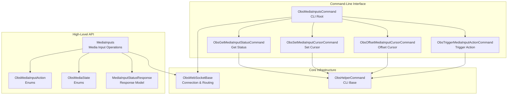
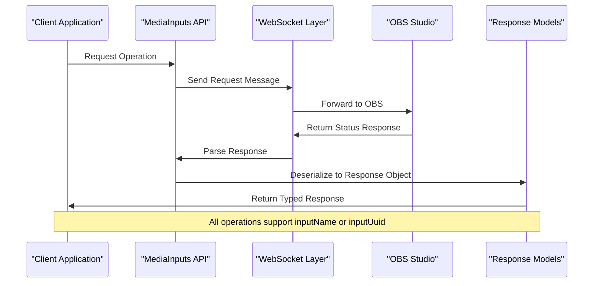
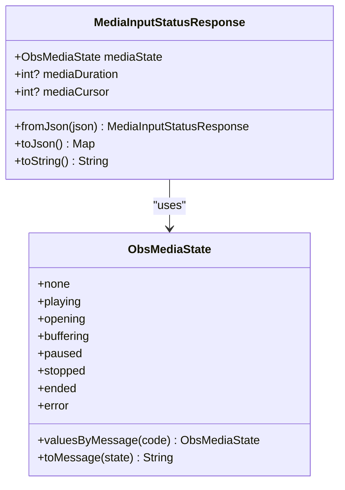
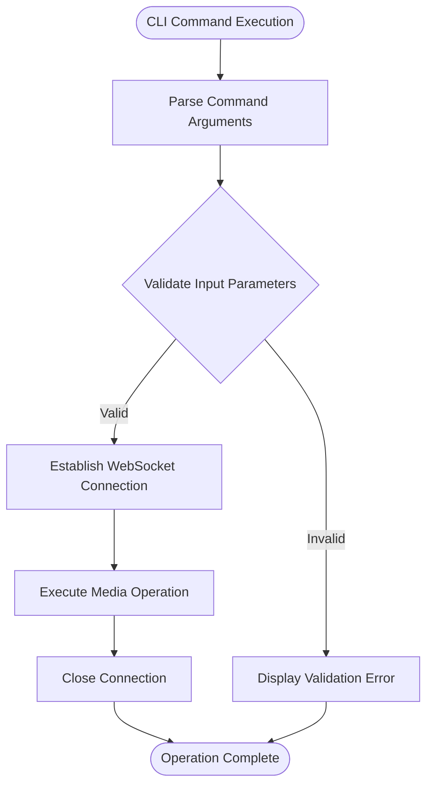
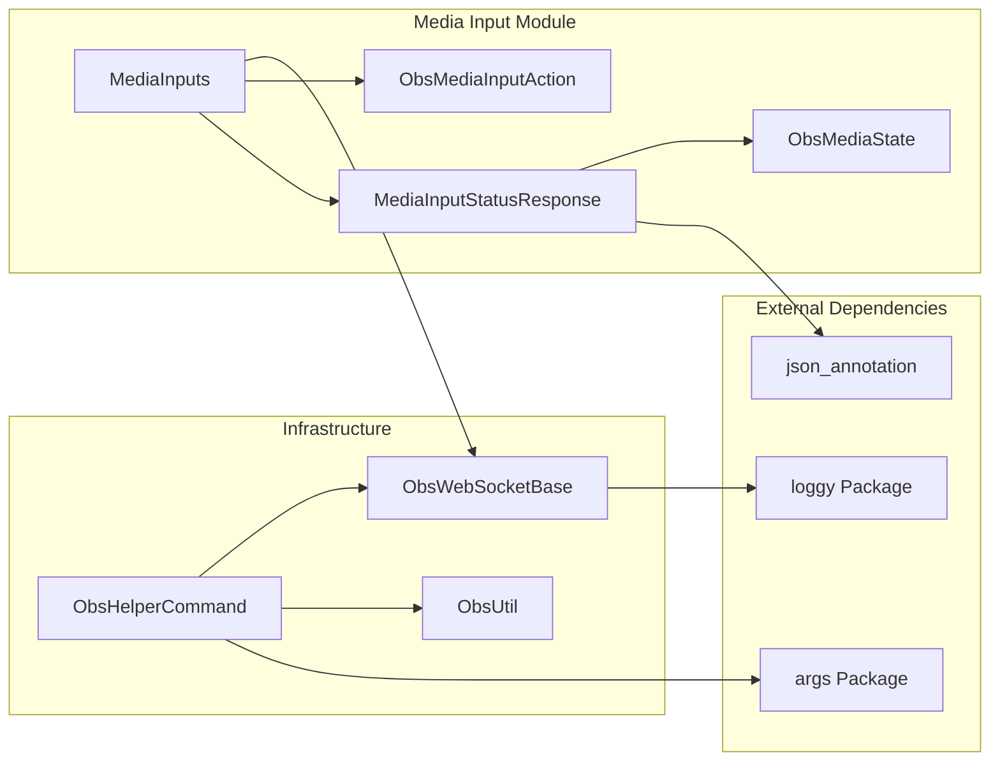

# Media Input Requests

<cite>
**Referenced Files in This Document**
- [README.md](file://README.md)
- [obs_websocket.dart](file://lib/obs_websocket.dart)
- [request.dart](file://lib/request.dart)
- [command.dart](file://lib/command.dart)
- [media_inputs.dart](file://lib/src/request/media_inputs.dart)
- [obs_media_inputs_command.dart](file://lib/src/cmd/obs_media_inputs_command.dart)
- [obs_helper_command.dart](file://lib/src/cmd/obs_helper_command.dart)
- [obs_media_input_action.dart](file://lib/src/enum/obs_media_input_action.dart)
- [obs_media_state.dart](file://lib/src/enum/obs_media_state.dart)
- [media_input_status_response.dart](file://lib/src/model/response/media_input_status_response.dart)
- [obs_websocket_media_inputs_test.dart](file://test/obs_websocket_media_inputs_test.dart)
- [obs_websocket_media_inputs_command_test.dart](file://test/obs_websocket_media_inputs_command_test.dart)
- [obs_websocket_media_inputs_validation_test.dart](file://test/obs_websocket_media_inputs_validation_test.dart)
- [obs_websocket_base.dart](file://lib/src/obs_websocket_base.dart)
</cite>

## Table of Contents
1. [Introduction](#introduction)
2. [Project Structure](#project-structure)
3. [Core Components](#core-components)
4. [Architecture Overview](#architecture-overview)
5. [Detailed Component Analysis](#detailed-component-analysis)
6. [Dependency Analysis](#dependency-analysis)
7. [Performance Considerations](#performance-considerations)
8. [Troubleshooting Guide](#troubleshooting-guide)
9. [Conclusion](#conclusion)

## Introduction
This document provides comprehensive API documentation for Media Input Requests, focusing on media playback and control within OBS Studio via the obs-websocket protocol. It covers media input creation, playback control, state management, and media-specific operations. The documentation includes media file handling, playback position control, loop settings, and media source configuration. It also provides examples for automated media playlists, synchronized media playback, and media source automation, along with media format support, performance considerations, and troubleshooting common media playback issues.

## Project Structure
The Media Input Requests functionality is organized into several key areas:
- High-level API wrapper exposing media input operations
- Command-line interface for media input manipulation
- Enumerations for media actions and states
- Response models for media status
- Comprehensive test suites validating behavior and error handling

**Diagram sources**
- [media_inputs.dart:1-134](file://lib/src/request/media_inputs.dart#L1-L134)
- [obs_media_inputs_command.dart:1-310](file://lib/src/cmd/obs_media_inputs_command.dart#L1-L310)
- [obs_helper_command.dart:1-44](file://lib/src/cmd/obs_helper_command.dart#L1-L44)
- [obs_websocket_base.dart:21-105](file://lib/src/obs_websocket_base.dart#L21-L105)

**Section sources**
- [README.md:249-262](file://README.md#L249-L262)
- [request.dart:1-19](file://lib/request.dart#L1-L19)
- [command.dart:1-20](file://lib/command.dart#L1-L20)

## Core Components
The Media Input Requests API consists of four primary operations that enable comprehensive media playback control:

### Media Input Status Management
The `getMediaInputStatus` operation retrieves the current state of a media input, including playback state, duration, and cursor position. This operation supports both input name and UUID identification methods, providing flexibility in targeting specific media sources.

### Playback Position Control
Two operations manage playback positioning:
- `setMediaInputCursor`: Sets the absolute cursor position in milliseconds
- `offsetMediaInputCursor`: Adjusts the cursor position by a specified offset value

Both operations accept either input name or UUID identifiers and perform bounds checking where appropriate.

### Media Action Triggering
The `triggerMediaInputAction` operation executes predefined actions on media inputs, supporting play, pause, stop, restart, next, previous, and none operations.

**Section sources**
- [media_inputs.dart:9-133](file://lib/src/request/media_inputs.dart#L9-L133)
- [obs_media_input_action.dart:1-14](file://lib/src/enum/obs_media_input_action.dart#L1-L14)
- [obs_media_state.dart:1-28](file://lib/src/enum/obs_media_state.dart#L1-L28)

## Architecture Overview
The Media Input Requests architecture follows a layered approach with clear separation of concerns:

**Diagram sources**
- [media_inputs.dart:32-48](file://lib/src/request/media_inputs.dart#L32-L48)
- [obs_websocket_base.dart:171-200](file://lib/src/obs_websocket_base.dart#L171-L200)

The architecture ensures type safety through dedicated response models and maintains backward compatibility with the underlying obs-websocket protocol.

**Section sources**
- [obs_websocket_base.dart:21-105](file://lib/src/obs_websocket_base.dart#L21-L105)
- [media_input_status_response.dart:8-37](file://lib/src/model/response/media_input_status_response.dart#L8-L37)

## Detailed Component Analysis

### Media Input Status Response Model
The `MediaInputStatusResponse` model encapsulates media playback information with robust serialization support:

**Diagram sources**
- [media_input_status_response.dart:8-37](file://lib/src/model/response/media_input_status_response.dart#L8-L37)
- [obs_media_state.dart:1-28](file://lib/src/enum/obs_media_state.dart#L1-L28)

The response model supports null values for duration and cursor when the media is stopped or in error states, providing accurate state representation.

**Section sources**
- [media_input_status_response.dart:8-37](file://lib/src/model/response/media_input_status_response.dart#L8-L37)
- [obs_media_state.dart:15-27](file://lib/src/enum/obs_media_state.dart#L15-L27)

### Media Input Actions Enumeration
The `ObsMediaInputAction` enumeration defines all supported media operations:

| Action | Code | Description |
|--------|------|-------------|
| none | OBS_WEBSOCKET_MEDIA_INPUT_ACTION_NONE | No action performed |
| play | OBS_WEBSOCKET_MEDIA_INPUT_ACTION_PLAY | Start or resume media playback |
| pause | OBS_WEBSOCKET_MEDIA_INPUT_ACTION_PAUSE | Pause current media playback |
| stop | OBS_WEBSOCKET_MEDIA_INPUT_ACTION_STOP | Stop media playback and reset cursor |
| restart | OBS_WEBSOCKET_MEDIA_INPUT_ACTION_RESTART | Restart current media from beginning |
| next | OBS_WEBSOCKET_MEDIA_INPUT_ACTION_NEXT | Advance to next media item |
| previous | OBS_WEBSOCKET_MEDIA_INPUT_ACTION_PREVIOUS | Return to previous media item |

**Section sources**
- [obs_media_input_action.dart:1-14](file://lib/src/enum/obs_media_input_action.dart#L1-L14)

### Command-Line Interface Implementation
The CLI provides comprehensive coverage of all media input operations with robust validation:

**Diagram sources**
- [obs_media_inputs_command.dart:94-157](file://lib/src/cmd/obs_media_inputs_command.dart#L94-L157)

The CLI enforces strict parameter validation, ensuring operation safety and providing clear error messages for invalid inputs.

**Section sources**
- [obs_media_inputs_command.dart:1-310](file://lib/src/cmd/obs_media_inputs_command.dart#L1-L310)

### API Method Specifications

#### Get Media Input Status
Retrieves current media input status including playback state, duration, and cursor position.

**Request Parameters:**
- `inputName` (optional): Name of the media input
- `inputUuid` (optional): UUID of the media input

**Response Fields:**
- `mediaState`: Current playback state
- `mediaDuration`: Total media duration in milliseconds (nullable)
- `mediaCursor`: Current playback position in milliseconds (nullable)

#### Set Media Input Cursor
Sets the absolute cursor position for a media input.

**Request Parameters:**
- `inputName` (optional): Name of the media input
- `inputUuid` (optional): UUID of the media input
- `mediaCursor` (required): New cursor position in milliseconds (must be ≥ 0)

#### Offset Media Input Cursor
Adjusts the current cursor position by a specified offset.

**Request Parameters:**
- `inputName` (optional): Name of the media input
- `inputUuid` (optional): UUID of the media input
- `mediaCursorOffset` (required): Offset value in milliseconds (can be negative)

#### Trigger Media Input Action
Executes predefined actions on media inputs.

**Request Parameters:**
- `inputName` (optional): Name of the media input
- `inputUuid` (optional): UUID of the media input
- `mediaAction` (required): Action to perform (play, pause, stop, etc.)

**Section sources**
- [media_inputs.dart:32-133](file://lib/src/request/media_inputs.dart#L32-L133)

## Dependency Analysis
The Media Input Requests module exhibits clean dependency relationships with minimal coupling to external components:

**Diagram sources**
- [media_inputs.dart:1-134](file://lib/src/request/media_inputs.dart#L1-L134)
- [obs_media_inputs_command.dart:1-310](file://lib/src/cmd/obs_media_inputs_command.dart#L1-L310)
- [obs_helper_command.dart:1-44](file://lib/src/cmd/obs_helper_command.dart#L1-L44)

The dependency graph shows clear separation between business logic (MediaInputs) and infrastructure concerns (connection management, CLI), facilitating maintainability and testing.

**Section sources**
- [obs_websocket_base.dart:56-105](file://lib/src/obs_websocket_base.dart#L56-L105)
- [obs_helper_command.dart:8-44](file://lib/src/cmd/obs_helper_command.dart#L8-L44)

## Performance Considerations
Media Input Requests are designed for efficient operation with minimal overhead:

### Network Efficiency
- All operations use lightweight JSON messages
- Response objects are compact with nullable fields for optimal bandwidth usage
- No polling required for status updates (events-based architecture)

### Memory Management
- Response objects use lazy deserialization
- Nullable fields prevent unnecessary memory allocation for inactive states
- Enumerations provide constant-time lookup performance

### Scalability
- Batch operations supported through underlying request batching
- Non-blocking I/O ensures responsive operation under load
- Connection pooling available for multiple concurrent operations

## Troubleshooting Guide

### Common Issues and Solutions

#### Input Not Found Errors
**Symptoms:** Operations return "Input not found" errors
**Causes:** Incorrect input name/UUID, media input doesn't exist
**Solutions:**
- Verify input exists using `GetInputList` operation
- Check case sensitivity in input names
- Confirm UUID format matches OBS-generated values

#### Invalid Parameter Errors
**Symptoms:** "Invalid media-cursor" or similar validation errors
**Causes:** Negative cursor values, malformed integers, missing parameters
**Solutions:**
- Ensure cursor values are non-negative for set operations
- Verify integer format without special characters
- Provide at least one of input-name or input-uuid

#### State Mismatch Issues
**Symptoms:** Unexpected playback state behavior
**Causes:** Media source configuration issues, codec problems
**Solutions:**
- Check media file format compatibility
- Verify media source settings in OBS
- Monitor media state transitions using event handlers

#### Performance Degradation
**Symptoms:** Slow response times, dropped frames
**Causes:** Large media files, insufficient system resources
**Solutions:**
- Optimize media file sizes and formats
- Ensure adequate system resources
- Consider media caching strategies

**Section sources**
- [obs_websocket_media_inputs_test.dart:379-441](file://test/obs_websocket_media_inputs_test.dart#L379-L441)
- [obs_websocket_media_inputs_validation_test.dart:70-258](file://test/obs_websocket_media_inputs_validation_test.dart#L70-L258)

## Conclusion
The Media Input Requests API provides a comprehensive, type-safe interface for controlling media playback in OBS Studio. Its design emphasizes reliability, performance, and ease of use through well-defined operations, robust validation, and clear error handling. The modular architecture supports both programmatic integration and command-line usage, while the extensive test coverage ensures dependable operation across various scenarios.

The API's support for both input names and UUIDs provides flexibility in targeting media sources, while the state management capabilities enable sophisticated playback automation. With proper error handling and performance considerations, the Media Input Requests API serves as a solid foundation for building advanced media playback solutions.