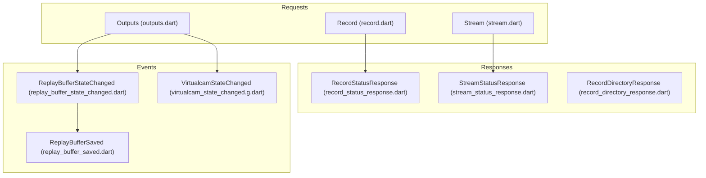
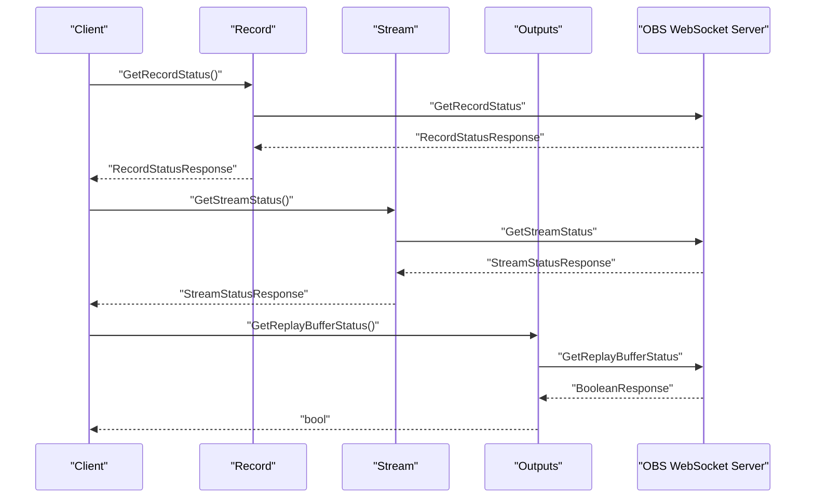
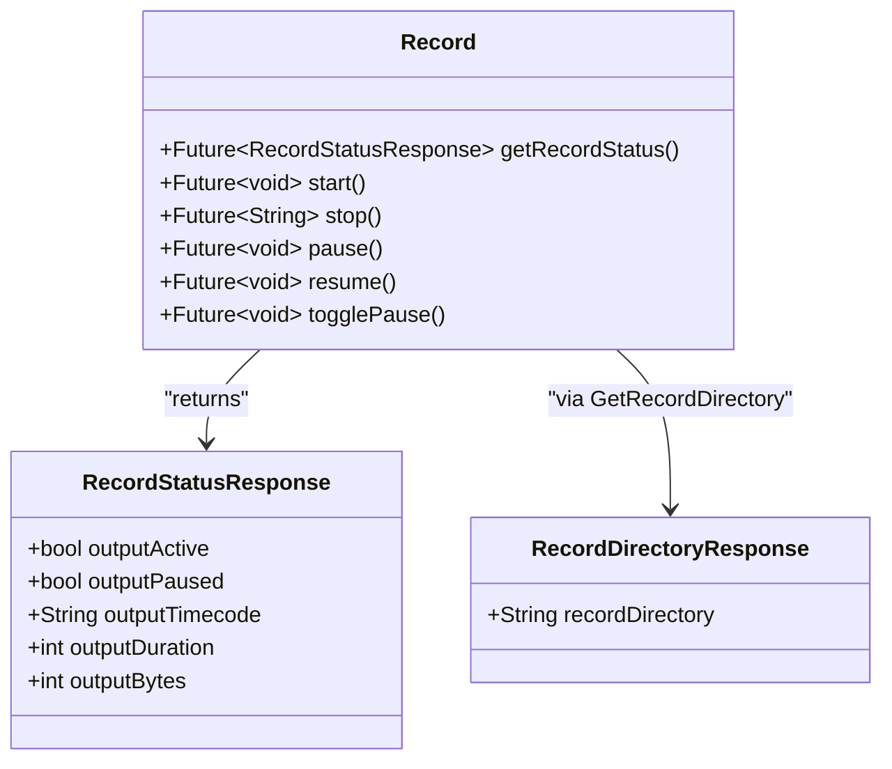
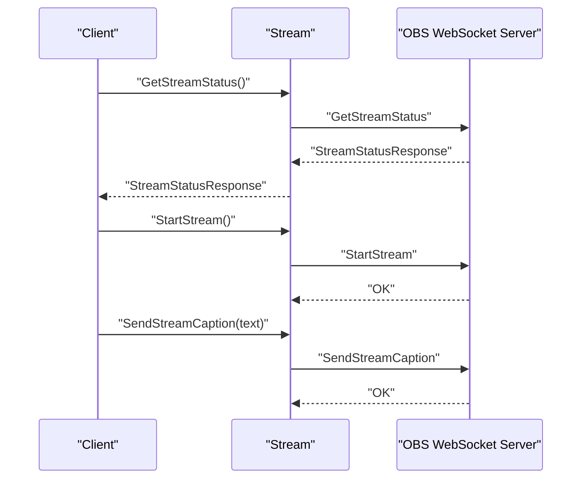
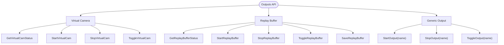
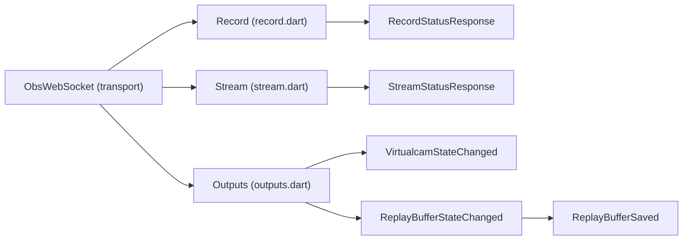

# Output Requests

<cite>
**Referenced Files in This Document**
- [request.dart](file://lib/request.dart)
- [outputs.dart](file://lib/src/request/outputs.dart)
- [record.dart](file://lib/src/request/record.dart)
- [stream.dart](file://lib/src/request/stream.dart)
- [record_status_response.dart](file://lib/src/model/response/record_status_response.dart)
- [stream_status_response.dart](file://lib/src/model/response/stream_status_response.dart)
- [record_directory_response.dart](file://lib/src/model/response/record_directory_response.dart)
- [replay_buffer_state_changed.dart](file://lib/src/model/event/outputs/replay_buffer_state_changed.dart)
- [replay_buffer_saved.dart](file://lib/src/model/event/outputs/replay_buffer_saved.dart)
- [virtualcam_state_changed.g.dart](file://lib/src/model/event/outputs/virtualcam_state_changed.g.dart)
- [obs_mcp_server.dart](file://lib/src/mcp/obs_mcp_server.dart)
- [obs_websocket_outputs_test.dart](file://test/obs_websocket_outputs_test.dart)
- [obs_websocket_stream_test.dart](file://test/obs_websocket_stream_test.dart)
</cite>

## Table of Contents
1. [Introduction](#introduction)
2. [Project Structure](#project-structure)
3. [Core Components](#core-components)
4. [Architecture Overview](#architecture-overview)
5. [Detailed Component Analysis](#detailed-component-analysis)
6. [Dependency Analysis](#dependency-analysis)
7. [Performance Considerations](#performance-considerations)
8. [Troubleshooting Guide](#troubleshooting-guide)
9. [Conclusion](#conclusion)
10. [Appendices](#appendices)

## Introduction
This document provides comprehensive API documentation for Output Requests in the OBS WebSocket client library. It covers recording, streaming, and virtual camera operations, including status retrieval, control toggles, and replay buffer management. It also documents output state monitoring, automatic recording triggers, stream quality management, and replay buffer automation. Examples demonstrate automated recording workflows, stream interruption handling, and virtual camera integration patterns.

## Project Structure
The Output Requests functionality is organized under dedicated request classes and response model classes. The primary modules are:
- Recording: status queries, start/stop/pause/resume controls
- Streaming: status queries, start/stop/toggle, caption injection
- Outputs: generic output control, virtual camera, and replay buffer operations

**Diagram sources**
- [record.dart:1-128](file://lib/src/request/record.dart#L1-L128)
- [stream.dart:1-94](file://lib/src/request/stream.dart#L1-L94)
- [outputs.dart:1-158](file://lib/src/request/outputs.dart#L1-L158)
- [record_status_response.dart:1-31](file://lib/src/model/response/record_status_response.dart#L1-L31)
- [stream_status_response.dart:1-37](file://lib/src/model/response/stream_status_response.dart#L1-L37)
- [record_directory_response.dart:1-22](file://lib/src/model/response/record_directory_response.dart#L1-L22)
- [replay_buffer_state_changed.dart:1-31](file://lib/src/model/event/outputs/replay_buffer_state_changed.dart#L1-L31)
- [replay_buffer_saved.dart:1-25](file://lib/src/model/event/outputs/replay_buffer_saved.dart#L1-L25)
- [virtualcam_state_changed.g.dart:1-21](file://lib/src/model/event/outputs/virtualcam_state_changed.g.dart#L1-L21)

**Section sources**
- [request.dart:1-19](file://lib/request.dart#L1-L19)
- [record.dart:1-128](file://lib/src/request/record.dart#L1-L128)
- [stream.dart:1-94](file://lib/src/request/stream.dart#L1-L94)
- [outputs.dart:1-158](file://lib/src/request/outputs.dart#L1-L158)

## Core Components
This section documents the primary Output Requests APIs grouped by functionality.

- Recording
  - Status: GetRecordStatus -> RecordStatusResponse
  - Control: StartRecord, StopRecord, PauseRecord, ResumeRecord, ToggleRecord
  - Pause/Resume: ToggleRecordPause, PauseRecord, ResumeRecord
  - Directory: GetRecordDirectory -> RecordDirectoryResponse

- Streaming
  - Status: GetStreamStatus -> StreamStatusResponse
  - Control: StartStream, StopStream, ToggleStream
  - Caption: SendStreamCaption(captionText)

- Outputs (generic)
  - Status: GetReplayBufferStatus, GetVirtualCamStatus
  - Control: StartReplayBuffer, StopReplayBuffer, ToggleReplayBuffer, SaveReplayBuffer
  - Generic: StartOutput(outputName), StopOutput(outputName), ToggleOutput(outputName)

- Output Events
  - Replay Buffer: ReplayBufferStateChanged, ReplayBufferSaved
  - Virtual Camera: VirtualcamStateChanged

**Section sources**
- [record.dart:1-128](file://lib/src/request/record.dart#L1-L128)
- [stream.dart:1-94](file://lib/src/request/stream.dart#L1-L94)
- [outputs.dart:1-158](file://lib/src/request/outputs.dart#L1-L158)
- [record_status_response.dart:1-31](file://lib/src/model/response/record_status_response.dart#L1-L31)
- [stream_status_response.dart:1-37](file://lib/src/model/response/stream_status_response.dart#L1-L37)
- [record_directory_response.dart:1-22](file://lib/src/model/response/record_directory_response.dart#L1-L22)
- [replay_buffer_state_changed.dart:1-31](file://lib/src/model/event/outputs/replay_buffer_state_changed.dart#L1-L31)
- [replay_buffer_saved.dart:1-25](file://lib/src/model/event/outputs/replay_buffer_saved.dart#L1-L25)
- [virtualcam_state_changed.g.dart:1-21](file://lib/src/model/event/outputs/virtualcam_state_changed.g.dart#L1-L21)

## Architecture Overview
The Output Requests architecture follows a layered design:
- Request classes encapsulate RPC calls for recording, streaming, and outputs
- Response models parse server-provided data into typed Dart objects
- Event models represent asynchronous state changes for replay buffer and virtual camera
- MCP server exposes convenience tools for common operations

**Diagram sources**
- [record.dart:28-32](file://lib/src/request/record.dart#L28-L32)
- [stream.dart:28-32](file://lib/src/request/stream.dart#L28-L32)
- [outputs.dart:56-62](file://lib/src/request/outputs.dart#L56-L62)

## Detailed Component Analysis

### Recording API
The Recording API manages local recording output lifecycle and status.

- GetRecordStatus
  - Purpose: Retrieve recording activity, pause state, timecode, duration, and byte count
  - Response: RecordStatusResponse with fields: outputActive, outputPaused, outputTimecode, outputDuration, outputBytes
  - Complexity: 2/5
  - RPC Version: 1
  - Added in: v5.0.0

- StartRecord / StopRecord
  - Purpose: Start and stop recording
  - StopRecord returns the recorded file path

- PauseRecord / ResumeRecord / ToggleRecordPause
  - Purpose: Control recording pause state

- GetRecordDirectory
  - Purpose: Retrieve the configured recording directory
  - Response: RecordDirectoryResponse with recordDirectory field

**Diagram sources**
- [record.dart:1-128](file://lib/src/request/record.dart#L1-L128)
- [record_status_response.dart:1-31](file://lib/src/model/response/record_status_response.dart#L1-L31)
- [record_directory_response.dart:1-22](file://lib/src/model/response/record_directory_response.dart#L1-L22)

**Section sources**
- [record.dart:1-128](file://lib/src/request/record.dart#L1-L128)
- [record_status_response.dart:1-31](file://lib/src/model/response/record_status_response.dart#L1-L31)
- [record_directory_response.dart:1-22](file://lib/src/model/response/record_directory_response.dart#L1-L22)

### Streaming API
The Streaming API manages live streaming output and related metrics.

- GetStreamStatus
  - Purpose: Retrieve streaming activity, reconnection state, congestion, frame counters, duration, and throughput
  - Response: StreamStatusResponse with fields: outputActive, outputReconnecting, outputTimecode, outputDuration, outputCongestion, outputBytes, outputSkippedFrames, outputTotalFrames
  - Complexity: 2/5
  - RPC Version: 1
  - Added in: v5.0.0

- StartStream / StopStream / ToggleStream
  - Purpose: Control streaming lifecycle

- SendStreamCaption
  - Purpose: Inject CEA-608 caption text into the stream

**Diagram sources**
- [stream.dart:28-32](file://lib/src/request/stream.dart#L28-L32)
- [stream.dart:66-67](file://lib/src/request/stream.dart#L66-L67)
- [stream.dart:89-92](file://lib/src/request/stream.dart#L89-L92)

**Section sources**
- [stream.dart:1-94](file://lib/src/request/stream.dart#L1-L94)
- [stream_status_response.dart:1-37](file://lib/src/model/response/stream_status_response.dart#L1-L37)
- [obs_websocket_stream_test.dart:1-26](file://test/obs_websocket_stream_test.dart#L1-L26)

### Outputs API
The Outputs API provides control over generic outputs, virtual camera, and replay buffer.

- Virtual Camera
  - GetVirtualCamStatus: returns boolean
  - StartVirtualCam, StopVirtualCam, ToggleVirtualCam

- Replay Buffer
  - GetReplayBufferStatus: returns boolean
  - StartReplayBuffer, StopReplayBuffer, ToggleReplayBuffer, SaveReplayBuffer

- Generic Output Control
  - StartOutput(outputName), StopOutput(outputName), ToggleOutput(outputName)

**Diagram sources**
- [outputs.dart:1-158](file://lib/src/request/outputs.dart#L1-L158)

**Section sources**
- [outputs.dart:1-158](file://lib/src/request/outputs.dart#L1-L158)
- [obs_websocket_outputs_test.dart:1-24](file://test/obs_websocket_outputs_test.dart#L1-L24)

### Output Events
Asynchronous state changes are exposed via events.

- ReplayBufferStateChanged
  - Fields: outputActive, outputState
- ReplayBufferSaved
  - Field: savedReplayPath
- VirtualcamStateChanged
  - Fields: outputActive, outputState

These events enable reactive automation and monitoring of output state transitions.

**Section sources**
- [replay_buffer_state_changed.dart:1-31](file://lib/src/model/event/outputs/replay_buffer_state_changed.dart#L1-L31)
- [replay_buffer_saved.dart:1-25](file://lib/src/model/event/outputs/replay_buffer_saved.dart#L1-L25)
- [virtualcam_state_changed.g.dart:1-21](file://lib/src/model/event/outputs/virtualcam_state_changed.g.dart#L1-L21)

## Dependency Analysis
Output Requests depend on the core WebSocket transport and share common response parsing patterns.

**Diagram sources**
- [record.dart:1-128](file://lib/src/request/record.dart#L1-L128)
- [stream.dart:1-94](file://lib/src/request/stream.dart#L1-L94)
- [outputs.dart:1-158](file://lib/src/request/outputs.dart#L1-L158)
- [record_status_response.dart:1-31](file://lib/src/model/response/record_status_response.dart#L1-L31)
- [stream_status_response.dart:1-37](file://lib/src/model/response/stream_status_response.dart#L1-L37)
- [virtualcam_state_changed.g.dart:1-21](file://lib/src/model/event/outputs/virtualcam_state_changed.g.dart#L1-L21)
- [replay_buffer_state_changed.dart:1-31](file://lib/src/model/event/outputs/replay_buffer_state_changed.dart#L1-L31)
- [replay_buffer_saved.dart:1-25](file://lib/src/model/event/outputs/replay_buffer_saved.dart#L1-L25)

**Section sources**
- [record.dart:1-128](file://lib/src/request/record.dart#L1-L128)
- [stream.dart:1-94](file://lib/src/request/stream.dart#L1-L94)
- [outputs.dart:1-158](file://lib/src/request/outputs.dart#L1-L158)

## Performance Considerations
- Status polling: Use GetRecordStatus and GetStreamStatus judiciously to avoid excessive network overhead. Batch checks or subscribe to events where possible.
- Replay buffer saves: SaveReplayBuffer flushes buffered frames; schedule saves during natural pauses or after significant events to minimize latency.
- Virtual camera: Frequent toggling can cause device contention; cache state and coalesce operations.
- Stream quality: Monitor outputCongestion and skipped frames from StreamStatusResponse to adapt bitrate or resolution dynamically.

## Troubleshooting Guide
Common issues and resolutions:
- ToggleReplayBuffer failures: The operation throws an exception on non-OK status codes. Inspect requestStatus.comment for details.
- Stream interruptions: Check outputReconnecting and outputCongestion in StreamStatusResponse to detect and recover from network issues.
- Virtual camera conflicts: Ensure no other applications use the virtual camera device; verify outputActive state via VirtualcamStateChanged events.

**Section sources**
- [outputs.dart:74-76](file://lib/src/request/outputs.dart#L74-L76)
- [stream_status_response.dart:1-37](file://lib/src/model/response/stream_status_response.dart#L1-L37)
- [virtualcam_state_changed.g.dart:1-21](file://lib/src/model/event/outputs/virtualcam_state_changed.g.dart#L1-L21)

## Conclusion
The Output Requests API provides robust control over recording, streaming, and virtual camera outputs, along with replay buffer management. By combining status queries, event-driven state changes, and targeted control operations, developers can build resilient automation workflows for live streaming and on-demand recording.

## Appendices

### API Reference Summary
- Recording
  - GetRecordStatus -> RecordStatusResponse
  - StartRecord, StopRecord, PauseRecord, ResumeRecord, ToggleRecord
  - ToggleRecordPause, PauseRecord, ResumeRecord
  - GetRecordDirectory -> RecordDirectoryResponse

- Streaming
  - GetStreamStatus -> StreamStatusResponse
  - StartStream, StopStream, ToggleStream
  - SendStreamCaption(captionText)

- Outputs
  - GetReplayBufferStatus, StartReplayBuffer, StopReplayBuffer, ToggleReplayBuffer, SaveReplayBuffer
  - GetVirtualCamStatus, StartVirtualCam, StopVirtualCam, ToggleVirtualCam
  - StartOutput(outputName), StopOutput(outputName), ToggleOutput(outputName)

- Events
  - ReplayBufferStateChanged, ReplayBufferSaved
  - VirtualcamStateChanged

### Example Workflows

- Automated Recording Workflow
  - Trigger: Start recording when a scene becomes active
  - Monitor: Poll GetRecordStatus periodically or react to RecordStatusResponse changes
  - Pause/Resume: ToggleRecordPause for brief interruptions
  - Finalize: StopRecord and capture the returned file path for post-processing

- Stream Interruption Handling
  - Detect: Observe outputReconnecting and outputCongestion in StreamStatusResponse
  - Mitigate: Reduce bitrate or temporarily suspend non-essential streams
  - Recover: Retry ToggleStream or restart StartStream after stabilization

- Virtual Camera Integration Pattern
  - Activate: StartVirtualCam when a virtual camera source is enabled
  - Deactivate: StopVirtualCam when the source is disabled
  - Monitor: Subscribe to VirtualcamStateChanged events for UI updates

**Section sources**
- [record.dart:1-128](file://lib/src/request/record.dart#L1-L128)
- [stream.dart:1-94](file://lib/src/request/stream.dart#L1-L94)
- [outputs.dart:1-158](file://lib/src/request/outputs.dart#L1-L158)
- [obs_mcp_server.dart:609-734](file://lib/src/mcp/obs_mcp_server.dart#L609-L734)