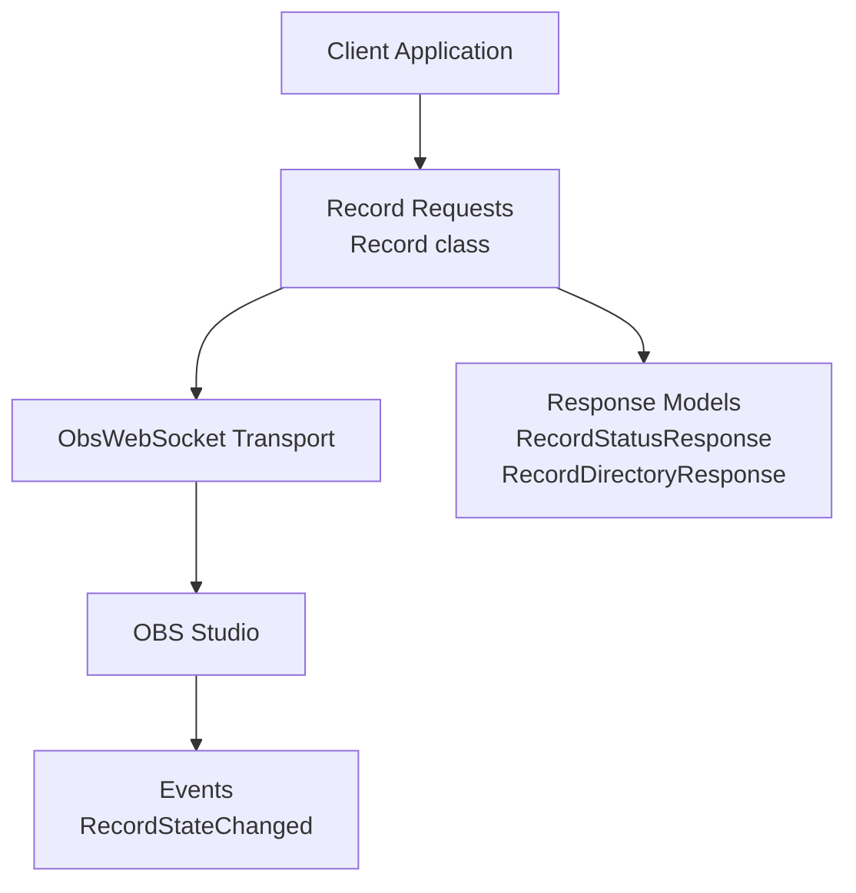
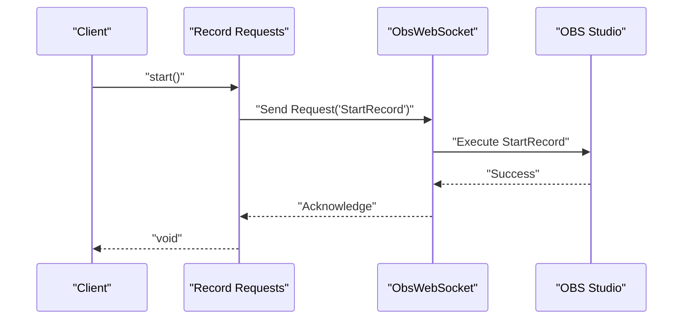
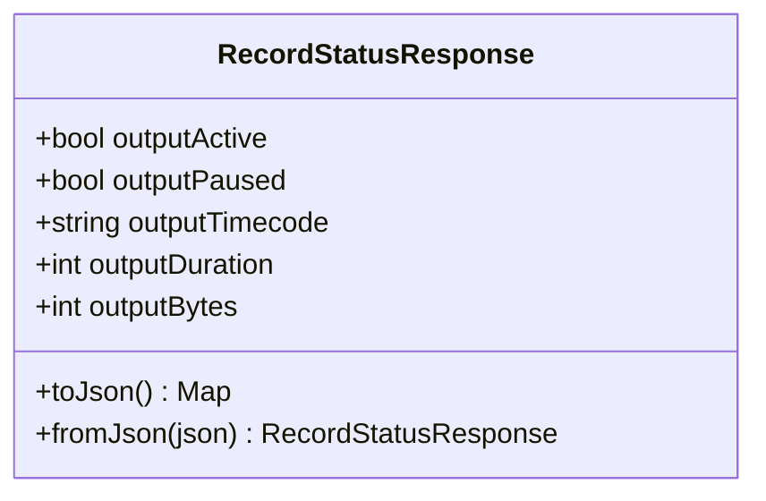
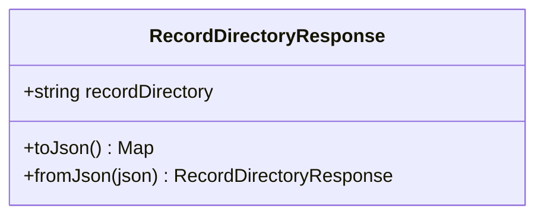
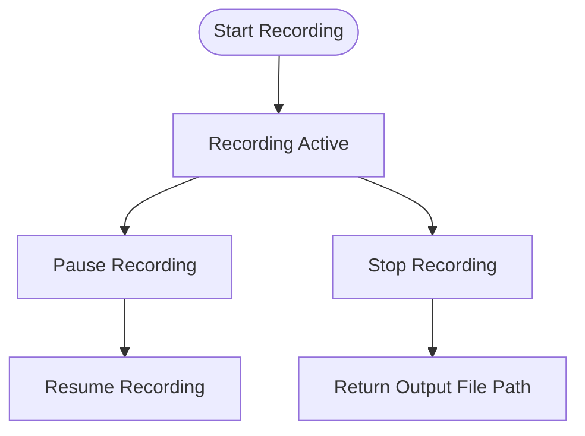
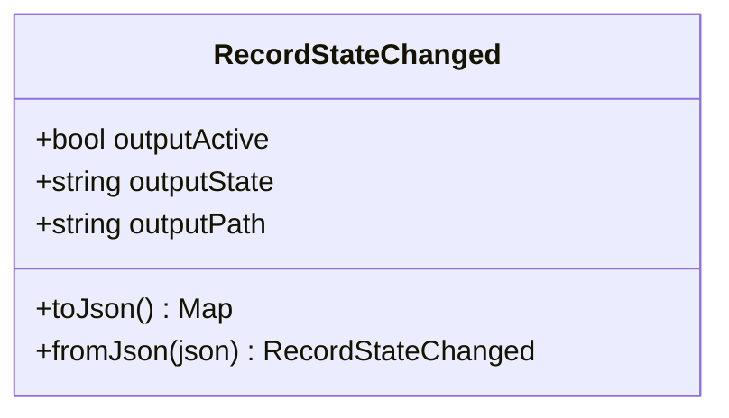
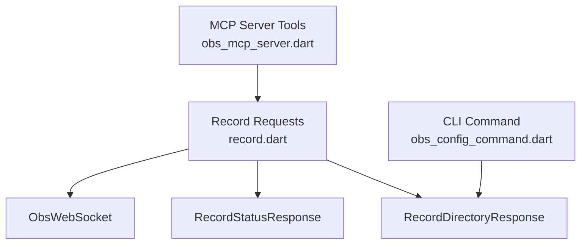
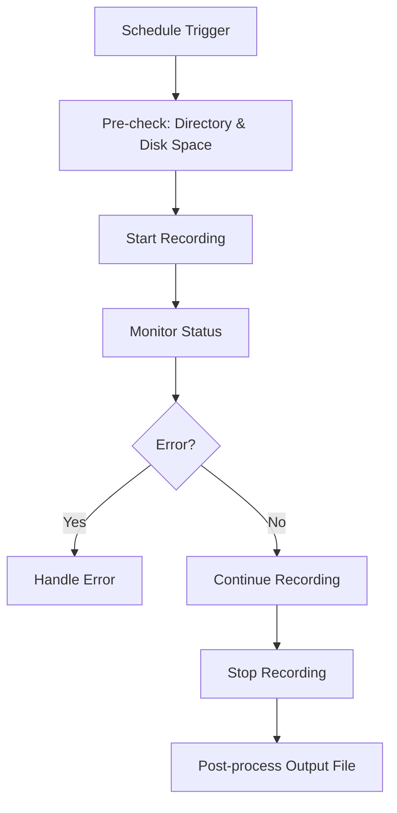
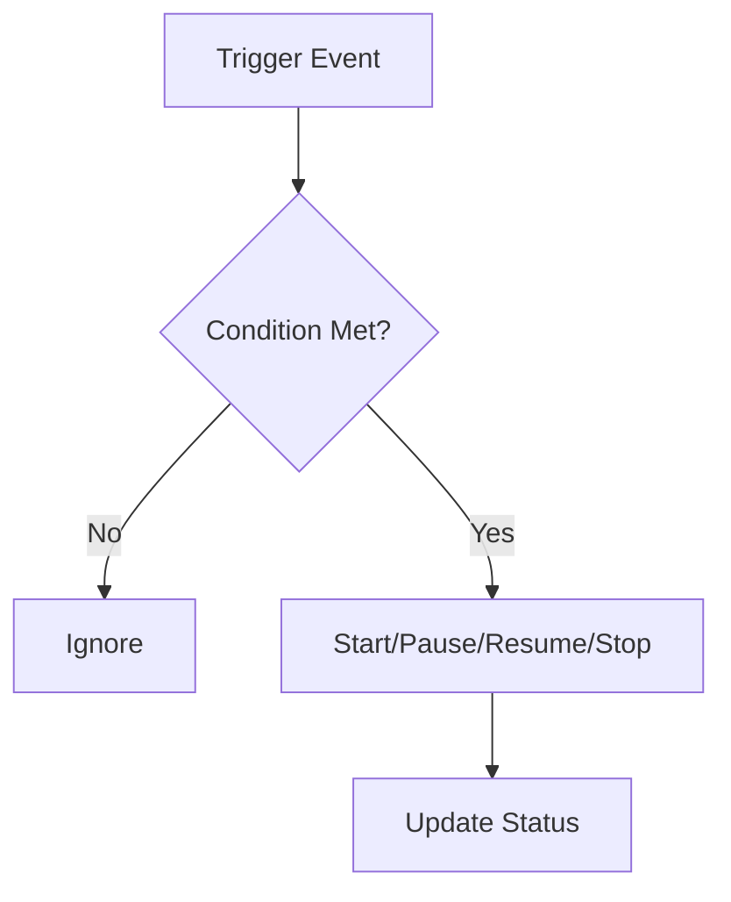

# Record Requests

<cite>
**Referenced Files in This Document**
- [request.dart](file://lib/request.dart)
- [record.dart](file://lib/src/request/record.dart)
- [record_status_response.dart](file://lib/src/model/response/record_status_response.dart)
- [record_directory_response.dart](file://lib/src/model/response/record_directory_response.dart)
- [record_state_changed.dart](file://lib/src/model/event/outputs/record_state_changed.dart)
- [obs_config_command.dart](file://lib/src/cmd/obs_config_command.dart)
- [general.dart](file://example/general.dart)
- [obs_mcp_server.dart](file://lib/src/mcp/obs_mcp_server.dart)
</cite>

## Table of Contents
1. [Introduction](#introduction)
2. [Project Structure](#project-structure)
3. [Core Components](#core-components)
4. [Architecture Overview](#architecture-overview)
5. [Detailed Component Analysis](#detailed-component-analysis)
6. [Dependency Analysis](#dependency-analysis)
7. [Performance Considerations](#performance-considerations)
8. [Troubleshooting Guide](#troubleshooting-guide)
9. [Conclusion](#conclusion)
10. [Appendices](#appendices)

## Introduction
This document provides detailed API documentation for Record Requests in the OBS WebSocket client library. It covers recording operations and management, including retrieving recording status, starting and stopping recordings, toggling pause states, and obtaining the recording directory. It also documents the data models returned by these requests, event notifications emitted during recording state changes, and practical examples for integrating recording controls into applications.

Recording quality settings, file naming patterns, storage management, automated recording workflows, disk space monitoring, file organization, and backup strategies are discussed conceptually to guide production deployments using the APIs documented here.

## Project Structure
The recording functionality is exposed via a dedicated module that integrates with the broader request and model layers. The following diagram shows how the record request module connects to the WebSocket transport and response models.

**Diagram sources**
- [record.dart:1-128](file://lib/src/request/record.dart#L1-L128)
- [record_status_response.dart:1-31](file://lib/src/model/response/record_status_response.dart#L1-L31)
- [record_directory_response.dart:1-22](file://lib/src/model/response/record_directory_response.dart#L1-L22)
- [record_state_changed.dart:1-36](file://lib/src/model/event/outputs/record_state_changed.dart#L1-L36)

**Section sources**
- [request.dart:1-19](file://lib/request.dart#L1-L19)
- [record.dart:1-128](file://lib/src/request/record.dart#L1-L128)

## Core Components
This section summarizes the primary recording APIs and their responsibilities.

- GetRecordStatus
  - Purpose: Retrieve the current recording status, including whether recording is active, paused, duration, and bytes written.
  - Response Model: RecordStatusResponse
  - Complexity Rating: 2/5
  - Added in: v5.0.0

- StartRecord / ToggleRecord
  - Purpose: Start or toggle the recording state.
  - Complexity Rating: 1/5
  - Added in: v5.0.0

- StopRecord
  - Purpose: Stop the current recording and return the output file path.
  - Response Model: String (file path)
  - Complexity Rating: 1/5
  - Added in: v5.0.0

- PauseRecord / ResumeRecord / ToggleRecordPause
  - Purpose: Control pause/resume/toggle of an active recording.
  - Complexity Rating: 1/5
  - Added in: v5.0.0

- GetRecordDirectory
  - Purpose: Retrieve the current recording output directory.
  - Response Model: RecordDirectoryResponse
  - CLI Command: get-record-directory
  - Added in: v5.0.0

**Section sources**
- [record.dart:9-127](file://lib/src/request/record.dart#L9-L127)
- [record_status_response.dart:7-31](file://lib/src/model/response/record_status_response.dart#L7-L31)
- [record_directory_response.dart:7-22](file://lib/src/model/response/record_directory_response.dart#L7-L22)
- [obs_config_command.dart:189-208](file://lib/src/cmd/obs_config_command.dart#L189-L208)

## Architecture Overview
The recording workflow spans request construction, transport over WebSocket, server-side OBS operations, and response parsing. The sequence below illustrates the end-to-end flow for starting a recording.

**Diagram sources**
- [record.dart:61-62](file://lib/src/request/record.dart#L61-L62)

## Detailed Component Analysis

### Record Status API
The GetRecordStatus API returns the current recording status, including active state, pause state, timecode, duration, and bytes written. This enables clients to monitor recording progress and derive metrics such as throughput.

**Diagram sources**
- [record_status_response.dart:7-31](file://lib/src/model/response/record_status_response.dart#L7-L31)

**Section sources**
- [record.dart:23-32](file://lib/src/request/record.dart#L23-L32)
- [record_status_response.dart:7-31](file://lib/src/model/response/record_status_response.dart#L7-L31)

### Recording Directory API
The GetRecordDirectory API retrieves the configured recording output directory. This is essential for organizing files, validating storage locations, and implementing backup strategies.

**Diagram sources**
- [record_directory_response.dart:7-22](file://lib/src/model/response/record_directory_response.dart#L7-L22)

**Section sources**
- [record.dart:1-14](file://lib/src/request/record.dart#L1-L14)
- [obs_config_command.dart:189-208](file://lib/src/cmd/obs_config_command.dart#L189-L208)
- [record_directory_response.dart:7-22](file://lib/src/model/response/record_directory_response.dart#L7-L22)

### Recording Control APIs
The following APIs provide control over the recording lifecycle:

- StartRecord / Start
- StopRecord / Stop
- ToggleRecord / Toggle
- PauseRecord / Pause
- ResumeRecord / Resume
- ToggleRecordPause / TogglePause

**Diagram sources**
- [record.dart:49-127](file://lib/src/request/record.dart#L49-L127)

**Section sources**
- [record.dart:49-127](file://lib/src/request/record.dart#L49-L127)

### Event: RecordStateChanged
When the recording state changes, OBS emits a RecordStateChanged event containing the new active state, the specific output state, and the output file path if recording was stopped.

**Diagram sources**
- [record_state_changed.dart:10-36](file://lib/src/model/event/outputs/record_state_changed.dart#L10-L36)

**Section sources**
- [record_state_changed.dart:9-36](file://lib/src/model/event/outputs/record_state_changed.dart#L9-L36)

### Example Usage: Retrieving Recording Directory
The example demonstrates how to retrieve the recording directory using the client.

- See: [general.dart:46-48](file://example/general.dart#L46-L48)

**Section sources**
- [general.dart:46-48](file://example/general.dart#L46-L48)

## Dependency Analysis
The recording module depends on the WebSocket transport and response models. The MCP server exposes convenience tools for recording operations, while the CLI provides a helper command for retrieving the recording directory.

**Diagram sources**
- [record.dart:1-128](file://lib/src/request/record.dart#L1-L128)
- [record_status_response.dart:1-31](file://lib/src/model/response/record_status_response.dart#L1-L31)
- [record_directory_response.dart:1-22](file://lib/src/model/response/record_directory_response.dart#L1-L22)
- [obs_mcp_server.dart:609-663](file://lib/src/mcp/obs_mcp_server.dart#L609-L663)
- [obs_config_command.dart:189-208](file://lib/src/cmd/obs_config_command.dart#L189-L208)

**Section sources**
- [obs_mcp_server.dart:609-663](file://lib/src/mcp/obs_mcp_server.dart#L609-L663)
- [obs_config_command.dart:189-208](file://lib/src/cmd/obs_config_command.dart#L189-L208)

## Performance Considerations
- Minimize polling frequency when checking recording status. Use events (RecordStateChanged) to react to state changes instead of repeated status queries.
- Batch operations when managing multiple recording controls to reduce network overhead.
- Monitor outputDuration and outputBytes to estimate throughput and detect stalls.

## Troubleshooting Guide
- Verify that the recording directory exists and is writable before attempting to start recording.
- Confirm that OBS is running and the WebSocket connection is established before sending recording commands.
- Subscribe to RecordStateChanged events to capture the output file path after stopping a recording.
- Use the CLI helper command to confirm the configured recording directory.

**Section sources**
- [record_state_changed.dart:9-36](file://lib/src/model/event/outputs/record_state_changed.dart#L9-L36)
- [obs_config_command.dart:189-208](file://lib/src/cmd/obs_config_command.dart#L189-L208)

## Conclusion
The Record Requests module provides a concise and robust interface for controlling and monitoring recording within OBS Studio via WebSocket. By combining status queries, control operations, and event-driven updates, developers can build reliable automation and monitoring systems around recording workflows.

## Appendices

### API Reference Summary
- GetRecordStatus
  - Description: Retrieve recording status (active, paused, duration, bytes).
  - Response: RecordStatusResponse
  - Complexity: 2/5
  - Added in: v5.0.0
  - Implementation: [record.dart:23-32](file://lib/src/request/record.dart#L23-L32)

- StartRecord / Start
  - Description: Start recording.
  - Response: void
  - Complexity: 1/5
  - Added in: v5.0.0
  - Implementation: [record.dart:61-62](file://lib/src/request/record.dart#L61-L62)

- StopRecord / Stop
  - Description: Stop recording and return output file path.
  - Response: String (file path)
  - Complexity: 1/5
  - Added in: v5.0.0
  - Implementation: [record.dart:76-80](file://lib/src/request/record.dart#L76-L80)

- ToggleRecord / Toggle
  - Description: Toggle recording on/off.
  - Response: void
  - Complexity: 1/5
  - Added in: v5.0.0
  - Implementation: [record.dart:46-47](file://lib/src/request/record.dart#L46-L47)

- PauseRecord / Pause
  - Description: Pause active recording.
  - Response: void
  - Complexity: 1/5
  - Added in: v5.0.0
  - Implementation: [record.dart:110-111](file://lib/src/request/record.dart#L110-L111)

- ResumeRecord / Resume
  - Description: Resume paused recording.
  - Response: void
  - Complexity: 1/5
  - Added in: v5.0.0
  - Implementation: [record.dart:125-126](file://lib/src/request/record.dart#L125-L126)

- ToggleRecordPause / TogglePause
  - Description: Toggle pause state of active recording.
  - Response: void
  - Complexity: 1/5
  - Added in: v5.0.0
  - Implementation: [record.dart:95-96](file://lib/src/request/record.dart#L95-L96)

- GetRecordDirectory
  - Description: Retrieve current recording output directory.
  - Response: RecordDirectoryResponse
  - CLI Command: get-record-directory
  - Implementation: [record.dart:1-14](file://lib/src/request/record.dart#L1-L14), [obs_config_command.dart:189-208](file://lib/src/cmd/obs_config_command.dart#L189-L208)

### Conceptual Workflows

#### Scheduled Recording Workflow
- Pre-recording checks: Verify recording directory and free disk space.
- Trigger recording start at a scheduled time.
- Monitor recording status and handle errors.
- On completion, retrieve the output file path from the stop response and trigger post-processing.

#### Conditional Recording Triggers
- Use events (e.g., scene change, input state) to conditionally start/stop recording.
- Implement pause/resume logic based on activity thresholds.

#### Recording Quality Optimization
- Adjust OBS video settings (resolution, FPS, bitrate) prior to recording sessions to balance quality and storage.
- Use pause/resume to minimize unnecessary writes during transitions.

#### Storage Management and Backup Strategies
- Disk space monitoring: Periodically check available disk space before starting long recordings.
- File organization: Use structured directory layouts under the configured recording directory.
- Backup: Implement offsite backups of recorded files after successful completion.